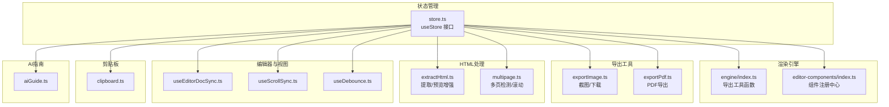
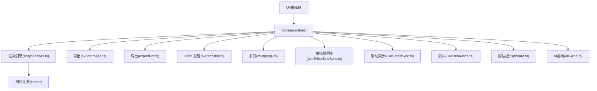
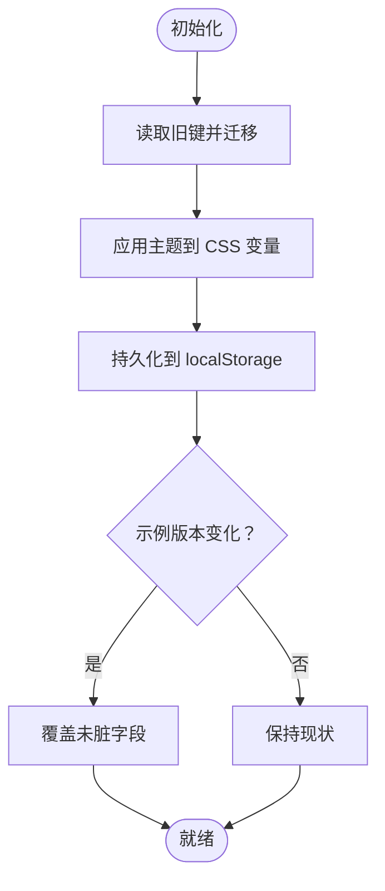
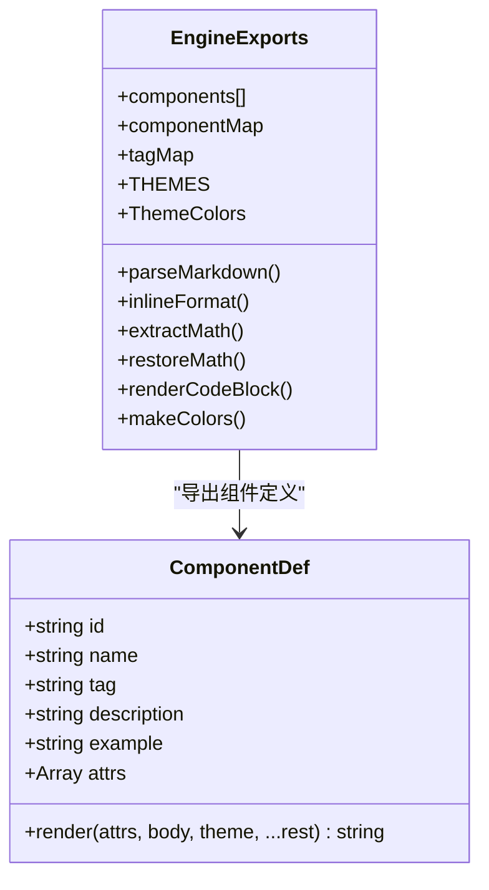
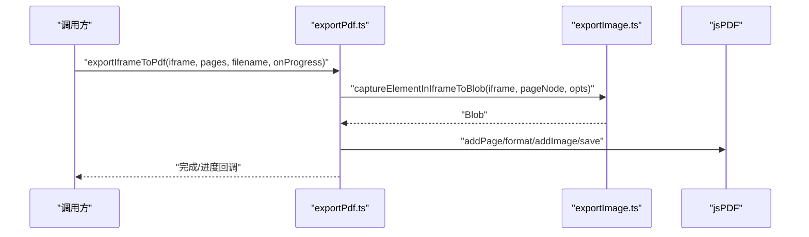
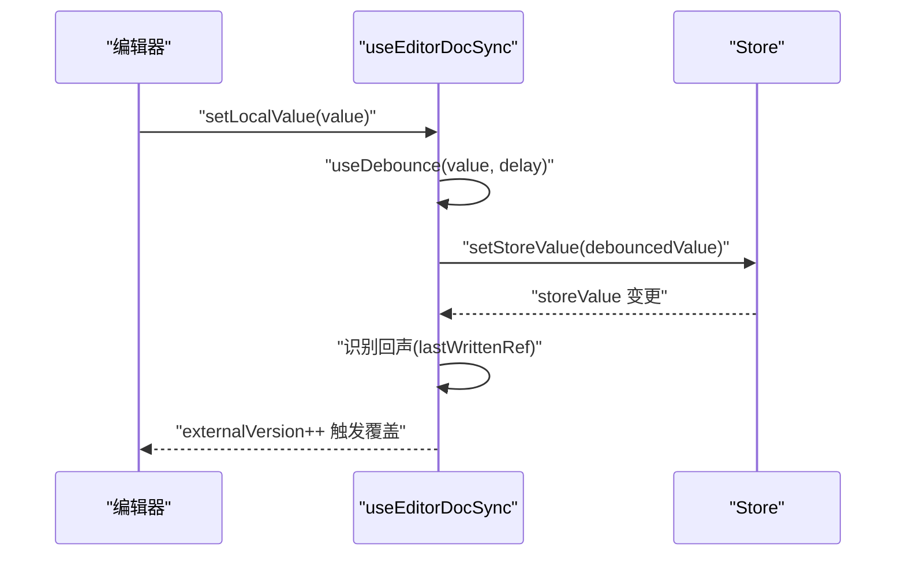
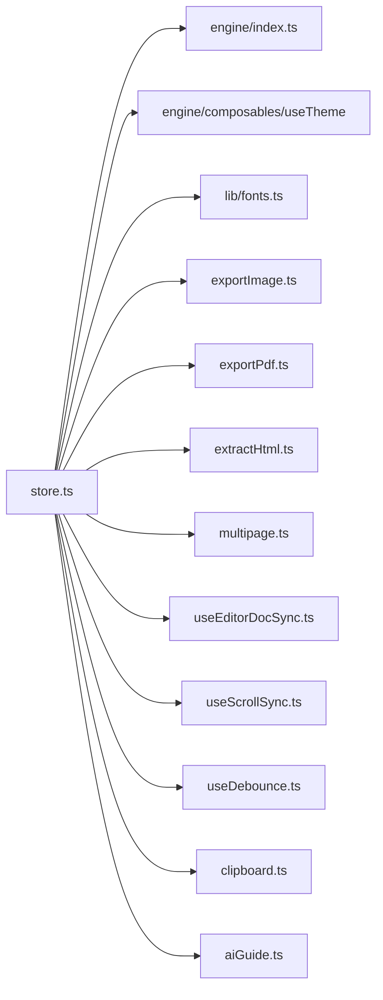

# API参考

<cite>
**本文引用的文件**
- [store.ts](file://src/lib/store.ts)
- [index.ts](file://src/engine/index.ts)
- [index.ts](file://src/engine/editor-components/index.ts)
- [exportImage.ts](file://src/lib/exportImage.ts)
- [exportPdf.ts](file://src/lib/exportPdf.ts)
- [extractHtml.ts](file://src/lib/extractHtml.ts)
- [multipage.ts](file://src/lib/multipage.ts)
- [clipboard.ts](file://src/lib/clipboard.ts)
- [useDebounce.ts](file://src/lib/useDebounce.ts)
- [useEditorDocSync.ts](file://src/lib/useEditorDocSync.ts)
- [useScrollSync.ts](file://src/lib/useScrollSync.ts)
- [aiGuide.ts](file://src/lib/aiGuide.ts)
</cite>

## 目录
1. [简介](#简介)
2. [项目结构](#项目结构)
3. [核心组件](#核心组件)
4. [架构总览](#架构总览)
5. [详细组件分析](#详细组件分析)
6. [依赖关系分析](#依赖关系分析)
7. [性能考量](#性能考量)
8. [故障排查指南](#故障排查指南)
9. [结论](#结论)
10. [附录](#附录)

## 简介
本文件为 MarkFlow 的完整 API 参考，覆盖以下方面：
- 状态管理 Store 的接口与使用方式
- 渲染引擎工具函数与组件注册中心
- 导出能力（图片、PDF、多页）的 API
- HTML 提取与预览增强工具
- 编辑器与预览同步、滚动联动等辅助 Hook
- 剪贴板复制能力
- AI 指南构建工具
- 错误处理与异常场景
- 版本兼容性与迁移指引

## 项目结构
MarkFlow 的 API 主要分布在如下模块：
- 状态管理：src/lib/store.ts
- 渲染引擎：src/engine/index.ts、src/engine/editor-components/index.ts
- 导出工具：src/lib/exportImage.ts、src/lib/exportPdf.ts
- HTML 处理：src/lib/extractHtml.ts、src/lib/multipage.ts
- 编辑器与视图交互：src/lib/useEditorDocSync.ts、src/lib/useScrollSync.ts、src/lib/useDebounce.ts
- 剪贴板：src/lib/clipboard.ts
- AI 指南：src/lib/aiGuide.ts

**图表来源**
- [store.ts:1-242](file://src/lib/store.ts#L1-L242)
- [index.ts:1-16](file://src/engine/index.ts#L1-L16)
- [index.ts:1-81](file://src/engine/editor-components/index.ts#L1-L81)
- [exportImage.ts:1-387](file://src/lib/exportImage.ts#L1-L387)
- [exportPdf.ts:1-192](file://src/lib/exportPdf.ts#L1-L192)
- [extractHtml.ts:1-113](file://src/lib/extractHtml.ts#L1-L113)
- [multipage.ts:1-45](file://src/lib/multipage.ts#L1-L45)
- [useEditorDocSync.ts:1-50](file://src/lib/useEditorDocSync.ts#L1-L50)
- [useScrollSync.ts:1-68](file://src/lib/useScrollSync.ts#L1-L68)
- [useDebounce.ts:1-18](file://src/lib/useDebounce.ts#L1-L18)
- [clipboard.ts:1-131](file://src/lib/clipboard.ts#L1-L131)
- [aiGuide.ts:1-274](file://src/lib/aiGuide.ts#L1-L274)

**章节来源**
- [store.ts:1-242](file://src/lib/store.ts#L1-L242)
- [index.ts:1-16](file://src/engine/index.ts#L1-L16)
- [index.ts:1-81](file://src/engine/editor-components/index.ts#L1-L81)
- [exportImage.ts:1-387](file://src/lib/exportImage.ts#L1-L387)
- [exportPdf.ts:1-192](file://src/lib/exportPdf.ts#L1-L192)
- [extractHtml.ts:1-113](file://src/lib/extractHtml.ts#L1-L113)
- [multipage.ts:1-45](file://src/lib/multipage.ts#L1-L45)
- [useEditorDocSync.ts:1-50](file://src/lib/useEditorDocSync.ts#L1-L50)
- [useScrollSync.ts:1-68](file://src/lib/useScrollSync.ts#L1-L68)
- [useDebounce.ts:1-18](file://src/lib/useDebounce.ts#L1-L18)
- [clipboard.ts:1-131](file://src/lib/clipboard.ts#L1-L131)
- [aiGuide.ts:1-274](file://src/lib/aiGuide.ts#L1-L274)

## 核心组件
本节概述各模块的公共 API，包括导出项、类型定义与主要职责。

- 状态管理 Store（useStore）
  - 类型与职责：集中管理应用状态（Markdown/HTML、渲染模式、输入类型、平台预设、字体、主题、图床配置、示例内容版本与脏标记等），并提供持久化与版本驱动的示例内容同步能力。
  - 关键导出：useStore（Zustand Store 实例）、RenderMode、InputType、PlatformPreset、ImageHostConfig、ImageHostType、DemoContents、DEMO_VERSION。
  - 重要方法（通过 set/update 函数暴露）：设置/更新 Markdown/HTML、切换模式与输入类型、设置平台、更新文档设置、设置字体、设置主题、设置图床配置、同步示例内容、恢复示例。
  - 存储键：m2v-store（持久化键名），并包含历史迁移逻辑。
  - 参考路径：[store.ts:54-241](file://src/lib/store.ts#L54-L241)

- 渲染引擎工具与主题
  - 导出：parseMarkdown、inlineFormat、extractMath、restoreMath、renderCodeBlock、components、componentMap、tagMap、ComponentDef、THEMES、makeColors、hexToRgb、lightenHex、darkenHex、ThemeColors。
  - 组件注册中心：components（组件定义数组）、componentMap（按 id 索引）、tagMap（按 tag 索引）。
  - 参考路径：
    - [index.ts:1-16](file://src/engine/index.ts#L1-L16)
    - [index.ts:20-81](file://src/engine/editor-components/index.ts#L20-L81)

- 导出能力
  - 图片导出：iframeToBlob、elementToBlob、downloadBlob、downloadIframeAsImage、captureElementInIframeToBlob、ImageOpts、resolveBackground。
  - PDF 导出：exportIframeToPdf（多页）、exportSinglePageToPdf（单页）、exportElementsToPdf（元素集，兼容非 iframe 场景）。
  - 参考路径：
    - [exportImage.ts:16-387](file://src/lib/exportImage.ts#L16-L387)
    - [exportPdf.ts:20-192](file://src/lib/exportPdf.ts#L20-L192)

- HTML 处理与多页
  - HTML 提取：extractHtml（从流式输出中提取 HTML）、previewHtml（注入打印/预览样式与跨域资源）。
  - 多页检测：detectPages（检测页面节点）、scrollToPage（滚动到指定页面）。
  - 参考路径：
    - [extractHtml.ts:5-113](file://src/lib/extractHtml.ts#L5-L113)
    - [multipage.ts:5-45](file://src/lib/multipage.ts#L5-L45)

- 编辑器与视图交互
  - useEditorDocSync：双向同步编辑器与 Store，防抖回写、回声识别、外部版本覆盖。
  - useScrollSync：两个滚动容器按比例联动，主导方策略避免相互拉扯。
  - useDebounce：通用防抖 Hook。
  - 参考路径：
    - [useEditorDocSync.ts:15-50](file://src/lib/useEditorDocSync.ts#L15-L50)
    - [useScrollSync.ts:3-68](file://src/lib/useScrollSync.ts#L3-L68)
    - [useDebounce.ts:1-18](file://src/lib/useDebounce.ts#L1-L18)

- 剪贴板
  - copyText、copyRichText、copyHtmlSource（富文本/HTML 源码复制，含本地图片转 base64 编译）。
  - 参考路径：[clipboard.ts:3-131](file://src/lib/clipboard.ts#L3-L131)

- AI 指南
  - buildArticleAiGuide、buildDocumentAiGuide、buildCardAiGuide（构建面向不同场景的 AI 指南文本）。
  - 参考路径：[aiGuide.ts:172-274](file://src/lib/aiGuide.ts#L172-L274)

**章节来源**
- [store.ts:54-241](file://src/lib/store.ts#L54-L241)
- [index.ts:1-16](file://src/engine/index.ts#L1-L16)
- [index.ts:20-81](file://src/engine/editor-components/index.ts#L20-L81)
- [exportImage.ts:16-387](file://src/lib/exportImage.ts#L16-L387)
- [exportPdf.ts:20-192](file://src/lib/exportPdf.ts#L20-L192)
- [extractHtml.ts:5-113](file://src/lib/extractHtml.ts#L5-L113)
- [multipage.ts:5-45](file://src/lib/multipage.ts#L5-L45)
- [useEditorDocSync.ts:15-50](file://src/lib/useEditorDocSync.ts#L15-L50)
- [useScrollSync.ts:3-68](file://src/lib/useScrollSync.ts#L3-L68)
- [useDebounce.ts:1-18](file://src/lib/useDebounce.ts#L1-L18)
- [clipboard.ts:3-131](file://src/lib/clipboard.ts#L3-L131)
- [aiGuide.ts:172-274](file://src/lib/aiGuide.ts#L172-L274)

## 架构总览
MarkFlow 的 API 设计遵循“状态集中、引擎解耦、工具聚合”的原则：
- Store 负责应用状态与持久化，提供版本驱动的示例内容同步与脏标记控制。
- 渲染引擎以纯工具函数与组件注册中心的形式对外暴露，便于在不同框架/场景复用。
- 导出工具链基于现代截图库，提供高质量图片/PDF 导出能力，并兼容 iframe 与非 iframe 场景。
- HTML 处理模块负责从 AI 流式输出中提取有效 HTML，并注入打印/预览所需样式。
- 编辑器与视图交互的 Hooks 解决高频交互中的性能与一致性问题。
- 剪贴板模块提供富文本与源码复制能力，支持本地图片转 base64。
- AI 指南模块生成面向不同平台与场景的提示词模板。

**图表来源**
- [store.ts:54-241](file://src/lib/store.ts#L54-L241)
- [index.ts:1-16](file://src/engine/index.ts#L1-L16)
- [index.ts:20-81](file://src/engine/editor-components/index.ts#L20-L81)
- [exportImage.ts:16-387](file://src/lib/exportImage.ts#L16-L387)
- [exportPdf.ts:20-192](file://src/lib/exportPdf.ts#L20-L192)
- [extractHtml.ts:5-113](file://src/lib/extractHtml.ts#L5-L113)
- [multipage.ts:5-45](file://src/lib/multipage.ts#L5-L45)
- [useEditorDocSync.ts:15-50](file://src/lib/useEditorDocSync.ts#L15-L50)
- [useScrollSync.ts:3-68](file://src/lib/useScrollSync.ts#L3-L68)
- [useDebounce.ts:1-18](file://src/lib/useDebounce.ts#L1-L18)
- [clipboard.ts:3-131](file://src/lib/clipboard.ts#L3-L131)
- [aiGuide.ts:172-274](file://src/lib/aiGuide.ts#L172-L274)

## 详细组件分析

### 状态管理 Store API（useStore）
- 类型与作用域
  - 状态键：文章/文档/卡片 Markdown、HTML、渲染模式、输入类型、平台预设、文档设置、字体、主题色、图床配置、示例版本与脏标记。
  - 方法：设置/更新 Markdown/HTML、切换模式/输入类型/平台、更新文档设置、设置字体、设置主题、设置图床配置、同步示例内容、恢复示例。
- 关键流程
  - 初始化：从 localStorage 迁移旧键，应用默认主题变量到 CSS 变量。
  - 版本驱动示例同步：仅在 DEMO_VERSION 变化时覆盖未“脏”的字段。
  - 模式切换：根据模式自动设置输入类型与平台预设。
- 错误与边界
  - 本地存储不可用时，初始化为空并回退到默认值。
  - 设置主题时应用 CSS 变量，避免样式闪烁。
- 参考路径：[store.ts:54-241](file://src/lib/store.ts#L54-L241)

**图表来源**
- [store.ts:101-156](file://src/lib/store.ts#L101-L156)
- [store.ts:194-214](file://src/lib/store.ts#L194-L214)
- [store.ts:227-230](file://src/lib/store.ts#L227-L230)

**章节来源**
- [store.ts:54-241](file://src/lib/store.ts#L54-L241)

### 渲染引擎工具与组件注册中心
- 工具函数
  - parseMarkdown：解析 Markdown。
  - inlineFormat：行内格式处理。
  - extractMath/restoreMath：数学公式抽取与恢复。
  - renderCodeBlock：代码块渲染。
- 组件注册中心
  - ComponentDef：组件定义接口（id/name/tag/description/example/attrs/render）。
  - components：组件数组。
  - componentMap/tagMap：索引映射。
- 参考路径：
  - [index.ts:1-16](file://src/engine/index.ts#L1-L16)
  - [index.ts:20-81](file://src/engine/editor-components/index.ts#L20-L81)

**图表来源**
- [index.ts:1-16](file://src/engine/index.ts#L1-L16)
- [index.ts:20-81](file://src/engine/editor-components/index.ts#L20-L81)

**章节来源**
- [index.ts:1-16](file://src/engine/index.ts#L1-L16)
- [index.ts:20-81](file://src/engine/editor-components/index.ts#L20-L81)

### 导出 API（图片与 PDF）
- 图片导出
  - ImageOpts：scale、type、backgroundColor、maxHeight。
  - iframeToBlob：将 iframe 内容渲染为 Blob，等待资源就绪、计算滚动高度、稳定 DOM 后截图。
  - elementToBlob：对指定元素截图。
  - downloadBlob：下载 Blob。
  - downloadIframeAsImage：下载 iframe 为图片。
  - captureElementInIframeToBlob：在 iframe 上下文中对特定元素进行精确截图，临时调整尺寸与样式，恢复后返回 Blob。
  - resolveBackground：解析背景色。
- PDF 导出
  - exportIframeToPdf：多页模式，逐页显示并截图，拼接到 PDF。
  - exportSinglePageToPdf：单页模式，定位内部包装器并截图生成 PDF。
  - exportElementsToPdf：非 iframe 场景，对元素集截图并生成 PDF。
- 参考路径：
  - [exportImage.ts:16-387](file://src/lib/exportImage.ts#L16-L387)
  - [exportPdf.ts:20-192](file://src/lib/exportPdf.ts#L20-L192)

**图表来源**
- [exportPdf.ts:21-89](file://src/lib/exportPdf.ts#L21-L89)
- [exportImage.ts:250-385](file://src/lib/exportImage.ts#L250-L385)

**章节来源**
- [exportImage.ts:16-387](file://src/lib/exportImage.ts#L16-L387)
- [exportPdf.ts:20-192](file://src/lib/exportPdf.ts#L20-L192)

### HTML 处理与多页 API
- HTML 提取
  - extractHtml：从流式输出中提取 HTML，支持代码块、文档声明、根标签等场景，兜底时注入最小骨架与 Tailwind CDN。
  - previewHtml：注入打印/预览样式、跨域样式表、防御性排版与分页样式。
- 多页
  - detectPages：检测页面节点（section.page/slide/card），返回索引、标签与节点。
  - scrollToPage：滚动到指定页面。
- 参考路径：
  - [extractHtml.ts:5-113](file://src/lib/extractHtml.ts#L5-L113)
  - [multipage.ts:18-45](file://src/lib/multipage.ts#L18-L45)

**章节来源**
- [extractHtml.ts:5-113](file://src/lib/extractHtml.ts#L5-L113)
- [multipage.ts:18-45](file://src/lib/multipage.ts#L18-L45)

### 编辑器与视图交互 API
- useEditorDocSync
  - 输入：storeValue、setStoreValue、防抖延迟。
  - 输出：localValue、debouncedValue、setLocalValue、externalVersion。
  - 行为：本地输入防抖回写 Store；识别回声避免丢字；外部变更递增 externalVersion 通知编辑器覆盖。
- useScrollSync
  - 输入：两个可滚动容器 RefObject 与依赖数组。
  - 行为：主导方策略，避免相互拉扯；按比例联动滚动。
- useDebounce
  - 输入：任意值与延迟。
  - 行为：返回防抖后的值。
- 参考路径：
  - [useEditorDocSync.ts:15-50](file://src/lib/useEditorDocSync.ts#L15-L50)
  - [useScrollSync.ts:3-68](file://src/lib/useScrollSync.ts#L3-L68)
  - [useDebounce.ts:1-18](file://src/lib/useDebounce.ts#L1-L18)

**图表来源**
- [useEditorDocSync.ts:20-49](file://src/lib/useEditorDocSync.ts#L20-L49)

**章节来源**
- [useEditorDocSync.ts:15-50](file://src/lib/useEditorDocSync.ts#L15-L50)
- [useScrollSync.ts:3-68](file://src/lib/useScrollSync.ts#L3-L68)
- [useDebounce.ts:1-18](file://src/lib/useDebounce.ts#L1-L18)

### 剪贴板 API
- copyText：优先使用 Clipboard API，失败时回退到 textarea + execCommand。
- copyRichText：克隆节点并编译本地图片为 base64，构造 HTML/纯文本 ClipboardItem，优先使用 Clipboard API，失败时回退。
- copyHtmlSource：将本地图片编译为 base64 后复制 HTML 源码。
- 参考路径：[clipboard.ts:3-131](file://src/lib/clipboard.ts#L3-L131)

**章节来源**
- [clipboard.ts:3-131](file://src/lib/clipboard.ts#L3-L131)

### AI 指南 API
- buildArticleAiGuide：生成长图文排版指令（含元信息、标准 Markdown、行内强调、提示框、组件、数学公式、使用规则与内容组织建议）。
- buildDocumentAiGuide：生成 A4 文档排版指令（含元信息、标准 Markdown、数学公式、排版规范与要求）。
- buildCardAiGuide：生成小红书卡片排版指令（含输出结构、排版规则、分页建议）。
- 参考路径：[aiGuide.ts:172-274](file://src/lib/aiGuide.ts#L172-L274)

**章节来源**
- [aiGuide.ts:172-274](file://src/lib/aiGuide.ts#L172-L274)

## 依赖关系分析
- Store 依赖
  - 渲染引擎工具与组件注册中心（用于示例内容与主题）。
  - 字体与文档模型（用于默认设置与字体选择）。
- 导出工具依赖
  - modern-screenshot（截图）、jsPDF（PDF）、exportImage.ts 内部函数（PDF 复用截图能力）。
- HTML 处理依赖
  - 注入打印与预览样式，增强截图质量与 PDF 一致性。
- 编辑器与视图交互
  - 依赖 React Hooks 与浏览器滚动 API。
- 剪贴板
  - 依赖 Clipboard API 与回退方案。
- AI 指南
  - 依赖组件注册中心与主题工具。

**图表来源**
- [store.ts:1-242](file://src/lib/store.ts#L1-L242)
- [index.ts:1-16](file://src/engine/index.ts#L1-L16)
- [exportImage.ts:1-387](file://src/lib/exportImage.ts#L1-L387)
- [exportPdf.ts:1-192](file://src/lib/exportPdf.ts#L1-L192)
- [extractHtml.ts:1-113](file://src/lib/extractHtml.ts#L1-L113)
- [multipage.ts:1-45](file://src/lib/multipage.ts#L1-L45)
- [useEditorDocSync.ts:1-50](file://src/lib/useEditorDocSync.ts#L1-L50)
- [useScrollSync.ts:1-68](file://src/lib/useScrollSync.ts#L1-L68)
- [useDebounce.ts:1-18](file://src/lib/useDebounce.ts#L1-L18)
- [clipboard.ts:1-131](file://src/lib/clipboard.ts#L1-L131)
- [aiGuide.ts:1-274](file://src/lib/aiGuide.ts#L1-L274)

**章节来源**
- [store.ts:1-242](file://src/lib/store.ts#L1-L242)
- [index.ts:1-16](file://src/engine/index.ts#L1-L16)
- [exportImage.ts:1-387](file://src/lib/exportImage.ts#L1-L387)
- [exportPdf.ts:1-192](file://src/lib/exportPdf.ts#L1-L192)
- [extractHtml.ts:1-113](file://src/lib/extractHtml.ts#L1-L113)
- [multipage.ts:1-45](file://src/lib/multipage.ts#L1-L45)
- [useEditorDocSync.ts:1-50](file://src/lib/useEditorDocSync.ts#L1-L50)
- [useScrollSync.ts:1-68](file://src/lib/useScrollSync.ts#L1-L68)
- [useDebounce.ts:1-18](file://src/lib/useDebounce.ts#L1-L18)
- [clipboard.ts:1-131](file://src/lib/clipboard.ts#L1-L131)
- [aiGuide.ts:1-274](file://src/lib/aiGuide.ts#L1-L274)

## 性能考量
- 截图稳定性
  - 等待文档就绪（样式表、字体、图片加载完成），使用 MutationObserver 与帧渲染稳定机制，减少抖动与跨域问题。
- 缩放与尺寸
  - 默认高倍缩放提升清晰度，同时限制最大高度避免超大图像。
- 防抖与回写
  - 编辑器输入使用防抖降低 Store 写入频率，避免冗余与回声。
- 滚动联动
  - 主导方策略配合 requestAnimationFrame，避免相互拉扯与重复触发。
- PDF 生成
  - 多页模式逐页显示并截图，单页模式定位包装器，减少无关空白区域。

[本节为通用指导，无需具体文件分析]

## 故障排查指南
- 截图失败
  - 检查 iframe 是否已就绪、内容是否存在、是否触发跨域限制。
  - 参考：[exportImage.ts:152-197](file://src/lib/exportImage.ts#L152-L197)
- PDF 导出空白或背景丢失
  - 确认 resolveBackground 是否正确解析背景色，检查页面节点可见性与尺寸。
  - 参考：[exportPdf.ts:49-89](file://src/lib/exportPdf.ts#L49-L89)
- 多页滚动无效
  - 确认页面节点选择器匹配（section.page/slide/card），检查滚动容器是否正确传入。
  - 参考：[multipage.ts:18-45](file://src/lib/multipage.ts#L18-L45)
- 剪贴板复制失败
  - 检查浏览器权限与安全上下文，确认本地图片是否成功编译为 base64。
  - 参考：[clipboard.ts:64-100](file://src/lib/clipboard.ts#L64-L100)
- 示例内容未更新
  - 确认 DEMO_VERSION 是否变化，脏标记是否正确设置。
  - 参考：[store.ts:194-214](file://src/lib/store.ts#L194-L214)

**章节来源**
- [exportImage.ts:152-197](file://src/lib/exportImage.ts#L152-L197)
- [exportPdf.ts:49-89](file://src/lib/exportPdf.ts#L49-L89)
- [multipage.ts:18-45](file://src/lib/multipage.ts#L18-L45)
- [clipboard.ts:64-100](file://src/lib/clipboard.ts#L64-L100)
- [store.ts:194-214](file://src/lib/store.ts#L194-L214)

## 结论
MarkFlow 的 API 以 Store 为核心，围绕渲染引擎、导出工具、HTML 处理与交互 Hooks 构建，形成高内聚、低耦合的模块化体系。通过版本驱动的示例同步、稳定的截图与 PDF 导出、完善的回退方案与性能优化，满足从编辑到导出的一体化需求。建议在集成时优先使用 Store 的统一入口，并结合导出工具与 HTML 处理模块实现高质量的预览与交付。

[本节为总结，无需具体文件分析]

## 附录

### 版本兼容性与迁移指南
- 示例内容版本（DEMO_VERSION）
  - 当示例内容更新时，增加 DEMO_VERSION，系统会在版本变化时覆盖未“脏”的字段，避免覆盖用户已编辑内容。
  - 参考：[store.ts:31](file://src/lib/store.ts#L31)、[store.ts:194-214](file://src/lib/store.ts#L194-L214)
- 旧键迁移
  - 初始化阶段从旧键迁移至新键，若检测到新存储存在则跳过迁移。
  - 参考：[store.ts:101-156](file://src/lib/store.ts#L101-L156)
- 导出 API 变更
  - PDF 导出新增多页模式与单页模式，兼容非 iframe 场景的 exportElementsToPdf。
  - 参考：[exportPdf.ts:21-192](file://src/lib/exportPdf.ts#L21-L192)
- 组件注册中心
  - 新增组件时通过 editor-components/index.ts 汇总导出，保持统一入口。
  - 参考：[index.ts:55-81](file://src/engine/editor-components/index.ts#L55-L81)

**章节来源**
- [store.ts:31](file://src/lib/store.ts#L31)
- [store.ts:101-156](file://src/lib/store.ts#L101-L156)
- [store.ts:194-214](file://src/lib/store.ts#L194-L214)
- [exportPdf.ts:21-192](file://src/lib/exportPdf.ts#L21-L192)
- [index.ts:55-81](file://src/engine/editor-components/index.ts#L55-L81)