# 工具函数API

<cite>
**本文引用的文件**
- [clipboard.ts](file://src/lib/clipboard.ts)
- [aiGuide.ts](file://src/lib/aiGuide.ts)
- [extractHtml.ts](file://src/lib/extractHtml.ts)
- [fonts.ts](file://src/lib/fonts.ts)
- [designPrompts.ts](file://src/data/designPrompts.ts)
- [designPrompts.test.ts](file://src/data/designPrompts.test.ts)
- [helpers.ts](file://src/engine/utils/helpers.ts)
- [components.ts](file://src/engine/utils/components.ts)
- [store.ts](file://src/lib/store.ts)
- [useDebounce.ts](file://src/lib/useDebounce.ts)
- [useEditorDocSync.ts](file://src/lib/useEditorDocSync.ts)
- [exportImage.ts](file://src/lib/exportImage.ts)
- [exportPdf.ts](file://src/lib/exportPdf.ts)
- [ArticlePreview.tsx](file://src/modes/article/ArticlePreview.tsx)
- [documentModel.ts](file://src/modes/document/documentModel.ts)
- [FontSelect.tsx](file://src/components/ui/FontSelect.tsx)
</cite>

## 目录
1. [简介](#简介)
2. [项目结构](#项目结构)
3. [核心组件](#核心组件)
4. [架构总览](#架构总览)
5. [详细组件分析](#详细组件分析)
6. [依赖分析](#依赖分析)
7. [性能考量](#性能考量)
8. [故障排查指南](#故障排查指南)
9. [结论](#结论)
10. [附录](#附录)

## 简介
本文件为 MarkFlow 工具函数库的 API 参考文档，聚焦以下能力：
- 剪贴板操作：复制纯文本、富文本与 HTML 源码，含图片占位符到 base64 的编译策略与降级方案。
- AI 辅助：构建面向不同场景（长图文、A4 文档、小红书卡片）的提示词指令，便于与外部 AI 协作。
- HTML 提取与预览：从 AI 输出中提取有效 HTML，注入打印与预览所需样式，保障截图与 PDF 导出质量。
- 字体管理：提供字体族映射与 CSS 字体声明，配合主题系统与存储状态使用。
- 设计提示词库：内置风格化提示词库，支持查询与构建定制化提示词。
- 通用工具函数：字符串处理、颜色转换、属性解析、组件渲染辅助等。
- 组合使用示例与最佳实践：如何将上述能力串联，提升内容创作与导出效率。
- 扩展接口与自定义开发：如何基于现有工具函数扩展新的功能。

## 项目结构
工具函数主要分布在以下位置：
- 剪贴板与导出：src/lib/clipboard.ts、src/lib/exportImage.ts、src/lib/exportPdf.ts
- AI 提示词：src/lib/aiGuide.ts
- HTML 提取与预览：src/lib/extractHtml.ts
- 字体管理：src/lib/fonts.ts
- 设计提示词库：src/data/designPrompts.ts（含测试 src/data/designPrompts.test.ts）
- 通用工具：src/engine/utils/helpers.ts、src/engine/utils/components.ts
- 状态与存储：src/lib/store.ts
- React Hooks：src/lib/useDebounce.ts、src/lib/useEditorDocSync.ts

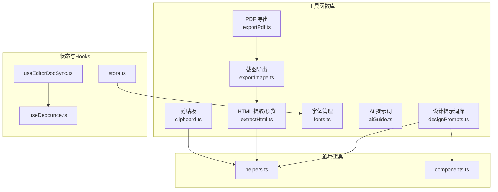

**图表来源**
- [clipboard.ts:1-122](file://src/lib/clipboard.ts#L1-L122)
- [extractHtml.ts:1-113](file://src/lib/extractHtml.ts#L1-L113)
- [fonts.ts:1-16](file://src/lib/fonts.ts#L1-L16)
- [aiGuide.ts:1-274](file://src/lib/aiGuide.ts#L1-L274)
- [exportImage.ts:1-387](file://src/lib/exportImage.ts#L1-L387)
- [exportPdf.ts:1-192](file://src/lib/exportPdf.ts#L1-L192)
- [designPrompts.ts:1-1132](file://src/data/designPrompts.ts#L1-L1132)
- [helpers.ts:1-115](file://src/engine/utils/helpers.ts#L1-L115)
- [components.ts:1-333](file://src/engine/utils/components.ts#L1-L333)
- [store.ts:1-242](file://src/lib/store.ts#L1-L242)
- [useDebounce.ts:1-18](file://src/lib/useDebounce.ts#L1-L18)
- [useEditorDocSync.ts:1-50](file://src/lib/useEditorDocSync.ts#L1-L50)

**章节来源**
- [clipboard.ts:1-122](file://src/lib/clipboard.ts#L1-L122)
- [aiGuide.ts:1-274](file://src/lib/aiGuide.ts#L1-L274)
- [extractHtml.ts:1-113](file://src/lib/extractHtml.ts#L1-L113)
- [fonts.ts:1-16](file://src/lib/fonts.ts#L1-L16)
- [designPrompts.ts:1-1132](file://src/data/designPrompts.ts#L1-L1132)
- [helpers.ts:1-115](file://src/engine/utils/helpers.ts#L1-L115)
- [components.ts:1-333](file://src/engine/utils/components.ts#L1-L333)
- [store.ts:1-242](file://src/lib/store.ts#L1-L242)
- [useDebounce.ts:1-18](file://src/lib/useDebounce.ts#L1-L18)
- [useEditorDocSync.ts:1-50](file://src/lib/useEditorDocSync.ts#L1-L50)

## 核心组件
- 剪贴板操作
  - 复制纯文本（带降级方案）
  - 复制富文本（保留内联样式，自动编译本地图片为 base64，**新增字体族参数支持**）
  - 复制 HTML 源码（将图片动态替换为 base64）
- AI 辅助
  - 构建长图文排版提示词
  - 构建 A4 文档排版提示词
  - 构建小红书卡片提示词
- HTML 提取与预览
  - 从流式输出中提取 HTML 文档
  - 注入打印与预览样式，保证截图与 PDF 导出质量
- 字体管理
  - 字体族选项与 CSS 字体声明
  - 与主题系统联动
- 设计提示词库
  - 风格分类、视觉语调、家族与展示级别
  - 构建定制化提示词
- 通用工具函数
  - 字符串转义、换行处理、CJK 自动加空格
  - 颜色转换与透明度叠加
  - 属性解析
  - 组件渲染辅助
- 状态与 Hooks
  - 防抖 Hook
  - 编辑器与 Store 同步
  - 应用状态（主题、字体、平台等）

**章节来源**
- [clipboard.ts:3-122](file://src/lib/clipboard.ts#L3-L122)
- [aiGuide.ts:172-274](file://src/lib/aiGuide.ts#L172-L274)
- [extractHtml.ts:5-113](file://src/lib/extractHtml.ts#L5-L113)
- [fonts.ts:1-16](file://src/lib/fonts.ts#L1-L16)
- [designPrompts.ts:1-1132](file://src/data/designPrompts.ts#L1-L1132)
- [helpers.ts:1-115](file://src/engine/utils/helpers.ts#L1-L115)
- [components.ts:1-333](file://src/engine/utils/components.ts#L1-L333)
- [useDebounce.ts:1-18](file://src/lib/useDebounce.ts#L1-L18)
- [useEditorDocSync.ts:1-50](file://src/lib/useEditorDocSync.ts#L1-L50)
- [store.ts:1-242](file://src/lib/store.ts#L1-L242)

## 架构总览
工具函数围绕"内容创作 → 预览渲染 → 导出"的闭环工作流组织，剪贴板与 HTML 提取负责与外部 AI 的交互，AI 提示词与设计提示词库提供创作约束与风格指导，字体管理与状态系统保障一致性与可定制性。

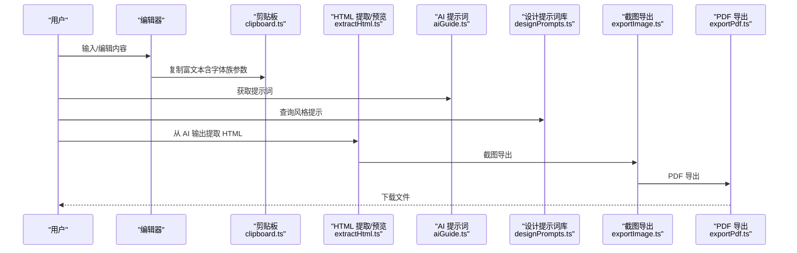

**图表来源**
- [clipboard.ts:66-99](file://src/lib/clipboard.ts#L66-L99)
- [extractHtml.ts:51-113](file://src/lib/extractHtml.ts#L51-L113)
- [aiGuide.ts:172-274](file://src/lib/aiGuide.ts#L172-L274)
- [designPrompts.ts:1-1132](file://src/data/designPrompts.ts#L1-L1132)
- [exportImage.ts:152-197](file://src/lib/exportImage.ts#L152-L197)
- [exportPdf.ts:21-89](file://src/lib/exportPdf.ts#L21-L89)

## 详细组件分析

### 剪贴板操作 API
- 复制纯文本
  - 函数：copyText(text: string) -> Promise<boolean>
  - 行为：优先使用 Clipboard API；失败时通过 textarea + execCommand 降级
  - 适用：快速复制纯文本，兼容性优先
- 复制富文本
  - 函数：copyRichText(contentEl: HTMLElement, fontFamily?: string) -> Promise<boolean>
  - 参数：contentEl（要复制的元素），fontFamily（可选字体族名称）
  - 行为：克隆节点，编译本地图片占位符为 base64，构造 ClipboardItem 同时包含 text/html 与 text/plain；失败时降级为选区 + execCommand
  - 数据处理：compileElementImages 会遍历 img 标签，将 blob: 或 img:// 替换为 base64
  - **新增功能**：当提供 fontFamily 参数时，会在复制的 HTML 中注入字体族样式，确保粘贴到支持富文本的应用中保持指定字体
  - 适用：复制带样式的富文本，确保粘贴到支持富文本的应用中仍保留结构和字体
- 复制 HTML 源码
  - 函数：copyHtmlSource(contentEl: HTMLElement) -> Promise<boolean>
  - 行为：编译图片后复制 innerHTML；失败时降级为 textarea + execCommand
  - 适用：复制 HTML 源码，便于二次处理或粘贴到支持 HTML 的编辑器

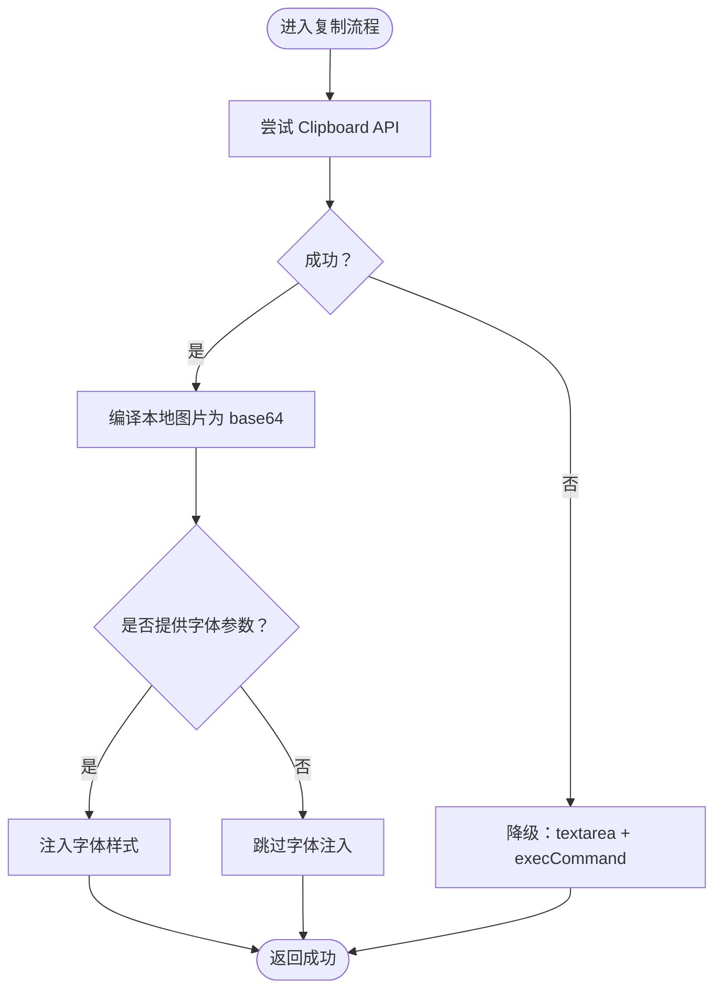

**图表来源**
- [clipboard.ts:66-99](file://src/lib/clipboard.ts#L66-L99)

**章节来源**
- [clipboard.ts:3-122](file://src/lib/clipboard.ts#L3-L122)

### AI 辅助 API
- 构建长图文排版提示词
  - 函数：buildArticleAiGuide() -> string
  - 内容：包含元信息、标准 Markdown、行内强调语法、提示框、块级组件、数学公式、使用规则与内容组织建议
- 构建 A4 文档排版提示词
  - 函数：buildDocumentAiGuide() -> string
  - 内容：包含元信息、标准 Markdown 与文档规范、数学公式、排版规范与要求
- 构建小红书卡片提示词
  - 函数：buildCardAiGuide(platform: string, aspect: string) -> string
  - 内容：YAML frontmatter、输出结构、排版规则、分页建议
- 兼容导出：buildAiGuide() -> string（等价于长图文提示词）

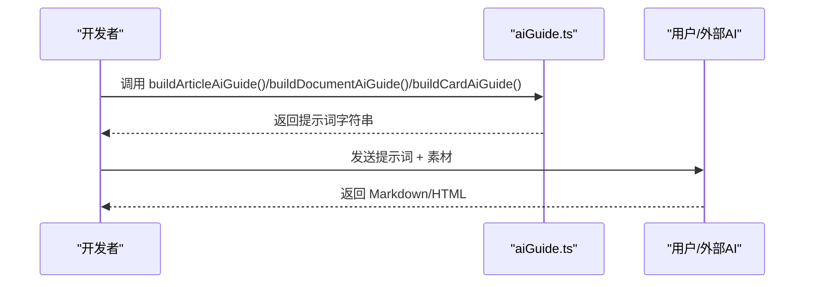

**图表来源**
- [aiGuide.ts:172-274](file://src/lib/aiGuide.ts#L172-L274)

**章节来源**
- [aiGuide.ts:1-274](file://src/lib/aiGuide.ts#L1-L274)

### HTML 提取与预览 API
- 从流式输出提取 HTML
  - 函数：extractHtml(streamed: string) -> string
  - 行为：去除代码块围栏、查找 DOCTYPE/HTML 标签、以 < 开头信任、兜底注入 Tailwind CDN 的最小骨架
- 预览 HTML 注入
  - 函数：previewHtml(input: string) -> string
  - 行为：自动为样式表注入 crossorigin="anonymous"；注入打印与屏幕居中预览 CSS；保证闭合标签与兜底 body/html

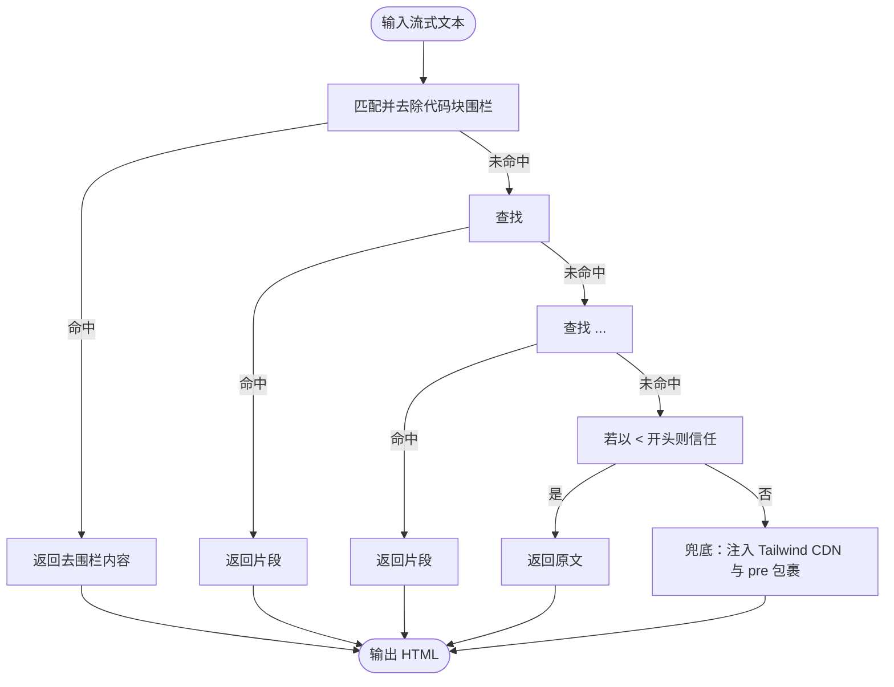

**图表来源**
- [extractHtml.ts:5-48](file://src/lib/extractHtml.ts#L5-L48)

**章节来源**
- [extractHtml.ts:1-113](file://src/lib/extractHtml.ts#L1-L113)

### 字体管理 API
- 字体族选项
  - 类型：FontFamilyOption = 'songti' | 'fangsong' | 'heiti' | 'lxgwwenkai'
- 字体族 CSS 生成
  - 函数：getFontFamilyCss(option: FontFamilyOption) -> string
  - 行为：根据选项返回对应的 CSS 字体声明，包含回退字体与系统默认
- 字体选择组件
  - 组件：FontSelect（供 ArticleMode、DocumentMode、CardMode 共用）
  - 功能：提供宋体、仿宋、黑体、霞鹜文楷四种字体选择

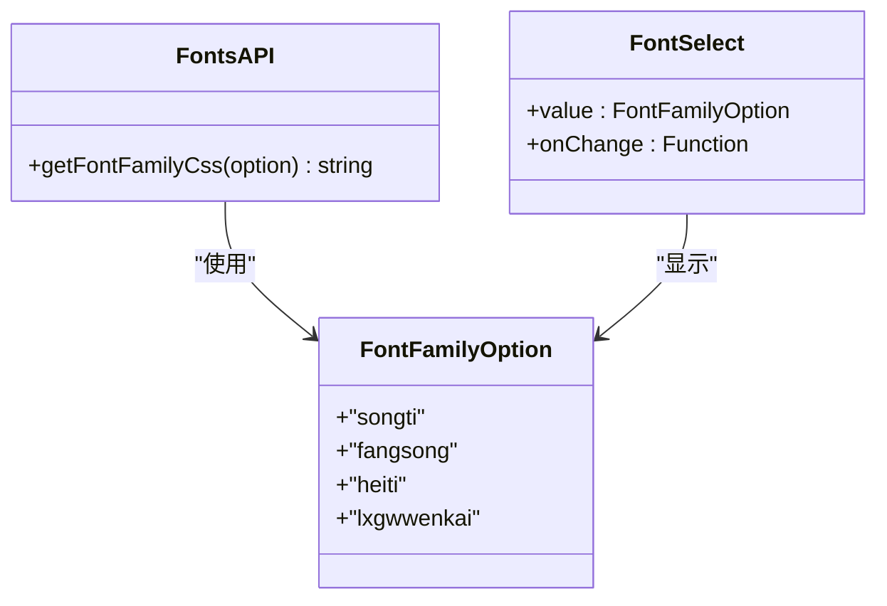

**图表来源**
- [fonts.ts:1-16](file://src/lib/fonts.ts#L1-L16)
- [FontSelect.tsx:1-34](file://src/components/ui/FontSelect.tsx#L1-L34)

**章节来源**
- [fonts.ts:1-16](file://src/lib/fonts.ts#L1-L16)
- [FontSelect.tsx:1-34](file://src/components/ui/FontSelect.tsx#L1-L34)

### 设计提示词库 API
- 数据模型
  - DesignStyle 接口：id/name/category/accent/description/outputType/visualTone/family/displayLevel/style
  - 枚举：OUTPUT_TYPES、VISUAL_TONES
  - 元数据映射：STYLE_METADATA（按 id 分组）
- 构建提示词
  - 函数：buildDesignPrompt(style: DesignStyle) -> string
  - 行为：基于样式元数据与内容约束生成提示词，包含"内容优先""风格锁定""强制分页"等约束
- 查询与筛选
  - 支持按 outputType、visualTone、family、displayLevel 进行筛选
  - 支持按 category 前缀分组（演示汇报、科技产品、设计创意、媒体内容、数据分析、文档知识）

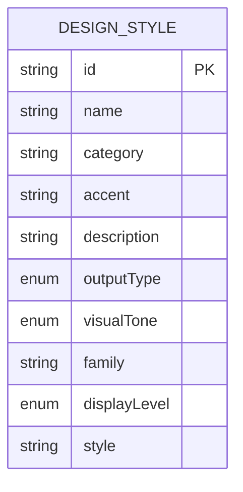

**图表来源**
- [designPrompts.ts:6-44](file://src/data/designPrompts.ts#L6-L44)

**章节来源**
- [designPrompts.ts:1-1132](file://src/data/designPrompts.ts#L1-L1132)
- [designPrompts.test.ts:1-149](file://src/data/designPrompts.test.ts#L1-L149)

### 通用工具函数 API
- 字符串与文本处理
  - esc(s: string) -> string：HTML 转义
  - leaf(s: string | number) -> string：CJK 自动加空格，换行拆分为 span +  
  - nl2br(s: string) -> string：换行转  
  - pangu(text: string) -> string：中文与英文字母/数字之间自动加空格
- 颜色与样式
  - hexToRgb(hex: string) -> string：十六进制转 RGB
  - lightenHex(hex: string, factor: number) -> string：提亮十六进制颜色
  - withAlpha(color: string, alpha?: number) -> string：为任意颜色添加透明度
- 属性解析
  - parseAttrs(s: string) -> Record<string, string>：解析 key="val"、key=val、布尔属性
- 组件渲染辅助
  - renderFrontMatter(meta, fullText, t) -> string
  - parseSteps(lines, start, t) -> { html, next }
  - parseBadges(lines, start, t) -> { html, next }
  - parseCtaBlock(lines, start, t) -> { html, next }
  - parseCtaTag(lines, start, t) -> { html, next }
  - parseBreaking(lines, start, t) -> { html, next }
  - parseCtaInline(lines, start, t) -> { html, next }
  - parseCompare(lines, start, t) -> { html, next }
  - parseCallout(lines, start, t) -> { html, next }
  - parseEngage(lines, start, t) -> { html, next }
  - parseGallery(lines, start) -> { html, next }

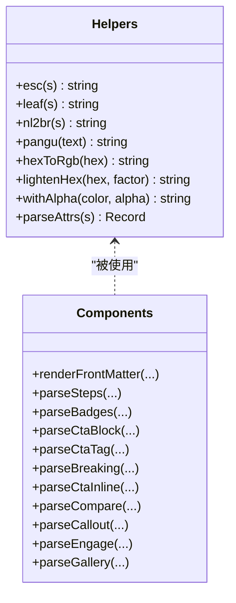

**图表来源**
- [helpers.ts:1-115](file://src/engine/utils/helpers.ts#L1-L115)
- [components.ts:1-333](file://src/engine/utils/components.ts#L1-L333)

**章节来源**
- [helpers.ts:1-115](file://src/engine/utils/helpers.ts#L1-L115)
- [components.ts:1-333](file://src/engine/utils/components.ts#L1-L333)

### 状态与 Hooks API
- 防抖 Hook
  - 函数：useDebounce<T>(value: T, delay: number) -> T
  - 行为：返回延迟后的值，清理定时器避免泄漏
- 编辑器与 Store 同步
  - 函数：useEditorDocSync(storeValue, setStoreValue, delay?) -> { localValue, debouncedValue, setLocalValue, externalVersion }
  - 行为：本地输入防抖回写 Store；识别回写回声避免丢字；外部变更递增 externalVersion 通知覆盖文档
- 应用状态（Zustand）
  - 类型：RenderMode/InputType/PlatformPreset
  - 字段：articleMarkdown/documentMarkdown/cardMarkdown/html/mode/inputType/platform/documentSettings/articleFont/cardFont/accent/accentDark/colors/imageHostConfig
  - 方法：setArticleMarkdown/setDocumentMarkdown/setCardMarkdown/setHtml/syncDemoContent/restoreDemo/setMode/setInputType/setPlatform/updateDocumentSettings/setArticleFont/setCardFont/setTheme
  - 作用：持久化存储、主题与字体联动、平台预设、示例内容同步

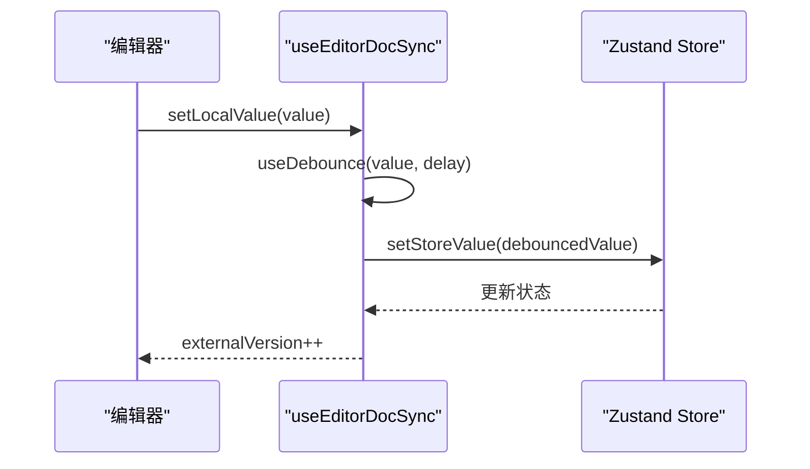

**图表来源**
- [useEditorDocSync.ts:20-49](file://src/lib/useEditorDocSync.ts#L20-L49)
- [store.ts:54-92](file://src/lib/store.ts#L54-L92)

**章节来源**
- [useDebounce.ts:1-18](file://src/lib/useDebounce.ts#L1-L18)
- [useEditorDocSync.ts:1-50](file://src/lib/useEditorDocSync.ts#L1-L50)
- [store.ts:1-242](file://src/lib/store.ts#L1-L242)

### 导出能力 API
- 截图导出（PNG/JPEG/WEBP）
  - 函数：iframeToBlob(iframe, opts?) -> Promise<Blob>
  - 函数：elementToBlob(element, opts?) -> Promise<Blob>
  - 函数：captureElementInIframeToBlob(iframe, element, opts?) -> Promise<Blob>
  - 函数：downloadBlob(blob, filename) -> void
  - 函数：downloadIframeAsImage(iframe, basename?) -> Promise<void>
  - 行为：等待字体/图片/样式表加载；计算布局宽高；设置背景色；截图并下载
- PDF 导出
  - 函数：exportIframeToPdf(iframe, pageNodes, filename, onProgress?) -> Promise<void>
  - 函数：exportSinglePageToPdf(iframe, filename) -> Promise<void>
  - 函数：exportElementsToPdf(elements, filename, opts?, onProgress?) -> Promise<void>
  - 行为：逐页隐藏其他页，截图后合并为 PDF；支持单页与多页模式

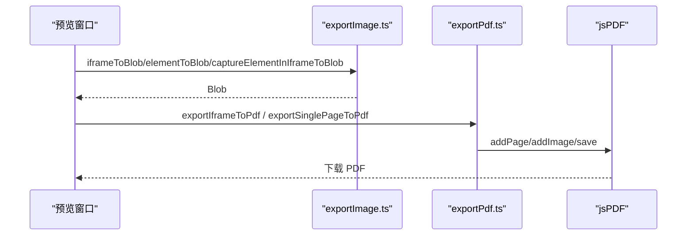

**图表来源**
- [exportImage.ts:152-387](file://src/lib/exportImage.ts#L152-L387)
- [exportPdf.ts:21-192](file://src/lib/exportPdf.ts#L21-L192)

**章节来源**
- [exportImage.ts:1-387](file://src/lib/exportImage.ts#L1-L387)
- [exportPdf.ts:1-192](file://src/lib/exportPdf.ts#L1-L192)

## 依赖分析
- 组件耦合
  - 剪贴板依赖通用工具（helpers）进行图片编译与降级
  - HTML 提取依赖 helpers 的转义与稳定性等待
  - 导出模块依赖截图库与 PDF 库，内部相互协作
  - 设计提示词库与组件渲染辅助共同服务于内容生成与展示
- 外部依赖
  - 现代截图库（modern-screenshot）：domToBlob/waitUntilLoad
  - jsPDF：PDF 生成与导出
  - Zustand：应用状态管理与持久化

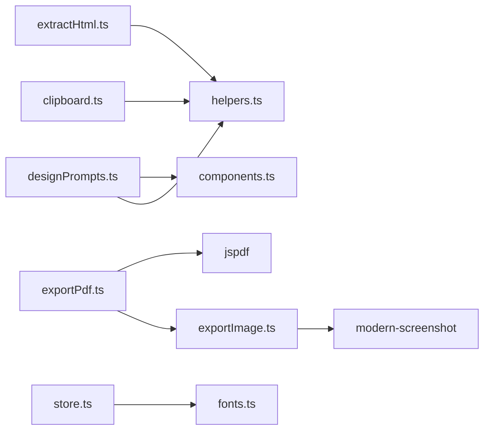

**图表来源**
- [clipboard.ts:1-2](file://src/lib/clipboard.ts#L1-L2)
- [extractHtml.ts:1-5](file://src/lib/extractHtml.ts#L1-L5)
- [exportImage.ts:7-14](file://src/lib/exportImage.ts#L7-L14)
- [exportPdf.ts:7-8](file://src/lib/exportPdf.ts#L7-L8)
- [designPrompts.ts:1-8](file://src/data/designPrompts.ts#L1-L8)
- [store.ts:3-8](file://src/lib/store.ts#L3-L8)

**章节来源**
- [clipboard.ts:1-2](file://src/lib/clipboard.ts#L1-L2)
- [extractHtml.ts:1-5](file://src/lib/extractHtml.ts#L1-L5)
- [exportImage.ts:7-14](file://src/lib/exportImage.ts#L7-L14)
- [exportPdf.ts:7-8](file://src/lib/exportPdf.ts#L7-L8)
- [designPrompts.ts:1-8](file://src/data/designPrompts.ts#L1-L8)
- [store.ts:3-8](file://src/lib/store.ts#L3-L8)

## 性能考量
- 截图稳定性
  - 使用 MutationObserver 与帧回调检测 DOM 稳定性，避免布局未完成导致的截错
  - 等待字体与图片资源加载，必要时等待样式表 ready
- 尺寸与缩放
  - 以 documentElement.clientWidth 作为布局宽度，避免 1~2px 漂移
  - 截图缩放默认 2，PDF 导出默认 3，兼顾清晰度与体积
- 跨域与字体嵌入
  - 自动为样式表注入 crossorigin="anonymous"，便于截图库读取 @font-face 并进行字体嵌入
- 防抖与回写
  - 编辑器输入使用防抖减少 Store 写入频率，避免冗余与竞态

## 故障排查指南
- 剪贴板不可用
  - 现象：复制失败或返回 false
  - 排查：确认 HTTPS 环境；检查浏览器权限；查看降级路径是否可用
  - 参考：clipboard.ts 的降级方案
- 富文本粘贴样式丢失
  - 现象：粘贴后无样式
  - 排查：确认本地图片占位符已编译为 base64；检查 ClipboardItem 的 MIME 类型；**检查是否正确传入字体参数**
  - 参考：compileElementImages 的替换逻辑
- HTML 提取失败
  - 现象：返回空或兜底 HTML
  - 排查：确认输入包含 DOCTYPE 或 <html> 标签；检查代码块围栏是否正确
  - 参考：extractHtml 的匹配顺序
- 截图空白或字体缺失
  - 现象：截图透明或字体回退
  - 排查：确认等待字体与图片加载；检查样式表跨域；验证背景色解析
  - 参考：waitForDocumentReady 与 resolveBackground
- PDF 尺寸异常
  - 现象：页面方向或尺寸不正确
  - 排查：确认页面节点尺寸；检查首页尺寸决定逻辑
  - 参考：exportIframeToPdf 的 orientation 判定

**章节来源**
- [clipboard.ts:66-99](file://src/lib/clipboard.ts#L66-L99)
- [extractHtml.ts:5-48](file://src/lib/extractHtml.ts#L5-L48)
- [exportImage.ts:61-117](file://src/lib/exportImage.ts#L61-L117)
- [exportPdf.ts:66-78](file://src/lib/exportPdf.ts#L66-L78)

## 结论
本工具函数库围绕"内容创作 → 预览渲染 → 导出"的工作流，提供了完善的剪贴板、AI 提示词、HTML 提取与预览、字体管理、设计提示词库、通用工具与导出能力。通过合理的降级与稳定性策略，能够在不同环境下稳定运行，并为扩展与自定义提供清晰的接口与最佳实践。

## 附录

### 组合使用示例与最佳实践
- 与外部 AI 协作
  - 步骤：准备素材 → 生成提示词 → 发送给 AI → 从 AI 输出提取 HTML → 预览与导出
  - 关键点：使用 buildArticleAiGuide/buildDocumentAiGuide/buildCardAiGuide 生成约束性提示词；使用 extractHtml 与 previewHtml 确保可渲染
- 复制与粘贴
  - 富文本：优先使用 copyRichText，确保样式与图片可粘贴；**可选传入字体参数保持字体一致性**
  - HTML：使用 copyHtmlSource，便于二次处理
- 导出
  - 截图：使用 iframeToBlob 或 captureElementInIframeToBlob，确保字体与背景正确
  - PDF：使用 exportIframeToPdf 或 exportSinglePageToPdf，逐页导出更稳定

**更新** 在富文本复制中新增字体族参数支持，可通过 fontFamily 参数控制复制内容的字体样式

**章节来源**
- [ArticlePreview.tsx:51-51](file://src/modes/article/ArticlePreview.tsx#L51-L51)
- [documentModel.ts:43-43](file://src/modes/document/documentModel.ts#L43-L43)

### 扩展接口与自定义开发
- 扩展剪贴板
  - 新增 MIME 类型：在 ClipboardItem 中增加类型，或扩展编译逻辑以支持更多图片格式
  - **新增字体参数支持**：在 copyRichText 函数中扩展字体族参数，支持更多字体控制选项
- 扩展 AI 提示词
  - 新增场景：在 aiGuide.ts 中新增构建函数，遵循现有结构与约束
- 扩展设计提示词库
  - 新增风格：在 designPrompts.ts 中添加 DesignStyle 条目，完善元数据与样式描述
- 扩展导出能力
  - 新增导出格式：在 exportImage.ts/exportPdf.ts 中增加参数与分支，确保等待与尺寸处理一致

**章节来源**
- [clipboard.ts:66-99](file://src/lib/clipboard.ts#L66-L99)
- [fonts.ts:1-16](file://src/lib/fonts.ts#L1-L16)