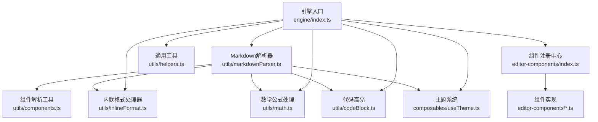
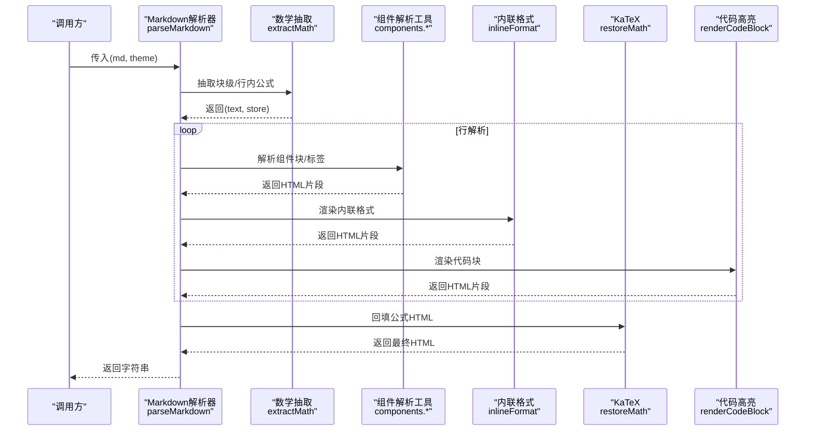
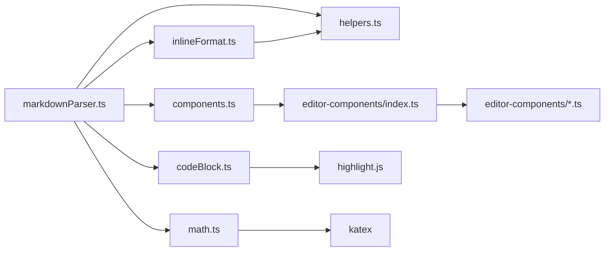

# 渲染引擎API

<cite>
**本文引用的文件**
- [src/engine/index.ts](file://src/engine/index.ts)
- [src/engine/utils/markdownParser.ts](file://src/engine/utils/markdownParser.ts)
- [src/engine/utils/inlineFormat.ts](file://src/engine/utils/inlineFormat.ts)
- [src/engine/utils/math.ts](file://src/engine/utils/math.ts)
- [src/engine/utils/codeBlock.ts](file://src/engine/utils/codeBlock.ts)
- [src/engine/utils/components.ts](file://src/engine/utils/components.ts)
- [src/engine/utils/helpers.ts](file://src/engine/utils/helpers.ts)
- [src/engine/composables/useTheme.ts](file://src/engine/composables/useTheme.ts)
- [src/engine/editor-components/index.ts](file://src/engine/editor-components/index.ts)
- [src/engine/editor-components/Title_DA01.ts](file://src/engine/editor-components/Title_DA01.ts)
- [src/engine/editor-components/Steps_DA01.ts](file://src/engine/editor-components/Steps_DA01.ts)
- [src/engine/utils/markdownParser.test.ts](file://src/engine/utils/markdownParser.test.ts)
- [package.json](file://package.json)
</cite>

## 目录
1. [简介](#简介)
2. [项目结构](#项目结构)
3. [核心组件](#核心组件)
4. [架构总览](#架构总览)
5. [详细组件分析](#详细组件分析)
6. [依赖关系分析](#依赖关系分析)
7. [性能考量](#性能考量)
8. [故障排查指南](#故障排查指南)
9. [结论](#结论)
10. [附录](#附录)

## 简介
本文件为 MarkFlow 渲染引擎的API参考文档，覆盖以下方面：
- Markdown 解析器接口规范：解析流程、解析选项、回调与错误处理
- 富文本组件注册与调用：组件工厂、渲染配置与属性定义
- 主题系统API：颜色配置、字体与样式定制
- 数学公式渲染：API方法与配置选项
- 自定义组件开发与集成：接口与规范
- 渲染性能优化：缓存与优化建议
- 扩展与插件：扩展接口与开发指南

## 项目结构
渲染引擎位于 src/engine 目录，采用“功能域+工具层”的组织方式：
- engine/index.ts：统一导出入口，聚合解析器、组件、主题与工具
- engine/utils/*：核心解析与渲染工具（Markdown、内联格式、数学、代码高亮、组件解析）
- engine/composables/useTheme.ts：主题颜色与工具函数
- engine/editor-components/*：富文本组件注册与实现

图表来源
- [src/engine/index.ts:1-16](file://src/engine/index.ts#L1-L16)
- [src/engine/utils/markdownParser.ts:110-605](file://src/engine/utils/markdownParser.ts#L110-L605)
- [src/engine/utils/components.ts:1-333](file://src/engine/utils/components.ts#L1-L333)
- [src/engine/composables/useTheme.ts:1-68](file://src/engine/composables/useTheme.ts#L1-L68)
- [src/engine/editor-components/index.ts:1-81](file://src/engine/editor-components/index.ts#L1-L81)

章节来源
- [src/engine/index.ts:1-16](file://src/engine/index.ts#L1-L16)

## 核心组件
- 解析器入口：parseMarkdown(md, theme) -> string
- 内联格式：inlineFormat(text, theme) -> string
- 数学公式：extractMath(md) -> { text, store }, restoreMath(html, store) -> html
- 代码块：renderCodeBlock(code, lang) -> string
- 组件注册：components、componentMap、tagMap、ComponentDef
- 主题：THEMES、makeColors、hexToRgb、lightenHex、darkenHex、ThemeColors

章节来源
- [src/engine/index.ts:3-15](file://src/engine/index.ts#L3-L15)
- [src/engine/utils/markdownParser.ts:110-605](file://src/engine/utils/markdownParser.ts#L110-L605)
- [src/engine/utils/inlineFormat.ts:5-104](file://src/engine/utils/inlineFormat.ts#L5-L104)
- [src/engine/utils/math.ts:32-71](file://src/engine/utils/math.ts#L32-L71)
- [src/engine/utils/codeBlock.ts:92-98](file://src/engine/utils/codeBlock.ts#L92-L98)
- [src/engine/editor-components/index.ts:20-81](file://src/engine/editor-components/index.ts#L20-L81)
- [src/engine/composables/useTheme.ts:4-67](file://src/engine/composables/useTheme.ts#L4-L67)

## 架构总览
渲染引擎遵循“抽取-解析-回填”的数学公式处理策略，结合主题驱动的内联格式与组件渲染，形成从 Markdown 文本到内联样式 HTML 的完整流水线。

图表来源
- [src/engine/utils/markdownParser.ts:110-605](file://src/engine/utils/markdownParser.ts#L110-L605)
- [src/engine/utils/math.ts:32-71](file://src/engine/utils/math.ts#L32-L71)
- [src/engine/utils/inlineFormat.ts:5-104](file://src/engine/utils/inlineFormat.ts#L5-L104)
- [src/engine/utils/codeBlock.ts:92-98](file://src/engine/utils/codeBlock.ts#L92-L98)

## 详细组件分析

### Markdown 解析器 API
- 函数签名
  - parseMarkdown(md: string, theme: ThemeColors): string
- 功能要点
  - 公式抽取与回填：先抽取 $$...$$ 与 $...$，解析完成后再回填，避免被 Markdown 规则破坏
  - 组件解析：支持多种自定义标签块与行内组件，逐行扫描并匹配
  - 内联格式：对段落与组件正文统一应用 inlineFormat
  - 表格、列表、图片、题注等标准 Markdown 元素渲染
- 错误处理
  - 数学渲染异常时降级为原文本，避免整篇崩溃
  - 代码高亮异常时回退为转义原文
- 性能特性
  - 顺序扫描，线性时间复杂度 O(n_lines)
  - 公式抽取/回填使用 Map 存储，查找高效

章节来源
- [src/engine/utils/markdownParser.ts:110-605](file://src/engine/utils/markdownParser.ts#L110-L605)
- [src/engine/utils/math.ts:19-30](file://src/engine/utils/math.ts#L19-L30)
- [src/engine/utils/codeBlock.ts:75-90](file://src/engine/utils/codeBlock.ts#L75-L90)

### 内联格式处理器 API
- 函数签名
  - inlineFormat(text: string, theme: ThemeColors): string
- 支持的内联标记
  - 脚注占位符、渐变背景 ==...==、胶囊文字 !!...!!、加重强调 ^^...^^、柔光重点 ::...::
  - 下划线 __...__、删除线 ~~...~~、上/下标 ^...^、^...^
  - 粗体 **...**、斜体 *...*、行内代码 `...`
  - 图片 [size]、链接 [text](url)
- 特殊行为
  - 自动中英文/数字加空格（pangu）
  - 多行内容换行转为  ，并去除行首/行尾缩进
  - 支持 img:// 占位符解析为本地图片 URL

章节来源
- [src/engine/utils/inlineFormat.ts:5-104](file://src/engine/utils/inlineFormat.ts#L5-L104)
- [src/engine/utils/helpers.ts:10-28](file://src/engine/utils/helpers.ts#L10-L28)

### 数学公式渲染 API
- 抽取与存储
  - extractMath(md: string): { text: string; store: MathStore }
  - MathStore: Map<string, string>（inline/block）
- 回填
  - restoreMath(html: string, store: MathStore): string
- 渲染策略
  - 块级 $$...$$：displayMode=true，居中，外层包裹 section
  - 行内 $...$：displayMode=false，保持行内
  - 异常降级：渲染失败时回退为原文本

章节来源
- [src/engine/utils/math.ts:13-71](file://src/engine/utils/math.ts#L13-L71)

### 代码块渲染 API
- 函数签名
  - renderCodeBlock(code: string, lang: string = 'text'): string
- 语言注册与别名
  - 注册语言：bash/c/cpp/css/go/java/javascript/json/markdown/python/rust/sql/typescript/xml
  - 别名映射：c/c++/html/js/md/py/shell/ts
- 渲染风格
  - highlight.js 高亮，内置 One Dark 风格色彩映射
  - 输出内联样式，便于复制到富文本环境

章节来源
- [src/engine/utils/codeBlock.ts:17-41](file://src/engine/utils/codeBlock.ts#L17-L41)
- [src/engine/utils/codeBlock.ts:75-98](file://src/engine/utils/codeBlock.ts#L75-L98)

### 组件注册与调用 API
- 组件定义接口
  - ComponentDef：id、name、tag、description、example、attrs、render
- 注册中心
  - components：组件数组
  - componentMap：按 id 索引
  - tagMap：按 tag 索引
- 渲染约定
  - render(attrs, body, theme, ...rest) -> string
  - 组件内部使用 helpers.leaf 与主题 themeColors 控制样式

章节来源
- [src/engine/editor-components/index.ts:20-81](file://src/engine/editor-components/index.ts#L20-L81)

### 主题系统 API
- 主题颜色接口
  - ThemeColors：accent、dark、light、border、rgb
- 预设主题
  - THEMES：15组预设 accent/dark
- 工具函数
  - makeColors(accent, dark) -> ThemeColors
  - hexToRgb、lightenHex、darkenHex
- 使用方式
  - 解析器与组件均接收 ThemeColors 作为参数，驱动内联样式

章节来源
- [src/engine/composables/useTheme.ts:4-67](file://src/engine/composables/useTheme.ts#L4-L67)
- [src/engine/utils/markdownParser.ts:110](file://src/engine/utils/markdownParser.ts#L110)

### 富文本组件示例：标题卡片与步骤流
- 标题卡片 Title_DA01
  - 属性：type、badge、subtitle、chips、color
  - 渲染：统计字数与阅读时长，生成卡片布局
- 步骤流 Steps_DA01
  - 属性：label、title、hint、active、color、direction
  - 渲染：支持横向/纵向两种布局，高亮当前步骤

章节来源
- [src/engine/editor-components/Title_DA01.ts:74-119](file://src/engine/editor-components/Title_DA01.ts#L74-L119)
- [src/engine/editor-components/Steps_DA01.ts:22-103](file://src/engine/editor-components/Steps_DA01.ts#L22-L103)

### 组件解析工具 API
- front-matter 渲染：renderFrontMatter(meta, fullText, theme) -> string
- 步骤块解析：parseSteps(lines, start, theme) -> { html, next }
- 标记块解析：parseCtaBlock、parseCtaTag、parseCtaInline
- 突发新闻：parseBreaking
- 对比容器：parseCompare（支持 DA01/DA02）
- 引用标注：parseCallout（TIP/NOTE/WARNING/CAUTION/IMPORTANT）
- 互动提醒：parseEngage
- 图片画廊：parseGallery
- 通用属性解析：parseAttrs

章节来源
- [src/engine/utils/components.ts:9-333](file://src/engine/utils/components.ts#L9-L333)
- [src/engine/utils/helpers.ts:101-115](file://src/engine/utils/helpers.ts#L101-L115)

## 依赖关系分析
- 外部依赖
  - highlight.js：代码高亮
  - katex：数学公式渲染
- 内部依赖
  - markdownParser 依赖 helpers、inlineFormat、math、codeBlock、components
  - 组件实现依赖 helpers.leaf 与主题 themeColors
  - 组件注册中心聚合各组件并提供索引

图表来源
- [src/engine/utils/markdownParser.ts:1-20](file://src/engine/utils/markdownParser.ts#L1-L20)
- [src/engine/utils/components.ts:1-8](file://src/engine/utils/components.ts#L1-L8)
- [package.json:24-26](file://package.json#L24-L26)

章节来源
- [package.json:13-31](file://package.json#L13-L31)

## 性能考量
- 公式处理
  - 先抽取后回填，避免正则误伤与重复渲染
  - Map 存储 token->HTML，查找 O(1)
- 代码高亮
  - 语言按需注册与别名映射，减少包体
  - 内置色彩映射，输出内联样式，降低外部依赖
- 主题与样式
  - ThemeColors 一次性生成，避免重复计算
  - leaf/pangu 等工具幂等，可重复执行
- 缓存与优化建议
  - 可引入“解析结果缓存”：以 md + theme 为键缓存 parseMarkdown 结果
  - 可引入“组件渲染缓存”：对相同 attrs/body 的组件渲染结果缓存
  - 可引入“图片占位符编译缓存”：img://id -> base64 的内存缓存（已有 localImageUrls）

章节来源
- [src/engine/utils/math.ts:32-71](file://src/engine/utils/math.ts#L32-L71)
- [src/engine/utils/codeBlock.ts:17-41](file://src/engine/utils/codeBlock.ts#L17-L41)
- [src/engine/utils/helpers.ts:10-28](file://src/engine/utils/helpers.ts#L10-L28)
- [src/lib/editor/imageStorage.ts:103-120](file://src/lib/editor/imageStorage.ts#L103-L120)

## 故障排查指南
- 数学公式渲染失败
  - 现象：公式未渲染或显示原文本
  - 处理：检查 KaTeX 渲染异常分支，确认输入表达式合法性
- 代码高亮异常
  - 现象：代码块显示为原文本
  - 处理：确认语言注册与别名映射，检查 highlight.js 初始化
- 题注识别误判
  - 现象：普通段落被识别为题注
  - 处理：验证题注上下文与分隔符规则，参考单元测试断言
- 组件渲染异常
  - 现象：组件未渲染或样式错乱
  - 处理：核对组件属性与渲染函数签名，确保传入 ThemeColors

章节来源
- [src/engine/utils/math.ts:19-30](file://src/engine/utils/math.ts#L19-L30)
- [src/engine/utils/codeBlock.ts:75-90](file://src/engine/utils/codeBlock.ts#L75-L90)
- [src/engine/utils/markdownParser.test.ts:1-126](file://src/engine/utils/markdownParser.test.ts#L1-L126)

## 结论
该渲染引擎以“抽取-解析-回填”为核心策略，结合主题驱动与组件化设计，实现了从 Markdown 到内联样式 HTML 的稳定转换。通过清晰的 API 分层与完善的工具函数，既满足易用性，也为扩展与性能优化提供了良好基础。

## 附录

### API 一览表
- 解析器
  - parseMarkdown(md: string, theme: ThemeColors): string
- 内联格式
  - inlineFormat(text: string, theme: ThemeColors): string
- 数学公式
  - extractMath(md: string): { text: string; store: MathStore }
  - restoreMath(html: string, store: MathStore): string
- 代码块
  - renderCodeBlock(code: string, lang: string = 'text'): string
- 组件注册
  - components: ComponentDef[]
  - componentMap: Record<string, ComponentDef>
  - tagMap: Record<string, ComponentDef>
  - ComponentDef.render(attrs, body, theme, ...rest): string
- 主题系统
  - ThemeColors: { accent, dark, light, border, rgb }
  - THEMES: 预设主题数组
  - makeColors(accent, dark): ThemeColors
  - hexToRgb, lightenHex, darkenHex

章节来源
- [src/engine/index.ts:3-15](file://src/engine/index.ts#L3-L15)
- [src/engine/editor-components/index.ts:20-81](file://src/engine/editor-components/index.ts#L20-L81)
- [src/engine/composables/useTheme.ts:4-67](file://src/engine/composables/useTheme.ts#L4-L67)