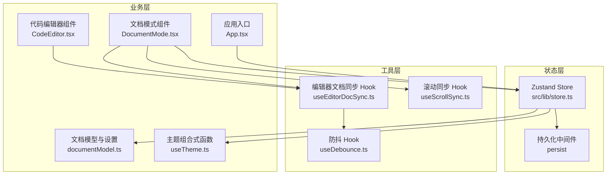
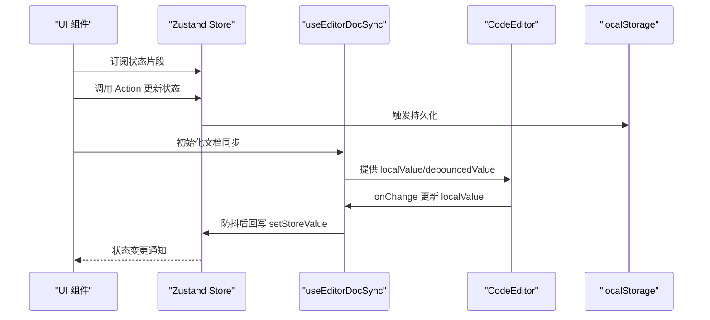
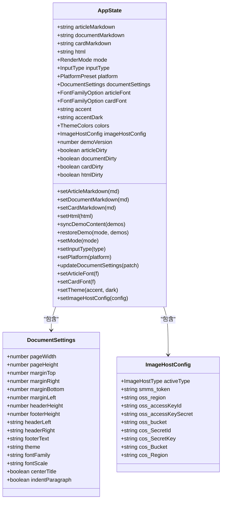
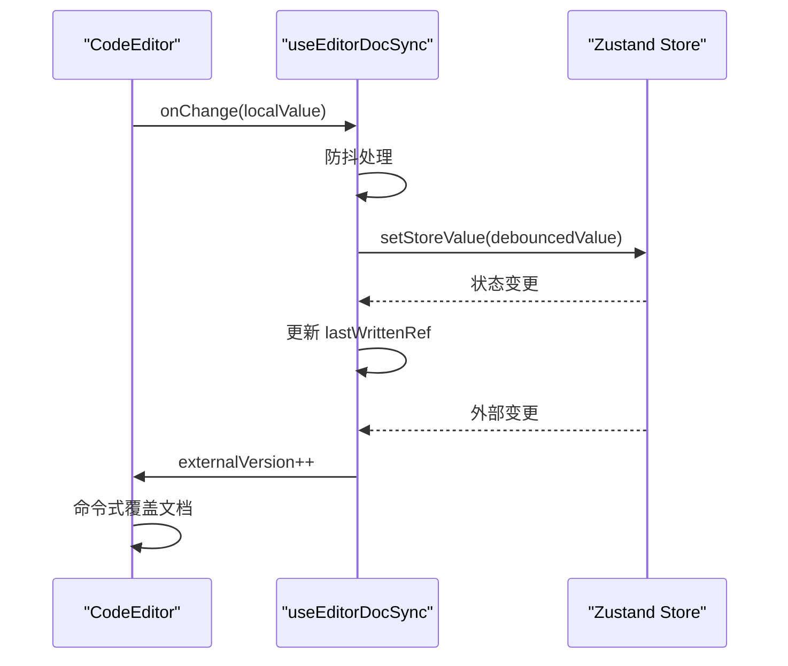
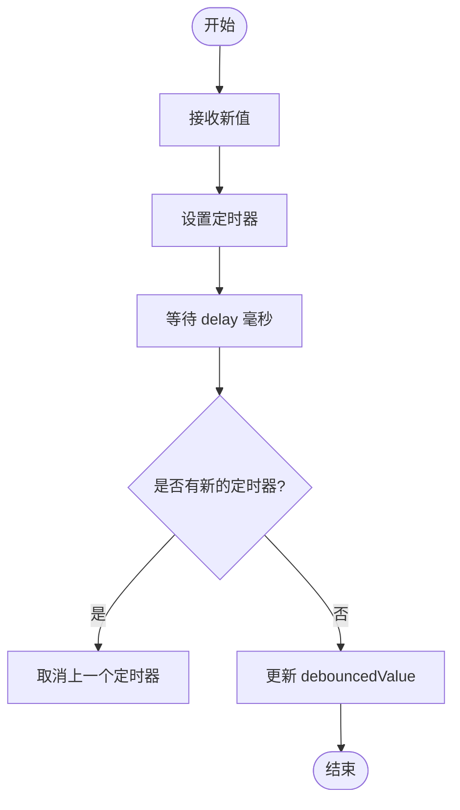
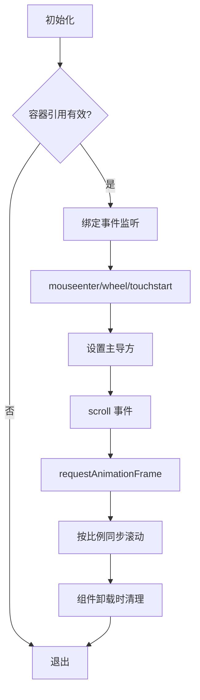
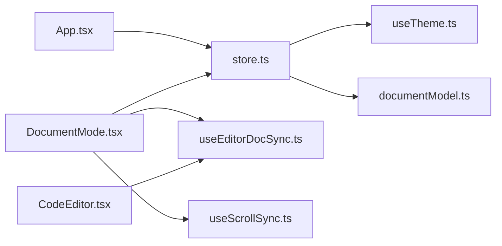

# 状态管理API

<cite>
**本文档引用的文件**
- [store.ts](file://src/lib/store.ts)
- [useDebounce.ts](file://src/lib/useDebounce.ts)
- [useEditorDocSync.ts](file://src/lib/useEditorDocSync.ts)
- [useScrollSync.ts](file://src/lib/useScrollSync.ts)
- [documentModel.ts](file://src/modes/document/documentModel.ts)
- [useTheme.ts](file://src/engine/composables/useTheme.ts)
- [App.tsx](file://src/App.tsx)
- [DocumentMode.tsx](file://src/modes/document/DocumentMode.tsx)
- [CodeEditor.tsx](file://src/components/editor/CodeEditor.tsx)
</cite>

## 目录
1. [简介](#简介)
2. [项目结构](#项目结构)
3. [核心组件](#核心组件)
4. [架构总览](#架构总览)
5. [详细组件分析](#详细组件分析)
6. [依赖关系分析](#依赖关系分析)
7. [性能考虑](#性能考虑)
8. [故障排除指南](#故障排除指南)
9. [结论](#结论)
10. [附录](#附录)

## 简介
本文件为 MarkFlow 的状态管理系统提供完整的 API 参考文档，重点涵盖以下方面：
- Zustand Store 接口规范：状态定义、Action 方法、中间件配置
- 编辑器文档同步 API 与实时更新机制
- 防抖 Hook 的使用方法与配置选项
- 滚动同步 API 接口与事件处理机制
- 状态持久化 API 方法与本地存储配置
- 状态订阅与响应式更新机制
- 状态管理最佳实践与性能优化建议
- 状态 API 扩展接口与自定义 Hook 开发指导

## 项目结构
状态管理相关代码主要分布在以下位置：
- 状态定义与持久化：src/lib/store.ts
- 工具 Hook：src/lib/useDebounce.ts、src/lib/useEditorDocSync.ts、src/lib/useScrollSync.ts
- 模式与主题：src/modes/document/documentModel.ts、src/engine/composables/useTheme.ts
- 应用入口与订阅：src/App.tsx
- 模式组件集成：src/modes/document/DocumentMode.tsx
- 编辑器组件：src/components/editor/CodeEditor.tsx

**图表来源**
- [store.ts:163-241](file://src/lib/store.ts#L163-L241)
- [useEditorDocSync.ts:20-49](file://src/lib/useEditorDocSync.ts#L20-L49)
- [useScrollSync.ts:7-67](file://src/lib/useScrollSync.ts#L7-L67)
- [App.tsx:35-73](file://src/App.tsx#L35-L73)
- [DocumentMode.tsx:34-61](file://src/modes/document/DocumentMode.tsx#L34-L61)
- [CodeEditor.tsx:53-103](file://src/components/editor/CodeEditor.tsx#L53-L103)

**章节来源**
- [store.ts:1-242](file://src/lib/store.ts#L1-L242)
- [useDebounce.ts:1-18](file://src/lib/useDebounce.ts#L1-L18)
- [useEditorDocSync.ts:1-50](file://src/lib/useEditorDocSync.ts#L1-L50)
- [useScrollSync.ts:1-68](file://src/lib/useScrollSync.ts#L1-L68)
- [documentModel.ts:1-328](file://src/modes/document/documentModel.ts#L1-L328)
- [useTheme.ts:1-68](file://src/engine/composables/useTheme.ts#L1-L68)
- [App.tsx:1-172](file://src/App.tsx#L1-L172)
- [DocumentMode.tsx:1-200](file://src/modes/document/DocumentMode.tsx#L1-L200)
- [CodeEditor.tsx:1-200](file://src/components/editor/CodeEditor.tsx#L1-L200)

## 核心组件
本节概述状态管理的关键组件及其职责：
- Zustand Store：集中管理应用状态，支持持久化与主题颜色计算
- 防抖 Hook：提供通用的防抖逻辑，降低频繁更新开销
- 编辑器文档同步 Hook：实现编辑器与 Store 的双向同步，避免回写回声
- 滚动同步 Hook：实现两个滚动容器的比例联动，避免相互拉扯
- 文档模型与设置：定义文档分页、字体缩放、页面布局等配置
- 主题组合式函数：提供主题色生成与转换工具

**章节来源**
- [store.ts:54-92](file://src/lib/store.ts#L54-L92)
- [useDebounce.ts:3-17](file://src/lib/useDebounce.ts#L3-L17)
- [useEditorDocSync.ts:4-49](file://src/lib/useEditorDocSync.ts#L4-L49)
- [useScrollSync.ts:3-67](file://src/lib/useScrollSync.ts#L3-L67)
- [documentModel.ts:30-66](file://src/modes/document/documentModel.ts#L30-L66)
- [useTheme.ts:4-67](file://src/engine/composables/useTheme.ts#L4-L67)

## 架构总览
状态管理采用“集中式状态 + 组合式 Hook”的架构模式：
- Store 负责全局状态与持久化
- 组件通过 Selector 订阅所需状态片段
- 工具 Hook 提供跨组件的通用能力
- 模式组件封装具体业务逻辑

**图表来源**
- [App.tsx:36-54](file://src/App.tsx#L36-L54)
- [store.ts:163-241](file://src/lib/store.ts#L163-L241)
- [useEditorDocSync.ts:20-49](file://src/lib/useEditorDocSync.ts#L20-L49)
- [CodeEditor.tsx:53-103](file://src/components/editor/CodeEditor.tsx#L53-L103)

## 详细组件分析

### Zustand Store 接口规范
- 状态类型定义
  - 文档状态：文章、文档、卡片、HTML 内容
  - 模式与输入类型：渲染模式、输入类型、平台预设
  - 文档设置：页面尺寸、边距、标题居中、段落缩进等
  - 字体设置：文章与卡片字体族
  - 主题与颜色：主色、深色、颜色映射
  - 图床配置：本地、SM.MS、OSS、COS
  - 示例内容版本与脏标记：demoVersion、各模式 dirty 标记
- Action 方法
  - 文档内容更新：setArticleMarkdown、setDocumentMarkdown、setCardMarkdown、setHtml
  - 示例内容同步：syncDemoContent、restoreDemo
  - 模式与输入类型：setMode、setInputType、setPlatform
  - 文档设置更新：updateDocumentSettings
  - 字体设置：setArticleFont、setCardFont
  - 主题设置：setTheme（同时更新 CSS 变量与颜色映射）
  - 图床配置：setImageHostConfig
- 中间件配置
  - 持久化：persist 中间件，存储键名统一以 m2v- 前缀命名
  - 水合回调：onRehydrateStorage 中重新应用 CSS 变量
- 数据迁移
  - 从旧键名迁移：兼容历史存储键，自动标记 dirty 避免覆盖用户内容
- 默认值与回退
  - 默认演示内容、默认 HTML、默认文档设置、默认字体、默认主题

**图表来源**
- [store.ts:54-92](file://src/lib/store.ts#L54-L92)
- [store.ts:34-48](file://src/lib/store.ts#L34-L48)
- [documentModel.ts:30-66](file://src/modes/document/documentModel.ts#L30-L66)
- [store.ts:43-48](file://src/lib/store.ts#L43-L48)

**章节来源**
- [store.ts:54-92](file://src/lib/store.ts#L54-L92)
- [store.ts:163-241](file://src/lib/store.ts#L163-L241)
- [store.ts:101-156](file://src/lib/store.ts#L101-L156)
- [documentModel.ts:30-66](file://src/modes/document/documentModel.ts#L30-L66)

### 编辑器文档同步 API
- 功能目标
  - 实现编辑器与 Store 的双向同步
  - 使用防抖降低写入频率
  - 识别并避免回写回声（写回旧值导致丢字）
  - 支持外部重置信号，强制覆盖编辑器内容
- 接口定义
  - 输入参数：storeValue（当前 Store 值）、setStoreValue（回写回调）、delay（防抖延迟，默认 500ms）
  - 返回对象：localValue（本地编辑值）、debouncedValue（防抖后值）、setLocalValue（更新本地值）、externalVersion（外部重置信号）
- 同步流程
  - 外部变更检测：当 Store 值变化且与最后写入值不同，更新本地值并递增 externalVersion
  - 防抖回写：本地值变化触发防抖，防抖结束后若与最后写入值不同，则回写 Store 并更新最后写入值
  - 编辑器覆盖：外部版本号变化时，编辑器命令式覆盖文档，避免受控同步导致的输入丢失

**图表来源**
- [useEditorDocSync.ts:20-49](file://src/lib/useEditorDocSync.ts#L20-L49)
- [CodeEditor.tsx:84-103](file://src/components/editor/CodeEditor.tsx#L84-L103)

**章节来源**
- [useEditorDocSync.ts:4-49](file://src/lib/useEditorDocSync.ts#L4-L49)
- [CodeEditor.tsx:84-103](file://src/components/editor/CodeEditor.tsx#L84-L103)

### 防抖 Hook API
- 功能描述：提供通用的防抖逻辑，返回稳定值，减少不必要的渲染与写入
- 接口定义
  - 参数：value（待防抖值）、delay（延迟毫秒数）
  - 返回：debouncedValue（防抖后的稳定值）
- 使用建议
  - 与编辑器文档同步配合，降低 Store 写入频率
  - 注意清理定时器，避免内存泄漏

**图表来源**
- [useDebounce.ts:3-17](file://src/lib/useDebounce.ts#L3-L17)

**章节来源**
- [useDebounce.ts:1-18](file://src/lib/useDebounce.ts#L1-L18)

### 滚动同步 API
- 功能描述：让两个可滚动容器按比例联动，采用“主导方”策略避免相互拉扯
- 接口定义
  - 参数：aRef/bRef（两个滚动容器的 RefObject）、deps（依赖数组）
  - 行为：根据主导方滚动比例同步另一方
- 事件处理机制
  - 主导方确定：鼠标进入、滚轮、触摸开始时确定主导方
  - 同步执行：使用 requestAnimationFrame 避免频繁同步
  - 清理：组件卸载时移除事件监听并取消动画帧

**图表来源**
- [useScrollSync.ts:7-67](file://src/lib/useScrollSync.ts#L7-L67)

**章节来源**
- [useScrollSync.ts:1-68](file://src/lib/useScrollSync.ts#L1-L68)

### 状态持久化 API
- 存储键名
  - m2v-store：完整 Store 持久化
  - m2v-article-markdown、m2v-document-markdown、m2v-card-markdown、m2v-html：各模式文档内容
  - m2v-mode：当前模式
  - m2v-document-settings：文档设置
  - m2v-theme：主题配置
  - m2v-article-font、m2v-card-font：字体设置
- 迁移策略
  - 从旧键名迁移：兼容历史存储键，自动迁移并标记 dirty
  - 版本控制：DEMO_VERSION 控制示例内容同步策略
- 水合回调
  - onRehydrateStorage：从持久化恢复时重新应用 CSS 变量

**章节来源**
- [store.ts:14-24](file://src/lib/store.ts#L14-L24)
- [store.ts:101-156](file://src/lib/store.ts#L101-L156)
- [store.ts:232-240](file://src/lib/store.ts#L232-L240)

### 状态订阅与响应式更新
- 订阅方式
  - App.tsx 中通过 Selector 订阅所需状态片段，避免全量重渲染
  - 模式组件按需订阅，减少不必要的更新
- 响应式更新
  - Store 写入触发水合回调，重新应用 CSS 变量
  - 防抖 Hook 保证稳定值，降低渲染频率
  - 滚动同步 Hook 使用 RAF 优化性能

**章节来源**
- [App.tsx:36-54](file://src/App.tsx#L36-L54)
- [store.ts:234-238](file://src/lib/store.ts#L234-L238)
- [useDebounce.ts:3-17](file://src/lib/useDebounce.ts#L3-L17)
- [useScrollSync.ts:21-38](file://src/lib/useScrollSync.ts#L21-L38)

## 依赖关系分析
- 组件耦合
  - App.tsx 依赖 Store 的多个 Selector，形成高内聚低耦合
  - DocumentMode.tsx 依赖 useEditorDocSync 与 useScrollSync，封装复杂交互
  - CodeEditor.tsx 依赖 useEditorDocSync，实现文档同步
- 外部依赖
  - Zustand：状态管理核心
  - @uiw/react-codemirror：编辑器基础
  - zustand/middleware：持久化中间件
- 循环依赖
  - 未发现循环依赖，模块边界清晰

**图表来源**
- [App.tsx:36-54](file://src/App.tsx#L36-L54)
- [DocumentMode.tsx:34-61](file://src/modes/document/DocumentMode.tsx#L34-L61)
- [CodeEditor.tsx:53-103](file://src/components/editor/CodeEditor.tsx#L53-L103)
- [store.ts:163-241](file://src/lib/store.ts#L163-L241)

**章节来源**
- [App.tsx:1-172](file://src/App.tsx#L1-L172)
- [DocumentMode.tsx:1-200](file://src/modes/document/DocumentMode.tsx#L1-L200)
- [CodeEditor.tsx:1-200](file://src/components/editor/CodeEditor.tsx#L1-L200)
- [store.ts:1-242](file://src/lib/store.ts#L1-L242)

## 性能考虑
- 防抖与批处理
  - 编辑器文档同步使用防抖，减少 Store 写入频率
  - 滚动同步使用 requestAnimationFrame，避免高频滚动导致的性能问题
- 选择性订阅
  - 使用 Selector 精确订阅状态片段，避免全量重渲染
- 水合与迁移
  - onRehydrateStorage 中重新应用 CSS 变量，避免样式闪烁
  - 旧键名迁移减少用户数据丢失风险
- 资源管理
  - 防抖 Hook 在清理时及时清除定时器
  - 滚动同步在卸载时移除事件监听并取消动画帧

[本节提供一般性指导，无需特定文件来源]

## 故障排除指南
- 编辑器内容丢失或重复
  - 检查 useEditorDocSync 的 lastWrittenRef 是否正确更新
  - 确认 externalVersion 是否正确递增
- 滚动不同步或相互拉扯
  - 确认主导方策略是否生效
  - 检查事件监听是否正确绑定与清理
- 主题颜色不生效
  - 检查 onRehydrateStorage 是否正确应用 CSS 变量
  - 确认 setTheme 是否正确更新颜色映射
- 持久化异常
  - 检查存储键名是否正确
  - 确认旧键名迁移逻辑是否覆盖所有情况

**章节来源**
- [useEditorDocSync.ts:27-46](file://src/lib/useEditorDocSync.ts#L27-L46)
- [useScrollSync.ts:17-66](file://src/lib/useScrollSync.ts#L17-L66)
- [store.ts:234-238](file://src/lib/store.ts#L234-L238)
- [store.ts:101-156](file://src/lib/store.ts#L101-L156)

## 结论
MarkFlow 的状态管理系统通过 Zustand 实现集中式状态管理，结合多种工具 Hook 提供高效的编辑器同步、滚动同步与防抖能力。系统具备完善的持久化与迁移策略，确保用户体验与数据安全。遵循本文档的 API 规范与最佳实践，可以进一步提升系统的稳定性与性能。

[本节为总结性内容，无需特定文件来源]

## 附录

### 状态 API 扩展接口
- 新增状态字段
  - 在 AppState 接口中添加新字段
  - 在初始化状态中提供默认值
  - 在 persist 中间件配置中声明存储键名
- 新增 Action 方法
  - 在 AppState 中定义方法签名
  - 在 persist 回调中实现逻辑
  - 在组件中通过 Selector 订阅并调用
- 新增工具 Hook
  - 遵循现有 Hook 的命名与参数约定
  - 提供清晰的返回值与副作用说明
  - 确保正确的清理与依赖管理

**章节来源**
- [store.ts:54-92](file://src/lib/store.ts#L54-L92)
- [store.ts:163-241](file://src/lib/store.ts#L163-L241)

### 自定义 Hook 开发
- 设计原则
  - 单一职责：每个 Hook 解决一个明确的问题
  - 明确的输入输出：参数与返回值语义清晰
  - 副作用隔离：将副作用封装在内部，暴露简洁接口
  - 依赖管理：正确声明依赖数组，避免无限循环
- 开发步骤
  - 定义 Hook 名称与功能范围
  - 设计参数与返回值结构
  - 实现核心逻辑与副作用
  - 添加必要的清理逻辑
  - 编写使用示例与测试

**章节来源**
- [useDebounce.ts:1-18](file://src/lib/useDebounce.ts#L1-L18)
- [useEditorDocSync.ts:1-50](file://src/lib/useEditorDocSync.ts#L1-L50)
- [useScrollSync.ts:1-68](file://src/lib/useScrollSync.ts#L1-L68)