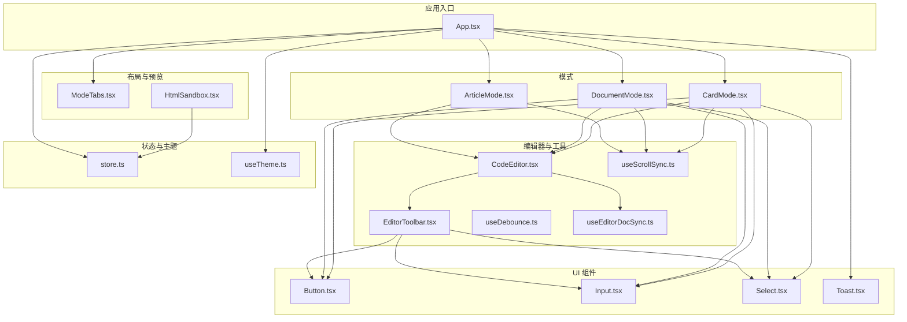
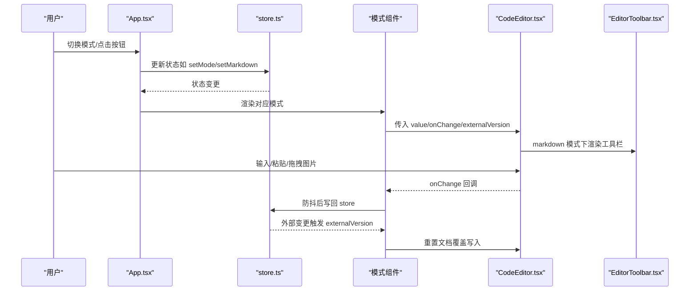
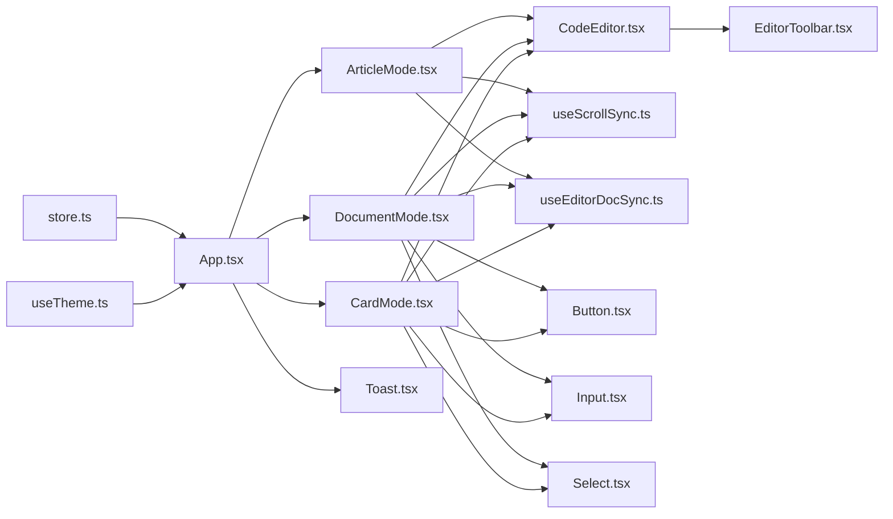

# 组件API

<cite>
**本文引用的文件**
- [src/components/ui/Button.tsx](file://src/components/ui/Button.tsx)
- [src/components/ui/Input.tsx](file://src/components/ui/Input.tsx)
- [src/components/ui/Select.tsx](file://src/components/ui/Select.tsx)
- [src/components/ui/Toast.tsx](file://src/components/ui/Toast.tsx)
- [src/components/editor/CodeEditor.tsx](file://src/components/editor/CodeEditor.tsx)
- [src/components/editor/EditorToolbar.tsx](file://src/components/editor/EditorToolbar.tsx)
- [src/components/layout/ModeTabs.tsx](file://src/components/layout/ModeTabs.tsx)
- [src/components/preview/HtmlSandbox.tsx](file://src/components/preview/HtmlSandbox.tsx)
- [src/App.tsx](file://src/App.tsx)
- [src/lib/store.ts](file://src/lib/store.ts)
- [src/lib/useDebounce.ts](file://src/lib/useDebounce.ts)
- [src/lib/useEditorDocSync.ts](file://src/lib/useEditorDocSync.ts)
- [src/lib/useScrollSync.ts](file://src/lib/useScrollSync.ts)
- [src/engine/composables/useTheme.ts](file://src/engine/composables/useTheme.ts)
- [src/modes/article/ArticleMode.tsx](file://src/modes/article/ArticleMode.tsx)
- [src/modes/document/DocumentMode.tsx](file://src/modes/document/DocumentMode.tsx)
- [src/modes/card/CardMode.tsx](file://src/modes/card/CardMode.tsx)
</cite>

## 目录
1. [简介](#简介)
2. [项目结构](#项目结构)
3. [核心组件](#核心组件)
4. [架构总览](#架构总览)
5. [组件详细分析](#组件详细分析)
6. [依赖关系分析](#依赖关系分析)
7. [性能考量](#性能考量)
8. [故障排查指南](#故障排查指南)
9. [结论](#结论)
10. [附录](#附录)

## 简介
本文件为 MarkFlow 的 UI 组件与相关工具的 API 参考文档，覆盖以下方面：
- 组件 props 接口定义（类型、默认值、必填性）
- 事件处理机制（回调参数与触发时机）
- 插槽与自定义渲染（如 EditorToolbar 的下拉项、HtmlSandbox 的沙箱策略）
- CSS 类名与样式定制接口（如何通过 className 扩展样式）
- 生命周期与状态管理（组件间通信、数据流与副作用）
- 使用示例与最佳实践
- 组件间通信模式与数据传递机制

## 项目结构
MarkFlow 采用按功能域划分的组织方式，UI 组件集中在 src/components/ui，编辑器与工具位于 src/components/editor 与 src/lib，模式层位于 src/modes，主题与颜色工具位于 src/engine/composables。

图表来源
- [src/App.tsx:35-171](file://src/App.tsx#L35-L171)
- [src/components/editor/CodeEditor.tsx:53-244](file://src/components/editor/CodeEditor.tsx#L53-L244)
- [src/components/editor/EditorToolbar.tsx:19-152](file://src/components/editor/EditorToolbar.tsx#L19-L152)
- [src/lib/useEditorDocSync.ts:20-49](file://src/lib/useEditorDocSync.ts#L20-L49)
- [src/lib/useScrollSync.ts:7-67](file://src/lib/useScrollSync.ts#L7-L67)
- [src/components/ui/Button.tsx:3-34](file://src/components/ui/Button.tsx#L3-L34)
- [src/components/ui/Input.tsx:3-13](file://src/components/ui/Input.tsx#L3-L13)
- [src/components/ui/Select.tsx:3-13](file://src/components/ui/Select.tsx#L3-L13)
- [src/components/ui/Toast.tsx:10-33](file://src/components/ui/Toast.tsx#L10-L33)
- [src/components/layout/ModeTabs.tsx:15-41](file://src/components/layout/ModeTabs.tsx#L15-L41)
- [src/components/preview/HtmlSandbox.tsx:23-49](file://src/components/preview/HtmlSandbox.tsx#L23-L49)
- [src/lib/store.ts:163-241](file://src/lib/store.ts#L163-L241)
- [src/engine/composables/useTheme.ts:4-67](file://src/engine/composables/useTheme.ts#L4-L67)
- [src/modes/article/ArticleMode.tsx:16-54](file://src/modes/article/ArticleMode.tsx#L16-L54)
- [src/modes/document/DocumentMode.tsx:34-344](file://src/modes/document/DocumentMode.tsx#L34-L344)
- [src/modes/card/CardMode.tsx:44-363](file://src/modes/card/CardMode.tsx#L44-L363)

章节来源
- [src/App.tsx:35-171](file://src/App.tsx#L35-L171)

## 核心组件
本节对 UI 层基础组件进行 API 总览，便于快速查阅与集成。

- Button
  - 功能：通用按钮，支持变体与尺寸
  - Props
    - variant?: 'primary' | 'outline' | 'ghost'
    - size?: 'sm' | 'md'
    - 继承原生 button 的所有属性（如 onClick、disabled、className 等）
  - 默认值
    - variant: 'outline'
    - size: 'sm'
  - 事件
    - 支持原生 button 的所有事件（onClick、onFocus、onBlur 等）
  - 插槽/自定义
    - 无具名插槽；可通过 children 传入图标或文本
  - 样式
    - 通过 className 扩展或覆盖
  - 生命周期
    - 无内部副作用
  - 使用建议
    - 优先使用 variant 控制外观，size 控制尺寸；必要时通过 className 微调

- Input
  - 功能：基础输入框
  - Props
    - 继承原生 input 的所有属性
  - 默认值
    - 无固定默认值（基于原生 input）
  - 事件
    - onChange、onFocus、onBlur 等原生事件
  - 插槽/自定义
    - 无具名插槽
  - 样式
    - 通过 className 扩展或覆盖
  - 使用建议
    - 与 Select、Button 组合使用时保持一致的 size

- Select
  - 功能：基础下拉选择
  - Props
    - 继承原生 select 的所有属性
  - 默认值
    - 无固定默认值（基于原生 select）
  - 事件
    - onChange（返回 e.target.value）
  - 插槽/自定义
    - 无具名插槽；通过 option 子元素定义选项
  - 样式
    - 通过 className 扩展或覆盖
  - 使用建议
    - 与 Input、Button 协同，形成统一表单控件组

- Toast
  - 功能：全局轻提示
  - Props
    - toast: { message: string; key: number } | null
  - 默认值
    - 无固定默认值
  - 事件
    - 无
  - 插槽/自定义
    - 无具名插槽
  - 样式
    - 通过 className 扩展或覆盖
  - 生命周期
    - 挂载后根据 toast 显示，约 2.2 秒后淡出
  - 使用建议
    - 通过唯一 key 避免相同 message 不重复弹出

章节来源
- [src/components/ui/Button.tsx:3-34](file://src/components/ui/Button.tsx#L3-L34)
- [src/components/ui/Input.tsx:3-13](file://src/components/ui/Input.tsx#L3-L13)
- [src/components/ui/Select.tsx:3-13](file://src/components/ui/Select.tsx#L3-L13)
- [src/components/ui/Toast.tsx:10-33](file://src/components/ui/Toast.tsx#L10-L33)

## 架构总览
应用通过 App.tsx 统一调度各模式（文章、文档、卡片、HTML），UI 组件与编辑器组件通过 store 管理状态，工具 hooks 提供编辑器同步、滚动联动与防抖能力。

图表来源
- [src/App.tsx:35-171](file://src/App.tsx#L35-L171)
- [src/lib/store.ts:163-241](file://src/lib/store.ts#L163-L241)
- [src/components/editor/CodeEditor.tsx:53-244](file://src/components/editor/CodeEditor.tsx#L53-L244)
- [src/components/editor/EditorToolbar.tsx:19-152](file://src/components/editor/EditorToolbar.tsx#L19-L152)
- [src/modes/article/ArticleMode.tsx:16-54](file://src/modes/article/ArticleMode.tsx#L16-L54)
- [src/modes/document/DocumentMode.tsx:34-344](file://src/modes/document/DocumentMode.tsx#L34-L344)
- [src/modes/card/CardMode.tsx:44-363](file://src/modes/card/CardMode.tsx#L44-L363)

## 组件详细分析

### Button 组件
- Props
  - variant?: 'primary' | 'outline' | 'ghost'
  - size?: 'sm' | 'md'
  - 继承原生 button 的所有属性
- 默认值
  - variant: 'outline'
  - size: 'sm'
- 事件
  - onClick、onFocus、onBlur 等原生事件
- 插槽/自定义
  - 无具名插槽；可通过 children 传入图标或文本
- 样式
  - 通过 className 扩展或覆盖
- 生命周期
  - 无内部副作用
- 使用示例
  - 与 Input/Select 组合形成表单控件组
  - 在导出、复制等操作中使用 primary 变体突出关键动作

章节来源
- [src/components/ui/Button.tsx:3-34](file://src/components/ui/Button.tsx#L3-L34)

### Input 组件
- Props
  - 继承原生 input 的所有属性
- 默认值
  - 无固定默认值
- 事件
  - onChange、onFocus、onBlur 等原生事件
- 插槽/自定义
  - 无具名插槽
- 样式
  - 通过 className 扩展或覆盖
- 使用示例
  - 与 Button/Select 组合，形成统一表单控件组

章节来源
- [src/components/ui/Input.tsx:3-13](file://src/components/ui/Input.tsx#L3-L13)

### Select 组件
- Props
  - 继承原生 select 的所有属性
- 默认值
  - 无固定默认值
- 事件
  - onChange（返回 e.target.value）
- 插槽/自定义
  - 无具名插槽；通过 option 子元素定义选项
- 样式
  - 通过 className 扩展或覆盖
- 使用示例
  - 在文档/卡片模式中用于字体、字号、比例等设置

章节来源
- [src/components/ui/Select.tsx:3-13](file://src/components/ui/Select.tsx#L3-L13)

### Toast 组件
- Props
  - toast: { message: string; key: number } | null
- 默认值
  - 无固定默认值
- 事件
  - 无
- 插槽/自定义
  - 无具名插槽
- 样式
  - 通过 className 扩展或覆盖
- 生命周期
  - 挂载后根据 toast 显示，约 2.2 秒后淡出
- 使用示例
  - 通过 App.tsx 的 showToast 统一反馈

章节来源
- [src/components/ui/Toast.tsx:10-33](file://src/components/ui/Toast.tsx#L10-L33)
- [src/App.tsx:60-61](file://src/App.tsx#L60-L61)

### CodeEditor 组件
- Props
  - value: string
  - onChange: (value: string) => void
  - externalVersion?: number（外部重置信号）
  - onScrollerReady?: (el: HTMLElement) => void
  - onViewReady?: (view: EditorView) => void
  - language?: 'markdown' | 'html'
- 默认值
  - externalVersion: 0
  - language: 'markdown'
- 事件
  - onChange：编辑器内容变化时触发
  - onScrollerReady/onViewReady：编辑器滚动容器与视图就绪回调
- 插槽/自定义
  - 无具名插槽
- 样式
  - 通过 className 扩展或覆盖
- 生命周期
  - 挂载时以 initialValue 创建文档，之后非受控
  - 外部变更通过 externalVersion 触发覆盖写入
- 图片粘贴/拖拽
  - 支持图片粘贴与拖拽，自动压缩并上传至图床（本地/SM.MS/OSS/COS）
- 快捷键
  - markdown 模式下绑定自定义快捷键
- 使用示例
  - 在各模式中作为编辑器使用，配合 useEditorDocSync 实现双向同步

章节来源
- [src/components/editor/CodeEditor.tsx:19-27](file://src/components/editor/CodeEditor.tsx#L19-L27)
- [src/components/editor/CodeEditor.tsx:53-244](file://src/components/editor/CodeEditor.tsx#L53-L244)

### EditorToolbar 组件
- Props
  - view: EditorView | null
- 默认值
  - 无固定默认值
- 事件
  - 无显式事件；通过按钮 onClick 调用 action(view)
- 插槽/自定义
  - 无具名插槽；通过 toolbarGroups 配置按钮组与下拉项
- 样式
  - 通过 className 扩展或覆盖
- 生命周期
  - 无内部副作用
- 图片上传
  - 支持文件选择与上传，插入 Markdown 语法
- 使用示例
  - 在 markdown 模式下渲染，与 CodeEditor 协作

章节来源
- [src/components/editor/EditorToolbar.tsx:15-17](file://src/components/editor/EditorToolbar.tsx#L15-L17)
- [src/components/editor/EditorToolbar.tsx:19-152](file://src/components/editor/EditorToolbar.tsx#L19-L152)

### ModeTabs 组件
- Props
  - mode: 'article' | 'document' | 'card' | 'html'
  - onChange: (mode: RenderMode) => void
- 默认值
  - 无固定默认值
- 事件
  - onChange：点击切换模式
- 插槽/自定义
  - 无具名插槽
- 样式
  - 通过 className 扩展或覆盖
- 使用示例
  - 在 App.tsx 顶部导航中使用，切换渲染模式

章节来源
- [src/components/layout/ModeTabs.tsx:15-41](file://src/components/layout/ModeTabs.tsx#L15-L41)
- [src/App.tsx:89-90](file://src/App.tsx#L89-L90)

### HtmlSandbox 组件
- Props
  - html: string
  - refreshKey?: number（强制重挂载）
  - onLoad?: () => void（iframe 加载完成回调）
  - allowScripts?: boolean（是否允许脚本，默认 false）
- 默认值
  - refreshKey: 0
  - allowScripts: false
- 事件
  - onLoad：iframe 加载完成回调
- 插槽/自定义
  - 无具名插槽
- 样式
  - 通过 className 扩展或覆盖
- 生命周期
  - 无内部副作用
- 安全策略
  - 使用 sandbox 限制权限，可选允许脚本
- 使用示例
  - 在 HTML 模式中预览渲染结果

章节来源
- [src/components/preview/HtmlSandbox.tsx:10-19](file://src/components/preview/HtmlSandbox.tsx#L10-L19)
- [src/components/preview/HtmlSandbox.tsx:23-49](file://src/components/preview/HtmlSandbox.tsx#L23-L49)

### App 组件
- 功能
  - 统一调度模式渲染、主题切换、示例恢复、图床设置弹窗与全局 Toast
- 关键 props
  - 通过 store 暴露的方法与状态注入（如 setMode、setArticleMarkdown、colors 等）
- 生命周期
  - 挂载时按版本号同步示例内容
- 事件
  - onClick：切换图床设置、恢复示例、主题切换
- 插槽/自定义
  - 无具名插槽
- 样式
  - 通过 className 扩展或覆盖
- 使用示例
  - 作为根组件引入各模式与 UI 组件

章节来源
- [src/App.tsx:35-171](file://src/App.tsx#L35-L171)

### ArticleMode 组件
- 功能
  - 文章模式编辑器与预览双栏布局，支持滚动联动与主题颜色渲染
- Props
  - markdown: string
  - setMarkdown: (markdown: string) => void
  - colors: ThemeColors
  - onToast: (message: string) => void
- 生命周期
  - 使用 useEditorDocSync 实现 store ↔ 编辑器 双向同步
  - 使用 useScrollSync 实现编辑器与预览滚动联动
- 事件
  - onChange：编辑器内容变化
- 插槽/自定义
  - 无具名插槽
- 样式
  - 通过 className 扩展或覆盖
- 使用示例
  - 在 App.tsx 中按 mode 渲染

章节来源
- [src/modes/article/ArticleMode.tsx:9-14](file://src/modes/article/ArticleMode.tsx#L9-L14)
- [src/modes/article/ArticleMode.tsx:16-54](file://src/modes/article/ArticleMode.tsx#L16-L54)

### DocumentMode 组件
- 功能
  - 文档模式编辑器与分页预览，支持导出 PDF、复制 AI 指令、字体与段落设置
- Props
  - markdown: string
  - setMarkdown: (markdown: string) => void
  - colors: ThemeColors
  - settings: DocumentSettings
  - updateSettings: (patch: Partial<DocumentSettings>) => void
  - onToast: (message: string) => void
- 生命周期
  - 使用 useEditorDocSync 实现 store ↔ 编辑器 双向同步
  - 使用 useScrollSync 实现编辑器与预览滚动联动
  - 使用 useLayoutEffect 与 ResizeObserver 测量块高度，实现精确分页
- 事件
  - onChange：编辑器内容变化
  - 导出 PDF、复制指令、字体与段落设置变更
- 插槽/自定义
  - 无具名插槽
- 样式
  - 通过 className 扩展或覆盖
- 使用示例
  - 在 App.tsx 中按 mode 渲染

章节来源
- [src/modes/document/DocumentMode.tsx:21-28](file://src/modes/document/DocumentMode.tsx#L21-L28)
- [src/modes/document/DocumentMode.tsx:34-344](file://src/modes/document/DocumentMode.tsx#L34-L344)

### CardMode 组件
- 功能
  - 卡片模式编辑器与多页预览，支持导出 PNG、ZIP 打包、复制文案与指令
- Props
  - markdown: string
  - setMarkdown: (markdown: string) => void
  - colors: ThemeColors
  - platform: CardPlatform
  - setPlatform: (platform: CardPlatform) => void
  - onToast: (message: string) => void
- 生命周期
  - 使用 useEditorDocSync 实现 store ↔ 编辑器 双向同步
  - 使用 useScrollSync 实现编辑器与预览滚动联动
  - 使用 useLayoutEffect 与 ResizeObserver 测量块高度，实现精确分页
- 事件
  - onChange：编辑器内容变化
  - 导出单图、导出全部、导出 ZIP、复制文案与指令
- 插槽/自定义
  - 无具名插槽
- 样式
  - 通过 className 扩展或覆盖
- 使用示例
  - 在 App.tsx 中按 mode 渲染

章节来源
- [src/modes/card/CardMode.tsx:24-31](file://src/modes/card/CardMode.tsx#L24-L31)
- [src/modes/card/CardMode.tsx:44-363](file://src/modes/card/CardMode.tsx#L44-L363)

## 依赖关系分析

图表来源
- [src/lib/store.ts:163-241](file://src/lib/store.ts#L163-L241)
- [src/App.tsx:35-171](file://src/App.tsx#L35-L171)
- [src/modes/article/ArticleMode.tsx:16-54](file://src/modes/article/ArticleMode.tsx#L16-L54)
- [src/modes/document/DocumentMode.tsx:34-344](file://src/modes/document/DocumentMode.tsx#L34-L344)
- [src/modes/card/CardMode.tsx:44-363](file://src/modes/card/CardMode.tsx#L44-L363)
- [src/components/editor/CodeEditor.tsx:53-244](file://src/components/editor/CodeEditor.tsx#L53-L244)
- [src/components/editor/EditorToolbar.tsx:19-152](file://src/components/editor/EditorToolbar.tsx#L19-L152)
- [src/lib/useScrollSync.ts:7-67](file://src/lib/useScrollSync.ts#L7-L67)
- [src/lib/useEditorDocSync.ts:20-49](file://src/lib/useEditorDocSync.ts#L20-L49)
- [src/components/ui/Button.tsx:3-34](file://src/components/ui/Button.tsx#L3-L34)
- [src/components/ui/Input.tsx:3-13](file://src/components/ui/Input.tsx#L3-L13)
- [src/components/ui/Select.tsx:3-13](file://src/components/ui/Select.tsx#L3-L13)
- [src/components/ui/Toast.tsx:10-33](file://src/components/ui/Toast.tsx#L10-L33)

章节来源
- [src/lib/store.ts:163-241](file://src/lib/store.ts#L163-L241)
- [src/App.tsx:35-171](file://src/App.tsx#L35-L171)

## 性能考量
- 防抖与去抖
  - useDebounce：对频繁输入进行防抖，降低渲染压力
  - useEditorDocSync：编辑器本地输入防抖后回写 store，避免冗余写入与丢字
- 滚动联动
  - useScrollSync：采用“主导方”策略，避免相互拉扯与异步滚动事件造成的竞态
- 图片处理
  - CodeEditor/EditorToolbar：图片粘贴/拖拽自动压缩，减少带宽与存储开销
- 渲染优化
  - 模式组件使用 useMemo 缓存渲染结果，减少不必要的重渲染
- 样式变量
  - 主题通过 CSS 变量注入，避免频繁重排与样式闪烁

章节来源
- [src/lib/useDebounce.ts:3-17](file://src/lib/useDebounce.ts#L3-L17)
- [src/lib/useEditorDocSync.ts:20-49](file://src/lib/useEditorDocSync.ts#L20-L49)
- [src/lib/useScrollSync.ts:7-67](file://src/lib/useScrollSync.ts#L7-L67)
- [src/components/editor/CodeEditor.tsx:115-184](file://src/components/editor/CodeEditor.tsx#L115-L184)
- [src/components/editor/EditorToolbar.tsx:24-70](file://src/components/editor/EditorToolbar.tsx#L24-L70)
- [src/modes/document/DocumentMode.tsx:67-125](file://src/modes/document/DocumentMode.tsx#L67-L125)
- [src/modes/card/CardMode.tsx:85-116](file://src/modes/card/CardMode.tsx#L85-L116)

## 故障排查指南
- 编辑器内容不同步
  - 检查 useEditorDocSync 返回的 externalVersion 是否递增
  - 确认 CodeEditor 的 externalVersion 是否随 store 外部变更而变化
- 预览不显示或空白
  - 检查 HtmlSandbox 的 html 是否为空，确认 previewHtml 输出
  - 确认 allowScripts 设置是否正确
- 图片粘贴/拖拽失败
  - 检查文件类型是否为 image/*
  - 确认图床配置（本地/SM.MS/OSS/COS）是否正确
- 导出失败
  - 检查目标节点是否存在与渲染完成
  - 确认导出过程中的异常信息并通过 Toast 查看
- 主题色不生效
  - 确认 CSS 变量是否正确注入（--accent/--accent-dark）

章节来源
- [src/lib/useEditorDocSync.ts:31-46](file://src/lib/useEditorDocSync.ts#L31-L46)
- [src/components/editor/CodeEditor.tsx:94-103](file://src/components/editor/CodeEditor.tsx#L94-L103)
- [src/components/preview/HtmlSandbox.tsx:27-35](file://src/components/preview/HtmlSandbox.tsx#L27-L35)
- [src/components/editor/CodeEditor.tsx:115-184](file://src/components/editor/CodeEditor.tsx#L115-L184)
- [src/components/editor/EditorToolbar.tsx:24-70](file://src/components/editor/EditorToolbar.tsx#L24-L70)
- [src/modes/document/DocumentMode.tsx:134-156](file://src/modes/document/DocumentMode.tsx#L134-L156)
- [src/modes/card/CardMode.tsx:146-214](file://src/modes/card/CardMode.tsx#L146-L214)
- [src/lib/store.ts:94-99](file://src/lib/store.ts#L94-L99)

## 结论
本文档系统梳理了 MarkFlow 的 UI 组件与相关工具的 API，明确了 props、事件、插槽、样式与生命周期等方面的关键点，并结合实际源码提供了组件间通信与数据流的可视化说明。建议在实际开发中遵循以下原则：
- 使用 Button/Input/Select 统一样式与行为
- 通过 store 管理全局状态，利用 useEditorDocSync 实现编辑器与 store 的安全同步
- 使用 useScrollSync 保证编辑器与预览的流畅联动
- 对高频输入使用 useDebounce 降低渲染压力
- 通过 HtmlSandbox 安全地预览 HTML 内容

## 附录
- 组件间通信与数据传递机制
  - App.tsx 通过 store 暴露的方法与状态注入各模式组件
  - 各模式组件通过 props 与回调与 App.tsx 交互
  - EditorToolbar 通过 EditorView 与 CodeEditor 协作
  - HtmlSandbox 通过 previewHtml 与 store 数据交互

章节来源
- [src/App.tsx:35-171](file://src/App.tsx#L35-L171)
- [src/components/editor/EditorToolbar.tsx:19-152](file://src/components/editor/EditorToolbar.tsx#L19-L152)
- [src/components/preview/HtmlSandbox.tsx:23-49](file://src/components/preview/HtmlSandbox.tsx#L23-L49)