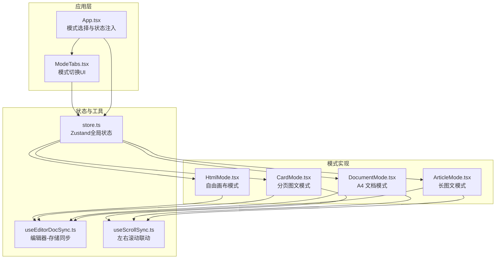
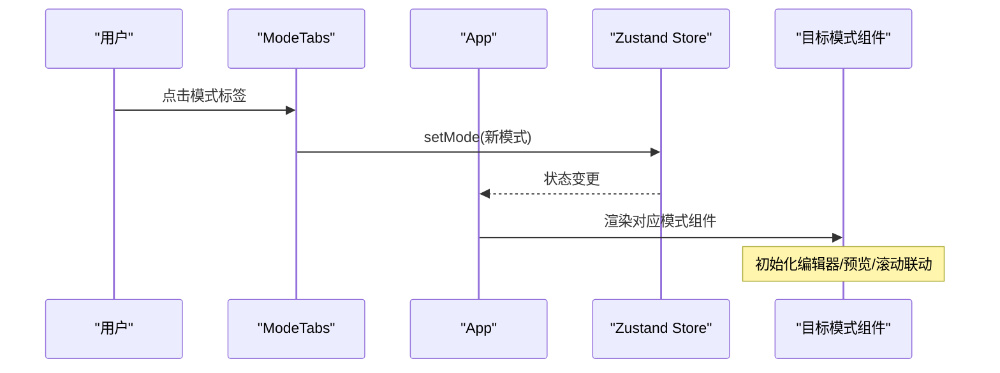
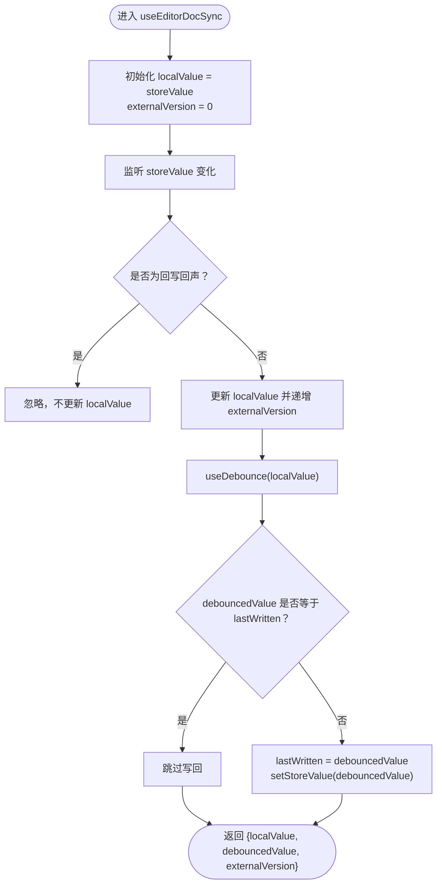
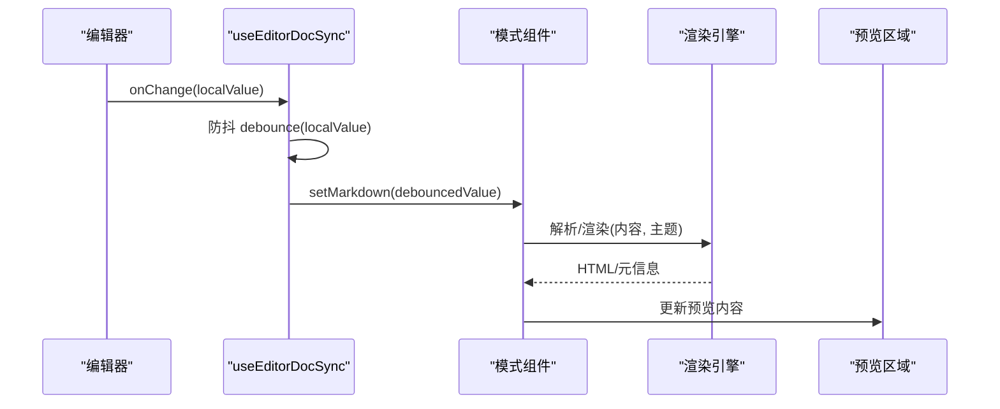
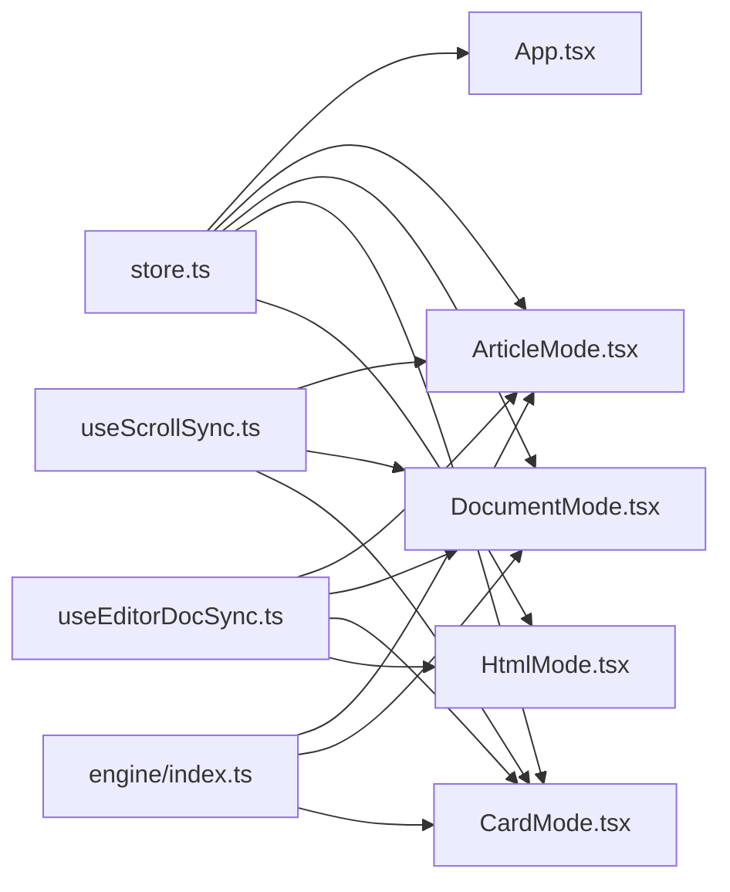

# 编辑模式API

<cite>
**本文引用的文件**
- [App.tsx](file://src/App.tsx)
- [ModeTabs.tsx](file://src/components/layout/ModeTabs.tsx)
- [store.ts](file://src/lib/store.ts)
- [useEditorDocSync.ts](file://src/lib/useEditorDocSync.ts)
- [useScrollSync.ts](file://src/lib/useScrollSync.ts)
- [ArticleMode.tsx](file://src/modes/article/ArticleMode.tsx)
- [ArticlePreview.tsx](file://src/modes/article/ArticlePreview.tsx)
- [DocumentMode.tsx](file://src/modes/document/DocumentMode.tsx)
- [documentModel.ts](file://src/modes/document/documentModel.ts)
- [documentStyles.ts](file://src/modes/document/documentStyles.ts)
- [CardMode.tsx](file://src/modes/card/CardMode.tsx)
- [cardModel.ts](file://src/modes/card/cardModel.ts)
- [HtmlMode.tsx](file://src/modes/html/HtmlMode.tsx)
- [HtmlSandbox.tsx](file://src/components/preview/HtmlSandbox.tsx)
- [engine/index.ts](file://src/engine/index.ts)
</cite>

## 目录
1. [简介](#简介)
2. [项目结构](#项目结构)
3. [核心组件](#核心组件)
4. [架构总览](#架构总览)
5. [详细组件分析](#详细组件分析)
6. [依赖关系分析](#依赖关系分析)
7. [性能考量](#性能考量)
8. [故障排查指南](#故障排查指南)
9. [结论](#结论)
10. [附录](#附录)

## 简介
本文件为 MarkFlow 的“编辑模式系统”API参考文档，聚焦以下主题：
- 模式切换 API：如何在四种编辑模式之间切换与初始化
- 内容同步接口：编辑器与全局状态之间的双向同步机制
- 预览更新机制：不同模式下的预览渲染与刷新策略
- 配置选项与自定义参数：各模式的可配置项与默认值
- 模式间的数据传递与状态共享：跨模式共享的主题、字体、平台等
- 生命周期钩子与事件监听：滚动同步、页面检测、键盘/滚轮交互
- 模式扩展与插件机制：基于现有模式的扩展点与接入方式
- 使用示例与集成指南：如何在应用中集成与扩展编辑模式
- 模式特定功能接口：导出、复制、测量、分页等

## 项目结构
编辑模式系统围绕四个核心模式展开：长图文、A4 文档、分页图文（小红书）、自由画布（HTML）。它们通过统一的状态管理与工具函数实现内容同步、滚动联动与预览渲染。

图表来源
- [App.tsx:34-171](file://src/App.tsx#L34-L171)
- [ModeTabs.tsx:15-41](file://src/components/layout/ModeTabs.tsx#L15-L41)
- [store.ts:54-92](file://src/lib/store.ts#L54-L92)
- [useEditorDocSync.ts:20-49](file://src/lib/useEditorDocSync.ts#L20-L49)
- [useScrollSync.ts:7-66](file://src/lib/useScrollSync.ts#L7-L66)
- [ArticleMode.tsx:16-54](file://src/modes/article/ArticleMode.tsx#L16-L54)
- [DocumentMode.tsx:34-344](file://src/modes/document/DocumentMode.tsx#L34-L344)
- [CardMode.tsx:44-363](file://src/modes/card/CardMode.tsx#L44-L363)
- [HtmlMode.tsx:92-578](file://src/modes/html/HtmlMode.tsx#L92-L578)

章节来源
- [App.tsx:34-171](file://src/App.tsx#L34-L171)
- [ModeTabs.tsx:15-41](file://src/components/layout/ModeTabs.tsx#L15-L41)
- [store.ts:54-92](file://src/lib/store.ts#L54-L92)

## 核心组件
- 模式切换
  - App.tsx 负责根据当前模式渲染对应模式组件，并注入全局状态与回调。
  - ModeTabs.tsx 提供 UI 层的模式切换入口，onChange 通过 store.setMode 更新模式。
- 内容同步
  - useEditorDocSync.ts 实现编辑器本地值与全局存储的双向同步，带防抖与外部版本信号，避免回写回声。
- 预览更新
  - 各模式通过渲染引擎与工具函数进行预览更新，如 Markdown 解析、HTML 沙箱、分页计算等。
- 滚动联动
  - useScrollSync.ts 提供左右面板的主从联动滚动，避免相互拉扯。

章节来源
- [App.tsx:34-171](file://src/App.tsx#L34-L171)
- [ModeTabs.tsx:15-41](file://src/components/layout/ModeTabs.tsx#L15-L41)
- [store.ts:214-220](file://src/lib/store.ts#L214-L220)
- [useEditorDocSync.ts:20-49](file://src/lib/useEditorDocSync.ts#L20-L49)
- [useScrollSync.ts:7-66](file://src/lib/useScrollSync.ts#L7-L66)

## 架构总览
编辑模式系统采用“状态集中、模式解耦”的架构：
- 状态中心：store.ts 统一管理各模式内容、主题、平台、文档设置等。
- 模式组件：各模式组件仅负责 UI 与交互，不直接访问持久化存储。
- 同步与联动：useEditorDocSync.ts 保证编辑器与 store 的一致性；useScrollSync.ts 保证编辑器与预览的滚动一致性。
- 渲染与导出：各模式内部调用渲染引擎与导出工具，实现预览与产物输出。

图表来源
- [ModeTabs.tsx:24-38](file://src/components/layout/ModeTabs.tsx#L24-L38)
- [store.ts:214-220](file://src/lib/store.ts#L214-L220)
- [App.tsx:134-165](file://src/App.tsx#L134-L165)

## 详细组件分析

### 模式切换 API
- 模式枚举与类型
  - RenderMode: 'article' | 'document' | 'card' | 'html'
  - InputType: 'markdown' | 'html'
  - PlatformPreset: 'longform' | 'xiaohongshu'
- 切换入口
  - ModeTabs 提供 UI 切换，onChange 调用 store.setMode
  - App 根据 store.mode 渲染对应模式组件
- 切换副作用
  - setMode 会同时更新 inputType 与 platform（card 模式固定为 xiaohongshu）

章节来源
- [store.ts:10-12](file://src/lib/store.ts#L10-L12)
- [ModeTabs.tsx:8-13](file://src/components/layout/ModeTabs.tsx#L8-L13)
- [ModeTabs.tsx:24-38](file://src/components/layout/ModeTabs.tsx#L24-L38)
- [store.ts:214-220](file://src/lib/store.ts#L214-L220)
- [App.tsx:134-165](file://src/App.tsx#L134-L165)

### 内容同步接口
- useEditorDocSync
  - 输入：storeValue（来自全局状态）、setStoreValue（写回 store）
  - 输出：localValue（编辑器本地值）、debouncedValue（防抖后用于渲染/回写）、externalVersion（外部重置信号）
  - 行为：
    - 外部变更：识别回写回声，避免编辑器丢字；递增 externalVersion 通知编辑器覆盖
    - 本地变更：防抖后回写 store，避免冗余写入
- 适用范围
  - ArticleMode、DocumentMode、CardMode、HtmlMode 均使用该 Hook 进行编辑器与 store 的同步

图表来源
- [useEditorDocSync.ts:20-49](file://src/lib/useEditorDocSync.ts#L20-L49)

章节来源
- [useEditorDocSync.ts:20-49](file://src/lib/useEditorDocSync.ts#L20-L49)
- [ArticleMode.tsx:18-23](file://src/modes/article/ArticleMode.tsx#L18-L23)
- [DocumentMode.tsx:48-54](file://src/modes/document/DocumentMode.tsx#L48-L54)
- [CardMode.tsx:72-78](file://src/modes/card/CardMode.tsx#L72-L78)
- [HtmlMode.tsx:104-110](file://src/modes/html/HtmlMode.tsx#L104-L110)

### 预览更新机制
- Article 模式
  - 渲染：renderMarkdown(debouncedMarkdown, colors) 产出 HTML
  - 预览：ArticlePreview 接收 rendered 与滚动 ref
- Document 模式
  - 渲染：renderMarkdown 生成 meta 与内容 HTML
  - 分页：createDocumentModel + paginateDocumentBlocks 计算分页
  - 预览：隐藏测量容器 + ResizeObserver 动态测量高度，再渲染分页
- Card 模式
  - 渲染：parseMarkdown + buildContentCard/buildCover 生成卡片 HTML
  - 预览：隐藏测量容器 + useLayoutEffect 计算实际高度，再批量渲染
- Html 模式
  - 渲染：HtmlSandbox 加载 debouncedHtml
  - 页面检测：detectPages 自动识别 .page/.slide/.card
  - 预览：多页模式下仅显示当前页，支持键盘/滚轮翻页

图表来源
- [useEditorDocSync.ts:38-46](file://src/lib/useEditorDocSync.ts#L38-L46)
- [ArticleMode.tsx:25](file://src/modes/article/ArticleMode.tsx#L25)
- [DocumentMode.tsx:57-60](file://src/modes/document/DocumentMode.tsx#L57-L60)
- [CardMode.tsx:80-83](file://src/modes/card/CardMode.tsx#L80-L83)
- [HtmlMode.tsx:150-165](file://src/modes/html/HtmlMode.tsx#L150-L165)

章节来源
- [ArticleMode.tsx:25](file://src/modes/article/ArticleMode.tsx#L25)
- [DocumentMode.tsx:57-60](file://src/modes/document/DocumentMode.tsx#L57-L60)
- [CardMode.tsx:80-83](file://src/modes/card/CardMode.tsx#L80-L83)
- [HtmlMode.tsx:150-165](file://src/modes/html/HtmlMode.tsx#L150-L165)

### 滚动联动机制
- useScrollSync
  - 主从策略：鼠标进入/滚轮/触摸时确定主导方，仅主导方滚动驱动另一方
  - 比例联动：scrollTop 按比例映射，使用 requestAnimationFrame 优化
- 适用范围
  - Article、Document、Card 模式均使用 useScrollSync 实现编辑器与预览的联动

章节来源
- [useScrollSync.ts:7-66](file://src/lib/useScrollSync.ts#L7-L66)
- [ArticleMode.tsx:30](file://src/modes/article/ArticleMode.tsx#L30)
- [DocumentMode.tsx:46](file://src/modes/document/DocumentMode.tsx#L46)
- [CardMode.tsx:66](file://src/modes/card/CardMode.tsx#L66)

### 配置选项与自定义参数

#### 文档模式（DocumentMode）
- 设置项（DocumentSettings）
  - 页面尺寸：pageWidth/pageHeight
  - 边距：marginTop/marginRight/marginBottom/ml
  - 页眉/页脚：headerHeight/footerHeight、headerLeft/headerRight/footerText
  - 主题与排版：theme、fontFamily、fontScale、centerTitle、indentParagraph
- 默认值
  - DEFAULT_DOCUMENT_SETTINGS 定义了 A4 尺寸与默认排版参数
- 关键函数
  - createDocumentModel：解析 Markdown 为 blocks，再分页
  - paginateDocumentBlocks：按有效高度与断页策略分页
  - documentStyles：标题样式变量

章节来源
- [documentModel.ts:30-66](file://src/modes/document/documentModel.ts#L30-L66)
- [documentModel.ts:49](file://src/modes/document/documentModel.ts#L49)
- [documentModel.ts:319-327](file://src/modes/document/documentModel.ts#L319-L327)
- [documentModel.ts:265-317](file://src/modes/document/documentModel.ts#L265-L317)
- [documentStyles.ts](file://src/modes/document/documentStyles.ts)

#### 分页图文模式（CardMode）
- 平台与比例
  - CardPlatform：xiaohongshu
  - 比例：ASPECTS 支持 3:4、9:16 等
- 关键函数
  - createCardModel：提取 meta、拆分块、按预算分页、生成封面与内容页 HTML
  - buildCardCaption：生成发布文案
- 字体与品牌
  - 支持多种字体，作者名可自定义

章节来源
- [cardModel.ts:3-17](file://src/modes/card/cardModel.ts#L3-L17)
- [cardModel.ts:163-186](file://src/modes/card/cardModel.ts#L163-L186)
- [CardMode.tsx:52-56](file://src/modes/card/CardMode.tsx#L52-L56)
- [CardMode.tsx:118-144](file://src/modes/card/CardMode.tsx#L118-L144)

#### 自由画布模式（HtmlMode）
- 页面检测与翻页
  - detectPages：自动识别 .page/.slide/.card
  - 键盘/滚轮翻页：ArrowLeft/Right/Down/Up 与滚轮
- 缩放与适配
  - 自动缩放：根据可见页尺寸或根元素宽度计算缩放比
- 导出能力
  - PNG/PDF 导出：单页/当前页/全部页/打包 ZIP

章节来源
- [HtmlMode.tsx:115-173](file://src/modes/html/HtmlMode.tsx#L115-L173)
- [HtmlMode.tsx:175-250](file://src/modes/html/HtmlMode.tsx#L175-L250)
- [HtmlMode.tsx:252-344](file://src/modes/html/HtmlMode.tsx#L252-L344)
- [HtmlMode.tsx:346-453](file://src/modes/html/HtmlMode.tsx#L346-L453)

### 模式间的数据传递与状态共享
- 共享状态
  - 主题颜色 ThemeColors：colors 来自 store，注入各模式
  - 平台：platform（card 模式固定为 xiaohongshu）
  - 字体：articleFont、cardFont
  - 输入类型：inputType（markdown/html）随模式切换
- 状态更新
  - setTheme：更新 CSS 变量与 colors
  - updateDocumentSettings：部分更新文档设置
  - setPlatform：切换平台
  - setArticleFont/setCardFont：切换字体

章节来源
- [store.ts:64-91](file://src/lib/store.ts#L64-L91)
- [store.ts:222-230](file://src/lib/store.ts#L222-L230)
- [store.ts:223-224](file://src/lib/store.ts#L223-L224)
- [store.ts:226-227](file://src/lib/store.ts#L226-L227)
- [store.ts:214-220](file://src/lib/store.ts#L214-L220)

### 生命周期钩子与事件监听
- 模式组件生命周期
  - Article/Document/Card：useMemo 渲染预览，useEffect 初始化滚动与测量
  - Html：useEffect 监听编辑器滚动、页面检测、键盘/滚轮翻页、缩放适配
- 事件监听
  - useScrollSync：mouseenter/wheel/touchstart 确定主导方
  - Html：ResizeObserver、图片 load、字体 ready、滚动/滚轮/键盘事件

章节来源
- [ArticleMode.tsx:25-30](file://src/modes/article/ArticleMode.tsx#L25-L30)
- [DocumentMode.tsx:66-125](file://src/modes/document/DocumentMode.tsx#L66-L125)
- [CardMode.tsx:85-116](file://src/modes/card/CardMode.tsx#L85-L116)
- [HtmlMode.tsx:119-250](file://src/modes/html/HtmlMode.tsx#L119-L250)
- [useScrollSync.ts:43-66](file://src/lib/useScrollSync.ts#L43-L66)

### 模式扩展与插件机制
- 扩展点
  - 新增模式：新建模式组件，遵循 useEditorDocSync 与 useScrollSync 的约定
  - 渲染引擎：engine/index.ts 暴露解析与组件注册，可在新模式中复用
  - 导出工具：exportPdf、exportImage、zipDownload 可在新模式中复用
- 插件机制
  - 组件注册：engine/editor-components 提供组件注册与映射，新模式可扩展组件
  - 主题系统：ThemeColors 与 makeColors 支持主题定制

章节来源
- [engine/index.ts:3-15](file://src/engine/index.ts#L3-L15)
- [App.tsx:13-16](file://src/App.tsx#L13-L16)

### 使用示例与集成指南
- 在 App 中集成新模式
  - 在 App.tsx 中引入新模式组件并添加路由分支
  - 在 store.ts 中为新模式添加状态字段与 setter
  - 在 ModeTabs.tsx 中添加模式标签
- 使用同步与联动
  - 在新模式组件中使用 useEditorDocSync 与 useScrollSync
  - 通过 store 注入 colors、platform、settings 等参数
- 导出与预览
  - 复用 HtmlMode 的导出流程或 DocumentMode 的分页渲染流程

章节来源
- [App.tsx:134-165](file://src/App.tsx#L134-L165)
- [store.ts:54-92](file://src/lib/store.ts#L54-L92)
- [ModeTabs.tsx:24-38](file://src/components/layout/ModeTabs.tsx#L24-L38)
- [useEditorDocSync.ts:20-49](file://src/lib/useEditorDocSync.ts#L20-L49)
- [useScrollSync.ts:7-66](file://src/lib/useScrollSync.ts#L7-L66)

### 模式特定功能接口
- 文档模式
  - 导出 PDF：handleExportPdf
  - 复制 AI 指令：buildDocumentAiGuide
- 分页图文模式
  - 导出 PNG/ZIP：exportOne/exportAll/exportZip
  - 复制文案/指令：copyCaption/copyGuide
  - 动态高度测量：useLayoutEffect + 隐藏测量容器
- 自由画布模式
  - 多页翻页：键盘/滚轮/工具栏按钮
  - 高保真导出：withScaleReset + captureIframeElement
  - Prompt 库：PromptLibrary + buildDesignPrompt

章节来源
- [DocumentMode.tsx:134-161](file://src/modes/document/DocumentMode.tsx#L134-L161)
- [CardMode.tsx:146-224](file://src/modes/card/CardMode.tsx#L146-L224)
- [CardMode.tsx:304-360](file://src/modes/card/CardMode.tsx#L304-L360)
- [HtmlMode.tsx:167-250](file://src/modes/html/HtmlMode.tsx#L167-L250)
- [HtmlMode.tsx:346-453](file://src/modes/html/HtmlMode.tsx#L346-L453)
- [HtmlMode.tsx:571-575](file://src/modes/html/HtmlMode.tsx#L571-L575)

## 依赖关系分析

图表来源
- [store.ts:54-92](file://src/lib/store.ts#L54-L92)
- [App.tsx:34-171](file://src/App.tsx#L34-L171)
- [useEditorDocSync.ts:20-49](file://src/lib/useEditorDocSync.ts#L20-L49)
- [useScrollSync.ts:7-66](file://src/lib/useScrollSync.ts#L7-L66)
- [engine/index.ts:3-15](file://src/engine/index.ts#L3-L15)

章节来源
- [store.ts:54-92](file://src/lib/store.ts#L54-L92)
- [App.tsx:34-171](file://src/App.tsx#L34-L171)
- [useEditorDocSync.ts:20-49](file://src/lib/useEditorDocSync.ts#L20-L49)
- [useScrollSync.ts:7-66](file://src/lib/useScrollSync.ts#L7-L66)
- [engine/index.ts:3-15](file://src/engine/index.ts#L3-L15)

## 性能考量
- 防抖与去抖
  - useEditorDocSync 对本地输入进行防抖，减少回写频率与渲染压力
- 滚动优化
  - useScrollSync 使用 requestAnimationFrame 与主导方策略，避免相互拉扯
- 测量与分页
  - Document/Html 使用 ResizeObserver 与隐藏测量容器，按需计算高度与分页
- 导出策略
  - Html 模式在导出前重置缩放与显示状态，保证高保真输出

## 故障排查指南
- 编辑器内容不同步
  - 检查 useEditorDocSync 的 externalVersion 是否正确递增
  - 确认 store 值未被外部逻辑覆盖
- 预览不更新
  - 确认 debouncedValue 已变化并触发渲染
  - Document/Html 模式检查隐藏测量容器与 ResizeObserver 是否生效
- 滚动不同步
  - 检查 useScrollSync 的主导方判定与比例映射
  - 确认容器高度与 scrollTop 计算正常
- 导出失败
  - Html 模式检查 iframe 内容是否加载完成
  - 确认 withScaleReset 已正确恢复缩放状态

章节来源
- [useEditorDocSync.ts:31-46](file://src/lib/useEditorDocSync.ts#L31-L46)
- [DocumentMode.tsx:66-125](file://src/modes/document/DocumentMode.tsx#L66-L125)
- [HtmlMode.tsx:119-250](file://src/modes/html/HtmlMode.tsx#L119-L250)
- [useScrollSync.ts:17-27](file://src/lib/useScrollSync.ts#L17-L27)

## 结论
编辑模式系统通过统一的状态管理与通用工具，实现了四种模式的一致性体验与高效开发。其核心在于：
- 明确的模式切换与状态注入
- 稳健的内容同步与预览更新
- 可靠的滚动联动与交互事件
- 可扩展的渲染引擎与导出能力

开发者可在此基础上快速扩展新的编辑模式，并复用现有的同步、联动与导出能力。

## 附录
- 相关工具与引擎
  - 渲染引擎：parseMarkdown、inlineFormat、components、makeColors
  - 导出工具：exportPdf、exportImage、zipDownload
  - 编辑器：CodeEditor、HtmlSandbox

章节来源
- [engine/index.ts:3-15](file://src/engine/index.ts#L3-L15)