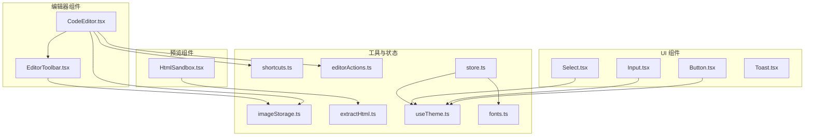
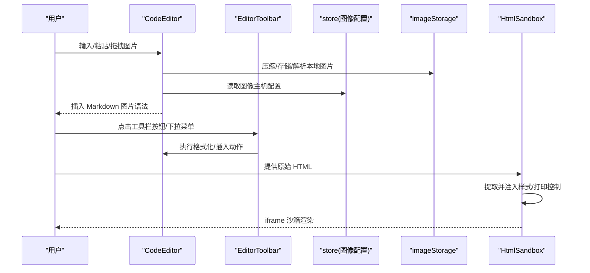
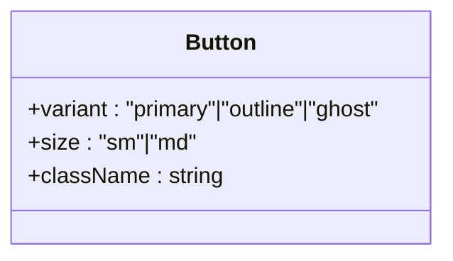
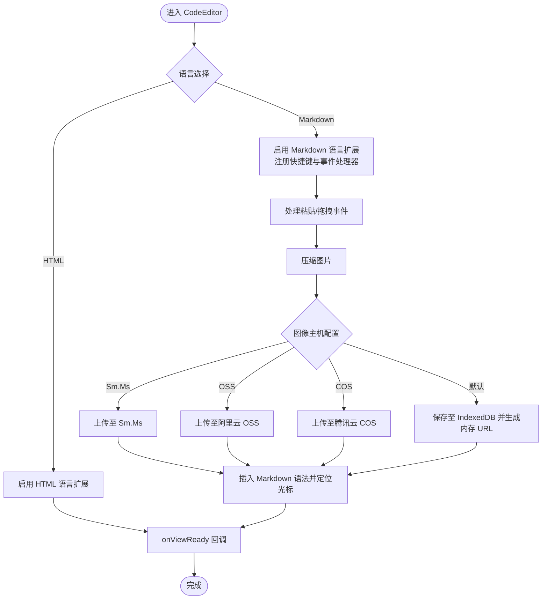
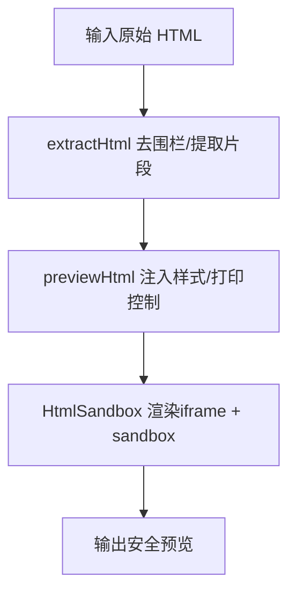
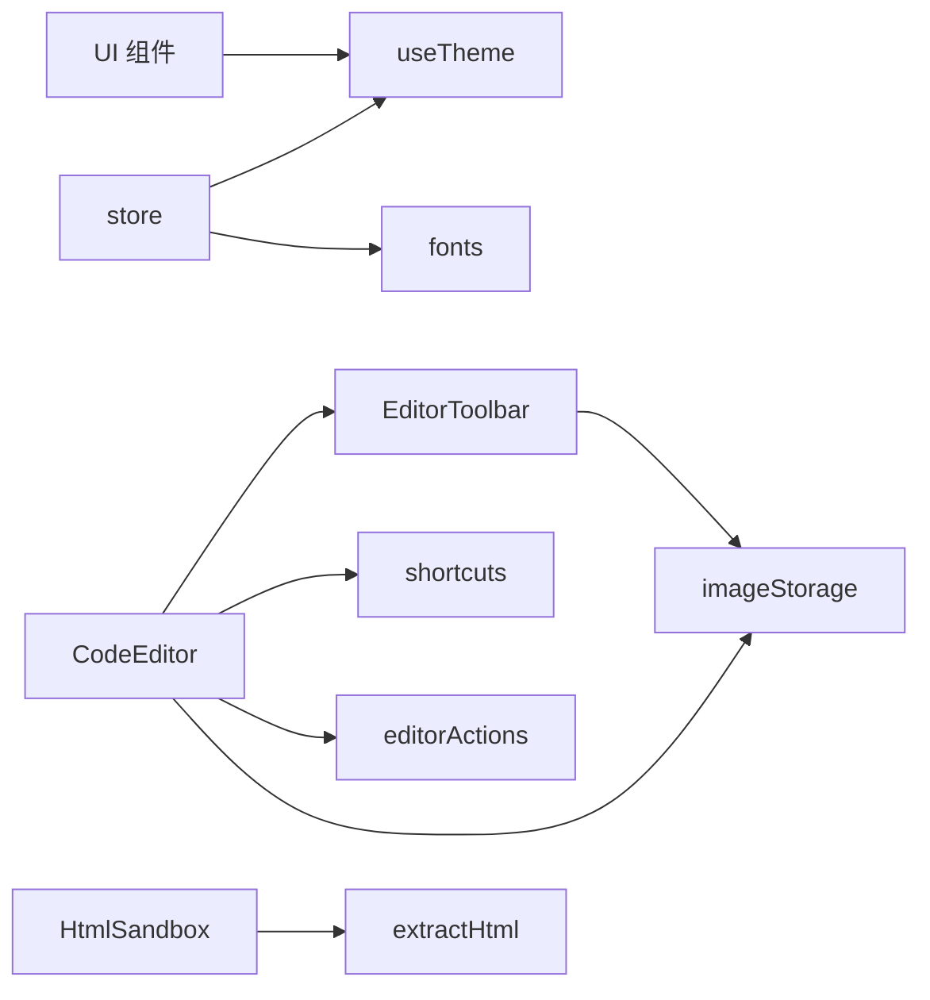

# UI组件库

<cite>
**本文引用的文件**
- [Button.tsx](file://src/components/ui/Button.tsx)
- [Input.tsx](file://src/components/ui/Input.tsx)
- [Select.tsx](file://src/components/ui/Select.tsx)
- [Toast.tsx](file://src/components/ui/Toast.tsx)
- [CodeEditor.tsx](file://src/components/editor/CodeEditor.tsx)
- [EditorToolbar.tsx](file://src/components/editor/EditorToolbar.tsx)
- [HtmlSandbox.tsx](file://src/components/preview/HtmlSandbox.tsx)
- [shortcuts.ts](file://src/lib/editor/shortcuts.ts)
- [editorActions.ts](file://src/lib/editor/editorActions.ts)
- [imageStorage.ts](file://src/lib/editor/imageStorage.ts)
- [extractHtml.ts](file://src/lib/extractHtml.ts)
- [store.ts](file://src/lib/store.ts)
- [useTheme.ts](file://src/engine/composables/useTheme.ts)
- [fonts.ts](file://src/lib/fonts.ts)
- [index.css](file://src/index.css)
- [package.json](file://package.json)
</cite>

## 目录
1. [简介](#简介)
2. [项目结构](#项目结构)
3. [核心组件](#核心组件)
4. [架构总览](#架构总览)
5. [详细组件分析](#详细组件分析)
6. [依赖关系分析](#依赖关系分析)
7. [性能考量](#性能考量)
8. [故障排查指南](#故障排查指南)
9. [结论](#结论)
10. [附录](#附录)

## 简介
本文件为 MarkFlow UI 组件库的完整技术文档，面向设计师与前端开发者，系统性介绍基础 UI 组件（Button、Input、Select、Toast）与编辑器专用组件（CodeEditor、EditorToolbar）、预览组件（HtmlSandbox）的设计规范、实现细节、API 参考、安全与样式隔离策略、可访问性与跨浏览器兼容性建议，以及组件组合模式与最佳实践。

## 项目结构
UI 组件按功能分层组织于 src/components 下：
- ui：基础通用 UI 组件（Button、Input、Select、Toast）
- editor：编辑器相关组件（CodeEditor、EditorToolbar）
- preview：预览相关组件（HtmlSandbox）
- lib：编辑器工具与状态管理（shortcuts、editorActions、imageStorage、extractHtml、store）
- engine：主题与渲染相关（useTheme）
- lib/fonts：字体族映射
- index.css：全局样式与主题变量

图表来源
- [Button.tsx:1-35](file://src/components/ui/Button.tsx#L1-L35)
- [Input.tsx:1-14](file://src/components/ui/Input.tsx#L1-L14)
- [Select.tsx:1-14](file://src/components/ui/Select.tsx#L1-L14)
- [Toast.tsx:1-34](file://src/components/ui/Toast.tsx#L1-L34)
- [CodeEditor.tsx:1-245](file://src/components/editor/CodeEditor.tsx#L1-L245)
- [EditorToolbar.tsx:1-153](file://src/components/editor/EditorToolbar.tsx#L1-L153)
- [HtmlSandbox.tsx:1-50](file://src/components/preview/HtmlSandbox.tsx#L1-L50)
- [shortcuts.ts:1-63](file://src/lib/editor/shortcuts.ts#L1-L63)
- [editorActions.ts:1-174](file://src/lib/editor/editorActions.ts#L1-L174)
- [imageStorage.ts:1-259](file://src/lib/editor/imageStorage.ts#L1-L259)
- [extractHtml.ts:1-113](file://src/lib/extractHtml.ts#L1-L113)
- [store.ts:1-242](file://src/lib/store.ts#L1-L242)
- [useTheme.ts:1-68](file://src/engine/composables/useTheme.ts#L1-L68)
- [fonts.ts:1-16](file://src/lib/fonts.ts#L1-L16)

章节来源
- [package.json:1-52](file://package.json#L1-L52)
- [index.css:1-288](file://src/index.css#L1-L288)

## 核心组件
本节概述基础 UI 组件的设计原则与使用方式，统一采用 Tailwind 类名拼接与 CSS 变量主题色，支持通过 className 扩展样式。

- Button
  - 属性：继承原生 button，新增 variant（primary/outline/ghost）、size（sm/md）
  - 样式：基于基础类 + 变体 + 尺寸 + 外部 className 合并
  - 无障碍：保持原生按钮语义，支持禁用态与焦点可见性
- Input
  - 属性：继承原生 input，带边框、聚焦高亮、禁用态
  - 样式：圆角、尺寸、边框、文本颜色、过渡
- Select
  - 属性：继承原生 select
  - 样式：圆角、尺寸、边框、文本颜色、过渡
- Toast
  - 状态：message + key（用于重复提示）
  - 行为：接收 toast 后自动显示约 2.2 秒，淡入淡出

章节来源
- [Button.tsx:1-35](file://src/components/ui/Button.tsx#L1-L35)
- [Input.tsx:1-14](file://src/components/ui/Input.tsx#L1-L14)
- [Select.tsx:1-14](file://src/components/ui/Select.tsx#L1-L14)
- [Toast.tsx:1-34](file://src/components/ui/Toast.tsx#L1-L34)

## 架构总览
MarkFlow 的编辑器与预览链路围绕 Zustand 状态中心展开，编辑器组件负责内容输入与图片处理，预览组件通过 iframe 沙箱渲染 HTML 并注入样式隔离与打印控制。

图表来源
- [CodeEditor.tsx:1-245](file://src/components/editor/CodeEditor.tsx#L1-L245)
- [EditorToolbar.tsx:1-153](file://src/components/editor/EditorToolbar.tsx#L1-L153)
- [imageStorage.ts:1-259](file://src/lib/editor/imageStorage.ts#L1-L259)
- [store.ts:1-242](file://src/lib/store.ts#L1-L242)
- [HtmlSandbox.tsx:1-50](file://src/components/preview/HtmlSandbox.ts#L1-L50)

## 详细组件分析

### Button 组件
- 设计要点
  - 变体：primary（强调）、outline（描边）、ghost（透明）
  - 尺寸：sm、md
  - 主题：使用 CSS 变量 --accent 控制强调色
- 使用建议
  - 优先使用 outline 作为默认按钮，primary 用于关键操作
  - 禁用态需明确视觉反馈与不可交互提示

图表来源
- [Button.tsx:3-6](file://src/components/ui/Button.tsx#L3-L6)

章节来源
- [Button.tsx:1-35](file://src/components/ui/Button.tsx#L1-L35)
- [useTheme.ts:58-67](file://src/engine/composables/useTheme.ts#L58-L67)
- [index.css:3-7](file://src/index.css#L3-L7)

### Input 组件
- 设计要点
  - 统一圆角、边框、文本颜色
  - 聚焦态高亮边框，禁用态半透明与不可交互
- 使用建议
  - 与 Form 组件配合时，提供 label 与错误提示
  - 长度与类型校验结合后端接口约束

章节来源
- [Input.tsx:1-14](file://src/components/ui/Input.tsx#L1-L14)

### Select 组件
- 设计要点
  - 与 Input 一致的圆角与边框风格
  - 聚焦态与禁用态一致性
- 使用建议
  - 大量选项时配合搜索/分组展示
  - 与表单联动时提供默认值与必填校验

章节来源
- [Select.tsx:1-14](file://src/components/ui/Select.tsx#L1-L14)

### Toast 组件
- 行为
  - 接收 toast 状态，自动出现与消失
  - 通过 key 触发相同消息的重复弹出
- 使用建议
  - 仅用于轻量提示，避免频繁弹窗
  - 与全局状态管理结合，集中控制弹窗队列

章节来源
- [Toast.tsx:1-34](file://src/components/ui/Toast.tsx#L1-L34)

### CodeEditor 组件
- 功能特性
  - 支持 Markdown 与 HTML 语言扩展
  - 主题：浅色主题（含行 gutter、活动行高亮）
  - 图片粘贴/拖拽：压缩、上传/本地存储、插入 Markdown 语法
  - 快捷键：内置 Markdown 快捷键绑定
  - 外部重置：通过 externalVersion 强制写入最新值，避免受控竞态
  - 语言预加载：模块级预加载减少首次切换语言的延迟
- 关键流程

图表来源
- [CodeEditor.tsx:19-245](file://src/components/editor/CodeEditor.tsx#L19-L245)
- [imageStorage.ts:58-137](file://src/lib/editor/imageStorage.ts#L58-L137)
- [shortcuts.ts:10-62](file://src/lib/editor/shortcuts.ts#L10-L62)

章节来源
- [CodeEditor.tsx:1-245](file://src/components/editor/CodeEditor.tsx#L1-L245)
- [shortcuts.ts:1-63](file://src/lib/editor/shortcuts.ts#L1-L63)
- [imageStorage.ts:1-259](file://src/lib/editor/imageStorage.ts#L1-L259)

### EditorToolbar 组件
- 功能特性
  - 按钮组：格式化、插入块级容器、快捷操作
  - 下拉组：语言/模板选择
  - 图片上传：文件选择、压缩、上传/本地存储、插入 Markdown 语法
- 交互行为
  - 通过 toolbarGroups 配置按钮与下拉项
  - 执行 action 时聚焦编辑器，提升连续编辑体验

章节来源
- [EditorToolbar.tsx:1-153](file://src/components/editor/EditorToolbar.tsx#L1-L153)
- [imageStorage.ts:1-259](file://src/lib/editor/imageStorage.ts#L1-L259)

### HtmlSandbox 组件
- 安全与隔离
  - 使用 iframe + srcDoc 注入
  - sandbox 策略：默认 allow-same-origin，可选 allow-scripts
  - 通过 previewHtml 注入样式隔离与打印控制
- 样式与渲染
  - 自动为样式表注入 crossOrigin="anonymous"，利于截图库读取 @font-face
  - 注入防御性排版样式，避免截图乱码与折行问题
  - 屏幕端注入页面居中与缩放，打印端注入强制换页样式

图表来源
- [HtmlSandbox.tsx:10-26](file://src/components/preview/HtmlSandbox.tsx#L10-L26)
- [extractHtml.ts:5-112](file://src/lib/extractHtml.ts#L5-L112)

章节来源
- [HtmlSandbox.tsx:1-50](file://src/components/preview/HtmlSandbox.tsx#L1-L50)
- [extractHtml.ts:1-113](file://src/lib/extractHtml.ts#L1-L113)

## 依赖关系分析
- 组件间耦合
  - CodeEditor 依赖 EditorToolbar、shortcuts、editorActions、imageStorage
  - EditorToolbar 依赖 store 的图像主机配置与 imageStorage
  - HtmlSandbox 依赖 extractHtml
  - UI 组件共享 useTheme 的主题色常量与 CSS 变量
- 外部依赖
  - 编辑器：@uiw/react-codemirror、@codemirror/*、katex、highlight.js
  - 状态：zustand、persist
  - 图床：ali-oss、cos-js-sdk-v5
  - 截图与导出：modern-screenshot、jspdf、fflate

图表来源
- [CodeEditor.tsx:1-245](file://src/components/editor/CodeEditor.tsx#L1-L245)
- [EditorToolbar.tsx:1-153](file://src/components/editor/EditorToolbar.tsx#L1-L153)
- [HtmlSandbox.tsx:1-50](file://src/components/preview/HtmlSandbox.tsx#L1-L50)
- [store.ts:1-242](file://src/lib/store.ts#L1-L242)
- [useTheme.ts:1-68](file://src/engine/composables/useTheme.ts#L1-L68)
- [fonts.ts:1-16](file://src/lib/fonts.ts#L1-L16)

章节来源
- [package.json:13-31](file://package.json#L13-L31)

## 性能考量
- 编辑器输入稳定性
  - 非受控初始化 + 受控外部重置，避免全文替换与 IME 组合输入竞态
  - 语言数据模块级预加载，减少首次切换语言的异步加载抖动
- 图片处理
  - Canvas 压缩与 IndexedDB 存储，降低网络请求与跨域风险
  - 预加载 Markdown 中的本地图片到内存 URL，提升渲染速度
- 预览渲染
  - iframe 沙箱隔离，避免样式污染与脚本执行
  - 注入打印样式与防御性排版，减少截图失败与布局错乱

章节来源
- [CodeEditor.tsx:68-112](file://src/components/editor/CodeEditor.tsx#L68-L112)
- [imageStorage.ts:58-137](file://src/lib/editor/imageStorage.ts#L58-L137)
- [extractHtml.ts:50-112](file://src/lib/extractHtml.ts#L50-L112)

## 故障排查指南
- 图片粘贴/拖拽失败
  - 检查图像主机配置是否正确，或回退到本地存储
  - 确认浏览器允许剪贴板与文件拖拽
- 快捷键无效
  - 确保编辑器处于焦点状态，检查快捷键绑定是否生效
- 预览空白或样式异常
  - 检查 HTML 是否包含有效片段，确认是否注入了样式与打印控制
  - 若允许脚本执行，确认脚本未抛错或阻塞渲染
- 主题色不生效
  - 确认 CSS 变量 --accent 与 --accent-dark 已写入 :root

章节来源
- [imageStorage.ts:142-217](file://src/lib/editor/imageStorage.ts#L142-L217)
- [shortcuts.ts:10-62](file://src/lib/editor/shortcuts.ts#L10-L62)
- [extractHtml.ts:50-112](file://src/lib/extractHtml.ts#L50-L112)
- [store.ts:94-99](file://src/lib/store.ts#L94-L99)

## 结论
本 UI 组件库以简洁一致的变体与尺寸体系为基础，结合编辑器专用能力（快捷键、图片处理、语言扩展）与预览沙箱（安全隔离、样式隔离、打印控制），形成从输入到渲染的一体化方案。通过 Zustand 状态中心与主题变量，实现跨组件的风格统一与可定制化。

## 附录

### 组件 API 参考

- Button
  - 属性
    - variant: 'primary' | 'outline' | 'ghost'
    - size: 'sm' | 'md'
    - className: string
  - 事件：继承原生 button
  - 样式：基于基础类 + 变体 + 尺寸 + 外部 className
- Input
  - 属性：继承原生 input
  - 样式：边框、圆角、聚焦态、禁用态
- Select
  - 属性：继承原生 select
  - 样式：边框、圆角、聚焦态、禁用态
- Toast
  - 属性
    - toast: { message: string; key: number }
  - 行为：自动显示与隐藏，支持重复提示
- CodeEditor
  - 属性
    - value: string
    - onChange: (value: string) => void
    - externalVersion?: number
    - onScrollerReady?: (el: HTMLElement) => void
    - onViewReady?: (view: EditorView) => void
    - language?: 'markdown' | 'html'
  - 事件：编辑器生命周期回调
  - 图片处理：粘贴/拖拽自动压缩与上传/本地存储
- EditorToolbar
  - 属性：view: EditorView | null
  - 行为：按钮组与下拉组执行格式化/插入动作，图片上传
- HtmlSandbox
  - 属性
    - html: string
    - refreshKey?: number
    - onLoad?: () => void
    - allowScripts?: boolean

章节来源
- [Button.tsx:3-6](file://src/components/ui/Button.tsx#L3-L6)
- [Input.tsx:3-3](file://src/components/ui/Input.tsx#L3-L3)
- [Select.tsx:3-3](file://src/components/ui/Select.tsx#L3-L3)
- [Toast.tsx:3-7](file://src/components/ui/Toast.tsx#L3-L7)
- [CodeEditor.tsx:19-27](file://src/components/editor/CodeEditor.tsx#L19-L27)
- [EditorToolbar.tsx:15-17](file://src/components/editor/EditorToolbar.tsx#L15-L17)
- [HtmlSandbox.tsx:10-19](file://src/components/preview/HtmlSandbox.tsx#L10-L19)

### 可访问性与跨浏览器兼容性
- 可访问性
  - 使用原生语义元素（button、input、select），保持键盘可达与焦点可见
  - 为按钮与下拉提供 title 或 aria-label
- 跨浏览器
  - 通过 Tailwind 与 CSS 变量统一样式
  - 预览注入防御性排版样式，减少字体回退与截图乱码
  - iframe 沙箱默认关闭脚本，必要时再开启

章节来源
- [index.css:38-43](file://src/index.css#L38-L43)
- [extractHtml.ts:63-99](file://src/lib/extractHtml.ts#L63-L99)

### 组件组合模式与最佳实践
- 组合模式
  - 编辑器 + 工具栏：在 Markdown 模式下启用 EditorToolbar，提供格式化与插入能力
  - 预览沙箱：在编辑器右侧或独立面板中渲染 HtmlSandbox，支持打印与截图
- 最佳实践
  - 使用 Button 的 outline 作为默认按钮，primary 用于关键操作
  - 输入组件与表单联动时，提供 label、占位符与错误提示
  - 图片处理优先本地存储，失败时再尝试第三方图床
  - 预览阶段尽量注入完整 HTML 骨架，避免空 iframe

章节来源
- [EditorToolbar.tsx:76-151](file://src/components/editor/EditorToolbar.tsx#L76-L151)
- [HtmlSandbox.tsx:23-48](file://src/components/preview/HtmlSandbox.tsx#L23-L48)