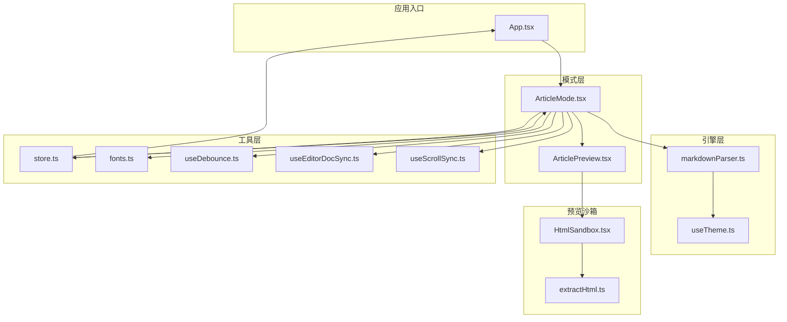
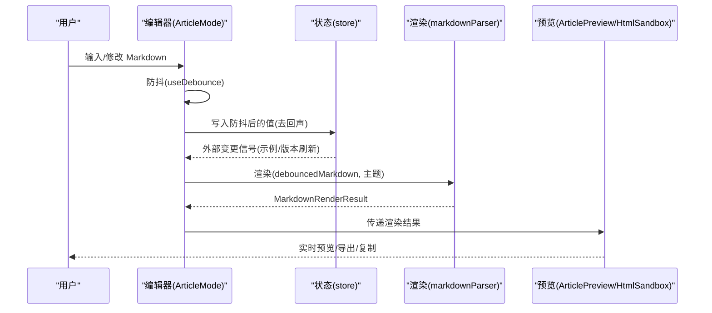
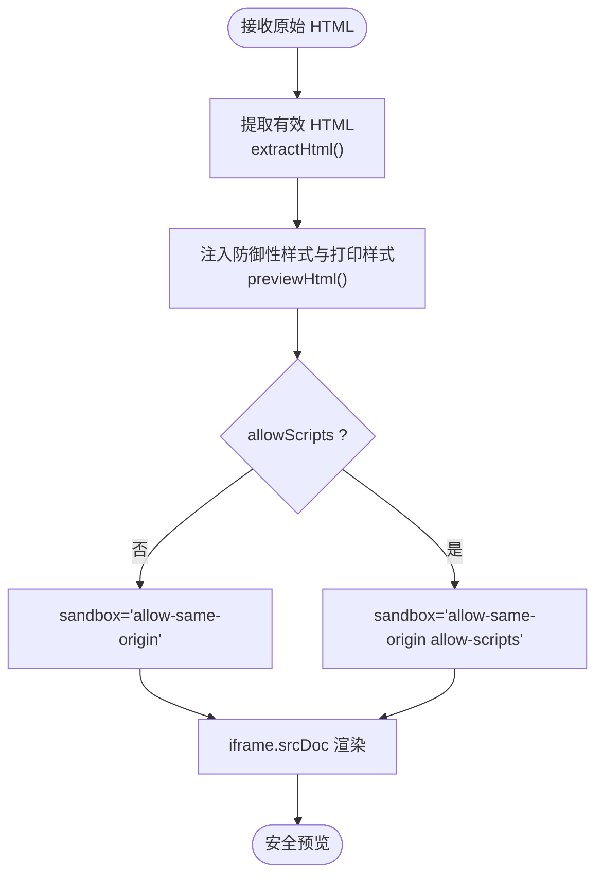
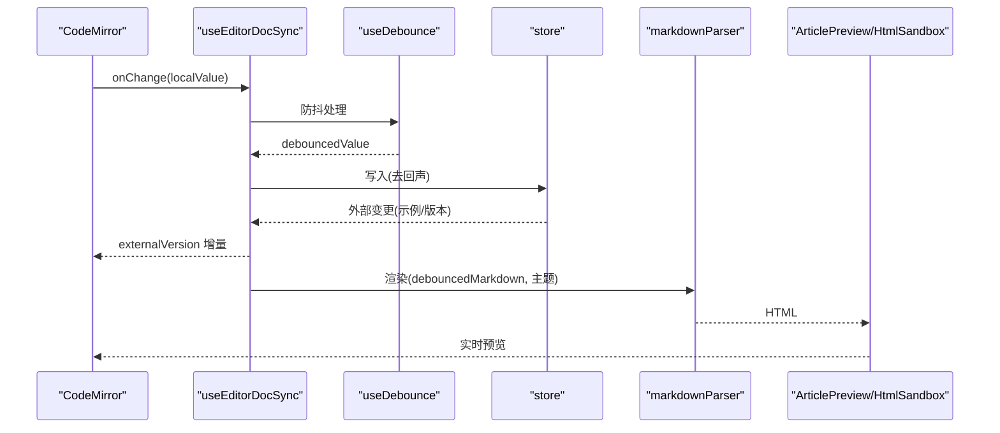
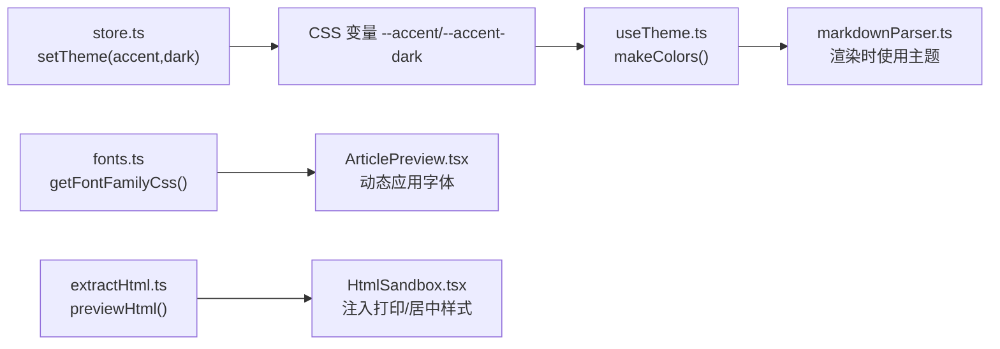
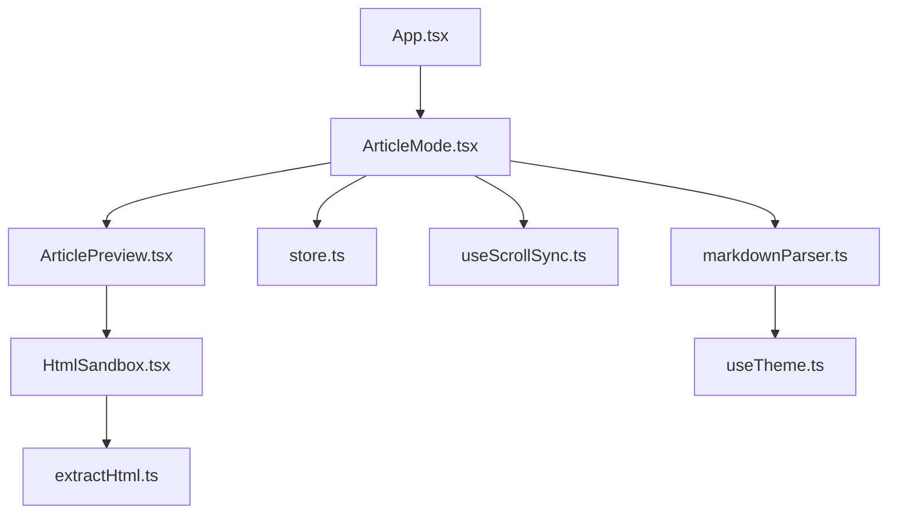
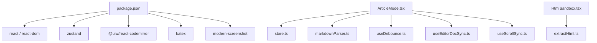

# 预览组件

<cite>
**本文引用的文件**
- [src/components/preview/HtmlSandbox.tsx](file://src/components/preview/HtmlSandbox.tsx)
- [src/lib/extractHtml.ts](file://src/lib/extractHtml.ts)
- [src/modes/article/ArticlePreview.tsx](file://src/modes/article/ArticlePreview.tsx)
- [src/modes/article/ArticleMode.tsx](file://src/modes/article/ArticleMode.tsx)
- [src/engine/utils/markdownParser.ts](file://src/engine/utils/markdownParser.ts)
- [src/engine/composables/useTheme.ts](file://src/engine/composables/useTheme.ts)
- [src/lib/store.ts](file://src/lib/store.ts)
- [src/lib/fonts.ts](file://src/lib/fonts.ts)
- [src/App.tsx](file://src/App.tsx)
- [src/lib/useDebounce.ts](file://src/lib/useDebounce.ts)
- [src/lib/useEditorDocSync.ts](file://src/lib/useEditorDocSync.ts)
- [src/lib/useScrollSync.ts](file://src/lib/useScrollSync.ts)
- [src/modes/document/documentStyles.ts](file://src/modes/document/documentStyles.ts)
- [package.json](file://package.json)
</cite>

## 目录
1. [简介](#简介)
2. [项目结构](#项目结构)
3. [核心组件](#核心组件)
4. [架构总览](#架构总览)
5. [详细组件分析](#详细组件分析)
6. [依赖关系分析](#依赖关系分析)
7. [性能考量](#性能考量)
8. [故障排除指南](#故障排除指南)
9. [结论](#结论)
10. [附录](#附录)

## 简介
本文件系统性梳理“预览组件”体系，重点覆盖以下方面：
- HtmlSandbox 安全沙箱机制：DOM 隔离、CSS 样式隔离与 JavaScript 执行限制
- 预览组件的数据绑定与实时更新：Markdown 到 HTML 的转换流程与渲染优化
- 样式系统：主题适配、响应式布局与打印样式支持
- 性能优化：防抖、滚动联动、懒加载与虚拟滚动的实践要点
- 与其他系统组件的集成：状态同步、事件传递与跨组件协作
- 调试与故障排除：常见问题定位与修复建议
- 扩展与定制：主题、字体、组件与导出能力的扩展指引

## 项目结构
预览组件位于“模式层 + 引擎层 + 工具层”的协作结构中：
- 模式层负责具体场景（长图文、文档、卡片、HTML）的 UI 与交互
- 引擎层负责 Markdown 解析、主题与组件渲染
- 工具层提供状态管理、防抖、编辑器同步、滚动联动等通用能力
- 预览组件通过 HtmlSandbox 或 dangerouslySetInnerHTML 方式呈现最终 HTML

图表来源
- [src/App.tsx:1-172](file://src/App.tsx#L1-L172)
- [src/modes/article/ArticleMode.tsx:1-55](file://src/modes/article/ArticleMode.tsx#L1-L55)
- [src/modes/article/ArticlePreview.tsx:1-163](file://src/modes/article/ArticlePreview.tsx#L1-L163)
- [src/engine/utils/markdownParser.ts:1-605](file://src/engine/utils/markdownParser.ts#L1-L605)
- [src/engine/composables/useTheme.ts:1-68](file://src/engine/composables/useTheme.ts#L1-L68)
- [src/lib/store.ts:1-242](file://src/lib/store.ts#L1-L242)
- [src/lib/fonts.ts:1-16](file://src/lib/fonts.ts#L1-L16)
- [src/lib/useDebounce.ts:1-18](file://src/lib/useDebounce.ts#L1-L18)
- [src/lib/useEditorDocSync.ts:1-50](file://src/lib/useEditorDocSync.ts#L1-L50)
- [src/lib/useScrollSync.ts:1-68](file://src/lib/useScrollSync.ts#L1-L68)
- [src/components/preview/HtmlSandbox.tsx:1-50](file://src/components/preview/HtmlSandbox.tsx#L1-L50)
- [src/lib/extractHtml.ts:1-113](file://src/lib/extractHtml.ts#L1-L113)

章节来源
- [src/App.tsx:1-172](file://src/App.tsx#L1-L172)
- [src/modes/article/ArticleMode.tsx:1-55](file://src/modes/article/ArticleMode.tsx#L1-L55)
- [src/modes/article/ArticlePreview.tsx:1-163](file://src/modes/article/ArticlePreview.tsx#L1-L163)
- [src/engine/utils/markdownParser.ts:1-605](file://src/engine/utils/markdownParser.ts#L1-L605)
- [src/engine/composables/useTheme.ts:1-68](file://src/engine/composables/useTheme.ts#L1-L68)
- [src/lib/store.ts:1-242](file://src/lib/store.ts#L1-L242)
- [src/lib/fonts.ts:1-16](file://src/lib/fonts.ts#L1-L16)
- [src/lib/useDebounce.ts:1-18](file://src/lib/useDebounce.ts#L1-L18)
- [src/lib/useEditorDocSync.ts:1-50](file://src/lib/useEditorDocSync.ts#L1-L50)
- [src/lib/useScrollSync.ts:1-68](file://src/lib/useScrollSync.ts#L1-L68)
- [src/components/preview/HtmlSandbox.tsx:1-50](file://src/components/preview/HtmlSandbox.tsx#L1-L50)
- [src/lib/extractHtml.ts:1-113](file://src/lib/extractHtml.ts#L1-L113)

## 核心组件
- HtmlSandbox：基于 iframe + srcDoc 的安全预览容器，支持沙箱开关与增量渲染
- ArticlePreview：长图文预览区域，聚合标题/摘要元信息与正文内容，提供复制、导出等操作
- ArticleMode：编辑器与预览双栏布局，负责数据流、滚动联动与状态同步
- markdownParser：Markdown 到 HTML 的解析与渲染引擎，内置多种块级/行内组件
- useTheme：主题颜色与 CSS 变量生成
- store：全局状态（Markdown/HTML、模式、平台、字体、主题等）
- 工具函数：防抖、编辑器同步、滚动联动、字体映射、文档样式变量

章节来源
- [src/components/preview/HtmlSandbox.tsx:1-50](file://src/components/preview/HtmlSandbox.tsx#L1-L50)
- [src/modes/article/ArticlePreview.tsx:1-163](file://src/modes/article/ArticlePreview.tsx#L1-L163)
- [src/modes/article/ArticleMode.tsx:1-55](file://src/modes/article/ArticleMode.tsx#L1-L55)
- [src/engine/utils/markdownParser.ts:1-605](file://src/engine/utils/markdownParser.ts#L1-L605)
- [src/engine/composables/useTheme.ts:1-68](file://src/engine/composables/useTheme.ts#L1-L68)
- [src/lib/store.ts:1-242](file://src/lib/store.ts#L1-L242)
- [src/lib/fonts.ts:1-16](file://src/lib/fonts.ts#L1-L16)
- [src/lib/useDebounce.ts:1-18](file://src/lib/useDebounce.ts#L1-L18)
- [src/lib/useEditorDocSync.ts:1-50](file://src/lib/useEditorDocSync.ts#L1-L50)
- [src/lib/useScrollSync.ts:1-68](file://src/lib/useScrollSync.ts#L1-L68)

## 架构总览
预览组件的端到端流程：
- 数据来源：store 提供 Markdown/HTML 与全局配置
- 编辑器输入：受控输入 + 防抖 + 外部版本信号，避免回写回声
- 渲染管线：markdownParser 将 Markdown 转为 HTML，注入主题与组件
- 预览呈现：ArticlePreview 直接渲染 HTML；HtmlSandbox 通过 iframe srcDoc 渲染并启用沙箱
- 交互与导出：复制、导出长图、打印样式等

图表来源
- [src/modes/article/ArticleMode.tsx:16-55](file://src/modes/article/ArticleMode.tsx#L16-L55)
- [src/lib/useEditorDocSync.ts:15-50](file://src/lib/useEditorDocSync.ts#L15-L50)
- [src/lib/useDebounce.ts:1-18](file://src/lib/useDebounce.ts#L1-L18)
- [src/engine/utils/markdownParser.ts:110-605](file://src/engine/utils/markdownParser.ts#L110-L605)
- [src/modes/article/ArticlePreview.tsx:20-163](file://src/modes/article/ArticlePreview.tsx#L20-L163)
- [src/components/preview/HtmlSandbox.tsx:23-50](file://src/components/preview/HtmlSandbox.tsx#L23-L50)

## 详细组件分析

### HtmlSandbox 安全沙箱机制
- DOM 隔离：iframe 默认启用同源沙箱，阻止跨域脚本与资源访问
- CSS 样式隔离：通过注入 head 中的样式，限定字体回退、强制换页与屏幕居中，避免外部样式污染
- JavaScript 执行限制：默认关闭脚本执行；仅在 allowScripts=true 且用户交互演示时开启
- 增量渲染：srcDoc 注入 HTML，便于现代截图库处理与跨域字体嵌入

图表来源
- [src/lib/extractHtml.ts:5-113](file://src/lib/extractHtml.ts#L5-L113)
- [src/components/preview/HtmlSandbox.tsx:23-50](file://src/components/preview/HtmlSandbox.tsx#L23-L50)

章节来源
- [src/components/preview/HtmlSandbox.tsx:1-50](file://src/components/preview/HtmlSandbox.tsx#L1-L50)
- [src/lib/extractHtml.ts:1-113](file://src/lib/extractHtml.ts#L1-L113)

### 预览组件的数据绑定与实时更新
- 防抖策略：useDebounce 将高频输入合并为稳定值，降低渲染压力
- 编辑器同步：useEditorDocSync 识别回写回声，避免丢字与重复写入；外部变更触发编辑器强制覆盖
- 渲染引擎：markdownParser 按主题与组件规则生成 HTML，支持数学公式、表格、列表、图片、组件块等
- 预览渲染：ArticlePreview 通过 dangerouslySetInnerHTML 注入 HTML；HtmlSandbox 通过 iframe srcDoc 注入

图表来源
- [src/modes/article/ArticleMode.tsx:16-55](file://src/modes/article/ArticleMode.tsx#L16-L55)
- [src/lib/useEditorDocSync.ts:15-50](file://src/lib/useEditorDocSync.ts#L15-L50)
- [src/lib/useDebounce.ts:1-18](file://src/lib/useDebounce.ts#L1-L18)
- [src/engine/utils/markdownParser.ts:110-605](file://src/engine/utils/markdownParser.ts#L110-L605)
- [src/modes/article/ArticlePreview.tsx:20-163](file://src/modes/article/ArticlePreview.tsx#L20-L163)
- [src/components/preview/HtmlSandbox.tsx:23-50](file://src/components/preview/HtmlSandbox.tsx#L23-L50)

章节来源
- [src/modes/article/ArticleMode.tsx:1-55](file://src/modes/article/ArticleMode.tsx#L1-L55)
- [src/lib/useEditorDocSync.ts:1-50](file://src/lib/useEditorDocSync.ts#L1-L50)
- [src/lib/useDebounce.ts:1-18](file://src/lib/useDebounce.ts#L1-L18)
- [src/engine/utils/markdownParser.ts:1-605](file://src/engine/utils/markdownParser.ts#L1-L605)
- [src/modes/article/ArticlePreview.tsx:1-163](file://src/modes/article/ArticlePreview.tsx#L1-L163)

### 样式系统：主题适配、响应式布局与打印样式
- 主题适配：useTheme 提供预设主题与颜色生成；store 将主色写入 CSS 变量，引擎渲染时使用
- 字体适配：fonts 提供字体族映射；ArticlePreview 动态应用字体族
- 响应式与居中：HtmlSandbox 注入屏幕媒体查询，使页面在缩放下保持居中与最小高度
- 打印样式：注入强制换页规则，支持 PDF 导出与长图分页

图表来源
- [src/lib/store.ts:227-230](file://src/lib/store.ts#L227-L230)
- [src/engine/composables/useTheme.ts:58-67](file://src/engine/composables/useTheme.ts#L58-L67)
- [src/engine/utils/markdownParser.ts:110-605](file://src/engine/utils/markdownParser.ts#L110-L605)
- [src/lib/fonts.ts:1-16](file://src/lib/fonts.ts#L1-L16)
- [src/modes/article/ArticlePreview.tsx:143-157](file://src/modes/article/ArticlePreview.tsx#L143-L157)
- [src/lib/extractHtml.ts:51-113](file://src/lib/extractHtml.ts#L51-L113)
- [src/components/preview/HtmlSandbox.tsx:23-50](file://src/components/preview/HtmlSandbox.tsx#L23-L50)

章节来源
- [src/lib/store.ts:1-242](file://src/lib/store.ts#L1-L242)
- [src/engine/composables/useTheme.ts:1-68](file://src/engine/composables/useTheme.ts#L1-L68)
- [src/lib/fonts.ts:1-16](file://src/lib/fonts.ts#L1-L16)
- [src/modes/article/ArticlePreview.tsx:1-163](file://src/modes/article/ArticlePreview.tsx#L1-L163)
- [src/lib/extractHtml.ts:1-113](file://src/lib/extractHtml.ts#L1-L113)

### 预览组件的性能优化
- 防抖输入：useDebounce 将高频输入合并，减少渲染次数
- 编辑器同步：useEditorDocSync 去回声与外部版本信号，避免无效写入与编辑器回写冲突
- 滚动联动：useScrollSync 采用“主导方”策略，避免相互拉扯与抖动
- 懒加载与虚拟滚动：当前模式未实现虚拟滚动；可在长文档场景中考虑分页/懒加载策略，以降低一次性渲染成本
- 截图与跨域字体：extractHtml 对样式表注入匿名跨域，提升截图质量与字体嵌入成功率

章节来源
- [src/lib/useDebounce.ts:1-18](file://src/lib/useDebounce.ts#L1-L18)
- [src/lib/useEditorDocSync.ts:1-50](file://src/lib/useEditorDocSync.ts#L1-L50)
- [src/lib/useScrollSync.ts:1-68](file://src/lib/useScrollSync.ts#L1-L68)
- [src/lib/extractHtml.ts:51-113](file://src/lib/extractHtml.ts#L51-L113)

### 与其他系统组件的集成
- 状态同步：store 管理全局 Markdown/HTML、模式、平台、字体与主题；App 作为顶层调度者
- 事件传递：ArticleMode 通过 onToast 统一反馈；ArticlePreview 提供复制、导出等交互
- 组件协作：ArticleMode 负责编辑器与预览的布局与联动；ArticlePreview 负责内容渲染与工具栏；HtmlSandbox 作为独立预览容器

图表来源
- [src/App.tsx:35-172](file://src/App.tsx#L35-L172)
- [src/modes/article/ArticleMode.tsx:16-55](file://src/modes/article/ArticleMode.tsx#L16-L55)
- [src/modes/article/ArticlePreview.tsx:20-163](file://src/modes/article/ArticlePreview.tsx#L20-L163)
- [src/components/preview/HtmlSandbox.tsx:23-50](file://src/components/preview/HtmlSandbox.tsx#L23-L50)
- [src/lib/extractHtml.ts:51-113](file://src/lib/extractHtml.ts#L51-L113)
- [src/engine/utils/markdownParser.ts:110-605](file://src/engine/utils/markdownParser.ts#L110-L605)
- [src/engine/composables/useTheme.ts:58-67](file://src/engine/composables/useTheme.ts#L58-L67)

章节来源
- [src/App.tsx:1-172](file://src/App.tsx#L1-L172)
- [src/modes/article/ArticleMode.tsx:1-55](file://src/modes/article/ArticleMode.tsx#L1-L55)
- [src/modes/article/ArticlePreview.tsx:1-163](file://src/modes/article/ArticlePreview.tsx#L1-L163)
- [src/components/preview/HtmlSandbox.tsx:1-50](file://src/components/preview/HtmlSandbox.tsx#L1-L50)
- [src/lib/extractHtml.ts:1-113](file://src/lib/extractHtml.ts#L1-L113)
- [src/engine/utils/markdownParser.ts:1-605](file://src/engine/utils/markdownParser.ts#L1-L605)
- [src/engine/composables/useTheme.ts:1-68](file://src/engine/composables/useTheme.ts#L1-L68)

## 依赖关系分析
- 外部依赖：React、Zustand、CodeMirror、KaTeX、modern-screenshot 等
- 内部依赖：模式层依赖引擎层与工具层；HtmlSandbox 依赖 extractHtml；ArticleMode 依赖 store、防抖与同步工具

图表来源
- [package.json:13-31](file://package.json#L13-L31)
- [src/modes/article/ArticleMode.tsx:16-55](file://src/modes/article/ArticleMode.tsx#L16-L55)
- [src/lib/store.ts:1-242](file://src/lib/store.ts#L1-L242)
- [src/engine/utils/markdownParser.ts:110-605](file://src/engine/utils/markdownParser.ts#L110-L605)
- [src/lib/useDebounce.ts:1-18](file://src/lib/useDebounce.ts#L1-L18)
- [src/lib/useEditorDocSync.ts:15-50](file://src/lib/useEditorDocSync.ts#L15-L50)
- [src/lib/useScrollSync.ts:1-68](file://src/lib/useScrollSync.ts#L1-L68)
- [src/components/preview/HtmlSandbox.tsx:23-50](file://src/components/preview/HtmlSandbox.tsx#L23-L50)
- [src/lib/extractHtml.ts:51-113](file://src/lib/extractHtml.ts#L51-L113)

章节来源
- [package.json:1-52](file://package.json#L1-L52)
- [src/modes/article/ArticleMode.tsx:1-55](file://src/modes/article/ArticleMode.tsx#L1-L55)
- [src/lib/store.ts:1-242](file://src/lib/store.ts#L1-L242)
- [src/engine/utils/markdownParser.ts:1-605](file://src/engine/utils/markdownParser.ts#L1-L605)
- [src/lib/useDebounce.ts:1-18](file://src/lib/useDebounce.ts#L1-L18)
- [src/lib/useEditorDocSync.ts:1-50](file://src/lib/useEditorDocSync.ts#L1-L50)
- [src/lib/useScrollSync.ts:1-68](file://src/lib/useScrollSync.ts#L1-L68)
- [src/components/preview/HtmlSandbox.tsx:1-50](file://src/components/preview/HtmlSandbox.tsx#L1-L50)
- [src/lib/extractHtml.ts:1-113](file://src/lib/extractHtml.ts#L1-L113)

## 性能考量
- 输入防抖：useDebounce 控制渲染频率，建议根据内容规模调整延迟
- 同步策略：useEditorDocSync 去回声与外部版本信号，避免无效写入
- 滚动联动：useScrollSync 采用 RAF 与主导方策略，降低抖动与冲突
- 渲染优化：markdownParser 采用内联样式与主题变量，减少外部依赖；HtmlSandbox 注入防御性样式，提升截图稳定性
- 可选优化：长文档场景可引入分页/懒加载或虚拟滚动，减少一次性 DOM 节点数量

## 故障排除指南
- 预览空白或无内容
  - 检查 HtmlSandbox 的 display 是否为空（当输入无效时返回占位提示）
  - 确认 extractHtml 能正确提取 HTML（兜底会注入最小骨架）
- 跨域字体/样式异常
  - 确保样式表已注入匿名跨域属性，以便截图库嵌入字体
- 截图/导出错位
  - 检查打印样式注入与强制换页规则是否生效
- 预览与编辑器不同步
  - 确认 useEditorDocSync 的外部版本信号是否递增，避免编辑器覆盖旧值
- 滚动不同步或相互拉扯
  - 确认 useScrollSync 的主导方策略是否正确触发，避免同时监听两处滚动

章节来源
- [src/components/preview/HtmlSandbox.tsx:29-35](file://src/components/preview/HtmlSandbox.tsx#L29-L35)
- [src/lib/extractHtml.ts:51-113](file://src/lib/extractHtml.ts#L51-L113)
- [src/lib/useEditorDocSync.ts:30-46](file://src/lib/useEditorDocSync.ts#L30-L46)
- [src/lib/useScrollSync.ts:12-66](file://src/lib/useScrollSync.ts#L12-L66)

## 结论
预览组件系统通过“沙箱隔离 + 主题驱动 + 防抖与同步 + 响应式与打印样式”的组合，实现了安全、可控、高性能的实时预览体验。在长文档与复杂组件场景下，可进一步引入分页/懒加载与虚拟滚动等优化手段，持续提升交互流畅度与渲染效率。

## 附录
- 主题与字体映射：通过 store 设置主题色，引擎渲染时使用主题变量；字体族通过 fonts 映射
- 文档样式变量：文档模式下的标题行高与间距通过 documentStyles.ts 提供 CSS 变量
- 导出与复制：ArticlePreview 提供复制 HTML/富文本与导出长图的能力，结合 HtmlSandbox 的沙箱与样式注入，保障导出质量

章节来源
- [src/lib/store.ts:227-230](file://src/lib/store.ts#L227-L230)
- [src/engine/composables/useTheme.ts:58-67](file://src/engine/composables/useTheme.ts#L58-L67)
- [src/lib/fonts.ts:1-16](file://src/lib/fonts.ts#L1-L16)
- [src/modes/document/documentStyles.ts:1-8](file://src/modes/document/documentStyles.ts#L1-L8)
- [src/modes/article/ArticlePreview.tsx:29-66](file://src/modes/article/ArticlePreview.tsx#L29-L66)