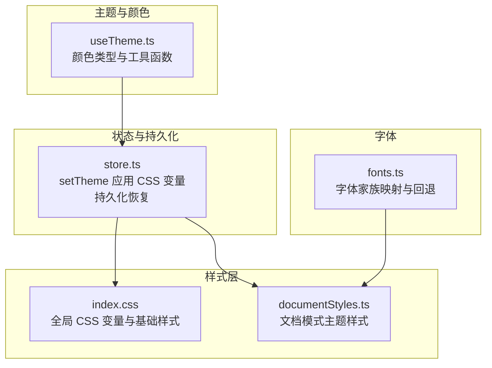
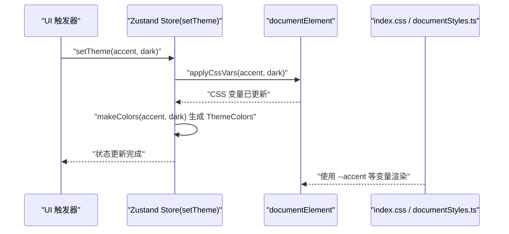
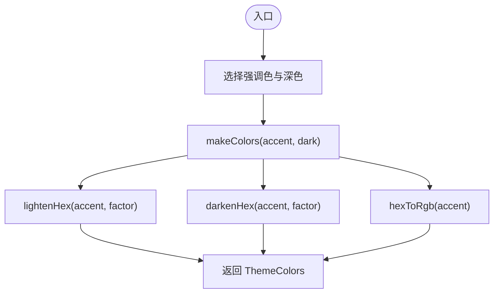
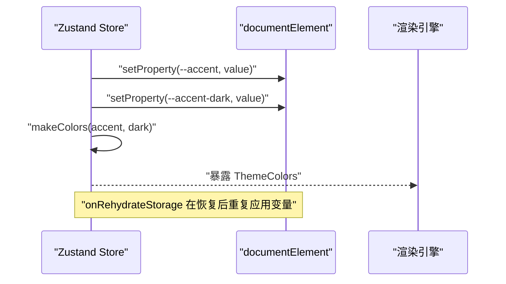
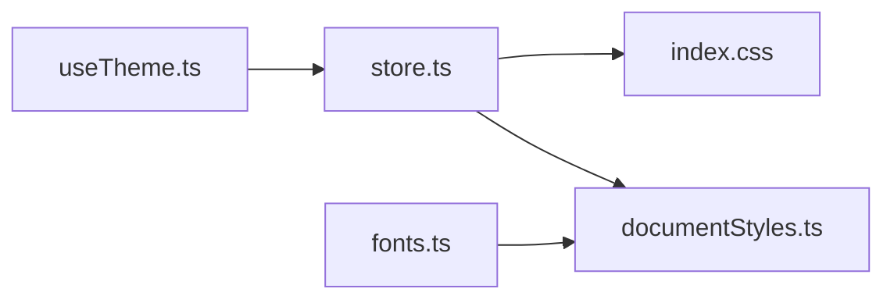

# 主题系统

<cite>
**本文引用的文件**
- [useTheme.ts](file://src/engine/composables/useTheme.ts)
- [store.ts](file://src/lib/store.ts)
- [fonts.ts](file://src/lib/fonts.ts)
- [index.css](file://src/index.css)
- [documentStyles.ts](file://src/modes/document/documentStyles.ts)
- [designPrompts.ts](file://src/data/designPrompts.ts)
</cite>

## 目录
1. [引言](#引言)
2. [项目结构](#项目结构)
3. [核心组件](#核心组件)
4. [架构总览](#架构总览)
5. [详细组件分析](#详细组件分析)
6. [依赖关系分析](#依赖关系分析)
7. [性能考量](#性能考量)
8. [故障排查指南](#故障排查指南)
9. [结论](#结论)
10. [附录](#附录)

## 引言
本文件面向 MarkFlow 的主题系统，聚焦以下目标：
- 主题切换机制：CSS 变量管理、动态样式注入与主题持久化存储
- 颜色管理系统：色彩空间转换、明暗色生成与无障碍设计要点
- 字体配置系统：本地字体家族映射与回退策略
- 响应式主题设计原则：适配不同屏幕尺寸与设备类型
- 自定义主题开发指南：主题文件结构、颜色规范与样式覆盖方法
- 主题性能优化与缓存策略

## 项目结构
主题系统由“组合式函数（useTheme）+ 状态存储（store）+ 样式入口（index.css）+ 文档模式样式（documentStyles）+ 字体映射（fonts）”协同构成，形成从颜色生成到样式注入再到持久化的闭环。

**图表来源**
- [useTheme.ts:1-67](file://src/engine/composables/useTheme.ts#L1-L67)
- [store.ts:94-241](file://src/lib/store.ts#L94-L241)
- [index.css](file://src/index.css)
- [documentStyles.ts](file://src/modes/document/documentStyles.ts)

**章节来源**
- [useTheme.ts:1-67](file://src/engine/composables/useTheme.ts#L1-L67)
- [store.ts:94-241](file://src/lib/store.ts#L94-L241)
- [index.css](file://src/index.css)
- [documentStyles.ts](file://src/modes/document/documentStyles.ts)

## 核心组件
- 主题颜色类型与工具函数：定义主题颜色接口、预设主题色集、HEX 转 RGB、明/暗色生成与颜色对象构建。
- 主题状态与持久化：通过 setTheme 应用 CSS 变量，结合持久化存储在初始化时恢复主题。
- 全局样式入口：index.css 定义 CSS 变量与基础样式，供渲染引擎按需消费。
- 文档模式样式：documentStyles.ts 将主题变量映射到具体组件样式，支持响应式与模式化主题。
- 字体映射：fonts.ts 提供字体家族选项与 CSS 字体栈，作为主题排版的一部分。

**章节来源**
- [useTheme.ts:4-67](file://src/engine/composables/useTheme.ts#L4-L67)
- [store.ts:94-241](file://src/lib/store.ts#L94-L241)
- [index.css](file://src/index.css)
- [documentStyles.ts](file://src/modes/document/documentStyles.ts)
- [fonts.ts:1-15](file://src/lib/fonts.ts#L1-L15)

## 架构总览
主题系统采用“颜色生成 → CSS 变量注入 → 样式消费”的分层架构。React 侧通过 Zustand 管理主题状态，渲染引擎仅消费 CSS 变量与颜色类型，降低框架耦合。

**图表来源**
- [store.ts:227-230](file://src/lib/store.ts#L227-L230)
- [store.ts:94-96](file://src/lib/store.ts#L94-L96)
- [index.css](file://src/index.css)
- [documentStyles.ts](file://src/modes/document/documentStyles.ts)

## 详细组件分析

### 主题颜色与工具函数（useTheme）
- 颜色类型：定义主题颜色接口，包含强调色、深色、浅色、边框与 RGB 字符串。
- 预设主题色：提供一组预设的强调色与深色组合，便于快速选择。
- HEX 工具：
  - HEX 转 RGB：将十六进制颜色转为逗号分隔的 RGB 数值字符串。
  - 明/暗色生成：按因子对 RGB 分量进行线性插值，生成更亮/更暗的色值。
- 颜色对象构建：根据强调色与深色生成完整的 ThemeColors，供渲染引擎使用。

**图表来源**
- [useTheme.ts:59-67](file://src/engine/composables/useTheme.ts#L59-L67)
- [useTheme.ts:38-56](file://src/engine/composables/useTheme.ts#L38-L56)
- [useTheme.ts:31-36](file://src/engine/composables/useTheme.ts#L31-L36)

**章节来源**
- [useTheme.ts:4-67](file://src/engine/composables/useTheme.ts#L4-L67)

### 主题状态与持久化（store）
- setTheme 流程：
  - 应用 CSS 变量：在 documentElement 上设置 --accent、--accent-dark 等变量。
  - 生成颜色对象：调用 makeColors 产出 ThemeColors。
  - 更新状态：同时更新 accent、accentDark、colors。
- 持久化恢复：
  - onRehydrateStorage 回调在恢复后再次应用 CSS 变量，确保主题一致性。
- 与渲染引擎解耦：渲染引擎仅消费 ThemeColors 与 CSS 变量，不依赖 React/Zustand。

**图表来源**
- [store.ts:94-96](file://src/lib/store.ts#L94-L96)
- [store.ts:227-230](file://src/lib/store.ts#L227-L230)
- [store.ts:234-238](file://src/lib/store.ts#L234-L238)

**章节来源**
- [store.ts:94-241](file://src/lib/store.ts#L94-L241)

### 全局样式入口（index.css）
- 全局 CSS 变量：定义 --accent、--accent-dark 等变量，供各组件与模式样式引用。
- 基础样式：提供基础排版、颜色与布局基线，确保主题切换时整体风格一致。
- 与渲染引擎协作：渲染引擎通过 CSS 变量读取主题值，避免硬编码。

**章节来源**
- [index.css](file://src/index.css)

### 文档模式样式（documentStyles）
- 主题映射：将 CSS 变量映射到文档模式下的具体组件样式（如卡片、按钮、边框等）。
- 响应式设计：结合媒体查询与相对单位，适配不同屏幕尺寸与设备类型。
- 可扩展性：通过变量与类名组织，便于新增主题或修改现有主题。

**章节来源**
- [documentStyles.ts](file://src/modes/document/documentStyles.ts)

### 字体配置系统（fonts）
- 字体家族选项：提供多种中英文混排友好的字体家族映射。
- 字体栈与回退：针对不同系统与语言环境提供合理的回退链，提升可用性。
- 与主题结合：字体家族可作为主题属性之一，在主题切换时联动更新。

**章节来源**
- [fonts.ts:1-15](file://src/lib/fonts.ts#L1-L15)

### 设计风格与主题模板（designPrompts）
- 设计风格集合：包含多套主题风格元数据（强调色、基础底色、文本色、排版规则等）。
- 风格扩展：通过元数据扩展与模板化生成，支撑多样化主题风格。
- 与主题系统的关系：为主题选择与风格化提供设计依据与参数来源。

**章节来源**
- [designPrompts.ts:147-1067](file://src/data/designPrompts.ts#L147-L1067)
- [designPrompts.ts:1065-1131](file://src/data/designPrompts.ts#L1065-L1131)

## 依赖关系分析
- useTheme 与 store：store 使用 useTheme 的颜色工具与类型，二者在主题生成与应用上紧密耦合。
- store 与 index.css：store 通过 CSS 变量驱动全局样式，index.css 为变量提供定义与默认值。
- store 与 documentStyles：documentStyles 消费 CSS 变量与 ThemeColors，实现模式化主题。
- fonts 与 documentStyles：字体映射为文档模式样式提供排版基础。

**图表来源**
- [useTheme.ts:59-67](file://src/engine/composables/useTheme.ts#L59-L67)
- [store.ts:227-230](file://src/lib/store.ts#L227-L230)
- [index.css](file://src/index.css)
- [documentStyles.ts](file://src/modes/document/documentStyles.ts)
- [fonts.ts:1-15](file://src/lib/fonts.ts#L1-L15)

**章节来源**
- [useTheme.ts:59-67](file://src/engine/composables/useTheme.ts#L59-L67)
- [store.ts:227-230](file://src/lib/store.ts#L227-L230)
- [index.css](file://src/index.css)
- [documentStyles.ts](file://src/modes/document/documentStyles.ts)
- [fonts.ts:1-15](file://src/lib/fonts.ts#L1-L15)

## 性能考量
- CSS 变量注入成本低：仅更新 documentElement 的 CSS 变量，避免大规模重排与重绘。
- 持久化恢复：在初始化阶段一次性应用变量，减少后续渲染开销。
- 字体加载：建议采用字体子集与异步加载策略，配合字体回退链保障首屏可读性。
- 样式缓存：将常用主题样式与变量缓存于内存，避免重复计算与注入。
- 响应式优化：使用媒体查询与相对单位，减少跨设备的样式分支数量。

## 故障排查指南
- 主题未生效
  - 检查 CSS 变量是否正确注入到 documentElement。
  - 确认 index.css 是否存在对应变量定义。
  - 查看持久化恢复回调是否在初始化时执行。
- 颜色异常
  - 核对 HEX 到 RGB 的转换逻辑与明/暗色生成因子。
  - 确保 ThemeColors 的 rgb 字段与 accent 一致。
- 字体显示异常
  - 检查字体映射与回退链是否匹配目标系统。
  - 确认字体资源加载成功，必要时添加字体加载失败的降级处理。
- 响应式问题
  - 校验媒体查询断点与相对单位使用是否合理。
  - 在不同设备上验证关键组件的可读性与可点击区域。

**章节来源**
- [store.ts:94-96](file://src/lib/store.ts#L94-L96)
- [store.ts:234-238](file://src/lib/store.ts#L234-L238)
- [index.css](file://src/index.css)
- [useTheme.ts:31-56](file://src/engine/composables/useTheme.ts#L31-L56)
- [fonts.ts:1-15](file://src/lib/fonts.ts#L1-L15)

## 结论
MarkFlow 的主题系统通过“颜色生成 + CSS 变量注入 + 持久化恢复”的分层设计，实现了跨框架、可扩展、易维护的主题能力。结合字体映射与文档模式样式，系统在可访问性与响应式方面具备良好基础。未来可在字体加载策略、样式缓存与无障碍对比度校验方面进一步优化。

## 附录

### 自定义主题开发指南
- 主题文件结构
  - 颜色定义：在 useTheme 中扩展预设主题色或新增颜色工具函数。
  - 状态更新：在 store 的 setTheme 中调用 applyCssVars 与 makeColors。
  - 样式映射：在 documentStyles 中将 CSS 变量映射到组件样式。
- 颜色规范
  - 强调色与深色成对出现，确保对比度满足可访问性要求。
  - 提供浅色与边框色的派生值，保持视觉层次清晰。
- 样式覆盖方法
  - 通过 CSS 变量统一管理颜色与尺寸，避免硬编码。
  - 使用媒体查询与相对单位实现响应式适配。
- 字体与排版
  - 选择合适的字体家族映射，确保中英文混排与系统兼容。
  - 为关键文本设置最小字号与行高，提升可读性。

**章节来源**
- [useTheme.ts:13-29](file://src/engine/composables/useTheme.ts#L13-L29)
- [store.ts:227-230](file://src/lib/store.ts#L227-L230)
- [documentStyles.ts](file://src/modes/document/documentStyles.ts)
- [fonts.ts:1-15](file://src/lib/fonts.ts#L1-L15)