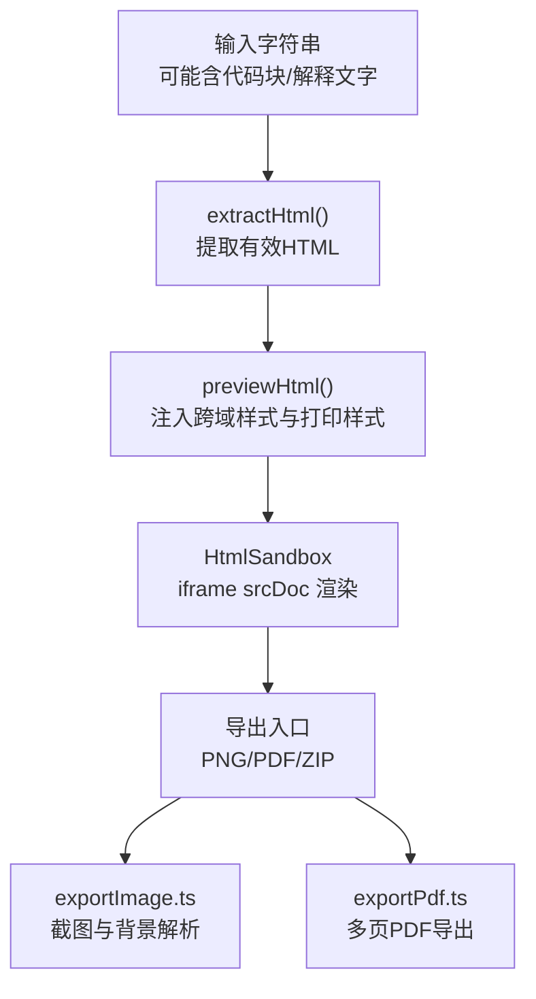
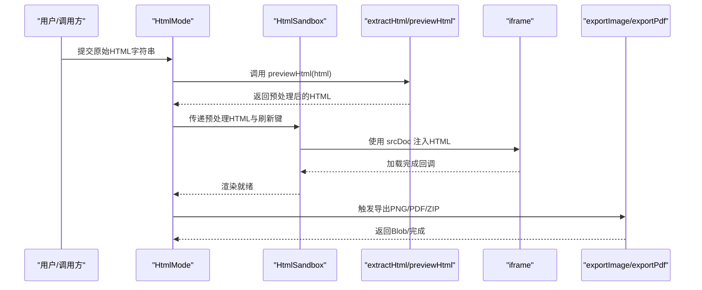
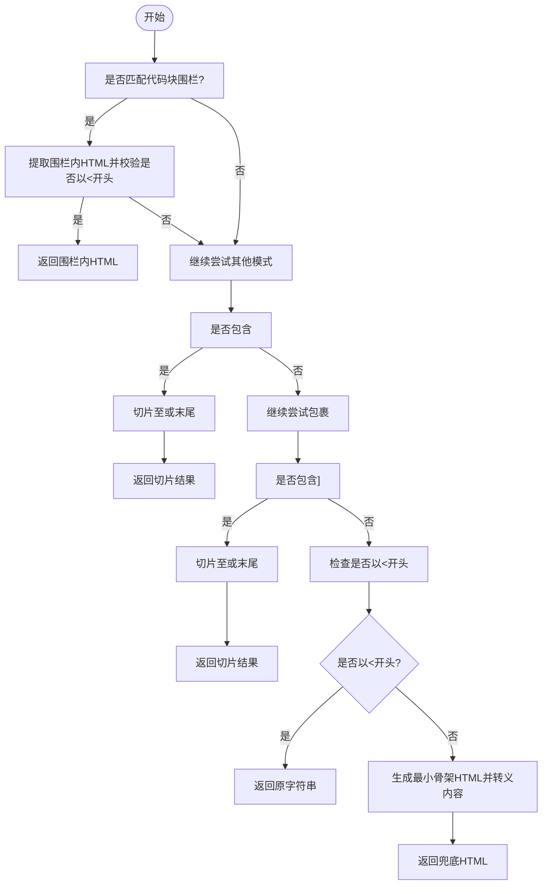
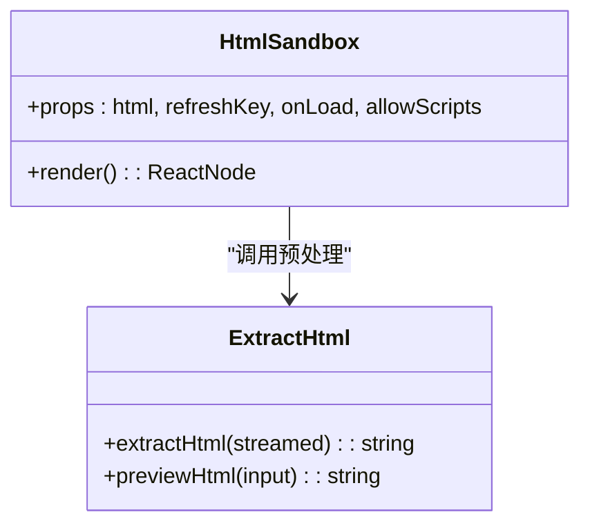
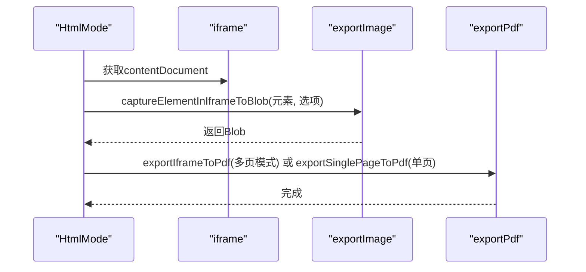
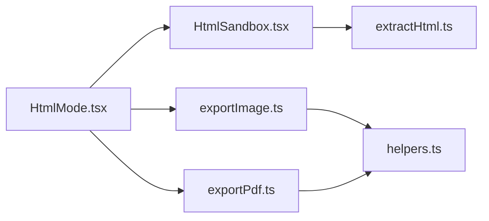

# HTML提取

<cite>
**本文引用的文件**
- [extractHtml.ts](file://src/lib/extractHtml.ts)
- [HtmlSandbox.tsx](file://src/components/preview/HtmlSandbox.tsx)
- [HtmlMode.tsx](file://src/modes/html/HtmlMode.tsx)
- [exportImage.ts](file://src/lib/exportImage.ts)
- [exportPdf.ts](file://src/lib/exportPdf.ts)
- [helpers.ts](file://src/engine/utils/helpers.ts)
- [demoHtml.ts](file://src/data/demoHtml.ts)
</cite>

## 目录
1. [简介](#简介)
2. [项目结构](#项目结构)
3. [核心组件](#核心组件)
4. [架构总览](#架构总览)
5. [详细组件分析](#详细组件分析)
6. [依赖关系分析](#依赖关系分析)
7. [性能考量](#性能考量)
8. [故障排查指南](#故障排查指南)
9. [结论](#结论)
10. [附录](#附录)

## 简介
本文件面向“HTML提取”能力，系统性阐述以下主题：
- DOM节点序列化与HTML提取的实现原理：元素遍历、属性提取、结构重组与完整性保证
- 样式处理策略：内联样式转换、CSS规则提取与样式隔离机制
- 完整性保障：富文本内容保留、图片链接处理与外部资源引用
- 配置选项说明：输出格式、编码设置与兼容性选项
- 大型文档处理优化与内存管理策略
- 常见问题诊断与解决方案

该能力在项目中主要用于从AI输出或任意来源的字符串中提取可用的HTML片段，并在沙箱iframe中安全渲染，同时支持高保真导出（PNG/PDF）。

## 项目结构
围绕HTML提取与渲染的关键模块如下：
- 提取与预处理：从杂乱输入中识别并提取有效HTML，必要时注入最小骨架与安全属性
- 沙箱渲染：在iframe中使用srcDoc注入，配合沙箱策略与样式增强
- 导出能力：基于截图库的高保真导出，支持单页/多页PDF与批量ZIP导出
- 辅助工具：文本与颜色处理、属性解析等

图表来源
- [extractHtml.ts:1-113](file://src/lib/extractHtml.ts#L1-L113)
- [HtmlSandbox.tsx:1-50](file://src/components/preview/HtmlSandbox.tsx#L1-L50)
- [HtmlMode.tsx:92-579](file://src/modes/html/HtmlMode.tsx#L92-L579)
- [exportImage.ts:1-356](file://src/lib/exportImage.ts#L1-L356)
- [exportPdf.ts:1-35](file://src/lib/exportPdf.ts#L1-L35)

章节来源
- [extractHtml.ts:1-113](file://src/lib/extractHtml.ts#L1-L113)
- [HtmlSandbox.tsx:1-50](file://src/components/preview/HtmlSandbox.tsx#L1-L50)
- [HtmlMode.tsx:92-579](file://src/modes/html/HtmlMode.tsx#L92-L579)

## 核心组件
- HTML提取器：从任意字符串中识别并提取合法HTML，兜底生成最小可渲染骨架
- 预览增强器：为样式表注入跨域属性、注入打印与屏幕预览样式、补全缺失闭合标签
- 沙箱渲染器：React组件，负责将预处理后的HTML注入iframe并应用沙箱策略
- 导出控制器：根据页面状态选择单页或多页导出策略，调用截图与PDF导出模块
- 截图与PDF导出：基于现代截图库的高保真导出，保留全局样式与字体
- 辅助工具：文本与颜色处理、属性解析等

章节来源
- [extractHtml.ts:1-113](file://src/lib/extractHtml.ts#L1-L113)
- [HtmlSandbox.tsx:1-50](file://src/components/preview/HtmlSandbox.tsx#L1-L50)
- [HtmlMode.tsx:92-579](file://src/modes/html/HtmlMode.tsx#L92-L579)
- [exportImage.ts:1-356](file://src/lib/exportImage.ts#L1-L356)
- [exportPdf.ts:1-35](file://src/lib/exportPdf.ts#L1-L35)
- [helpers.ts:1-115](file://src/engine/utils/helpers.ts#L1-L115)

## 架构总览
HTML提取与渲染的整体流程如下：

图表来源
- [HtmlMode.tsx:92-579](file://src/modes/html/HtmlMode.tsx#L92-L579)
- [HtmlSandbox.tsx:1-50](file://src/components/preview/HtmlSandbox.tsx#L1-L50)
- [extractHtml.ts:51-113](file://src/lib/extractHtml.ts#L51-L113)
- [exportImage.ts:1-356](file://src/lib/exportImage.ts#L1-L356)
- [exportPdf.ts:1-35](file://src/lib/exportPdf.ts#L1-L35)

## 详细组件分析

### HTML提取器（extractHtml/previewHtml）
- 输入容错与提取策略
  - 去除代码块围栏：优先匹配三反引号包裹的HTML块，剥离注释与解释文字
  - DOCTYPE与<html>包裹：定位文档声明与根元素，按需切片至闭合</html>
  - 直接信任以<开头的片段：若输入本身即为合法片段，则直接返回
  - 兜底策略：当无法识别时，注入最小骨架（含字符集与Tailwind CDN），并将原始内容转义后放入预格式化容器
- 输出完整性
  - 自动补全缺失的</html>与</body>，提升增量渲染稳定性
  - 为<link rel="stylesheet">注入crossorigin="anonymous"，便于截图库读取@font-face并进行字体Base64嵌入
- 安全与兼容
  - 默认禁用脚本执行，仅在用户显式开启时注入允许脚本的沙箱标志
  - 注入防御性排版样式，减少字体回退导致的渲染差异与折行问题

图表来源
- [extractHtml.ts:5-44](file://src/lib/extractHtml.ts#L5-L44)

章节来源
- [extractHtml.ts:5-44](file://src/lib/extractHtml.ts#L5-L44)
- [extractHtml.ts:51-113](file://src/lib/extractHtml.ts#L51-L113)

### 沙箱渲染器（HtmlSandbox）
- 功能要点
  - 使用React.forwardRef接收iframe引用
  - 通过previewHtml对输入HTML进行预处理
  - 使用srcDoc注入预处理HTML，避免跨域与初始空白
  - 应用沙箱策略：默认仅允许同源，可选允许脚本
  - 通过refreshKey强制重挂载，确保样式与内容更新生效
- 与导出协作
  - 在onLoad中检测页面分页节点，驱动后续多页导出策略

图表来源
- [HtmlSandbox.tsx:1-50](file://src/components/preview/HtmlSandbox.tsx#L1-L50)
- [extractHtml.ts:51-113](file://src/lib/extractHtml.ts#L51-L113)

章节来源
- [HtmlSandbox.tsx:1-50](file://src/components/preview/HtmlSandbox.tsx#L1-L50)

### 导出控制器（HtmlMode）
- 多页检测与切换
  - 通过detectPages识别页面节点（如.page/.slide/.card），并维护当前页索引
  - 提供键盘与滚轮翻页交互，隐藏非当前页以提升导出专注度
- 导出策略
  - PNG导出：在iframe上下文中对目标元素进行截图，保留全局样式与字体
  - PDF导出：多页模式逐页截图并拼接，单页模式直接导出
  - ZIP导出：批量导出多页PNG并打包
- 缩放与背景
  - 在导出前恢复缩放与显示状态，确保截图尺寸与视觉一致
  - 解析背景色以消除截图白边

图表来源
- [HtmlMode.tsx:76-453](file://src/modes/html/HtmlMode.tsx#L76-L453)
- [exportImage.ts:1-356](file://src/lib/exportImage.ts#L1-L356)
- [exportPdf.ts:1-35](file://src/lib/exportPdf.ts#L1-L35)

章节来源
- [HtmlMode.tsx:76-453](file://src/modes/html/HtmlMode.tsx#L76-L453)

### 截图与PDF导出（exportImage/exportPdf）
- 截图策略
  - 等待字体/图片/样式表加载稳定后再截图
  - 临时调整iframe、html、body与目标元素的尺寸与布局，消除外边距与居中影响
  - 使用documentElement作为截图根，确保全局样式与CSS变量生效
  - 通过fetch缓存策略提升网络资源复用
- PDF策略
  - 多页模式：逐页隐藏其余页面，截图后拼接到PDF
  - 单页模式：直接对iframe内容截图并导出

章节来源
- [exportImage.ts:1-356](file://src/lib/exportImage.ts#L1-L356)
- [exportPdf.ts:1-35](file://src/lib/exportPdf.ts#L1-L35)

### 辅助工具（helpers）
- 文本处理：自动中英文间距、换行转 、叶子节点包装
- 颜色处理：十六进制转RGB、亮度调节、带透明度背景色生成
- 属性解析：解析HTML属性字符串为键值映射

章节来源
- [helpers.ts:1-115](file://src/engine/utils/helpers.ts#L1-L115)

## 依赖关系分析
- HtmlMode依赖HtmlSandbox与导出模块，负责页面检测、交互与导出调度
- HtmlSandbox依赖extractHtml进行预处理
- 导出模块依赖截图库与PDF库，负责高保真输出
- helpers提供文本与颜色处理能力，辅助内容与样式处理

图表来源
- [HtmlMode.tsx:92-579](file://src/modes/html/HtmlMode.tsx#L92-L579)
- [HtmlSandbox.tsx:1-50](file://src/components/preview/HtmlSandbox.tsx#L1-L50)
- [extractHtml.ts:1-113](file://src/lib/extractHtml.ts#L1-L113)
- [exportImage.ts:1-356](file://src/lib/exportImage.ts#L1-L356)
- [exportPdf.ts:1-35](file://src/lib/exportPdf.ts#L1-L35)
- [helpers.ts:1-115](file://src/engine/utils/helpers.ts#L1-L115)

## 性能考量
- 截图前等待稳定：通过MutationObserver与帧同步等待布局稳定，避免半成品截图
- 尺寸与缩放：使用documentElement尺寸与固定scale，减少布局漂移与重绘
- 缓存策略：截图fetch请求启用缓存，降低重复网络开销
- 多页导出：逐页隐藏非当前页，减少无关元素参与渲染与截图
- 大文档优化建议
  - 分段提交：将超大HTML拆分为若干片段，分别预处理与导出
  - 控制并发：限制同时导出页数，避免内存峰值过高
  - 图片懒加载：在导出前触发懒加载，确保图片参与截图
  - 预热字体：在iframe加载完成后等待fonts.ready，减少二次回流

## 故障排查指南
- 预览空白或样式异常
  - 检查是否正确注入crossorigin="anonymous"，确保@font-face可被截图库读取
  - 确认预处理HTML包含<head>/<body>或已补全闭合标签
- 字体渲染异常或折行问题
  - 确认防御性排版样式已注入，避免字体回退导致的SimSun降级
  - 等待fonts.ready后再导出
- 跨域资源无法加载
  - 确保<link rel="stylesheet">已注入crossorigin属性
  - 若资源不可跨域，考虑内联或本地镜像
- 导出PNG出现白边
  - 使用resolveBackground解析背景色，或手动指定backgroundColor
- 多页导出顺序错乱
  - 确认页面节点display状态在导出前后被正确恢复
- 脚本执行导致不稳定
  - 默认关闭allowScripts，仅在需要交互演示时开启

章节来源
- [extractHtml.ts:51-113](file://src/lib/extractHtml.ts#L51-L113)
- [exportImage.ts:1-356](file://src/lib/exportImage.ts#L1-L356)
- [exportPdf.ts:1-35](file://src/lib/exportPdf.ts#L1-L35)

## 结论
本方案通过“提取-增强-沙箱-导出”的流水线，实现了对任意来源HTML的鲁棒提取与高保真渲染导出。其关键优势在于：
- 强大的输入容错与兜底策略，确保低质量输入也能得到可渲染结果
- 样式隔离与跨域资源处理，兼顾美观与可移植性
- 基于iframe上下文的截图策略，完整保留全局样式与字体
- 多页检测与交互式导出，满足复杂演示场景需求

## 附录

### 配置选项说明
- 输出格式
  - PNG/JPEG/WEBP：由导出选项决定，默认PNG
  - PDF：支持单页与多页两种模式
- 编码设置
  - 预处理HTML默认UTF-8字符集
- 兼容性选项
  - allowScripts：是否允许iframe内脚本执行（默认关闭）
  - refreshKey：强制iframe重挂载，确保样式与内容更新生效
- 样式与打印
  - 自动注入跨域样式与打印分页样式，确保PDF分页与屏幕预览一致性

章节来源
- [HtmlSandbox.tsx:10-19](file://src/components/preview/HtmlSandbox.tsx#L10-L19)
- [extractHtml.ts:51-113](file://src/lib/extractHtml.ts#L51-L113)
- [HtmlMode.tsx:422-453](file://src/modes/html/HtmlMode.tsx#L422-L453)

### 示例参考
- 演示HTML样例：包含多种页面容器与样式类，可用于验证多页检测与导出
  - [demoHtml.ts:1-800](file://src/data/demoHtml.ts#L1-L800)