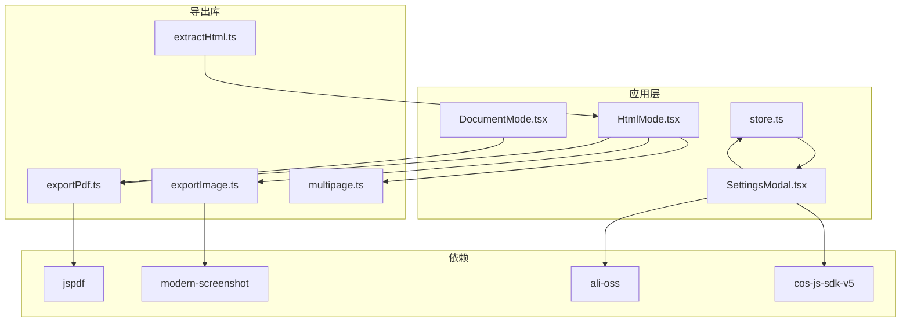
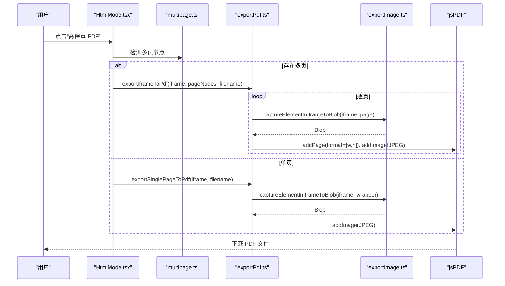
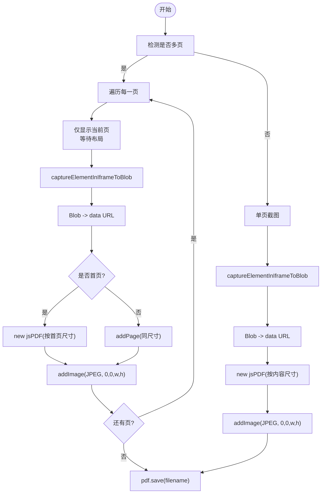
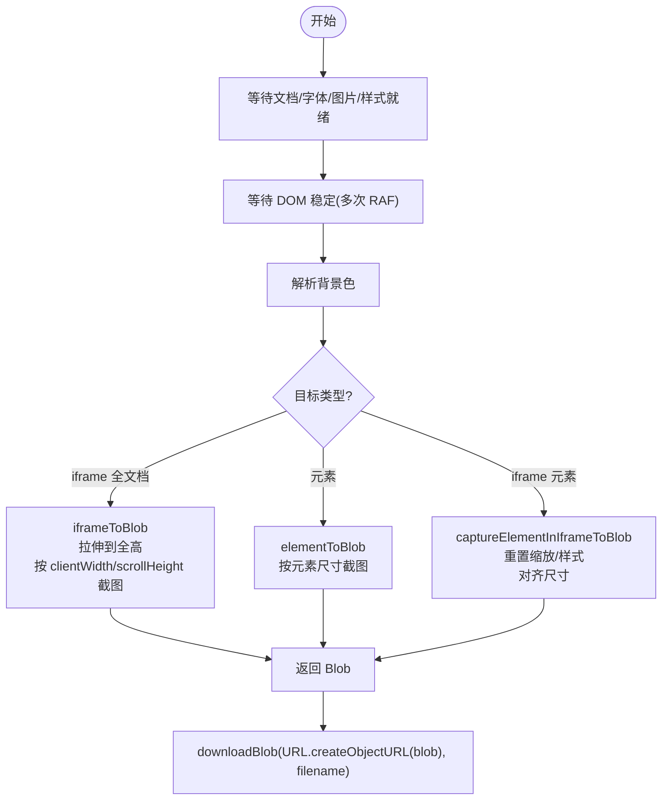
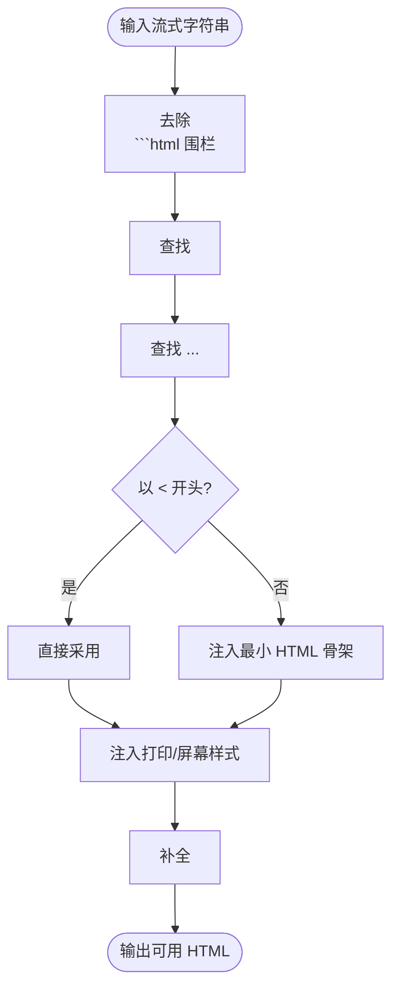
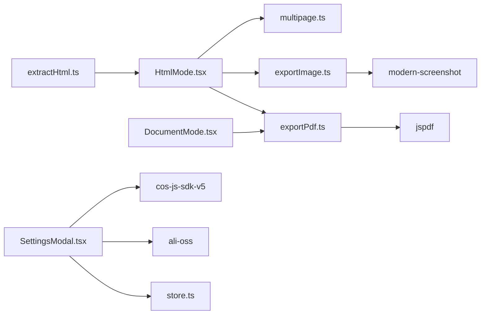

# 导出功能

<cite>
**本文引用的文件**
- [exportPdf.ts](file://src/lib/exportPdf.ts)
- [exportImage.ts](file://src/lib/exportImage.ts)
- [extractHtml.ts](file://src/lib/extractHtml.ts)
- [multipage.ts](file://src/lib/multipage.ts)
- [store.ts](file://src/lib/store.ts)
- [SettingsModal.tsx](file://src/components/editor/SettingsModal.tsx)
- [HtmlMode.tsx](file://src/modes/html/HtmlMode.tsx)
- [DocumentMode.tsx](file://src/modes/document/DocumentMode.tsx)
- [package.json](file://package.json)
</cite>

## 目录
1. [简介](#简介)
2. [项目结构](#项目结构)
3. [核心组件](#核心组件)
4. [架构总览](#架构总览)
5. [详细组件分析](#详细组件分析)
6. [依赖关系分析](#依赖关系分析)
7. [性能考量](#性能考量)
8. [故障排除指南](#故障排除指南)
9. [结论](#结论)
10. [附录](#附录)

## 简介
本文件系统性阐述 MarkFlow 的导出能力，覆盖以下方面：
- PDF 导出：基于 iframe 截图的高保真方案，集成 jsPDF，解决样式保留与页面布局问题。
- 图片导出：基于 modern-screenshot 的截图流程，包含等待资源就绪、布局稳定、背景色解析与下载。
- HTML 提取：从外部流式输出中提取可用的 HTML 文档骨架，注入打印与预览样式。
- 导出配置：分辨率、页面尺寸、边距、字体缩放等参数如何影响导出质量。
- 第三方服务：阿里云 OSS 与腾讯云 COS 的对象存储集成指引。
- 性能优化：大图/长图处理、并发与节流策略、内存回收与超大尺寸限制。
- 故障排除：常见错误定位、错误处理与回退策略。

## 项目结构
导出相关代码主要分布在如下模块：
- 导出入口与 PDF：src/lib/exportPdf.ts
- 截图与图片导出：src/lib/exportImage.ts
- HTML 提取与注入：src/lib/extractHtml.ts
- 多页检测：src/lib/multipage.ts
- 设置与第三方图床：src/lib/store.ts、src/components/editor/SettingsModal.tsx
- 模式层导出触发：src/modes/html/HtmlMode.tsx、src/modes/document/DocumentMode.tsx
- 依赖声明：package.json

图表来源
- [exportPdf.ts:1-192](file://src/lib/exportPdf.ts#L1-L192)
- [exportImage.ts:1-387](file://src/lib/exportImage.ts#L1-L387)
- [extractHtml.ts:1-113](file://src/lib/extractHtml.ts#L1-L113)
- [multipage.ts:1-45](file://src/lib/multipage.ts#L1-L45)
- [HtmlMode.tsx:353-532](file://src/modes/html/HtmlMode.tsx#L353-L532)
- [DocumentMode.tsx:1-344](file://src/modes/document/DocumentMode.tsx#L1-L344)
- [store.ts:1-242](file://src/lib/store.ts#L1-L242)
- [SettingsModal.tsx:1-191](file://src/components/editor/SettingsModal.tsx#L1-L191)
- [package.json:13-31](file://package.json#L13-L31)

章节来源
- [exportPdf.ts:1-192](file://src/lib/exportPdf.ts#L1-L192)
- [exportImage.ts:1-387](file://src/lib/exportImage.ts#L1-L387)
- [extractHtml.ts:1-113](file://src/lib/extractHtml.ts#L1-L113)
- [multipage.ts:1-45](file://src/lib/multipage.ts#L1-L45)
- [HtmlMode.tsx:353-532](file://src/modes/html/HtmlMode.tsx#L353-L532)
- [DocumentMode.tsx:1-344](file://src/modes/document/DocumentMode.tsx#L1-L344)
- [store.ts:1-242](file://src/lib/store.ts#L1-L242)
- [SettingsModal.tsx:1-191](file://src/components/editor/SettingsModal.tsx#L1-L191)
- [package.json:13-31](file://package.json#L13-L31)

## 核心组件
- PDF 导出（iframe 截图 + jsPDF）
  - 多页模式：逐页切换可见性，截图后按页面尺寸添加至 PDF。
  - 单页模式：直接对 iframe 内容区域截图并生成 PDF。
  - 非 iframe：使用 modern-screenshot 的 domToJpeg 生成 JPEG 数据 URL，再写入 PDF。
- 图片导出（modern-screenshot）
  - 等待字体、样式、图片加载完成，布局稳定后再截图。
  - 支持 PNG/JPEG/WebP、缩放比例、背景色、最大高度限制。
  - 提供对 iframe 或任意元素的截图与下载。
- HTML 提取与注入
  - 从流式输出中提取 HTML 文档骨架，兜底注入最小 HTML 结构。
  - 注入打印换页样式与屏幕预览样式，提升截图一致性。
- 多页检测
  - 基于约定的页面容器类名识别多页结构，支持滚动跳转。
- 导出配置与第三方服务
  - 通过设置面板配置图片上传目的地（本地、Sm.MS、阿里云 OSS、腾讯云 COS）。
  - Store 统一管理配置项，SettingsModal 提供 UI。

章节来源
- [exportPdf.ts:21-182](file://src/lib/exportPdf.ts#L21-L182)
- [exportImage.ts:152-385](file://src/lib/exportImage.ts#L152-L385)
- [extractHtml.ts:5-112](file://src/lib/extractHtml.ts#L5-L112)
- [multipage.ts:18-44](file://src/lib/multipage.ts#L18-L44)
- [store.ts:43-70](file://src/lib/store.ts#L43-L70)
- [SettingsModal.tsx:19-178](file://src/components/editor/SettingsModal.tsx#L19-L178)

## 架构总览
下图展示了“模式层触发导出”到“截图与 PDF 写入”的整体流程。

图表来源
- [HtmlMode.tsx:422-453](file://src/modes/html/HtmlMode.tsx#L422-L453)
- [multipage.ts:18-44](file://src/lib/multipage.ts#L18-L44)
- [exportPdf.ts:21-127](file://src/lib/exportPdf.ts#L21-L127)
- [exportImage.ts:250-385](file://src/lib/exportImage.ts#L250-L385)

## 详细组件分析

### PDF 导出（exportPdf.ts）
- 多页模式（exportIframeToPdf）
  - 逐页切换 display，等待一帧布局生效，解析背景色，对当前页节点截图，生成 data URL，按页面尺寸添加到 PDF。
  - 首次创建 PDF 时根据首页宽高与方向确定格式，后续每页使用相同格式追加。
- 单页模式（exportSinglePageToPdf）
  - 优先查找 body 内的直接子元素作为包装器，解析背景色后截图，按实际内容尺寸生成 PDF。
- 非 iframe 模式（exportElementsToPdf）
  - 使用 modern-screenshot 的 domToJpeg 生成 JPEG，按元素尺寸添加到 PDF。
- 关键点
  - 使用 scale=3 提升清晰度（多处默认 3x）。
  - 压缩 PDF（compress=true）。
  - 通过 blobToDataUrl 将 Blob 转为 data URL 供 jsPDF 使用。

图表来源
- [exportPdf.ts:21-127](file://src/lib/exportPdf.ts#L21-L127)
- [exportImage.ts:250-385](file://src/lib/exportImage.ts#L250-L385)

章节来源
- [exportPdf.ts:21-182](file://src/lib/exportPdf.ts#L21-L182)
- [exportImage.ts:250-385](file://src/lib/exportImage.ts#L250-L385)

### 图片导出（exportImage.ts）
- 资源等待与稳定性
  - 等待文档 ready、样式表加载、字体 ready、图片 decode/load、MutationObserver 稳定。
- 背景色解析
  - 优先使用显式背景色，否则从 body/computedStyle 获取，若不可用则回退白色。
- 截图策略
  - iframeToBlob：将 iframe 拉伸到全高，按 documentElement 的 clientWidth/scrollHeight 截图，支持最大高度限制。
  - elementToBlob：按元素实际尺寸截图，适合局部导出。
  - captureElementInIframeToBlob：针对 iframe 内特定元素，临时重置缩放、拉伸尺寸、消除内外边距与居中样式，确保截图与元素尺寸完全一致，保留全局样式与 CSS 变量。
- 下载
  - downloadBlob：创建对象 URL 并触发下载，随后清理。

图表来源
- [exportImage.ts:61-117](file://src/lib/exportImage.ts#L61-L117)
- [exportImage.ts:152-197](file://src/lib/exportImage.ts#L152-L197)
- [exportImage.ts:199-217](file://src/lib/exportImage.ts#L199-L217)
- [exportImage.ts:250-385](file://src/lib/exportImage.ts#L250-L385)

章节来源
- [exportImage.ts:1-387](file://src/lib/exportImage.ts#L1-L387)

### HTML 提取与打印样式注入（extractHtml.ts）
- 提取策略
  - 去除代码围栏，查找 DOCTYPE/html 标签，或以 < 开头的信任输入。
  - 若仍为空，注入最小 HTML 骨架（含 Tailwind CDN）与转义文本。
- 注入样式
  - 防护性字体声明，避免截图时字体回退导致的折行问题。
  - 打印媒体查询：强制换页、去除 body 边距。
  - 屏幕媒体查询：居中预览、缩放与溢出控制，提升截图一致性。
- 闭合标签补全：确保 </html> 存在，便于增量渲染。

图表来源
- [extractHtml.ts](file://src/lib/extractHtml.ts#L5-L44)
- [extractHtml.ts](file://src/lib/extractHtml.ts#L51-L112)

章节来源
- [extractHtml.ts](file://src/lib/extractHtml.ts#L1-L113)

### 多页检测（multipage.ts）
- 页面容器约定：section.page、section.slide、section.card。
- 检测返回 PageInfo 数组，包含索引、标签与节点。
- 滚动到指定页面，用于逐页导出与预览。

章节来源
- [multipage.ts](file://src/lib/multipage.ts#L1-L45)

### 导出触发与 UI（HtmlMode.tsx、DocumentMode.tsx）
- HtmlMode
  - 多页：逐页截图并下载 PNG；打包为 ZIP；PDF 导出（多页/单页分支）。
  - 单页：直接截图 PNG 或 PDF。
  - 导出前后重置缩放与可见性，确保截图一致性。
- DocumentMode
  - 提供字体家族、字号缩放、标题居中、首行缩进等设置，影响 PDF 渲染效果。
  - 导出按钮触发 PDF 流程。

章节来源
- [HtmlMode.tsx](file://src/modes/html/HtmlMode.tsx#L353-L532)
- [DocumentMode.tsx](file://src/modes/document/DocumentMode.tsx#L180-L258)

### 导出配置与第三方服务（store.ts、SettingsModal.tsx）
- 图床配置
  - 支持本地（IndexedDB）、Sm.MS、阿里云 OSS、腾讯云 COS。
  - SettingsModal 提供表单与说明，保存到 Zustand store。
- 配置项
  - activeType：当前启用的图床类型。
  - smms.token：Sm.MS API Token。
  - oss：region、accessKeyId、accessKeySecret、bucket。
  - cos：SecretId、SecretKey、Bucket、Region。

章节来源
- [store.ts](file://src/lib/store.ts#L43-L70)
- [SettingsModal.tsx](file://src/components/editor/SettingsModal.tsx#L19-L178)

## 依赖关系分析
- 外部库
  - jsPDF：PDF 写入与压缩。
  - modern-screenshot：domToBlob/domToJpeg，负责高质量截图与资源等待。
  - ali-oss：阿里云 OSS 客户端。
  - cos-js-sdk-v5：腾讯云 COS 客户端。
- 内部模块耦合
  - HtmlMode/DocumentMode 依赖导出库与多页检测。
  - 导出库依赖截图与 HTML 提取工具。
  - 设置面板依赖 store 管理配置。

图表来源
- [HtmlMode.tsx:353-532](file://src/modes/html/HtmlMode.tsx#L353-L532)
- [DocumentMode.tsx:1-344](file://src/modes/document/DocumentMode.tsx#L1-L344)
- [exportPdf.ts:1-192](file://src/lib/exportPdf.ts#L1-L192)
- [exportImage.ts:1-387](file://src/lib/exportImage.ts#L1-L387)
- [extractHtml.ts:1-113](file://src/lib/extractHtml.ts#L1-L113)
- [multipage.ts:1-45](file://src/lib/multipage.ts#L1-L45)
- [store.ts:1-242](file://src/lib/store.ts#L1-L242)
- [SettingsModal.tsx:1-191](file://src/components/editor/SettingsModal.tsx#L1-L191)
- [package.json:13-31](file://package.json#L13-L31)

章节来源
- [package.json:13-31](file://package.json#L13-L31)

## 性能考量
- 截图质量与体积
  - 默认 scale=2 或 3，显著提升清晰度；同时增加内存占用与 CPU 时间。
  - 类型选择：PNG 更清晰但体积更大；JPEG/WebP 在可接受质量下更省空间。
- 大图/长图限制
  - 截图时限制 maxHeight（按 scale 反推），避免浏览器/Canvas 超限。
  - iframeToBlob 将 iframe 拉伸到全高，需注意内存与渲染压力。
- 布局稳定性
  - 多次 requestAnimationFrame 与 MutationObserver 稳定检测，减少抖动与错位。
- PDF 生成
  - 首页决定格式与方向，后续页复用，避免重复计算。
  - 压缩开启，减小文件体积。
- 资源加载
  - 等待字体、样式、图片加载完成，避免截图时的半成品。
- 内存回收
  - 下载后及时 revokeObjectURL，避免内存泄漏。
- 大文件打包
  - 多页 PNG 打包为 ZIP，便于传输与归档。

章节来源
- [exportImage.ts:176-178](file://src/lib/exportImage.ts#L176-L178)
- [exportImage.ts:182-189](file://src/lib/exportImage.ts#L182-L189)
- [exportPdf.ts:67-75](file://src/lib/exportPdf.ts#L67-L75)
- [exportPdf.ts:155-159](file://src/lib/exportPdf.ts#L155-L159)
- [exportImage.ts:219-228](file://src/lib/exportImage.ts#L219-L228)

## 故障排除指南
- iframe 尚未就绪
  - 现象：抛出“iframe 尚未就绪”。
  - 排查：确认 iframe 已完成加载与内容写入，再触发导出。
- 预览暂无内容
  - 现象：提示“预览暂无内容”。
  - 排查：检查 iframe 内容是否为空或未渲染。
- 导出节点暂无尺寸
  - 现象：提示“导出节点暂无尺寸”。
  - 排查：确保元素已渲染并具有宽高。
- 截图失败
  - 现象：提示“截图失败”。
  - 排查：检查网络资源可访问性、跨域策略、字体加载情况；适当提高等待时间或降低 scale。
- 背景色异常
  - 现象：导出背景为白色或透明。
  - 排查：使用 resolveBackground 解析背景色，必要时显式传入 backgroundColor。
- 跨域字体/样式
  - 现象：截图字体缺失或样式不一致。
  - 排查：确保样式表 link 注入了 crossorigin="anonymous"，允许截图库读取 @font-face。
- PDF 尺寸/方向异常
  - 现象：页面方向或尺寸不正确。
  - 排查：确认元素宽高计算逻辑与首页尺寸一致；避免动态变更导致的尺寸漂移。
- 导出进度回调无效
  - 现象：多页导出进度未回调。
  - 排查：确认调用方传入 onProgress 且循环内触发回调。

章节来源
- [exportPdf.ts:30-31](file://src/lib/exportPdf.ts#L30-L31)
- [exportImage.ts:164-165](file://src/lib/exportImage.ts#L164-L165)
- [exportImage.ts:205-206](file://src/lib/exportImage.ts#L205-L206)
- [exportImage.ts:190-191](file://src/lib/exportImage.ts#L190-L191)
- [exportImage.ts:119-138](file://src/lib/exportImage.ts#L119-L138)
- [extractHtml.ts:56-59](file://src/lib/extractHtml.ts#L56-L59)
- [exportPdf.ts:67-75](file://src/lib/exportPdf.ts#L67-L75)

## 结论
MarkFlow 的导出体系以“高质量截图 + 精准布局”为核心，结合 jsPDF 实现 PDF 输出，配合现代截图库保障字体与样式的完整性。通过多页检测、打印样式注入与稳定的资源等待机制，实现了跨场景的一致导出体验。配合第三方对象存储配置，可进一步完善图片托管与分发链路。

## 附录

### 导出配置选项说明
- 分辨率与图像质量
  - scale：截图缩放系数，默认 2；部分路径使用 3，兼顾清晰度与性能。
  - type：图像类型，支持 PNG/JPEG/WebP。
  - backgroundColor：背景色，可显式传入以避免透明。
  - maxHeight：最大截图高度（受 scale 影响）。
- 页面尺寸与方向
  - PDF 尺寸由首页或内容区域的实际宽高决定，方向依据宽高比自动选择。
- 边距与排版
  - 多页模式通过打印样式控制换页行为；单页模式按内容区域尺寸生成 PDF。
- 字体与排版
  - 注入防护性字体声明，避免截图时字体回退导致的折行与布局差异。
- 导出触发与 UI
  - HtmlMode 支持逐页 PNG 导出、ZIP 打包与 PDF 导出；DocumentMode 提供字体家族与字号缩放等影响 PDF 的设置。

章节来源
- [exportImage.ts:16-21](file://src/lib/exportImage.ts#L16-L21)
- [exportImage.ts:176-178](file://src/lib/exportImage.ts#L176-L178)
- [exportPdf.ts:67-75](file://src/lib/exportPdf.ts#L67-L75)
- [extractHtml.ts:65-98](file://src/lib/extractHtml.ts#L65-L98)
- [DocumentMode.tsx:180-258](file://src/modes/document/DocumentMode.tsx#L180-L258)

### 第三方服务集成指南（阿里云 OSS 与腾讯云 COS）
- 配置入口
  - 在设置面板中选择“阿里云 OSS”或“腾讯云 COS”，填写对应参数。
- 存储策略
  - 建议使用客户端直传，避免中间代理带来的延迟与带宽瓶颈。
  - 为公开访问的静态资源准备合适的 Bucket 策略与跨域配置。
- 错误处理
  - 上传失败时回退到本地或 Sm.MS，确保导出流程可用。
  - 对于跨域与签名问题，优先检查 CORS、签名时效与权限策略。

章节来源
- [SettingsModal.tsx:130-178](file://src/components/editor/SettingsModal.tsx#L130-L178)
- [store.ts:43-70](file://src/lib/store.ts#L43-L70)
- [package.json:20-22](file://package.json#L20-L22)