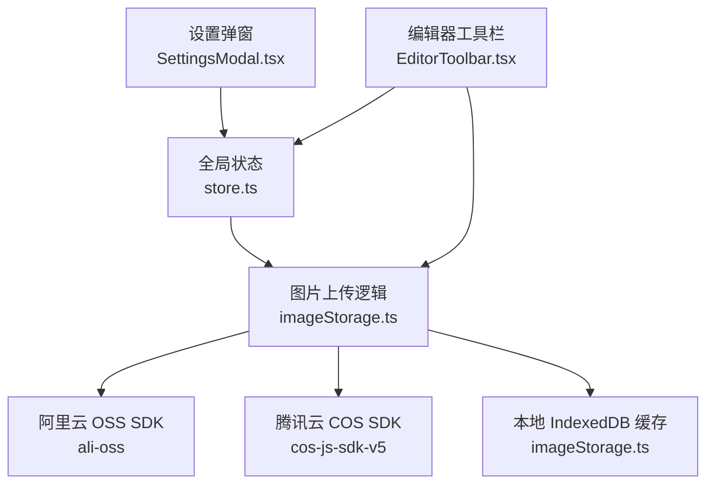
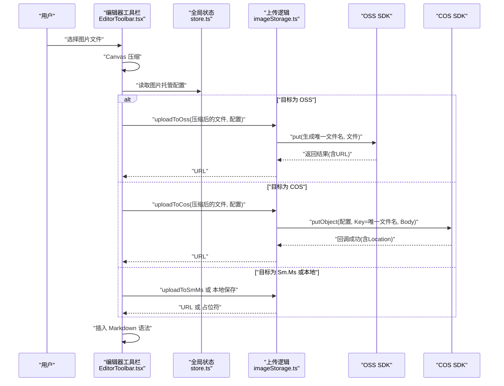
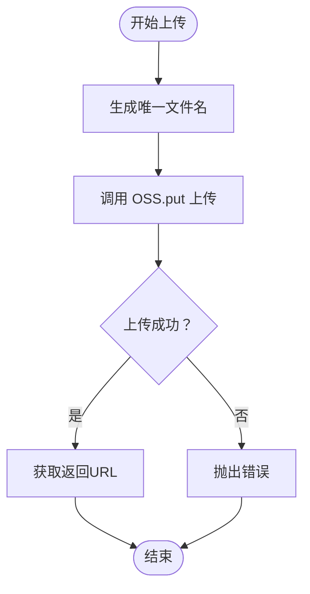
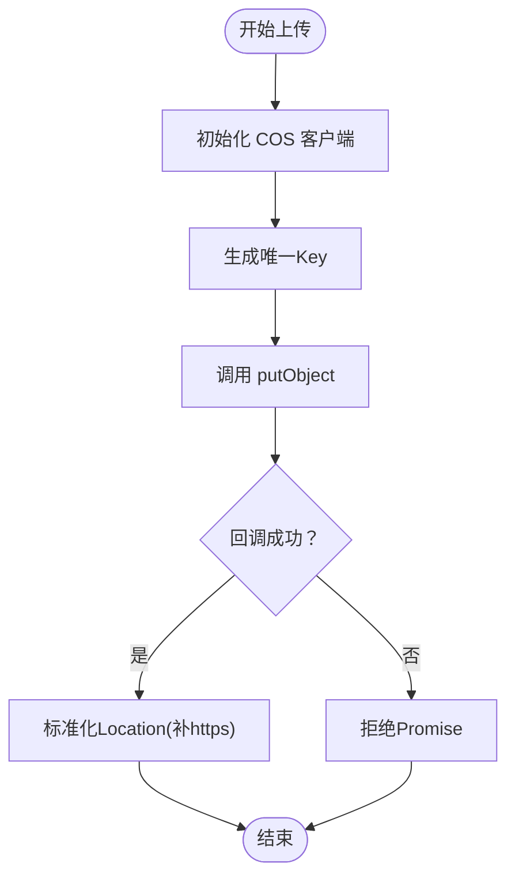
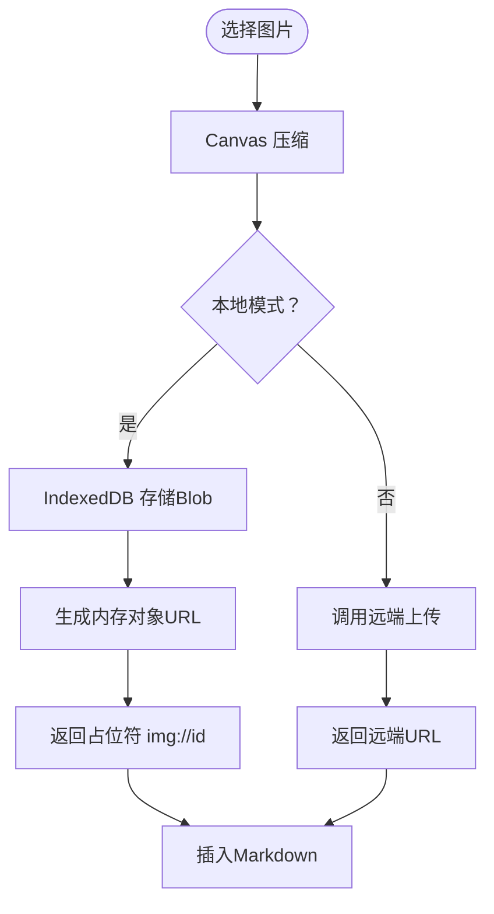
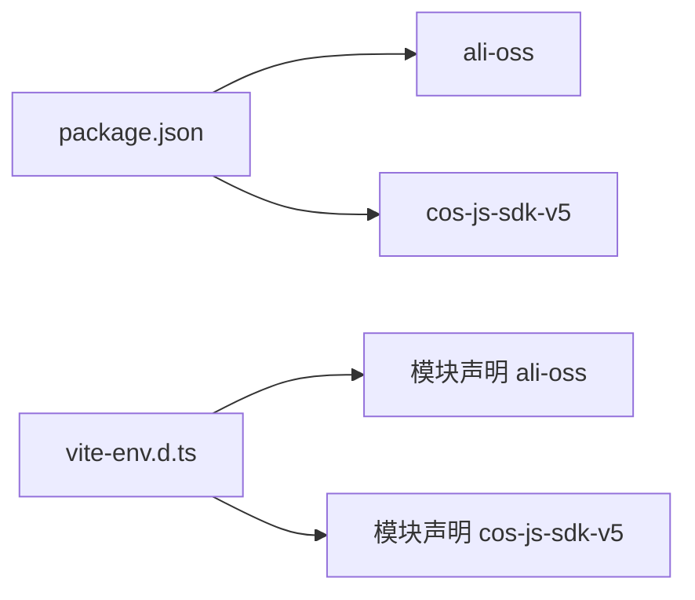

# 第三方服务集成

<cite>
**本文引用的文件**
- [src/lib/editor/imageStorage.ts](file://src/lib/editor/imageStorage.ts)
- [src/components/editor/SettingsModal.tsx](file://src/components/editor/SettingsModal.tsx)
- [src/components/editor/EditorToolbar.tsx](file://src/components/editor/EditorToolbar.tsx)
- [src/lib/store.ts](file://src/lib/store.ts)
- [src/vite-env.d.ts](file://src/vite-env.d.ts)
- [package.json](file://package.json)
</cite>

## 目录
1. [简介](#简介)
2. [项目结构](#项目结构)
3. [核心组件](#核心组件)
4. [架构总览](#架构总览)
5. [详细组件分析](#详细组件分析)
6. [依赖关系分析](#依赖关系分析)
7. [性能考量](#性能考量)
8. [故障排除指南](#故障排除指南)
9. [结论](#结论)
10. [附录](#附录)

## 简介
本技术文档聚焦于项目中的第三方服务集成，重点说明以下能力与实现：
- 阿里云 OSS 对象存储的客户端直传与 URL 生成
- 腾讯云 COS 的 SDK 使用、权限配置与上传流程
- 图片托管服务的实现原理：本地 IndexedDB 缓存、Canvas 压缩、Markdown 占位符内联与最终渲染
- 服务配置项：API 密钥、区域、存储空间等
- 安全与合规：密钥管理、签名与访问控制、数据传输安全
- 故障排除与监控建议

## 项目结构
与第三方服务集成相关的核心模块分布如下：
- 配置界面：设置弹窗用于选择与保存图片上传目的地及各平台密钥
- 编辑器工具栏：触发图片选择、压缩、上传与插入 Markdown
- 存储与上传逻辑：统一的图片托管与上传函数
- 全局状态：图片托管配置的持久化与跨组件共享
- 类型声明：第三方 SDK 的模块声明



**图表来源**
- [src/components/editor/SettingsModal.tsx:1-191](file://src/components/editor/SettingsModal.tsx#L1-L191)
- [src/components/editor/EditorToolbar.tsx:1-153](file://src/components/editor/EditorToolbar.tsx#L1-L153)
- [src/lib/editor/imageStorage.ts:1-259](file://src/lib/editor/imageStorage.ts#L1-L259)
- [src/lib/store.ts:1-242](file://src/lib/store.ts#L1-L242)

**章节来源**
- [src/components/editor/SettingsModal.tsx:1-191](file://src/components/editor/SettingsModal.tsx#L1-L191)
- [src/components/editor/EditorToolbar.tsx:1-153](file://src/components/editor/EditorToolbar.tsx#L1-L153)
- [src/lib/editor/imageStorage.ts:1-259](file://src/lib/editor/imageStorage.ts#L1-L259)
- [src/lib/store.ts:1-242](file://src/lib/store.ts#L1-L242)

## 核心组件
- 图片托管与上传逻辑：提供本地 IndexedDB 存取、Canvas 压缩、Sm.Ms 免费图床、阿里云 OSS、腾讯云 COS 的上传方法，并支持将本地占位符替换为内联 Data URL
- 设置弹窗：支持切换图片上传目的地（本地、Sm.Ms、OSS、COS），并填写对应密钥与参数
- 编辑器工具栏：触发文件选择、压缩、按配置上传、插入 Markdown 图片语法
- 全局状态：持久化的图片托管配置，包含活动类型与各平台密钥信息

**章节来源**
- [src/lib/editor/imageStorage.ts:1-259](file://src/lib/editor/imageStorage.ts#L1-L259)
- [src/components/editor/SettingsModal.tsx:1-191](file://src/components/editor/SettingsModal.tsx#L1-L191)
- [src/components/editor/EditorToolbar.tsx:1-153](file://src/components/editor/EditorToolbar.tsx#L1-L153)
- [src/lib/store.ts:41-52](file://src/lib/store.ts#L41-L52)

## 架构总览
整体流程：用户在编辑器中选择图片 → 触发工具栏处理 → 依据配置进行压缩与上传 → 返回图片 URL 并插入 Markdown；若为本地模式，则保存至 IndexedDB 并生成内存对象 URL。



**图表来源**
- [src/components/editor/EditorToolbar.tsx:24-70](file://src/components/editor/EditorToolbar.tsx#L24-L70)
- [src/lib/editor/imageStorage.ts:167-217](file://src/lib/editor/imageStorage.ts#L167-L217)
- [src/lib/store.ts:43-48](file://src/lib/store.ts#L43-L48)

## 详细组件分析

### 阿里云 OSS 集成
- 认证与配置
  - 使用 region、accessKeyId、accessKeySecret、bucket 四要素初始化客户端
  - 通过动态导入 SDK，按需加载，减少首屏体积
- 文件上传
  - 生成带时间戳与随机串的唯一文件名，扩展名沿用原文件
  - 调用 put 方法上传，返回包含 URL 的结果
- URL 生成
  - 直接返回 SDK 返回的可访问 URL



**图表来源**
- [src/lib/editor/imageStorage.ts:167-183](file://src/lib/editor/imageStorage.ts#L167-L183)

**章节来源**
- [src/lib/editor/imageStorage.ts:167-183](file://src/lib/editor/imageStorage.ts#L167-L183)
- [src/vite-env.d.ts:3](file://src/vite-env.d.ts#L3)
- [package.json:20](file://package.json#L20)

### 腾讯云 COS 集成
- 认证与配置
  - 使用 SecretId 与 SecretKey 初始化客户端
  - 上传时指定 Bucket、Region 与 Key（唯一文件名）
- 文件上传
  - 使用 Promise 包装回调式 putObject 接口
  - 若 Location 未以 http(s) 开头，自动补全 https 前缀
- URL 生成
  - 返回 Location 作为最终访问地址



**图表来源**
- [src/lib/editor/imageStorage.ts:188-217](file://src/lib/editor/imageStorage.ts#L188-L217)

**章节来源**
- [src/lib/editor/imageStorage.ts:188-217](file://src/lib/editor/imageStorage.ts#L188-L217)
- [src/vite-env.d.ts:4](file://src/vite-env.d.ts#L4)
- [package.json:22](file://package.json#L22)

### 图片托管与缓存策略
- 本地 IndexedDB 缓存
  - 打开数据库与对象仓库，支持保存与读取 Blob
  - 提供内存对象 URL 缓存，避免重复创建
- Canvas 压缩
  - 限制最大宽度与质量，默认 JPEG 输出，降低体积
- 占位符与内联
  - 本地模式下生成 img://id 占位符
  - 支持将占位符批量替换为内联 Data URL，便于导出与分享



**图表来源**
- [src/lib/editor/imageStorage.ts:25-53](file://src/lib/editor/imageStorage.ts#L25-L53)
- [src/lib/editor/imageStorage.ts:58-101](file://src/lib/editor/imageStorage.ts#L58-L101)
- [src/lib/editor/imageStorage.ts:109-120](file://src/lib/editor/imageStorage.ts#L109-L120)
- [src/lib/editor/imageStorage.ts:234-258](file://src/lib/editor/imageStorage.ts#L234-L258)

**章节来源**
- [src/lib/editor/imageStorage.ts:1-259](file://src/lib/editor/imageStorage.ts#L1-L259)

### 配置界面与状态管理
- 设置弹窗
  - 支持切换活动类型（本地、Sm.Ms、OSS、COS）
  - 分别收集 OSS 与 COS 的密钥与参数
- 全局状态
  - ImageHostConfig 结构定义了活动类型与各平台配置
  - 通过持久化中间件将配置保存在本地存储

```mermaid
classDiagram
class ImageHostConfig {
+activeType : "local"|"smms"|"oss"|"cos"
+smms? : { token }
+oss? : { region; accessKeyId; accessKeySecret; bucket }
+cos? : { SecretId; SecretKey; Bucket; Region }
}
class Store {
+imageHostConfig : ImageHostConfig
+setImageHostConfig(patch)
}
Store --> ImageHostConfig : "持有"
```

**图表来源**
- [src/lib/store.ts:43-48](file://src/lib/store.ts#L43-L48)
- [src/lib/store.ts:179-181](file://src/lib/store.ts#L179-L181)

**章节来源**
- [src/components/editor/SettingsModal.tsx:15-52](file://src/components/editor/SettingsModal.tsx#L15-L52)
- [src/lib/store.ts:41-52](file://src/lib/store.ts#L41-L52)
- [src/lib/store.ts:179-181](file://src/lib/store.ts#L179-L181)

## 依赖关系分析
- 第三方 SDK
  - ali-oss：用于阿里云 OSS 客户端直传
  - cos-js-sdk-v5：用于腾讯云 COS 客户端直传
- 类型声明
  - 通过模块声明为两个 SDK 提供类型支持
- 包管理
  - 在依赖列表中声明上述 SDK



**图表来源**
- [package.json:20](file://package.json#L20)
- [package.json:22](file://package.json#L22)
- [src/vite-env.d.ts:3](file://src/vite-env.d.ts#L3)
- [src/vite-env.d.ts:4](file://src/vite-env.d.ts#L4)

**章节来源**
- [package.json:13-31](file://package.json#L13-L31)
- [src/vite-env.d.ts:1-4](file://src/vite-env.d.ts#L1-L4)

## 性能考量
- 按需加载 SDK：通过动态 import 减少初始包体，提升首屏性能
- 图片压缩：Canvas 压缩默认限制最大宽度与质量，显著降低上传体积
- 本地缓存：IndexedDB 与内存对象 URL 缓存减少重复计算与网络请求
- 批量内联：支持将多张本地图片一次性转为 Data URL，便于导出与分享

**章节来源**
- [src/lib/editor/imageStorage.ts:171](file://src/lib/editor/imageStorage.ts#L171)
- [src/lib/editor/imageStorage.ts:58-101](file://src/lib/editor/imageStorage.ts#L58-L101)
- [src/lib/editor/imageStorage.ts:109-120](file://src/lib/editor/imageStorage.ts#L109-L120)
- [src/lib/editor/imageStorage.ts:234-258](file://src/lib/editor/imageStorage.ts#L234-L258)

## 故障排除指南
- 无法加载 SDK
  - 现象：运行时报错提示模块缺失
  - 排查：确认依赖已安装，动态 import 是否正常执行
  - 参考：SDK 在运行时动态导入
- 上传失败
  - OSS：检查 region、accessKeyId、accessKeySecret、bucket 是否正确
  - COS：检查 SecretId、SecretKey、Bucket、Region 是否正确
  - 统一：确认文件名唯一性与网络连通性
- URL 不可用
  - OSS：确认返回 URL 可访问
  - COS：确认 Location 是否以 http(s) 开头，必要时补全协议
- 本地图片显示异常
  - 现象：复制到微信公众号后图片失效
  - 建议：切换至 OSS/COS 或 Sm.Ms 等可公开访问的图床
- 密钥泄露风险
  - 建议：不要在前端长期保存敏感密钥；优先使用服务端签名直传或短期令牌

**章节来源**
- [src/lib/editor/imageStorage.ts:167-183](file://src/lib/editor/imageStorage.ts#L167-L183)
- [src/lib/editor/imageStorage.ts:188-217](file://src/lib/editor/imageStorage.ts#L188-L217)
- [src/components/editor/SettingsModal.tsx:106-107](file://src/components/editor/SettingsModal.tsx#L106-L107)

## 结论
本项目通过统一的图片托管与上传接口，实现了对本地、Sm.Ms、阿里云 OSS 与腾讯云 COS 的无缝集成。借助按需加载 SDK、Canvas 压缩与本地缓存，既保证了用户体验，也兼顾了性能与可维护性。建议在生产环境中结合服务端签名直传与短期令牌，进一步强化安全性与稳定性。

## 附录

### 服务配置选项说明
- 活动类型
  - local：本地 IndexedDB 模式
  - smms：Sm.Ms 免费图床
  - oss：阿里云 OSS
  - cos：腾讯云 COS
- OSS 配置
  - region：区域标识（如 oss-cn-hangzhou）
  - bucket：存储空间名称
  - accessKeyId：访问密钥 ID
  - accessKeySecret：访问密钥 Secret
- COS 配置
  - Region：区域标识（如 ap-shanghai）
  - Bucket：存储桶名称（含 AppId）
  - SecretId：访问密钥 ID
  - SecretKey：访问密钥 Secret
- 数据持久化
  - 配置通过持久化中间件保存在本地存储，重启后仍可恢复

**章节来源**
- [src/lib/store.ts:43-48](file://src/lib/store.ts#L43-L48)
- [src/components/editor/SettingsModal.tsx:37-48](file://src/components/editor/SettingsModal.tsx#L37-L48)

### 安全与合规建议
- 密钥管理
  - 避免在前端长期保存敏感密钥；优先采用服务端签名直传或短期令牌
- 访问控制
  - OSS/COS Bucket 权限尽量设为私有，结合 CDN 与签名 URL 控制访问
- 数据传输
  - 使用 HTTPS 通道，确保上传与访问链路加密
- 日志与监控
  - 上报上传成功率、耗时与错误码，建立告警阈值
  - 对异常地区与高失败率的区域进行监控与降级策略

[本节为通用建议，不直接分析具体文件，故无“章节来源”]