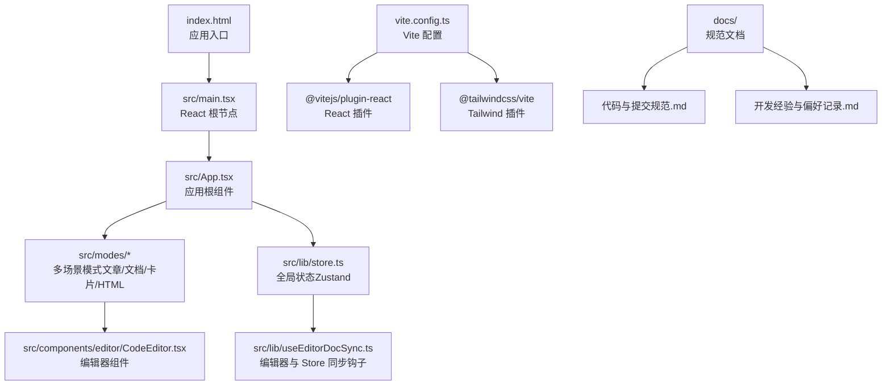
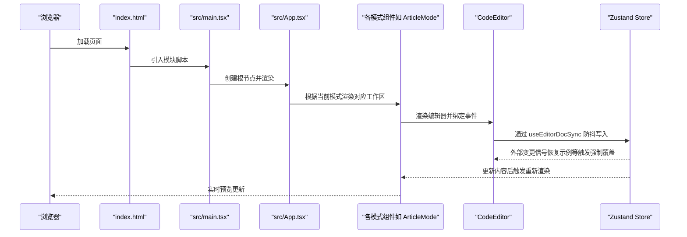
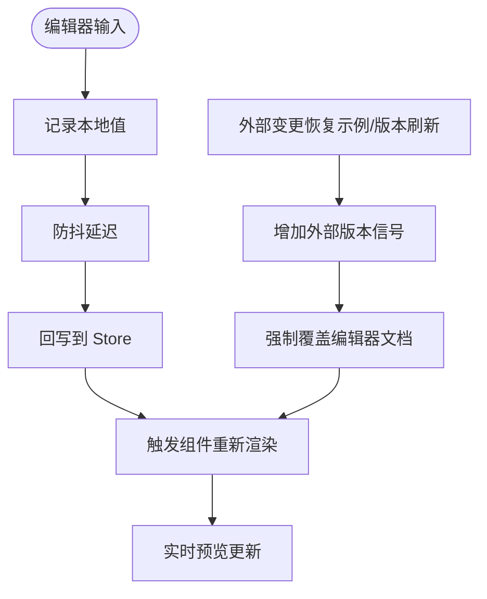
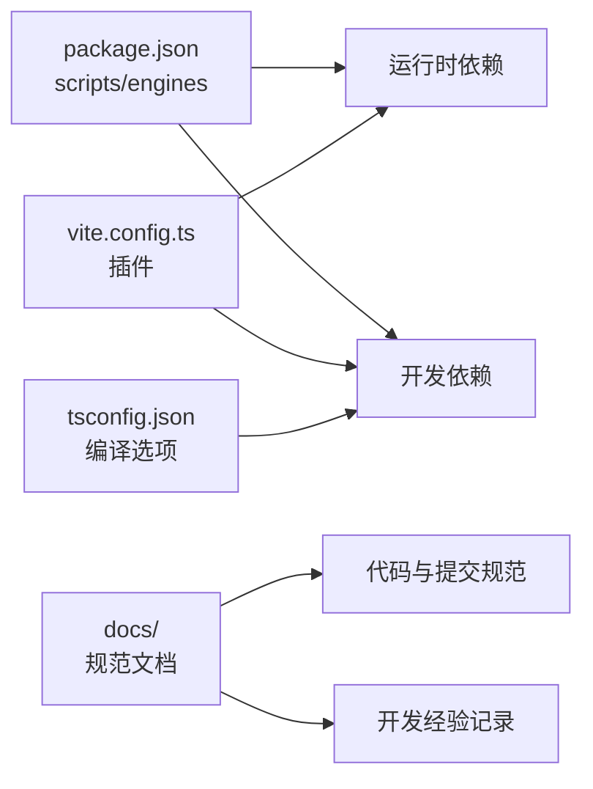

# 快速开始

<cite>
**本文引用的文件**
- [package.json](file://package.json)
- [vite.config.ts](file://vite.config.ts)
- [tsconfig.json](file://tsconfig.json)
- [index.html](file://index.html)
- [src/main.tsx](file://src/main.tsx)
- [src/App.tsx](file://src/App.tsx)
- [src/lib/store.ts](file://src/lib/store.ts)
- [src/lib/useEditorDocSync.ts](file://src/lib/useEditorDocSync.ts)
- [src/components/editor/CodeEditor.tsx](file://src/components/editor/CodeEditor.tsx)
- [src/modes/article/ArticleMode.tsx](file://src/modes/article/ArticleMode.tsx)
- [src/modes/document/DocumentMode.tsx](file://src/modes/document/DocumentMode.tsx)
- [src/data/demoArticle.ts](file://src/data/demoArticle.ts)
- [src/data/demoDocument.ts](file://src/data/demoDocument.ts)
- [src/data/demoCard.ts](file://src/data/demoCard.ts)
- [src/data/demoHtml.ts](file://src/data/demoHtml.ts)
- [README.md](file://README.md)
- [docs/代码与提交规范.md](file://docs/代码与提交规范.md)
- [docs/开发经验与偏好记录.md](file://docs/开发经验与偏好记录.md)
</cite>

## 更新摘要
**变更内容**
- 新增开发与提交规范章节，包含完整的开发命令速查、提交前检查清单、Git Commit Angular Convention 规范和代码风格要点
- 增加开发经验与偏好记录，涵盖用户偏好、设计准则和技术经验踩坑
- 完善开发流程指导，提供更全面的贡献指南

## 目录
1. [简介](#简介)
2. [项目结构](#项目结构)
3. [核心组件](#核心组件)
4. [架构总览](#架构总览)
5. [详细组件分析](#详细组件分析)
6. [开发与提交规范](#开发与提交规范)
7. [开发经验与偏好记录](#开发经验与偏好记录)
8. [依赖分析](#依赖分析)
9. [性能考虑](#性能考虑)
10. [故障排查指南](#故障排查指南)
11. [结论](#结论)
12. [附录](#附录)

## 简介
本指南面向首次接触 MarkFlow 的开发者，帮助你在本地快速搭建开发环境、安装依赖、启动 Vite 开发服务器并进行首次运行验证。文档涵盖环境要求（Node.js >= 20.0.0）、包管理器选择（推荐 pnpm）、依赖安装与启动命令、热重载机制说明、常见问题排查以及基本使用示例（创建第一个 Markdown 文档并进行实时预览）。

**更新** 新增完整的开发与提交规范章节，为贡献者提供标准化的工作流程指导。

## 项目结构
该项目基于 React + TypeScript + Vite 构建，采用模块化目录组织，核心入口为 index.html 和 src/main.tsx，应用根组件为 App.tsx。项目通过 Vite 提供开发服务器与构建工具链，TypeScript 提供类型安全，TailwindCSS 作为样式工具集成在 Vite 插件中。



**图示来源**
- [index.html](file://index.html)
- [src/main.tsx](file://src/main.tsx)
- [src/App.tsx](file://src/App.tsx)
- [src/modes/article/ArticleMode.tsx](file://src/modes/article/ArticleMode.tsx)
- [src/components/editor/CodeEditor.tsx](file://src/components/editor/CodeEditor.tsx)
- [src/lib/store.ts](file://src/lib/store.ts)
- [src/lib/useEditorDocSync.ts](file://src/lib/useEditorDocSync.ts)
- [vite.config.ts](file://vite.config.ts)
- [docs/代码与提交规范.md](file://docs/代码与提交规范.md)
- [docs/开发经验与偏好记录.md](file://docs/开发经验与偏好记录.md)

**章节来源**
- [index.html](file://index.html)
- [src/main.tsx](file://src/main.tsx)
- [src/App.tsx](file://src/App.tsx)
- [vite.config.ts](file://vite.config.ts)

## 核心组件
- 应用入口与根组件
  - index.html 通过模块脚本引入 src/main.tsx，创建 React 根节点并渲染 App。
  - App.tsx 作为应用根组件，负责模式切换（文章/文档/卡片/HTML）、主题与设置、示例内容恢复等。
- 编辑器与同步
  - CodeEditor.tsx 提供 Markdown/HTML 编辑体验，内置图片粘贴/拖拽上传、语言高亮、快捷键等。
  - useEditorDocSync.ts 实现编辑器与全局状态的双向同步，带防抖与外部变更信号，避免回写回声导致的输入丢失。
- 全局状态
  - store.ts 使用 Zustand 管理文章/文档/卡片/HTML 的内容、模式、主题、平台、文档设置等，并持久化到本地存储。

**章节来源**
- [src/main.tsx](file://src/main.tsx)
- [src/App.tsx](file://src/App.tsx)
- [src/components/editor/CodeEditor.tsx](file://src/components/editor/CodeEditor.tsx)
- [src/lib/useEditorDocSync.ts](file://src/lib/useEditorDocSync.ts)
- [src/lib/store.ts](file://src/lib/store.ts)

## 架构总览
下图展示了从浏览器请求到应用渲染、编辑器交互与实时预览的整体流程。



**图示来源**
- [index.html](file://index.html)
- [src/main.tsx](file://src/main.tsx)
- [src/App.tsx](file://src/App.tsx)
- [src/modes/article/ArticleMode.tsx](file://src/modes/article/ArticleMode.tsx)
- [src/components/editor/CodeEditor.tsx](file://src/components/editor/CodeEditor.tsx)
- [src/lib/store.ts](file://src/lib/store.ts)
- [src/lib/useEditorDocSync.ts](file://src/lib/useEditorDocSync.ts)

## 详细组件分析

### 开发环境与启动流程
- 环境要求
  - Node.js 版本需满足 engines 字段要求（>= 20.0.0）。
- 包管理器
  - 推荐使用 pnpm，仓库提供了 pnpm 锁定文件与相关配置。
- 依赖安装
  - 使用包管理器安装项目依赖（例如 pnpm install）。
- 启动开发服务器
  - 运行开发脚本以启动 Vite 本地服务器，默认启用热重载。
- 预览构建产物
  - 构建后可通过预览脚本在本地查看生产构建效果。

**章节来源**
- [package.json](file://package.json)
- [vite.config.ts](file://vite.config.ts)

### Vite 配置与别名
- 插件与解析
  - 集成 React 与 TailwindCSS 插件，支持 JSX 与 CSS 按需处理。
  - 通过路径别名简化导入，@ 指向 src，@engine 指向引擎相关模块。
- 类型与严格性
  - TypeScript 配置采用 bundler 模式与严格选项，确保类型安全与模块解析正确。

**章节来源**
- [vite.config.ts](file://vite.config.ts)
- [tsconfig.json](file://tsconfig.json)

### 编辑器与实时预览
- 编辑器组件
  - CodeEditor 提供 Markdown/HTML 编辑体验，支持语言高亮、快捷键、图片粘贴/拖拽上传与本地/云图床配置。
- 编辑器与 Store 同步
  - useEditorDocSync 实现编辑器本地值与 Store 的防抖回写，同时通过外部版本信号避免回写回声导致的输入丢失。
- 模式工作区
  - 各模式（如文章模式）将编辑器与预览面板并排展示，实现所见即所得的实时预览。



**图示来源**
- [src/components/editor/CodeEditor.tsx](file://src/components/editor/CodeEditor.tsx)
- [src/lib/useEditorDocSync.ts](file://src/lib/useEditorDocSync.ts)
- [src/modes/article/ArticleMode.tsx](file://src/modes/article/ArticleMode.tsx)

**章节来源**
- [src/components/editor/CodeEditor.tsx](file://src/components/editor/CodeEditor.tsx)
- [src/lib/useEditorDocSync.ts](file://src/lib/useEditorDocSync.ts)
- [src/modes/article/ArticleMode.tsx](file://src/modes/article/ArticleMode.tsx)

### 示例内容与首次运行验证
- 示例内容
  - 项目内置多场景示例（文章、文档、卡片、HTML），可在应用挂载时按版本号同步至编辑器。
- 首次运行步骤
  - 启动开发服务器后，在浏览器打开本地地址。
  - 在顶部导航选择模式（如"长图文"），编辑器中将出现对应示例内容。
  - 实时预览区域应同步显示渲染结果。
  - 点击"恢复示例"可将当前模式内容重置为最新示例。

**章节来源**
- [src/App.tsx](file://src/App.tsx)
- [src/data/demoArticle.ts](file://src/data/demoArticle.ts)
- [src/data/demoDocument.ts](file://src/data/demoDocument.ts)
- [src/data/demoCard.ts](file://src/data/demoCard.ts)
- [src/data/demoHtml.ts](file://src/data/demoHtml.ts)

## 开发与提交规范

### 开发命令速查
为确保开发流程的标准化和一致性，项目提供以下核心开发命令：

```bash
pnpm dev          # 启动开发服务器（热更新）
pnpm typecheck    # TypeScript 静态类型检查
pnpm test         # 运行全部单元测试（Vitest）
pnpm build        # 生产构建（= typecheck + vite build）
```

这些命令构成了完整的开发工作流，从开发调试到构建发布的各个环节都有对应的标准化工具。

**章节来源**
- [README.md](file://README.md)

### 提交前检查清单
每次提交前必须确保以下三项检查全部通过，这是保证代码质量和项目稳定性的关键环节：

1. `pnpm typecheck` — 无类型错误
   - 确保 TypeScript 类型检查通过，避免运行时类型错误
2. `pnpm test` — 全部测试通过  
   - 确保所有单元测试和集成测试都能正常运行
3. `pnpm build` — 构建成功且无异常体积膨胀
   - 验证构建过程正常，检查打包体积是否异常增长

**章节来源**
- [README.md](file://README.md)
- [docs/代码与提交规范.md](file://docs/代码与提交规范.md)

### Git Commit 规范（Angular Convention）
项目采用标准的 Angular 规范，所有 Commit Message 都应当遵循以下格式：

```
<type>(<scope>): <subject>

<body>
```

**Type 类型说明**：
- `feat`：新增功能（feature）
- `fix`：修复 bug
- `docs`：文档变更
- `style`：代码格式（不影响代码运行的变动，如空格、分号等）
- `refactor`：重构（即不是新增功能，也不是修改 bug 的代码变动）
- `perf`：性能优化
- `test`：增加测试或修改测试
- `build`：构建系统或外部依赖变更（如 Vite、npm 包更新、Chunk 分块调整）
- `chore`：对构建过程或辅助工具和库的更改

**提交示例**：
```
feat(article): 增加长图文模式的一键去重功能

为工具栏增加了去重按钮，使用基于正则匹配的方式过滤重复段落。
```

**章节来源**
- [README.md](file://README.md)
- [docs/代码与提交规范.md](file://docs/代码与提交规范.md)

### 代码风格要点
为保持代码的一致性和可维护性，项目制定了以下代码风格规范：

- **命名规范**：
  - 组件文件使用 PascalCase（如 `PreviewToolbar.tsx`）
  - 工具函数使用 camelCase（如 `useDebounce.ts`, `imageStorage.ts`）
  - 样式类名优先使用 Tailwind，自定义类名使用带语境的连字符格式（如 `document-block`, `app-logo-bg`）

- **注释规范**：
  - 注释使用中文，只写"为什么"（Why），不写"是什么"（What）
  - 业务逻辑、避坑指南用中文；变量名/函数名按英文技术惯例

- **代码质量原则**：
  - **简单优先**：不做过度抽象，不为"可能的未来"写代码
  - **手术刀修改**：只触碰必须改动的部分，不顺手重构未坏掉的代码
  - **构建体积保护**：大型 SDK 必须 `await import()` 按需加载，禁止顶部静态导入

**章节来源**
- [README.md](file://README.md)
- [docs/代码与提交规范.md](file://docs/代码与提交规范.md)

## 开发经验与偏好记录

### 用户偏好与设计准则
项目在开发过程中形成了明确的设计偏好和用户体验准则：

- **中文优先**：规划文档、需求说明、流程说明、复盘说明等优先使用中文；代码中的必要注释使用中文
- **简单优先 (Simplicity First)**：用解决问题的最小输出，拒绝猜测性的发散。不做过度抽象
- **目标驱动执行**：任务执行前定义成功标准，循环迭代直到验证通过。手术刀式修改，只触碰必须改动的部分

**UI 审美偏好**：
- 注重"呼吸感"，避免排版局促。例如分页图文卡片的四周留白应保持全局比例协调统一（如顶部 32px，左右 30px，底部相应留白）
- 各模式工具栏注重模块化，不强行把所有按钮堆叠在顶部全局导航，而是根据当前模式的上下文提供最相关的操作
- 界面引导：对于如"自由画布"这种高阶无代码沙箱，需提供直观的操作步骤引导（挑选风格 -> 给大模型 -> 粘回来变现）

**自由画布风格库治理**：
- 风格库按"输出类型（幻灯片/长页/卡片/报告/仪表盘/文档）→ 视觉气质（极简/编辑/科技/数据/温暖/代码）"组织
- 新增风格前先检查是否能归入既有 `family`；除非能明显覆盖新场景，否则不要新增同质化品牌皮肤
- 避免"霓虹、毛玻璃、夸张渐变、Emoji、极致动效"等容易导致土味或导出不稳定的表达

**章节来源**
- [docs/开发经验与偏好记录.md](file://docs/开发经验与偏好记录.md)

### 核心技术经验与踩坑记录

**公众号渲染引擎（engine）经验**：
- 换行处理：换行必须用 `<br>`，且不能落在 `<span leaf="">` 内部
- 顶格输出：`leaf()` 会对每行 `trim()`，换行后顶格输出
- 多行标签解析：`<title>/<p-title>/<lead>` 等支持跨行书写，闭合检测必须非锚定

**隐藏 DOM 分页与测量（A4 与图文卡片）**：
- DOM 高度测量陷阱（Margin Collapse）：必须使用 `offsetTop + offsetHeight - lastBottom` 来计算包含边距的实际物理高度
- 列表项 (li) 的分页打断：将列表项强制替换为段落断开，使其成为独立的 Block

**编辑器（CodeMirror / @uiw）经验**：
- 选区背景遮挡：`.cm-activeLine` 必须使用带透明度的颜色
- 组件重渲染卡顿：CodeMirror 的 `extensions` 属性必须用 `useMemo` 缓存
- 防抖回写把外部更新回滚：使用 `ref` 持有最新 store 值，避免回写回滚问题

**HTML 沙箱与自适应拉伸经验**：
- Zoom 与 Transform 的选型与坑：单页内容使用 CSS `zoom`，多页模式使用 `transform: scale(var(--auto-scale))`
- 不可见 DOM 的尺寸测量：通过 `find(el => el.style.display !== 'none')` 抓取当前可见页的尺寸
- 导出画质保护：在执行导出函数的瞬间重置 `zoom` 和 `--auto-scale` 为 1

**章节来源**
- [docs/开发经验与偏好记录.md](file://docs/开发经验与偏好记录.md)

## 依赖分析
- 运行时依赖
  - React 生态、CodeMirror 编辑器、KaTeX 数学公式、highlight.js 代码高亮、截图与 PDF 导出工具等。
- 开发依赖
  - Vite、React 插件、TailwindCSS 插件、TypeScript、测试框架等。
- Node.js 版本约束
  - 通过 engines 字段限定最低 Node.js 版本。



**图示来源**
- [package.json](file://package.json)
- [vite.config.ts](file://vite.config.ts)
- [tsconfig.json](file://tsconfig.json)
- [docs/代码与提交规范.md](file://docs/代码与提交规范.md)
- [docs/开发经验与偏好记录.md](file://docs/开发经验与偏好记录.md)

**章节来源**
- [package.json](file://package.json)
- [vite.config.ts](file://vite.config.ts)
- [tsconfig.json](file://tsconfig.json)

## 性能考虑
- 编辑器输入稳定性
  - 通过"挂载时受控、之后非受控"的策略避免全量替换导致的输入丢失与组合输入竞态。
- 防抖回写
  - useEditorDocSync 对编辑器输入进行防抖回写，降低 Store 写入频率，避免冗余更新与脏标记误判。
- 语言数据预加载
  - 在编辑器挂载前预加载常用编程语言描述，避免运行时异步加载导致的重新配置与输入丢失。
- 预览渲染
  - 模式组件对渲染结果进行记忆化，仅在依赖变化时重新计算，提升滚动同步与预览渲染性能。

**章节来源**
- [src/components/editor/CodeEditor.tsx](file://src/components/editor/CodeEditor.tsx)
- [src/lib/useEditorDocSync.ts](file://src/lib/useEditorDocSync.ts)
- [src/modes/article/ArticleMode.tsx](file://src/modes/article/ArticleMode.tsx)

## 故障排查指南
- Node.js 版本不满足要求
  - 现象：安装或启动时报错，提示 Node 版本过低。
  - 处理：升级 Node.js 至 20.0.0 或以上版本。
- 包管理器选择
  - 现象：安装依赖报错或构建异常。
  - 处理：优先使用 pnpm，确保锁定文件与 onlyBuiltDependencies 配置生效。
- 热重载无效
  - 现象：修改代码后浏览器未自动刷新。
  - 处理：确认开发服务器正常运行；检查 Vite 配置与浏览器网络面板是否存在连接错误。
- 编辑器输入丢失或光标异常
  - 现象：输入过程中出现光标跳动、字符丢失或组合输入中断。
  - 处理：遵循"挂载时受控、之后非受控"的策略；避免在外部频繁重设受控 value；确保语言数据预加载完成后再进行大量输入。
- 图片粘贴/拖拽上传失败
  - 现象：粘贴或拖拽图片后无响应或报错。
  - 处理：检查图床配置（本地/SM.MS/OSS/COS）；确认浏览器允许剪贴板访问与文件读取权限；查看控制台错误信息。
- 预览不更新
  - 现象：编辑器内容变化后预览未同步。
  - 处理：确认 Store 已回写；检查 useEditorDocSync 的外部版本信号是否正确递增；验证模式组件的渲染逻辑。

**章节来源**
- [package.json](file://package.json)
- [vite.config.ts](file://vite.config.ts)
- [src/components/editor/CodeEditor.tsx](file://src/components/editor/CodeEditor.tsx)
- [src/lib/useEditorDocSync.ts](file://src/lib/useEditorDocSync.ts)
- [src/App.tsx](file://src/App.tsx)

## 结论
通过本指南，你已完成环境准备、依赖安装与开发服务器启动，并掌握了编辑器与预览的实时联动机制。建议在首次运行后尝试切换不同模式、修改示例内容并观察预览变化，进一步熟悉多场景渲染工作流。同时，建议仔细阅读开发与提交规范，遵循项目约定的开发流程和代码风格，为项目的长期可持续发展做出贡献。

## 附录
- 常用命令
  - 启动开发服务器：运行开发脚本
  - 构建生产包：运行构建脚本
  - 预览构建产物：运行预览脚本
  - 类型检查：运行类型检查脚本
  - 运行测试：运行测试脚本
- 关键文件路径
  - 应用入口：index.html
  - 根组件：src/main.tsx、src/App.tsx
  - 编辑器：src/components/editor/CodeEditor.tsx
  - 同步钩子：src/lib/useEditorDocSync.ts
  - 全局状态：src/lib/store.ts
  - Vite 配置：vite.config.ts
  - TypeScript 配置：tsconfig.json
  - 开发规范：docs/代码与提交规范.md
  - 开发经验：docs/开发经验与偏好记录.md

**章节来源**
- [package.json](file://package.json)
- [index.html](file://index.html)
- [src/main.tsx](file://src/main.tsx)
- [src/App.tsx](file://src/App.tsx)
- [src/components/editor/CodeEditor.tsx](file://src/components/editor/CodeEditor.tsx)
- [src/lib/useEditorDocSync.ts](file://src/lib/useEditorDocSync.ts)
- [src/lib/store.ts](file://src/lib/store.ts)
- [vite.config.ts](file://vite.config.ts)
- [tsconfig.json](file://tsconfig.json)
- [docs/代码与提交规范.md](file://docs/代码与提交规范.md)
- [docs/开发经验与偏好记录.md](file://docs/开发经验与偏好记录.md)