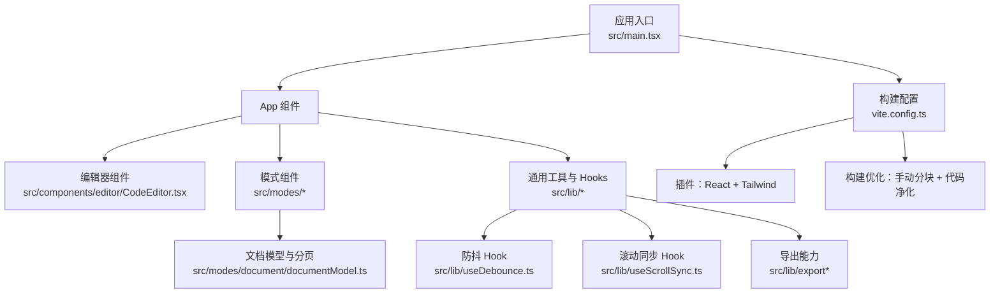
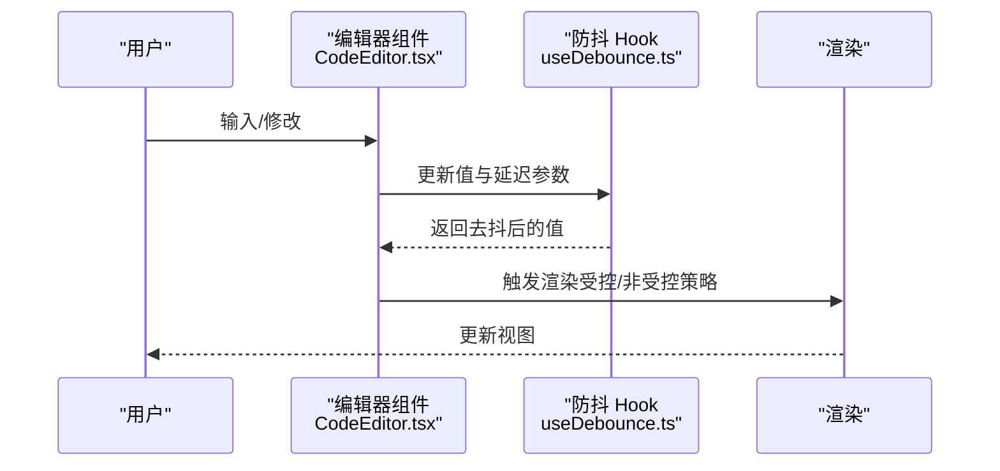
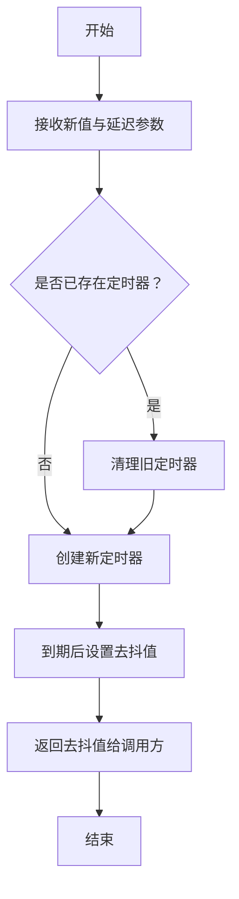
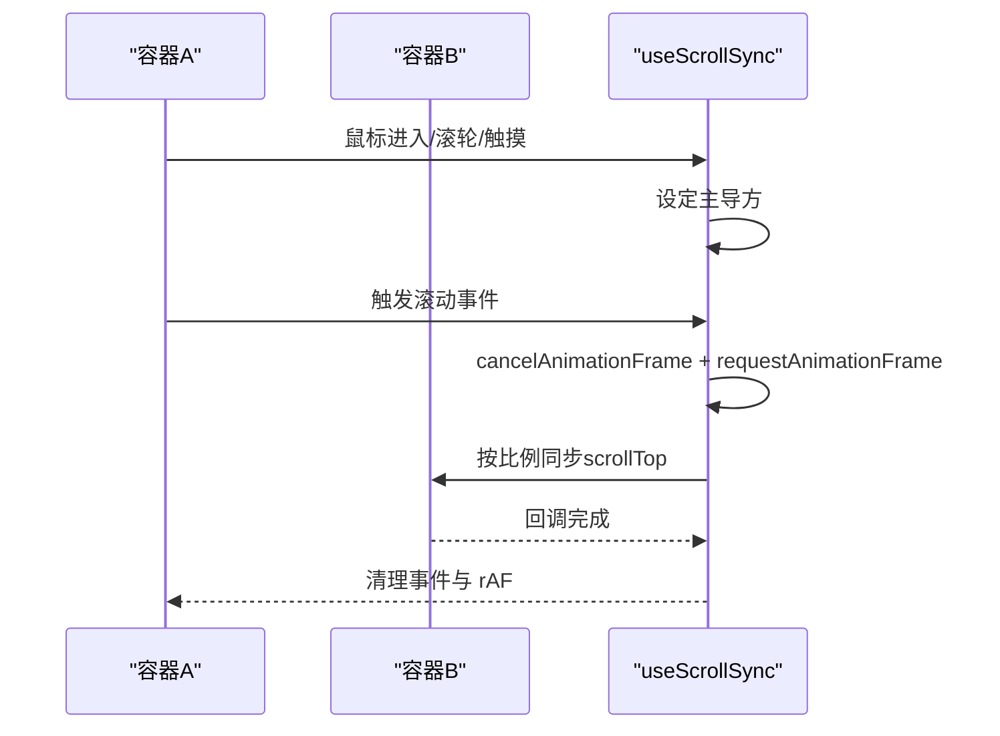
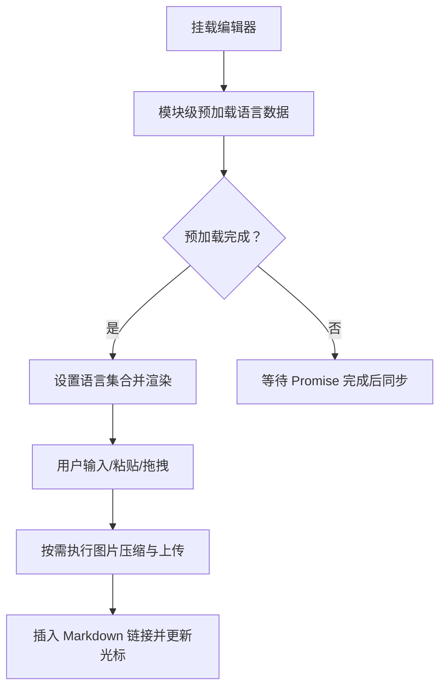
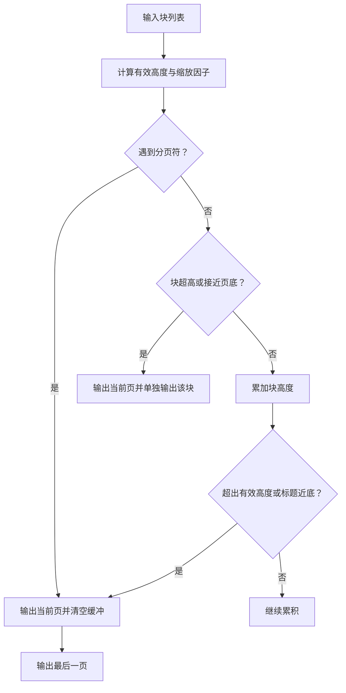
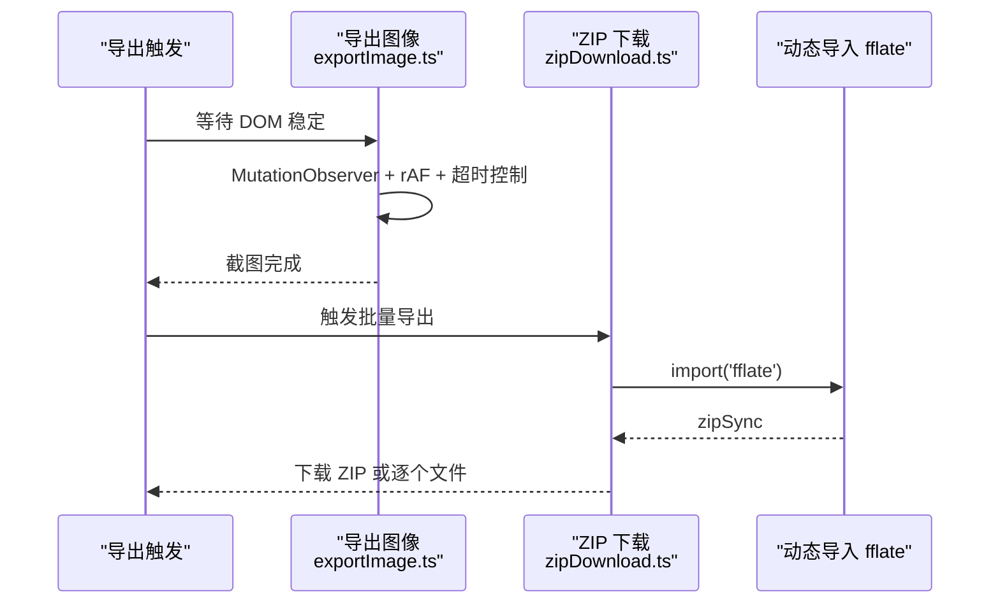
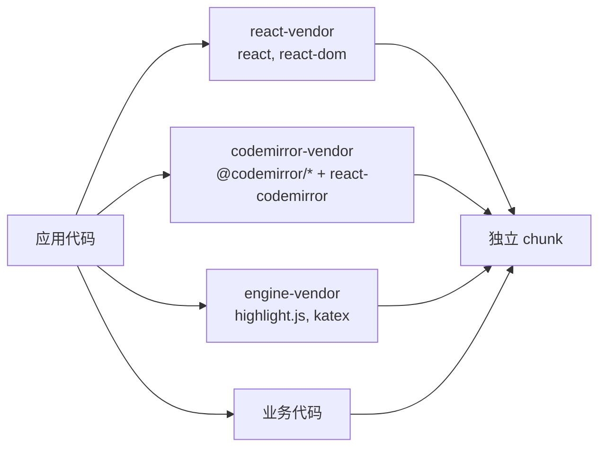
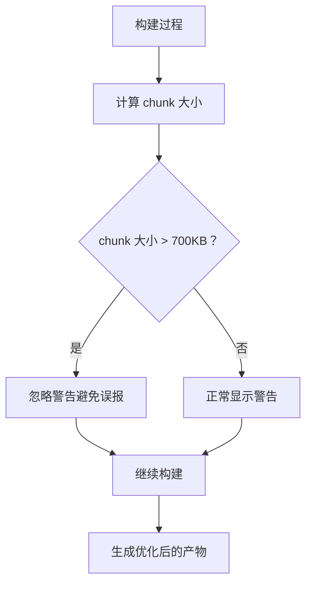
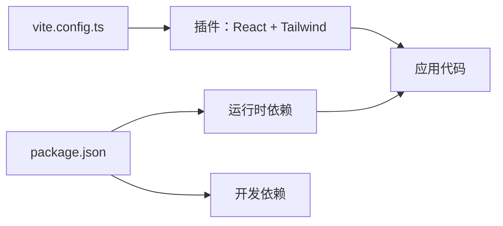

# 性能优化

<cite>
**本文引用的文件**
- [src/lib/useDebounce.ts](file://src/lib/useDebounce.ts)
- [src/lib/useScrollSync.ts](file://src/lib/useScrollSync.ts)
- [vite.config.ts](file://vite.config.ts)
- [package.json](file://package.json)
- [src/main.tsx](file://src/main.tsx)
- [src/components/editor/CodeEditor.tsx](file://src/components/editor/CodeEditor.tsx)
- [src/modes/document/documentModel.ts](file://src/modes/document/documentModel.ts)
- [src/lib/exportImage.ts](file://src/lib/exportImage.ts)
- [src/lib/export/zipDownload.ts](file://src/lib/export/zipDownload.ts)
- [src/engine/editor-components/Slider_DA01.ts](file://src/engine/editor-components/Slider_DA01.ts)
</cite>

## 更新摘要
**变更内容**
- 新增构建优化配置章节，详细介绍 chunkSizeWarningLimit: 700 的作用和配置方法
- 更新构建优化配置建议，包含手动分块配置和代码净化策略
- 新增构建性能监控和调试指南

## 目录
1. [引言](#引言)
2. [项目结构](#项目结构)
3. [核心组件](#核心组件)
4. [架构总览](#架构总览)
5. [详细组件分析](#详细组件分析)
6. [构建优化配置](#构建优化配置)
7. [依赖关系分析](#依赖关系分析)
8. [性能注意事项](#性能注意事项)
9. [故障排查指南](#故障排查指南)
10. [结论](#结论)
11. [附录](#附录)

## 引言
本指南聚焦于 MarkFlow 的性能优化实践，围绕以下主题展开：代码分割与懒加载、防抖机制在编辑器中的应用、滚动同步优化、构建期优化、内存泄漏与垃圾回收策略、大型文档分页渲染、以及性能监控与瓶颈定位方法。内容以仓库现有实现为基础，结合可扩展建议，帮助在保证功能正确性的前提下获得更流畅的交互体验。

## 项目结构
项目采用 React + Vite 技术栈，核心目录与职责概览：
- src/components：界面组件层，如编辑器、预览、UI 控件
- src/lib：通用工具与 hooks，如防抖、滚动同步、导出能力
- src/modes：模式层（文章、卡片、文档、HTML），负责模型与视图组合
- src/engine：渲染引擎与组件库（含动画组件）
- vite.config.ts：构建配置入口，集成 React 与 Tailwind 插件
- package.json：依赖与脚本定义

**图表来源**
- [src/main.tsx:1-12](file://src/main.tsx#L1-L12)
- [vite.config.ts:1-39](file://vite.config.ts#L1-L39)

**章节来源**
- [src/main.tsx:1-12](file://src/main.tsx#L1-L12)
- [vite.config.ts:1-39](file://vite.config.ts#L1-L39)

## 核心组件
本节梳理与性能直接相关的核心模块及其职责：
- 防抖 Hook：用于降低高频输入对渲染与计算的压力
- 滚动同步 Hook：在多面板滚动时减少抖动与冲突
- 代码编辑器：通过模块级预加载与受控/非受控策略提升输入稳定性
- 文档分页模型：针对大文档进行分页与高度估算，避免一次性渲染过多节点
- 导出与打包：ZIP 动态导入与导出流程，避免不必要的包体积

**章节来源**
- [src/lib/useDebounce.ts:1-18](file://src/lib/useDebounce.ts#L1-L18)
- [src/lib/useScrollSync.ts:1-68](file://src/lib/useScrollSync.ts#L1-L68)
- [src/components/editor/CodeEditor.tsx:1-213](file://src/components/editor/CodeEditor.tsx#L1-L213)
- [src/modes/document/documentModel.ts:284-350](file://src/modes/document/documentModel.ts#L284-L350)
- [src/lib/export/zipDownload.ts:1-35](file://src/lib/export/zipDownload.ts#L1-L35)

## 架构总览
从性能角度，系统的关键路径如下：
- 编辑器输入路径：用户输入 → 防抖 → 状态更新 → 渲染
- 滚动同步路径：容器滚动事件 → 主导方判定 → requestAnimationFrame 同步
- 文档渲染路径：分块 → 分页 → 按页渲染 → 高度缓存
- 导出路径：动态导入压缩库 → ZIP 打包 → 下载

**图表来源**
- [src/components/editor/CodeEditor.tsx:1-213](file://src/components/editor/CodeEditor.tsx#L1-L213)
- [src/lib/useDebounce.ts:1-18](file://src/lib/useDebounce.ts#L1-L18)

## 详细组件分析

### 防抖机制与 useDebounce Hook
useDebounce 通过定时器实现"延迟生效"的状态更新，适合处理高频输入（如搜索、实时预览、公式渲染等）。其要点：
- 使用 useEffect 在每次值或延迟变化时创建/清理定时器
- 清理阶段及时取消定时器，防止"幽灵回调"引发的副作用
- 返回去抖后的值，供上层组件消费

**图表来源**
- [src/lib/useDebounce.ts:1-18](file://src/lib/useDebounce.ts#L1-L18)

调优建议
- 对编辑器输入，建议延迟 100–300ms，兼顾响应性与性能
- 对昂贵计算（如语法高亮、数学公式渲染），建议延迟 300–500ms 或更高
- 注意依赖数组，避免频繁重建定时器

**章节来源**
- [src/lib/useDebounce.ts:1-18](file://src/lib/useDebounce.ts#L1-L18)

### 滚动同步与 useScrollSync Hook
useScrollSync 通过"主导方"策略避免双向滚动冲突，并使用 requestAnimationFrame 降低重排压力：
- 主导方判定：鼠标进入、滚轮、触摸开始时确定主导方
- 同步算法：根据 scrollTop 比例映射到另一容器
- 事件监听：passive 优化与统一清理，防止内存泄漏

**图表来源**
- [src/lib/useScrollSync.ts:1-68](file://src/lib/useScrollSync.ts#L1-L68)

性能考量
- 使用 passive 事件监听，减少主线程阻塞
- rAF 合并多次滚动，避免高频重绘
- 严格在清理函数中移除事件与取消 rAF，防止内存泄漏

**章节来源**
- [src/lib/useScrollSync.ts:1-68](file://src/lib/useScrollSync.ts#L1-L68)

### 代码分割与懒加载（编辑器与导出）
- 编辑器语言数据模块级预加载：在组件挂载前完成语言数据加载，避免运行时异步导致的重新配置与输入丢失
- 导出 ZIP 动态导入：仅在需要时加载压缩库，降低首屏体积
- 图片上传与压缩：在粘贴/拖拽时按需执行，避免全局初始化开销

**图表来源**
- [src/components/editor/CodeEditor.tsx:1-213](file://src/components/editor/CodeEditor.tsx#L1-L213)
- [src/lib/export/zipDownload.ts:1-35](file://src/lib/export/zipDownload.ts#L1-L35)

**章节来源**
- [src/components/editor/CodeEditor.tsx:1-213](file://src/components/editor/CodeEditor.tsx#L1-L213)
- [src/lib/export/zipDownload.ts:1-35](file://src/lib/export/zipDownload.ts#L1-L35)

### 大型文档处理与分页渲染
文档分页逻辑基于有效高度与块高度估算，确保每页内容不超过有效高度，并对超大块与标题靠近底部的情况进行特殊处理：
- 有效高度：考虑页边距与安全间距，按字体缩放因子调整
- 超高块：单独成页并标记 oversized
- 标题近底：提前换页，避免标题被截断
- 页面缓存：实际高度可作为缓存键，避免重复测量

**图表来源**
- [src/modes/document/documentModel.ts:284-350](file://src/modes/document/documentModel.ts#L284-L350)

**章节来源**
- [src/modes/document/documentModel.ts:284-350](file://src/modes/document/documentModel.ts#L284-L350)

### 导出与资源优化
- 导出图像：使用 MutationObserver 监听 DOM 稳定，配合 rAF 与最大等待时间，确保截图质量与性能平衡
- ZIP 打包：动态导入压缩库，失败时回退为顺序下载，保障可用性

**图表来源**
- [src/lib/exportImage.ts:29-73](file://src/lib/exportImage.ts#L29-L73)
- [src/lib/export/zipDownload.ts:1-35](file://src/lib/export/zipDownload.ts#L1-L35)

**章节来源**
- [src/lib/exportImage.ts:29-73](file://src/lib/exportImage.ts#L29-L73)
- [src/lib/export/zipDownload.ts:1-35](file://src/lib/export/zipDownload.ts#L1-L35)

### 动画组件与渲染开销
部分编辑器组件采用 SVG 动画（如轮播、弹跳、快速回滚、淡入淡出），通过 keyTimes 与 values 精准控制位移与透明度，减少复杂布局抖动：
- 关键帧数量与持续时间需与页面滚动节奏匹配
- 避免在滚动过程中同时触发动画，优先使用 rAF 同步

**章节来源**
- [src/engine/editor-components/Slider_DA01.ts:63-193](file://src/engine/editor-components/Slider_DA01.ts#L63-L193)

## 构建优化配置

### 手动分块配置（manualChunks）
项目通过手动分块策略将大型第三方依赖分离为独立的 vendor 包，显著提升浏览器缓存利用率和加载性能：

**图表来源**
- [vite.config.ts:20-30](file://vite.config.ts#L20-L30)

配置详情：
- **react-vendor**：包含 React 核心库，避免与业务代码混合
- **codemirror-vendor**：包含完整的编辑器生态，减少重复加载
- **engine-vendor**：包含渲染引擎依赖，如语法高亮和数学公式渲染

### 代码净化与压缩
构建时自动移除调试代码，减小包体积并提升运行时性能：

- **移除 console.log**：通过 esbuild 的 pure 配置自动删除
- **移除 debugger**：直接从构建产物中剔除
- **Tree Shaking**：确保未使用的代码被完全移除

### chunkSizeWarningLimit 配置
新增的 chunkSizeWarningLimit: 700 配置用于优化构建性能：

**配置作用**：
- 避免对大型按需加载库产生误报警告
- 允许合理的大型 chunk 存在，专注于真正需要关注的性能问题
- 提升开发体验，减少不必要的构建警告干扰

**章节来源**
- [vite.config.ts:16-38](file://vite.config.ts#L16-L38)

### 构建优化配置建议（基于现有配置）
- **Tree Shaking**：确保依赖支持 ES Module 并启用最小打包
- **代码压缩**：Vite 默认使用 esbuild 压缩，保持默认即可
- **资源优化**：Tailwind 自动裁剪样式，建议开启生产环境
- **别名与解析**：通过 @ 与 @engine 别名提升可维护性
- **手动分块**：合理拆分大型依赖，提升缓存效率
- **代码净化**：移除调试代码，减小包体积

**章节来源**
- [vite.config.ts:1-39](file://vite.config.ts#L1-L39)
- [package.json:1-53](file://package.json#L1-L53)

## 依赖关系分析
- 构建插件：React 与 Tailwind 插件集成，提供 JSX 转译与样式处理
- 运行时依赖：React、CodeMirror、KaTeX、highlight.js 等，均支持 Tree Shaking
- 包体积控制：pnpm onlyBuiltDependencies 限定 esbuild，减少冗余依赖

**图表来源**
- [vite.config.ts:1-39](file://vite.config.ts#L1-L39)
- [package.json:1-53](file://package.json#L1-L53)

**章节来源**
- [vite.config.ts:1-39](file://vite.config.ts#L1-L39)
- [package.json:1-53](file://package.json#L1-L53)

## 性能注意事项
- **代码分割与懒加载**
  - 编辑器语言数据与导出库按需加载，避免首屏负担
  - 图片上传与压缩仅在用户操作时触发
- **防抖与节流**
  - 输入类高频事件使用防抖；滚动同步使用 rAF 合并
- **内存管理**
  - useScrollSync 在清理函数中移除事件与取消 rAF
  - useDebounce 在清理函数中清除定时器
- **大文档渲染**
  - 分页与高度缓存减少重排与重绘
  - 标题近底提前换页，避免视觉截断
- **导出稳定性**
  - 导出图像使用 DOM 稳定检测与最大等待时间
  - ZIP 失败回退顺序下载，保证可用性
- **构建优化**
  - 手动分块提升缓存利用率
  - 代码净化减少包体积
  - chunkSizeWarningLimit 避免误报警告

## 故障排查指南
- **滚动不同步或卡顿**
  - 检查是否正确传入容器 ref 与依赖数组
  - 确认未在滚动期间设置 scrollTop 导致循环触发
  - 查看是否存在未移除的事件监听或未取消的 rAF
- **防抖无效或抖动严重**
  - 检查延迟参数是否过小
  - 确认依赖数组是否包含所有影响因素
- **导出失败或空白图**
  - 确认 DOM 已稳定且样式加载完成
  - 检查超时与 rAF 轮询是否被中断
- **ZIP 导出异常**
  - 检查动态导入是否成功
  - 回退路径是否正确执行
- **构建警告过多**
  - 检查 chunkSizeWarningLimit 配置是否合理
  - 评估手动分块策略的有效性
- **包体积过大**
  - 分析手动分块效果
  - 检查代码净化配置是否生效

**章节来源**
- [src/lib/useScrollSync.ts:1-68](file://src/lib/useScrollSync.ts#L1-L68)
- [src/lib/useDebounce.ts:1-18](file://src/lib/useDebounce.ts#L1-L18)
- [src/lib/exportImage.ts:29-73](file://src/lib/exportImage.ts#L29-L73)
- [src/lib/export/zipDownload.ts:1-35](file://src/lib/export/zipDownload.ts#L1-L35)
- [vite.config.ts:16-17](file://vite.config.ts#L16-L17)

## 结论
通过模块级预加载、useDebounce、useScrollSync、分页渲染与动态导入等手段，MarkFlow 在保持交互流畅的同时显著降低了首屏与运行时开销。新增的构建优化配置进一步提升了性能表现，包括手动分块策略、代码净化和 chunkSizeWarningLimit 配置。建议在新增功能时延续这些策略，并结合性能监控工具持续迭代。

## 附录

### 构建性能监控与调试
- **构建分析工具**：使用 Vite 的内置分析工具检查包大小和依赖关系
- **性能监控**：通过浏览器开发者工具监控网络请求和内存使用
- **调试技巧**：利用 chunkSizeWarningLimit 配置避免误报警告，专注于真正的性能问题

**章节来源**
- [vite.config.ts:1-39](file://vite.config.ts#L1-L39)
- [package.json:1-53](file://package.json#L1-L53)