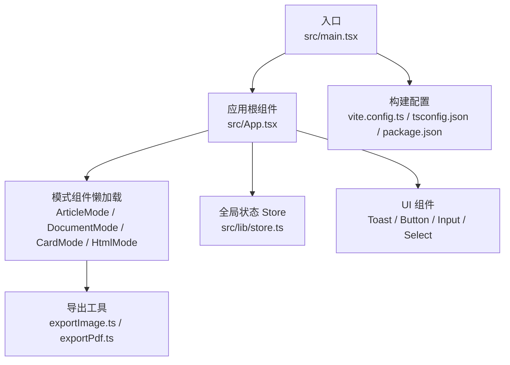
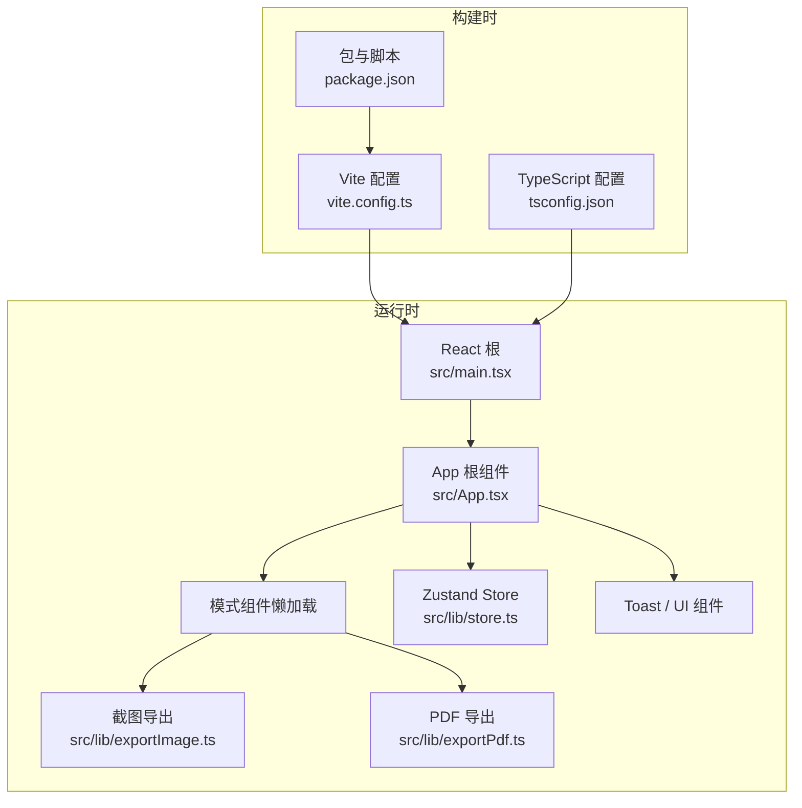
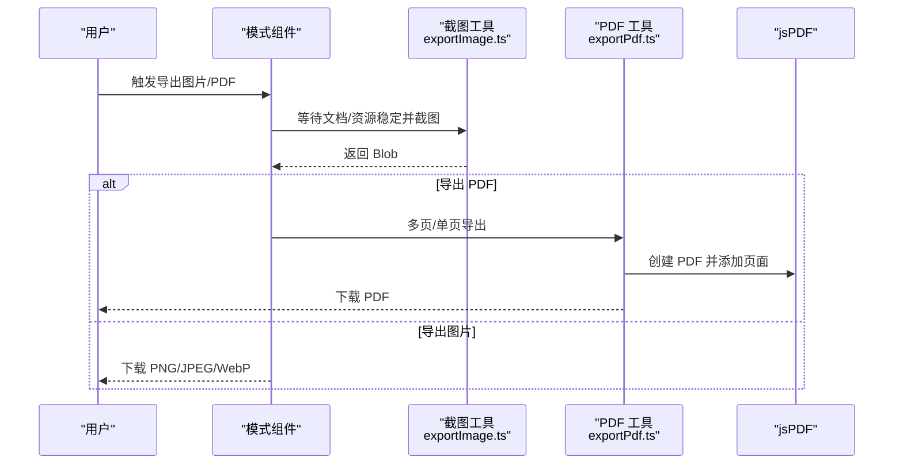
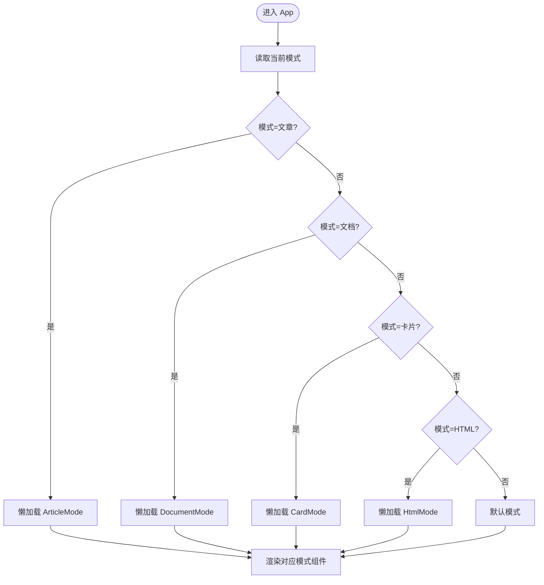
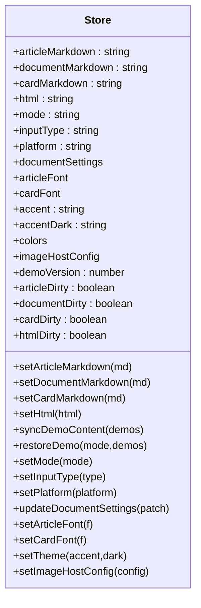
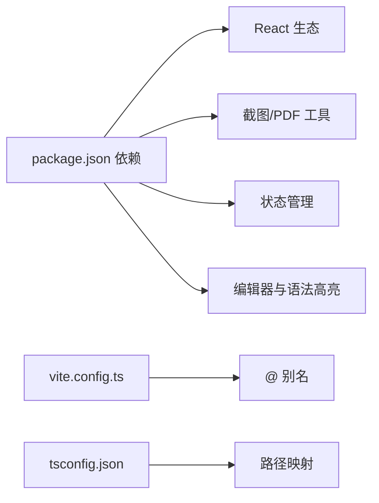

# 故障排除

<cite>
**本文引用的文件**   
- [package.json](file://package.json)
- [vite.config.ts](file://vite.config.ts)
- [tsconfig.json](file://tsconfig.json)
- [src/main.tsx](file://src/main.tsx)
- [src/App.tsx](file://src/App.tsx)
- [src/lib/store.ts](file://src/lib/store.ts)
- [src/lib/exportImage.ts](file://src/lib/exportImage.ts)
- [src/lib/exportPdf.ts](file://src/lib/exportPdf.ts)
- [src/components/ui/Toast.tsx](file://src/components/ui/Toast.tsx)
- [src/modes/article/ArticleMode.tsx](file://src/modes/article/ArticleMode.tsx)
- [src/lib/clipboard.ts](file://src/lib/clipboard.ts)
- [src/lib/editor/imageStorage.ts](file://src/lib/editor/imageStorage.ts)
- [docs/技术路线图.md](file://docs/技术路线图.md)
</cite>

## 目录
1. [简介](#简介)
2. [项目结构](#项目结构)
3. [核心组件](#核心组件)
4. [架构总览](#架构总览)
5. [详细组件分析](#详细组件分析)
6. [依赖关系分析](#依赖关系分析)
7. [性能考虑](#性能考虑)
8. [故障排除指南](#故障排除指南)
9. [结论](#结论)
10. [附录](#附录)

## 简介
本指南面向 MarkFlow 的使用者与维护者，聚焦于开发与运行中的常见问题，包括编译错误、运行时错误、性能问题、网络相关问题（如图片加载失败、导出异常）、以及环境配置排查。同时提供调试技巧与工具使用建议，帮助快速定位与解决问题。

## 项目结构
项目采用 Vite + React + TypeScript 技术栈，通过路径别名组织源码，构建配置集中于 Vite 与 TypeScript 编译选项。应用入口负责初始化主题与样式，主界面按模式懒加载渲染，导出能力基于截图与 PDF 库实现。

图表来源
- [src/main.tsx:1-12](file://src/main.tsx#L1-L12)
- [src/App.tsx:13-171](file://src/App.tsx#L13-L171)
- [vite.config.ts:1-17](file://vite.config.ts#L1-L17)
- [tsconfig.json:1-28](file://tsconfig.json#L1-L28)
- [package.json:1-52](file://package.json#L1-L52)

章节来源
- [src/main.tsx:1-12](file://src/main.tsx#L1-L12)
- [src/App.tsx:13-171](file://src/App.tsx#L13-L171)
- [vite.config.ts:1-17](file://vite.config.ts#L1-L17)
- [tsconfig.json:1-28](file://tsconfig.json#L1-L28)
- [package.json:1-52](file://package.json#L1-L52)

## 核心组件
- 应用入口与初始化：负责挂载 React 根节点、引入 KaTeX 样式与全局样式。
- 应用根组件：按模式渲染不同工作台，提供顶部导航、主题切换、示例恢复、设置弹窗与全局提示。
- 全局状态 Store：集中管理各模式内容、主题、平台、文档设置、图床配置与脏标记，支持持久化与版本同步。
- 导出工具：提供基于截图的图片导出与 PDF 导出，支持多页与单页模式，兼容背景色与缩放策略。
- UI 组件：轻量 Toast 提示，配合应用根组件统一展示操作反馈。

章节来源
- [src/main.tsx:1-12](file://src/main.tsx#L1-L12)
- [src/App.tsx:13-171](file://src/App.tsx#L13-L171)
- [src/lib/store.ts:1-242](file://src/lib/store.ts#L1-L242)
- [src/lib/exportImage.ts:1-387](file://src/lib/exportImage.ts#L1-L387)
- [src/lib/exportPdf.ts:1-192](file://src/lib/exportPdf.ts#L1-L192)
- [src/components/ui/Toast.tsx:1-34](file://src/components/ui/Toast.tsx#L1-L34)

## 架构总览
应用采用“模式驱动”的懒加载架构，主界面根据当前模式选择对应组件进行渲染；导出流程通过截图工具捕获内容并生成图片/PDF；全局状态通过 Zustand 管理，支持持久化与版本同步。

图表来源
- [src/main.tsx:1-12](file://src/main.tsx#L1-L12)
- [src/App.tsx:13-171](file://src/App.tsx#L13-L171)
- [src/lib/store.ts:1-242](file://src/lib/store.ts#L1-L242)
- [src/lib/exportImage.ts:1-387](file://src/lib/exportImage.ts#L1-L387)
- [src/lib/exportPdf.ts:1-192](file://src/lib/exportPdf.ts#L1-L192)
- [vite.config.ts:1-17](file://vite.config.ts#L1-L17)
- [tsconfig.json:1-28](file://tsconfig.json#L1-L28)
- [package.json:1-52](file://package.json#L1-L52)

## 详细组件分析

### 导出子系统（截图与 PDF）
导出子系统是本项目的核心功能之一，涉及截图稳定性、资源加载等待、背景色解析与 PDF 生成。其关键流程如下：

图表来源
- [src/lib/exportImage.ts:152-197](file://src/lib/exportImage.ts#L152-L197)
- [src/lib/exportImage.ts:250-385](file://src/lib/exportImage.ts#L250-L385)
- [src/lib/exportPdf.ts:21-89](file://src/lib/exportPdf.ts#L21-L89)
- [src/lib/exportPdf.ts:92-127](file://src/lib/exportPdf.ts#L92-L127)

章节来源
- [src/lib/exportImage.ts:1-387](file://src/lib/exportImage.ts#L1-L387)
- [src/lib/exportPdf.ts:1-192](file://src/lib/exportPdf.ts#L1-L192)

### 懒加载与模式切换
应用通过 React.lazy 按模式懒加载工作台组件，减少首包体积并提升交互速度。切换模式时，根组件根据当前模式渲染对应组件，并传递状态与回调。

图表来源
- [src/App.tsx:13-171](file://src/App.tsx#L13-L171)

章节来源
- [src/App.tsx:13-171](file://src/App.tsx#L13-L171)

### 状态与持久化
全局状态通过 Zustand 管理，支持持久化存储与版本同步，迁移旧键值并维护“脏标记”，避免覆盖用户已编辑内容。

图表来源
- [src/lib/store.ts:54-242](file://src/lib/store.ts#L54-L242)

章节来源
- [src/lib/store.ts:1-242](file://src/lib/store.ts#L1-L242)

## 依赖关系分析
- 构建与运行时依赖：React、React DOM、KaTeX、CodeMirror、highlight.js、modern-screenshot、jsPDF、zustand 等。
- 开发依赖：Vite、@vitejs/plugin-react、TailwindCSS、TypeScript、vitest 等。
- 路径别名：@ 指向 src，@engine 指向 src/engine，便于模块化组织与导入。

图表来源
- [package.json:13-42](file://package.json#L13-L42)
- [vite.config.ts:9-15](file://vite.config.ts#L9-L15)
- [tsconfig.json:20-24](file://tsconfig.json#L20-L24)

章节来源
- [package.json:1-52](file://package.json#L1-L52)
- [vite.config.ts:1-17](file://vite.config.ts#L1-L17)
- [tsconfig.json:1-28](file://tsconfig.json#L1-L28)

## 性能考虑
- 首包体积控制：按模式懒加载与示例内容异步注入，减少初始下载量。
- 渲染性能：导出流程采用截图与缓存策略，避免重复计算；滚动同步与防抖提升交互流畅度。
- 资源加载：截图前等待样式、字体、图片与外链资源加载完成，保证导出质量。
- 工程优化：持续关注大模块拆分与 bundle 分析，优化第三方库体积。

章节来源
- [docs/技术路线图.md:12-30](file://docs/技术路线图.md#L12-L30)
- [src/lib/exportImage.ts:61-117](file://src/lib/exportImage.ts#L61-L117)
- [src/modes/article/ArticleMode.tsx:16-54](file://src/modes/article/ArticleMode.tsx#L16-L54)

## 故障排除指南

### 一、编译错误
常见症状
- TypeScript 类型检查失败
- Vite 启动报错或热更新异常
- 路径别名无法解析

排查步骤
- 确认 Node.js 版本满足要求（引擎字段指定最低版本）
- 清理依赖并重新安装（推荐使用 pnpm）
- 检查 tsconfig.json 的编译选项与路径映射
- 确认 vite.config.ts 中的路径别名与 tsconfig.json 一致
- 运行类型检查脚本验证类型定义

定位要点
- 脚本与引擎约束：参见 [package.json:6-45](file://package.json#L6-L45)
- 构建别名与路径映射：参见 [vite.config.ts:9-15](file://vite.config.ts#L9-L15)、[tsconfig.json:20-24](file://tsconfig.json#L20-L24)
- 类型检查命令：参见 [package.json:10](file://package.json#L10)

章节来源
- [package.json:6-45](file://package.json#L6-L45)
- [vite.config.ts:9-15](file://vite.config.ts#L9-L15)
- [tsconfig.json:20-24](file://tsconfig.json#L20-L24)
- [package.json:10](file://package.json#L10)

### 二、运行时错误
常见症状
- 页面空白或组件未渲染
- 懒加载模式组件报错
- 主题或样式异常
- 导出失败或空白图

排查步骤
- 打开浏览器开发者工具查看控制台错误与网络请求
- 确认入口文件正确挂载根节点与样式加载顺序
- 检查模式切换逻辑与 Suspense 回退
- 校验全局状态初始化与持久化数据
- 导出失败时检查截图等待条件与 iframe 就绪状态

定位要点
- 入口与样式：参见 [src/main.tsx:1-12](file://src/main.tsx#L1-L12)
- 懒加载与回退：参见 [src/App.tsx:18-24](file://src/App.tsx#L18-L24)
- 模式渲染分支：参见 [src/App.tsx:135-165](file://src/App.tsx#L135-L165)
- 全局状态初始化与持久化：参见 [src/lib/store.ts:163-242](file://src/lib/store.ts#L163-L242)
- 导出等待与错误抛出：参见 [src/lib/exportImage.ts:152-197](file://src/lib/exportImage.ts#L152-L197)

章节来源
- [src/main.tsx:1-12](file://src/main.tsx#L1-L12)
- [src/App.tsx:18-24](file://src/App.tsx#L18-L24)
- [src/App.tsx:135-165](file://src/App.tsx#L135-L165)
- [src/lib/store.ts:163-242](file://src/lib/store.ts#L163-L242)
- [src/lib/exportImage.ts:152-197](file://src/lib/exportImage.ts#L152-L197)

### 三、性能问题
常见症状
- 首屏加载慢
- 滚动卡顿
- 导出耗时长或内存占用高

优化建议
- 使用懒加载与异步示例注入，降低首包体积
- 控制导出缩放与最大高度，避免超大画布
- 等待资源稳定后再截图，减少重排与重绘
- 使用缓存策略与防抖减少频繁计算

定位要点
- 首包优化与导出策略：参见 [docs/技术路线图.md:12-30](file://docs/技术路线图.md#L12-L30)
- 导出缩放与最大高度：参见 [src/lib/exportImage.ts:176-178](file://src/lib/exportImage.ts#L176-L178)
- 资源等待与 DOM 稳定：参见 [src/lib/exportImage.ts:61-117](file://src/lib/exportImage.ts#L61-L117)

章节来源
- [docs/技术路线图.md:12-30](file://docs/技术路线图.md#L12-L30)
- [src/lib/exportImage.ts:61-117](file://src/lib/exportImage.ts#L61-L117)
- [src/lib/exportImage.ts:176-178](file://src/lib/exportImage.ts#L176-L178)

### 四、网络相关问题
常见症状
- 图片加载失败或跨域
- 导出图片为空或背景透明
- 剪贴板复制 HTML 失败

排查步骤
- 检查图片资源是否可访问与跨域策略
- 导出前等待图片与字体加载完成
- 解析背景色以避免透明导致的视觉问题
- 剪贴板权限与降级方案（textarea execCommand）

定位要点
- 图片加载等待与错误处理：参见 [src/lib/exportImage.ts:94-117](file://src/lib/exportImage.ts#L94-L117)
- 背景色解析与兜底：参见 [src/lib/exportImage.ts:119-138](file://src/lib/exportImage.ts#L119-L138)
- 剪贴板复制与降级：参见 [src/lib/clipboard.ts:102-130](file://src/lib/clipboard.ts#L102-L130)
- 本地图片内联编译：参见 [src/lib/editor/imageStorage.ts:234-258](file://src/lib/editor/imageStorage.ts#L234-L258)

章节来源
- [src/lib/exportImage.ts:94-117](file://src/lib/exportImage.ts#L94-L117)
- [src/lib/exportImage.ts:119-138](file://src/lib/exportImage.ts#L119-L138)
- [src/lib/clipboard.ts:102-130](file://src/lib/clipboard.ts#L102-L130)
- [src/lib/editor/imageStorage.ts:234-258](file://src/lib/editor/imageStorage.ts#L234-L258)

### 五、环境配置问题
常见症状
- Node.js 版本不满足要求
- 包管理器冲突或依赖不一致
- 路径别名与模块解析异常

排查步骤
- 检查 engines 字段与 Node.js 版本
- 使用 pnpm 并清理 node_modules 与锁文件后重装
- 确认 Vite 与 TypeScript 的路径别名一致
- 清理浏览器缓存与 Service Worker（如启用）

定位要点
- 引擎与脚本：参见 [package.json:43-11](file://package.json#L43-L11)
- 路径别名与解析：参见 [vite.config.ts:9-15](file://vite.config.ts#L9-L15)、[tsconfig.json:20-24](file://tsconfig.json#L20-L24)

章节来源
- [package.json:43-11](file://package.json#L43-L11)
- [vite.config.ts:9-15](file://vite.config.ts#L9-L15)
- [tsconfig.json:20-24](file://tsconfig.json#L20-L24)

### 六、调试技巧与工具
- 浏览器开发者工具
  - 控制台：查看错误堆栈与网络请求
  - Elements：检查截图目标元素与样式
  - Network：观察字体、图片与样式加载
  - Performance/Performance：分析导出过程中的重排与重绘
- React DevTools
  - 检查组件树与 props 变更，定位渲染异常
- 性能分析
  - 使用 Performance 面板记录导出阶段耗时
  - 结合 bundle 分析工具评估体积热点

### 七、错误日志解读与常见错误代码
- “iframe 尚未就绪”
  - 含义：截图目标 iframe 未准备好，可能因异步渲染或沙箱限制
  - 处理：确保等待文档 ready 与资源加载完成后再截图
  - 参考：[src/lib/exportImage.ts:152-157](file://src/lib/exportImage.ts#L152-L157)
- “预览暂无内容”
  - 含义：截图容器高度为 0，无法生成图像
  - 处理：确认内容已渲染并计算出有效高度
  - 参考：[src/lib/exportImage.ts:163-165](file://src/lib/exportImage.ts#L163-L165)
- “截图失败”
  - 含义：截图生成 Blob 失败
  - 处理：检查缩放、尺寸与背景色参数，确保资源加载完成
  - 参考：[src/lib/exportImage.ts:190](file://src/lib/exportImage.ts#L190)
- “导出节点暂无尺寸”
  - 含义：目标元素未计算出宽高
  - 处理：确保元素可见并完成布局
  - 参考：[src/lib/exportImage.ts:204-205](file://src/lib/exportImage.ts#L204-L205)

章节来源
- [src/lib/exportImage.ts:152-197](file://src/lib/exportImage.ts#L152-L197)
- [src/lib/exportImage.ts:204-205](file://src/lib/exportImage.ts#L204-L205)

### 八、社区支持与问题反馈
- 仓库与文档：请在仓库中查阅技术路线与优化计划，了解近期优先级与后续方向
  - 参考：[docs/技术路线图.md:12-30](file://docs/技术路线图.md#L12-L30)
- 问题反馈：建议在仓库 Issues 中提交问题，附带环境信息、复现步骤与日志截图

章节来源
- [docs/技术路线图.md:12-30](file://docs/技术路线图.md#L12-L30)

## 结论
通过理解应用的懒加载架构、导出子系统的截图与 PDF 生成流程、全局状态的持久化与版本同步机制，结合本文提供的编译、运行时、网络与性能问题排查步骤，能够高效定位并解决大多数使用与开发中的问题。建议在日常开发中配合浏览器与 React DevTools 进行调试，并持续关注体积与性能优化。

## 附录
- 快速检查清单
  - Node.js 版本满足要求
  - pnpm 安装依赖后无冲突
  - 路径别名与 tsconfig/Vite 配置一致
  - 导出前等待资源加载完成
  - 使用合适的缩放与最大高度参数
  - 检查剪贴板权限与降级方案