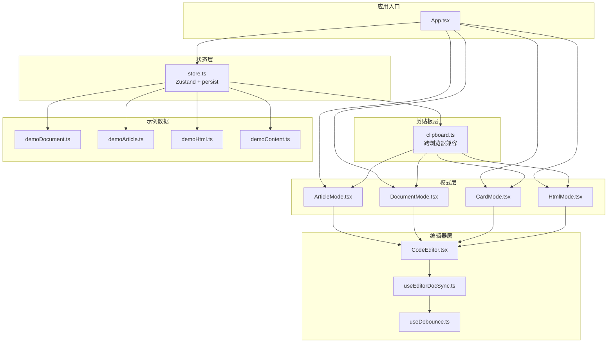
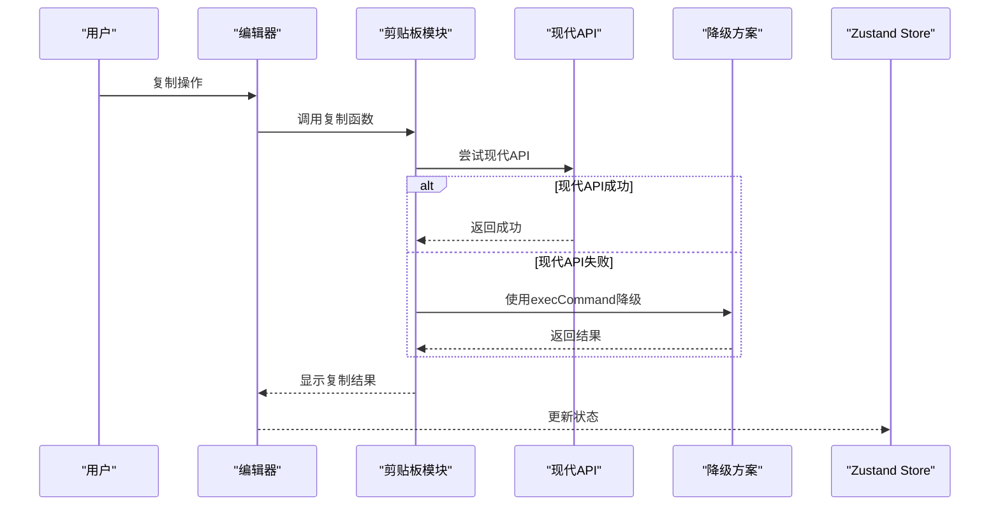
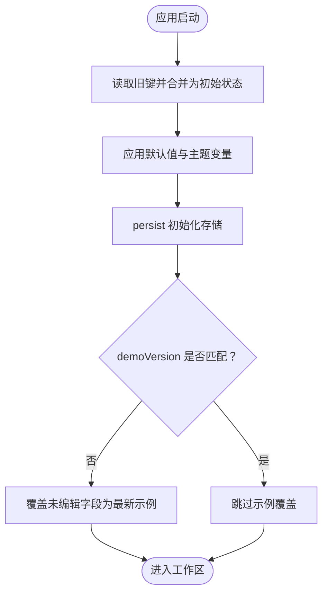
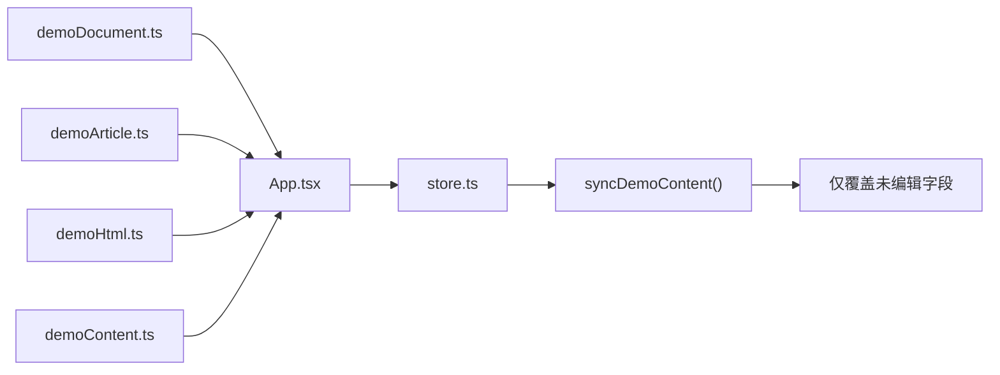
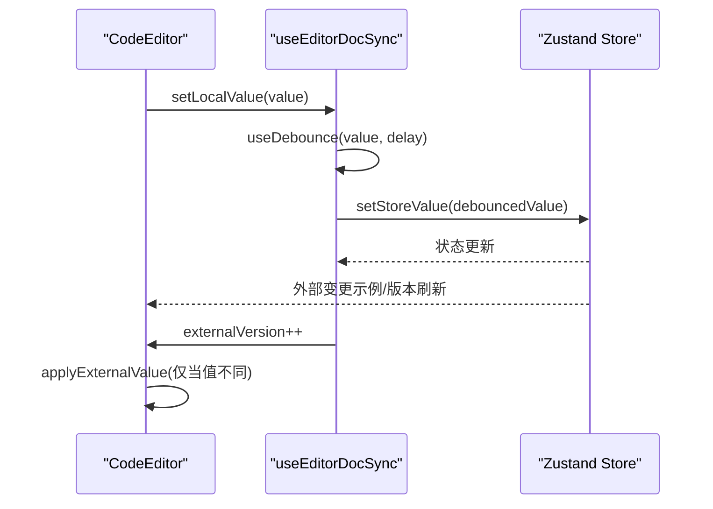
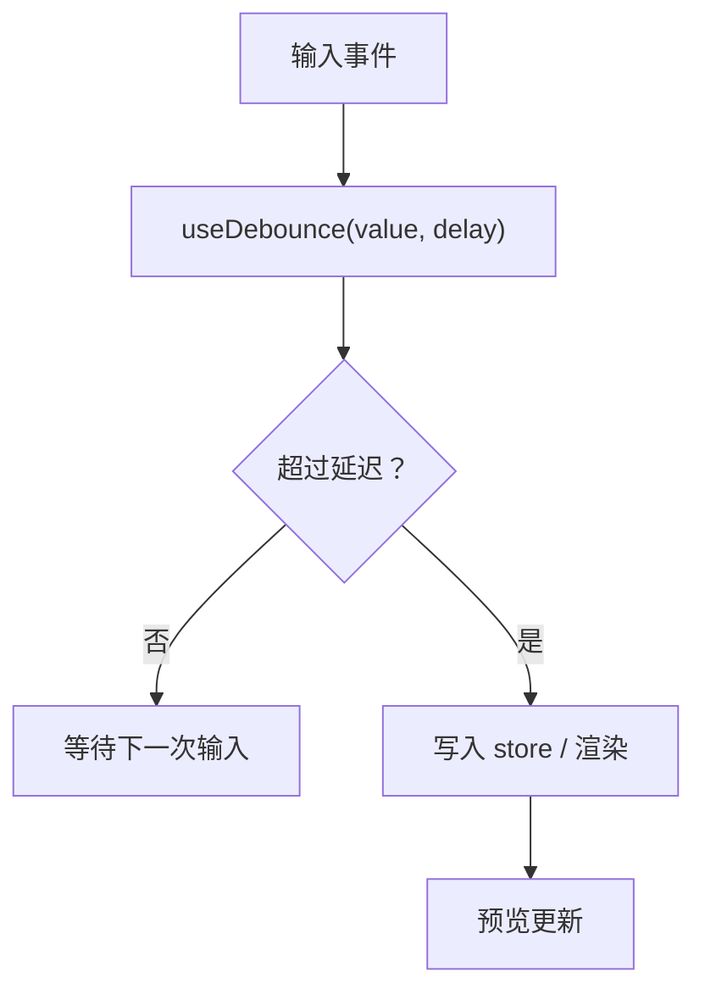
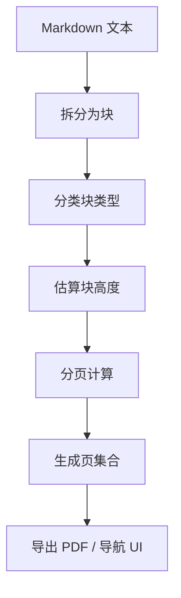
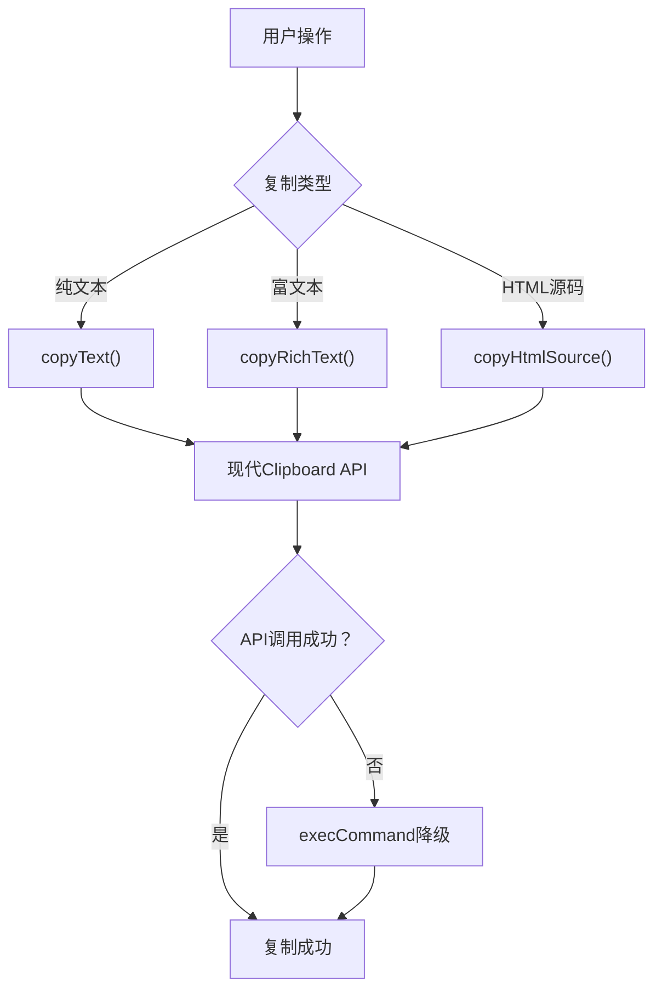
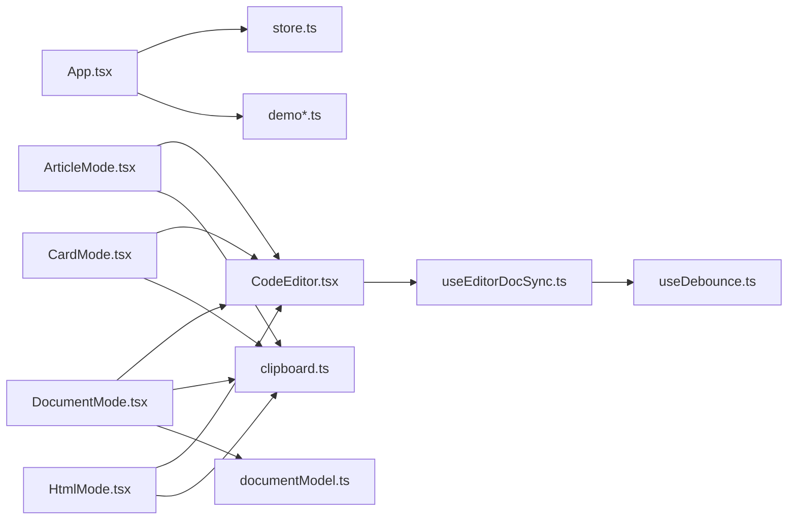

# 数据管理

<cite>
**本文引用的文件**
- [src/lib/store.ts](file://src/lib/store.ts)
- [src/App.tsx](file://src/App.tsx)
- [src/lib/useEditorDocSync.ts](file://src/lib/useEditorDocSync.ts)
- [src/lib/useDebounce.ts](file://src/lib/useDebounce.ts)
- [src/components/editor/CodeEditor.tsx](file://src/components/editor/CodeEditor.tsx)
- [src/modes/article/ArticleMode.tsx](file://src/modes/article/ArticleMode.tsx)
- [src/modes/document/DocumentMode.tsx](file://src/modes/document/DocumentMode.tsx)
- [src/modes/document/documentModel.ts](file://src/modes/document/documentModel.ts)
- [src/data/demoContent.ts](file://src/data/demoContent.ts)
- [src/data/demoDocument.ts](file://src/data/demoDocument.ts)
- [src/data/demoArticle.ts](file://src/data/demoArticle.ts)
- [src/data/demoHtml.ts](file://src/data/demoHtml.ts)
- [src/lib/clipboard.ts](file://src/lib/clipboard.ts)
- [src/modes/article/ArticlePreview.tsx](file://src/modes/article/ArticlePreview.tsx)
- [src/modes/card/CardMode.tsx](file://src/modes/card/CardMode.tsx)
- [src/modes/html/HtmlMode.tsx](file://src/modes/html/HtmlMode.tsx)
</cite>

## 更新摘要
**所做更改**
- 新增剪贴板功能改进章节，详细说明跨浏览器兼容性和性能优化
- 更新剪贴板API使用情况，涵盖富文本复制、HTML源码复制等功能
- 增强数据模型设计说明，包含剪贴板功能在各模式中的应用

## 目录
1. [简介](#简介)
2. [项目结构](#项目结构)
3. [核心组件](#核心组件)
4. [架构总览](#架构总览)
5. [详细组件分析](#详细组件分析)
6. [剪贴板功能改进](#剪贴板功能改进)
7. [依赖关系分析](#依赖关系分析)
8. [性能考量](#性能考量)
9. [故障排查指南](#故障排查指南)
10. [结论](#结论)
11. [附录](#附录)

## 简介
本文件聚焦于 MarkFlow 的数据管理系统，系统基于 Zustand 实现全局状态管理，结合持久化中间件、版本化的示例内容同步、编辑器与预览的实时同步以及防抖优化，形成一套高效、可靠且可扩展的数据层。本文将深入解析以下要点：
- Zustand 在状态持久化、状态同步与性能优化中的应用
- 示例数据系统（demoContent、demoDocument 等）的设计目的与使用场景
- 编辑器内容与预览状态之间的实时同步机制
- 防抖机制的实现原理与性能优化效果
- 剪贴板功能的跨浏览器兼容性与性能优化
- 数据模型设计说明（状态结构、数据流转）
- 数据备份、恢复与迁移的最佳实践

## 项目结构
围绕数据管理的关键目录与文件：
- 状态与持久化：src/lib/store.ts
- 剪贴板功能：src/lib/clipboard.ts
- 示例内容：src/data/demo*.ts
- 编辑器与同步：src/components/editor/CodeEditor.tsx、src/lib/useEditorDocSync.ts、src/lib/useDebounce.ts
- 模式集成：src/modes/article/ArticleMode.tsx、src/modes/document/DocumentMode.tsx
- 应用入口：src/App.tsx
- 文档模式数据模型：src/modes/document/documentModel.ts

**图表来源**
- [src/App.tsx:35-171](file://src/App.tsx#L35-L171)
- [src/lib/store.ts:163-241](file://src/lib/store.ts#L163-L241)
- [src/lib/clipboard.ts:13-120](file://src/lib/clipboard.ts#L13-L120)
- [src/lib/useEditorDocSync.ts:20-49](file://src/lib/useEditorDocSync.ts#L20-L49)
- [src/lib/useDebounce.ts:3-17](file://src/lib/useDebounce.ts#L3-L17)
- [src/components/editor/CodeEditor.tsx:53-244](file://src/components/editor/CodeEditor.tsx#L53-L244)
- [src/modes/article/ArticleMode.tsx:16-54](file://src/modes/article/ArticleMode.tsx#L16-L54)
- [src/modes/document/DocumentMode.tsx:34-200](file://src/modes/document/DocumentMode.tsx#L34-L200)
- [src/modes/card/CardMode.tsx:230-378](file://src/modes/card/CardMode.tsx#L230-L378)
- [src/modes/html/HtmlMode.tsx:430-562](file://src/modes/html/HtmlMode.tsx#L430-L562)
- [src/data/demoDocument.ts:1-146](file://src/data/demoDocument.ts#L1-L146)
- [src/data/demoArticle.ts:1-141](file://src/data/demoArticle.ts#L1-L141)
- [src/data/demoHtml.ts:1-800](file://src/data/demoHtml.ts#L1-L800)
- [src/data/demoContent.ts:1-2](file://src/data/demoContent.ts#L1-L2)

**章节来源**
- [src/App.tsx:26-32](file://src/App.tsx#L26-L32)
- [src/lib/store.ts:14-31](file://src/lib/store.ts#L14-L31)
- [src/lib/clipboard.ts:13-120](file://src/lib/clipboard.ts#L13-L120)

## 核心组件
- 全局状态存储（Zustand + persist）
  - 提供多模式内容（文章、文档、卡片、HTML）、渲染模式、输入类型、平台预设、文档设置、字体、主题、图床配置等状态
  - 通过持久化中间件将状态保存至 localStorage，并在应用启动时进行兼容性迁移
- 剪贴板功能（跨浏览器兼容）
  - 提供纯文本复制、富文本复制、HTML源码复制三种方式
  - 采用现代Clipboard API + execCommand降级方案，确保跨浏览器兼容性
  - 自动处理本地图片资源转换为base64，保证复制内容的完整性
- 示例内容系统
  - 通过版本号控制示例内容的增量更新，仅在用户未编辑过相应字段时进行覆盖
  - 提供"恢复示例"能力，强制写入最新示例并清除脏标记
- 编辑器与预览同步
  - 使用自定义 Hook 实现 store ↔ 编辑器的双向同步，避免回声与丢字
  - 通过防抖降低写入频率，提升性能与用户体验
- 数据模型与渲染
  - 文档模式使用文档模型对 Markdown 进行分块、估高、分页，支撑 A4 文档的渲染与导出

**章节来源**
- [src/lib/store.ts:54-92](file://src/lib/store.ts#L54-L92)
- [src/lib/store.ts:194-214](file://src/lib/store.ts#L194-L214)
- [src/lib/clipboard.ts:13-120](file://src/lib/clipboard.ts#L13-L120)
- [src/lib/useEditorDocSync.ts:20-49](file://src/lib/useEditorDocSync.ts#L20-L49)
- [src/lib/useDebounce.ts:3-17](file://src/lib/useDebounce.ts#L3-L17)
- [src/modes/document/documentModel.ts:30-66](file://src/modes/document/documentModel.ts#L30-L66)

## 架构总览
Zustand 作为状态中心，负责：
- 状态初始化与持久化：从 localStorage 读取历史状态，兼容旧键并应用默认值
- 示例内容同步：根据版本号与脏标记决定是否覆盖示例内容
- 模式切换与设置：动态更新渲染模式、输入类型、平台预设与文档设置
- 主题与字体：实时应用 CSS 变量，驱动 UI 渲染

剪贴板功能通过专用模块提供：
- 现代API优先：优先使用 Clipboard API 和 ClipboardItem
- 降级兼容：自动回退到execCommand方案确保浏览器兼容性
- 图片处理：自动将本地图片资源转换为base64编码，保证复制内容完整性

编辑器与预览通过 useEditorDocSync 实现：
- 本地输入即时响应，防抖后回写 store
- 外部变更（示例恢复/版本刷新）通过 externalVersion 触发编辑器强制覆盖
- 通过 lastWrittenRef 识别回声，避免防抖旧值回灌导致丢字

**图表来源**
- [src/lib/clipboard.ts:13-120](file://src/lib/clipboard.ts#L13-L120)
- [src/modes/article/ArticlePreview.tsx:29-54](file://src/modes/article/ArticlePreview.tsx#L29-L54)

## 详细组件分析

### Zustand 全局状态管理（持久化、迁移与版本同步）
- 状态结构
  - 包含各模式的 Markdown/HTML 内容、渲染模式、输入类型、平台预设、文档设置、字体、主题、图床配置、示例版本与脏标记
- 持久化策略
  - 使用 persist 中间件将状态序列化到 localStorage，键名为 m2v-store
  - onRehydrateStorage 钩子在恢复后应用主题 CSS 变量
- 兼容性迁移
  - 从旧键（如 m2v-document-markdown、m2v-theme 等）读取历史数据，映射到新结构
  - 若检测到新存储键存在，则跳过旧键迁移
- 示例内容同步
  - DEMO_VERSION 控制示例更新节奏，仅在版本变化时覆盖未编辑字段
  - 恢复示例接口强制写入最新示例并清除对应脏标记

**图表来源**
- [src/lib/store.ts:101-156](file://src/lib/store.ts#L101-L156)
- [src/lib/store.ts:163-241](file://src/lib/store.ts#L163-L241)
- [src/lib/store.ts:194-214](file://src/lib/store.ts#L194-L214)

**章节来源**
- [src/lib/store.ts:14-31](file://src/lib/store.ts#L14-L31)
- [src/lib/store.ts:101-156](file://src/lib/store.ts#L101-L156)
- [src/lib/store.ts:194-214](file://src/lib/store.ts#L194-L214)

### 示例数据系统（demoContent、demoDocument 等）
- 设计目的
  - 为各模式提供稳定的示例内容，降低用户上手成本
  - 通过版本号与脏标记实现"增量更新"，避免覆盖用户已编辑内容
- 使用场景
  - 首次加载：若用户未编辑过某模式内容，则注入最新示例
  - 版本升级：当示例内容更新时，仅对未编辑字段进行覆盖
  - 手动恢复：用户可主动恢复当前模式的示例内容
- 关键文件
  - demoDocument.ts、demoArticle.ts、demoHtml.ts 提供各模式示例
  - demoContent.ts 将 DEMO_ARTICLE 作为 DEMO_CONTENT 的别名，便于统一引用

**图表来源**
- [src/App.tsx:26-32](file://src/App.tsx#L26-L32)
- [src/data/demoDocument.ts:1-146](file://src/data/demoDocument.ts#L1-L146)
- [src/data/demoArticle.ts:1-141](file://src/data/demoArticle.ts#L1-L141)
- [src/data/demoHtml.ts:1-800](file://src/data/demoHtml.ts#L1-L800)
- [src/data/demoContent.ts:1-2](file://src/data/demoContent.ts#L1-L2)
- [src/lib/store.ts:194-205](file://src/lib/store.ts#L194-L205)

**章节来源**
- [src/App.tsx:63-73](file://src/App.tsx#L63-L73)
- [src/lib/store.ts:194-214](file://src/lib/store.ts#L194-L214)

### 编辑器与预览实时同步机制
- 双向同步
  - localValue：编辑器本地值（每次按键更新）
  - debouncedValue：防抖后的值，用于渲染预览与回写 store
  - externalVersion：外部重置信号，递增时编辑器强制覆盖最新值
- 回声识别
  - lastWrittenRef 记录最近一次写入 store 的值，避免回声导致的丢字
- 编辑器侧处理
  - 外部变更时通过 applyExternalValue 命令式覆盖编辑器文档
  - 避免受控 value 导致的全文替换与输入法组合输入竞态

**图表来源**
- [src/lib/useEditorDocSync.ts:20-49](file://src/lib/useEditorDocSync.ts#L20-L49)
- [src/components/editor/CodeEditor.tsx:84-103](file://src/components/editor/CodeEditor.tsx#L84-L103)

**章节来源**
- [src/lib/useEditorDocSync.ts:20-49](file://src/lib/useEditorDocSync.ts#L20-L49)
- [src/components/editor/CodeEditor.tsx:84-103](file://src/components/editor/CodeEditor.tsx#L84-L103)

### 防抖机制实现与性能优化
- 实现原理
  - useDebounce 将输入值延迟到 delay 时间后写入，减少频繁写入与重渲染
- 性能收益
  - 降低 store 写入频率，避免冗余写入与误标 dirty
  - 减少渲染压力，提升交互流畅度
- 使用位置
  - 编辑器与预览同步中，debouncedValue 作为渲染与回写的依据

**图表来源**
- [src/lib/useDebounce.ts:3-17](file://src/lib/useDebounce.ts#L3-L17)
- [src/lib/useEditorDocSync.ts:38-46](file://src/lib/useEditorDocSync.ts#L38-L46)

**章节来源**
- [src/lib/useDebounce.ts:3-17](file://src/lib/useDebounce.ts#L3-L17)
- [src/lib/useEditorDocSync.ts:38-46](file://src/lib/useEditorDocSync.ts#L38-L46)

### 数据模型设计（文档模式）
- 文档块与分页
  - 将 Markdown 拆分为多种块类型（标题、段落、图片、表格、代码、引用、列表、组件、分隔线、分页符）
  - 估算块高度并进行分页，避免标题、表格、代码块等在页面边缘断开
- 设置与导出
  - 支持页边距、页眉页脚、字体族与字号缩放等文档级设置
  - 生成 PDF 文件名，支持导出 PDF

**图表来源**
- [src/modes/document/documentModel.ts:185-255](file://src/modes/document/documentModel.ts#L185-L255)
- [src/modes/document/documentModel.ts:265-317](file://src/modes/document/documentModel.ts#L265-L317)

**章节来源**
- [src/modes/document/documentModel.ts:30-66](file://src/modes/document/documentModel.ts#L30-L66)
- [src/modes/document/documentModel.ts:185-255](file://src/modes/document/documentModel.ts#L185-L255)
- [src/modes/document/documentModel.ts:265-317](file://src/modes/document/documentModel.ts#L265-L317)

## 剪贴板功能改进

### 跨浏览器兼容性增强
- 现代API优先策略
  - 首选使用 Clipboard API 和 ClipboardItem 进行富文本复制
  - 自动检测浏览器支持情况，智能选择最优方案
- execCommand 降级方案
  - 当现代API不可用时，自动回退到传统的execCommand方案
  - 确保在所有主流浏览器中都能正常工作
- Safari特殊处理
  - 针对Safari浏览器的特定兼容性问题提供专门处理

### 复制富文本的性能优化
- 图片资源自动转换
  - 编译Element中的所有blob:或img://占位符URL为base64
  - 避免复制后图片无法显示的问题
- 内联样式保留
  - 复制富文本时保留完整的内联样式信息
  - 确保粘贴到目标应用时保持原有格式
- 多格式支持
  - 同时提供text/html和text/plain两种格式
  - 提升在不同应用场景下的兼容性

### 剪贴板API使用情况
- 文章模式
  - 支持复制标题、摘要、AI指令和HTML源码
  - 提供富文本复制功能，可直接粘贴到长图文编辑器
- 文档模式
  - 支持复制AI指令，辅助A4文档生成
- 卡片模式
  - 支持复制发布文案和AI指令
- HTML模式
  - 支持复制设计指令，辅助HTML内容创作

**图表来源**
- [src/lib/clipboard.ts:13-120](file://src/lib/clipboard.ts#L13-L120)
- [src/modes/article/ArticlePreview.tsx:29-54](file://src/modes/article/ArticlePreview.tsx#L29-L54)
- [src/modes/document/DocumentMode.tsx:159-162](file://src/modes/document/DocumentMode.tsx#L159-L162)
- [src/modes/card/CardMode.tsx:238-246](file://src/modes/card/CardMode.tsx#L238-L246)
- [src/modes/html/HtmlMode.tsx:440-443](file://src/modes/html/HtmlMode.tsx#L440-L443)

**章节来源**
- [src/lib/clipboard.ts:13-120](file://src/lib/clipboard.ts#L13-L120)
- [src/modes/article/ArticlePreview.tsx:29-54](file://src/modes/article/ArticlePreview.tsx#L29-L54)
- [src/modes/document/DocumentMode.tsx:159-162](file://src/modes/document/DocumentMode.tsx#L159-L162)
- [src/modes/card/CardMode.tsx:238-246](file://src/modes/card/CardMode.tsx#L238-L246)
- [src/modes/html/HtmlMode.tsx:440-443](file://src/modes/html/HtmlMode.tsx#L440-L443)

## 依赖关系分析
- 应用入口依赖状态与示例内容，负责在挂载时触发示例同步
- 模式组件依赖编辑器与同步 Hook，实现编辑器与预览的实时联动
- 剪贴板模块被各模式组件广泛使用，提供统一的复制功能
- 编辑器依赖同步 Hook 与防抖 Hook，保障输入与覆盖的安全性
- 文档模式依赖数据模型，进行分块、估高与分页

**图表来源**
- [src/App.tsx:35-171](file://src/App.tsx#L35-L171)
- [src/lib/store.ts:163-241](file://src/lib/store.ts#L163-L241)
- [src/modes/article/ArticleMode.tsx:16-54](file://src/modes/article/ArticleMode.tsx#L16-L54)
- [src/modes/document/DocumentMode.tsx:34-200](file://src/modes/document/DocumentMode.tsx#L34-L200)
- [src/modes/card/CardMode.tsx:230-378](file://src/modes/card/CardMode.tsx#L230-L378)
- [src/modes/html/HtmlMode.tsx:430-562](file://src/modes/html/HtmlMode.tsx#L430-L562)
- [src/components/editor/CodeEditor.tsx:53-244](file://src/components/editor/CodeEditor.tsx#L53-L244)
- [src/lib/useEditorDocSync.ts:20-49](file://src/lib/useEditorDocSync.ts#L20-L49)
- [src/lib/useDebounce.ts:3-17](file://src/lib/useDebounce.ts#L3-L17)
- [src/modes/document/documentModel.ts:30-66](file://src/modes/document/documentModel.ts#L30-L66)
- [src/lib/clipboard.ts:13-120](file://src/lib/clipboard.ts#L13-L120)

**章节来源**
- [src/App.tsx:26-32](file://src/App.tsx#L26-L32)
- [src/modes/article/ArticleMode.tsx:16-54](file://src/modes/article/ArticleMode.tsx#L16-L54)
- [src/modes/document/DocumentMode.tsx:34-200](file://src/modes/document/DocumentMode.tsx#L34-L200)
- [src/modes/card/CardMode.tsx:230-378](file://src/modes/card/CardMode.tsx#L230-L378)
- [src/modes/html/HtmlMode.tsx:430-562](file://src/modes/html/HtmlMode.tsx#L430-L562)

## 性能考量
- 防抖与最小写入
  - 通过 useDebounce 降低写入频率，避免冗余渲染与状态抖动
- 回声识别
  - 使用 lastWrittenRef 避免回写回声导致的丢字与重复写入
- 受控与非受控混合
  - 编辑器采用"挂载时受控、之后非受控"的策略，避免受控 value 导致的全文替换与输入法竞态
- 模块级预加载
  - 代码语言数据在编辑器挂载前完成预加载，减少运行时异步加载带来的重新配置与输入丢失
- 文档模式测量优化
  - 使用 ResizeObserver 与懒加载监听，仅在必要时重新测量块高度，减少不必要的重排
- 剪贴板性能优化
  - 图片资源转换采用异步处理，避免阻塞主线程
  - Clipboard API优先使用，性能优于传统方案

## 故障排查指南
- 示例内容未更新
  - 检查 DEMO_VERSION 是否已 +1，确认 syncDemoContent 是否在挂载时被调用
  - 确认对应模式的脏标记是否为 true（用户已编辑过）
- 恢复示例无效
  - 确认 restoreDemo 调用的 mode 参数与当前模式一致
  - 检查 externalVersion 是否递增，确保编辑器收到外部重置信号
- 编辑器出现丢字或回灌
  - 检查 lastWrittenRef 是否正确更新
  - 确保 applyExternalValue 仅在值不相等时执行
- 主题或字体不生效
  - 确认 onRehydrateStorage 钩子已执行，CSS 变量已应用
  - 检查 localStorage 中的主题键是否存在且格式正确
- 剪贴板功能异常
  - 检查浏览器是否支持Clipboard API
  - 确认图片资源是否正确转换为base64
  - 验证execCommand降级方案是否正常工作

**章节来源**
- [src/lib/store.ts:194-214](file://src/lib/store.ts#L194-L214)
- [src/lib/useEditorDocSync.ts:30-46](file://src/lib/useEditorDocSync.ts#L30-L46)
- [src/components/editor/CodeEditor.tsx:84-103](file://src/components/editor/CodeEditor.tsx#L84-L103)
- [src/lib/clipboard.ts:13-120](file://src/lib/clipboard.ts#L13-L120)

## 结论
本数据管理系统以 Zustand 为核心，结合持久化、版本化示例同步与双向编辑器同步，实现了高性能、低耦合、易扩展的状态管理方案。通过防抖与回声识别等机制，有效提升了用户体验与系统稳定性。剪贴板功能的跨浏览器兼容性改进进一步增强了系统的实用性，通过现代API优先和降级兼容策略确保在各种环境下都能正常工作。文档模式的数据模型进一步增强了 A4 文档的渲染与导出能力。整体架构清晰、职责明确，具备良好的可维护性与可演进性。

## 附录
- 备份与恢复最佳实践
  - 定期导出 localStorage 中的 m2v-store 键值，作为状态快照
  - 迁移时优先使用 persist 的 onRehydrateStorage 钩子进行主题与变量恢复
  - 对于示例内容，通过 DEMO_VERSION 与脏标记实现可控覆盖，避免误删用户内容
- 迁移指南
  - 旧键迁移：在 getInitialStateFromLegacyKeys 中读取旧键并映射到新结构
  - 新旧存储共存：若检测到新存储键存在，跳过旧键迁移逻辑
  - 版本升级：更新 DEMO_VERSION 后，仅对未编辑字段进行覆盖
- 剪贴板功能使用建议
  - 优先使用富文本复制以保留格式信息
  - 处理大量图片时注意性能影响，考虑分批处理
  - 在生产环境中监控剪贴板API的兼容性表现

**章节来源**
- [src/lib/store.ts:101-156](file://src/lib/store.ts#L101-L156)
- [src/lib/store.ts:194-214](file://src/lib/store.ts#L194-L214)
- [src/lib/clipboard.ts:13-120](file://src/lib/clipboard.ts#L13-L120)