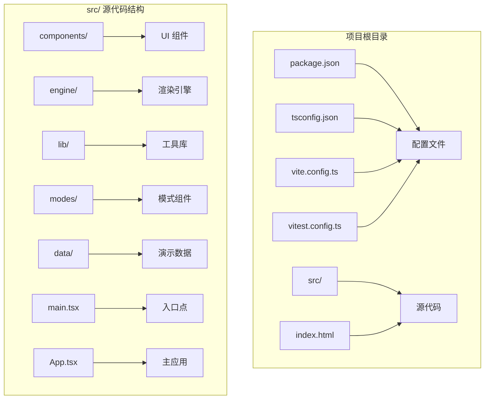
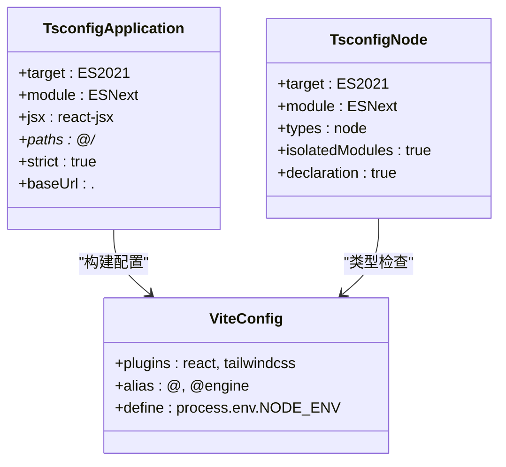
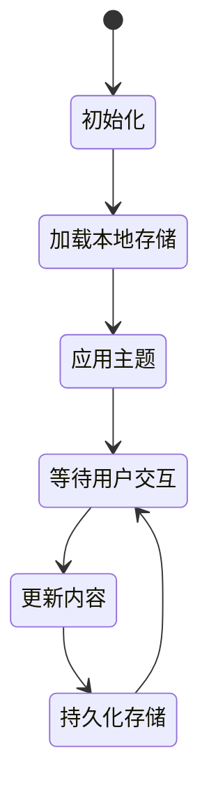
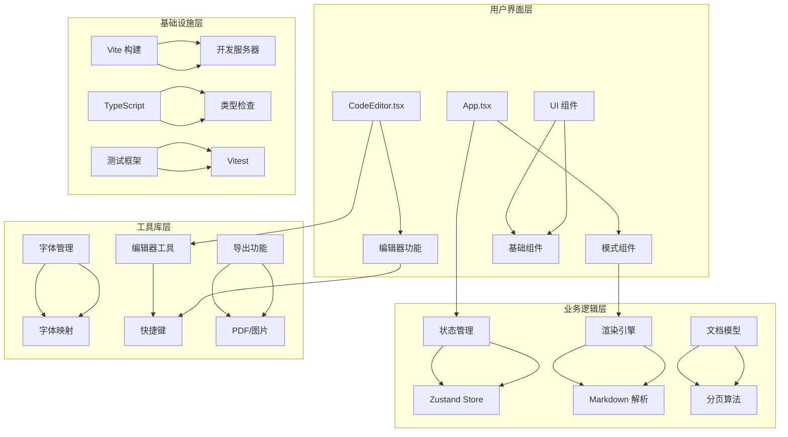
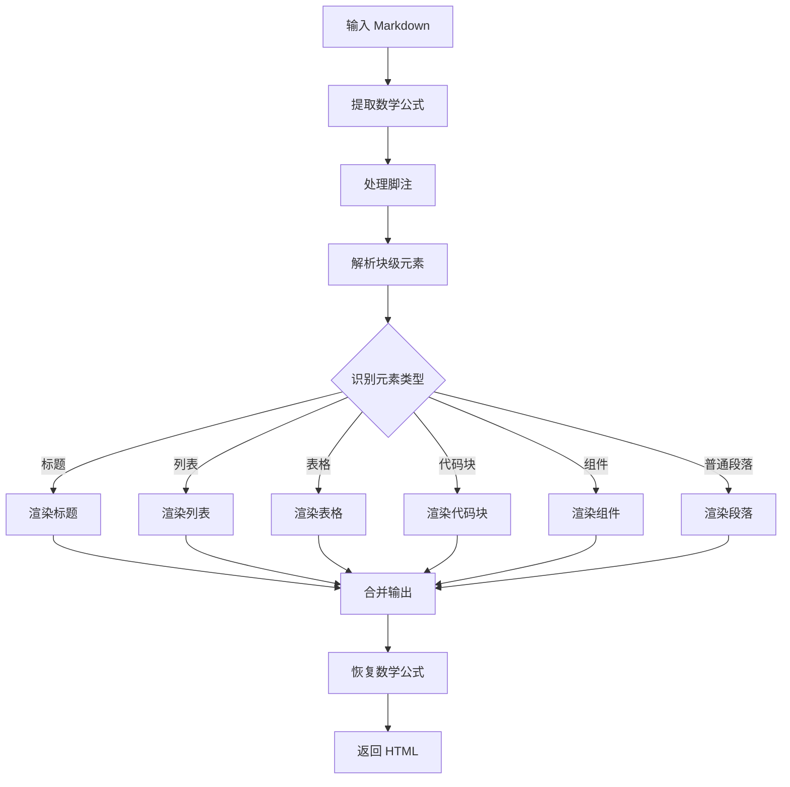
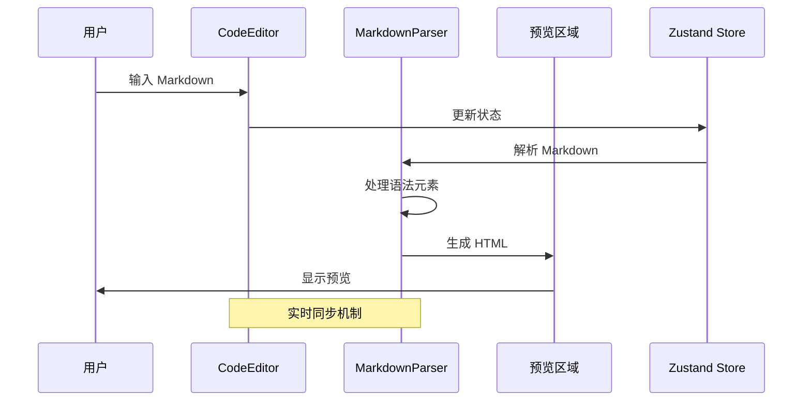
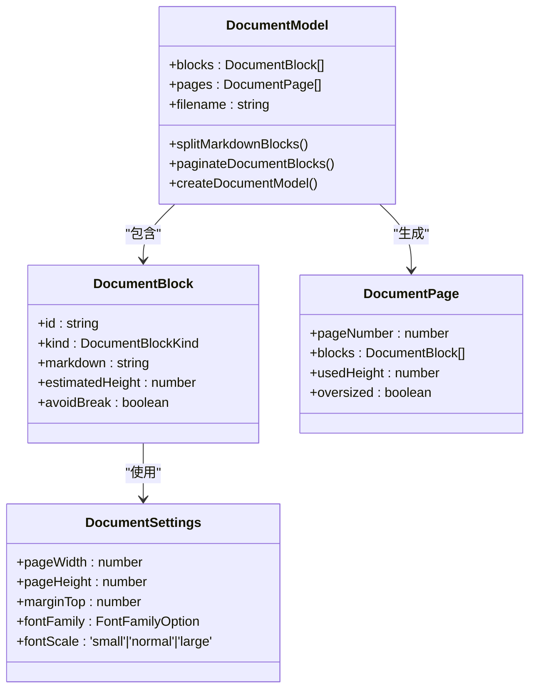

# TypeScript Node 配置

<cite>
**本文档引用的文件**
- [package.json](file://package.json)
- [tsconfig.json](file://tsconfig.json)
- [tsconfig.node.json](file://tsconfig.node.json)
- [vite.config.ts](file://vite.config.ts)
- [vitest.config.ts](file://vitest.config.ts)
- [index.html](file://index.html)
- [src/main.tsx](file://src/main.tsx)
- [src/App.tsx](file://src/App.tsx)
- [src/engine/index.ts](file://src/engine/index.ts)
- [src/lib/store.ts](file://src/lib/store.ts)
- [src/engine/utils/markdownParser.ts](file://src/engine/utils/markdownParser.ts)
- [src/components/editor/CodeEditor.tsx](file://src/components/editor/CodeEditor.tsx)
- [src/modes/article/ArticleMode.tsx](file://src/modes/article/ArticleMode.tsx)
- [src/modes/document/documentModel.ts](file://src/modes/document/documentModel.ts)
- [src/lib/fonts.ts](file://src/lib/fonts.ts)
</cite>

## 目录
1. [简介](#简介)
2. [项目结构](#项目结构)
3. [核心组件](#核心组件)
4. [架构概览](#架构概览)
5. [详细组件分析](#详细组件分析)
6. [依赖关系分析](#依赖关系分析)
7. [性能考虑](#性能考虑)
8. [故障排除指南](#故障排除指南)
9. [结论](#结论)

## 简介

这是一个基于 TypeScript 和 React 的 Markdown 多场景渲染工作台项目。项目采用现代化的前端技术栈，包括 Vite 构建工具、React 18、TypeScript 5.x，并集成了多种编辑器和渲染功能，支持文章、文档、卡片等多种格式的实时预览和导出。

## 项目结构

项目采用模块化的组织方式，主要分为以下几个核心目录：



**图表来源**
- [package.json:1-53](file://package.json#L1-L53)
- [tsconfig.json:1-29](file://tsconfig.json#L1-L29)
- [vite.config.ts:1-17](file://vite.config.ts#L1-L17)

**章节来源**
- [package.json:1-53](file://package.json#L1-L53)
- [tsconfig.json:1-29](file://tsconfig.json#L1-L29)
- [vite.config.ts:1-17](file://vite.config.ts#L1-L17)

## 核心组件

### TypeScript 配置系统

项目使用双 tsconfig 配置策略，分别处理应用代码和 Node 环境：



**图表来源**
- [tsconfig.json:1-29](file://tsconfig.json#L1-L29)
- [tsconfig.node.json:1-15](file://tsconfig.node.json#L1-L15)
- [vite.config.ts:1-17](file://vite.config.ts#L1-L17)

### 应用状态管理系统

使用 Zustand 实现的状态管理，支持持久化存储和主题切换：



**图表来源**
- [src/lib/store.ts:163-242](file://src/lib/store.ts#L163-L242)

**章节来源**
- [src/lib/store.ts:1-242](file://src/lib/store.ts#L1-242)

## 架构概览

项目采用分层架构设计，从底层的渲染引擎到上层的应用界面：



**图表来源**
- [src/App.tsx:1-172](file://src/App.tsx#L1-L172)
- [src/engine/index.ts:1-16](file://src/engine/index.ts#L1-L16)
- [src/lib/store.ts:1-242](file://src/lib/store.ts#L1-L242)

## 详细组件分析

### 渲染引擎核心

渲染引擎是项目的核心，负责将 Markdown 转换为 HTML：



**图表来源**
- [src/engine/utils/markdownParser.ts:110-605](file://src/engine/utils/markdownParser.ts#L110-L605)

#### Markdown 解析流程

渲染引擎实现了完整的 Markdown 解析流程，支持多种扩展语法：

**章节来源**
- [src/engine/utils/markdownParser.ts:1-605](file://src/engine/utils/markdownParser.ts#L1-L605)

### 编辑器组件

CodeEditor 组件提供了丰富的编辑功能：



**图表来源**
- [src/components/editor/CodeEditor.tsx:1-213](file://src/components/editor/CodeEditor.tsx#L1-L213)
- [src/modes/article/ArticleMode.tsx:1-55](file://src/modes/article/ArticleMode.tsx#L1-L55)

**章节来源**
- [src/components/editor/CodeEditor.tsx:1-213](file://src/components/editor/CodeEditor.tsx#L1-L213)

### 文档模式系统

文档模式支持复杂的分页和布局功能：



**图表来源**
- [src/modes/document/documentModel.ts:1-328](file://src/modes/document/documentModel.ts#L1-L328)

**章节来源**
- [src/modes/document/documentModel.ts:1-328](file://src/modes/document/documentModel.ts#L1-L328)

## 依赖关系分析

项目使用现代的依赖管理策略：

```mermaid
graph LR
subgraph "运行时依赖"
A[react] --> B[React 核心]
C[react-dom] --> D[DOM 操作]
E[zustand] --> F[状态管理]
G[highlight.js] --> H[代码高亮]
I[katex] --> J[数学公式]
end
subgraph "开发依赖"
K[vite] --> L[构建工具]
M[typescript] --> N[类型系统]
O[@vitejs/plugin-react] --> P[React 支持]
Q[tailwindcss] --> R[CSS 框架]
S[vitest] --> T[测试框架]
end
subgraph "编辑器相关"
U[@uiw/react-codemirror] --> V[代码编辑器]
W[codemirror] --> X[编辑器核心]
Y[fflate] --> Z[压缩工具]
end
```

**图表来源**
- [package.json:13-31](file://package.json#L13-L31)
- [package.json:32-43](file://package.json#L32-L43)

**章节来源**
- [package.json:1-53](file://package.json#L1-L53)

## 性能考虑

### 构建优化

项目采用了多项性能优化策略：

1. **模块解析优化**: 使用 bundler 模式提高模块解析效率
2. **增量编译**: TypeScript 配置支持增量编译
3. **按需加载**: React.lazy 实现组件懒加载
4. **代码分割**: Vite 自动生成代码分割

### 运行时优化

1. **状态管理优化**: Zustand 提供轻量级状态管理
2. **渲染优化**: React.memo 和 useMemo 优化渲染
3. **内存管理**: 合理的组件卸载和清理
4. **网络优化**: 图片预加载和懒加载

## 故障排除指南

### 常见问题及解决方案

#### TypeScript 类型错误

**问题**: 编译时出现类型错误
**解决方案**: 
1. 检查 tsconfig.json 配置
2. 确保所有依赖都有对应的类型定义
3. 使用 `// @ts-ignore` 临时解决特定问题

#### Vite 构建问题

**问题**: 开发服务器启动失败
**解决方案**:
1. 检查端口占用情况
2. 清理 node_modules 和重新安装依赖
3. 检查防火墙设置

#### React 组件问题

**问题**: 组件渲染异常
**解决方案**:
1. 检查 props 传递
2. 确认状态更新时机
3. 使用 React DevTools 调试

**章节来源**
- [src/lib/store.ts:101-156](file://src/lib/store.ts#L101-L156)

## 结论

该项目展示了现代 TypeScript React 应用的最佳实践，具有以下特点：

1. **架构清晰**: 分层设计，职责分离明确
2. **性能优秀**: 多项优化策略确保良好的用户体验
3. **可扩展性强**: 模块化设计便于功能扩展
4. **开发体验好**: 完善的开发工具链和类型系统

项目为 Markdown 多场景渲染提供了一个完整的技术解决方案，适合学习和实际项目使用。