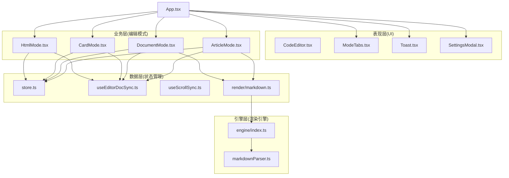
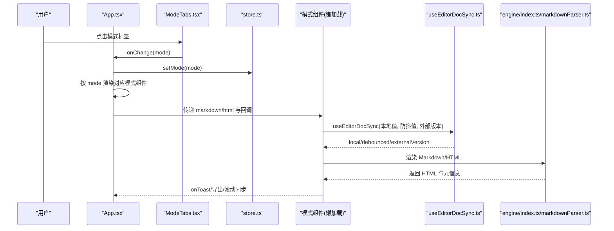
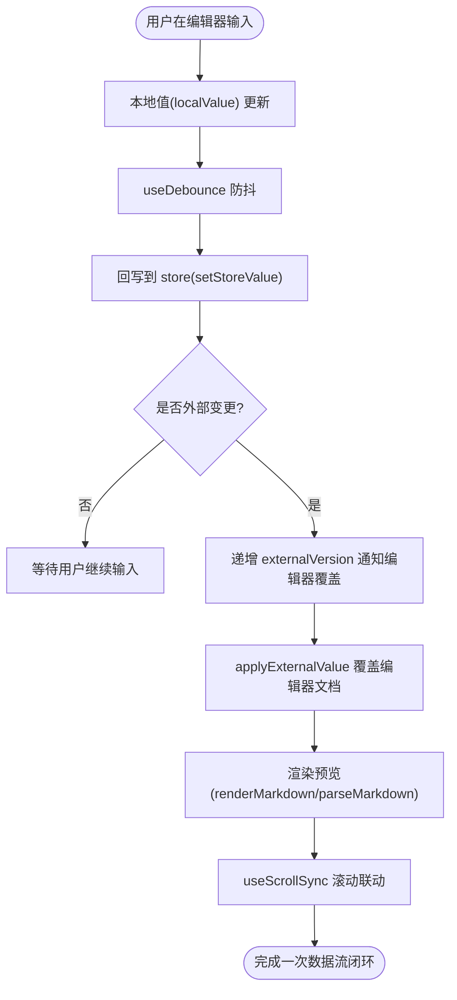
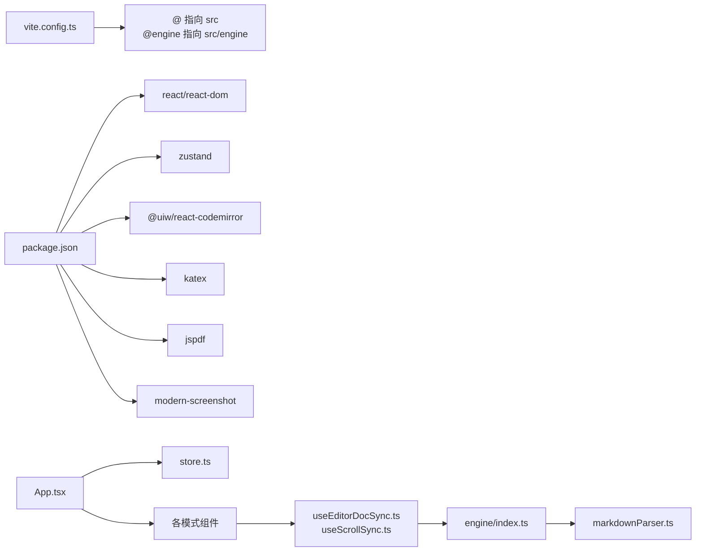

# 整体架构

<cite>
**本文引用的文件**
- [App.tsx](file://src/App.tsx)
- [main.tsx](file://src/main.tsx)
- [ModeTabs.tsx](file://src/components/layout/ModeTabs.tsx)
- [store.ts](file://src/lib/store.ts)
- [useEditorDocSync.ts](file://src/lib/useEditorDocSync.ts)
- [useScrollSync.ts](file://src/lib/useScrollSync.ts)
- [markdown.ts](file://src/lib/render/markdown.ts)
- [markdownParser.ts](file://src/engine/utils/markdownParser.ts)
- [engine/index.ts](file://src/engine/index.ts)
- [ArticleMode.tsx](file://src/modes/article/ArticleMode.tsx)
- [DocumentMode.tsx](file://src/modes/document/DocumentMode.tsx)
- [CardMode.tsx](file://src/modes/card/CardMode.tsx)
- [HtmlMode.tsx](file://src/modes/html(HtmlMode.tsx)
- [documentModel.ts](file://src/modes/document/documentModel.ts)
- [cardModel.ts](file://src/modes/card/cardModel.ts)
- [CodeEditor.tsx](file://src/components/editor/CodeEditor.tsx)
- [vite.config.ts](file://vite.config.ts)
- [package.json](file://package.json)
</cite>

## 目录
1. [简介](#简介)
2. [项目结构](#项目结构)
3. [核心组件](#核心组件)
4. [架构总览](#架构总览)
5. [详细组件分析](#详细组件分析)
6. [依赖关系分析](#依赖关系分析)
7. [性能考量](#性能考量)
8. [故障排查指南](#故障排查指南)
9. [结论](#结论)

## 简介
本项目以 React 18 为基础，构建了一个多模式可视化编辑工作台，支持四种渲染模式：长图文、A4 文档、分页图文（小红书风格）、自由画布（HTML 可视化）。系统采用分层架构设计，将表现层（UI 组件）、业务层（编辑模式）、引擎层（渲染引擎）与数据层（状态管理）清晰分离，并通过懒加载与防抖同步机制实现高性能与良好的用户体验。

## 项目结构
- 表现层（UI 组件）：位于 src/components，包含通用 UI 组件与布局组件（如按钮、输入、下拉、工具提示、编辑器、预览沙箱等）。
- 业务层（编辑模式）：位于 src/modes，包含各模式的入口组件（ArticleMode、DocumentMode、CardMode、HtmlMode），负责模式内的编辑、预览、导出与交互。
- 引擎层（渲染引擎）：位于 src/engine，提供与框架无关的 Markdown 解析、主题与颜色、组件渲染等能力，统一对外暴露。
- 数据层（状态管理）：位于 src/lib，使用 Zustand 管理全局状态（含持久化），并提供编辑器与文档的双向同步、滚动同步等通用 Hook。
- 入口与构建：src/main.tsx 为应用入口；vite.config.ts 提供别名与插件配置；package.json 定义依赖与脚本。

图表来源
- [App.tsx:35-171](file://src/App.tsx#L35-L171)
- [store.ts:54-92](file://src/lib/store.ts#L54-L92)
- [useEditorDocSync.ts:20-49](file://src/lib/useEditorDocSync.ts#L20-L49)
- [useScrollSync.ts:7-66](file://src/lib/useScrollSync.ts#L7-L66)
- [markdown.ts:9-15](file://src/lib/render/markdown.ts#L9-L15)
- [engine/index.ts:1-16](file://src/engine/index.ts#L1-L16)
- [markdownParser.ts:110-200](file://src/engine/utils/markdownParser.ts#L110-L200)
- [ArticleMode.tsx:16-54](file://src/modes/article/ArticleMode.tsx#L16-L54)
- [DocumentMode.tsx:34-61](file://src/modes/document/DocumentMode.tsx#L34-L61)
- [CardMode.tsx:44-83](file://src/modes/card/CardMode.tsx#L44-L83)
- [HtmlMode.tsx:92-110](file://src/modes/html/HtmlMode.tsx#L92-L110)

章节来源
- [main.tsx:1-12](file://src/main.tsx#L1-L12)
- [vite.config.ts:1-17](file://vite.config.ts#L1-L17)
- [package.json:1-52](file://package.json#L1-L52)

## 核心组件
- App.tsx：根组件，负责模式选择、懒加载模式组件、全局状态接入、主题与设置弹窗、示例恢复与 Toast 反馈。
- ModeTabs.tsx：顶部模式切换标签，驱动 App 的模式状态。
- store.ts：Zustand 状态存储，集中管理各模式内容、主题、平台、字体、文档设置、图像主机配置与持久化。
- useEditorDocSync.ts：编辑器与状态的双向同步钩子，防抖回写、外部变更信号、避免回声覆盖。
- useScrollSync.ts：左右编辑/预览面板的滚动联动，主导方策略避免相互拉扯。
- render/markdown.ts：将 Markdown 渲染为 HTML 并提取元信息，供文章与文档模式使用。
- engine/index.ts 与 markdownParser.ts：渲染引擎统一出口与解析实现，处理 front-matter、组件块、内联格式、数学公式等。
- 各模式组件：ArticleMode、DocumentMode、CardMode、HtmlMode 分别承载不同场景下的编辑、预览、导出与交互。

章节来源
- [App.tsx:35-171](file://src/App.tsx#L35-L171)
- [ModeTabs.tsx:15-41](file://src/components/layout/ModeTabs.tsx#L15-L41)
- [store.ts:54-92](file://src/lib/store.ts#L54-L92)
- [useEditorDocSync.ts:20-49](file://src/lib/useEditorDocSync.ts#L20-L49)
- [useScrollSync.ts:7-66](file://src/lib/useScrollSync.ts#L7-L66)
- [markdown.ts:9-15](file://src/lib/render/markdown.ts#L9-L15)
- [engine/index.ts:1-16](file://src/engine/index.ts#L1-L16)
- [markdownParser.ts:110-200](file://src/engine/utils/markdownParser.ts#L110-L200)

## 架构总览
系统采用“根组件协调 + 模式组件分治”的架构：
- 根组件 App 通过懒加载按需加载各模式组件，结合 Suspense 提供加载占位，降低首屏体积与加载时间。
- 模式组件各自持有编辑器与预览区域，通过 useEditorDocSync 实现与全局状态的双向同步，避免输入丢失与回写风暴。
- 渲染引擎位于引擎层，提供统一的 Markdown 解析与主题颜色能力，业务层仅关注模型与页面分页策略。
- 数据层使用 Zustand 管理全局状态与持久化，同时提供主题、字体、平台等跨模式共享配置。

图表来源
- [App.tsx:90-165](file://src/App.tsx#L90-L165)
- [ModeTabs.tsx:15-41](file://src/components/layout/ModeTabs.tsx#L15-L41)
- [store.ts:215-220](file://src/lib/store.ts#L215-L220)
- [useEditorDocSync.ts:20-49](file://src/lib/useEditorDocSync.ts#L20-L49)
- [engine/index.ts:1-16](file://src/engine/index.ts#L1-L16)
- [markdownParser.ts:110-200](file://src/engine/utils/markdownParser.ts#L110-L200)

## 详细组件分析

### 根组件 App.tsx 与模式调度
- 懒加载策略：通过 React.lazy 动态导入各模式组件，结合 Suspense fallback 提升首屏体验。
- 全局状态接入：使用 Zustand 读取/写入各模式内容、主题、平台、字体、文档设置等。
- 顶部导航：ModeTabs 切换模式；主题色切换通过引擎提供的主题常量；设置弹窗用于图床配置；恢复示例按钮用于一键恢复当前模式示例。
- 数据流闭环：编辑器通过 useEditorDocSync 与 store 双向同步，预览基于防抖后的值渲染，Toast 统一反馈。

章节来源
- [App.tsx:13-16](file://src/App.tsx#L13-L16)
- [App.tsx:35-171](file://src/App.tsx#L35-L171)
- [ModeTabs.tsx:15-41](file://src/components/layout/ModeTabs.tsx#L15-L41)
- [store.ts:54-92](file://src/lib/store.ts#L54-L92)

### 模式组件：文章模式 ArticleMode
- 结构：左右两栏，左侧 CodeEditor，右侧 ArticlePreview。
- 同步与渲染：useEditorDocSync 管理本地/防抖/外部版本；render/markdown 将 Markdown 渲染为 HTML；useScrollSync 实现编辑器与预览滚动联动。
- 交互：支持复制文案、导出图片等（由上层通过 onToast 传递反馈）。

章节来源
- [ArticleMode.tsx:16-54](file://src/modes/article/ArticleMode.tsx#L16-L54)
- [useEditorDocSync.ts:20-49](file://src/lib/useEditorDocSync.ts#L20-L49)
- [useScrollSync.ts:7-66](file://src/lib/useScrollSync.ts#L7-L66)
- [markdown.ts:9-15](file://src/lib/render/markdown.ts#L9-L15)

### 模式组件：文档模式 DocumentMode
- 结构：左右两栏，左侧 CodeEditor，右侧打印区域（document-print-area）。
- 模型与分页：documentModel 将 Markdown 切分为块、估计高度、按页面宽度与边距进行分页；支持首行缩进、标题居中、字体家族与字号等设置。
- 导出：支持导出 PDF，动态导入导出模块以减少主包体积。
- 滚动与测量：隐藏测量容器计算块高度，ResizeObserver 与图片加载监听保证测量准确性。

章节来源
- [DocumentMode.tsx:34-129](file://src/modes/document/DocumentMode.tsx#L34-L129)
- [documentModel.ts:15-66](file://src/modes/document/documentModel.ts#L15-L66)
- [useEditorDocSync.ts:20-49](file://src/lib/useEditorDocSync.ts#L20-L49)
- [useScrollSync.ts:7-66](file://src/lib/useScrollSync.ts#L7-L66)

### 模式组件：分页图文 CardMode
- 结构：左右两栏，左侧 CodeEditor，右侧卡片预览区，支持作者名、比例、字体等参数。
- 模型与分页：cardModel 将 Markdown 分块、估计内容单位、按比例预算进行分页；支持封面与内容页生成。
- 导出：支持单图下载、全部下载、ZIP 打包；复制文案与 AI 指令。
- 高度测量：隐藏测量容器与实际渲染节点高度映射，避免分页误差。

章节来源
- [CardMode.tsx:44-144](file://src/modes/card/CardMode.tsx#L44-L144)
- [cardModel.ts:163-186](file://src/modes/card/cardModel.ts#L163-L186)
- [useEditorDocSync.ts:20-49](file://src/lib/useEditorDocSync.ts#L20-L49)
- [useScrollSync.ts:7-66](file://src/lib/useScrollSync.ts#L7-L66)

### 模式组件：HTML 模式 HtmlMode
- 结构：左右两栏，左侧 CodeEditor（HTML 语言），右侧 HtmlSandbox（iframe 预览）。
- 多页检测与翻页：detectPages 自动识别 .page/.slide/.card 等分页元素；键盘与滚轮翻页；自动缩放适配窗口。
- 导出：支持 PNG 单页/当前页/全部页导出与 ZIP 打包；支持高保真 PDF 导出（动态导入）。
- 交互：支持刷新、全屏、脚本开关、指令库复制。

章节来源
- [HtmlMode.tsx:92-344](file://src/modes/html/HtmlMode.tsx#L92-L344)

### 渲染引擎与数据层
- 渲染引擎：engine/index.ts 对外统一导出 parseMarkdown、inlineFormat、math、codeBlock、组件与主题能力；markdownParser.ts 实现 front-matter、组件块、内联格式、数学公式等解析。
- 渲染封装：render/markdown.ts 调用引擎解析并提取元信息，供文章/文档模式使用。
- 状态管理：store.ts 使用 Zustand/persist 管理全局状态，包含各模式内容、主题、平台、字体、文档设置、图像主机配置与持久化；提供示例版本同步与恢复功能。

章节来源
- [engine/index.ts:1-16](file://src/engine/index.ts#L1-L16)
- [markdownParser.ts:110-200](file://src/engine/utils/markdownParser.ts#L110-L200)
- [markdown.ts:9-15](file://src/lib/render/markdown.ts#L9-L15)
- [store.ts:54-92](file://src/lib/store.ts#L54-L92)

### 组件间通信与数据流
- 父子通信：App 通过 props 将 markdown/html、颜色、设置、回调等传递给各模式组件。
- 状态订阅：各模式组件通过 store 读取/写入状态，实现跨模式共享与持久化。
- 双向同步：useEditorDocSync 在本地输入与全局状态之间建立防抖回写与外部变更信号，避免回声覆盖与重复写入。
- 滚动联动：useScrollSync 在编辑器与预览面板之间按比例联动，主导方策略避免相互拉扯。

图表来源
- [useEditorDocSync.ts:20-49](file://src/lib/useEditorDocSync.ts#L20-L49)
- [useScrollSync.ts:7-66](file://src/lib/useScrollSync.ts#L7-L66)
- [markdown.ts:9-15](file://src/lib/render/markdown.ts#L9-L15)
- [markdownParser.ts:110-200](file://src/engine/utils/markdownParser.ts#L110-L200)

## 依赖关系分析
- 构建与别名：vite.config.ts 将 @ 指向 src，@engine 指向 src/engine，便于跨层引用。
- 运行时依赖：React 18、Zustand、CodeMirror、KaTeX、jsPDF、modern-screenshot 等。
- 模块耦合：模式组件仅依赖通用 Hook 与引擎接口，耦合度低；引擎层与业务层解耦，便于扩展新组件与渲染策略。

图表来源
- [vite.config.ts:9-15](file://vite.config.ts#L9-L15)
- [package.json:13-30](file://package.json#L13-L30)
- [App.tsx:35-171](file://src/App.tsx#L35-L171)
- [store.ts:54-92](file://src/lib/store.ts#L54-L92)
- [engine/index.ts:1-16](file://src/engine/index.ts#L1-L16)
- [markdownParser.ts:110-200](file://src/engine/utils/markdownParser.ts#L110-L200)

章节来源
- [vite.config.ts:1-17](file://vite.config.ts#L1-L17)
- [package.json:1-52](file://package.json#L1-L52)

## 性能考量
- 懒加载与分割：模式组件通过 React.lazy 动态导入，结合 Suspense 提供加载占位，显著降低首屏体积与加载时间。
- 防抖与去抖：useEditorDocSync 对本地输入进行防抖回写，减少不必要的渲染与写入风暴。
- 滚动联动优化：useScrollSync 采用主导方策略与 requestAnimationFrame，避免相互拉扯与抖动。
- 渲染引擎纯函数：引擎层为框架无关的纯 TS，便于缓存与复用；渲染封装层仅做轻量组合。
- 动态导入导出：PDF、PNG、ZIP 等导出模块按需加载，避免增大主包体积。
- 编辑器优化：CodeEditor 预加载语言数据，避免运行时异步加载导致的重新配置与输入丢失。

章节来源
- [App.tsx:13-16](file://src/App.tsx#L13-L16)
- [useEditorDocSync.ts:20-49](file://src/lib/useEditorDocSync.ts#L20-L49)
- [useScrollSync.ts:7-66](file://src/lib/useScrollSync.ts#L7-L66)
- [HtmlMode.tsx:142-156](file://src/modes/html/HtmlMode.tsx#L142-L156)
- [CodeEditor.tsx:45-51](file://src/components/editor/CodeEditor.tsx#L45-L51)

## 故障排查指南
- 模式切换后内容未更新：检查 App 是否正确设置 mode；确认 useEditorDocSync 的 externalVersion 是否递增以触发编辑器覆盖。
- 预览不随输入更新：确认防抖延迟是否过长；检查 render/markdown 与引擎解析是否正常返回 HTML。
- 滚动不同步：检查 useScrollSync 的两个容器是否正确传入；确认主导方策略是否生效。
- 导出失败：检查导出模块动态导入是否成功；确认 iframe 内容是否已就绪；查看 onToast 反馈的具体错误信息。
- 主题色不生效：确认 store 的 setTheme 是否调用并应用 CSS 变量；检查引擎主题常量与颜色生成逻辑。

章节来源
- [useEditorDocSync.ts:20-49](file://src/lib/useEditorDocSync.ts#L20-L49)
- [useScrollSync.ts:7-66](file://src/lib/useScrollSync.ts#L7-L66)
- [HtmlMode.tsx:346-453](file://src/modes/html/HtmlMode.tsx#L346-L453)
- [store.ts:227-230](file://src/lib/store.ts#L227-L230)

## 结论
本项目以 React 18 为核心，通过懒加载、防抖同步与滚动联动等技术手段，在保证良好交互体验的同时实现了模块化与可扩展性。表现层、业务层、引擎层与数据层职责清晰、耦合度低，既满足多场景编辑需求，又具备良好的性能与可维护性。未来可在组件生态、导出能力与主题系统方面进一步扩展。