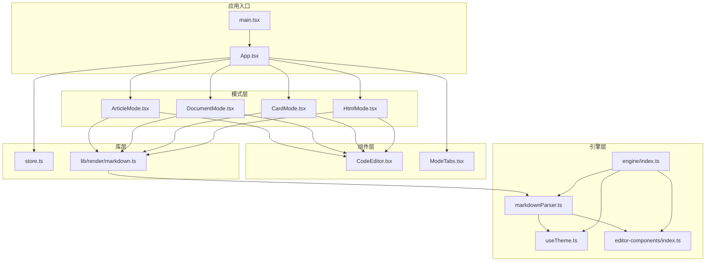
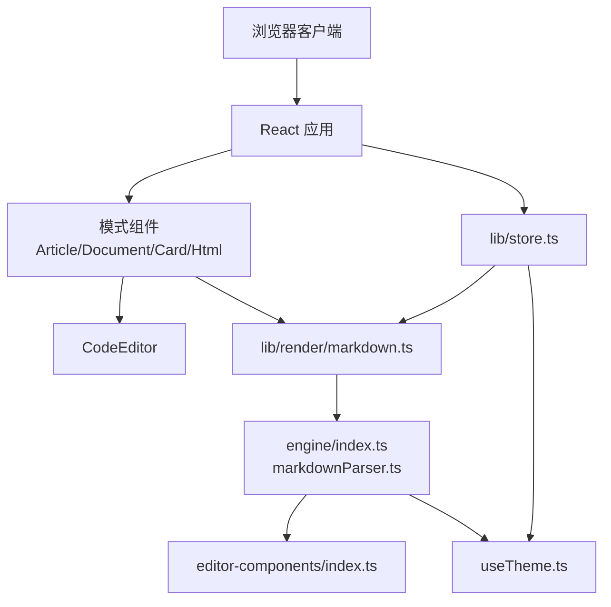
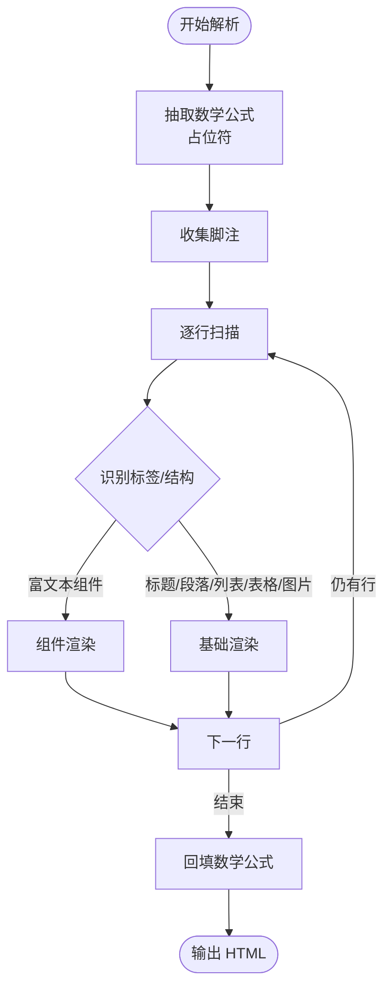
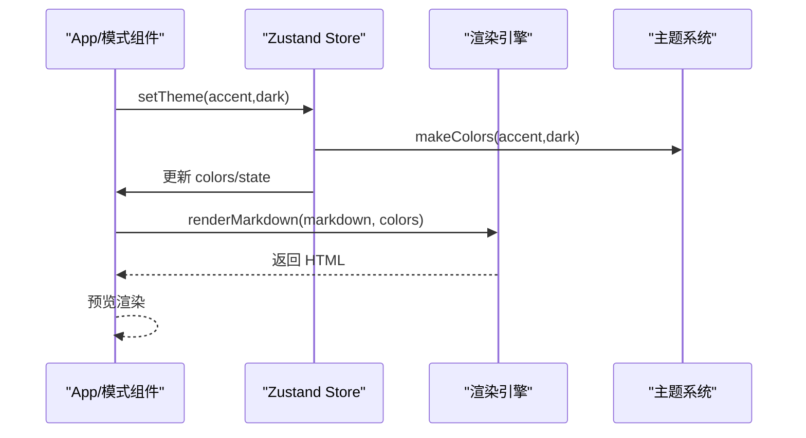
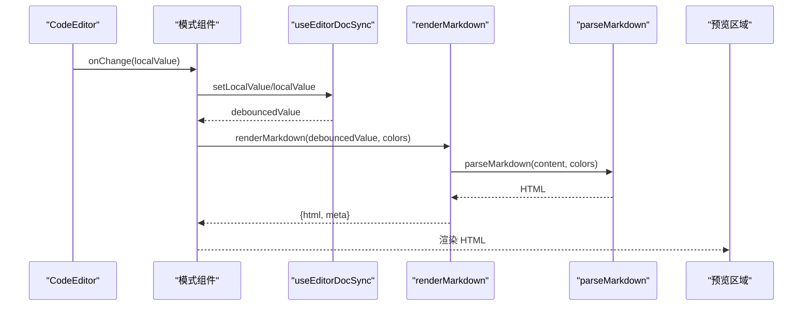
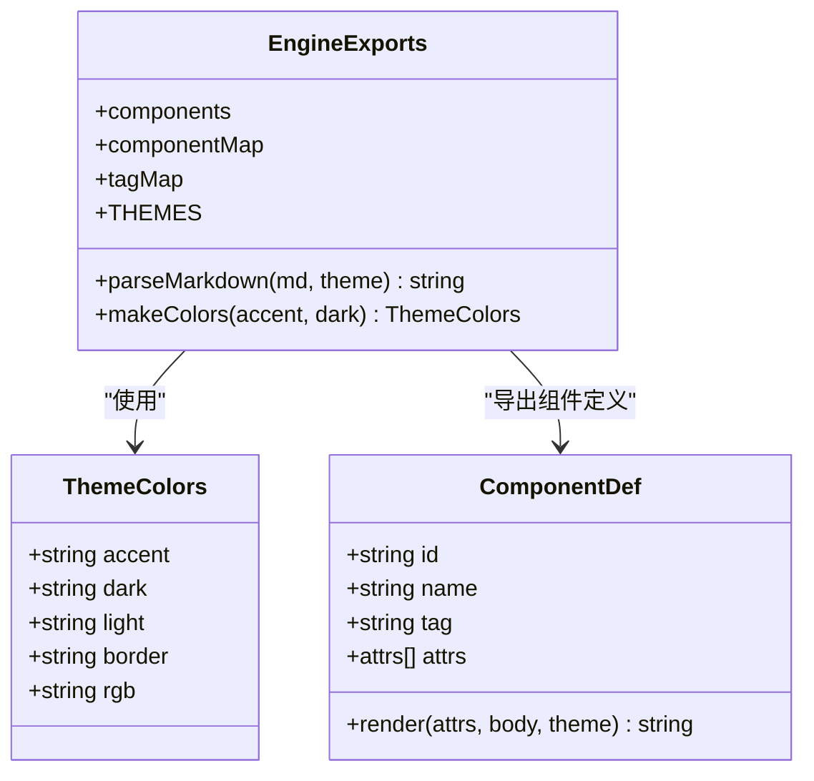
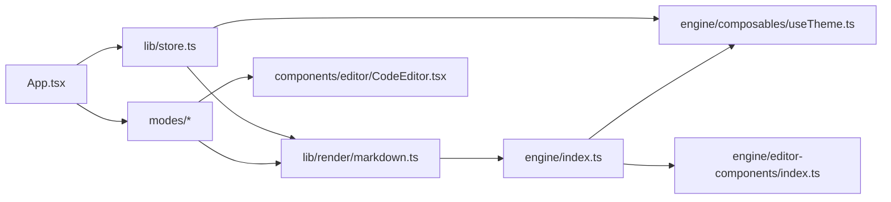

# 架构设计

<cite>
**本文引用的文件**
- [src/App.tsx](file://src/App.tsx)
- [src/main.tsx](file://src/main.tsx)
- [src/engine/index.ts](file://src/engine/index.ts)
- [src/engine/utils/markdownParser.ts](file://src/engine/utils/markdownParser.ts)
- [src/engine/composables/useTheme.ts](file://src/engine/composables/useTheme.ts)
- [src/engine/editor-components/index.ts](file://src/engine/editor-components/index.ts)
- [src/lib/store.ts](file://src/lib/store.ts)
- [src/lib/render/markdown.ts](file://src/lib/render/markdown.ts)
- [src/modes/article/ArticleMode.tsx](file://src/modes/article/ArticleMode.tsx)
- [src/modes/document/DocumentMode.tsx](file://src/modes/document/DocumentMode.tsx)
- [src/modes/card/CardMode.tsx](file://src/modes/card/CardMode.tsx)
- [src/modes/html/HtmlMode.tsx](file://src/modes/html/HtmlMode.tsx)
- [src/components/layout/ModeTabs.tsx](file://src/components/layout/ModeTabs.tsx)
- [src/components/editor/CodeEditor.tsx](file://src/components/editor/CodeEditor.tsx)
- [package.json](file://package.json)
</cite>

## 目录
1. [简介](#简介)
2. [项目结构](#项目结构)
3. [核心组件](#核心组件)
4. [架构总览](#架构总览)
5. [详细组件分析](#详细组件分析)
6. [依赖关系分析](#依赖关系分析)
7. [性能考虑](#性能考虑)
8. [故障排查指南](#故障排查指南)
9. [结论](#结论)
10. [附录](#附录)

## 简介
本项目采用组件化架构，围绕“多模式渲染工作台”的目标，将编辑器、渲染引擎、主题系统与模式化视图解耦。整体设计遵循以下原则：
- 组件化架构：页面由多个模式（文章、文档、卡片、HTML）组成，每个模式独立实现，共享通用编辑器与渲染能力。
- 组合模式：渲染引擎以纯函数与组件注册表的形式组合，支持扩展与复用。
- 策略模式：通过模式切换与主题策略，动态选择渲染路径与外观表现。

## 项目结构
项目采用按功能域划分的目录组织方式，核心目录职责如下：
- src/components：通用 UI 组件与布局组件（编辑器、UI 控件、布局容器等）
- src/engine：渲染引擎与主题工具（Markdown 解析、富文本组件系统、颜色与主题工具）
- src/lib：应用级工具与状态管理（Zustand store、渲染封装、导出工具、滚动同步等）
- src/modes：多场景模式实现（文章、文档、卡片、HTML）

**图表来源**
- [src/main.tsx:1-12](file://src/main.tsx#L1-L12)
- [src/App.tsx:35-171](file://src/App.tsx#L35-L171)
- [src/modes/article/ArticleMode.tsx:16-54](file://src/modes/article/ArticleMode.tsx#L16-L54)
- [src/modes/document/DocumentMode.tsx:34-344](file://src/modes/document/DocumentMode.tsx#L34-L344)
- [src/modes/card/CardMode.tsx:44-363](file://src/modes/card/CardMode.tsx#L44-L363)
- [src/modes/html/HtmlMode.tsx:92-578](file://src/modes/html/HtmlMode.tsx#L92-L578)
- [src/components/editor/CodeEditor.tsx:53-244](file://src/components/editor/CodeEditor.tsx#L53-L244)
- [src/components/layout/ModeTabs.tsx:15-41](file://src/components/layout/ModeTabs.tsx#L15-L41)
- [src/engine/index.ts:1-16](file://src/engine/index.ts#L1-L16)
- [src/engine/utils/markdownParser.ts:110-604](file://src/engine/utils/markdownParser.ts#L110-L604)
- [src/engine/composables/useTheme.ts:1-68](file://src/engine/composables/useTheme.ts#L1-L68)
- [src/engine/editor-components/index.ts:1-81](file://src/engine/editor-components/index.ts#L1-L81)
- [src/lib/render/markdown.ts:1-16](file://src/lib/render/markdown.ts#L1-L16)
- [src/lib/store.ts:163-241](file://src/lib/store.ts#L163-L241)

**章节来源**
- [src/App.tsx:35-171](file://src/App.tsx#L35-L171)
- [src/engine/index.ts:1-16](file://src/engine/index.ts#L1-L16)
- [src/lib/store.ts:163-241](file://src/lib/store.ts#L163-L241)

## 核心组件
- 应用入口与路由：应用入口负责挂载根组件，App 组件作为顶层容器，根据当前模式动态渲染对应模式组件，并提供主题切换、示例恢复、设置弹窗等控制能力。
- 模式组件：文章、文档、卡片、HTML 四种模式各自实现编辑器与预览区域，部分模式还包含导出与分页逻辑。
- 渲染引擎：提供 Markdown 解析、富文本组件渲染、数学公式处理、代码高亮等能力，输出结构化的 HTML。
- 状态管理：基于 Zustand 的全局状态，集中管理各模式内容、主题、平台、字体、文档设置等，并持久化到本地存储。
- 编辑器：基于 CodeMirror 的高性能编辑器，支持 Markdown/HTML 语法、图片粘贴/拖拽上传、快捷键与工具栏。

**章节来源**
- [src/App.tsx:35-171](file://src/App.tsx#L35-L171)
- [src/modes/article/ArticleMode.tsx:16-54](file://src/modes/article/ArticleMode.tsx#L16-L54)
- [src/modes/document/DocumentMode.tsx:34-344](file://src/modes/document/DocumentMode.tsx#L34-L344)
- [src/modes/card/CardMode.tsx:44-363](file://src/modes/card/CardMode.tsx#L44-L363)
- [src/modes/html/HtmlMode.tsx:92-578](file://src/modes/html/HtmlMode.tsx#L92-L578)
- [src/engine/utils/markdownParser.ts:110-604](file://src/engine/utils/markdownParser.ts#L110-L604)
- [src/lib/store.ts:163-241](file://src/lib/store.ts#L163-L241)
- [src/components/editor/CodeEditor.tsx:53-244](file://src/components/editor/CodeEditor.tsx#L53-L244)

## 架构总览
系统边界与交互概览：
- 外部边界：浏览器环境，依赖 React、CodeMirror、KaTeX、highlight.js 等第三方库。
- 内部边界：应用层（App、模式）、组件层（编辑器、UI）、引擎层（渲染、主题、组件）、库层（状态、工具）。
- 数据流：编辑器输入通过模式组件传递给渲染封装，再进入渲染引擎解析，最终输出 HTML 并在预览区域展示；状态通过 Zustand 在全局共享与持久化。

**图表来源**
- [src/App.tsx:35-171](file://src/App.tsx#L35-L171)
- [src/modes/article/ArticleMode.tsx:16-54](file://src/modes/article/ArticleMode.tsx#L16-L54)
- [src/modes/document/DocumentMode.tsx:34-344](file://src/modes/document/DocumentMode.tsx#L34-L344)
- [src/modes/card/CardMode.tsx:44-363](file://src/modes/card/CardMode.tsx#L44-L363)
- [src/modes/html/HtmlMode.tsx:92-578](file://src/modes/html/HtmlMode.tsx#L92-L578)
- [src/lib/render/markdown.ts:1-16](file://src/lib/render/markdown.ts#L1-L16)
- [src/engine/index.ts:1-16](file://src/engine/index.ts#L1-L16)
- [src/engine/utils/markdownParser.ts:110-604](file://src/engine/utils/markdownParser.ts#L110-L604)
- [src/engine/composables/useTheme.ts:1-68](file://src/engine/composables/useTheme.ts#L1-68)
- [src/engine/editor-components/index.ts:1-81](file://src/engine/editor-components/index.ts#L1-L81)
- [src/lib/store.ts:163-241](file://src/lib/store.ts#L163-L241)

## 详细组件分析

### 渲染引擎设计
渲染引擎以纯函数为核心，提供 Markdown 解析与富文本组件渲染能力，同时支持数学公式与代码高亮。其设计理念体现为：
- 解析流程：先抽取数学公式占位符，再处理脚注，随后按行扫描识别块级结构（标题、列表、表格、图片、组件标签等），最后回填数学公式。
- 组件系统：通过组件注册表统一管理富文本组件，解析器按标签动态选择渲染器，形成可扩展的组合模式。
- 主题策略：通过主题颜色对象（accent、dark、light、border、rgb）驱动内联样式，保证渲染结果与主题一致。

**图表来源**
- [src/engine/utils/markdownParser.ts:110-604](file://src/engine/utils/markdownParser.ts#L110-L604)

**章节来源**
- [src/engine/utils/markdownParser.ts:110-604](file://src/engine/utils/markdownParser.ts#L110-L604)
- [src/engine/editor-components/index.ts:1-81](file://src/engine/editor-components/index.ts#L1-L81)
- [src/engine/composables/useTheme.ts:1-68](file://src/engine/composables/useTheme.ts#L1-68)

### 状态管理架构（Zustand）
Zustand 作为轻量级状态管理方案，承担以下职责：
- 全局状态：维护各模式内容、主题、平台、字体、文档设置、图片图床配置等。
- 持久化：通过 persist 中间件将状态持久化至 localStorage，支持迁移旧键与版本同步。
- 主题联动：setTheme 更新 CSS 变量与主题颜色，驱动渲染引擎与 UI 组件。
- 版本同步：demoVersion 与 dirty 标记控制示例内容的增量更新，避免覆盖用户已编辑内容。

**图表来源**
- [src/lib/store.ts:163-241](file://src/lib/store.ts#L163-L241)
- [src/engine/composables/useTheme.ts:58-67](file://src/engine/composables/useTheme.ts#L58-L67)
- [src/lib/render/markdown.ts:9-15](file://src/lib/render/markdown.ts#L9-L15)

**章节来源**
- [src/lib/store.ts:163-241](file://src/lib/store.ts#L163-L241)
- [src/App.tsx:44-54](file://src/App.tsx#L44-L54)

### 模式组件交互
四种模式均采用“编辑器 + 预览”的双栏布局，通过滚动同步与防抖回写提升体验。差异点在于：
- 文章模式：双栏并排，实时渲染 Markdown。
- 文档模式：支持分页、字体与页眉页脚设置，导出 PDF。
- 卡片模式：按比例生成封面与内容页，支持批量导出 PNG/ZIP。
- HTML 模式：沙箱 iframe 实时渲染 HTML，支持多页检测与导出 PNG/PDF/ZIP。

**图表来源**
- [src/components/editor/CodeEditor.tsx:53-244](file://src/components/editor/CodeEditor.tsx#L53-L244)
- [src/modes/article/ArticleMode.tsx:16-54](file://src/modes/article/ArticleMode.tsx#L16-L54)
- [src/modes/document/DocumentMode.tsx:34-344](file://src/modes/document/DocumentMode.tsx#L34-L344)
- [src/modes/card/CardMode.tsx:44-363](file://src/modes/card/CardMode.tsx#L44-L363)
- [src/modes/html/HtmlMode.tsx:92-578](file://src/modes/html/HtmlMode.tsx#L92-L578)
- [src/lib/render/markdown.ts:1-16](file://src/lib/render/markdown.ts#L1-L16)
- [src/engine/utils/markdownParser.ts:110-604](file://src/engine/utils/markdownParser.ts#L110-L604)

**章节来源**
- [src/modes/article/ArticleMode.tsx:16-54](file://src/modes/article/ArticleMode.tsx#L16-L54)
- [src/modes/document/DocumentMode.tsx:34-344](file://src/modes/document/DocumentMode.tsx#L34-L344)
- [src/modes/card/CardMode.tsx:44-363](file://src/modes/card/CardMode.tsx#L44-L363)
- [src/modes/html/HtmlMode.tsx:92-578](file://src/modes/html/HtmlMode.tsx#L92-L578)

### 主题与组件系统
- 主题系统：提供预设主题色与颜色生成函数，支持主色与深色映射为 light/border/rgb 等派生色。
- 组件系统：以组件注册表形式暴露组件定义与索引，解析器按标签选择渲染器，形成策略模式的组件选择。

**图表来源**
- [src/engine/composables/useTheme.ts:4-67](file://src/engine/composables/useTheme.ts#L4-L67)
- [src/engine/editor-components/index.ts:20-81](file://src/engine/editor-components/index.ts#L20-L81)
- [src/engine/index.ts:1-16](file://src/engine/index.ts#L1-L16)

**章节来源**
- [src/engine/composables/useTheme.ts:1-68](file://src/engine/composables/useTheme.ts#L1-L68)
- [src/engine/editor-components/index.ts:1-81](file://src/engine/editor-components/index.ts#L1-L81)
- [src/engine/index.ts:1-16](file://src/engine/index.ts#L1-L16)

## 依赖关系分析
- 应用层依赖模式层与组件层；模式层依赖渲染封装与编辑器；渲染封装依赖渲染引擎；渲染引擎依赖主题与组件系统；应用层依赖状态管理。
- 第三方依赖：React、CodeMirror、KaTeX、highlight.js、zustand 等。

**图表来源**
- [src/App.tsx:35-171](file://src/App.tsx#L35-L171)
- [src/modes/article/ArticleMode.tsx:16-54](file://src/modes/article/ArticleMode.tsx#L16-L54)
- [src/modes/document/DocumentMode.tsx:34-344](file://src/modes/document/DocumentMode.tsx#L34-L344)
- [src/modes/card/CardMode.tsx:44-363](file://src/modes/card/CardMode.tsx#L44-L363)
- [src/modes/html/HtmlMode.tsx:92-578](file://src/modes/html/HtmlMode.tsx#L92-L578)
- [src/lib/render/markdown.ts:1-16](file://src/lib/render/markdown.ts#L1-L16)
- [src/engine/index.ts:1-16](file://src/engine/index.ts#L1-L16)
- [src/engine/composables/useTheme.ts:1-68](file://src/engine/composables/useTheme.ts#L1-L68)
- [src/engine/editor-components/index.ts:1-81](file://src/engine/editor-components/index.ts#L1-L81)
- [src/components/editor/CodeEditor.tsx:53-244](file://src/components/editor/CodeEditor.tsx#L53-L244)
- [src/lib/store.ts:163-241](file://src/lib/store.ts#L163-L241)

**章节来源**
- [package.json:13-31](file://package.json#L13-L31)

## 性能考虑
- 渲染性能：模式组件对渲染结果进行 memo 化，减少重复计算；编辑器采用防抖写回，降低频繁渲染压力。
- 图片处理：编辑器支持图片压缩与多种图床上传，避免大图影响渲染与网络传输。
- 分页与测量：文档与卡片模式通过隐藏测量容器与 ResizeObserver 精准测量块高，避免不必要的重排。
- 滚动同步：使用 requestAnimationFrame 与单向同步策略，减少滚动事件对渲染的影响。
- 主题变量：通过 CSS 变量与主题颜色生成函数，避免重复计算与样式闪烁。

## 故障排查指南
- 编辑器输入异常：检查受控/非受控模式与外部重置信号，确认 externalVersion 是否正确传递。
- 预览空白或样式错乱：确认主题颜色与 CSS 变量是否正确应用，检查渲染引擎输出的 HTML 结构。
- 导出失败：检查导出函数的 iframe 访问权限与页面可见性，确保在可见页执行导出操作。
- 图片上传失败：核对图床配置与 token，确认上传接口可用性与跨域策略。

**章节来源**
- [src/components/editor/CodeEditor.tsx:84-103](file://src/components/editor/CodeEditor.tsx#L84-L103)
- [src/lib/store.ts:227-230](file://src/lib/store.ts#L227-L230)
- [src/modes/html/HtmlMode.tsx:346-453](file://src/modes/html/HtmlMode.tsx#L346-L453)

## 结论
本项目通过组件化架构与组合/策略模式，实现了多场景渲染工作台。Zustand 提供简洁的状态管理与持久化能力，渲染引擎以纯函数与组件注册表实现可扩展的富文本渲染。模式组件在统一的编辑器与渲染体系上，分别满足文章、文档、卡片与 HTML 的差异化需求。整体设计在可维护性、可扩展性与用户体验之间取得良好平衡。

## 附录
- 关键技术栈：React、CodeMirror、KaTeX、highlight.js、zustand、TailwindCSS。
- 开发与构建：Vite + TypeScript，测试使用 Vitest。