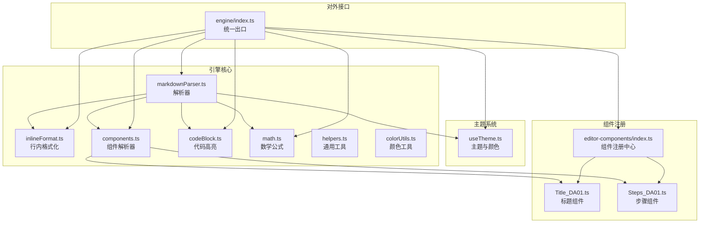
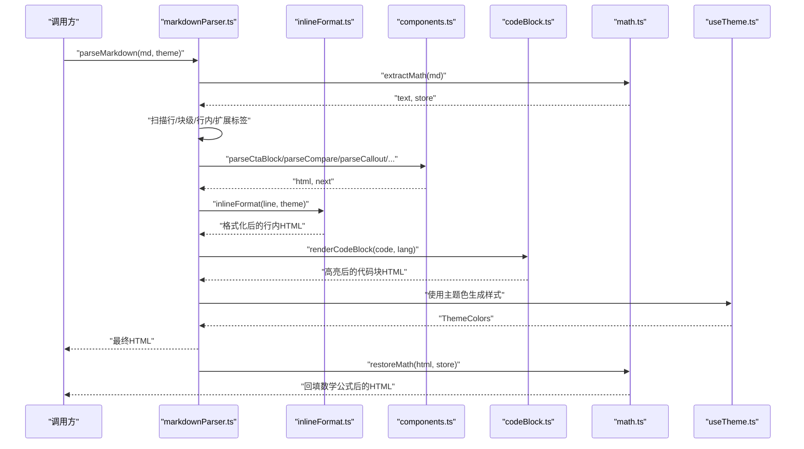
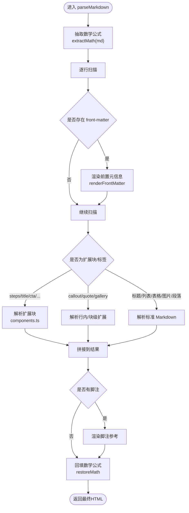
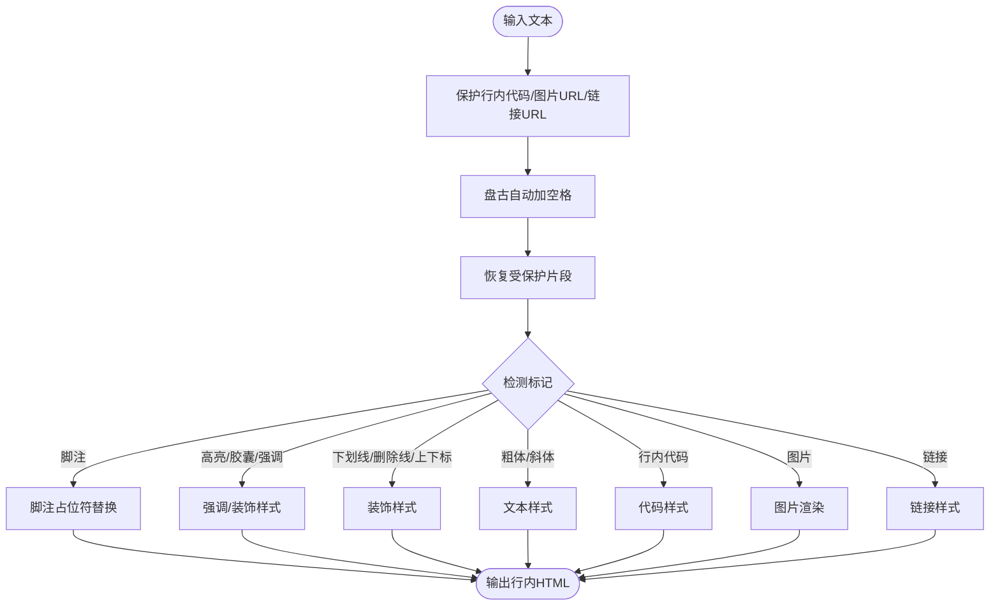
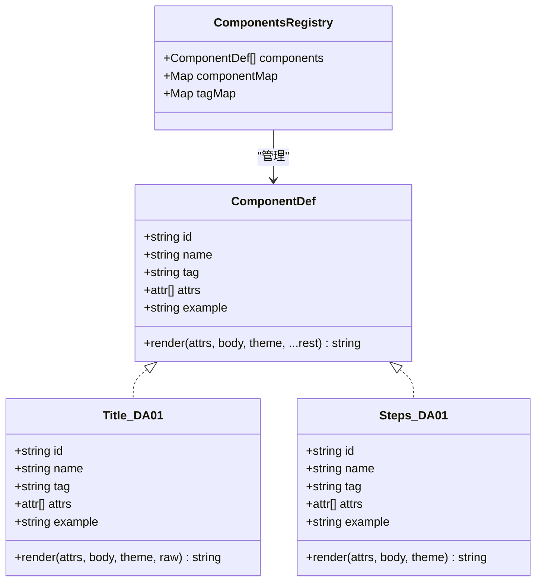
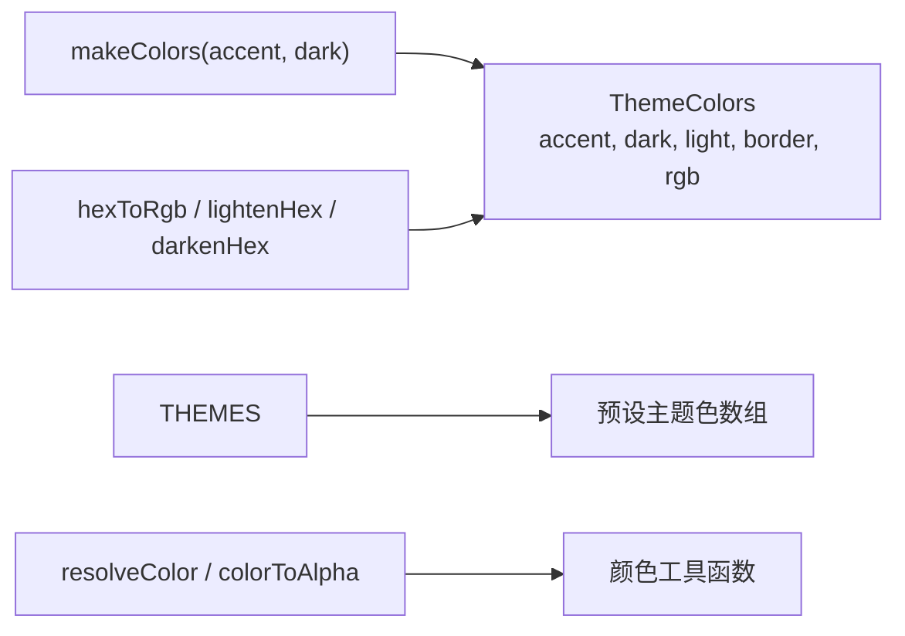
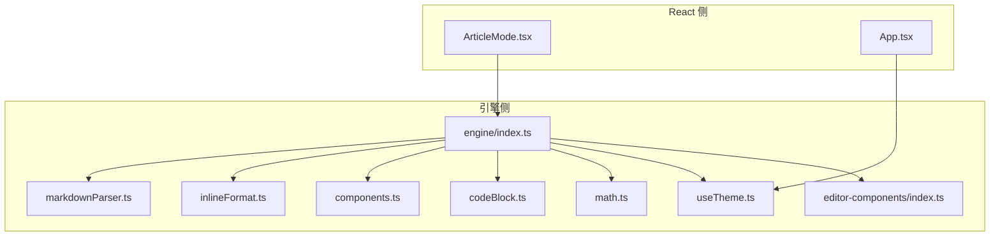

# 渲染引擎架构

<cite>
**本文引用的文件**
- [markdownParser.ts](file://src/engine/utils/markdownParser.ts)
- [index.ts（引擎入口）](file://src/engine/index.ts)
- [useTheme.ts（主题组合式函数）](file://src/engine/composables/useTheme.ts)
- [helpers.ts（通用工具）](file://src/engine/utils/helpers.ts)
- [inlineFormat.ts（行内格式化）](file://src/engine/utils/inlineFormat.ts)
- [components.ts（组件解析器）](file://src/engine/utils/components.ts)
- [codeBlock.ts（代码块高亮）](file://src/engine/utils/codeBlock.ts)
- [math.ts（数学公式）](file://src/engine/utils/math.ts)
- [colorUtils.ts（颜色工具）](file://src/engine/utils/colorUtils.ts)
- [Title_DA01.ts（标题组件）](file://src/engine/editor-components/Title_DA01.ts)
- [Steps_DA01.ts（步骤组件）](file://src/engine/editor-components/Steps_DA01.ts)
- [App.tsx（应用入口）](file://src/App.tsx)
- [ArticleMode.tsx（文章模式）](file://src/modes/article/ArticleMode.tsx)
- [package.json（依赖清单）](file://src/package.json)
</cite>

## 目录
1. [简介](#简介)
2. [项目结构](#项目结构)
3. [核心组件](#核心组件)
4. [架构总览](#架构总览)
5. [详细组件分析](#详细组件分析)
6. [依赖关系分析](#依赖关系分析)
7. [性能考量](#性能考量)
8. [故障排查指南](#故障排查指南)
9. [结论](#结论)
10. [附录](#附录)

## 简介
本文件系统性阐述 MarkFlow 渲染引擎的架构设计与实现细节，聚焦三大核心子系统：
- Markdown 解析器：从 Markdown 文本到 DOM 元素的转换流水线，包含扩展标签、块级/行内语法、数学公式与代码高亮。
- 富文本组件系统：基于“组合模式”的组件注册中心，支持内置组件与自定义组件扩展。
- 主题系统：以主题色为核心的颜色体系、字体与响应式样式的统一管理。

该引擎强调“纯 TypeScript、框架无关”，通过统一出口导出核心能力，便于在不同前端框架或运行环境中复用。

## 项目结构
渲染引擎位于 src/engine 目录，采用“功能域 + 工具层”组织方式：
- composable：主题与颜色工具（与框架解耦）
- utils：解析器、格式化、组件解析器、代码高亮、数学公式等
- editor-components：富文本组件注册与实现
- index.ts：对外统一出口

图表来源
- [markdownParser.ts:110-605](file://src/engine/utils/markdownParser.ts#L110-L605)
- [inlineFormat.ts:1-104](file://src/engine/utils/inlineFormat.ts#L1-L104)
- [components.ts:1-333](file://src/engine/utils/components.ts#L1-L333)
- [codeBlock.ts:1-98](file://src/engine/utils/codeBlock.ts#L1-L98)
- [math.ts:1-71](file://src/engine/utils/math.ts#L1-L71)
- [helpers.ts:1-115](file://src/engine/utils/helpers.ts#L1-L115)
- [colorUtils.ts:1-88](file://src/engine/utils/colorUtils.ts#L1-L88)
- [useTheme.ts:1-68](file://src/engine/composables/useTheme.ts#L1-L68)
- [editor-components/index.ts:1-81](file://src/engine/editor-components/index.ts#L1-L81)
- [Title_DA01.ts:1-119](file://src/engine/editor-components/Title_DA01.ts#L1-L119)
- [Steps_DA01.ts:1-103](file://src/engine/editor-components/Steps_DA01.ts#L1-L103)
- [index.ts（引擎入口）:1-16](file://src/engine/index.ts#L1-L16)

章节来源
- [index.ts（引擎入口）:1-16](file://src/engine/index.ts#L1-L16)

## 核心组件
- 解析器：负责扫描行、识别块级/行内语法、抽取数学公式、处理扩展标签，并调用相应渲染器生成 HTML。
- 行内格式化：对文本进行盘古加空格、脚注占位符替换、强调/下划线/删除线/上/下标、行内代码、图片与链接等处理。
- 组件解析器：解析 ::: 与 <tag> 形式的扩展块，构造组件所需的 body 与 attrs，并委派给具体组件渲染。
- 代码高亮：基于 highlight.js 的语言注册与 One Dark 风格 token 到内联样式的映射。
- 数学公式：KaTeX 渲染，采用“抽取-解析-回填”策略避免与 Markdown 规则冲突。
- 主题系统：提供预设主题色、颜色转换与辅助函数，生成完整的 ThemeColors 结构。
- 组件注册中心：集中管理组件元信息（id、name、tag、attrs、example、render），支持按 id/tag 快速索引。

章节来源
- [markdownParser.ts:110-605](file://src/engine/utils/markdownParser.ts#L110-L605)
- [inlineFormat.ts:1-104](file://src/engine/utils/inlineFormat.ts#L1-L104)
- [components.ts:1-333](file://src/engine/utils/components.ts#L1-L333)
- [codeBlock.ts:1-98](file://src/engine/utils/codeBlock.ts#L1-L98)
- [math.ts:1-71](file://src/engine/utils/math.ts#L1-L71)
- [useTheme.ts:1-68](file://src/engine/composables/useTheme.ts#L1-L68)
- [editor-components/index.ts:1-81](file://src/engine/editor-components/index.ts#L1-L81)

## 架构总览
渲染引擎采用“解析器 + 组件系统 + 主题系统”的分层架构：
- 解析器层：自顶向下扫描 Markdown 文本，优先处理扩展标签与特殊块，其次处理标准 Markdown，最后回填数学公式。
- 组件层：组件注册中心统一暴露组件定义与渲染方法，解析器通过标签名或块起止匹配调用对应组件。
- 主题层：主题系统提供颜色与工具函数，贯穿解析器与组件渲染，保证视觉一致性。

图表来源
- [markdownParser.ts:110-605](file://src/engine/utils/markdownParser.ts#L110-L605)
- [inlineFormat.ts:1-104](file://src/engine/utils/inlineFormat.ts#L1-L104)
- [components.ts:1-333](file://src/engine/utils/components.ts#L1-L333)
- [codeBlock.ts:1-98](file://src/engine/utils/codeBlock.ts#L1-L98)
- [math.ts:1-71](file://src/engine/utils/math.ts#L1-L71)
- [useTheme.ts:1-68](file://src/engine/composables/useTheme.ts#L1-L68)

## 详细组件分析

### 解析器：从 Markdown 到 DOM 的转换流程
解析器以“先抽取、后解析、再回填”的策略处理复杂语法，确保数学公式与 Markdown 规则互不干扰。其核心流程如下：

图表来源
- [markdownParser.ts:110-605](file://src/engine/utils/markdownParser.ts#L110-L605)
- [components.ts:1-333](file://src/engine/utils/components.ts#L1-L333)
- [math.ts:1-71](file://src/engine/utils/math.ts#L1-L71)

章节来源
- [markdownParser.ts:110-605](file://src/engine/utils/markdownParser.ts#L110-L605)

### 行内格式化：强调、链接、图片与脚注
行内格式化负责将 Markdown 行内语法转换为带主题色的 HTML 片段，同时保护行内代码与链接 URL，避免盘古加空格破坏结构。

图表来源
- [inlineFormat.ts:1-104](file://src/engine/utils/inlineFormat.ts#L1-L104)
- [helpers.ts:1-115](file://src/engine/utils/helpers.ts#L1-L115)

章节来源
- [inlineFormat.ts:1-104](file://src/engine/utils/inlineFormat.ts#L1-L104)

### 组件系统：组合模式与扩展机制
组件系统采用“组合模式”：每个组件实现统一的 ComponentDef 接口，包含 id/name/tag/attrs/example/render 等字段。解析器通过标签名或块起止匹配调用对应组件的 render 方法，实现“内置组件 + 自定义组件”的扩展能力。

图表来源
- [editor-components/index.ts:1-81](file://src/engine/editor-components/index.ts#L1-L81)
- [Title_DA01.ts:1-119](file://src/engine/editor-components/Title_DA01.ts#L1-L119)
- [Steps_DA01.ts:1-103](file://src/engine/editor-components/Steps_DA01.ts#L1-L103)

章节来源
- [editor-components/index.ts:1-81](file://src/engine/editor-components/index.ts#L1-L81)
- [Title_DA01.ts:1-119](file://src/engine/editor-components/Title_DA01.ts#L1-L119)
- [Steps_DA01.ts:1-103](file://src/engine/editor-components/Steps_DA01.ts#L1-L103)

### 主题系统：颜色管理与响应式样式
主题系统提供 ThemeColors 接口与 makeColors 函数，生成包含 accent/dark/light/border/rgb 的完整颜色体系。useTheme.ts 提供预设主题与颜色转换工具，colorUtils.ts 提供颜色名到 hex 的映射与浅色背景生成。

图表来源
- [useTheme.ts:1-68](file://src/engine/composables/useTheme.ts#L1-L68)
- [colorUtils.ts:1-88](file://src/engine/utils/colorUtils.ts#L1-L88)

章节来源
- [useTheme.ts:1-68](file://src/engine/composables/useTheme.ts#L1-L68)
- [colorUtils.ts:1-88](file://src/engine/utils/colorUtils.ts#L1-L88)

### 代码高亮与数学公式
- 代码高亮：基于 highlight.js 注册多种语言，使用 One Dark 风格 token 到内联样式的映射，确保复制到富文本目标时仍保持高亮。
- 数学公式：KaTeX 渲染，采用“抽取-解析-回填”策略，块级与行内公式分别处理，失败时降级为原文本。

章节来源
- [codeBlock.ts:1-98](file://src/engine/utils/codeBlock.ts#L1-L98)
- [math.ts:1-71](file://src/engine/utils/math.ts#L1-L71)

## 依赖关系分析
渲染引擎通过统一出口导出核心能力，React 侧在模式组件中消费这些能力，形成“引擎无关 + 框架适配”的清晰边界。

图表来源
- [ArticleMode.tsx:1-55](file://src/modes/article/ArticleMode.tsx#L1-L55)
- [App.tsx:1-172](file://src/App.tsx#L1-L172)
- [index.ts（引擎入口）:1-16](file://src/engine/index.ts#L1-L16)

章节来源
- [ArticleMode.tsx:1-55](file://src/modes/article/ArticleMode.tsx#L1-L55)
- [App.tsx:1-172](file://src/App.tsx#L1-L172)
- [index.ts（引擎入口）:1-16](file://src/engine/index.ts#L1-L16)

## 性能考量
- 数学公式抽取与回填：避免在解析过程中反复渲染，减少正则与字符串替换开销。
- 行内格式化保护机制：对行内代码/链接/图片 URL 进行占位保护，避免多次正则遍历。
- 代码高亮映射：将 token 映射为内联样式，减少额外 CSS 依赖，提升复制粘贴兼容性。
- 组件渲染：组件 render 返回内联样式 HTML，避免外部样式污染，利于分页与导出。
- 主题颜色复用：通过 ThemeColors 统一生成边框/浅色背景等派生色，降低重复计算。

## 故障排查指南
- 数学公式渲染异常：检查抽取与回填流程，确认占位符未被意外修改；若 KaTeX 渲染失败，将回退为原文本。
- 行内格式化错误：确认行内代码/链接/图片 URL 是否被正确保护与恢复。
- 代码高亮缺失：检查语言别名映射与 highlight.js 注册的语言列表。
- 组件渲染空白：确认组件标签闭合正确、attrs 解析无误、theme 参数传入有效。
- 主题色不生效：检查 makeColors 生成的 ThemeColors 是否正确传递至组件与解析器。

章节来源
- [math.ts:1-71](file://src/engine/utils/math.ts#L1-L71)
- [inlineFormat.ts:1-104](file://src/engine/utils/inlineFormat.ts#L1-L104)
- [codeBlock.ts:1-98](file://src/engine/utils/codeBlock.ts#L1-L98)
- [components.ts:1-333](file://src/engine/utils/components.ts#L1-L333)
- [useTheme.ts:1-68](file://src/engine/composables/useTheme.ts#L1-L68)

## 结论
MarkFlow 渲染引擎以“解析器 + 组件系统 + 主题系统”为核心，实现了从 Markdown 到富文本 HTML 的高保真转换。其设计强调：
- 解析流程的健壮性与可扩展性（数学公式、代码高亮、扩展标签）
- 组件化的组合模式与统一注册中心
- 主题驱动的一致性与可定制性
- 对外接口的简洁与框架无关性

该架构既满足日常排版需求，也为二次开发与扩展提供了清晰路径。

## 附录
- 引擎统一出口：导出解析器、行内格式化、组件解析器、代码高亮、数学公式与主题工具。
- React 侧集成：在模式组件中消费引擎能力，完成编辑器与预览的联动与主题切换。

章节来源
- [index.ts（引擎入口）:1-16](file://src/engine/index.ts#L1-L16)
- [ArticleMode.tsx:1-55](file://src/modes/article/ArticleMode.tsx#L1-L55)
- [App.tsx:1-172](file://src/App.tsx#L1-L172)