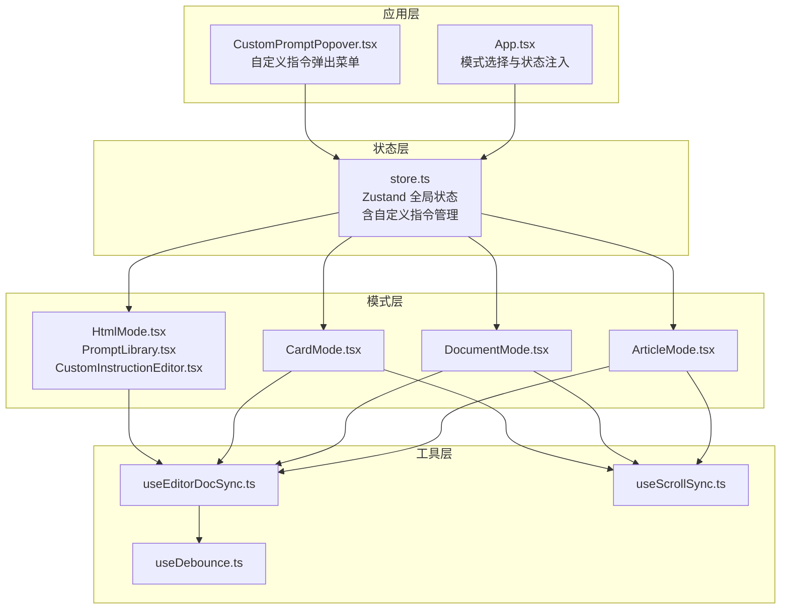
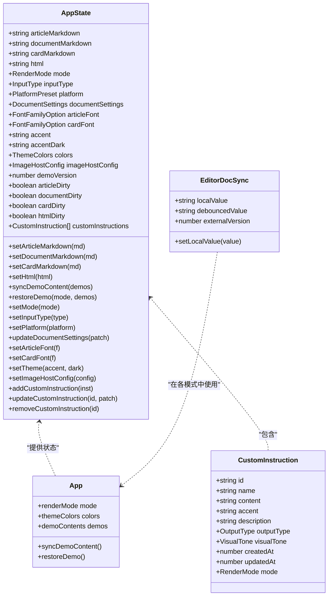
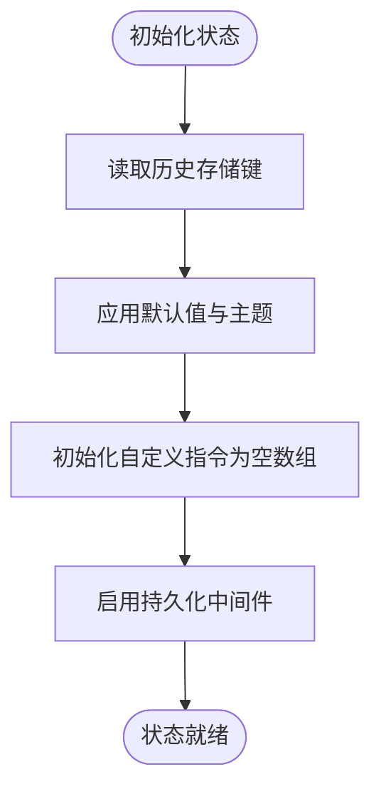
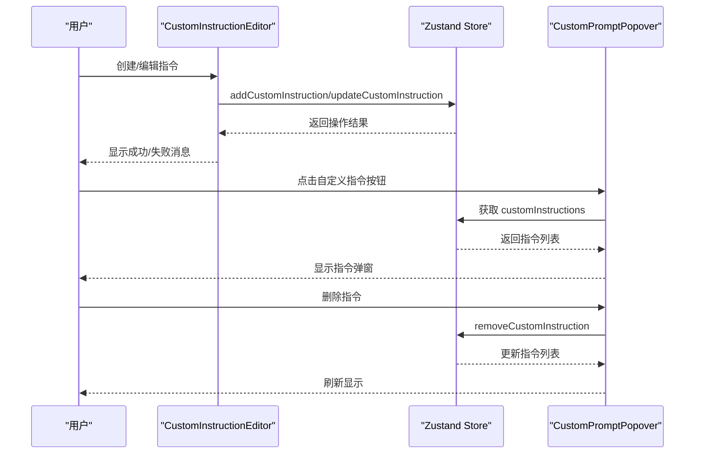
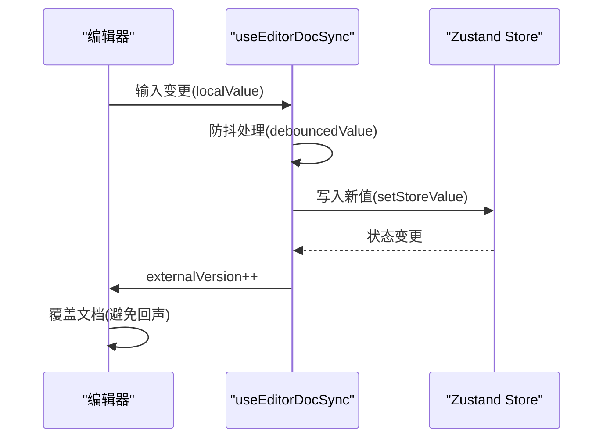
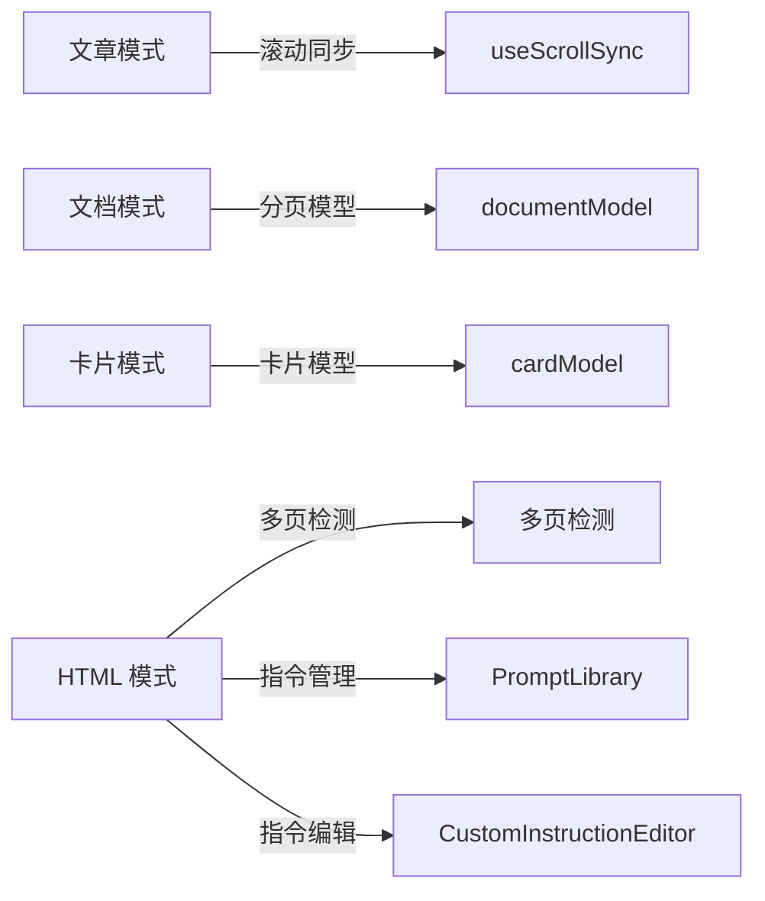
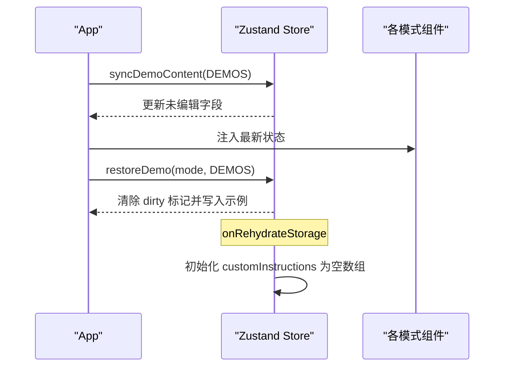
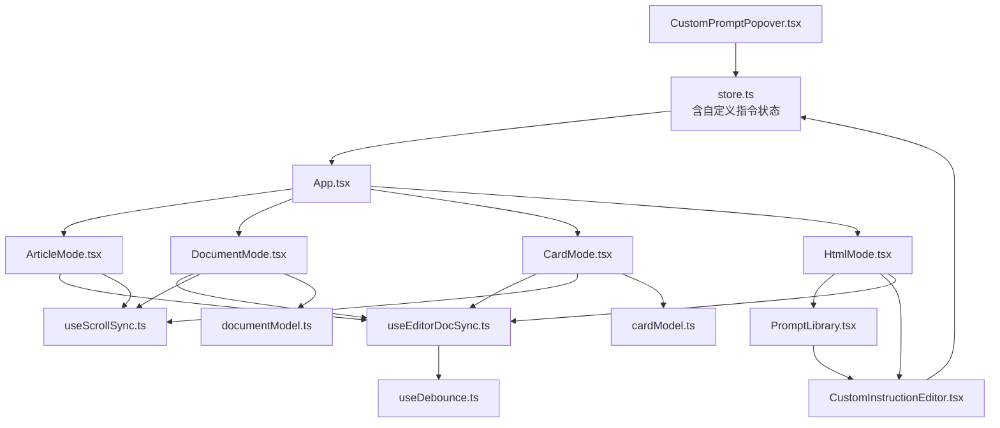

# 状态管理架构

<cite>
**本文档引用的文件**
- [src/lib/store.ts](file://src/lib/store.ts)
- [src/App.tsx](file://src/App.tsx)
- [src/modes/article/ArticleMode.tsx](file://src/modes/article/ArticleMode.tsx)
- [src/modes/document/DocumentMode.tsx](file://src/modes/document/DocumentMode.tsx)
- [src/modes/card/CardMode.tsx](file://src/modes/card/CardMode.tsx)
- [src/modes/html/HtmlMode.tsx](file://src/modes/html/HtmlMode.tsx)
- [src/modes/html/CustomInstructionEditor.tsx](file://src/modes/html/CustomInstructionEditor.tsx)
- [src/modes/html/PromptLibrary.tsx](file://src/modes/html/PromptLibrary.tsx)
- [src/components/layout/CustomPromptPopover.tsx](file://src/components/layout/CustomPromptPopover.tsx)
- [src/lib/useEditorDocSync.ts](file://src/lib/useEditorDocSync.ts)
- [src/lib/useDebounce.ts](file://src/lib/useDebounce.ts)
- [src/lib/useScrollSync.ts](file://src/lib/useScrollSync.ts)
- [src/modes/document/documentModel.ts](file://src/modes/document/documentModel.ts)
- [src/modes/card/cardModel.ts](file://src/modes/card/cardModel.ts)
</cite>

## 更新摘要
**所做更改**
- 新增自定义指令管理功能的完整文档说明
- 更新全局状态设计以包含自定义指令状态管理
- 增强持久化支持章节以涵盖自定义指令的存储机制
- 添加自定义指令编辑器和弹出菜单的使用说明
- 更新状态树组织结构以反映新增的自定义指令状态

## 目录
1. [简介](#简介)
2. [项目结构](#项目结构)
3. [核心组件](#核心组件)
4. [架构概览](#架构概览)
5. [详细组件分析](#详细组件分析)
6. [依赖关系分析](#依赖关系分析)
7. [性能考量](#性能考量)
8. [故障排除指南](#故障排除指南)
9. [结论](#结论)

## 简介
本文件系统性阐述 MarkFlow 的状态管理架构，重点解析基于 Zustand 的全局状态设计与各编辑模式的独立状态管理策略。文档涵盖状态树组织、编辑器与预览的双向同步机制、防抖优化、文档同步策略，以及最佳实践与性能优化建议。特别关注新增的自定义指令管理功能及其在全局状态中的集成。

## 项目结构
项目采用按功能域划分的目录结构，状态管理集中在单一 store 文件中，通过 React hooks 在各模式组件中消费状态。编辑器与预览的同步通过自定义 Hook 实现，确保用户体验流畅且性能可控。新增的自定义指令管理功能通过专门的编辑器组件和弹出菜单集成到系统中。

**图表来源**
- [src/App.tsx:35-171](file://src/App.tsx#L35-L171)
- [src/lib/store.ts:163-241](file://src/lib/store.ts#L163-L241)
- [src/components/layout/CustomPromptPopover.tsx:12-154](file://src/components/layout/CustomPromptPopover.tsx#L12-L154)
- [src/modes/html/HtmlMode.tsx:92-578](file://src/modes/html/HtmlMode.tsx#L92-L578)
- [src/modes/html/PromptLibrary.tsx:76-391](file://src/modes/html/PromptLibrary.tsx#L76-L391)
- [src/modes/html/CustomInstructionEditor.tsx:16-157](file://src/modes/html/CustomInstructionEditor.tsx#L16-L157)

**章节来源**
- [src/App.tsx:35-171](file://src/App.tsx#L35-L171)
- [src/lib/store.ts:163-241](file://src/lib/store.ts#L163-L241)

## 核心组件
- 全局状态存储：集中管理各模式的文档内容、渲染模式、主题与平台设置，并提供持久化与迁移能力。**新增**：自定义指令管理功能，支持指令的增删改查和持久化存储。
- 编辑器-预览同步：通过 useEditorDocSync Hook 实现双向同步，结合防抖与外部变更信号，避免回写回声与竞态。
- 模式专用状态：各模式在自身组件内维护局部状态（如分页、字体、导出进度等），与全局状态解耦。
- 同步工具：useDebounce 提供输入防抖，useScrollSync 实现编辑器与预览的平滑联动。
- **新增**：自定义指令编辑器：提供完整的指令创建、编辑、删除界面，支持指令克隆和预览功能。

**章节来源**
- [src/lib/store.ts:54-92](file://src/lib/store.ts#L54-L92)
- [src/lib/store.ts:110-115](file://src/lib/store.ts#L110-L115)
- [src/modes/html/CustomInstructionEditor.tsx:16-157](file://src/modes/html/CustomInstructionEditor.tsx#L16-L157)
- [src/components/layout/CustomPromptPopover.tsx:12-154](file://src/components/layout/CustomPromptPopover.tsx#L12-L154)

## 架构概览
Zustand 作为轻量级状态库，提供简洁的订阅与更新机制。全局状态包含四种文档内容（文章、文档、卡片、HTML）、渲染模式、输入类型、平台、主题与字体等。**新增**：自定义指令状态管理，支持指令的完整生命周期管理。各模式通过 App 注入的 store hook 获取对应状态，组件内部再通过 useEditorDocSync 完成与编辑器的双向同步。

**图表来源**
- [src/lib/store.ts:72-115](file://src/lib/store.ts#L72-L115)
- [src/lib/store.ts:11-23](file://src/lib/store.ts#L11-L23)
- [src/lib/useEditorDocSync.ts:20-49](file://src/lib/useEditorDocSync.ts#L20-L49)
- [src/App.tsx:35-171](file://src/App.tsx#L35-L171)

## 详细组件分析

### 全局状态设计与状态树组织
- 状态键划分：按模式划分独立的文档内容键（article/document/card/html），配合 mode/inputType/platform 控制渲染与行为。
- **新增**：自定义指令状态管理，包含指令列表、添加、更新、删除操作，支持每种模式独立管理指令。
- 持久化与迁移：通过 persist 中间件与历史键迁移逻辑，兼容旧版本存储结构，保证用户数据不丢失。**新增**：自定义指令状态的持久化支持，确保指令数据在浏览器重启后仍然可用。
- 版本驱动的示例同步：demoVersion 字段控制示例内容的增量更新，避免覆盖用户已编辑内容。
- 主题与字体：颜色体系通过 CSS 变量动态注入，字体设置与平台偏好独立管理。

**图表来源**
- [src/lib/store.ts:124-179](file://src/lib/store.ts#L124-L179)
- [src/lib/store.ts:186-306](file://src/lib/store.ts#L186-L306)

**章节来源**
- [src/lib/store.ts:124-179](file://src/lib/store.ts#L124-L179)
- [src/lib/store.ts:186-306](file://src/lib/store.ts#L186-L306)

### 自定义指令管理功能
- **数据结构**：CustomInstruction 接口定义了指令的完整结构，包括唯一标识、名称、内容、强调色、描述、输出类型、视觉气质等属性。
- **操作接口**：提供 addCustomInstruction、updateCustomInstruction、removeCustomInstruction 三个核心操作方法。
- **限制与约束**：最大指令数量限制为 50 条，单个指令内容长度限制为 5000 字符。
- **持久化支持**：通过 Zustand 的 persist 中间件自动保存和恢复指令数据。
- **模式隔离**：指令支持按模式（article/document/card/html）进行过滤和管理。

**图表来源**
- [src/modes/html/CustomInstructionEditor.tsx:30-45](file://src/modes/html/CustomInstructionEditor.tsx#L30-L45)
- [src/lib/store.ts:264-292](file://src/lib/store.ts#L264-L292)
- [src/components/layout/CustomPromptPopover.tsx:20-54](file://src/components/layout/CustomPromptPopover.tsx#L20-L54)

**章节来源**
- [src/lib/store.ts:11-23](file://src/lib/store.ts#L11-L23)
- [src/lib/store.ts:264-292](file://src/lib/store.ts#L264-L292)
- [src/modes/html/CustomInstructionEditor.tsx:16-157](file://src/modes/html/CustomInstructionEditor.tsx#L16-L157)
- [src/components/layout/CustomPromptPopover.tsx:12-154](file://src/components/layout/CustomPromptPopover.tsx#L12-L154)

### 编辑器-预览双向同步机制
- 同步策略：编辑器本地值 localValue 实时更新，debouncedValue 通过防抖延迟回写至 store；store 变化时通过 externalVersion 通知编辑器覆盖文档，避免回写回声。
- 防抖参数：默认 500ms，平衡响应性与性能。
- 回写去重：通过 lastWrittenRef 记录最近一次写入值，避免重复写入与脏标记误触发。

**图表来源**
- [src/lib/useEditorDocSync.ts:20-49](file://src/lib/useEditorDocSync.ts#L20-L49)
- [src/lib/useDebounce.ts:3-17](file://src/lib/useDebounce.ts#L3-L17)

**章节来源**
- [src/lib/useEditorDocSync.ts:20-49](file://src/lib/useEditorDocSync.ts#L20-L49)
- [src/lib/useDebounce.ts:3-17](file://src/lib/useDebounce.ts#L3-L17)

### 各编辑模式的独立状态管理
- 文章模式：专注于 Markdown 渲染与滚动同步，使用 useScrollSync 保持编辑器与预览的同步滚动。
- 文档模式：包含复杂的分页模型与页面高度测量，通过 documentModel 将 Markdown 分块并计算分页，支持字体缩放与标题居中等设置。
- 卡片模式：面向社交平台的卡片生成，使用 cardModel 将内容按比例与预算进行分页，支持封面与内容页的组合导出。
- **HTML 模式增强**：支持多页检测与键盘/滚轮翻页，提供 PNG/PDF 导出与脚本开关。**新增**：集成了自定义指令管理功能，通过 PromptLibrary 和 CustomInstructionEditor 提供完整的指令管理界面。

**图表来源**
- [src/modes/article/ArticleMode.tsx:16-54](file://src/modes/article/ArticleMode.tsx#L16-L54)
- [src/modes/document/DocumentMode.tsx:41-129](file://src/modes/document/DocumentMode.tsx#L41-L129)
- [src/modes/card/CardMode.tsx:51-144](file://src/modes/card/CardMode.tsx#L51-L144)
- [src/modes/html/HtmlMode.tsx:92-173](file://src/modes/html/HtmlMode.tsx#L92-L173)
- [src/modes/html/PromptLibrary.tsx:76-391](file://src/modes/html/PromptLibrary.tsx#L76-L391)
- [src/modes/html/CustomInstructionEditor.tsx:16-157](file://src/modes/html/CustomInstructionEditor.tsx#L16-L157)

**章节来源**
- [src/modes/article/ArticleMode.tsx:16-54](file://src/modes/article/ArticleMode.tsx#L16-L54)
- [src/modes/document/DocumentMode.tsx:41-129](file://src/modes/document/DocumentMode.tsx#L41-L129)
- [src/modes/card/CardMode.tsx:51-144](file://src/modes/card/CardMode.tsx#L51-L144)
- [src/modes/html/HtmlMode.tsx:92-173](file://src/modes/html/HtmlMode.tsx#L92-L173)
- [src/modes/html/PromptLibrary.tsx:76-391](file://src/modes/html/PromptLibrary.tsx#L76-L391)
- [src/modes/html/CustomInstructionEditor.tsx:16-157](file://src/modes/html/CustomInstructionEditor.tsx#L16-L157)

### 状态同步与示例内容管理
- 版本同步：App 在挂载时调用 syncDemoContent，仅在 DEMO_VERSION 变化时更新未编辑过的字段。
- 恢复示例：restoreDemo 支持按模式恢复示例内容并清除 dirty 标记。
- 平台与输入类型：setMode 自动切换 inputType 与 platform，确保模式一致性。
- **新增**：自定义指令的持久化同步，通过 onRehydrateStorage 钩子确保指令数据在重新水合时的完整性。

**图表来源**
- [src/App.tsx:63-73](file://src/App.tsx#L63-L73)
- [src/lib/store.ts:194-214](file://src/lib/store.ts#L194-L214)
- [src/lib/store.ts:294-304](file://src/lib/store.ts#L294-L304)

**章节来源**
- [src/App.tsx:63-73](file://src/App.tsx#L63-L73)
- [src/lib/store.ts:194-214](file://src/lib/store.ts#L194-L214)
- [src/lib/store.ts:294-304](file://src/lib/store.ts#L294-L304)

### 防抖机制与性能优化
- 防抖策略：useDebounce 在输入期间延迟更新，减少渲染与回写频率。
- 去抖回写：useEditorDocSync 仅在值真正变化时回写，避免冗余操作。
- 模型计算优化：文档与卡片模式通过实际高度测量与缓存，避免重复计算。
- **新增**：自定义指令操作的性能考虑，通过限制最大指令数量和内容长度来控制内存使用。

**章节来源**
- [src/lib/useDebounce.ts:3-17](file://src/lib/useDebounce.ts#L3-L17)
- [src/lib/useEditorDocSync.ts:38-46](file://src/lib/useEditorDocSync.ts#L38-L46)
- [src/modes/document/documentModel.ts:68-121](file://src/modes/document/documentModel.ts#L68-L121)
- [src/modes/card/cardModel.ts:25-33](file://src/modes/card/cardModel.ts#L25-L33)

## 依赖关系分析
- 组件依赖：各模式组件依赖 App 注入的 store hook，内部通过 useEditorDocSync 与编辑器交互。**新增**：自定义指令相关的组件通过 store hook 直接访问指令状态。
- 工具依赖：useEditorDocSync 依赖 useDebounce；文章/文档/卡片模式依赖 useScrollSync。
- 模型依赖：文档与卡片模式依赖各自的数据模型文件进行内容分块与分页计算。
- **新增**：自定义指令组件之间的依赖关系，包括 CustomInstructionEditor、PromptLibrary、CustomPromptPopover 之间的协作。

**图表来源**
- [src/lib/store.ts:186-306](file://src/lib/store.ts#L186-L306)
- [src/App.tsx:35-171](file://src/App.tsx#L35-L171)
- [src/modes/html/PromptLibrary.tsx:76-391](file://src/modes/html/PromptLibrary.tsx#L76-L391)
- [src/modes/html/CustomInstructionEditor.tsx:16-157](file://src/modes/html/CustomInstructionEditor.tsx#L16-L157)
- [src/components/layout/CustomPromptPopover.tsx:12-154](file://src/components/layout/CustomPromptPopover.tsx#L12-L154)

**章节来源**
- [src/lib/store.ts:186-306](file://src/lib/store.ts#L186-L306)
- [src/App.tsx:35-171](file://src/App.tsx#L35-L171)

## 性能考量
- 防抖与去抖：合理设置防抖延迟，平衡输入响应与渲染压力。
- 渲染优化：使用 useMemo 缓存渲染结果，避免不必要的重渲染。
- 滚动同步：useScrollSync 采用主导方策略，避免相互拉扯与抖动。
- 模型缓存：实际高度测量结果缓存，仅在必要时更新。
- 导出优化：批量导出时采用异步处理与进度反馈，避免阻塞主线程。
- **新增**：自定义指令性能优化，包括指令数量限制（50条）、内容长度限制（5000字符）、懒加载指令列表等策略。

## 故障排除指南
- 编辑器内容不同步：检查 useEditorDocSync 的 externalVersion 是否正确递增，确认 store 值未被回写回声覆盖。
- 预览滚动异常：验证 useScrollSync 的依赖数组与容器引用，确保主导方切换逻辑正常。
- 导出失败：检查 Html 模式的 iframe sandbox 权限与跨域限制，确认导出流程中的缩放与可见页处理。
- 示例内容未更新：确认 DEMO_VERSION 是否变化，syncDemoContent 是否在 App 挂载时执行。
- **新增**：自定义指令问题排查：检查指令数量是否超过限制、内容长度是否超出范围、指令删除确认对话框是否正常显示。

**章节来源**
- [src/lib/useEditorDocSync.ts:30-46](file://src/lib/useEditorDocSync.ts#L30-L46)
- [src/lib/useScrollSync.ts:12-66](file://src/lib/useScrollSync.ts#L12-L66)
- [src/modes/html/HtmlMode.tsx:346-453](file://src/modes/html/HtmlMode.tsx#L346-L453)
- [src/App.tsx:63-73](file://src/App.tsx#L63-L73)

## 结论
MarkFlow 的状态管理以 Zustand 为核心，通过全局状态与模式内局部状态的协同，实现了高效、稳定的多模式编辑体验。**新增的自定义指令管理功能**进一步增强了系统的灵活性和可扩展性，为用户提供了个性化的指令管理能力。编辑器-预览的双向同步与防抖机制有效提升了交互流畅度，而版本驱动的示例同步与持久化策略保障了数据安全与迁移兼容性。遵循本文的最佳实践与性能建议，可进一步优化用户体验与系统稳定性。