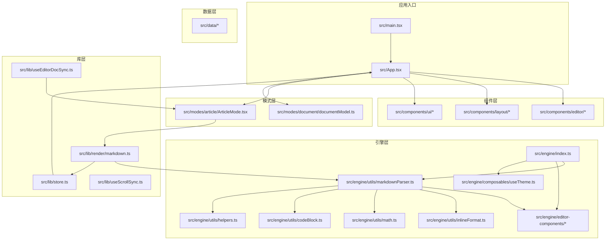
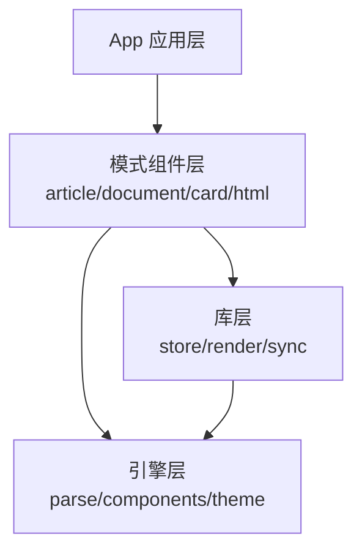
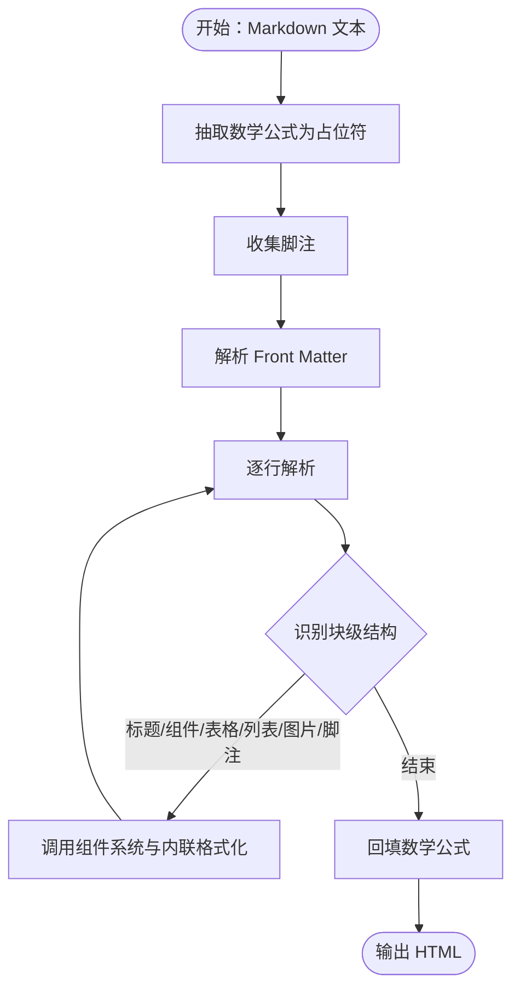
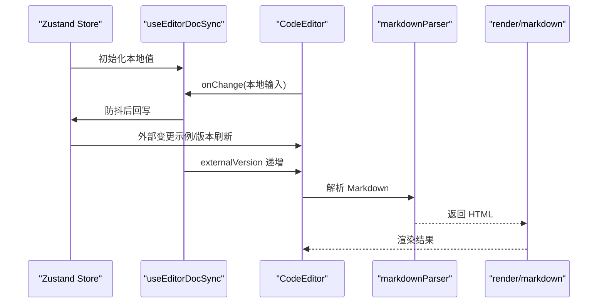
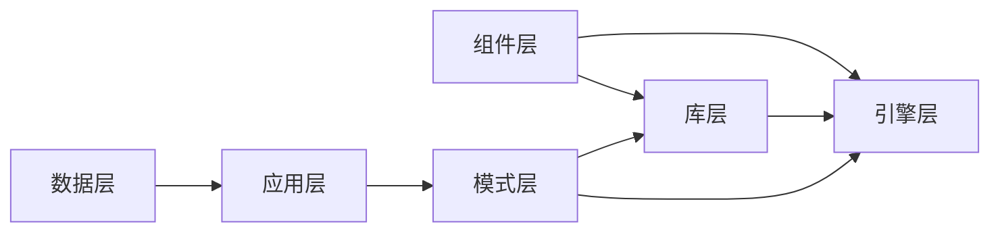

# 目录结构设计

<cite>
**本文档引用的文件**
- [src/App.tsx](file://src/App.tsx)
- [src/main.tsx](file://src/main.tsx)
- [src/engine/index.ts](file://src/engine/index.ts)
- [src/engine/utils/markdownParser.ts](file://src/engine/utils/markdownParser.ts)
- [src/engine/utils/inlineFormat.ts](file://src/engine/utils/inlineFormat.ts)
- [src/engine/utils/math.ts](file://src/engine/utils/math.ts)
- [src/engine/utils/codeBlock.ts](file://src/engine/utils/codeBlock.ts)
- [src/engine/utils/helpers.ts](file://src/engine/utils/helpers.ts)
- [src/engine/editor-components/index.ts](file://src/engine/editor-components/index.ts)
- [src/engine/composables/useTheme.ts](file://src/engine/composables/useTheme.ts)
- [src/lib/store.ts](file://src/lib/store.ts)
- [src/lib/render/markdown.ts](file://src/lib/render/markdown.ts)
- [src/lib/useEditorDocSync.ts](file://src/lib/useEditorDocSync.ts)
- [src/lib/useScrollSync.ts](file://src/lib/useScrollSync.ts)
- [src/components/editor/CodeEditor.tsx](file://src/components/editor/CodeEditor.tsx)
- [src/components/layout/ModeTabs.tsx](file://src/components/layout/ModeTabs.tsx)
- [src/components/ui/Button.tsx](file://src/components/ui/Button.tsx)
- [src/components/ui/Input.tsx](file://src/components/ui/Input.tsx)
- [src/components/ui/Select.tsx](file://src/components/ui/Select.tsx)
- [src/components/ui/Toast.tsx](file://src/components/ui/Toast.tsx)
- [src/modes/article/ArticleMode.tsx](file://src/modes/article/ArticleMode.tsx)
- [src/modes/document/documentModel.ts](file://src/modes/document/documentModel.ts)
- [src/data/demoArticle.ts](file://src/data/demoArticle.ts)
- [src/data/demoDocument.ts](file://src/data/demoDocument.ts)
- [src/data/demoCard.ts](file://src/data/demoCard.ts)
- [src/data/demoHtml.ts](file://src/data/demoHtml.ts)
- [package.json](file://package.json)
</cite>

## 目录

1. [简介](#简介)
2. [项目结构](#项目结构)
3. [核心组件](#核心组件)
4. [架构总览](#架构总览)
5. [详细组件分析](#详细组件分析)
6. [依赖关系分析](#依赖关系分析)
7. [性能考量](#性能考量)
8. [故障排查指南](#故障排查指南)
9. [结论](#结论)

## 简介
本文件系统性梳理 MarkFlow 的目录结构设计，重点阐释以下方面：
- src/components 目录下可复用 UI 组件的组织原则：编辑器组件、布局组件与基础 UI 组件的分类与职责边界。
- src/engine 目录的渲染引擎架构：解析器、组件系统与工具函数的职责划分及协作方式。
- src/lib 目录的工具函数库设计：状态管理、渲染与导出相关的模块化组织。
- src/modes 目录的多场景编辑模式实现思路与数据模型。
- src/data 目录的数据管理策略与示例内容版本控制。

## 项目结构
项目采用“按功能域分层 + 按职责细分”的组织方式：
- src/components：可复用 UI 组件库，分为 editor、layout、ui 三类，分别服务于编辑器能力、页面布局与通用基础 UI。
- src/engine：渲染引擎，提供解析器、组件系统与工具函数，输出纯 TS 且与框架无关的能力。
- src/lib：应用级工具函数库，包含状态管理、渲染桥接、编辑器同步与滚动同步等。
- src/modes：多场景编辑模式，每个模式独立封装 UI 与数据模型。
- src/data：示例内容与提示词，配合版本控制实现“示例内容同步”。

图表来源
- [src/main.tsx:1-12](file://src/main.tsx#L1-L12)
- [src/App.tsx:1-172](file://src/App.tsx#L1-L172)
- [src/engine/index.ts:1-16](file://src/engine/index.ts#L1-L16)
- [src/lib/render/markdown.ts:1-16](file://src/lib/render/markdown.ts#L1-L16)
- [src/modes/article/ArticleMode.tsx:1-55](file://src/modes/article/ArticleMode.tsx#L1-L55)

章节来源
- [src/main.tsx:1-12](file://src/main.tsx#L1-L12)
- [src/App.tsx:1-172](file://src/App.tsx#L1-L172)

## 核心组件
本节聚焦于各目录的核心职责与关键文件：

- 组件层（src/components）
  - 编辑器组件：CodeEditor、EditorToolbar、SettingsModal 等，负责 Markdown/HTML 编辑体验与图片处理。
  - 布局组件：ModeTabs，负责模式切换与顶部导航。
  - 基础 UI 组件：Button、Input、Select、Toast 等，提供通用交互元素。

- 引擎层（src/engine）
  - 对外统一出口：engine/index.ts 汇聚解析器、组件系统与主题工具。
  - 解析器：markdownParser.ts 实现 Markdown 到 HTML 的转换，内置多种块级组件解析与内联格式化。
  - 组件系统：editor-components/index.ts 定义组件注册中心与索引映射。
  - 工具函数：inlineFormat、math、codeBlock、helpers 等支撑解析与渲染。

- 库层（src/lib）
  - 状态管理：store.ts 提供全局状态与持久化，含示例内容版本与脏标记。
  - 渲染桥接：render/markdown.ts 将 Markdown 渲染为 HTML 并提取元信息。
  - 编辑器同步：useEditorDocSync.ts 实现 store 与编辑器的双向同步与去回声。
  - 滚动同步：useScrollSync.ts 实现编辑器与预览区域的滚动联动。

- 模式层（src/modes）
  - article：ArticleMode.tsx 提供双栏编辑与预览，集成滚动同步与编辑器同步。
  - document：documentModel.ts 定义文档块、分页与字体字号等设置模型。

- 数据层（src/data）
  - demoArticle、demoDocument、demoCard、demoHtml 等示例内容，配合 DEMO_VERSION 实现版本驱动的示例同步。

章节来源
- [src/components/editor/CodeEditor.tsx:1-245](file://src/components/editor/CodeEditor.tsx#L1-L245)
- [src/components/layout/ModeTabs.tsx](file://src/components/layout/ModeTabs.tsx)
- [src/components/ui/Button.tsx](file://src/components/ui/Button.tsx)
- [src/components/ui/Input.tsx](file://src/components/ui/Input.tsx)
- [src/components/ui/Select.tsx](file://src/components/ui/Select.tsx)
- [src/components/ui/Toast.tsx](file://src/components/ui/Toast.tsx)
- [src/engine/index.ts:1-16](file://src/engine/index.ts#L1-L16)
- [src/engine/utils/markdownParser.ts:1-605](file://src/engine/utils/markdownParser.ts#L1-L605)
- [src/engine/editor-components/index.ts:1-81](file://src/engine/editor-components/index.ts#L1-L81)
- [src/engine/composables/useTheme.ts:1-68](file://src/engine/composables/useTheme.ts#L1-L68)
- [src/lib/store.ts:1-242](file://src/lib/store.ts#L1-L242)
- [src/lib/render/markdown.ts:1-16](file://src/lib/render/markdown.ts#L1-L16)
- [src/lib/useEditorDocSync.ts:1-50](file://src/lib/useEditorDocSync.ts#L1-L50)
- [src/lib/useScrollSync.ts](file://src/lib/useScrollSync.ts)
- [src/modes/article/ArticleMode.tsx:1-55](file://src/modes/article/ArticleMode.tsx#L1-L55)
- [src/modes/document/documentModel.ts:1-328](file://src/modes/document/documentModel.ts#L1-L328)
- [src/data/demoArticle.ts](file://src/data/demoArticle.ts)
- [src/data/demoDocument.ts](file://src/data/demoDocument.ts)
- [src/data/demoCard.ts](file://src/data/demoCard.ts)
- [src/data/demoHtml.ts](file://src/data/demoHtml.ts)

## 架构总览
整体架构遵循“引擎无关 + 应用层编排”的设计：
- 引擎层提供纯 TS 的解析与组件渲染能力，不依赖 React/Vue 等前端框架。
- 应用层通过 store 管理状态、通过模式组件编排 UI，并通过渲染桥接调用引擎。
- 组件层提供可复用 UI，编辑器组件与布局组件解耦，便于扩展与测试。

图表来源
- [src/App.tsx:35-171](file://src/App.tsx#L35-L171)
- [src/modes/article/ArticleMode.tsx:16-54](file://src/modes/article/ArticleMode.tsx#L16-L54)
- [src/lib/render/markdown.ts:9-15](file://src/lib/render/markdown.ts#L9-L15)
- [src/engine/index.ts:1-16](file://src/engine/index.ts#L1-L16)

## 详细组件分析

### 组件层组织原则
- 编辑器组件（src/components/editor）
  - 职责：提供 Markdown/HTML 编辑体验，处理图片粘贴/拖拽、语言高亮、快捷键与工具栏。
  - 关键点：CodeEditor 采用“挂载时受控、之后非受控”的策略，避免受控全量替换导致的输入竞态；图片上传支持 SM.MS、OSS、COS 与本地 IndexedDB。
- 布局组件（src/components/layout）
  - 职责：页面级布局与导航，如 ModeTabs 负责模式切换。
- 基础 UI 组件（src/components/ui）
  - 职责：通用交互元素，如 Button、Input、Select、Toast，保持最小职责与可组合性。

章节来源
- [src/components/editor/CodeEditor.tsx:53-244](file://src/components/editor/CodeEditor.tsx#L53-L244)
- [src/components/layout/ModeTabs.tsx](file://src/components/layout/ModeTabs.tsx)
- [src/components/ui/Button.tsx](file://src/components/ui/Button.tsx)
- [src/components/ui/Input.tsx](file://src/components/ui/Input.tsx)
- [src/components/ui/Select.tsx](file://src/components/ui/Select.tsx)
- [src/components/ui/Toast.tsx](file://src/components/ui/Toast.tsx)

### 渲染引擎架构（src/engine）
- 统一出口（engine/index.ts）
  - 导出解析器、内联格式化、数学公式处理、代码块渲染、组件系统与主题工具。
- 解析器（markdownParser.ts）
  - 职责：将 Markdown 文本转换为 HTML，支持多种块级组件（标题、步骤、时间线、轮播、对比、公告、引述等）、表格、列表、图片与脚注等。
  - 流程：先抽取数学公式占位，再逐行解析，调用组件系统与内联格式化工具，最后回填数学公式。
- 组件系统（editor-components/index.ts）
  - 职责：定义组件注册中心，提供组件定义、按 id/tag 索引，统一 render 接口。
- 工具函数（utils/*）
  - inlineFormat：内联格式化（加粗、删除线、高亮等）。
  - math：数学公式抽取与回填。
  - codeBlock：代码块渲染。
  - helpers：通用辅助函数（如属性解析、转义等）。
- 主题（composables/useTheme.ts）
  - 职责：提供主题色集合与颜色计算工具，生成 ThemeColors 结构。

图表来源
- [src/engine/utils/markdownParser.ts:110-604](file://src/engine/utils/markdownParser.ts#L110-L604)

章节来源
- [src/engine/index.ts:1-16](file://src/engine/index.ts#L1-L16)
- [src/engine/utils/markdownParser.ts:1-605](file://src/engine/utils/markdownParser.ts#L1-L605)
- [src/engine/editor-components/index.ts:1-81](file://src/engine/editor-components/index.ts#L1-L81)
- [src/engine/composables/useTheme.ts:1-68](file://src/engine/composables/useTheme.ts#L1-L68)

### 工具函数库（src/lib）
- 状态管理（store.ts）
  - 职责：集中管理文章/文档/卡片/HTML 内容、模式、平台、主题、字体与图床配置；支持持久化与版本驱动的示例同步。
  - 关键机制：DEMO_VERSION 控制示例覆盖策略；dirty 标记保护用户已编辑内容。
- 渲染桥接（render/markdown.ts）
  - 职责：提取内容元信息并调用引擎解析器生成 HTML。
- 编辑器同步（useEditorDocSync.ts）
  - 职责：实现 store 与编辑器的双向同步，防抖回写，去回声，外部重置信号。
- 滚动同步（useScrollSync.ts）
  - 职责：编辑器与预览区域滚动联动。

图表来源
- [src/lib/store.ts:163-241](file://src/lib/store.ts#L163-L241)
- [src/lib/useEditorDocSync.ts:20-49](file://src/lib/useEditorDocSync.ts#L20-L49)
- [src/components/editor/CodeEditor.tsx:60-112](file://src/components/editor/CodeEditor.tsx#L60-L112)
- [src/lib/render/markdown.ts:9-15](file://src/lib/render/markdown.ts#L9-L15)
- [src/engine/utils/markdownParser.ts:110-604](file://src/engine/utils/markdownParser.ts#L110-L604)

章节来源
- [src/lib/store.ts:1-242](file://src/lib/store.ts#L1-L242)
- [src/lib/render/markdown.ts:1-16](file://src/lib/render/markdown.ts#L1-L16)
- [src/lib/useEditorDocSync.ts:1-50](file://src/lib/useEditorDocSync.ts#L1-L50)
- [src/lib/useScrollSync.ts](file://src/lib/useScrollSync.ts)

### 多场景编辑模式（src/modes）
- article 模式（ArticleMode.tsx）
  - 职责：双栏编辑与预览，集成滚动同步与编辑器同步，支持主题色传递。
- document 模式（documentModel.ts）
  - 职责：定义文档块类型、分页算法与页面设置模型，支持字体、字号、页边距与页眉页脚等配置。
- card/html 模式
  - 职责：卡片与 HTML 可视化模式的 UI 与数据模型，与 App 的模式切换逻辑协同。

章节来源
- [src/modes/article/ArticleMode.tsx:1-55](file://src/modes/article/ArticleMode.tsx#L1-L55)
- [src/modes/document/documentModel.ts:1-328](file://src/modes/document/documentModel.ts#L1-L328)
- [src/App.tsx:13-16](file://src/App.tsx#L13-L16)

### 数据管理策略（src/data）
- 示例内容版本控制：DEMO_VERSION 用于“老用户”在版本更新时自动获取最新示例，但不覆盖用户已编辑内容。
- 示例内容集合：App 在挂载时接收 DEMOS 对象，避免 store 直接依赖示例文件，降低耦合。

章节来源
- [src/lib/store.ts:28-31](file://src/lib/store.ts#L28-L31)
- [src/lib/store.ts:194-214](file://src/lib/store.ts#L194-L214)
- [src/App.tsx:26-32](file://src/App.tsx#L26-L32)

## 依赖关系分析
- 组件层依赖库层与引擎层：编辑器组件依赖 store 与图片上传工具；布局组件依赖主题与模式切换；基础 UI 组件保持无状态。
- 引擎层与应用层解耦：引擎仅提供纯 TS 能力，应用层通过渲染桥接调用。
- 模式层依赖库层与引擎层：ArticleMode 依赖渲染桥接与同步工具；document 模式依赖文档模型与设置。

图表来源
- [src/App.tsx:35-171](file://src/App.tsx#L35-L171)
- [src/lib/render/markdown.ts:1-16](file://src/lib/render/markdown.ts#L1-L16)
- [src/engine/index.ts:1-16](file://src/engine/index.ts#L1-L16)

章节来源
- [src/App.tsx:1-172](file://src/App.tsx#L1-L172)
- [package.json:13-31](file://package.json#L13-L31)

## 性能考量
- 编辑器输入优化：CodeEditor 采用“挂载时受控、之后非受控”，避免受控全量替换引发的输入抖动与 IME 组合输入问题。
- 渲染防抖：useEditorDocSync 对本地输入进行防抖，减少回写频率与渲染压力。
- 模块预加载：代码语言数据在编辑器挂载前预加载，避免运行时异步加载导致的重新配置与输入丢失。
- 数学公式与脚注：先抽取占位再回填，避免解析过程中的额外开销与错误。
- 分页与估算：document 模式基于块级高度估算与实际测量结合，平衡准确性与性能。

## 故障排查指南
- 编辑器内容不同步
  - 检查 useEditorDocSync 的 externalVersion 是否正确递增，确认去回声逻辑生效。
  - 确认 store 的 setXXXMarkdown 是否被调用且与 lastWrittenRef 不冲突。
- 图片粘贴/拖拽失败
  - 检查 imageHostConfig 的 activeType 与对应凭据是否配置正确。
  - 查看 compressImage、uploadToSmMs、uploadToOss、uploadToCos 的异常日志。
- 渲染结果异常
  - 确认 markdownParser 的数学公式抽取与回填流程是否完整。
  - 检查组件系统中对应组件的 render 方法是否正确处理属性与主题色。
- 示例内容未更新
  - 确认 DEMO_VERSION 是否递增，且 syncDemoContent 仅在版本变化时覆盖未编辑字段。

章节来源
- [src/lib/useEditorDocSync.ts:15-49](file://src/lib/useEditorDocSync.ts#L15-L49)
- [src/components/editor/CodeEditor.tsx:114-184](file://src/components/editor/CodeEditor.tsx#L114-L184)
- [src/engine/utils/markdownParser.ts:110-604](file://src/engine/utils/markdownParser.ts#L110-L604)
- [src/lib/store.ts:194-214](file://src/lib/store.ts#L194-L214)

## 结论
本项目通过清晰的目录分层与职责划分，实现了“引擎无关 + 应用层编排”的架构优势：
- 引擎层专注于解析与组件渲染，具备良好的可移植性与可测试性。
- 应用层通过 store 与模式组件编排 UI，组件层提供可复用的基础能力。
- 数据层通过版本控制与脏标记保障示例内容的平滑演进与用户内容安全。
- 渲染链路从编辑器到引擎再到预览，配合同步与滚动联动，提供了流畅的编辑体验。