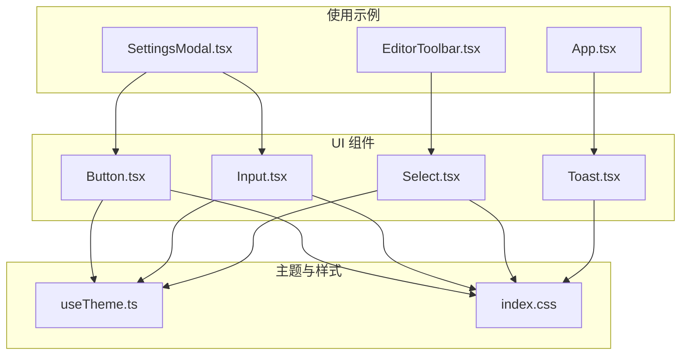
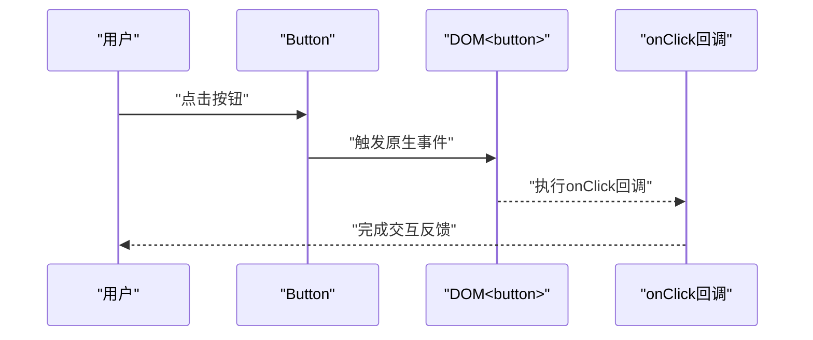
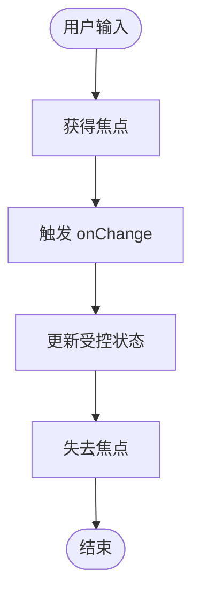
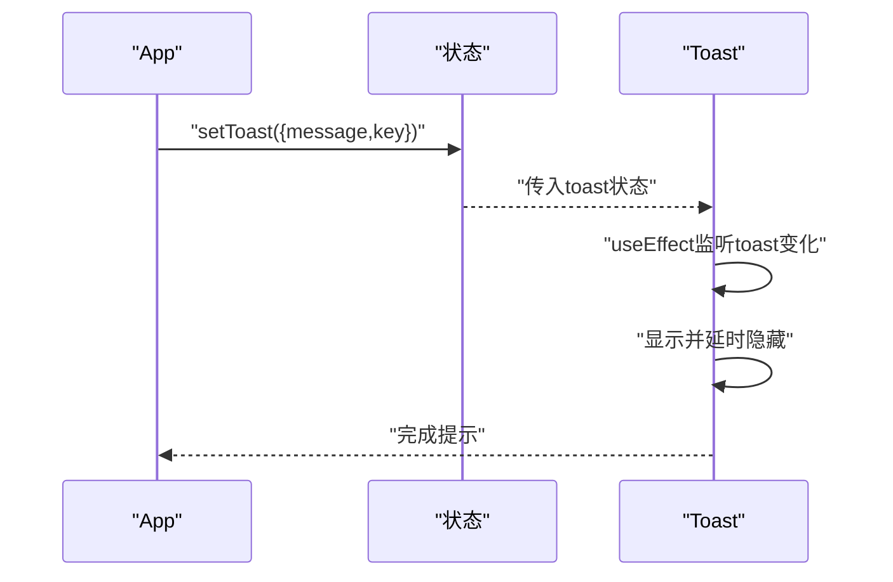
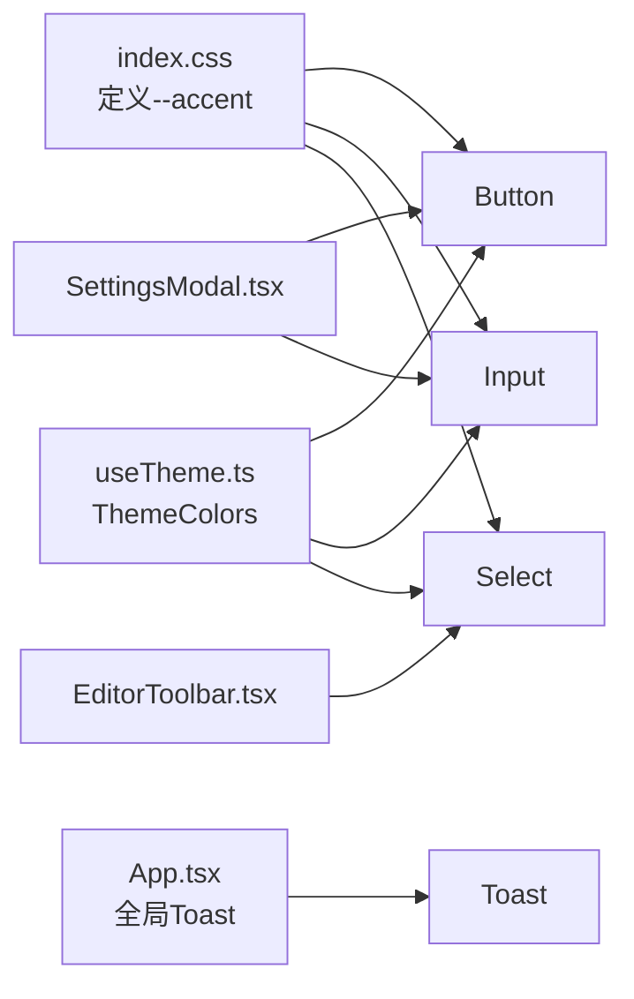

# 基础UI组件

<cite>
**本文引用的文件**
- [Button.tsx](file://src/components/ui/Button.tsx)
- [Input.tsx](file://src/components/ui/Input.tsx)
- [Select.tsx](file://src/components/ui/Select.tsx)
- [Toast.tsx](file://src/components/ui/Toast.tsx)
- [useTheme.ts](file://src/engine/composables/useTheme.ts)
- [index.css](file://src/index.css)
- [SettingsModal.tsx](file://src/components/editor/SettingsModal.tsx)
- [EditorToolbar.tsx](file://src/components/editor/EditorToolbar.tsx)
- [App.tsx](file://src/App.tsx)
</cite>

## 目录
1. [简介](#简介)
2. [项目结构](#项目结构)
3. [核心组件](#核心组件)
4. [架构总览](#架构总览)
5. [详细组件分析](#详细组件分析)
6. [依赖关系分析](#依赖关系分析)
7. [性能考量](#性能考量)
8. [故障排查指南](#故障排查指南)
9. [结论](#结论)
10. [附录](#附录)

## 简介
本文件聚焦于基础UI组件的设计与实现，涵盖 Button、Input、Select、Toast 四个组件。内容包括：
- 设计理念与实现要点
- Props 接口设计（属性定义、默认值、类型约束）
- 事件处理机制（onClick、onChange 等）
- 样式系统集成（Tailwind CSS 类名与主题适配）
- 使用示例与最佳实践

## 项目结构
基础UI组件位于 src/components/ui 下，围绕 React 函数组件与 forwardRef 构建，统一通过 Tailwind CSS 类名实现视觉一致性，并借助主题变量实现色彩适配。



图表来源
- [Button.tsx:1-35](file://src/components/ui/Button.tsx#L1-L35)
- [Input.tsx:1-14](file://src/components/ui/Input.tsx#L1-L14)
- [Select.tsx:1-14](file://src/components/ui/Select.tsx#L1-L14)
- [Toast.tsx:1-34](file://src/components/ui/Toast.tsx#L1-L34)
- [useTheme.ts:1-68](file://src/engine/composables/useTheme.ts#L1-L68)
- [index.css:1-288](file://src/index.css#L1-L288)
- [App.tsx:1-172](file://src/App.tsx#L1-L172)
- [SettingsModal.tsx:1-191](file://src/components/editor/SettingsModal.tsx#L1-L191)
- [EditorToolbar.tsx:76-106](file://src/components/editor/EditorToolbar.tsx#L76-L106)

章节来源
- [Button.tsx:1-35](file://src/components/ui/Button.tsx#L1-L35)
- [Input.tsx:1-14](file://src/components/ui/Input.tsx#L1-L14)
- [Select.tsx:1-14](file://src/components/ui/Select.tsx#L1-L14)
- [Toast.tsx:1-34](file://src/components/ui/Toast.tsx#L1-L34)
- [useTheme.ts:1-68](file://src/engine/composables/useTheme.ts#L1-L68)
- [index.css:1-288](file://src/index.css#L1-L288)
- [App.tsx:1-172](file://src/App.tsx#L1-L172)
- [SettingsModal.tsx:1-191](file://src/components/editor/SettingsModal.tsx#L1-L191)
- [EditorToolbar.tsx:76-106](file://src/components/editor/EditorToolbar.tsx#L76-L106)

## 核心组件
本节概述四个基础组件的职责与共同特性：
- Button：提供多变体与尺寸的按钮，支持原生 button 属性透传
- Input：提供基础输入框，支持原生 input 属性透传
- Select：提供基础选择器，支持原生 select 属性透传
- Toast：全局轻提示，基于状态驱动显示/隐藏

章节来源
- [Button.tsx:1-35](file://src/components/ui/Button.tsx#L1-L35)
- [Input.tsx:1-14](file://src/components/ui/Input.tsx#L1-L14)
- [Select.tsx:1-14](file://src/components/ui/Select.tsx#L1-L14)
- [Toast.tsx:1-34](file://src/components/ui/Toast.tsx#L1-L34)

## 架构总览
组件与主题、样式的关系如下：

```mermaid
classDiagram
class Button {
+variant : "primary"|"outline"|"ghost"
+size : "sm"|"md"
+...ButtonHTMLAttributes
}
class Input {
+...InputHTMLAttributes
}
class Select {
+...SelectHTMLAttributes
}
class Toast {
+toast : {message : string,key : number}|null
}
class ThemeColors {
+accent : string
+dark : string
+light : string
+border : string
+rgb : string
}
class CSSVars {
+--accent : string
+--accent-dark : string
}
Button --> ThemeColors : "使用主题"
Input --> ThemeColors : "使用主题"
Select --> ThemeColors : "使用主题"
Button --> CSSVars : "读取CSS变量"
Input --> CSSVars : "读取CSS变量"
Select --> CSSVars : "读取CSS变量"
Toast --> CSSVars : "使用固定深色背景"
```

图表来源
- [Button.tsx:3-6](file://src/components/ui/Button.tsx#L3-L6)
- [Input.tsx:3-3](file://src/components/ui/Input.tsx#L3-L3)
- [Select.tsx:3-3](file://src/components/ui/Select.tsx#L3-L3)
- [Toast.tsx:3-7](file://src/components/ui/Toast.tsx#L3-L7)
- [useTheme.ts:4-10](file://src/engine/composables/useTheme.ts#L4-L10)
- [index.css:3-7](file://src/index.css#L3-L7)

## 详细组件分析

### Button 组件
- 设计理念
  - 通过 variants 与 sizes 实现统一风格下的多态表现
  - 基于 CSS 变量与 Tailwind 类名组合，确保主题一致
  - 保持与原生 button 的属性透传，便于无障碍与可访问性
- Props 接口
  - 继承原生 ButtonHTMLAttributes
  - 新增属性
    - variant: "primary"|"outline"|"ghost"（默认 "outline"）
    - size: "sm"|"md"（默认 "sm"）
- 默认值与类型约束
  - className 默认空字符串，允许外部追加类名
  - 通过联合类型限定 variant 与 size 的取值范围
- 事件处理
  - 支持 onClick 等原生事件回调
  - 通过 props 透传至底层 button 元素
- 样式系统集成
  - 基础类名包含对焦、禁用态等通用规则
  - 变体与尺寸映射到 Tailwind 类名，最终与外部 className 合并
  - 主色通过 CSS 变量 --accent 注入，保证主题一致
- 使用示例与最佳实践
  - 在设置弹窗中作为“取消/保存”等操作按钮
  - 在工具栏中作为图标按钮使用
  - 建议优先使用 outline 作为默认外观，primary 强调关键动作，ghost 用于弱化操作



图表来源
- [Button.tsx:25-31](file://src/components/ui/Button.tsx#L25-L31)
- [SettingsModal.tsx:184-185](file://src/components/editor/SettingsModal.tsx#L184-L185)
- [EditorToolbar.tsx:82-93](file://src/components/editor/EditorToolbar.tsx#L82-L93)

章节来源
- [Button.tsx:1-35](file://src/components/ui/Button.tsx#L1-L35)
- [SettingsModal.tsx:184-185](file://src/components/editor/SettingsModal.tsx#L184-L185)
- [EditorToolbar.tsx:82-93](file://src/components/editor/EditorToolbar.tsx#L82-L93)

### Input 组件
- 设计理念
  - 最小可用输入框，强调可访问性与一致性
  - 通过 focus 边框高亮与禁用态降权，提升交互反馈
- Props 接口
  - 继承原生 InputHTMLAttributes
- 默认值与类型约束
  - className 默认空字符串，支持原生 input 所有属性透传
- 事件处理
  - onChange、onFocus、onBlur 等原生事件通过 props 透传
- 样式系统集成
  - 使用 Tailwind 类名控制尺寸、边框、文字与禁用态
  - focus 时边框色绑定 CSS 变量 --accent，确保主题一致
- 使用示例与最佳实践
  - 在设置弹窗中输入敏感信息（如密码）
  - 与标签配合使用，明确语义
  - 建议在表单中统一使用该 Input，避免视觉割裂



图表来源
- [Input.tsx:5-11](file://src/components/ui/Input.tsx#L5-L11)
- [SettingsModal.tsx:119-125](file://src/components/editor/SettingsModal.tsx#L119-L125)

章节来源
- [Input.tsx:1-14](file://src/components/ui/Input.tsx#L1-L14)
- [SettingsModal.tsx:119-125](file://src/components/editor/SettingsModal.tsx#L119-L125)

### Select 组件
- 设计理念
  - 提供简洁的选择器，保持与原生 select 的行为一致
  - 通过 focus 时边框高亮与禁用态降权，提升可访问性
- Props 接口
  - 继承原生 SelectHTMLAttributes
- 默认值与类型约束
  - className 默认空字符串，支持原生 select 所有属性透传
- 事件处理
  - onChange、onFocus、onBlur 等原生事件通过 props 透传
- 样式系统集成
  - 使用 Tailwind 类名控制尺寸、边框、文字与禁用态
  - focus 时边框色绑定 CSS 变量 --accent，确保主题一致
- 使用示例与最佳实践
  - 在工具栏中进行格式或选项切换
  - 建议与 label 配合使用，明确语义
  - 建议在复杂场景使用前考虑自绘 Select 以增强定制性

```mermaid
sequenceDiagram
participant U as "用户"
participant SEL as "Select"
participant DOM as "DOM<select>"
participant CB as "onChange回调"
U->>SEL : "选择选项"
SEL->>DOM : "触发原生事件"
DOM-->>CB : "执行onChange回调"
CB-->>U : "完成状态更新"
```



图表来源
- [Select.tsx:5-11](file://src/components/ui/Select.tsx#L5-L11)
- [EditorToolbar.tsx:96-106](file://src/components/editor/EditorToolbar.tsx#L96-L106)

章节来源
- [Select.tsx:1-14](file://src/components/ui/Select.tsx#L1-L14)
- [EditorToolbar.tsx:96-106](file://src/components/editor/EditorToolbar.tsx#L96-L106)

### Toast 组件
- 设计理念
  - 轻量级全局提示，自动出现与消失，避免阻断用户流程
  - 底部居中显示，使用过渡动画提升体验
- Props 接口
  - toast: { message: string; key: number } | null
- 默认值与类型约束
  - 无默认值，需由父组件传入状态
- 事件处理
  - 无显式事件回调；内部通过副作用控制显示/隐藏
- 样式系统集成
  - 使用 Tailwind 类名控制定位、圆角、阴影与文本样式
  - 使用固定深色背景与半透明白字，确保可读性
- 使用示例与最佳实践
  - 在应用顶层统一挂载，通过全局状态触发
  - 通过 key 或 message 的变化驱动重新渲染，支持相同消息重复弹出
  - 建议在关键操作后（如保存成功、恢复示例）使用



图表来源
- [Toast.tsx:10-18](file://src/components/ui/Toast.tsx#L10-L18)
- [App.tsx:60-61](file://src/App.tsx#L60-L61)
- [App.tsx:168-168](file://src/App.tsx#L168-L168)

章节来源
- [Toast.tsx:1-34](file://src/components/ui/Toast.tsx#L1-L34)
- [App.tsx:60-61](file://src/App.tsx#L60-L61)
- [App.tsx:168-168](file://src/App.tsx#L168-L168)

## 依赖关系分析
- 组件依赖
  - Button、Input、Select 均依赖 Tailwind 类名与 CSS 变量 --accent
  - Toast 不依赖主题变量，但依赖全局状态
- 主题与样式
  - CSS 变量 --accent 在根节点定义，组件通过类名读取
  - useTheme.ts 提供主题色类型与工具函数，供渲染引擎使用
- 使用点
  - App.tsx 统一挂载 Toast 并提供全局提示方法
  - SettingsModal.tsx 使用 Button 与 Input
  - EditorToolbar.tsx 使用 Select



图表来源
- [index.css:3-7](file://src/index.css#L3-L7)
- [useTheme.ts:4-10](file://src/engine/composables/useTheme.ts#L4-L10)
- [Button.tsx:10-23](file://src/components/ui/Button.tsx#L10-L23)
- [Input.tsx:7-8](file://src/components/ui/Input.tsx#L7-L8)
- [Select.tsx:7-8](file://src/components/ui/Select.tsx#L7-L8)
- [App.tsx:60-61](file://src/App.tsx#L60-L61)
- [Toast.tsx:10-18](file://src/components/ui/Toast.tsx#L10-L18)
- [SettingsModal.tsx:3-4](file://src/components/editor/SettingsModal.tsx#L3-L4)
- [EditorToolbar.tsx:96-106](file://src/components/editor/EditorToolbar.tsx#L96-L106)

章节来源
- [index.css:1-288](file://src/index.css#L1-L288)
- [useTheme.ts:1-68](file://src/engine/composables/useTheme.ts#L1-L68)
- [Button.tsx:1-35](file://src/components/ui/Button.tsx#L1-L35)
- [Input.tsx:1-14](file://src/components/ui/Input.tsx#L1-L14)
- [Select.tsx:1-14](file://src/components/ui/Select.tsx#L1-L14)
- [Toast.tsx:1-34](file://src/components/ui/Toast.tsx#L1-L34)
- [App.tsx:1-172](file://src/App.tsx#L1-L172)
- [SettingsModal.tsx:1-191](file://src/components/editor/SettingsModal.tsx#L1-L191)
- [EditorToolbar.tsx:76-106](file://src/components/editor/EditorToolbar.tsx#L76-L106)

## 性能考量
- 组件均为函数组件，无复杂计算，渲染开销低
- Button、Input、Select 通过 className 合并与 Tailwind 工具类组合，避免额外 JS 计算
- Toast 使用 useEffect 控制显示/隐藏，生命周期短，内存占用极低
- 建议在频繁触发的交互中避免频繁重建组件实例，优先使用受控状态与 key 策略

## 故障排查指南
- 主题色不生效
  - 检查 CSS 变量 --accent 是否在根节点定义
  - 确认组件类名中是否正确引用了 --accent
- 禁用态样式异常
  - 确认禁用态类名是否被覆盖
  - 检查 className 传入顺序与合并逻辑
- Toast 不显示
  - 确认传入的 toast 对象非空且 key/message 更新
  - 检查 App.tsx 中是否正确挂载 Toast
- 事件未触发
  - 确认 props 是否正确透传至原生 DOM 元素
  - 检查 onClick/onFocus/onBlur 等回调是否在父组件中绑定

章节来源
- [index.css:3-7](file://src/index.css#L3-L7)
- [Button.tsx:10-23](file://src/components/ui/Button.tsx#L10-L23)
- [Input.tsx:7-8](file://src/components/ui/Input.tsx#L7-L8)
- [Select.tsx:7-8](file://src/components/ui/Select.tsx#L7-L8)
- [Toast.tsx:10-18](file://src/components/ui/Toast.tsx#L10-L18)
- [App.tsx:60-61](file://src/App.tsx#L60-L61)

## 结论
四个基础组件以最小实现达成一致的视觉与交互体验，通过 CSS 变量与 Tailwind 类名实现主题适配与样式一致性。在实际使用中，建议遵循以下原则：
- 优先使用统一的 Input/Select/Button
- 通过 props 透传原生事件，确保可访问性
- 使用 Toast 提供即时反馈，避免打断用户流程
- 在复杂场景中，结合主题系统与样式规范扩展组件

## 附录
- 使用示例路径
  - 设置弹窗中使用 Button 与 Input：[SettingsModal.tsx:119-125](file://src/components/editor/SettingsModal.tsx#L119-L125)，[SettingsModal.tsx:184-185](file://src/components/editor/SettingsModal.tsx#L184-L185)
  - 工具栏中使用 Select：[EditorToolbar.tsx:96-106](file://src/components/editor/EditorToolbar.tsx#L96-L106)
  - 应用层统一挂载 Toast 并触发：[App.tsx:60-61](file://src/App.tsx#L60-L61)，[App.tsx:168-168](file://src/App.tsx#L168-L168)
- 主题与样式参考
  - CSS 变量定义：[index.css:3-7](file://src/index.css#L3-L7)
  - 主题类型与工具函数：[useTheme.ts:4-10](file://src/engine/composables/useTheme.ts#L4-L10)，[useTheme.ts:59-67](file://src/engine/composables/useTheme.ts#L59-L67)