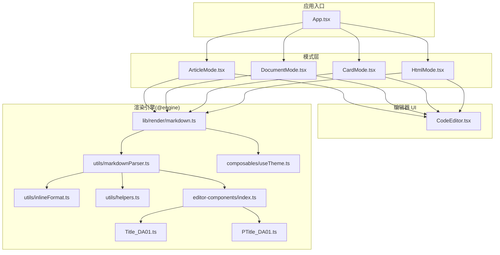
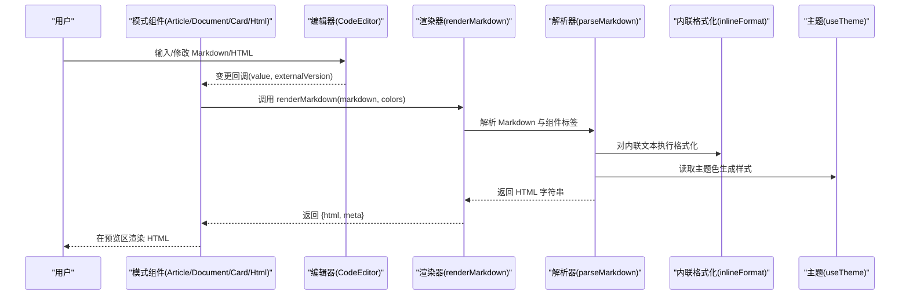
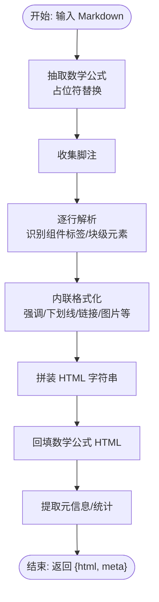
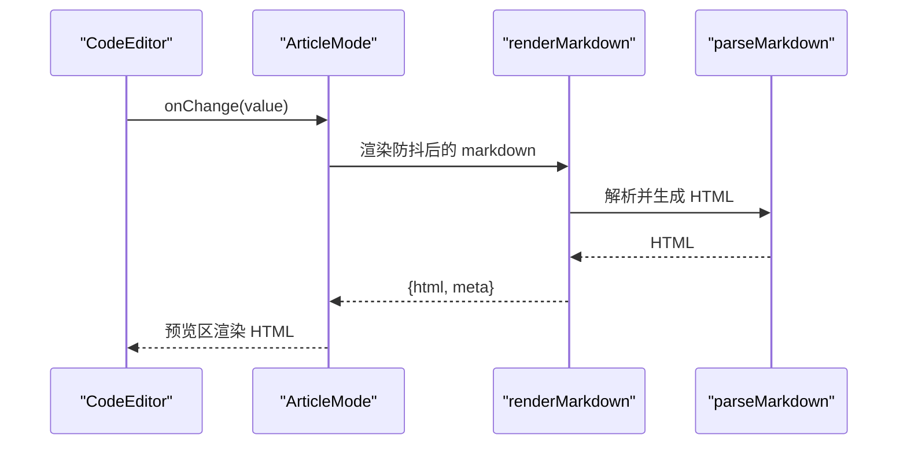
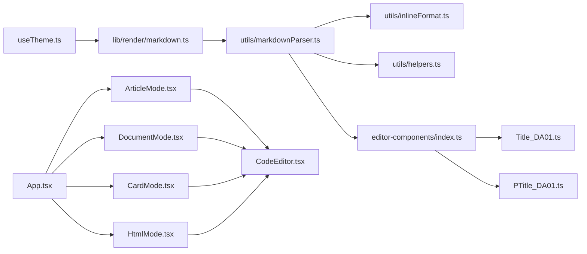

# 编辑器组件库

<cite>
**本文引用的文件**
- [src/engine/editor-components/index.ts](file://src/engine/editor-components/index.ts)
- [src/engine/editor-components/Title_DA01.ts](file://src/engine/editor-components/Title_DA01.ts)
- [src/engine/editor-components/PTitle_DA01.ts](file://src/engine/editor-components/PTitle_DA01.ts)
- [src/engine/utils/markdownParser.ts](file://src/engine/utils/markdownParser.ts)
- [src/engine/utils/inlineFormat.ts](file://src/engine/utils/inlineFormat.ts)
- [src/engine/utils/helpers.ts](file://src/engine/utils/helpers.ts)
- [src/engine/composables/useTheme.ts](file://src/engine/composables/useTheme.ts)
- [src/lib/render/markdown.ts](file://src/lib/render/markdown.ts)
- [src/components/editor/CodeEditor.tsx](file://src/components/editor/CodeEditor.tsx)
- [src/App.tsx](file://src/App.tsx)
- [src/modes/article/ArticleMode.tsx](file://src/modes/article/ArticleMode.tsx)
- [src/modes/document/DocumentMode.tsx](file://src/modes/document/DocumentMode.tsx)
- [src/modes/card/CardMode.tsx](file://src/modes/card/CardMode.tsx)
- [src/modes/html/HtmlMode.tsx](file://src/modes/html/HtmlMode.tsx)
</cite>

## 目录
1. [简介](#简介)
2. [项目结构](#项目结构)
3. [核心组件](#核心组件)
4. [架构总览](#架构总览)
5. [详细组件分析](#详细组件分析)
6. [依赖关系分析](#依赖关系分析)
7. [性能考量](#性能考量)
8. [故障排查指南](#故障排查指南)
9. [结论](#结论)
10. [附录](#附录)

## 简介
本技术文档面向“编辑器组件库”，聚焦 DA 系列组件的命名规范、功能分类、设计模式与架构原理，系统阐述从 Markdown 到 HTML 的渲染链路、富文本格式化规则、组件 API 接口（props、事件、插槽）、以及在不同编辑模式下的使用与集成方式。目标读者既包括前端工程师，也包括需要快速上手的非专业使用者。

## 项目结构
该工程采用“模式驱动 + 渲染引擎”的分层架构：
- 渲染引擎位于 @engine，提供 Markdown 解析、内联格式化、组件注册与主题能力；
- 模式层位于 modes，分别实现文章、文档、卡片、HTML 可视化四种编辑模式；
- 编辑器 UI 位于 components，提供 CodeMirror 编辑器、预览沙箱、UI 控件等；
- lib 提供导出、存储、滚动同步等横切能力。

图表来源
- [src/App.tsx:1-172](file://src/App.tsx#L1-L172)
- [src/modes/article/ArticleMode.tsx:1-55](file://src/modes/article/ArticleMode.tsx#L1-L55)
- [src/modes/document/DocumentMode.tsx:1-345](file://src/modes/document/DocumentMode.tsx#L1-L345)
- [src/modes/card/CardMode.tsx:1-364](file://src/modes/card/CardMode.tsx#L1-L364)
- [src/modes/html/HtmlMode.tsx:1-579](file://src/modes/html/HtmlMode.tsx#L1-L579)
- [src/components/editor/CodeEditor.tsx:1-245](file://src/components/editor/CodeEditor.tsx#L1-L245)
- [src/lib/render/markdown.ts:1-16](file://src/lib/render/markdown.ts#L1-L16)
- [src/engine/utils/markdownParser.ts:1-605](file://src/engine/utils/markdownParser.ts#L1-L605)
- [src/engine/utils/inlineFormat.ts:1-104](file://src/engine/utils/inlineFormat.ts#L1-L104)
- [src/engine/utils/helpers.ts:1-115](file://src/engine/utils/helpers.ts#L1-L115)
- [src/engine/composables/useTheme.ts:1-68](file://src/engine/composables/useTheme.ts#L1-L68)
- [src/engine/editor-components/index.ts:1-81](file://src/engine/editor-components/index.ts#L1-L81)
- [src/engine/editor-components/Title_DA01.ts:1-119](file://src/engine/editor-components/Title_DA01.ts#L1-L119)
- [src/engine/editor-components/PTitle_DA01.ts:1-186](file://src/engine/editor-components/PTitle_DA01.ts#L1-L186)

章节来源
- [src/App.tsx:1-172](file://src/App.tsx#L1-L172)
- [src/modes/article/ArticleMode.tsx:1-55](file://src/modes/article/ArticleMode.tsx#L1-L55)
- [src/modes/document/DocumentMode.tsx:1-345](file://src/modes/document/DocumentMode.tsx#L1-L345)
- [src/modes/card/CardMode.tsx:1-364](file://src/modes/card/CardMode.tsx#L1-L364)
- [src/modes/html/HtmlMode.tsx:1-579](file://src/modes/html/HtmlMode.tsx#L1-L579)

## 核心组件
- 组件注册中心：集中导出所有 DA 系列组件，提供按 id/tag 索引映射，便于解析器与渲染器按标签动态路由到具体组件。
- 组件定义契约：每个组件导出 id、name、tag、attrs、example、render 等字段，render 函数接收 attrs、body、主题色与额外参数，返回内联样式的 HTML 字符串。
- 主题系统：提供预设主题色与工具函数，生成完整的 ThemeColors 结构，贯穿渲染链路。
- Markdown 渲染管线：parseMarkdown 负责抽取数学公式、解析 front-matter、识别块级标签、内联格式化、表格/列表/图片/段落等，最终拼装为 HTML。
- 内联格式化：inlineFormat 实现脚注、强调、下划线、删除线、上/下标、行内代码、图片、链接等富文本规则。
- 编辑器：基于 CodeMirror，支持图片粘贴/拖拽上传、语言切换、快捷键、外部版本强制写入等。

章节来源
- [src/engine/editor-components/index.ts:1-81](file://src/engine/editor-components/index.ts#L1-L81)
- [src/engine/editor-components/Title_DA01.ts:1-119](file://src/engine/editor-components/Title_DA01.ts#L1-L119)
- [src/engine/editor-components/PTitle_DA01.ts:1-186](file://src/engine/editor-components/PTitle_DA01.ts#L1-L186)
- [src/engine/utils/markdownParser.ts:1-605](file://src/engine/utils/markdownParser.ts#L1-L605)
- [src/engine/utils/inlineFormat.ts:1-104](file://src/engine/utils/inlineFormat.ts#L1-L104)
- [src/engine/composables/useTheme.ts:1-68](file://src/engine/composables/useTheme.ts#L1-L68)
- [src/components/editor/CodeEditor.tsx:1-245](file://src/components/editor/CodeEditor.tsx#L1-L245)

## 架构总览
渲染流程从“模式层”进入，经过“渲染引擎”，最终在“预览区域”以 HTML 形式呈现。编辑器负责输入与交互，模式层负责布局、同步与导出。

图表来源
- [src/modes/article/ArticleMode.tsx:1-55](file://src/modes/article/ArticleMode.tsx#L1-L55)
- [src/modes/document/DocumentMode.tsx:1-345](file://src/modes/document/DocumentMode.tsx#L1-L345)
- [src/modes/card/CardMode.tsx:1-364](file://src/modes/card/CardMode.tsx#L1-L364)
- [src/modes/html/HtmlMode.tsx:1-579](file://src/modes/html/HtmlMode.tsx#L1-L579)
- [src/lib/render/markdown.ts:1-16](file://src/lib/render/markdown.ts#L1-L16)
- [src/engine/utils/markdownParser.ts:1-605](file://src/engine/utils/markdownParser.ts#L1-L605)
- [src/engine/utils/inlineFormat.ts:1-104](file://src/engine/utils/inlineFormat.ts#L1-L104)
- [src/engine/composables/useTheme.ts:1-68](file://src/engine/composables/useTheme.ts#L1-L68)

## 详细组件分析

### 命名规范与功能分类
- 命名规则：{组件类型}_{D}{类型字母}{样式编号}
  - D = Default（默认组件），C = Custom（定制组件）
  - A-Z = 同类型不同变体，01-99 = 同变体不同样式
  - 示例：Title_DA01 = 标题-默认-A型-01号样式
- 功能分类（示例）
  - 标题类：Title_DA01、Title_DA02、PTitle_DA01
  - 步骤流程：Steps_DA01、Steps_DA02
  - 案例流：CaseFlow_DA01
  - 对比：Compare_DA01、Compare_DA02
  - CTA/引导：CTA_DA01
  - 徽章：Badges_DA01
  - 陈述/声明：Statement_DA01
  - 引言/导语：Lead_DA01
  - 互动/强调：Engage_DA01、Engage_DA02
  - 时间轴：Timeline_DA01
  - 轮播：Slider_DA01
  - 阅读路径：ReadingPath_DA01（配合 PTitle）

章节来源
- [src/engine/editor-components/index.ts:1-81](file://src/engine/editor-components/index.ts#L1-L81)

### 设计模式与架构原理
- 组件注册中心：集中导出组件并建立 id/tag 映射，便于解析器按标签路由到对应组件，提升可配置性与可扩展性。
- 组件定义契约：统一的 ComponentDef 接口，确保新增组件只需实现 render 并暴露 attrs、example 等元信息，降低耦合。
- 渲染引擎解耦：@engine 为框架无关的纯 TypeScript，主题、解析、内联格式化均独立，便于移植与测试。
- 可复用性：主题系统与 helpers 工具函数（如 leaf、esc、pangu）在多处复用，保证渲染一致性与公众号兼容。

章节来源
- [src/engine/editor-components/index.ts:1-81](file://src/engine/editor-components/index.ts#L1-L81)
- [src/engine/utils/helpers.ts:1-115](file://src/engine/utils/helpers.ts#L1-L115)
- [src/engine/composables/useTheme.ts:1-68](file://src/engine/composables/useTheme.ts#L1-L68)

### 渲染机制：Markdown 到 HTML
- 数学公式抽取：先抽取 $$...$$/$$...$$ 与 $...$ 为占位符，避免后续规则破坏，再回填。
- 脚注收集：识别带引号标题的链接为脚注，生成索引并在文末统一呈现。
- 组件标签解析：支持跨行的 <title>、<p-title>、<steps>、<statement>、<badges>、<lead>、<breaking>、<compare>、<cta>、<case-flow>、<timeline>、<slider> 等，解析器按标签与属性路由到具体组件 render。
- 内联格式化：对强调、下划线、删除线、上/下标、行内代码、图片、链接等进行转换，同时处理中英文自动加空格与换行兼容。
- 块级元素：原生标题、代码块、表格、列表、图片、段落等均有专门分支处理。
- 阅读路径：扫描 p-title level1 生成导航式阅读路径组件。

图表来源
- [src/engine/utils/markdownParser.ts:1-605](file://src/engine/utils/markdownParser.ts#L1-L605)
- [src/engine/utils/inlineFormat.ts:1-104](file://src/engine/utils/inlineFormat.ts#L1-L104)

章节来源
- [src/engine/utils/markdownParser.ts:1-605](file://src/engine/utils/markdownParser.ts#L1-L605)
- [src/engine/utils/inlineFormat.ts:1-104](file://src/engine/utils/inlineFormat.ts#L1-L104)

### 富文本格式化规则
- 脚注：__FN_N__|显示文字| 或 __FN_N__，渲染为带下划线的文字 + 上标数字。
- 强调：==内容== 渐变背景；!!胶囊文字!!；^^加重强调^^；::柔光重点::
- 文本修饰：__下划线__、~~删除线~~、~下标~、^上标^
- 文本强化：**粗体**、*斜体*
- 行内代码：`code`
- 图片： 或 [宽 高]
- 链接：[text](url)
- 换行：多行内容中的 \n 转为  ，并做行首/行尾缩进清理。

章节来源
- [src/engine/utils/inlineFormat.ts:1-104](file://src/engine/utils/inlineFormat.ts#L1-L104)
- [src/engine/utils/helpers.ts:1-115](file://src/engine/utils/helpers.ts#L1-L115)

### 组件 API 接口

#### 通用组件接口
- id：组件唯一标识（如 Title_DA01）
- name：组件中文名称
- tag：编辑器标签名（如 title、p-title）
- attrs：属性定义数组，含 key、label、required、default、options
- example：编辑器侧示例代码
- render(attrs, body, theme, ...rest)：返回内联样式的 HTML 字符串

章节来源
- [src/engine/editor-components/index.ts:1-81](file://src/engine/editor-components/index.ts#L1-L81)

#### Title_DA01
- 标签：<title ...>文章标题</title>
- 属性：
  - type：样式类型（DA01/DA02）
  - badge：分类标签
  - subtitle：副标题
  - chips：关键词（|分隔）
  - color：自定义颜色
- 渲染行为：生成卡片式标题块，包含标签、标题、副标题、关键词与阅读时长/字数统计。

章节来源
- [src/engine/editor-components/Title_DA01.ts:1-119](file://src/engine/editor-components/Title_DA01.ts#L1-L119)

#### PTitle_DA01
- 标签：<p-title ...>标题内容</p-title>
- 属性：
  - num：序号（01/02）
  - title：标题文字（优先于 body）
  - subtitle：副标题
  - color：标题颜色
  - num-color：序号颜色
  - subtitle-color：副标题颜色
  - level：层级（1/2/3/4）
  - size：尺寸（level=1 时有效，normal/medium/small）
  - prefix/suffix：前后缀图标
  - hide：隐藏元素（num/line）
- 渲染行为：按层级生成不同排版的段落标题，支持序号、章节线、前后缀图标与尺寸控制。

章节来源
- [src/engine/editor-components/PTitle_DA01.ts:1-186](file://src/engine/editor-components/PTitle_DA01.ts#L1-L186)

### 不同编辑模式下的使用与集成

#### 文章模式（ArticleMode）
- 双栏布局：左侧 CodeMirror 编辑器，右侧实时预览。
- 双向同步：useEditorDocSync 防抖回写与外部变更信号。
- 渲染：renderMarkdown → parseMarkdown → 组件渲染。
- 滚动同步：useScrollSync 左右面板联动。

图表来源
- [src/modes/article/ArticleMode.tsx:1-55](file://src/modes/article/ArticleMode.tsx#L1-L55)
- [src/lib/render/markdown.ts:1-16](file://src/lib/render/markdown.ts#L1-L16)
- [src/engine/utils/markdownParser.ts:1-605](file://src/engine/utils/markdownParser.ts#L1-L605)

章节来源
- [src/modes/article/ArticleMode.tsx:1-55](file://src/modes/article/ArticleMode.tsx#L1-L55)
- [src/components/editor/CodeEditor.tsx:1-245](file://src/components/editor/CodeEditor.tsx#L1-L245)

#### 文档模式（DocumentMode）
- 功能：A4 文档分页、页眉页脚、字体家族与字号、标题居中/首行缩进、PDF 导出。
- 渲染：parseMarkdown 与分页模型结合，隐藏测量容器计算块高，避免分页断裂。
- 导出：PDF 导出（分页/单页）与 AI 指令复制。

章节来源
- [src/modes/document/DocumentMode.tsx:1-345](file://src/modes/document/DocumentMode.tsx#L1-L345)

#### 卡片模式（CardMode）
- 功能：小红书风格卡片预览、封面/内容页、多比例适配、字体选择、批量导出 PNG/ZIP、AI 指令复制。
- 渲染：parseMarkdown + xhsCards 构建封面与内容卡片，隐藏测量容器计算每块高度。
- 导出：elementToBlob 截图、downloadBlob/zipDownload。

章节来源
- [src/modes/card/CardMode.tsx:1-364](file://src/modes/card/CardMode.tsx#L1-L364)

#### HTML 模式（HtmlMode）
- 功能：HTML 可视化编辑与预览、多页检测与翻页、自动缩放、PNG/PDF 导出、Prompt 指令库。
- 渲染：HtmlSandbox 沙箱 iframe 实时渲染，detectPages 识别页面，withScaleReset/withVisiblePage 控制截图。
- 交互：键盘/滚轮翻页、刷新、脚本开关。

章节来源
- [src/modes/html/HtmlMode.tsx:1-579](file://src/modes/html/HtmlMode.tsx#L1-L579)

## 依赖关系分析

图表来源
- [src/engine/composables/useTheme.ts:1-68](file://src/engine/composables/useTheme.ts#L1-L68)
- [src/lib/render/markdown.ts:1-16](file://src/lib/render/markdown.ts#L1-L16)
- [src/engine/utils/markdownParser.ts:1-605](file://src/engine/utils/markdownParser.ts#L1-L605)
- [src/engine/utils/inlineFormat.ts:1-104](file://src/engine/utils/inlineFormat.ts#L1-L104)
- [src/engine/utils/helpers.ts:1-115](file://src/engine/utils/helpers.ts#L1-L115)
- [src/engine/editor-components/index.ts:1-81](file://src/engine/editor-components/index.ts#L1-L81)
- [src/engine/editor-components/Title_DA01.ts:1-119](file://src/engine/editor-components/Title_DA01.ts#L1-L119)
- [src/engine/editor-components/PTitle_DA01.ts:1-186](file://src/engine/editor-components/PTitle_DA01.ts#L1-L186)
- [src/App.tsx:1-172](file://src/App.tsx#L1-L172)
- [src/modes/article/ArticleMode.tsx:1-55](file://src/modes/article/ArticleMode.tsx#L1-L55)
- [src/modes/document/DocumentMode.tsx:1-345](file://src/modes/document/DocumentMode.tsx#L1-L345)
- [src/modes/card/CardMode.tsx:1-364](file://src/modes/card/CardMode.tsx#L1-L364)
- [src/modes/html/HtmlMode.tsx:1-579](file://src/modes/html/HtmlMode.tsx#L1-L579)
- [src/components/editor/CodeEditor.tsx:1-245](file://src/components/editor/CodeEditor.tsx#L1-L245)

章节来源
- [src/App.tsx:1-172](file://src/App.tsx#L1-L172)
- [src/engine/editor-components/index.ts:1-81](file://src/engine/editor-components/index.ts#L1-L81)

## 性能考量
- 防抖与增量渲染：模式层对输入进行防抖，减少 parseMarkdown 调用频率。
- 隐藏测量容器：在不可见区域测量 DOM 高度，避免影响可视渲染。
- 懒加载与异步：模式组件懒加载，语言数据预加载，降低首屏压力。
- 截图优化：withScaleReset/withVisiblePage 控制截图缩放与可见页，提高导出稳定性与速度。
- 图片处理：压缩与图床上传分离，本地 ID 与远程 URL 解耦，支持多平台。

## 故障排查指南
- 预览空白或样式异常
  - 检查主题色是否正确注入（makeColors 生成 ThemeColors）。
  - 确认 parseMarkdown 是否正常返回 HTML。
- 组件标签无效
  - 确认标签闭合与属性格式（key="value"）。
  - 检查组件是否在注册中心导出且 tag 映射存在。
- 导出失败
  - HTML 模式：确认 iframe 加载完成、withScaleReset 生效。
  - 文档/卡片：确认测量容器已渲染、元素高度计算完成。
- 图片无法显示
  - 检查本地 ID img:// 是否已解析为可访问 URL。
  - 确认图床配置与上传流程。

章节来源
- [src/engine/composables/useTheme.ts:1-68](file://src/engine/composables/useTheme.ts#L1-L68)
- [src/engine/utils/markdownParser.ts:1-605](file://src/engine/utils/markdownParser.ts#L1-L605)
- [src/modes/html/HtmlMode.tsx:1-579](file://src/modes/html/HtmlMode.tsx#L1-L579)
- [src/modes/document/DocumentMode.tsx:1-345](file://src/modes/document/DocumentMode.tsx#L1-L345)
- [src/modes/card/CardMode.tsx:1-364](file://src/modes/card/CardMode.tsx#L1-L364)

## 结论
该编辑器组件库以“组件注册中心 + 渲染引擎 + 模式层”的架构实现了高可配置、可扩展与可复用的编辑体验。通过统一的组件契约与主题系统，DA 系列组件在不同模式下保持一致的渲染质量与交互体验。建议在新增组件时遵循现有契约，充分利用 helpers 与主题工具，确保渲染一致性与性能表现。

## 附录

### 常用组件清单与示例
- 标题类
  - 标题卡片：使用 <title ...> 包裹，支持 badge、subtitle、chips、color 等属性。
  - 段落标题：使用 <p-title ...> 包裹，支持 num/title/subtitle/color/size/prefix/suffix/hide 等属性。
- 流程与展示
  - 步骤：支持 DA01/DA02 变体。
  - 案例流、对比、时间轴、轮播等。
- 引导与强调
  - CTA、徽章、陈述、引言、互动等。

章节来源
- [src/engine/editor-components/Title_DA01.ts:1-119](file://src/engine/editor-components/Title_DA01.ts#L1-L119)
- [src/engine/editor-components/PTitle_DA01.ts:1-186](file://src/engine/editor-components/PTitle_DA01.ts#L1-L186)
- [src/engine/editor-components/index.ts:1-81](file://src/engine/editor-components/index.ts#L1-L81)