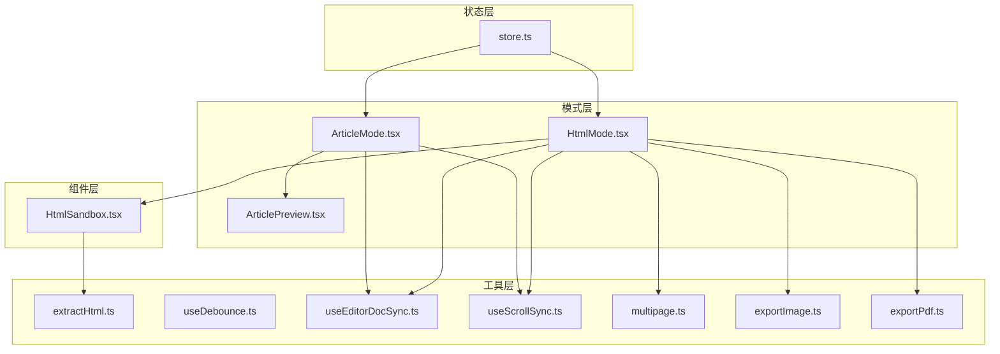
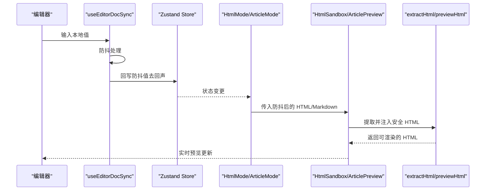
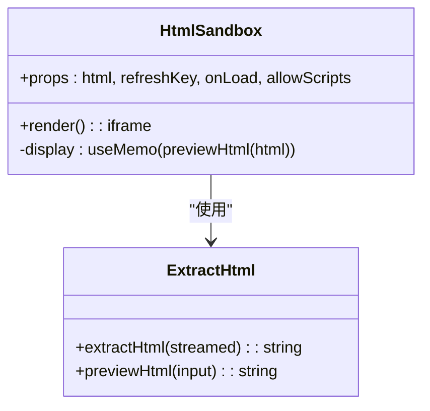
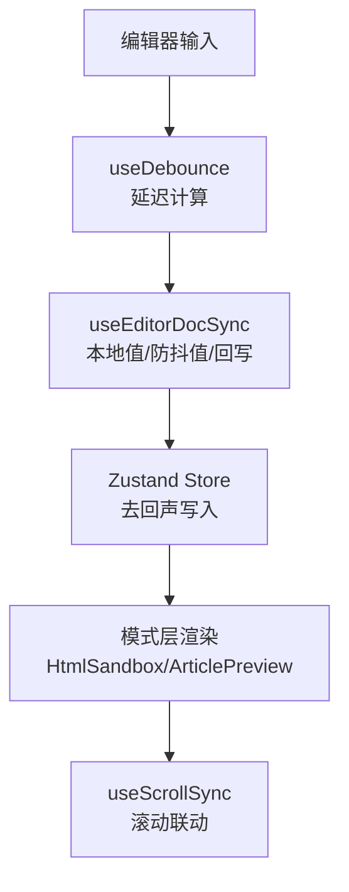
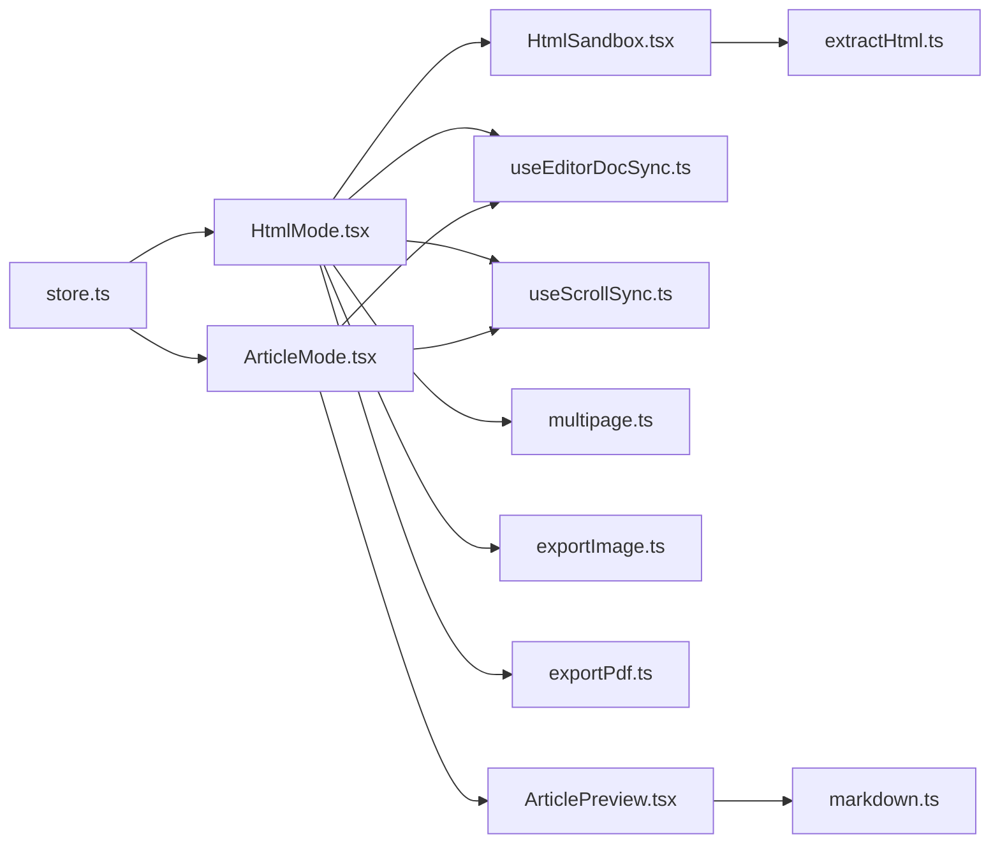

# 预览组件

<cite>
**本文引用的文件列表**
- [HtmlSandbox.tsx](file://src/components/preview/HtmlSandbox.tsx)
- [extractHtml.ts](file://src/lib/extractHtml.ts)
- [HtmlMode.tsx](file://src/modes/html/HtmlMode.tsx)
- [ArticleMode.tsx](file://src/modes/article/ArticleMode.tsx)
- [ArticlePreview.tsx](file://src/modes/article/ArticlePreview.tsx)
- [useEditorDocSync.ts](file://src/lib/useEditorDocSync.ts)
- [useScrollSync.ts](file://src/lib/useScrollSync.ts)
- [useDebounce.ts](file://src/lib/useDebounce.ts)
- [store.ts](file://src/lib/store.ts)
- [markdown.ts](file://src/lib/render/markdown.ts)
- [multipage.ts](file://src/lib/multipage.ts)
- [exportImage.ts](file://src/lib/exportImage.ts)
- [exportPdf.ts](file://src/lib/exportPdf.ts)
- [App.tsx](file://src/App.tsx)
</cite>

## 目录
1. [简介](#简介)
2. [项目结构](#项目结构)
3. [核心组件](#核心组件)
4. [架构总览](#架构总览)
5. [组件详解](#组件详解)
6. [依赖关系分析](#依赖关系分析)
7. [性能考量](#性能考量)
8. [故障排查指南](#故障排查指南)
9. [结论](#结论)
10. [附录](#附录)

## 简介
本文件面向“预览组件”的技术文档，重点围绕 HtmlSandbox 组件的设计与实现展开，涵盖以下主题：
- HTML 沙箱环境的安全隔离与跨域处理策略
- 预览组件的数据流设计与编辑器到预览器的实时同步机制
- 性能优化策略：DOM 操作最小化、渲染效率提升与资源加载稳定性
- 组件配置选项与定制能力：样式覆盖、内容过滤、交互控制
- 使用示例与调试技巧：在不同场景下优化预览体验

## 项目结构
预览组件位于组件层与模式层之间，主要涉及：
- 组件层：HtmlSandbox 作为 iframe 沙箱预览的核心组件
- 模式层：HtmlMode 与 ArticleMode 分别负责 HTML 可视化与长图文预览
- 工具层：数据提取、防抖、滚动同步、导出、多页检测等工具函数
- 状态层：Zustand Store 管理应用状态与示例内容版本

图表来源
- [HtmlSandbox.tsx:1-50](file://src/components/preview/HtmlSandbox.tsx#L1-L50)
- [HtmlMode.tsx:1-579](file://src/modes/html/HtmlMode.tsx#L1-L579)
- [ArticleMode.tsx:1-55](file://src/modes/article/ArticleMode.tsx#L1-L55)
- [ArticlePreview.tsx:1-163](file://src/modes/article/ArticlePreview.tsx#L1-L163)
- [extractHtml.ts:1-113](file://src/lib/extractHtml.ts#L1-L113)
- [useDebounce.ts:1-18](file://src/lib/useDebounce.ts#L1-L18)
- [useEditorDocSync.ts:1-50](file://src/lib/useEditorDocSync.ts#L1-L50)
- [useScrollSync.ts:1-68](file://src/lib/useScrollSync.ts#L1-L68)
- [multipage.ts:1-45](file://src/lib/multipage.ts#L1-L45)
- [exportImage.ts:1-387](file://src/lib/exportImage.ts#L1-L387)
- [exportPdf.ts:1-192](file://src/lib/exportPdf.ts#L1-L192)
- [store.ts:1-242](file://src/lib/store.ts#L1-L242)

章节来源
- [App.tsx:1-172](file://src/App.tsx#L1-L172)
- [store.ts:1-242](file://src/lib/store.ts#L1-L242)

## 核心组件
- HtmlSandbox：基于 iframe 的沙箱预览组件，通过 srcDoc 注入 HTML，使用 sandbox 属性限制权限，默认关闭脚本执行，必要时可通过 allowScripts 开启。
- HtmlMode：HTML 可视化模式，负责编辑器与 iframe 预览的双向同步、多页检测与翻页、导出 PNG/PDF、全屏与刷新等交互。
- ArticleMode 与 ArticlePreview：长图文模式的编辑器与预览面板，支持标题/摘要复制、富文本复制、长图导出等。
- 工具函数：extractHtml、useEditorDocSync、useScrollSync、useDebounce、multipage、exportImage、exportPdf 等。

章节来源
- [HtmlSandbox.tsx:1-50](file://src/components/preview/HtmlSandbox.tsx#L1-L50)
- [HtmlMode.tsx:1-579](file://src/modes/html/HtmlMode.tsx#L1-L579)
- [ArticleMode.tsx:1-55](file://src/modes/article/ArticleMode.tsx#L1-L55)
- [ArticlePreview.tsx:1-163](file://src/modes/article/ArticlePreview.tsx#L1-L163)

## 架构总览
预览组件的整体数据流与交互如下：
- 编辑器输入通过 useEditorDocSync 实现本地值与防抖值的管理，并回写到 Zustand Store，避免回声与重复写入。
- 防抖后的值用于渲染预览（HtmlSandbox 或 ArticlePreview），实现“所见即所得”的实时预览。
- HtmlMode 中的 HtmlSandbox 通过 extractHtml 与 previewHtml 对输入进行安全提取与注入，确保跨域样式可访问与打印/截图稳定性。
- 多页检测与翻页、导出等功能在 HtmlMode 中集中实现，利用 exportImage 与 exportPdf 提供高质量输出。

图表来源
- [useEditorDocSync.ts:1-50](file://src/lib/useEditorDocSync.ts#L1-L50)
- [store.ts:1-242](file://src/lib/store.ts#L1-L242)
- [HtmlMode.tsx:1-579](file://src/modes/html/HtmlMode.tsx#L1-L579)
- [ArticleMode.tsx:1-55](file://src/modes/article/ArticleMode.tsx#L1-L55)
- [extractHtml.ts:1-113](file://src/lib/extractHtml.ts#L1-L113)

## 组件详解

### HtmlSandbox 组件
- 设计目标：在 iframe 沙箱中安全渲染外部 HTML，避免脚本执行风险，同时支持必要的跨域样式访问与打印/截图稳定性。
- 关键实现要点：
  - 使用 previewHtml 对输入进行提取与注入，自动为样式表添加跨域属性，确保截图库可读取 @font-face。
  - 通过 sandbox 控制权限，默认关闭脚本执行；允许通过 allowScripts 动态开启。
  - 使用 refreshKey 强制重挂载，触发 iframe 重建，确保 srcDoc 更新生效。
  - onLoad 回调用于初始化多页检测与缩放适配。

图表来源
- [HtmlSandbox.tsx:1-50](file://src/components/preview/HtmlSandbox.tsx#L1-L50)
- [extractHtml.ts:1-113](file://src/lib/extractHtml.ts#L1-L113)

章节来源
- [HtmlSandbox.tsx:1-50](file://src/components/preview/HtmlSandbox.tsx#L1-L50)
- [extractHtml.ts:1-113](file://src/lib/extractHtml.ts#L1-L113)

### 数据流与同步机制
- useEditorDocSync：维护本地值与防抖值，回写 Store 时去回声，避免编辑器与 Store 之间的竞态导致的丢字问题；外部版本号用于通知编辑器覆盖最新文档。
- useDebounce：对输入进行延迟处理，降低频繁渲染与写入。
- useScrollSync：两容器间按比例联动，采用“主导方”策略避免相互拉扯。

图表来源
- [useEditorDocSync.ts:1-50](file://src/lib/useEditorDocSync.ts#L1-L50)
- [useDebounce.ts:1-18](file://src/lib/useDebounce.ts#L1-L18)
- [useScrollSync.ts:1-68](file://src/lib/useScrollSync.ts#L1-L68)

章节来源
- [useEditorDocSync.ts:1-50](file://src/lib/useEditorDocSync.ts#L1-L50)
- [useDebounce.ts:1-18](file://src/lib/useDebounce.ts#L1-L18)
- [useScrollSync.ts:1-68](file://src/lib/useScrollSync.ts#L1-L68)

### 安全隔离与跨域处理
- 沙箱策略：iframe 的 sandbox 属性默认启用同源权限，可选开启脚本执行；通过 allowScripts 控制。
- 跨域样式访问：为样式表注入 crossorigin="anonymous"，确保截图库可读取 @font-face 等资源。
- 防御性排版与打印：注入打印分页与屏幕居中样式，避免截图乱码与折行问题。

章节来源
- [HtmlSandbox.tsx:1-50](file://src/components/preview/HtmlSandbox.tsx#L1-L50)
- [extractHtml.ts:1-113](file://src/lib/extractHtml.ts#L1-L113)

### 性能优化策略
- DOM 操作最小化：
  - 使用 useMemo 缓存 previewHtml 结果，避免重复解析与注入。
  - 使用 requestAnimationFrame 合并滚动事件，减少重绘频率。
- 渲染效率提升：
  - 防抖策略降低 Store 写入与渲染次数。
  - HtmlMode 中根据页面数量选择缩放策略：多页模式使用 --auto-scale，单页模式使用 zoom 适配宽度。
- 资源加载稳定性：
  - exportImage 与 exportPdf 在截图前等待字体、图片、样式表加载完成，确保截图质量。
  - 通过 ResizeObserver 与 MutationObserver 确保 DOM 稳定后再截图。

章节来源
- [HtmlSandbox.tsx:1-50](file://src/components/preview/HtmlSandbox.tsx#L1-L50)
- [HtmlMode.tsx:1-579](file://src/modes/html/HtmlMode.tsx#L1-L579)
- [exportImage.ts:1-387](file://src/lib/exportImage.ts#L1-L387)
- [exportPdf.ts:1-192](file://src/lib/exportPdf.ts#L1-L192)

### 配置选项与定制能力
- HtmlSandbox
  - html：原始 HTML（可含代码块或解释文字，内部自动提取）
  - refreshKey：强制重挂载的 key
  - onLoad：iframe 加载完成回调
  - allowScripts：是否允许 iframe 内脚本执行（默认关闭）
- HtmlMode
  - allowScripts：开关脚本执行与刷新预览
  - 多页检测与翻页：键盘方向键、滚轮翻页
  - 导出能力：PNG、当前页 PNG、ZIP 打包、PDF（高保真）
  - 全屏展示：全屏查看预览内容
- ArticleMode/ArticlePreview
  - 字体选择：支持多种中文字体
  - 复制功能：标题/摘要/HTML 源码/富文本/AI 指令
  - 本地图片警告：检测本地图片并提示风险

章节来源
- [HtmlSandbox.tsx:1-50](file://src/components/preview/HtmlSandbox.tsx#L1-L50)
- [HtmlMode.tsx:1-579](file://src/modes/html/HtmlMode.tsx#L1-L579)
- [ArticlePreview.tsx:1-163](file://src/modes/article/ArticlePreview.tsx#L1-L163)

### 使用示例与调试技巧
- HTML 可视化模式
  - 在左侧编辑 HTML，右侧 iframe 实时预览；通过“刷新”按钮强制重建 iframe，解决 srcDoc 更新不生效的问题。
  - 通过“互动脚本”开关动态启用/禁用脚本执行，配合“刷新”按钮观察效果。
  - 使用“高保真 PDF”导出，多页模式逐页截图，单页模式直接导出。
- 长图文模式
  - 支持标题/摘要复制、HTML 源码复制、富文本复制、长图导出。
  - 若检测到本地图片且图床配置为本地，会提示图片失效风险。
- 调试技巧
  - 使用 refreshKey 强制重挂载 iframe，解决跨域样式或脚本执行问题。
  - 在 HtmlMode 中通过 onLoad 初始化多页检测，确认页面节点正确识别。
  - 导出失败时检查网络与跨域资源加载情况，exportImage 会在截图前等待资源加载完成。

章节来源
- [HtmlMode.tsx:1-579](file://src/modes/html/HtmlMode.tsx#L1-L579)
- [ArticlePreview.tsx:1-163](file://src/modes/article/ArticlePreview.tsx#L1-L163)

## 依赖关系分析
- HtmlSandbox 依赖 extractHtml 提供安全 HTML 注入与跨域样式处理。
- HtmlMode 依赖 useEditorDocSync、useScrollSync、multipage、exportImage、exportPdf 等工具实现完整的预览与导出流程。
- ArticleMode/ArticlePreview 依赖 renderMarkdown 与 store 状态，实现元数据提取与字体配置。
- store 提供全局状态与示例内容版本同步，避免覆盖用户已编辑内容。

图表来源
- [HtmlSandbox.tsx:1-50](file://src/components/preview/HtmlSandbox.tsx#L1-L50)
- [extractHtml.ts:1-113](file://src/lib/extractHtml.ts#L1-L113)
- [HtmlMode.tsx:1-579](file://src/modes/html/HtmlMode.tsx#L1-L579)
- [ArticleMode.tsx:1-55](file://src/modes/article/ArticleMode.tsx#L1-L55)
- [ArticlePreview.tsx:1-163](file://src/modes/article/ArticlePreview.tsx#L1-L163)
- [markdown.ts:1-16](file://src/lib/render/markdown.ts#L1-L16)
- [store.ts:1-242](file://src/lib/store.ts#L1-L242)

章节来源
- [HtmlSandbox.tsx:1-50](file://src/components/preview/HtmlSandbox.tsx#L1-L50)
- [HtmlMode.tsx:1-579](file://src/modes/html/HtmlMode.tsx#L1-L579)
- [ArticleMode.tsx:1-55](file://src/modes/article/ArticleMode.tsx#L1-L55)
- [ArticlePreview.tsx:1-163](file://src/modes/article/ArticlePreview.tsx#L1-L163)
- [store.ts:1-242](file://src/lib/store.ts#L1-L242)

## 性能考量
- 防抖与去回声：useEditorDocSync 通过防抖与回声识别，减少 Store 写入与渲染次数，避免编辑器与 Store 的竞态。
- 滚动联动：useScrollSync 使用 requestAnimationFrame 合并滚动事件，采用主导方策略避免相互拉扯。
- 截图稳定性：exportImage 与 exportPdf 在截图前等待字体、图片、样式表加载完成，并通过 ResizeObserver/MutationObserver 确保 DOM 稳定。
- 缩放适配：HtmlMode 根据页面数量选择缩放策略，多页模式使用 CSS 变量缩放，单页模式使用 zoom，兼顾渲染质量与性能。

章节来源
- [useEditorDocSync.ts:1-50](file://src/lib/useEditorDocSync.ts#L1-L50)
- [useScrollSync.ts:1-68](file://src/lib/useScrollSync.ts#L1-L68)
- [exportImage.ts:1-387](file://src/lib/exportImage.ts#L1-L387)
- [exportPdf.ts:1-192](file://src/lib/exportPdf.ts#L1-L192)
- [HtmlMode.tsx:1-579](file://src/modes/html/HtmlMode.tsx#L1-L579)

## 故障排查指南
- 预览空白或不更新
  - 检查 HtmlSandbox 的 html 参数是否为空或仅包含解释文字；extractHtml 会自动提取 HTML，若未识别请确保输入格式正确。
  - 使用 refreshKey 强制重挂载 iframe，确保 srcDoc 更新生效。
- 跨域样式/字体无法加载
  - 确认样式表已注入 crossorigin="anonymous"；若仍失败，检查 CDN 与网络策略。
- 导出失败或截图异常
  - 等待资源加载完成后再导出；exportImage 会在截图前等待字体、图片、样式表加载。
  - 检查背景色解析逻辑，必要时显式传入 backgroundColor。
- 多页模式翻页无效
  - 确认页面节点类名符合约定（page/slide/card），并在 onLoad 后初始化多页检测。
- 滚动不同步
  - 检查 useScrollSync 的主导方策略与容器引用是否正确；避免在滚动事件中产生相互拉扯。

章节来源
- [HtmlSandbox.tsx:1-50](file://src/components/preview/HtmlSandbox.tsx#L1-L50)
- [extractHtml.ts:1-113](file://src/lib/extractHtml.ts#L1-L113)
- [exportImage.ts:1-387](file://src/lib/exportImage.ts#L1-L387)
- [HtmlMode.tsx:1-579](file://src/modes/html/HtmlMode.tsx#L1-L579)
- [useScrollSync.ts:1-68](file://src/lib/useScrollSync.ts#L1-L68)

## 结论
预览组件通过 HtmlSandbox 与 HtmlMode 的协同，实现了安全、高效、可定制的 HTML 预览与导出能力。其关键优势包括：
- 安全隔离：iframe 沙箱与跨域样式处理，保障预览环境安全与兼容性。
- 实时同步：useEditorDocSync 与 useDebounce 提供稳定的编辑器-预览同步。
- 性能优化：滚动事件合并、DOM 稳定性等待、缩放适配等策略提升渲染效率。
- 可扩展性：丰富的配置项与导出能力满足不同场景需求。

## 附录
- 相关接口与类型
  - HtmlSandboxProps：html、refreshKey、onLoad、allowScripts
  - EditorDocSync：localValue、debouncedValue、setLocalValue、externalVersion
  - PageInfo：index、label、node
  - ImageOpts：scale、type、backgroundColor、maxHeight

章节来源
- [HtmlSandbox.tsx:1-50](file://src/components/preview/HtmlSandbox.tsx#L1-L50)
- [useEditorDocSync.ts:1-50](file://src/lib/useEditorDocSync.ts#L1-L50)
- [multipage.ts:1-45](file://src/lib/multipage.ts#L1-L45)
- [exportImage.ts:1-387](file://src/lib/exportImage.ts#L1-L387)