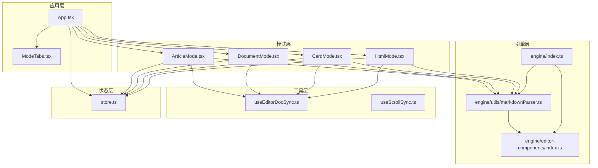
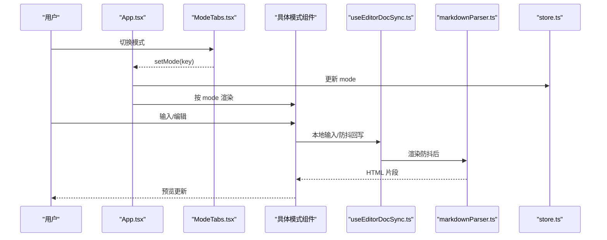
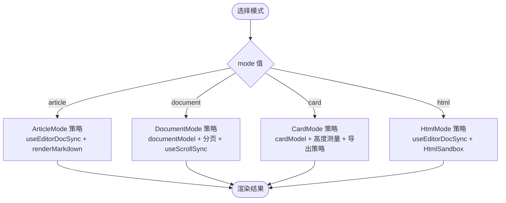
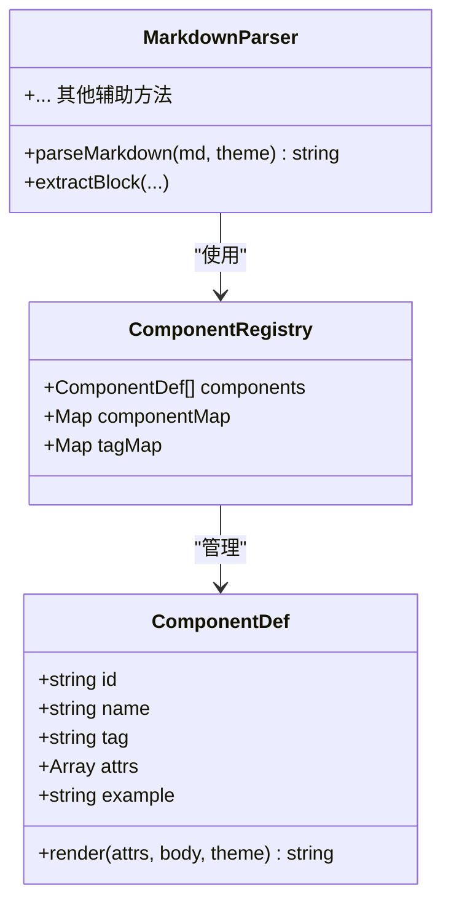
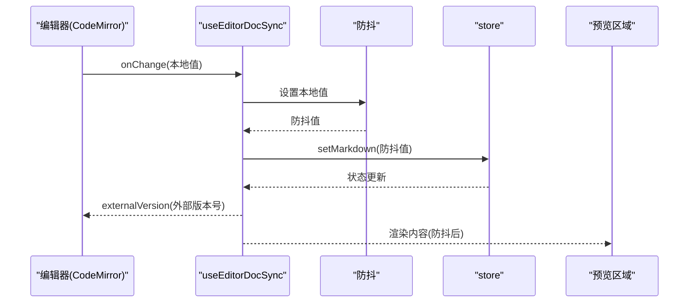
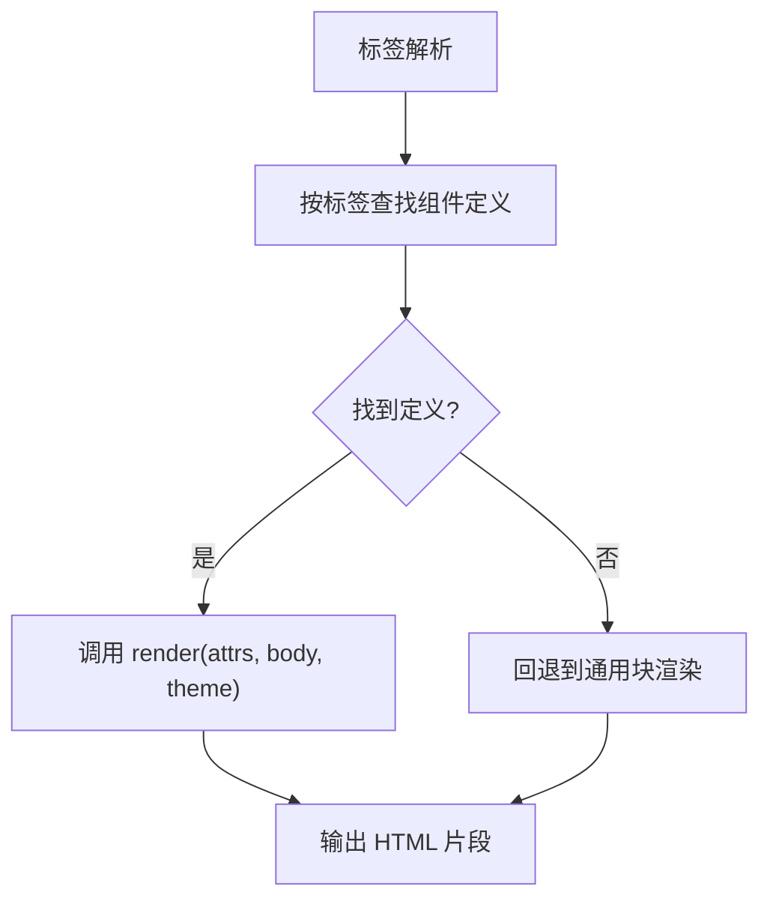
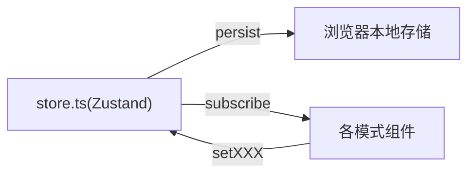
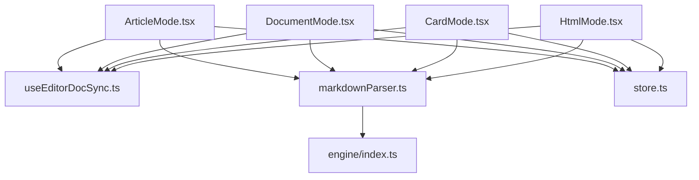

# 设计模式应用

<cite>
**本文引用的文件**
- [App.tsx](file://src/App.tsx)
- [ModeTabs.tsx](file://src/components/layout/ModeTabs.tsx)
- [ArticleMode.tsx](file://src/modes/article/ArticleMode.tsx)
- [DocumentMode.tsx](file://src/modes/document/DocumentMode.tsx)
- [CardMode.tsx](file://src/modes/card/CardMode.tsx)
- [HtmlMode.tsx](file://src/modes/html/HtmlMode.tsx)
- [store.ts](file://src/lib/store.ts)
- [useEditorDocSync.ts](file://src/lib/useEditorDocSync.ts)
- [useScrollSync.ts](file://src/lib/useScrollSync.ts)
- [markdownParser.ts](file://src/engine/utils/markdownParser.ts)
- [index.ts](file://src/engine/index.ts)
- [cardModel.ts](file://src/modes/card/cardModel.ts)
- [documentModel.ts](file://src/modes/document/documentModel.ts)
- [package.json](file://package.json)
</cite>

## 目录
1. [简介](#简介)
2. [项目结构](#项目结构)
3. [核心组件](#核心组件)
4. [架构总览](#架构总览)
5. [详细组件分析](#详细组件分析)
6. [依赖关系分析](#依赖关系分析)
7. [性能考量](#性能考量)
8. [故障排查指南](#故障排查指南)
9. [结论](#结论)

## 简介
本文件系统性梳理 MarkFlow 中设计模式的应用实践，重点围绕以下模式展开：
- 策略模式：在多场景编辑模式中的算法封装与切换机制
- 组合模式：渲染引擎对组件树的构建与渲染流程
- 观察者模式：编辑器与预览之间的同步与状态通知
- 工厂模式：组件创建与渲染函数的注册与选择
- 单例模式：全局状态管理（Zustand Store）

通过对各模式在代码中的落地位置、交互流程与技术权衡进行深入分析，帮助读者快速理解系统架构与扩展点。

## 项目结构
项目采用按功能域划分的组织方式，核心模块包括：
- 应用入口与模式切换：App、ModeTabs
- 多场景模式：ArticleMode、DocumentMode、CardMode、HtmlMode
- 渲染引擎：@engine（Markdown 解析、组件注册、主题）
- 工具与同步：useEditorDocSync、useScrollSync
- 全局状态：store（Zustand）

**图表来源**
- [App.tsx:35-171](file://src/App.tsx#L35-L171)
- [ModeTabs.tsx:15-41](file://src/components/layout/ModeTabs.tsx#L15-L41)
- [ArticleMode.tsx:16-54](file://src/modes/article/ArticleMode.tsx#L16-L54)
- [DocumentMode.tsx:34-344](file://src/modes/document/DocumentMode.tsx#L34-L344)
- [CardMode.tsx:44-363](file://src/modes/card/CardMode.tsx#L44-L363)
- [HtmlMode.tsx:92-578](file://src/modes/html/HtmlMode.tsx#L92-L578)
- [store.ts:163-241](file://src/lib/store.ts#L163-L241)
- [markdownParser.ts:110-604](file://src/engine/utils/markdownParser.ts#L110-L604)
- [index.ts:1-16](file://src/engine/index.ts#L1-L16)

**章节来源**
- [App.tsx:1-172](file://src/App.tsx#L1-L172)
- [ModeTabs.tsx:1-42](file://src/components/layout/ModeTabs.tsx#L1-L42)

## 核心组件
- 应用入口与模式切换：App 负责读取全局状态、渲染 ModeTabs 并按 mode 动态加载对应模式组件
- 渲染引擎：@engine 对外暴露 parseMarkdown、组件注册中心与主题能力
- 同步工具：useEditorDocSync 实现编辑器与 store 的双向同步；useScrollSync 实现左右面板滚动联动
- 全局状态：store 使用 Zustand 提供持久化状态，包含多模式内容、主题、平台等

**章节来源**
- [App.tsx:35-171](file://src/App.tsx#L35-L171)
- [store.ts:54-92](file://src/lib/store.ts#L54-L92)
- [useEditorDocSync.ts:20-49](file://src/lib/useEditorDocSync.ts#L20-L49)
- [useScrollSync.ts:7-67](file://src/lib/useScrollSync.ts#L7-L67)
- [index.ts:1-16](file://src/engine/index.ts#L1-L16)

## 架构总览
系统采用“模式即策略”的思想：每种渲染模式（文章、文档、卡片、HTML）代表一种处理策略，App 通过 mode 决策选择具体策略执行。渲染引擎负责将 Markdown/HTML 解析为可渲染的 HTML 结构，组件注册中心提供可组合的 UI 组件。全局状态集中管理，编辑器与预览通过同步工具保持一致性。

**图表来源**
- [App.tsx:90-90](file://src/App.tsx#L90-L90)
- [ModeTabs.tsx:22-38](file://src/components/layout/ModeTabs.tsx#L22-L38)
- [ArticleMode.tsx:18-23](file://src/modes/article/ArticleMode.tsx#L18-L23)
- [DocumentMode.tsx:48-54](file://src/modes/document/DocumentMode.tsx#L48-L54)
- [CardMode.tsx:72-78](file://src/modes/card/CardMode.tsx#L72-L78)
- [HtmlMode.tsx:104-110](file://src/modes/html/HtmlMode.tsx#L104-L110)
- [markdownParser.ts:110-604](file://src/engine/utils/markdownParser.ts#L110-L604)
- [store.ts:215-220](file://src/lib/store.ts#L215-L220)

## 详细组件分析

### 策略模式：多场景编辑模式的算法封装与切换
- 策略选择：App 根据 mode 决定渲染 ArticleMode、DocumentMode、CardMode 或 HtmlMode，形成“模式即策略”的结构
- 算法封装：
  - 文章模式：基于 useEditorDocSync 与 renderMarkdown 的组合策略
  - 文档模式：基于 documentModel 的分页策略与 useScrollSync 的联动策略
  - 卡片模式：基于 cardModel 的分页与高度测量策略，结合导出策略
  - HTML 模式：基于 useEditorDocSync 的编辑同步与 HtmlSandbox 的预览策略
- 切换机制：ModeTabs 提供 UI 交互，App 通过 setMode 更新全局状态，触发组件树重渲染

**图表来源**
- [App.tsx:135-165](file://src/App.tsx#L135-L165)
- [ModeTabs.tsx:8-13](file://src/components/layout/ModeTabs.tsx#L8-L13)
- [ArticleMode.tsx:16-54](file://src/modes/article/ArticleMode.tsx#L16-L54)
- [DocumentMode.tsx:34-344](file://src/modes/document/DocumentMode.tsx#L34-L344)
- [CardMode.tsx:44-363](file://src/modes/card/CardMode.tsx#L44-L363)
- [HtmlMode.tsx:92-578](file://src/modes/html/HtmlMode.tsx#L92-L578)

**章节来源**
- [App.tsx:35-171](file://src/App.tsx#L35-L171)
- [ModeTabs.tsx:15-41](file://src/components/layout/ModeTabs.tsx#L15-L41)
- [ArticleMode.tsx:16-54](file://src/modes/article/ArticleMode.tsx#L16-L54)
- [DocumentMode.tsx:34-344](file://src/modes/document/DocumentMode.tsx#L34-L344)
- [CardMode.tsx:44-363](file://src/modes/card/CardMode.tsx#L44-L363)
- [HtmlMode.tsx:92-578](file://src/modes/html/HtmlMode.tsx#L92-L578)

### 组合模式：渲染引擎中的组件树构建与渲染流程
- 组件注册中心：通过组件定义（id、tag、attrs、render）集中管理，支持按标签映射与按编号索引
- 组件树构建：parseMarkdown 按顺序扫描 Markdown 文本，遇到特定标签时委托对应组件渲染器生成 HTML 片段
- 渲染流程：先抽取数学公式占位，再解析块级组件（如 steps、statement、compare、timeline 等），最后处理普通块（标题、列表、表格、图片、段落等），最终回填数学公式

**图表来源**
- [markdownParser.ts:110-604](file://src/engine/utils/markdownParser.ts#L110-L604)
- [index.ts:1-16](file://src/engine/index.ts#L1-L16)

**章节来源**
- [markdownParser.ts:1-605](file://src/engine/utils/markdownParser.ts#L1-L605)
- [index.ts:1-16](file://src/engine/index.ts#L1-L16)

### 观察者模式：编辑器与预览同步及状态通知
- 编辑器与预览同步：
  - useEditorDocSync：维护本地值、防抖值与外部版本号，避免回写回声导致的重复输入
  - useScrollSync：通过主导方策略避免滚动事件相互拉扯，保证编辑器与预览联动顺畅
- 状态变化通知：
  - store 使用 Zustand 管理全局状态，组件订阅状态变化并触发重渲染
  - App 通过 useStore 读取与更新状态，实现模式切换、主题切换、平台切换等

**图表来源**
- [useEditorDocSync.ts:20-49](file://src/lib/useEditorDocSync.ts#L20-L49)
- [store.ts:194-205](file://src/lib/store.ts#L194-L205)
- [ArticleMode.tsx:18-23](file://src/modes/article/ArticleMode.tsx#L18-L23)
- [DocumentMode.tsx:48-54](file://src/modes/document/DocumentMode.tsx#L48-L54)
- [CardMode.tsx:72-78](file://src/modes/card/CardMode.tsx#L72-L78)
- [HtmlMode.tsx:104-110](file://src/modes/html/HtmlMode.tsx#L104-L110)

**章节来源**
- [useEditorDocSync.ts:1-50](file://src/lib/useEditorDocSync.ts#L1-L50)
- [useScrollSync.ts:1-68](file://src/lib/useScrollSync.ts#L1-L68)
- [store.ts:163-241](file://src/lib/store.ts#L163-L241)

### 工厂模式：组件创建与渲染函数的选择
- 组件工厂：组件注册中心以工厂形式提供组件定义与渲染函数，解析器根据标签动态选择对应渲染器
- 策略选择：解析器在遇到特定标签时，依据标签名查找组件定义并调用其 render 方法，实现“按需创建 + 按标签选择”的工厂模式

**图表来源**
- [markdownParser.ts:182-422](file://src/engine/utils/markdownParser.ts#L182-L422)
- [index.ts:76-81](file://src/engine/index.ts#L76-L81)

**章节来源**
- [markdownParser.ts:1-605](file://src/engine/utils/markdownParser.ts#L1-L605)
- [index.ts:1-16](file://src/engine/index.ts#L1-L16)

### 单例模式：全局状态管理（Zustand Store）
- 全局唯一状态源：store 通过 create 与 persist 创建全局状态实例，避免多实例导致的状态不一致
- 状态持久化：通过持久化中间件将状态存储到本地，实现跨会话恢复
- 订阅与更新：各组件通过 useStore 订阅状态变化，set 函数更新状态并触发重渲染

**图表来源**
- [store.ts:163-241](file://src/lib/store.ts#L163-L241)

**章节来源**
- [store.ts:1-242](file://src/lib/store.ts#L1-L242)

## 依赖关系分析
- 模式与同步：各模式均依赖 useEditorDocSync 与 useScrollSync，保证编辑与预览的一致性
- 渲染链路：各模式依赖 @engine 的解析与组件能力，形成统一的渲染管线
- 状态依赖：App 与各模式共同依赖 store，实现全局状态共享

**图表来源**
- [ArticleMode.tsx:1-55](file://src/modes/article/ArticleMode.tsx#L1-L55)
- [DocumentMode.tsx:1-345](file://src/modes/document/DocumentMode.tsx#L1-L345)
- [CardMode.tsx:1-364](file://src/modes/card/CardMode.tsx#L1-L364)
- [HtmlMode.tsx:1-579](file://src/modes/html/HtmlMode.tsx#L1-L579)
- [useEditorDocSync.ts:1-50](file://src/lib/useEditorDocSync.ts#L1-L50)
- [markdownParser.ts:1-605](file://src/engine/utils/markdownParser.ts#L1-L605)
- [index.ts:1-16](file://src/engine/index.ts#L1-L16)
- [store.ts:1-242](file://src/lib/store.ts#L1-L242)

**章节来源**
- [package.json:13-31](file://package.json#L13-L31)

## 性能考量
- 防抖与去抖：useEditorDocSync 对本地输入进行防抖，减少回写频率与渲染压力
- 滚动联动优化：useScrollSync 采用主导方策略与 requestAnimationFrame，避免相互拉扯与卡顿
- 分页与高度测量：DocumentMode 与 CardMode 使用实际高度测量与分页策略，提升布局稳定性
- 渲染管线：解析器按标签分发渲染，避免全量扫描带来的开销

[本节为通用性能建议，无需特定文件引用]

## 故障排查指南
- 编辑器与预览不同步：检查 useEditorDocSync 的 externalVersion 是否正确递增，确认 store 的 setXXX 是否被调用
- 滚动不同步或卡顿：确认 useScrollSync 的主导方逻辑与 requestAnimationFrame 使用是否正确
- 渲染异常：检查 markdownParser 的标签解析与组件渲染是否匹配，确认组件注册中心是否存在对应定义
- 状态不一致：检查 store 的持久化键与初始化迁移逻辑，确保跨版本升级时状态正确恢复

**章节来源**
- [useEditorDocSync.ts:30-46](file://src/lib/useEditorDocSync.ts#L30-L46)
- [useScrollSync.ts:12-66](file://src/lib/useScrollSync.ts#L12-L66)
- [markdownParser.ts:182-422](file://src/engine/utils/markdownParser.ts#L182-L422)
- [store.ts:101-156](file://src/lib/store.ts#L101-L156)

## 结论
MarkFlow 通过策略模式实现了多场景编辑模式的灵活切换，通过组合模式构建了可扩展的渲染引擎，通过观察者模式保障了编辑器与预览的实时同步，通过工厂模式简化了组件创建与选择，通过单例模式实现了全局状态的统一管理。这些设计模式协同作用，形成了高内聚、低耦合、易扩展的系统架构。