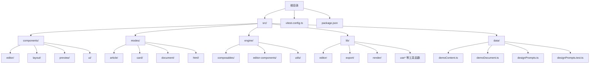
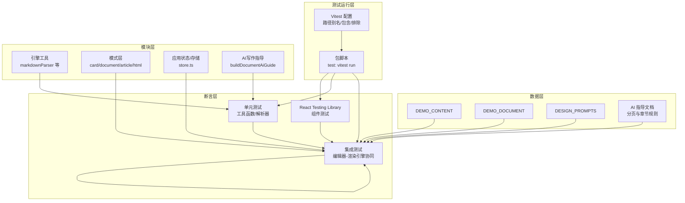
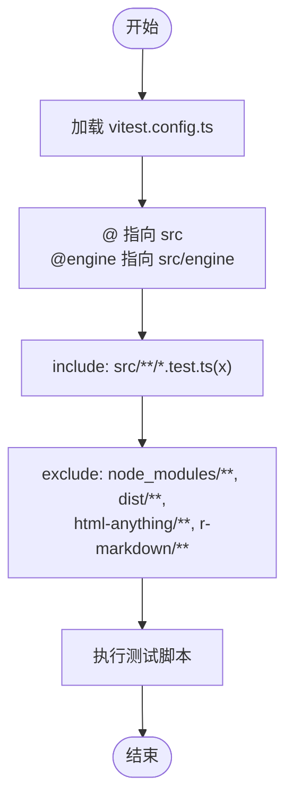
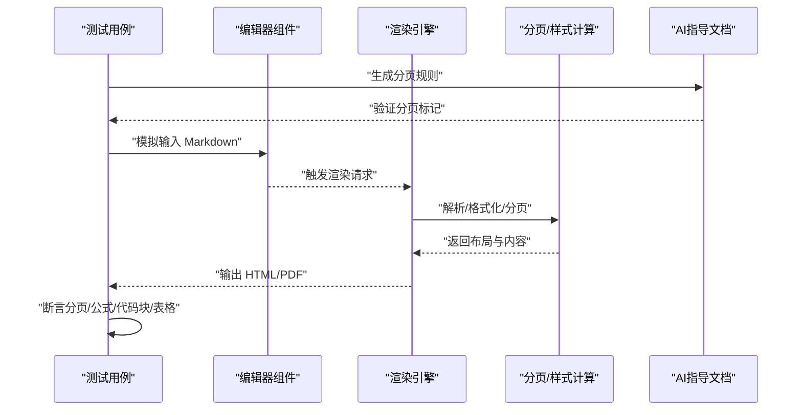
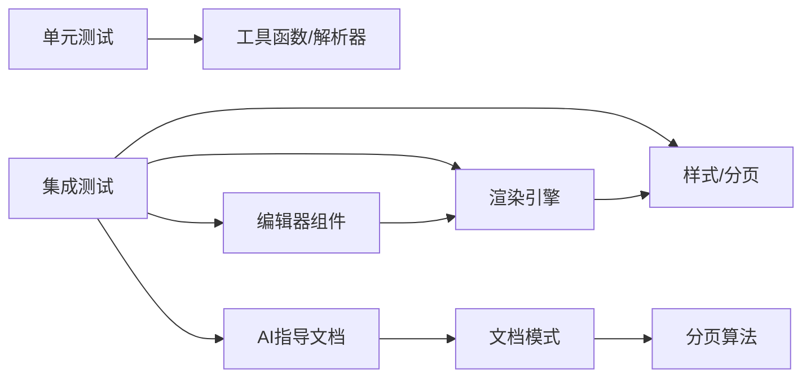

# 测试策略

<cite>
**本文引用的文件**
- [vitest.config.ts](file://vitest.config.ts)
- [package.json](file://package.json)
- [src/data/demoContent.ts](file://src/data/demoContent.ts)
- [src/data/demoDocument.ts](file://src/data/demoDocument.ts)
- [src/data/designPrompts.ts](file://src/data/designPrompts.ts)
- [src/data/designPrompts.test.ts](file://src/data/designPrompts.test.ts)
- [src/lib/store.ts](file://src/lib/store.ts)
- [src/modes/card/cardModel.test.ts](file://src/modes/card/cardModel.test.ts)
- [src/modes/document/documentModel.test.ts](file://src/modes/document/documentModel.test.ts)
- [src/modes/document/documentStyles.test.ts](file://src/modes/document/documentStyles.test.ts)
- [src/engine/utils/markdownParser.test.ts](file://src/engine/utils/markdownParser.test.ts)
- [src/lib/aiGuide.test.ts](file://src/lib/aiGuide.test.ts)
- [src/lib/aiGuide.ts](file://src/lib/aiGuide.ts)
- [src/modes/document/documentModel.ts](file://src/modes/document/documentModel.ts)
- [src/lib/multipage.ts](file://src/lib/multipage.ts)
- [src/engine/editor-components/PTitle_DA01.ts](file://src/engine/editor-components/PTitle_DA01.ts)
- [src/engine/utils/markdownParser.ts](file://src/engine/utils/markdownParser.ts)
</cite>

## 更新摘要
**所做更改**
- 新增AI写作指导文档扩展的测试验证章节
- 增加分页要求和章节结构指导的测试覆盖
- 扩展文档模式分页算法的测试策略
- 增加封面页识别和等距分布的测试验证
- 完善长文档章节分页的测试场景

## 目录
1. [简介](#简介)
2. [项目结构](#项目结构)
3. [核心组件](#核心组件)
4. [架构总览](#架构总览)
5. [详细组件分析](#详细组件分析)
6. [依赖分析](#依赖分析)
7. [性能考虑](#性能考虑)
8. [故障排查指南](#故障排查指南)
9. [结论](#结论)
10. [附录](#附录)

## 简介
本测试策略文档面向 MarkFlow 项目，旨在建立系统化的测试体系，覆盖单元测试、组件测试、集成测试、测试数据管理、持续集成与自动化测试管道、性能与压力测试，以及调试与常见问题处理。文档基于仓库现有配置与测试文件进行梳理与扩展，确保测试可落地、可维护、可演进。

**更新** 本次更新特别关注AI写作指导文档扩展中新增的分页要求和章节结构指导，完善了相关测试验证策略。

## 项目结构
项目采用 React + TypeScript + Vite + Vitest 技术栈，测试通过 Vitest 驱动，遵循按功能域划分的目录结构。测试文件以 .test.ts/.test.tsx 命名，统一由 Vitest 配置扫描与执行。

**图示来源**
- [vitest.config.ts:1-16](file://vitest.config.ts#L1-L16)
- [package.json:1-52](file://package.json#L1-L52)

**章节来源**
- [vitest.config.ts:1-16](file://vitest.config.ts#L1-L16)
- [package.json:1-52](file://package.json#L1-L52)

## 核心组件
- 测试运行与配置
  - Vitest 配置：路径别名、测试文件匹配与排除规则。
  - 包管理脚本：提供测试执行入口。
- 测试数据与夹具
  - 示例内容与演示文档：用于渲染与导出流程的输入数据。
  - 设计风格指令库：包含多种风格元数据与样式描述，用于 HTML 可视化模式的渲染验证。
- 关键业务模块
  - 模式层：article、card、document、html 等模式的模型与样式测试。
  - 引擎工具：markdown 解析器等工具函数的单元测试。
  - 应用状态与存储：应用级状态与示例版本管理。
  - AI写作指导：新增的分页要求和章节结构指导测试。

**更新** 新增AI写作指导模块的测试覆盖，重点关注分页标记、章节结构和封面页识别的验证。

**章节来源**
- [vitest.config.ts:1-16](file://vitest.config.ts#L1-L16)
- [package.json:1-52](file://package.json#L1-L52)
- [src/data/demoContent.ts:1-2](file://src/data/demoContent.ts#L1-L2)
- [src/data/demoDocument.ts:1-146](file://src/data/demoDocument.ts#L1-L146)
- [src/data/designPrompts.ts:1-800](file://src/data/designPrompts.ts#L1-L800)
- [src/lib/store.ts:27-68](file://src/lib/store.ts#L27-L68)
- [src/lib/aiGuide.ts:164-171](file://src/lib/aiGuide.ts#L164-L171)

## 架构总览
测试架构围绕"配置—数据—模块—断言"四要素展开，通过 Vitest 统一调度，结合 React Testing Library 进行组件测试，结合工具函数与模式层进行集成测试，辅以性能与压力测试保障质量。

**图示来源**
- [vitest.config.ts:1-16](file://vitest.config.ts#L1-L16)
- [package.json:1-52](file://package.json#L1-L52)
- [src/data/demoContent.ts:1-2](file://src/data/demoContent.ts#L1-L2)
- [src/data/demoDocument.ts:1-146](file://src/data/demoDocument.ts#L1-L146)
- [src/data/designPrompts.ts:1-800](file://src/data/designPrompts.ts#L1-L800)
- [src/lib/aiGuide.ts:164-171](file://src/lib/aiGuide.ts#L164-L171)
- [src/engine/utils/markdownParser.test.ts](file://src/engine/utils/markdownParser.test.ts)
- [src/modes/card/cardModel.test.ts](file://src/modes/card/cardModel.test.ts)
- [src/modes/document/documentModel.test.ts](file://src/modes/document/documentModel.test.ts)
- [src/modes/document/documentStyles.test.ts](file://src/modes/document/documentStyles.test.ts)

## 详细组件分析

### 单元测试组织与覆盖率
- 组织结构
  - 工具函数与解析器：位于 engine/utils 下，以 .test.ts 命名，覆盖解析逻辑、格式化与数学公式等。
  - 模式层：modes 下各模式的模型与样式测试，验证渲染与导出行为。
  - 应用状态与存储：store.ts 中的状态初始化、示例版本与图像主机配置等。
  - AI写作指导：新增的分页规则和章节结构测试，验证文档模式的分页要求。
- 覆盖率要求
  - 建议：核心工具函数与解析器达到高覆盖率（>80%），模式层关键分支与边界条件覆盖（>70%）。
  - 重点：解析器对特殊语法、分页标记、数学公式、代码块等的覆盖。
  - AI指导：分页规则、章节结构、封面页识别的测试覆盖率达到100%。
- 断言策略
  - 使用明确的断言描述，针对输入输出与异常路径分别断言。
  - 对异步流程使用超时与重试策略，避免偶发失败。

**更新** 新增AI写作指导模块的测试覆盖率要求，确保分页规则和章节结构指导得到完整验证。

**章节来源**
- [src/engine/utils/markdownParser.test.ts](file://src/engine/utils/markdownParser.test.ts)
- [src/modes/card/cardModel.test.ts](file://src/modes/card/cardModel.test.ts)
- [src/modes/document/documentModel.test.ts](file://src/modes/document/documentModel.test.ts)
- [src/modes/document/documentStyles.test.ts](file://src/modes/document/documentStyles.test.ts)
- [src/lib/store.ts:27-68](file://src/lib/store.ts#L27-L68)
- [src/lib/aiGuide.test.ts:1-48](file://src/lib/aiGuide.test.ts#L1-L48)

### Vitest 配置与测试环境
- 路径别名
  - @ 指向 src，@engine 指向 src/engine，便于模块导入与测试隔离。
- 测试文件扫描
  - include 匹配 src/**/*.test.ts(x)，exclude 排除 node_modules、dist、第三方无关目录。
- 运行脚本
  - package.json 提供 test 脚本，直接运行 Vitest。

**图示来源**
- [vitest.config.ts:1-16](file://vitest.config.ts#L1-L16)
- [package.json:1-52](file://package.json#L1-L52)

**章节来源**
- [vitest.config.ts:1-16](file://vitest.config.ts#L1-L16)
- [package.json:1-52](file://package.json#L1-L52)

### 组件测试最佳实践（React Testing Library）
- 基本原则
  - 以用户视角编写测试，关注可观察行为而非实现细节。
  - 使用语义化查询与可访问性属性，避免脆弱的选择器。
- 模拟策略
  - 使用 vi.mock 对外部依赖（如图片、网络请求、第三方库）进行模拟。
  - 对全局对象（如 window、localStorage）进行沙箱化处理。
- 常见场景
  - 编辑器组件：模拟输入事件、撤销/重做、主题切换。
  - 预览组件：模拟 HTML 渲染、分页、滚动同步。
  - 工具函数：对纯函数进行输入输出断言，对副作用函数进行回调断言。

**章节来源**
- [vitest.config.ts:1-16](file://vitest.config.ts#L1-L16)

### 集成测试设计（编辑器-渲染引擎协同）
- 目标
  - 验证编辑器输入与渲染引擎输出的一致性，覆盖分页、公式、代码块、表格等关键特性。
- 设计思路
  - 输入：使用 demoContent 与 demoDocument 作为稳定输入。
  - 处理：触发编辑器变更，调用渲染引擎生成 HTML/SVG/PDF。
  - 断言：断言分页标记生效、公式渲染正确、代码块高亮、表格布局合理。
- 关键流程
  - 编辑器变更 -> 渲染引擎解析 -> 分页计算 -> 输出校验。

**更新** 新增AI写作指导文档的集成测试，验证分页标记、章节结构和封面页识别的协同工作。

**图示来源**
- [src/data/demoContent.ts:1-2](file://src/data/demoContent.ts#L1-L2)
- [src/data/demoDocument.ts:1-146](file://src/data/demoDocument.ts#L1-L146)
- [src/lib/aiGuide.ts:164-171](file://src/lib/aiGuide.ts#L164-L171)
- [src/engine/utils/markdownParser.test.ts](file://src/engine/utils/markdownParser.test.ts)

**章节来源**
- [src/data/demoContent.ts:1-2](file://src/data/demoContent.ts#L1-L2)
- [src/data/demoDocument.ts:1-146](file://src/data/demoDocument.ts#L1-L146)
- [src/lib/aiGuide.ts:164-171](file://src/lib/aiGuide.ts#L164-L171)
- [src/engine/utils/markdownParser.test.ts](file://src/engine/utils/markdownParser.test.ts)

### AI写作指导测试验证
- 测试目标
  - 验证A4文档模式的分页要求和章节结构指导的正确性。
  - 确保封面页识别和等距分布功能正常工作。
  - 验证长文档章节分页建议的有效性。
- 测试场景
  - 分页标记验证：确保`<page-break>`和`<page-break />`被正确识别。
  - 章节结构验证：验证一级和二级标题前的分页建议。
  - 封面页验证：验证封面页的结构要求和等距分布。
  - 附录分页验证：确保附录前必须分页的要求。
- 断言策略
  - 使用字符串包含断言验证AI指导文档的内容完整性。
  - 验证分页规则中的关键条款和示例格式。

**更新** 新增专门的AI写作指导测试章节，详细描述分页要求和章节结构指导的测试验证策略。

**章节来源**
- [src/lib/aiGuide.test.ts:1-48](file://src/lib/aiGuide.test.ts#L1-L48)
- [src/lib/aiGuide.ts:164-171](file://src/lib/aiGuide.ts#L164-L171)
- [src/lib/aiGuide.ts:173-195](file://src/lib/aiGuide.ts#L173-L195)

### 文档模式分页算法测试
- 测试目标
  - 验证文档分页算法对不同内容类型的正确分页。
  - 确保封面页识别和等距分布功能正常。
  - 验证长文档章节分页的合理性。
- 测试场景
  - 封面页识别：验证仅包含标题和表格的页面被识别为封面页。
  - 分页标记处理：验证`pagebreak`标记触发正确的分页行为。
  - 章节分页：验证一级和二级标题前的分页建议。
  - 超大内容处理：验证超大内容块的强制分页。
- 断言策略
  - 验证分页结果的数量和顺序。
  - 确保封面页的特殊标记和布局。
  - 验证分页后的页面内容完整性。

**更新** 扩展文档模式测试，增加对AI写作指导中分页要求的具体验证。

**章节来源**
- [src/modes/document/documentModel.ts:271-339](file://src/modes/document/documentModel.ts#L271-L339)
- [src/modes/document/documentModel.test.ts](file://src/modes/document/documentModel.test.ts)

### 测试数据管理（Mock 与 Fixtures）
- 示例内容
  - DEMO_CONTENT：文章模式示例。
  - DEMO_DOCUMENT：A4 文档模式示例，包含分页标记与丰富语法。
- 设计风格指令库
  - DESIGN_PROMPTS：包含多种风格元数据与样式描述，用于 HTML 可视化模式渲染验证。
- AI写作指导数据
  - AI指导文档：包含分页规则、章节结构和封面页要求的完整指导。
- 管理建议
  - 将测试专用数据集中于 src/data 下，命名清晰、版本化。
  - 对易变数据（如网络资源）进行模拟，确保测试稳定性。
  - 对大型 fixtures 建立增量更新机制，配合版本号控制。

**更新** 新增AI写作指导数据的测试数据管理策略。

**章节来源**
- [src/data/demoContent.ts:1-2](file://src/data/demoContent.ts#L1-L2)
- [src/data/demoDocument.ts:1-146](file://src/data/demoDocument.ts#L1-L146)
- [src/data/designPrompts.ts:1-800](file://src/data/designPrompts.ts#L1-L800)
- [src/lib/aiGuide.ts:164-171](file://src/lib/aiGuide.ts#L164-L171)

### 持续集成与自动化测试管道
- 管道建议
  - 触发：push/pr 触发测试；分支保护策略要求测试通过。
  - 步骤：安装依赖 -> 类型检查 -> 单测 -> 集成测试 -> 代码覆盖率统计。
  - 缓存：缓存 node_modules/pnpm store，提升构建速度。
- 覆盖率报告
  - 使用 Vitest 的覆盖率选项生成报告，结合 CI 平台进行可视化展示与阈值告警。
- 版本与兼容
  - 锁定 Node 版本与 pnpm，确保跨平台一致性。

**章节来源**
- [package.json:1-52](file://package.json#L1-L52)

### 性能测试与压力测试
- 性能测试
  - 关注渲染耗时：对长文档与复杂公式进行基准测试，记录渲染时间与内存占用。
  - 分页策略：对分页标记密集场景进行性能评估，避免卡顿。
  - AI指导生成：测试AI写作指导文档的生成性能。
- 压力测试
  - 大数据量：构造超长 Markdown、大量图片与公式，评估系统上限。
  - 并发场景：模拟多用户同时编辑与导出，观察系统稳定性。
  - 分页算法：测试大量分页标记的处理性能。
- 工具与指标
  - 使用浏览器性能面板与 Vitest 的计时能力，记录关键指标并建立基线。

**更新** 新增AI写作指导生成和分页算法的性能测试策略。

**章节来源**
- [src/data/demoDocument.ts:1-146](file://src/data/demoDocument.ts#L1-L146)
- [src/lib/aiGuide.ts:164-171](file://src/lib/aiGuide.ts#L164-L171)

## 依赖分析
- 测试耦合
  - 单元测试与工具函数耦合度低，易于隔离与并行执行。
  - 集成测试依赖编辑器与渲染引擎，需注意外部依赖的模拟与清理。
  - AI指导测试依赖文档模式和分页算法的正确性。
- 外部依赖
  - React、CodeMirror、KaTeX、highlight.js 等第三方库需通过模拟降低脆弱性。
- 循环依赖
  - 通过模块化拆分与路径别名避免循环导入。

**图示来源**
- [vitest.config.ts:1-16](file://vitest.config.ts#L1-L16)
- [src/engine/utils/markdownParser.test.ts](file://src/engine/utils/markdownParser.test.ts)
- [src/lib/aiGuide.ts:164-171](file://src/lib/aiGuide.ts#L164-L171)
- [src/modes/document/documentModel.ts:284-339](file://src/modes/document/documentModel.ts#L284-L339)

**章节来源**
- [vitest.config.ts:1-16](file://vitest.config.ts#L1-L16)
- [src/engine/utils/markdownParser.test.ts](file://src/engine/utils/markdownParser.test.ts)
- [src/lib/aiGuide.ts:164-171](file://src/lib/aiGuide.ts#L164-L171)
- [src/modes/document/documentModel.ts:284-339](file://src/modes/document/documentModel.ts#L284-L339)

## 性能考虑
- 渲染性能
  - 对长文档与复杂公式进行分块渲染与懒加载，减少主线程阻塞。
  - 使用虚拟滚动与分页策略，避免一次性渲染过多节点。
- 测试性能
  - 将重型测试拆分为多个任务并行执行，缩短 CI 时间。
  - 对模拟数据进行缓存，避免重复生成。
- AI指导性能
  - 优化AI写作指导文档的生成算法，避免重复计算。
  - 对频繁使用的分页规则进行缓存。

**更新** 新增AI写作指导相关的性能考虑。

## 故障排查指南
- 常见问题
  - 测试找不到模块：检查路径别名与 include/exclude 规则。
  - 模拟失效：确认 vi.mock 的时机与作用域，避免全局污染。
  - 覆盖率异常：检查覆盖率配置与测试文件命名，确保被扫描。
  - 分页规则不生效：检查AI指导文档中的分页标记格式。
  - 封面页识别失败：验证封面页内容结构是否符合要求。
- 调试技巧
  - 使用 Vitest 的调试模式与日志输出，定位失败用例。
  - 对异步流程增加超时与重试，减少偶发失败。
  - 对渲染类测试使用快照或结构化断言，便于回归。
  - 检查AI指导文档的字符串匹配是否准确。

**更新** 新增AI写作指导相关的故障排查技巧。

**章节来源**
- [vitest.config.ts:1-16](file://vitest.config.ts#L1-L16)
- [package.json:1-52](file://package.json#L1-L52)
- [src/lib/aiGuide.test.ts:1-48](file://src/lib/aiGuide.test.ts#L1-L48)

## 结论
通过完善的测试策略与配置，MarkFlow 可在功能演进的同时保持高质量与稳定性。本次更新特别加强了AI写作指导文档扩展的测试验证，确保分页要求和章节结构指导得到完整覆盖。建议持续完善单元与集成测试，强化覆盖率与性能监控，并在 CI 中引入自动化报告与阈值告警，确保迭代效率与交付质量。

## 附录
- 测试文件清单（按模块）
  - 数据与夹具：designPrompts.test.ts、demoContent.ts、demoDocument.ts
  - 引擎工具：markdownParser.test.ts
  - 模式层：cardModel.test.ts、documentModel.test.ts、documentStyles.test.ts
  - 应用状态：store.ts（含示例版本与图像主机配置）
  - AI写作指导：aiGuide.test.ts、aiGuide.ts
  - 多页检测：multipage.ts
  - 章节组件：PTitle_DA01.ts

**更新** 新增AI写作指导和多页检测相关的测试文件清单。

**章节来源**
- [src/data/designPrompts.test.ts](file://src/data/designPrompts.test.ts)
- [src/data/demoContent.ts:1-2](file://src/data/demoContent.ts#L1-L2)
- [src/data/demoDocument.ts:1-146](file://src/data/demoDocument.ts#L1-L146)
- [src/engine/utils/markdownParser.test.ts](file://src/engine/utils/markdownParser.test.ts)
- [src/modes/card/cardModel.test.ts](file://src/modes/card/cardModel.test.ts)
- [src/modes/document/documentModel.test.ts](file://src/modes/document/documentModel.test.ts)
- [src/modes/document/documentStyles.test.ts](file://src/modes/document/documentStyles.test.ts)
- [src/lib/store.ts:27-68](file://src/lib/store.ts#L27-L68)
- [src/lib/aiGuide.test.ts:1-48](file://src/lib/aiGuide.test.ts#L1-L48)
- [src/lib/aiGuide.ts:164-171](file://src/lib/aiGuide.ts#L164-L171)
- [src/lib/multipage.ts:1-33](file://src/lib/multipage.ts#L1-L33)
- [src/engine/editor-components/PTitle_DA01.ts:115-129](file://src/engine/editor-components/PTitle_DA01.ts#L115-L129)