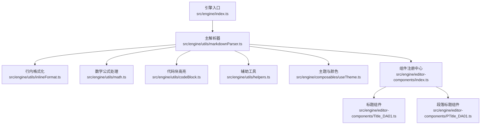
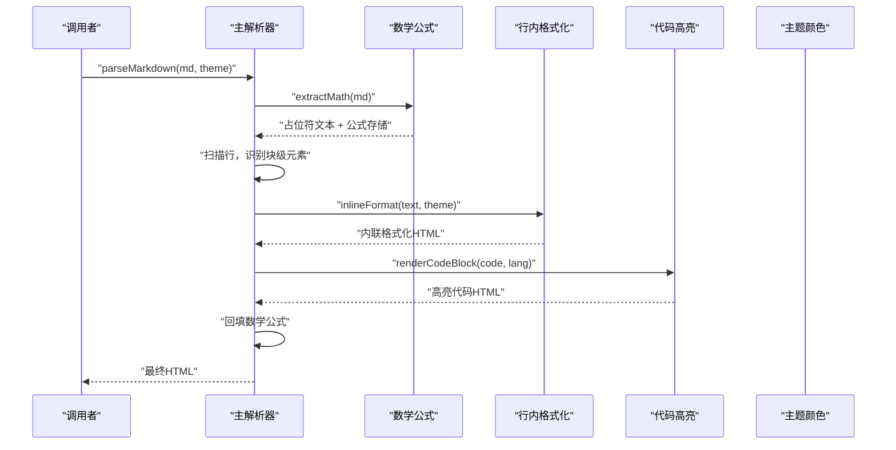
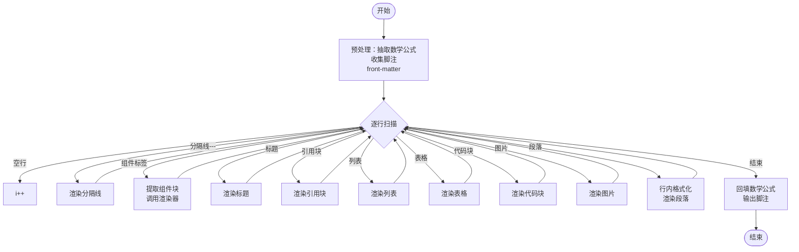
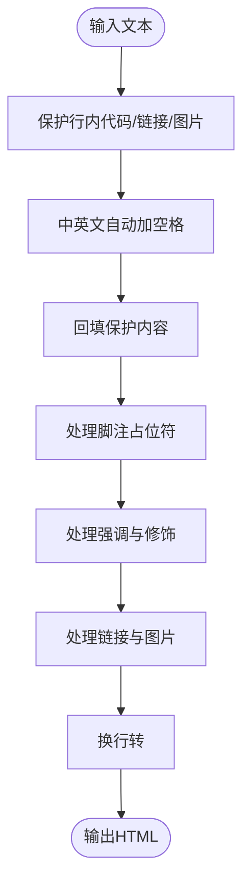
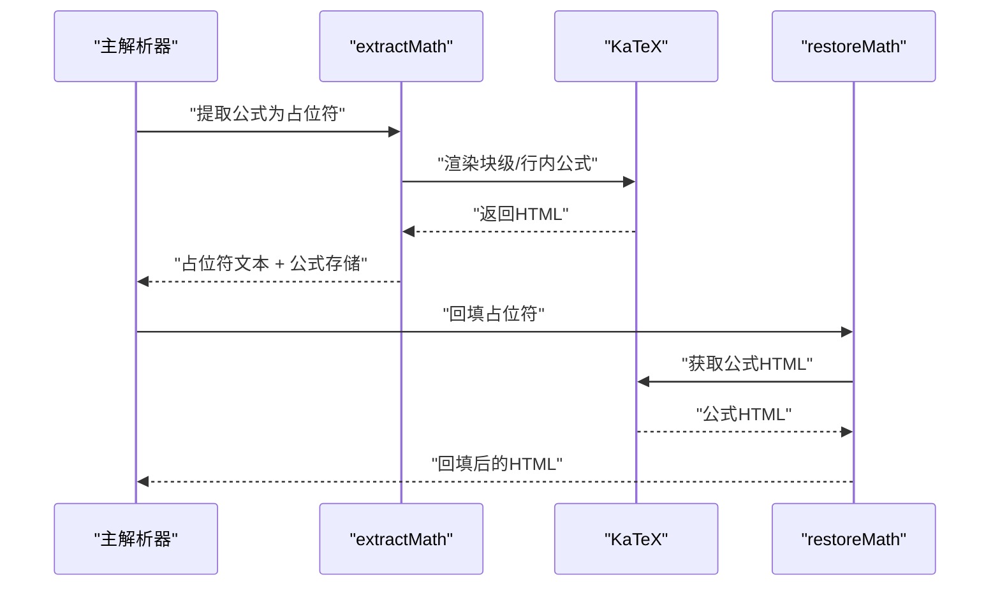
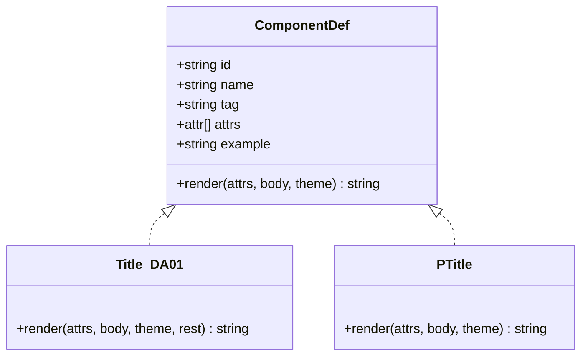
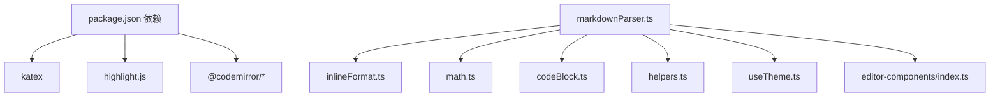

# Markdown解析器

<cite>
**本文档引用的文件**
- [markdownParser.ts](file://src/engine/utils/markdownParser.ts)
- [inlineFormat.ts](file://src/engine/utils/inlineFormat.ts)
- [math.ts](file://src/engine/utils/math.ts)
- [codeBlock.ts](file://src/engine/utils/codeBlock.ts)
- [helpers.ts](file://src/engine/utils/helpers.ts)
- [index.ts](file://src/engine/index.ts)
- [useTheme.ts](file://src/engine/composables/useTheme.ts)
- [editor-components/index.ts](file://src/engine/editor-components/index.ts)
- [Title_DA01.ts](file://src/engine/editor-components/Title_DA01.ts)
- [PTitle_DA01.ts](file://src/engine/editor-components/PTitle_DA01.ts)
- [documentModel.ts](file://src/modes/document/documentModel.ts)
- [demoDocument.ts](file://src/data/demoDocument.ts)
- [App.tsx](file://src/App.tsx)
- [package.json](file://package.json)
</cite>

## 目录
1. [简介](#简介)
2. [项目结构](#项目结构)
3. [核心组件](#核心组件)
4. [架构总览](#架构总览)
5. [详细组件分析](#详细组件分析)
6. [依赖关系分析](#依赖关系分析)
7. [性能考虑](#性能考虑)
8. [故障排除指南](#故障排除指南)
9. [结论](#结论)
10. [附录](#附录)

## 简介
本项目提供了一个纯前端的 Markdown/AHTML 多场景渲染与导出工作台，核心在于一套可扩展的 Markdown 解析器。该解析器不仅支持标准 Markdown 语法（标题、段落、列表、表格、代码块、链接、图片等），还内置了丰富的扩展语法（如组件标签、题注识别、数学公式、行内强调等），并提供了主题化渲染、分页模型与导出能力。本文档聚焦于解析器的实现原理与扩展机制，帮助开发者理解词法分析、语法树构建与 AST 节点类型定义，掌握解析规则与性能优化策略，并提供实际使用示例与最佳实践。

## 项目结构
解析器位于引擎目录下，采用“工具函数 + 组件注册 + 主解析器”的分层设计：
- 引擎入口统一导出解析能力
- 解析器负责逐行扫描与规则匹配
- 行内格式化处理强调、链接、图片等
- 数学公式采用抽取-回填策略
- 代码块高亮基于 highlight.js
- 主题与颜色工具提供渲染所需的颜色体系
- 编辑器组件注册中心提供可扩展的块级组件



**图表来源**
- [index.ts:1-16](file://src/engine/index.ts#L1-L16)
- [markdownParser.ts:1-605](file://src/engine/utils/markdownParser.ts#L1-L605)
- [inlineFormat.ts:1-104](file://src/engine/utils/inlineFormat.ts#L1-L104)
- [math.ts:1-71](file://src/engine/utils/math.ts#L1-L71)
- [codeBlock.ts:1-98](file://src/engine/utils/codeBlock.ts#L1-L98)
- [helpers.ts:1-115](file://src/engine/utils/helpers.ts#L1-L115)
- [useTheme.ts:1-68](file://src/engine/composables/useTheme.ts#L1-L68)
- [editor-components/index.ts:1-81](file://src/engine/editor-components/index.ts#L1-L81)
- [Title_DA01.ts:1-119](file://src/engine/editor-components/Title_DA01.ts#L1-L119)
- [PTitle_DA01.ts:1-186](file://src/engine/editor-components/PTitle_DA01.ts#L1-L186)

**章节来源**
- [index.ts:1-16](file://src/engine/index.ts#L1-L16)
- [markdownParser.ts:1-605](file://src/engine/utils/markdownParser.ts#L1-L605)
- [editor-components/index.ts:1-81](file://src/engine/editor-components/index.ts#L1-L81)

## 核心组件
- 主解析器：负责按行扫描、识别块级元素与组件标签、调用相应渲染器与格式化工具，最终输出 HTML。
- 行内格式化：对段落与标题内的强调、链接、图片、脚注占位符等进行处理。
- 数学公式：抽取行内/块级公式为占位符，解析完成后回填 KaTeX 渲染结果。
- 代码块高亮：基于 highlight.js 注册多种语言，按别名映射与自动检测进行高亮。
- 主题与颜色：提供主题色、边框色、RGB 字符串等，供渲染器注入内联样式。
- 编辑器组件：组件注册中心集中管理组件定义、渲染函数与索引映射。

**章节来源**
- [markdownParser.ts:110-605](file://src/engine/utils/markdownParser.ts#L110-L605)
- [inlineFormat.ts:5-103](file://src/engine/utils/inlineFormat.ts#L5-L103)
- [math.ts:19-70](file://src/engine/utils/math.ts#L19-L70)
- [codeBlock.ts:31-97](file://src/engine/utils/codeBlock.ts#L31-L97)
- [useTheme.ts:4-67](file://src/engine/composables/useTheme.ts#L4-L67)
- [editor-components/index.ts:20-81](file://src/engine/editor-components/index.ts#L20-L81)

## 架构总览
解析器采用“顺序扫描 + 规则匹配”的流水线式处理，核心流程如下：
- 预处理：抽取数学公式为占位符，收集脚注，处理 front-matter
- 块级解析：逐行识别标题、引用块、列表、表格、代码块、组件标签等
- 行内格式化：对每段文本应用强调、链接、图片、脚注等内联规则
- 后处理：回填数学公式，输出 HTML



**图表来源**
- [markdownParser.ts:110-150](file://src/engine/utils/markdownParser.ts#L110-L150)
- [math.ts:33-57](file://src/engine/utils/math.ts#L33-L57)
- [inlineFormat.ts:5-103](file://src/engine/utils/inlineFormat.ts#L5-L103)
- [codeBlock.ts:92-97](file://src/engine/utils/codeBlock.ts#L92-L97)

## 详细组件分析

### 主解析器（markdownParser.ts）
- 词法分析与规则匹配
  - 通过正则与行扫描识别块级元素：标题、引用块、列表、表格、代码块、组件标签等
  - 对跨行组件（如 <title>、<steps> 等）使用提取器一次性读取至闭合标签
  - 对题注识别：结合上下文判断“图/表”题注位置，避免误判
- 语法树与 AST 节点类型
  - 本解析器不构建显式的 AST 节点对象，而是将 Markdown 按块级元素直接映射为 HTML 片段
  - 块级元素类型：heading、paragraph、image、table、code、quote、list、component、rule、pagebreak
  - 组件标签：通过组件注册中心映射到具体渲染器
- 处理流程
  - 预处理：抽取数学公式、收集脚注、front-matter
  - 块级循环：逐行匹配规则，调用对应渲染器或格式化函数
  - 后处理：回填数学公式，输出脚注参考文献



**图表来源**
- [markdownParser.ts:110-605](file://src/engine/utils/markdownParser.ts#L110-L605)

**章节来源**
- [markdownParser.ts:110-605](file://src/engine/utils/markdownParser.ts#L110-L605)
- [documentModel.ts:3-28](file://src/modes/document/documentModel.ts#L3-L28)

### 行内格式化（inlineFormat.ts）
- 目标：在不破坏代码与链接的前提下，对强调、链接、图片、脚注占位符等进行格式化
- 关键策略
  - 保护性抽取：先抽取行内代码、图片、链接片段，再进行中英文自动加空格，最后回填
  - 脚注占位符：支持带显示文字与无显示文字两种形式
  - 强调与修饰：支持加粗、斜体、删除线、下划线、上/下标、渐变背景、胶囊文字等
  - 链接与图片：生成带主题色的样式
  - 换行处理：将段落中的换行转换为 <br>，并去除行首/行尾缩进



**图表来源**
- [inlineFormat.ts:5-103](file://src/engine/utils/inlineFormat.ts#L5-L103)

**章节来源**
- [inlineFormat.ts:5-103](file://src/engine/utils/inlineFormat.ts#L5-L103)

### 数学公式处理（math.ts）
- 设计思想：采用“抽取-回填”策略，避免公式内容被后续解析破坏
- 实现细节
  - 占位符：使用私有使用区字符作为块级/行内占位符
  - 存储结构：分别维护块级与行内公式映射
  - 渲染：使用 KaTeX 将公式渲染为 HTML
  - 容错：渲染失败时降级为原始文本
  - 回填：先处理被段落包裹的块级公式，再处理裸占位符



**图表来源**
- [math.ts:33-70](file://src/engine/utils/math.ts#L33-L70)

**章节来源**
- [math.ts:13-70](file://src/engine/utils/math.ts#L13-L70)

### 代码块高亮（codeBlock.ts）
- 语言注册：注册多种编程语言，支持别名映射（如 c++→cpp、js→javascript 等）
- 高亮策略：优先按指定语言高亮，否则自动检测；异常时回退为转义文本
- 样式：将 highlight.js 的 class 映射为内联样式，确保复制到富文本目标时仍保留高亮

**章节来源**
- [codeBlock.ts:31-97](file://src/engine/utils/codeBlock.ts#L31-L97)

### 主题与颜色（useTheme.ts）
- 提供主题色、边框色、RGB 字符串等，供渲染器注入内联样式
- 提供颜色工具：十六进制转 RGB、浅色/深色计算、带透明度背景色生成

**章节来源**
- [useTheme.ts:4-67](file://src/engine/composables/useTheme.ts#L4-L67)

### 编辑器组件（editor-components/index.ts）
- 组件注册中心：集中管理组件定义、按 id/tag 索引
- 组件接口：包含 id、name、tag、属性定义、示例与渲染函数
- 扩展机制：新增组件只需实现渲染函数并加入注册中心



**图表来源**
- [editor-components/index.ts:20-34](file://src/engine/editor-components/index.ts#L20-L34)
- [Title_DA01.ts:74-118](file://src/engine/editor-components/Title_DA01.ts#L74-L118)
- [PTitle_DA01.ts:33-184](file://src/engine/editor-components/PTitle_DA01.ts#L33-L184)

**章节来源**
- [editor-components/index.ts:20-81](file://src/engine/editor-components/index.ts#L20-L81)
- [Title_DA01.ts:74-118](file://src/engine/editor-components/Title_DA01.ts#L74-L118)
- [PTitle_DA01.ts:58-184](file://src/engine/editor-components/PTitle_DA01.ts#L58-L184)

### 分页与文档模型（documentModel.ts）
- 块级分类：heading、paragraph、image、table、code、quote、list、component、rule、pagebreak
- 分块策略：按空行、代码围栏、组件标签闭合等边界切分
- 高度估算：为各块级元素提供高度估算，用于分页决策
- 分页算法：在内容接近页面底部或遇到过大块时强制换页，避免标题断开

**章节来源**
- [documentModel.ts:3-28](file://src/modes/document/documentModel.ts#L3-L28)
- [documentModel.ts:101-183](file://src/modes/document/documentModel.ts#L101-L183)
- [documentModel.ts:185-327](file://src/modes/document/documentModel.ts#L185-L327)

## 依赖关系分析
- 外部依赖
  - KaTeX：数学公式渲染
  - highlight.js：代码高亮
  - Codemirror：编辑器（用于演示与开发体验）
- 内部依赖
  - 主解析器依赖行内格式化、数学公式、代码高亮、辅助工具与主题颜色
  - 组件渲染依赖主题颜色与辅助工具
  - 文档模式依赖解析器与分页模型



**图表来源**
- [package.json:13-31](file://package.json#L13-L31)
- [markdownParser.ts:1-16](file://src/engine/utils/markdownParser.ts#L1-L16)

**章节来源**
- [package.json:13-31](file://package.json#L13-L31)
- [markdownParser.ts:1-16](file://src/engine/utils/markdownParser.ts#L1-L16)

## 性能考虑
- 数学公式抽取-回填
  - 优点：避免公式内容被后续规则破坏，提升稳定性
  - 建议：对大型文档可考虑缓存公式渲染结果，减少重复渲染
- 代码高亮
  - 优点：按需注册语言，减少体积
  - 建议：对频繁切换语言的场景，可缓存高亮结果或延迟加载语言模块
- 行内格式化
  - 优点：保护性抽取避免重复处理
  - 建议：对长段落可分批处理，避免长时间阻塞
- 分页模型
  - 优点：基于估算高度的贪心分页，简单高效
  - 建议：对复杂组件可提供实际高度回调，提高分页精度

[本节为通用性能讨论，无需特定文件引用]

## 故障排除指南
- 数学公式渲染失败
  - 现象：块级/行内公式回退为原始文本
  - 处理：检查公式语法，确认 KaTeX 版本与配置
  - 参考：数学公式模块的容错实现
- 代码高亮异常
  - 现象：代码块显示为纯文本
  - 处理：确认语言注册与别名映射，检查 highlight.js 版本
- 题注误判
  - 现象：普通段落被识别为题注
  - 处理：调整上下文判断逻辑，避免空格分隔符与特定动词组合
- 组件标签未闭合
  - 现象：组件内容被截断
  - 处理：确保组件标签正确闭合，或使用跨行组件语法

**章节来源**
- [math.ts:19-30](file://src/engine/utils/math.ts#L19-L30)
- [codeBlock.ts:75-85](file://src/engine/utils/codeBlock.ts#L75-L85)
- [markdownParser.ts:552-588](file://src/engine/utils/markdownParser.ts#L552-L588)

## 结论
本解析器通过“顺序扫描 + 规则匹配 + 抽取-回填”的设计，在保证可读性的同时实现了对标准与扩展 Markdown 语法的全面支持。其模块化结构与组件注册机制使得扩展新语法与组件变得简单直观。配合主题化渲染与分页模型，能够满足从长图文到 A4 文档等多种场景的渲染与导出需求。

[本节为总结性内容，无需特定文件引用]

## 附录

### 解析规则与元素支持一览
- 标题：支持原生 #/# / 组件 <title>/<p-title>
- 段落：普通段落与题注识别
- 列表：无序与有序，支持任务列表
- 引用块：> 引用
- 表格：| 分隔符与分隔行
- 代码块：``` 代码围栏
- 图片： 与题注
- 数学公式：行内 $...$ 与块级 $$...$$
- 组件标签：多种块级组件（steps、statement、badges、cta、lead、breaking、compare、reading-path、timeline、slider、engage 等）

**章节来源**
- [markdownParser.ts:424-588](file://src/engine/utils/markdownParser.ts#L424-L588)
- [inlineFormat.ts:77-99](file://src/engine/utils/inlineFormat.ts#L77-L99)
- [math.ts:39-54](file://src/engine/utils/math.ts#L39-L54)

### 扩展机制与最佳实践
- 新增块级组件
  - 在组件注册中心新增组件定义，实现渲染函数
  - 在主解析器中增加识别与提取逻辑
  - 参考现有组件：Title_DA01、PTitle
- 新增行内强调
  - 在行内格式化中添加正则替换与样式生成
  - 确保保护性抽取，避免破坏链接与代码
- 新增语言高亮
  - 在代码块高亮模块注册语言与别名
  - 考虑按需加载以减小体积
- 主题适配
  - 使用主题颜色接口生成样式，确保一致性

**章节来源**
- [editor-components/index.ts:55-81](file://src/engine/editor-components/index.ts#L55-L81)
- [Title_DA01.ts:74-118](file://src/engine/editor-components/Title_DA01.ts#L74-L118)
- [PTitle_DA01.ts:58-184](file://src/engine/editor-components/PTitle_DA01.ts#L58-L184)
- [inlineFormat.ts:5-103](file://src/engine/utils/inlineFormat.ts#L5-L103)
- [codeBlock.ts:17-41](file://src/engine/utils/codeBlock.ts#L17-L41)

### 使用示例与集成路径
- 基础使用
  - 从引擎入口导入解析函数与工具
  - 传入 Markdown 文本与主题颜色，获得 HTML
- 示例内容
  - 使用演示文档内容验证解析效果
- 模式集成
  - 在应用中按模式加载对应组件，传递解析后的 HTML

**章节来源**
- [index.ts:3-7](file://src/engine/index.ts#L3-L7)
- [demoDocument.ts:1-146](file://src/data/demoDocument.ts#L1-L146)
- [App.tsx:13-164](file://src/App.tsx#L13-L164)