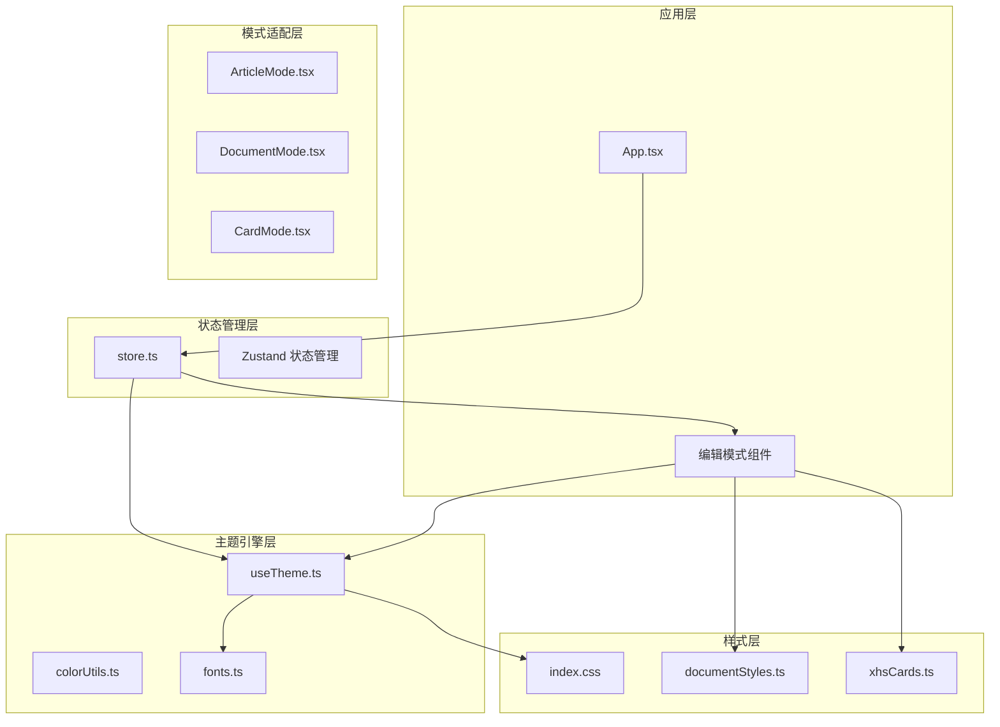
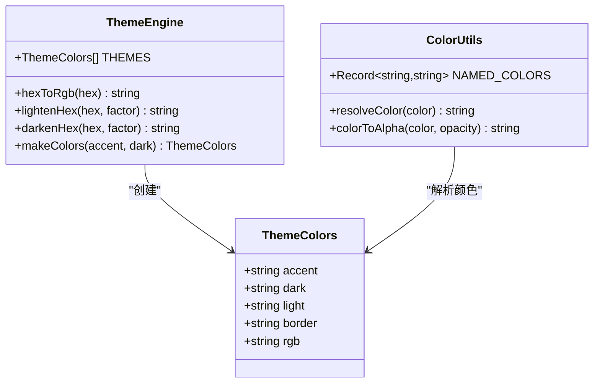
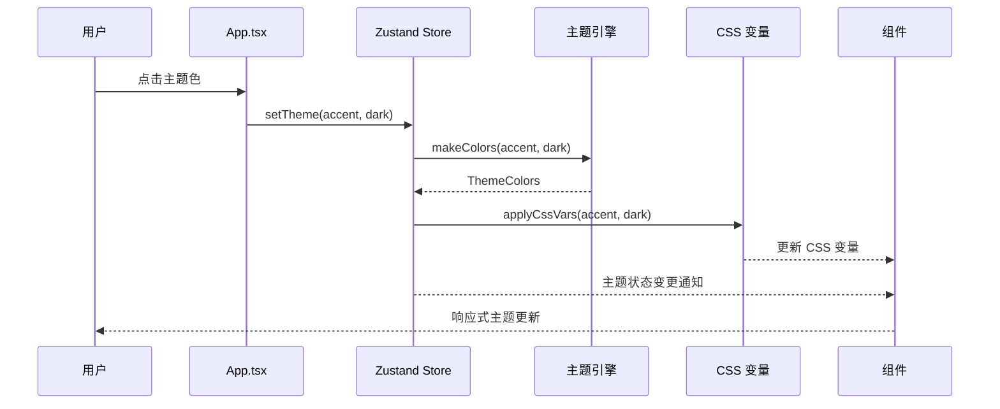
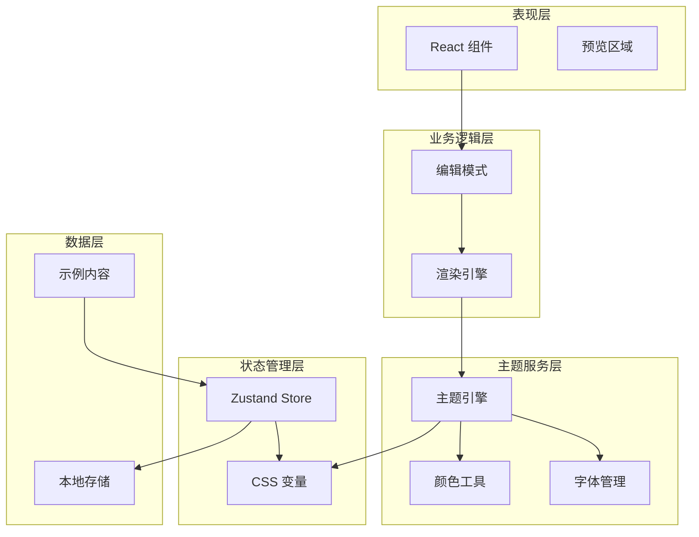
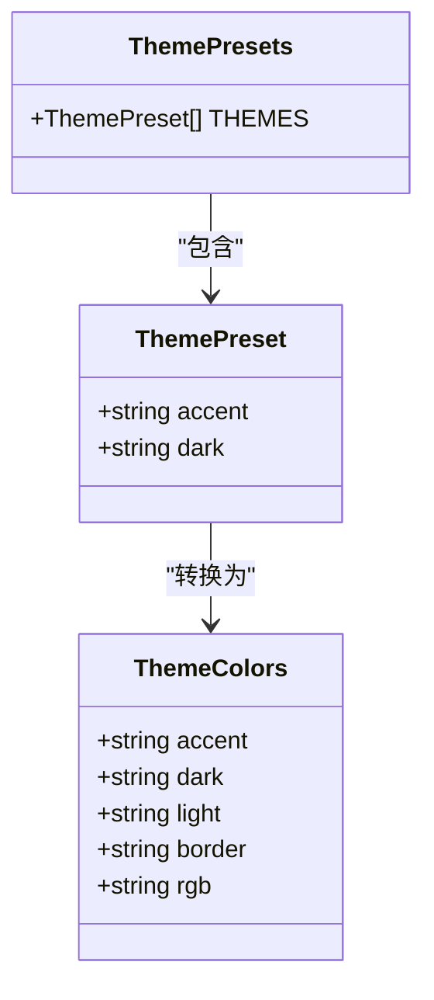
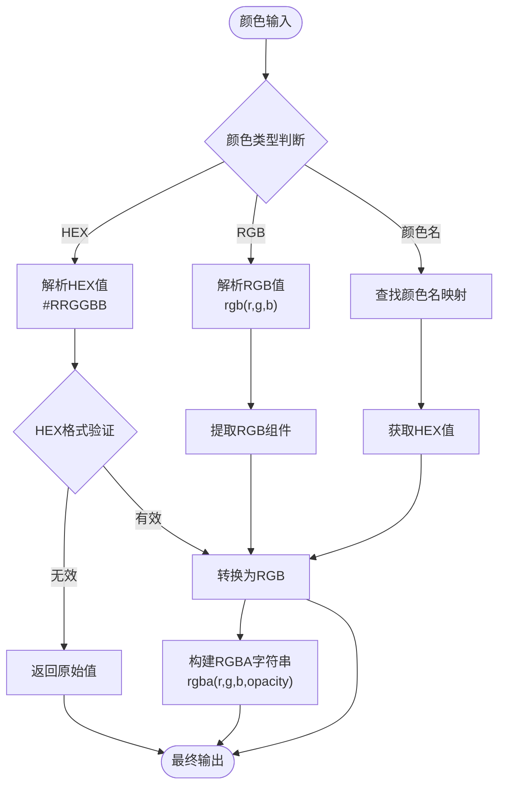
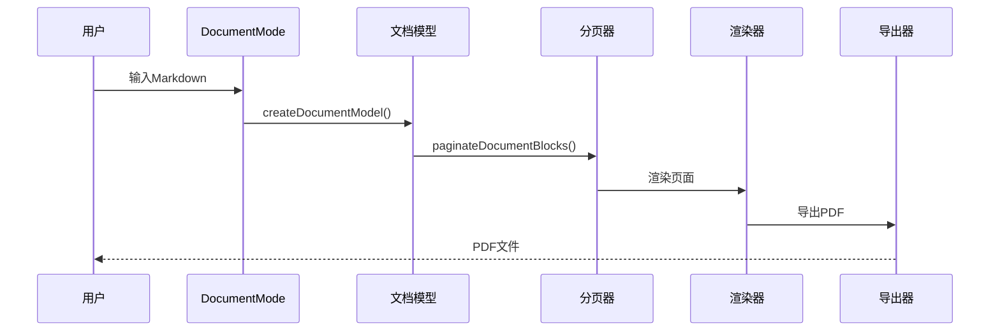
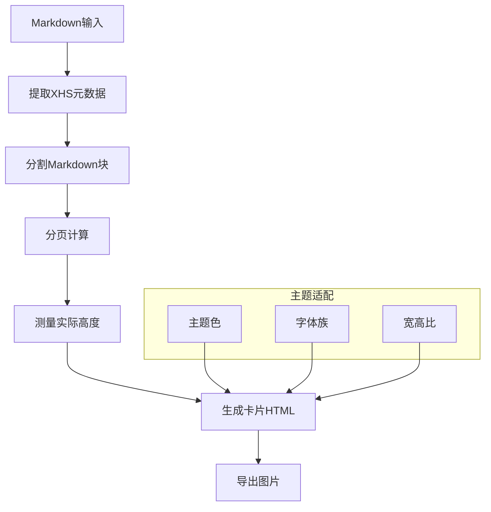
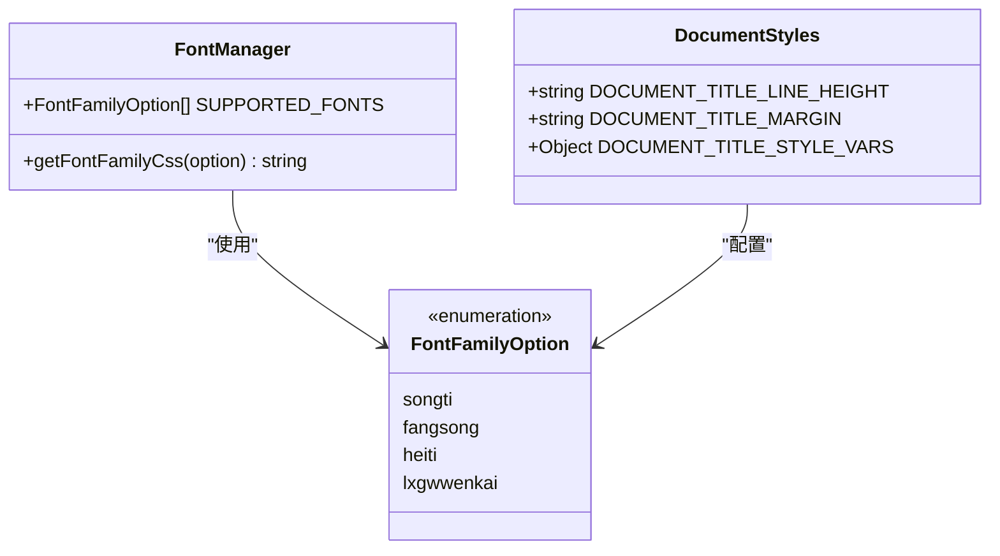
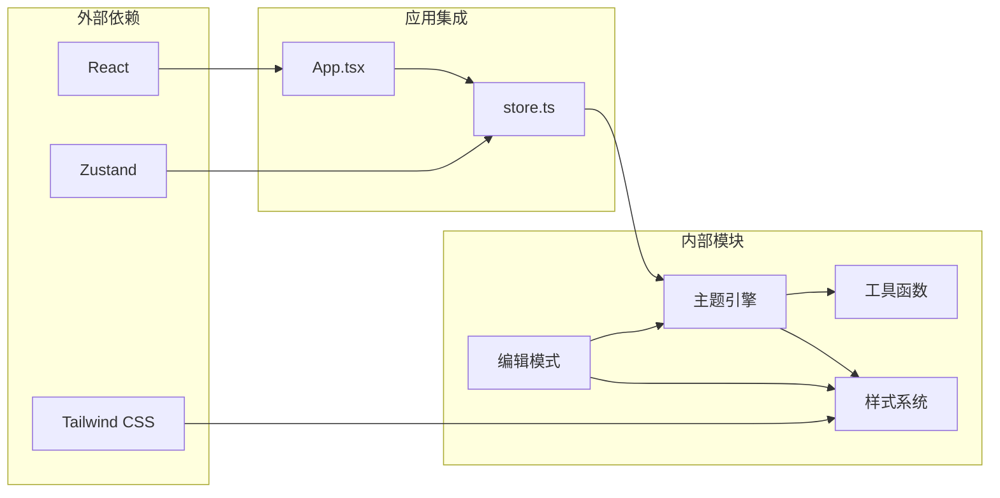

# 主题系统

<cite>
**本文档引用的文件**
- [useTheme.ts](file://src/engine/composables/useTheme.ts)
- [colorUtils.ts](file://src/engine/utils/colorUtils.ts)
- [fonts.ts](file://src/lib/fonts.ts)
- [index.css](file://src/index.css)
- [store.ts](file://src/lib/store.ts)
- [App.tsx](file://src/App.tsx)
- [ArticleMode.tsx](file://src/modes/article/ArticleMode.tsx)
- [DocumentMode.tsx](file://src/modes/document/DocumentMode.tsx)
- [CardMode.tsx](file://src/modes/card/CardMode.tsx)
- [xhsCards.ts](file://src/engine/utils/xhsCards.ts)
- [documentStyles.ts](file://src/modes/document/documentStyles.ts)
- [cardModel.ts](file://src/modes/card/cardModel.ts)
- [documentModel.ts](file://src/modes/document/documentModel.ts)
</cite>

## 目录
1. [简介](#简介)
2. [项目结构](#项目结构)
3. [核心组件](#核心组件)
4. [架构概览](#架构概览)
5. [详细组件分析](#详细组件分析)
6. [依赖分析](#依赖分析)
7. [性能考虑](#性能考虑)
8. [故障排除指南](#故障排除指南)
9. [结论](#结论)
10. [附录](#附录)

## 简介

MarkFlow 的主题系统是一个高度模块化的设计系统，专注于为多种编辑模式提供统一的视觉语言和交互体验。该系统通过组合式函数、状态管理和响应式更新机制，实现了跨模式的主题一致性，同时支持灵活的定制化需求。

主题系统的核心价值在于：
- **统一的视觉语言**：通过预设主题色和设计令牌，确保不同编辑模式间的一致性
- **响应式更新机制**：基于 Zustand 状态管理，实现主题变更的即时传播
- **多场景适配**：针对长图文、A4文档、小红书卡片等不同场景提供专门的主题策略
- **可扩展性**：提供完善的扩展接口，支持自定义主题和主题变量

## 项目结构

主题系统围绕以下核心层次组织：

**图表来源**
- [App.tsx:35-171](file://src/App.tsx#L35-L171)
- [store.ts:163-242](file://src/lib/store.ts#L163-L242)
- [useTheme.ts:1-68](file://src/engine/composables/useTheme.ts#L1-L68)

**章节来源**
- [App.tsx:1-172](file://src/App.tsx#L1-L172)
- [store.ts:1-242](file://src/lib/store.ts#L1-L242)

## 核心组件

### 主题颜色管理

主题系统的核心是 `ThemeColors` 类型定义和相关的颜色工具函数：

**图表来源**
- [useTheme.ts:4-67](file://src/engine/composables/useTheme.ts#L4-L67)
- [colorUtils.ts:8-87](file://src/engine/utils/colorUtils.ts#L8-L87)

### 状态管理系统

应用通过 Zustand 实现集中式状态管理，提供主题状态的持久化和响应式更新：

**图表来源**
- [store.ts:227-230](file://src/lib/store.ts#L227-L230)
- [useTheme.ts:59-67](file://src/engine/composables/useTheme.ts#L59-L67)

**章节来源**
- [useTheme.ts:1-68](file://src/engine/composables/useTheme.ts#L1-L68)
- [colorUtils.ts:1-88](file://src/engine/utils/colorUtils.ts#L1-L88)
- [store.ts:94-99](file://src/lib/store.ts#L94-L99)

## 架构概览

主题系统采用分层架构设计，确保各层职责清晰分离：

**图表来源**
- [App.tsx:35-171](file://src/App.tsx#L35-L171)
- [store.ts:163-242](file://src/lib/store.ts#L163-L242)

## 详细组件分析

### useTheme 组合式函数实现

`useTheme` 是主题系统的核心组合式函数，提供了完整的主题管理能力：

#### 主题颜色类型定义

**图表来源**
- [useTheme.ts:4-29](file://src/engine/composables/useTheme.ts#L4-L29)

#### 颜色计算工具函数

主题系统提供了丰富的颜色计算工具：

| 函数 | 功能 | 输入 | 输出 |
|------|------|------|------|
| `hexToRgb` | HEX转RGB字符串 | HEX颜色值 | RGB字符串 |
| `lightenHex` | 加亮颜色 | HEX颜色值, 亮度因子 | 加亮后的HEX |
| `darkenHex` | 减暗颜色 | HEX颜色值, 暗度因子 | 减暗后的HEX |
| `makeColors` | 生成完整主题色 | 主色, 深色 | ThemeColors对象 |

#### 颜色工具函数详解

**图表来源**
- [colorUtils.ts:56-87](file://src/engine/utils/colorUtils.ts#L56-L87)

**章节来源**
- [useTheme.ts:31-67](file://src/engine/composables/useTheme.ts#L31-L67)
- [colorUtils.ts:56-87](file://src/engine/utils/colorUtils.ts#L56-L87)

### 编辑模式主题适配策略

#### 长图文模式 (ArticleMode)

长图文模式采用简洁的双栏布局，主题适配重点在于：

- **对比度优化**：编辑器背景使用浅色(#fff)，预览区域使用浅灰(#f3f4f6)
- **响应式设计**：根据屏幕宽度动态调整列宽比例
- **滚动同步**：编辑器与预览区域的滚动位置保持同步

#### A4文档模式 (DocumentMode)

A4文档模式实现了复杂的分页渲染和主题适配：

**图表来源**
- [DocumentMode.tsx:56-129](file://src/modes/document/DocumentMode.tsx#L56-L129)
- [documentModel.ts:265-317](file://src/modes/document/documentModel.ts#L265-L317)

##### 文档主题变量系统

文档模式通过CSS自定义属性实现主题变量：

| 变量名 | 默认值 | 用途 |
|--------|--------|------|
| `--doc-font-size` | 15px | 正文字体大小 |
| `--doc-line-height` | 1.9 | 行高 |
| `--doc-h1-size` | 26px | 一级标题大小 |
| `--doc-h2-size` | 20px | 二级标题大小 |
| `--document-title-line-height` | 1.5 | 标题行高 |
| `--document-title-margin` | 0.85em 0 1.55em | 标题边距 |

#### 小红书卡片模式 (CardMode)

小红书卡片模式实现了复杂的多页卡片生成和主题适配：

**图表来源**
- [CardMode.tsx:80-144](file://src/modes/card/CardMode.tsx#L80-L144)
- [cardModel.ts:163-186](file://src/modes/card/cardModel.ts#L163-L186)

##### 小红书主题令牌

小红书卡片模式定义了专门的设计令牌：

| 令牌 | 值 | 用途 |
|------|-----|------|
| `XHS.bg` | `#F7F2E8` | 暖米底色 |
| `XHS.card` | `#FFFDF8` | 卡片背景色 |
| `XHS.ink` | `#1F1A17` | 暖黑主色 |
| `XHS.inkSoft` | `#5C5346` | 暖灰辅助色 |
| `XHS.inkFaint` | `#A89A86` | 更浅辅助色 |
| `XHS.dash` | `#D9C9AC` | 虚线边框色 |

**章节来源**
- [DocumentMode.tsx:1-345](file://src/modes/document/DocumentMode.tsx#L1-L345)
- [CardMode.tsx:1-364](file://src/modes/card/CardMode.tsx#L1-L364)
- [xhsCards.ts:14-51](file://src/engine/utils/xhsCards.ts#L14-L51)

### 字体管理系统

字体系统提供了灵活的字体族选择和CSS生成能力：

**图表来源**
- [fonts.ts:1-16](file://src/lib/fonts.ts#L1-L16)
- [documentStyles.ts:1-8](file://src/modes/document/documentStyles.ts#L1-L8)

**章节来源**
- [fonts.ts:1-16](file://src/lib/fonts.ts#L1-L16)
- [documentStyles.ts:1-8](file://src/modes/document/documentStyles.ts#L1-L8)

## 依赖分析

主题系统的依赖关系体现了清晰的分层架构：

**图表来源**
- [App.tsx:1-172](file://src/App.tsx#L1-L172)
- [store.ts:1-242](file://src/lib/store.ts#L1-L242)

### 关键依赖关系

1. **状态管理依赖**：所有编辑模式都依赖于 Zustand store 来获取和更新主题状态
2. **主题引擎依赖**：编辑模式通过主题引擎获取颜色信息和字体配置
3. **样式系统依赖**：CSS 变量系统为整个应用提供主题变量支持
4. **工具函数依赖**：颜色解析和转换功能为主题系统提供基础能力

**章节来源**
- [store.ts:163-242](file://src/lib/store.ts#L163-L242)
- [useTheme.ts:1-68](file://src/engine/composables/useTheme.ts#L1-L68)

## 性能考虑

### 主题切换性能优化

主题系统采用了多项性能优化策略：

1. **CSS变量更新**：通过 `setProperty` 方法批量更新CSS变量，避免DOM重绘
2. **状态缓存**：Zustand store 缓存主题状态，减少不必要的重新渲染
3. **懒加载组件**：编辑模式采用 React.lazy 实现按需加载
4. **防抖机制**：编辑器内容同步使用防抖技术减少频繁更新

### 内存管理

- **字体缓存**：字体CSS生成结果缓存在内存中，避免重复计算
- **颜色解析缓存**：常用颜色解析结果缓存，提高颜色转换效率
- **DOM测量缓存**：卡片和文档的DOM测量结果缓存，支持动态高度计算

### 渲染优化

- **虚拟滚动**：长文档模式使用虚拟滚动技术优化大文档渲染
- **分页渲染**：文档和卡片模式采用分页渲染，避免一次性渲染大量内容
- **条件渲染**：根据模式和设置动态决定渲染内容，减少不必要的计算

## 故障排除指南

### 常见问题及解决方案

#### 主题色不生效

**症状**：更改主题色后界面没有变化

**排查步骤**：
1. 检查 CSS 变量是否正确设置
2. 验证主题状态是否更新
3. 确认组件是否正确订阅主题状态

**解决方案**：
- 确保 `applyCssVars` 函数正确执行
- 检查 `setTheme` action 是否被调用
- 验证 CSS 变量在组件中的使用方式

#### 字体显示异常

**症状**：字体显示不正确或加载缓慢

**排查步骤**：
1. 检查字体CSS生成函数是否正确
2. 验证字体文件是否可访问
3. 确认字体回退机制

**解决方案**：
- 使用 `getFontFamilyCss` 函数生成正确的CSS
- 添加字体加载状态监听
- 实现字体回退策略

#### 卡片渲染问题

**症状**：卡片内容溢出或布局异常

**排查步骤**：
1. 检查卡片高度计算逻辑
2. 验证分页算法
3. 确认DOM测量准确性

**解决方案**：
- 调整 `PAGE_BUDGET` 配置
- 优化分页算法参数
- 实现更准确的高度测量

**章节来源**
- [store.ts:94-99](file://src/lib/store.ts#L94-L99)
- [fonts.ts:3-15](file://src/lib/fonts.ts#L3-L15)
- [cardModel.ts:19-23](file://src/modes/card/cardModel.ts#L19-L23)

## 结论

MarkFlow 的主题系统通过精心设计的架构和实现，成功地为多种编辑模式提供了统一而灵活的视觉体验。系统的关键优势包括：

1. **模块化设计**：清晰的分层架构使得各组件职责明确，易于维护和扩展
2. **响应式更新**：基于 Zustand 的状态管理提供了高效的响应式更新机制
3. **多场景适配**：针对不同编辑模式提供了专门的主题策略和优化
4. **可扩展性**：完善的扩展接口支持自定义主题和主题变量的创建

未来的发展方向包括：
- 进一步优化性能，特别是在大文档和复杂卡片场景
- 增强主题系统的可配置性，提供更多自定义选项
- 扩展支持更多的编辑模式和主题风格
- 改进主题预览和实时预览功能

## 附录

### 主题扩展开发指南

#### 创建自定义主题

1. **定义主题变量**：在 `useTheme.ts` 中添加新的主题预设
2. **实现颜色转换**：使用现有的颜色工具函数进行颜色转换
3. **测试主题效果**：在不同模式下测试主题效果

#### 自定义主题变量

1. **添加CSS变量**：在 `index.css` 中定义新的CSS变量
2. **更新主题引擎**：在 `useTheme.ts` 中扩展 `ThemeColors` 类型
3. **集成到组件**：在相关组件中使用新的主题变量

#### 主题兼容性处理

- **浏览器兼容性**：确保CSS变量在目标浏览器中的兼容性
- **降级方案**：为不支持CSS变量的浏览器提供降级方案
- **性能监控**：建立性能监控机制，及时发现和解决性能问题