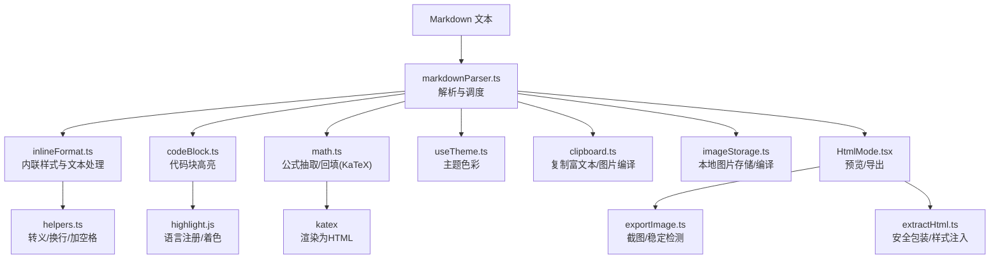
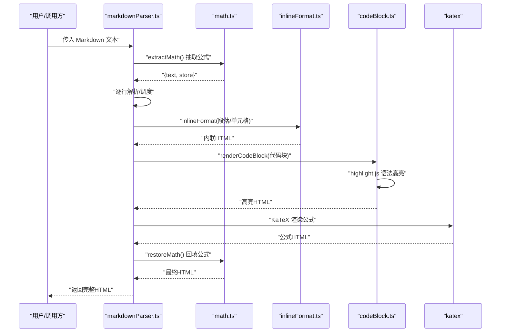
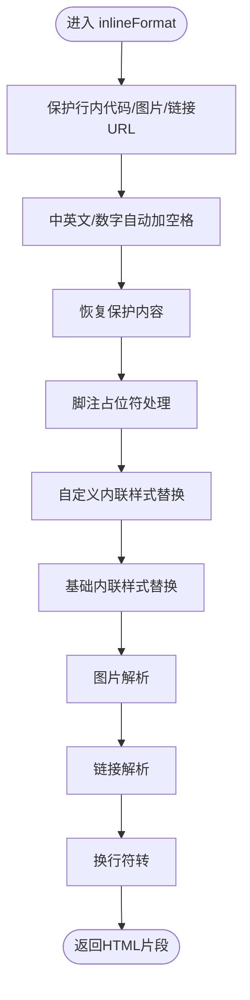
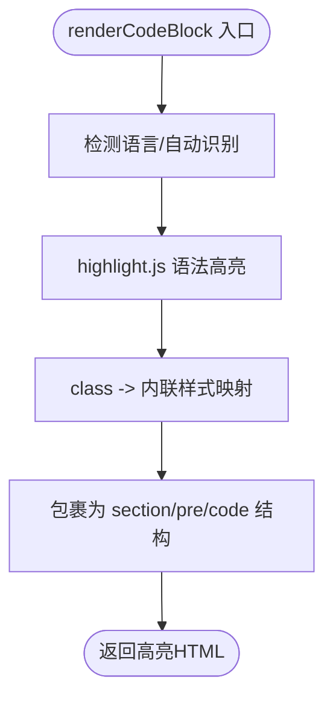
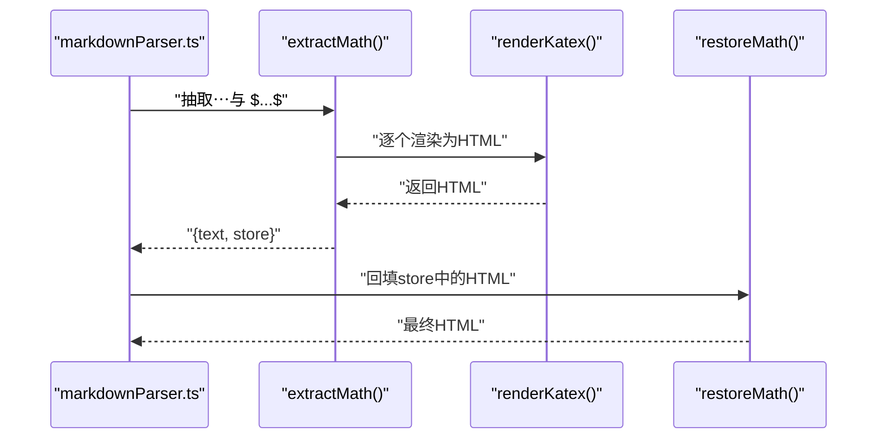
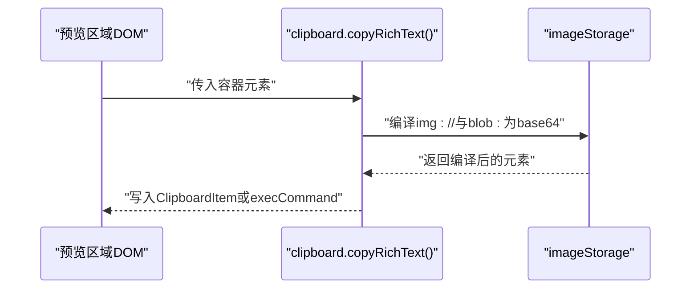
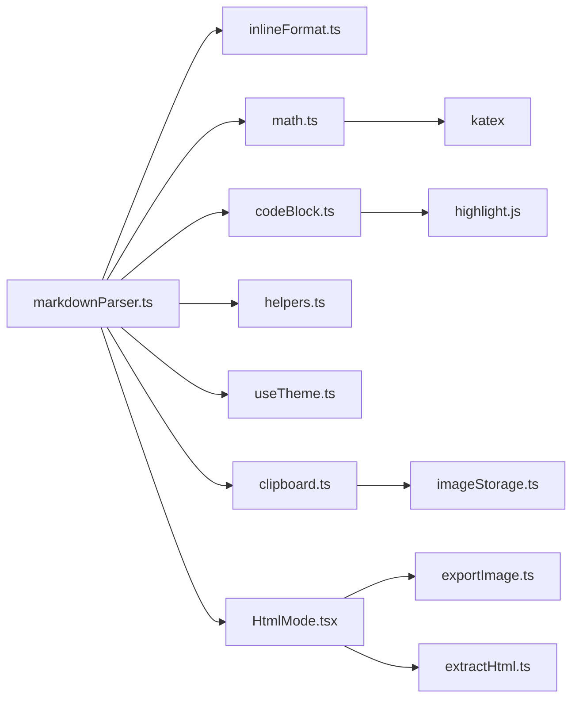

# 内联格式化

<cite>
**本文引用的文件**
- [inlineFormat.ts](file://src/engine/utils/inlineFormat.ts)
- [codeBlock.ts](file://src/engine/utils/codeBlock.ts)
- [math.ts](file://src/engine/utils/math.ts)
- [markdownParser.ts](file://src/engine/utils/markdownParser.ts)
- [helpers.ts](file://src/engine/utils/helpers.ts)
- [useTheme.ts](file://src/engine/composables/useTheme.ts)
- [clipboard.ts](file://src/lib/clipboard.ts)
- [imageStorage.ts](file://src/lib/editor/imageStorage.ts)
- [exportImage.ts](file://src/lib/exportImage.ts)
- [HtmlMode.tsx](file://src/modes/html/HtmlMode.tsx)
- [CodeEditor.tsx](file://src/components/editor/CodeEditor.tsx)
- [extractHtml.ts](file://src/lib/extractHtml.ts)
</cite>

## 目录
1. [简介](#简介)
2. [项目结构](#项目结构)
3. [核心组件](#核心组件)
4. [架构总览](#架构总览)
5. [详细组件分析](#详细组件分析)
6. [依赖关系分析](#依赖关系分析)
7. [性能考量](#性能考量)
8. [故障排查指南](#故障排查指南)
9. [结论](#结论)
10. [附录](#附录)

## 简介
本技术文档聚焦于内联格式化系统，系统覆盖 Markdown 内联元素（粗体、斜体、删除线、行内代码、上下标、下划线、强调等）的渲染、代码块的高亮与复制、数学公式（LaTeX）的抽取与回填渲染（KaTeX），以及整体渲染管线中的性能优化与扩展开发指南。文档面向开发者与高级用户，既提供高层架构说明，也给出代码级的可视化图示与来源标注。

## 项目结构
内联格式化能力主要由以下模块协同实现：
- 解析与渲染入口：markdownParser.ts
- 内联样式与文本处理：inlineFormat.ts、helpers.ts、useTheme.ts
- 代码块高亮：codeBlock.ts（基于 highlight.js）
- 数学公式渲染：math.ts（基于 KaTeX）
- 富文本复制与图片编译：clipboard.ts、imageStorage.ts
- 预览与导出：HtmlMode.tsx、exportImage.ts、extractHtml.ts
- 编辑器交互：CodeEditor.tsx（含快捷键与行内格式切换）

图表来源
- [markdownParser.ts:110-604](file://src/engine/utils/markdownParser.ts#L110-L604)
- [inlineFormat.ts:5-103](file://src/engine/utils/inlineFormat.ts#L5-L103)
- [codeBlock.ts:92-97](file://src/engine/utils/codeBlock.ts#L92-L97)
- [math.ts:33-70](file://src/engine/utils/math.ts#L33-L70)
- [helpers.ts:1-28](file://src/engine/utils/helpers.ts#L1-L28)
- [useTheme.ts:4-10](file://src/engine/composables/useTheme.ts#L4-L10)
- [clipboard.ts:64-100](file://src/lib/clipboard.ts#L64-L100)
- [imageStorage.ts:234-258](file://src/lib/editor/imageStorage.ts#L234-L258)
- [HtmlMode.tsx:92-111](file://src/modes/html/HtmlMode.tsx#L92-L111)
- [exportImage.ts:29-73](file://src/lib/exportImage.ts#L29-L73)
- [extractHtml.ts:50-59](file://src/lib/extractHtml.ts#L50-L59)

章节来源
- [markdownParser.ts:110-604](file://src/engine/utils/markdownParser.ts#L110-L604)

## 核心组件
- 内联格式化管线：负责将 Markdown 内联语法转换为带主题色的 HTML 片段，同时处理中英文自动加空格、换行、图片与链接等。
- 代码块高亮：对代码块进行语法高亮，输出可复制的富文本结构。
- 数学公式渲染：在解析前抽取公式，避免被内联规则破坏，解析后回填 KaTeX 渲染结果。
- 主题与样式：统一从主题模块获取色彩，确保内联元素与组件风格一致。
- 富文本复制：支持复制富文本并自动将本地图片占位符编译为 base64，提升跨应用粘贴体验。
- 预览与导出：在沙箱 iframe 中渲染，结合稳定检测与样式注入，保障截图质量。

章节来源
- [inlineFormat.ts:5-103](file://src/engine/utils/inlineFormat.ts#L5-L103)
- [codeBlock.ts:92-97](file://src/engine/utils/codeBlock.ts#L92-L97)
- [math.ts:33-70](file://src/engine/utils/math.ts#L33-L70)
- [useTheme.ts:4-10](file://src/engine/composables/useTheme.ts#L4-L10)
- [clipboard.ts:64-100](file://src/lib/clipboard.ts#L64-L100)

## 架构总览
内联格式化系统遵循“抽取-解析-渲染-回填”的流水线：
- 抽取阶段：数学公式先行抽取，避免被后续内联规则破坏。
- 解析阶段：按行扫描，识别标题、列表、表格、块级组件等，同时调用内联格式化处理段落与单元格文本。
- 渲染阶段：内联元素映射为带主题色的 HTML；代码块经高亮；公式回填 KaTeX 结果。
- 回填阶段：将抽取的公式占位符替换回渲染好的 HTML。

图表来源
- [markdownParser.ts:110-604](file://src/engine/utils/markdownParser.ts#L110-L604)
- [math.ts:33-70](file://src/engine/utils/math.ts#L33-L70)
- [inlineFormat.ts:5-103](file://src/engine/utils/inlineFormat.ts#L5-L103)
- [codeBlock.ts:92-97](file://src/engine/utils/codeBlock.ts#L92-L97)

## 详细组件分析

### 内联格式化管线（inlineFormat）
- 功能要点
  - 文本预处理：保护行内代码、图片与链接 URL，避免中英文自动加空格破坏链接。
  - 脚注占位符：支持带显示文字与无显示文字两种形式，渲染为带下划线与上标的脚注标记。
  - 自定义内联样式：渐变背景、胶囊文字、加重强调、柔光重点、下划线、删除线、上下标等。
  - 基础内联：粗体、斜体、行内代码、图片、链接。
  - 换行处理：将换行符转换为  ，并去除行首行尾缩进，保证顶格显示。
- 性能与健壮性
  - 使用占位符机制保护敏感内容，避免多次正则替换造成性能损耗。
  - 对主题色进行内联样式注入，减少外部样式依赖。
- 扩展建议
  - 新增内联元素时，遵循“先保护、再替换、后恢复”的模式，确保不破坏链接、图片与代码。

图表来源
- [inlineFormat.ts:5-103](file://src/engine/utils/inlineFormat.ts#L5-L103)

章节来源
- [inlineFormat.ts:5-103](file://src/engine/utils/inlineFormat.ts#L5-L103)

### 代码块高亮（codeBlock）
- 功能要点
  - 语言注册：内置多种语言（bash、cpp、css、go、java、javascript、json、markdown、python、rust、sql、typescript、xml）。
  - 语言别名：提供常见别名映射，增强兼容性。
  - 着色策略：将 highlight.js 的 class 名映射为内联样式，使复制到富文本后仍保留高亮。
  - 输出结构：返回带主题色背景与字体的 section/pre/code 结构，支持换行与断词。
- 性能与健壮性
  - 语言不存在时回退到自动识别；异常时转义原始代码，避免中断渲染。
- 扩展建议
  - 新增语言时，在注册处加入对应模块并补充别名映射。

图表来源
- [codeBlock.ts:92-97](file://src/engine/utils/codeBlock.ts#L92-L97)
- [codeBlock.ts:75-90](file://src/engine/utils/codeBlock.ts#L75-L90)

章节来源
- [codeBlock.ts:17-41](file://src/engine/utils/codeBlock.ts#L17-L41)
- [codeBlock.ts:75-90](file://src/engine/utils/codeBlock.ts#L75-L90)
- [codeBlock.ts:92-97](file://src/engine/utils/codeBlock.ts#L92-L97)

### 数学公式渲染（math）
- 功能要点
  - 抽取策略：先抽取块级 $$...$$ 与行内 $...$，使用私有区 Unicode 占位符，避免被内联规则破坏。
  - 渲染策略：使用 KaTeX 将表达式渲染为 HTML，支持 displayMode 与 throwOnError=false 的健壮性策略。
  - 回填策略：先处理被 
 包裹的块级公式，再处理裸占位符，确保与解析器输出对齐。
- 性能与健壮性
  - 使用 Map 存储 token 与渲染结果，避免重复计算。
  - 渲染失败时降级为原始文本，保证整体可用性。
- 扩展建议
  - 如需支持更多公式特性，可在渲染选项中调整 KaTeX 配置。

图表来源
- [math.ts:33-70](file://src/engine/utils/math.ts#L33-L70)
- [markdownParser.ts:110-604](file://src/engine/utils/markdownParser.ts#L110-L604)

章节来源
- [math.ts:13-17](file://src/engine/utils/math.ts#L13-L17)
- [math.ts:33-70](file://src/engine/utils/math.ts#L33-L70)

### 主题与样式（useTheme、helpers）
- 主题色彩：提供 accent、dark、light、border、rgb 等字段，支持 hex/rgb/命名色的转换与透明度处理。
- 文本处理：提供转义、中英文自动加空格、换行到   的工具函数，以及 leaf 包装以适配特定平台换行语义。
- 内联样式：inlineFormat 将主题色注入到内联元素，确保视觉一致性。

章节来源
- [useTheme.ts:4-10](file://src/engine/composables/useTheme.ts#L4-L10)
- [useTheme.ts:59-67](file://src/engine/composables/useTheme.ts#L59-L67)
- [helpers.ts:1-28](file://src/engine/utils/helpers.ts#L1-L28)
- [helpers.ts:41-99](file://src/engine/utils/helpers.ts#L41-L99)
- [inlineFormat.ts:5-103](file://src/engine/utils/inlineFormat.ts#L5-L103)

### 富文本复制与图片编译（clipboard、imageStorage）
- 复制富文本：优先使用 Clipboard API，降级到 execCommand 方案；同时将 blob: 与 img:// 占位符编译为 base64，确保跨应用粘贴时图片可见。
- 本地图片存储：通过 IndexedDB 存储图片 Blob，提供内存 URL 缓存与 base64 编译能力。
- 编辑器集成：编辑器支持快捷键切换行内格式，配合内联元素语法增强编辑体验。

图表来源
- [clipboard.ts:64-100](file://src/lib/clipboard.ts#L64-L100)
- [imageStorage.ts:32-61](file://src/lib/editor/imageStorage.ts#L32-L61)
- [imageStorage.ts:234-258](file://src/lib/editor/imageStorage.ts#L234-L258)

章节来源
- [clipboard.ts:4-27](file://src/lib/clipboard.ts#L4-L27)
- [clipboard.ts:64-100](file://src/lib/clipboard.ts#L64-L100)
- [imageStorage.ts:109-137](file://src/lib/editor/imageStorage.ts#L109-L137)
- [imageStorage.ts:234-258](file://src/lib/editor/imageStorage.ts#L234-L258)

### 预览与导出（HtmlMode、exportImage、extractHtml）
- HtmlMode：左侧编辑 HTML，右侧 iframe 沙箱实时渲染，支持脚本开关与提示。
- 导出稳定检测：通过 MutationObserver 与定时器检测 DOM 稳定，避免截图时动画未完成。
- HTML 提取与注入：对输入进行安全包装，自动注入 crossOrigin 以支持字体嵌入。

章节来源
- [HtmlMode.tsx:92-111](file://src/modes/html/HtmlMode.tsx#L92-L111)
- [exportImage.ts:29-73](file://src/lib/exportImage.ts#L29-L73)
- [extractHtml.ts:50-59](file://src/lib/extractHtml.ts#L50-L59)

## 依赖关系分析
- 组件耦合
  - markdownParser 依赖 inlineFormat、math、codeBlock、helpers、useTheme 等模块，形成清晰的职责边界。
  - codeBlock 依赖 highlight.js；math 依赖 katex；clipboard 与 imageStorage 协同处理图片编译。
- 外部依赖
  - highlight.js：语法高亮
  - katex：数学公式渲染
  - IndexedDB：本地图片存储
  - Clipboard API：富文本复制

图表来源
- [markdownParser.ts:110-604](file://src/engine/utils/markdownParser.ts#L110-L604)
- [codeBlock.ts:17-29](file://src/engine/utils/codeBlock.ts#L17-L29)
- [math.ts:19-30](file://src/engine/utils/math.ts#L19-L30)
- [clipboard.ts:32-61](file://src/lib/clipboard.ts#L32-L61)
- [imageStorage.ts:109-137](file://src/lib/editor/imageStorage.ts#L109-L137)
- [HtmlMode.tsx:92-111](file://src/modes/html/HtmlMode.tsx#L92-L111)
- [exportImage.ts:29-73](file://src/lib/exportImage.ts#L29-L73)
- [extractHtml.ts:50-59](file://src/lib/extractHtml.ts#L50-L59)

## 性能考量
- DOM 操作最小化
  - 内联格式化与代码块高亮均以字符串拼接为主，避免频繁 DOM 查询与修改。
  - 富文本复制时批量编译图片为 base64，减少多次 IO。
- 渲染缓存
  - 数学公式使用 Map 存储 token 与渲染结果，避免重复渲染。
  - 本地图片通过内存 URL 缓存（localImageUrls）与 IndexedDB 存储，减少重复读取。
- 稳定检测与节流
  - 导出截图使用 MutationObserver 与定时器检测 DOM 稳定，避免过早截图。
- 语言与主题
  - 主题色彩统一注入，减少外部样式查询成本。

章节来源
- [math.ts:33-70](file://src/engine/utils/math.ts#L33-L70)
- [imageStorage.ts:109-137](file://src/lib/editor/imageStorage.ts#L109-L137)
- [exportImage.ts:29-73](file://src/lib/exportImage.ts#L29-L73)

## 故障排查指南
- 数学公式渲染失败
  - 现象：块级或行内公式显示为原文本。
  - 排查：确认 KaTeX 渲染选项与表达式合法性；检查抽取/回填流程是否正确。
  - 参考
    - [math.ts:19-30](file://src/engine/utils/math.ts#L19-L30)
    - [math.ts:33-70](file://src/engine/utils/math.ts#L33-L70)
- 代码块高亮异常
  - 现象：代码块无高亮或报错。
  - 排查：确认语言注册与别名映射；检查 highlight.js 初始化与异常捕获。
  - 参考
    - [codeBlock.ts:17-41](file://src/engine/utils/codeBlock.ts#L17-L41)
    - [codeBlock.ts:75-90](file://src/engine/utils/codeBlock.ts#L75-L90)
- 富文本复制图片缺失
  - 现象：复制到其他应用后图片不显示。
  - 排查：确认本地图片是否成功编译为 base64；检查 blob/img:// 占位符替换逻辑。
  - 参考
    - [clipboard.ts:64-100](file://src/lib/clipboard.ts#L64-L100)
    - [imageStorage.ts:234-258](file://src/lib/editor/imageStorage.ts#L234-L258)
- 预览截图不稳定
  - 现象：导出图片闪烁或内容未完全渲染。
  - 排查：确认稳定检测参数与动画完成时机；检查 iframe 内样式与资源加载。
  - 参考
    - [exportImage.ts:29-73](file://src/lib/exportImage.ts#L29-L73)
    - [HtmlMode.tsx:92-111](file://src/modes/html/HtmlMode.tsx#L92-L111)

## 结论
该内联格式化系统通过“抽取-解析-渲染-回填”的清晰流程，实现了对 Markdown 内联元素、代码块高亮与数学公式渲染的完整支持。系统在主题一致性、富文本复制与图片编译、以及导出稳定性方面具备良好实践。扩展新内联元素时，应遵循现有占位符与回填模式，确保与链接、图片与公式等敏感内容互不干扰。

## 附录
- 扩展开发指南
  - 新增内联元素
    - 在 inlineFormat 中新增替换规则，遵循“保护-替换-恢复”顺序。
    - 若涉及链接/图片/代码，请先保护，再进行中英文加空格，最后恢复。
    - 参考
      - [inlineFormat.ts:5-16](file://src/engine/utils/inlineFormat.ts#L5-L16)
      - [inlineFormat.ts:19-103](file://src/engine/utils/inlineFormat.ts#L19-L103)
  - 新增代码语言
    - 在 codeBlock.ts 注册语言与别名映射。
    - 参考
      - [codeBlock.ts:17-41](file://src/engine/utils/codeBlock.ts#L17-L41)
  - 新增数学公式特性
    - 调整 KaTeX 渲染选项或在抽取/回填阶段增加特殊处理。
    - 参考
      - [math.ts:19-30](file://src/engine/utils/math.ts#L19-L30)
      - [math.ts:33-70](file://src/engine/utils/math.ts#L33-L70)
  - 富文本复制增强
    - 在 clipboard.ts 中扩展编译逻辑，支持更多图片来源或格式。
    - 参考
      - [clipboard.ts:32-61](file://src/lib/clipboard.ts#L32-L61)
      - [imageStorage.ts:109-137](file://src/lib/editor/imageStorage.ts#L109-L137)