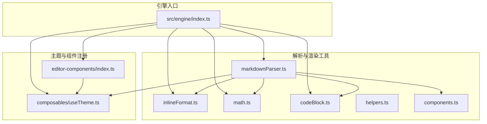
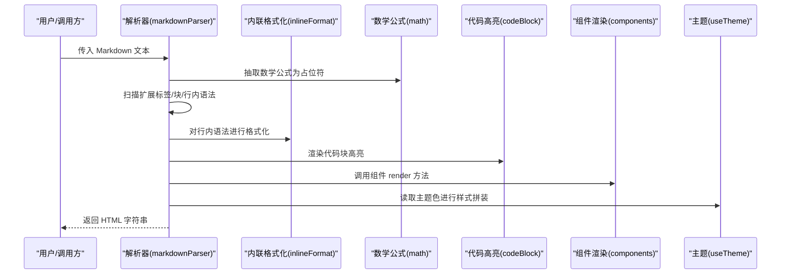
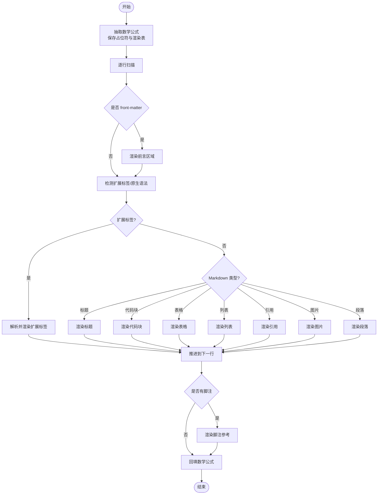
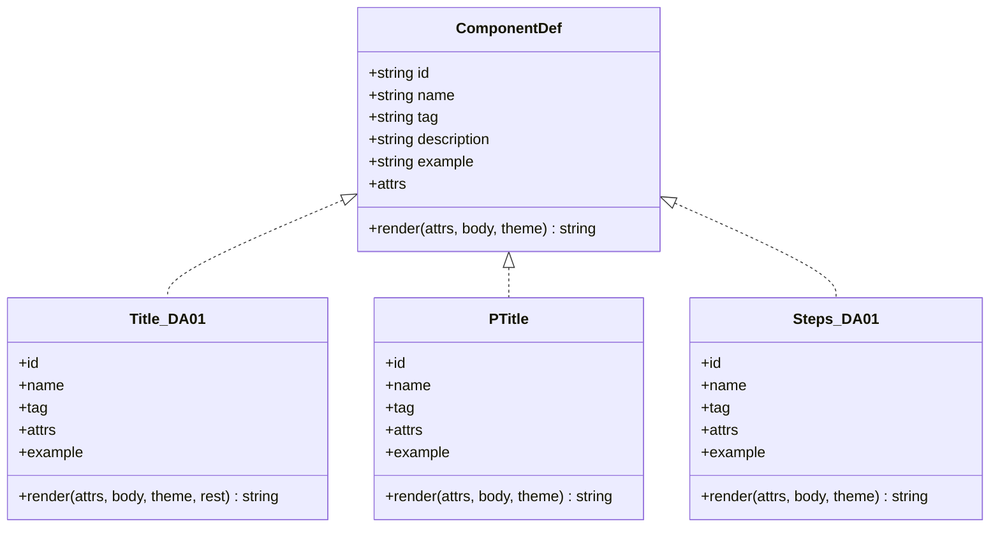
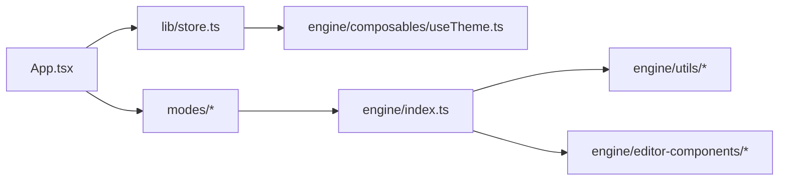

# 渲染引擎

<cite>
**本文引用的文件**
- [src/engine/index.ts](file://src/engine/index.ts)
- [src/engine/utils/markdownParser.ts](file://src/engine/utils/markdownParser.ts)
- [src/engine/utils/components.ts](file://src/engine/utils/components.ts)
- [src/engine/utils/inlineFormat.ts](file://src/engine/utils/inlineFormat.ts)
- [src/engine/utils/math.ts](file://src/engine/utils/math.ts)
- [src/engine/utils/codeBlock.ts](file://src/engine/utils/codeBlock.ts)
- [src/engine/utils/helpers.ts](file://src/engine/utils/helpers.ts)
- [src/engine/composables/useTheme.ts](file://src/engine/composables/useTheme.ts)
- [src/engine/editor-components/index.ts](file://src/engine/editor-components/index.ts)
- [src/engine/editor-components/Title_DA01.ts](file://src/engine/editor-components/Title_DA01.ts)
- [src/engine/editor-components/PTitle_DA01.ts](file://src/engine/editor-components/PTitle_DA01.ts)
- [src/engine/editor-components/Steps_DA01.ts](file://src/engine/editor-components/Steps_DA01.ts)
- [src/lib/store.ts](file://src/lib/store.ts)
- [src/App.tsx](file://src/App.tsx)
</cite>

## 目录
1. [简介](#简介)
2. [项目结构](#项目结构)
3. [核心组件](#核心组件)
4. [架构总览](#架构总览)
5. [详细组件分析](#详细组件分析)
6. [依赖关系分析](#依赖关系分析)
7. [性能考量](#性能考量)
8. [故障排查指南](#故障排查指南)
9. [结论](#结论)
10. [附录](#附录)

## 简介
本技术文档面向 MarkFlow 渲染引擎，系统性阐述其解析与渲染机制。内容覆盖：
- Markdown 解析器的实现原理：语法树构建思路、节点类型与解析规则
- 富文本组件渲染机制：内置组件库（标题、段落、列表、表格等）的实现与扩展方法
- 主题系统架构：颜色管理、字体配置与响应式样式
- 渲染性能优化策略：懒加载、虚拟滚动与内存管理建议
- 自定义组件开发指南：如何扩展渲染引擎以支持新的组件类型
- 渲染流程的完整数据流分析与错误处理机制

## 项目结构
渲染引擎位于 src/engine 下，采用“工具函数 + 组件注册中心”的模块化组织方式：
- utils：解析与渲染的核心工具（Markdown 解析、内联格式化、数学公式、代码高亮、辅助工具）
- editor-components：富文本组件注册中心与具体组件实现
- composables：主题与颜色工具（与框架解耦）
- index.ts：对外统一出口，聚合导出解析与渲染能力

图表来源
- [src/engine/index.ts:1-16](file://src/engine/index.ts#L1-L16)
- [src/engine/utils/markdownParser.ts:1-605](file://src/engine/utils/markdownParser.ts#L1-L605)
- [src/engine/utils/inlineFormat.ts:1-104](file://src/engine/utils/inlineFormat.ts#L1-L104)
- [src/engine/utils/math.ts:1-71](file://src/engine/utils/math.ts#L1-L71)
- [src/engine/utils/codeBlock.ts:1-98](file://src/engine/utils/codeBlock.ts#L1-L98)
- [src/engine/utils/helpers.ts:1-115](file://src/engine/utils/helpers.ts#L1-L115)
- [src/engine/utils/components.ts:1-333](file://src/engine/utils/components.ts#L1-L333)
- [src/engine/composables/useTheme.ts:1-68](file://src/engine/composables/useTheme.ts#L1-L68)
- [src/engine/editor-components/index.ts:1-81](file://src/engine/editor-components/index.ts#L1-L81)

章节来源
- [src/engine/index.ts:1-16](file://src/engine/index.ts#L1-L16)
- [src/engine/utils/markdownParser.ts:1-605](file://src/engine/utils/markdownParser.ts#L1-L605)
- [src/engine/editor-components/index.ts:1-81](file://src/engine/editor-components/index.ts#L1-L81)

## 核心组件
- 解析器：负责将 Markdown 文本转换为 HTML，并处理扩展标签、块级/行内语法、数学公式与脚注
- 内联格式化：对行内语法（加粗、斜体、删除线、脚注占位符、行内代码、图片、链接等）进行渲染
- 数学公式：采用“抽取-渲染-回填”策略，避免公式内容被 Markdown 规则破坏
- 代码块：基于 highlight.js 的语言高亮，输出内联样式以便复制到富文本目标
- 组件注册中心：集中管理组件定义、索引与渲染接口
- 主题系统：提供预设主题色、颜色计算与 RGB 转换工具

章节来源
- [src/engine/utils/markdownParser.ts:110-605](file://src/engine/utils/markdownParser.ts#L110-L605)
- [src/engine/utils/inlineFormat.ts:5-104](file://src/engine/utils/inlineFormat.ts#L5-L104)
- [src/engine/utils/math.ts:32-71](file://src/engine/utils/math.ts#L32-L71)
- [src/engine/utils/codeBlock.ts:75-98](file://src/engine/utils/codeBlock.ts#L75-L98)
- [src/engine/editor-components/index.ts:20-81](file://src/engine/editor-components/index.ts#L20-L81)
- [src/engine/composables/useTheme.ts:4-68](file://src/engine/composables/useTheme.ts#L4-L68)

## 架构总览
渲染引擎遵循“解析器 + 组件渲染 + 主题驱动”的分层架构。解析器负责将 Markdown 文本扫描为 HTML 片段，内联格式化器处理行内样式，数学公式与代码高亮分别在抽取阶段与块级渲染阶段介入，最终由组件注册中心与主题系统共同完成富文本渲染。

图表来源
- [src/engine/utils/markdownParser.ts:110-605](file://src/engine/utils/markdownParser.ts#L110-L605)
- [src/engine/utils/inlineFormat.ts:5-104](file://src/engine/utils/inlineFormat.ts#L5-L104)
- [src/engine/utils/math.ts:32-71](file://src/engine/utils/math.ts#L32-L71)
- [src/engine/utils/codeBlock.ts:75-98](file://src/engine/utils/codeBlock.ts#L75-L98)
- [src/engine/utils/components.ts:1-333](file://src/engine/utils/components.ts#L1-L333)
- [src/engine/composables/useTheme.ts:58-68](file://src/engine/composables/useTheme.ts#L58-L68)

## 详细组件分析

### 解析器与语法树构建
解析器采用“逐行扫描 + 状态推进”的策略，将 Markdown 文本映射为 HTML 片段。其核心流程包括：
- 数学公式抽取：先抽取块级与行内公式，避免后续解析破坏
- 前言区域处理：识别并渲染 front-matter
- 扩展标签解析：对 <steps>、<statement>、<badges>、::: cta、<lead>、<breaking>、<compare>、<reading-path>、<title>、<p-title>、<case-flow>、<timeline>、<slider>、: engage/<engage> 等进行专门解析
- 原生 Markdown 渲染：标题、代码块、表格、列表、引用、图片与段落
- 脚注收集与回填：将脚注占位符替换为参考文献列表

图表来源
- [src/engine/utils/markdownParser.ts:110-605](file://src/engine/utils/markdownParser.ts#L110-L605)
- [src/engine/utils/math.ts:32-71](file://src/engine/utils/math.ts#L32-L71)

章节来源
- [src/engine/utils/markdownParser.ts:110-605](file://src/engine/utils/markdownParser.ts#L110-L605)

### 内联格式化与行内语法
内联格式化器负责处理行内样式与特殊标记，包括：
- 保护机制：先暂存行内代码、图片与链接片段，避免盘古加空格破坏
- 脚注占位符：将 __FN_N__ 替换为带下划线与上标的脚注标记
- 强调与修饰：==渐变背景==、!!胶囊文字!!、^^加重强调^^、::柔光重点::
- 文字修饰：__下划线__、~~删除线~~、~下标~、^上标^、**粗体**、*斜体*
- 行内元素：`行内代码`、[size]、[text](url)
- 换行处理：将换行符转换为   并去除行首/行尾缩进

章节来源
- [src/engine/utils/inlineFormat.ts:5-104](file://src/engine/utils/inlineFormat.ts#L5-L104)
- [src/engine/utils/helpers.ts:10-28](file://src/engine/utils/helpers.ts#L10-L28)

### 数学公式与代码高亮
- 数学公式：采用“抽取-渲染-回填”策略，块级与行内公式分别处理，失败时降级为原文本
- 代码高亮：基于 highlight.js，支持多种语言别名，将 token 转为内联样式，便于复制到富文本目标

章节来源
- [src/engine/utils/math.ts:19-71](file://src/engine/utils/math.ts#L19-L71)
- [src/engine/utils/codeBlock.ts:75-98](file://src/engine/utils/codeBlock.ts#L75-L98)

### 组件注册中心与内置组件
组件注册中心提供统一的组件定义接口与索引：
- 组件定义接口：id、name、tag、description、example、attrs、render
- 按 id/tag 索引：便于解析器与编辑器侧查找与调用
- 内置组件示例：Title、PTitle、Steps 等，均以 render(attrs, body, theme) 形式输出内联样式 HTML

图表来源
- [src/engine/editor-components/index.ts:20-81](file://src/engine/editor-components/index.ts#L20-L81)
- [src/engine/editor-components/Title_DA01.ts:74-119](file://src/engine/editor-components/Title_DA01.ts#L74-L119)
- [src/engine/editor-components/PTitle_DA01.ts:33-186](file://src/engine/editor-components/PTitle_DA01.ts#L33-L186)
- [src/engine/editor-components/Steps_DA01.ts:22-103](file://src/engine/editor-components/Steps_DA01.ts#L22-L103)

章节来源
- [src/engine/editor-components/index.ts:20-81](file://src/engine/editor-components/index.ts#L20-L81)
- [src/engine/editor-components/Title_DA01.ts:74-119](file://src/engine/editor-components/Title_DA01.ts#L74-L119)
- [src/engine/editor-components/PTitle_DA01.ts:33-186](file://src/engine/editor-components/PTitle_DA01.ts#L33-L186)
- [src/engine/editor-components/Steps_DA01.ts:22-103](file://src/engine/editor-components/Steps_DA01.ts#L22-L103)

### 主题系统与颜色管理
主题系统提供：
- 预设主题色：15 组主色/深色组合
- 颜色工具：HEX 转 RGB、浅化/深化妆颜色、withAlpha 透明度处理
- 主题生成：根据主色与深色生成 ThemeColors（accent、dark、light、border、rgb）

章节来源
- [src/engine/composables/useTheme.ts:13-68](file://src/engine/composables/useTheme.ts#L13-L68)

### 富文本组件渲染机制
解析器在遇到扩展标签或原生 Markdown 时，调用对应组件的 render 方法或内联格式化器，最终输出内联样式的 HTML。组件通过 attrs 控制外观与行为，主题色贯穿于所有样式拼装。

章节来源
- [src/engine/utils/markdownParser.ts:182-422](file://src/engine/utils/markdownParser.ts#L182-L422)
- [src/engine/utils/components.ts:9-333](file://src/engine/utils/components.ts#L9-L333)

### 自定义组件开发指南
扩展渲染引擎以支持新组件的步骤：
- 定义组件：实现 ComponentDef 接口（id、name、tag、attrs、example、render）
- 实现渲染逻辑：render(attrs, body, theme, ...rest) 返回内联样式 HTML
- 注册组件：将组件加入 components 数组，并维护 componentMap 与 tagMap
- 在解析器中接入：在解析器的扩展标签分支中调用新组件的 render
- 主题集成：通过 theme 参数读取主题色，保证风格一致

章节来源
- [src/engine/editor-components/index.ts:20-81](file://src/engine/editor-components/index.ts#L20-L81)
- [src/engine/utils/markdownParser.ts:182-422](file://src/engine/utils/markdownParser.ts#L182-L422)

## 依赖关系分析
渲染引擎与应用层的依赖关系：
- App.tsx 通过 Zustand store 获取主题色与模式状态，传递给各模式组件
- store.ts 提供主题色生成与 CSS 变量应用，确保主题变更即时生效
- 解析器与组件渲染不依赖前端框架，通过引擎统一出口暴露

图表来源
- [src/App.tsx:34-172](file://src/App.tsx#L34-L172)
- [src/lib/store.ts:163-242](file://src/lib/store.ts#L163-L242)
- [src/engine/index.ts:1-16](file://src/engine/index.ts#L1-L16)

章节来源
- [src/App.tsx:34-172](file://src/App.tsx#L34-L172)
- [src/lib/store.ts:163-242](file://src/lib/store.ts#L163-L242)
- [src/engine/index.ts:1-16](file://src/engine/index.ts#L1-L16)

## 性能考量
- 懒加载与按需渲染：解析器采用顺序扫描，避免一次性构建完整语法树，降低内存峰值
- 代码高亮：仅在代码块出现时触发高亮，语言注册与 token 映射在模块初始化时完成
- 数学公式：抽取-渲染-回填策略减少正则与 DOM 操作次数，失败时快速降级
- 内联样式：组件与解析器输出内联样式，减少外部样式依赖，提升复制粘贴一致性
- 建议的进一步优化（概念性指导）：
  - 大文档分页/分块渲染：将长文档切分为页面块，按需渲染
  - 虚拟滚动：在预览容器中对列表/表格等进行虚拟化，减少 DOM 节点数量
  - 内存管理：对临时字符串与 Map 结构及时释放，避免长时间积累

[本节为通用性能讨论，不直接分析具体文件]

## 故障排查指南
- 数学公式渲染异常：检查公式是否被意外包裹在段落标签中，确认占位符回填逻辑是否生效
- 行内语法错位：确认内联格式化器的保护机制是否正确暂存行内代码/图片/链接
- 代码高亮缺失：检查语言注册与别名映射，确认 highlight.js 初始化是否成功
- 主题色不生效：确认 store 是否正确应用 CSS 变量，组件是否使用主题色参数
- 扩展标签未识别：核对解析器中的标签分支与组件注册是否一致

章节来源
- [src/engine/utils/math.ts:19-71](file://src/engine/utils/math.ts#L19-L71)
- [src/engine/utils/inlineFormat.ts:5-104](file://src/engine/utils/inlineFormat.ts#L5-L104)
- [src/engine/utils/codeBlock.ts:75-98](file://src/engine/utils/codeBlock.ts#L75-L98)
- [src/lib/store.ts:94-161](file://src/lib/store.ts#L94-L161)

## 结论
MarkFlow 渲染引擎以“解析器 + 组件渲染 + 主题系统”为核心，实现了对 Markdown 与扩展标签的高效渲染。其“抽取-渲染-回填”的数学公式处理与内联样式输出策略，确保了在富文本平台上的高兼容性。通过组件注册中心与清晰的接口约定，开发者可以便捷地扩展新的组件类型。结合懒加载与按需渲染的策略，引擎在保持良好交互体验的同时，具备良好的可扩展性与可维护性。

[本节为总结性内容，不直接分析具体文件]

## 附录
- 引擎统一出口：导出解析器、内联格式化、数学公式、代码高亮、组件注册与主题工具
- 主题与字体：通过 store 管理主题色与 CSS 变量，组件与解析器消费主题色
- 示例与演示：App.tsx 提供多模式演示入口，支持示例内容同步与恢复

章节来源
- [src/engine/index.ts:1-16](file://src/engine/index.ts#L1-L16)
- [src/lib/store.ts:94-161](file://src/lib/store.ts#L94-L161)
- [src/App.tsx:26-32](file://src/App.tsx#L26-L32)