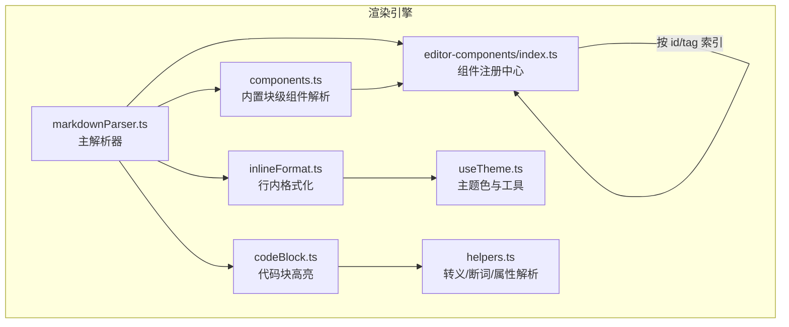
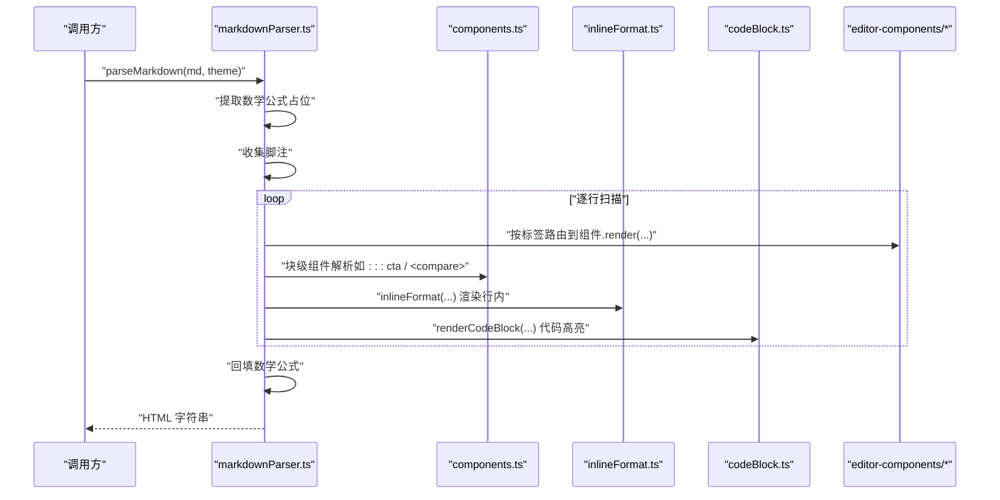
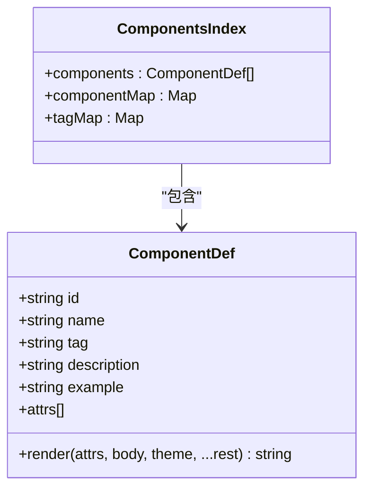
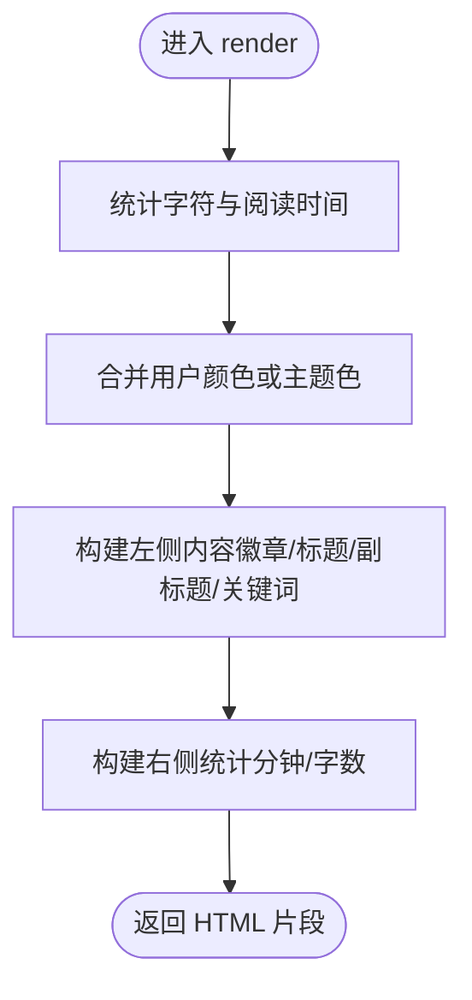
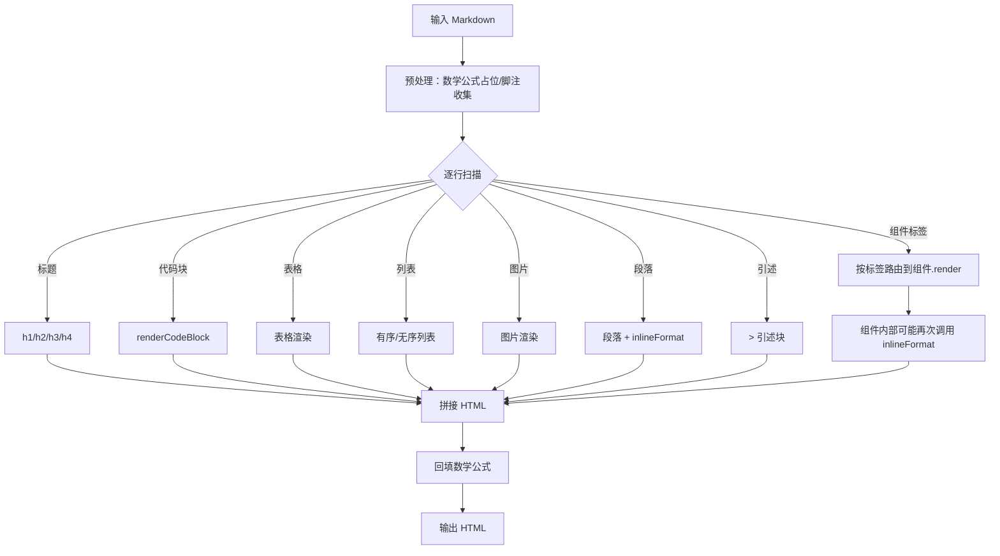
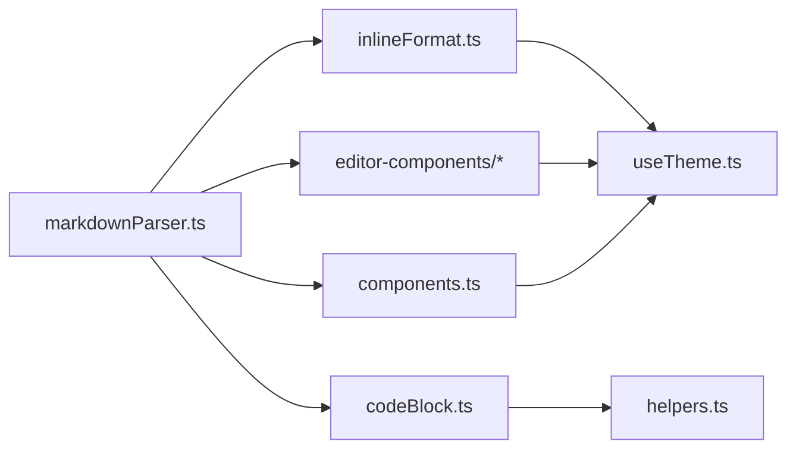

# 组件渲染器

<cite>
**本文档引用的文件**
- [src/engine/index.ts](file://src/engine/index.ts)
- [src/engine/utils/markdownParser.ts](file://src/engine/utils/markdownParser.ts)
- [src/engine/utils/components.ts](file://src/engine/utils/components.ts)
- [src/engine/utils/inlineFormat.ts](file://src/engine/utils/inlineFormat.ts)
- [src/engine/utils/codeBlock.ts](file://src/engine/utils/codeBlock.ts)
- [src/engine/utils/helpers.ts](file://src/engine/utils/helpers.ts)
- [src/engine/composables/useTheme.ts](file://src/engine/composables/useTheme.ts)
- [src/engine/editor-components/index.ts](file://src/engine/editor-components/index.ts)
- [src/engine/editor-components/Title_DA01.ts](file://src/engine/editor-components/Title_DA01.ts)
- [src/engine/editor-components/PTitle_DA01.ts](file://src/engine/editor-components/PTitle_DA01.ts)
- [src/engine/editor-components/Steps_DA01.ts](file://src/engine/editor-components/Steps_DA01.ts)
- [src/engine/editor-components/Compare_DA01.ts](file://src/engine/editor-components/Compare_DA01.ts)
</cite>

## 目录
1. [简介](#简介)
2. [项目结构](#项目结构)
3. [核心组件](#核心组件)
4. [架构总览](#架构总览)
5. [组件详解](#组件详解)
6. [依赖关系分析](#依赖关系分析)
7. [性能考量](#性能考量)
8. [调试与故障排除](#调试与故障排除)
9. [结论](#结论)
10. [附录](#附录)

## 简介
本文件系统性阐述“组件渲染器”的技术实现，覆盖富文本组件的注册、渲染流程与 DOM 生成机制；详解内置组件库（标题、段落标题、步骤流、对比、CTA、公告、引述、图片画廊等）的渲染逻辑；给出组件扩展开发指南与组合模式；明确组件间依赖与渲染优先级；并提供最佳实践与性能优化建议以及调试方法。

## 项目结构
渲染引擎位于 src/engine 下，采用“工具层 + 组件层 + 注册中心”的分层组织：
- 工具层：解析、格式化、高亮、辅助函数、主题色
- 组件层：编辑器组件（editor-components）
- 注册中心：组件注册与索引（id/tag）

**图表来源**
- [src/engine/utils/markdownParser.ts:110-604](file://src/engine/utils/markdownParser.ts#L110-L604)
- [src/engine/utils/components.ts:1-333](file://src/engine/utils/components.ts#L1-L333)
- [src/engine/utils/inlineFormat.ts:1-104](file://src/engine/utils/inlineFormat.ts#L1-L104)
- [src/engine/utils/codeBlock.ts:1-98](file://src/engine/utils/codeBlock.ts#L1-L98)
- [src/engine/utils/helpers.ts:1-115](file://src/engine/utils/helpers.ts#L1-L115)
- [src/engine/composables/useTheme.ts:1-68](file://src/engine/composables/useTheme.ts#L1-L68)
- [src/engine/editor-components/index.ts:1-81](file://src/engine/editor-components/index.ts#L1-L81)

**章节来源**
- [src/engine/index.ts:1-16](file://src/engine/index.ts#L1-L16)
- [src/engine/editor-components/index.ts:1-81](file://src/engine/editor-components/index.ts#L1-L81)

## 核心组件
- 渲染入口与导出
  - 渲染引擎统一出口导出解析器、内联格式化、数学公式处理、代码块高亮、组件注册表与主题工具。
- 主解析器
  - 负责预处理（数学公式占位、脚注收集）、逐行扫描、识别块级语法、调用组件渲染器或内置解析器生成 HTML。
- 内联格式化
  - 对段落、引述、标题等中的行内 Markdown 进行二次渲染（加粗、斜体、行内代码、链接、脚注等）。
- 代码块高亮
  - 基于 highlight.js 的语言注册与样式映射，输出带内联样式的代码容器。
- 组件注册中心
  - 统一声明组件接口、导出组件集合，并按 id/tag 建立索引，便于解析器按标签路由到对应组件。

**章节来源**
- [src/engine/index.ts:1-16](file://src/engine/index.ts#L1-L16)
- [src/engine/utils/markdownParser.ts:110-604](file://src/engine/utils/markdownParser.ts#L110-L604)
- [src/engine/utils/inlineFormat.ts:1-104](file://src/engine/utils/inlineFormat.ts#L1-L104)
- [src/engine/utils/codeBlock.ts:1-98](file://src/engine/utils/codeBlock.ts#L1-L98)
- [src/engine/editor-components/index.ts:20-81](file://src/engine/editor-components/index.ts#L20-L81)

## 架构总览
渲染流程自上而下分为“预处理 -> 主解析 -> 组件渲染 -> 内联格式化 -> 结果回填”，最终输出可直接粘贴到公众号等平台的内联样式 HTML。

**图表来源**
- [src/engine/utils/markdownParser.ts:110-604](file://src/engine/utils/markdownParser.ts#L110-L604)
- [src/engine/utils/components.ts:1-333](file://src/engine/utils/components.ts#L1-L333)
- [src/engine/utils/inlineFormat.ts:1-104](file://src/engine/utils/inlineFormat.ts#L1-L104)
- [src/engine/utils/codeBlock.ts:92-98](file://src/engine/utils/codeBlock.ts#L92-L98)
- [src/engine/editor-components/index.ts:55-81](file://src/engine/editor-components/index.ts#L55-L81)

## 组件详解

### 组件注册与索引
- 组件接口定义了 id、name、tag、attrs、example、render 等字段，render 接收 attrs、body、theme，并返回内联样式 HTML。
- 注册中心导出 components 数组与 componentMap、tagMap，便于按 id 或标签快速定位组件。

**图表来源**
- [src/engine/editor-components/index.ts:20-81](file://src/engine/editor-components/index.ts#L20-L81)

**章节来源**
- [src/engine/editor-components/index.ts:1-81](file://src/engine/editor-components/index.ts#L1-L81)

### 标题组件（Title_DA01）
- 功能：渲染带徽章、副标题、关键词标签与阅读统计的标题卡片。
- 渲染要点：计算字符数与阅读时间；按属性拼装卡片结构；支持自定义颜色覆盖主题色。

**图表来源**
- [src/engine/editor-components/Title_DA01.ts:87-118](file://src/engine/editor-components/Title_DA01.ts#L87-L118)

**章节来源**
- [src/engine/editor-components/Title_DA01.ts:1-119](file://src/engine/editor-components/Title_DA01.ts#L1-L119)

### 段落标题（PTitle_DA01）
- 功能：将 Markdown 标题（# 到 ####）转换为带序号、前缀/后缀图标、层级控制的段落标题。
- 渲染要点：根据 level 与 size 生成不同尺寸与间距；支持隐藏序号或横线；支持颜色覆盖。

**章节来源**
- [src/engine/editor-components/PTitle_DA01.ts:1-186](file://src/engine/editor-components/PTitle_DA01.ts#L1-L186)

### 步骤流（Steps_DA01）
- 功能：渲染步骤流，支持横向/竖向布局，可指定当前激活步骤与颜色。
- 渲染要点：解析 body 中“- 名称 | 描述”列表；按激活状态切换边框/背景；竖向布局使用表格兼容 html2canvas。

**章节来源**
- [src/engine/editor-components/Steps_DA01.ts:1-103](file://src/engine/editor-components/Steps_DA01.ts#L1-L103)

### 对比（Compare_DA01）
- 功能：左右对比展示，支持水平/竖向布局，可自定义颜色。
- 渲染要点：解析 <left>/<right> 两侧内容；图片行与普通行分别渲染；支持传入内联渲染器以递归渲染内部 Markdown。

**章节来源**
- [src/engine/editor-components/Compare_DA01.ts:1-127](file://src/engine/editor-components/Compare_DA01.ts#L1-L127)

### 内置块级组件解析（components.ts）
- 功能：解析 ::: 块、<cta> 标签、<compare>、> 引述、<steps>、<statement>、<badges>、<lead>、<breaking>、<gallery> 等。
- 渲染要点：统一使用 inlineFormat 对内部 Markdown 进行行内渲染；部分组件（如 Compare）支持传入内联渲染器实现递归渲染。

**章节来源**
- [src/engine/utils/components.ts:1-333](file://src/engine/utils/components.ts#L1-L333)

### 主解析器（markdownParser.ts）
- 功能：主流程控制，负责预处理（数学公式、脚注）、逐行识别语法、调用组件或内置解析器、输出 HTML。
- 渲染要点：front-matter、p-title 收集、分隔线、标题、代码块、表格、列表、图片、段落、引述、阅读路径等均有专门分支；最后回填数学公式。

**图表来源**
- [src/engine/utils/markdownParser.ts:110-604](file://src/engine/utils/markdownParser.ts#L110-L604)

**章节来源**
- [src/engine/utils/markdownParser.ts:1-605](file://src/engine/utils/markdownParser.ts#L1-L605)

### 内联格式化（inlineFormat.ts）
- 功能：对段落、引述、组件正文等进行行内 Markdown 渲染，包括脚注、强调、下划线、删除线、上下标、粗体、斜体、行内代码、图片、链接等。
- 渲染要点：先保护行内代码与链接/图片 URL，再进行中英文自动加空格，最后还原保护内容；支持将换行转为  。

**章节来源**
- [src/engine/utils/inlineFormat.ts:1-104](file://src/engine/utils/inlineFormat.ts#L1-L104)

### 代码块高亮（codeBlock.ts）
- 功能：基于 highlight.js 注册常用语言，将代码渲染为带内联样式的 HTML 片段。
- 渲染要点：支持别名映射（如 md→markdown），将 token class 映射为内联颜色样式，保证复制到目标平台仍保持高亮。

**章节来源**
- [src/engine/utils/codeBlock.ts:1-98](file://src/engine/utils/codeBlock.ts#L1-L98)

### 主题与工具（useTheme.ts、helpers.ts）
- 主题：提供预设主题色、生成 ThemeColors、RGB 转换、明暗色工具。
- 工具：HTML 转义、中英文自动加空格、属性解析、颜色透明度处理等。

**章节来源**
- [src/engine/composables/useTheme.ts:1-68](file://src/engine/composables/useTheme.ts#L1-L68)
- [src/engine/utils/helpers.ts:1-115](file://src/engine/utils/helpers.ts#L1-L115)

## 依赖关系分析
- 组件注册中心为全局索引，解析器通过标签路由到具体组件。
- 主解析器依赖组件解析器（components.ts）与编辑器组件（editor-components/*）。
- 内联格式化依赖主题与工具函数，代码块高亮依赖转义与语言注册。
- 所有组件均以“内联样式 HTML”输出，确保可直接粘贴到公众号等平台。

**图表来源**
- [src/engine/utils/markdownParser.ts:1-605](file://src/engine/utils/markdownParser.ts#L1-L605)
- [src/engine/utils/components.ts:1-333](file://src/engine/utils/components.ts#L1-L333)
- [src/engine/utils/inlineFormat.ts:1-104](file://src/engine/utils/inlineFormat.ts#L1-L104)
- [src/engine/utils/codeBlock.ts:1-98](file://src/engine/utils/codeBlock.ts#L1-L98)
- [src/engine/composables/useTheme.ts:1-68](file://src/engine/composables/useTheme.ts#L1-L68)
- [src/engine/utils/helpers.ts:1-115](file://src/engine/utils/helpers.ts#L1-L115)
- [src/engine/editor-components/index.ts:1-81](file://src/engine/editor-components/index.ts#L1-L81)

**章节来源**
- [src/engine/editor-components/index.ts:1-81](file://src/engine/editor-components/index.ts#L1-L81)
- [src/engine/utils/markdownParser.ts:1-605](file://src/engine/utils/markdownParser.ts#L1-L605)

## 性能考量
- 预处理阶段
  - 数学公式与脚注的占位与回填避免了后续正则误伤，减少重复扫描成本。
- 语言高亮
  - 仅注册常用语言，避免加载过多语言包；别名映射减少识别开销。
- 内联渲染
  - inlineFormat 采用“保护-处理-还原”策略，避免对链接/图片 URL 的误改。
- DOM 生成
  - 组件统一输出内联样式，减少外部 CSS 依赖，提升粘贴兼容性；复杂组件（如 Steps/Compare）使用表格/固定宽度以增强截图兼容性。
- 建议
  - 大文档分段渲染或懒加载；对重复内容（如 badges、callout）缓存渲染结果；合理裁剪图片尺寸与数量。

[本节为通用指导，无需特定文件引用]

## 调试与故障排除
- 常见问题
  - 标签未闭合：检查 <title>/<steps>/<compare>/<breaking>/<statement>/<lead> 等是否正确闭合。
  - 引号脚注未生效：确认脚注格式为带引号标题的链接形式。
  - 行内代码/链接被误改：确认 inlineFormat 的保护机制未被破坏。
  - 代码高亮异常：检查语言别名与注册语言是否匹配。
- 调试建议
  - 在解析器关键分支打印当前行与匹配结果，定位语法分支。
  - 对组件内部的 inlineFormat 调用进行最小化复现，逐步加入复杂度。
  - 使用浏览器开发者工具检查生成的内联样式是否符合预期。
  - 对数学公式与脚注，先验证占位与回填流程是否一致。

**章节来源**
- [src/engine/utils/markdownParser.ts:110-604](file://src/engine/utils/markdownParser.ts#L110-L604)
- [src/engine/utils/inlineFormat.ts:1-104](file://src/engine/utils/inlineFormat.ts#L1-L104)
- [src/engine/utils/codeBlock.ts:1-98](file://src/engine/utils/codeBlock.ts#L1-L98)

## 结论
该组件渲染器以“主解析器 + 组件注册中心 + 内联格式化 + 代码高亮”的架构实现，既保证了富文本的可读性与可移植性，又提供了强大的扩展能力。通过清晰的组件接口与严格的渲染流程，开发者可以快速创建自定义组件并将其无缝集成到现有体系中。

[本节为总结，无需特定文件引用]

## 附录

### 组件扩展开发指南
- 实现步骤
  - 定义组件接口：id、name、tag、attrs、example、render。
  - 在组件目录新增实现文件，遵循内联样式输出规范。
  - 在注册中心导出并加入 components 数组，同时建立 tagMap 索引。
  - 在主解析器中增加标签识别分支，调用组件.render。
- 组合模式
  - 组件内部可调用 inlineFormat 渲染子内容，实现嵌套 Markdown。
  - 复杂组件（如 Compare）可接收“内联渲染器”参数，递归渲染左右两侧内容。
- 最佳实践
  - 保持 render 的幂等性与无副作用；对用户输入进行健壮性校验。
  - 使用主题色与工具函数，避免硬编码颜色；提供默认值与选项。
  - 输出结构尽量简洁，避免深层嵌套；必要时使用表格/固定宽度提升截图兼容性。

**章节来源**
- [src/engine/editor-components/index.ts:1-81](file://src/engine/editor-components/index.ts#L1-L81)
- [src/engine/utils/markdownParser.ts:182-326](file://src/engine/utils/markdownParser.ts#L182-L326)
- [src/engine/utils/inlineFormat.ts:1-104](file://src/engine/utils/inlineFormat.ts#L1-L104)
- [src/engine/editor-components/Compare_DA01.ts:66-125](file://src/engine/editor-components/Compare_DA01.ts#L66-L125)

### 渲染优先级与控制流
- front-matter → p-title 收集 → 分隔线 → 组件标签 → 标题 → 代码块 → 表格 → 列表 → 图片 → 段落 → 引述 → 阅读路径 → 脚注 → 数学公式回填。
- 组件标签优先级：按解析器中的 if/else 分支顺序匹配，越靠前的标签具有更高优先级。

**章节来源**
- [src/engine/utils/markdownParser.ts:169-304](file://src/engine/utils/markdownParser.ts#L169-L304)