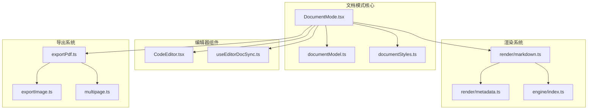
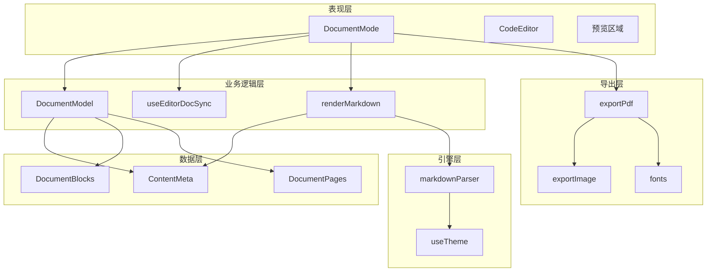
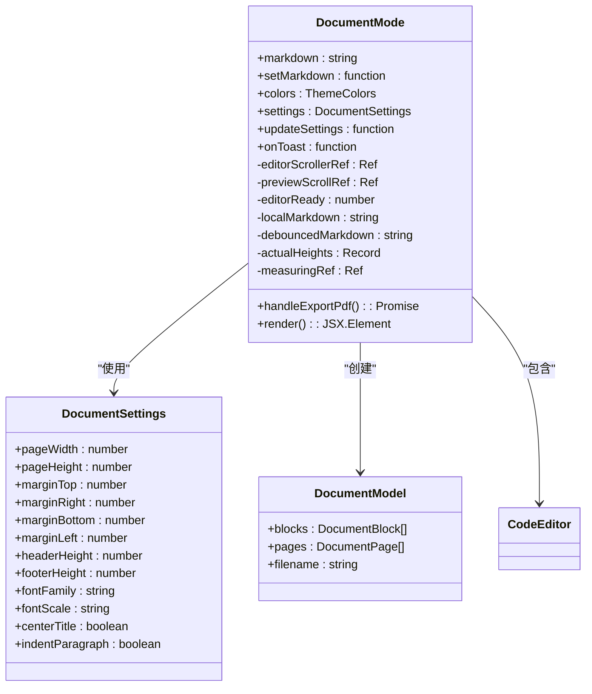
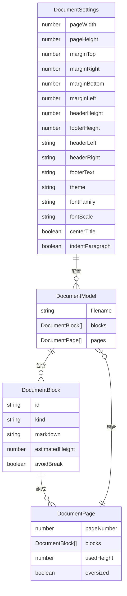
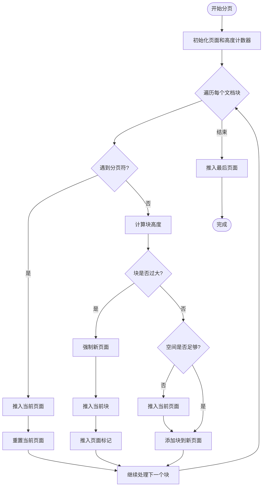
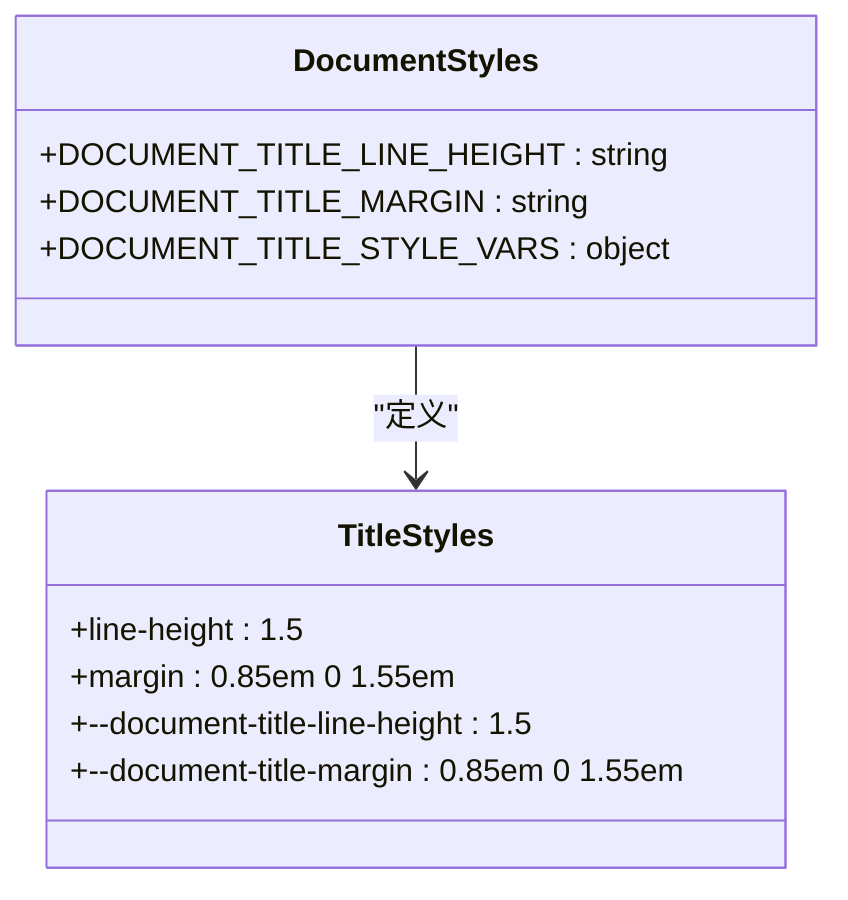
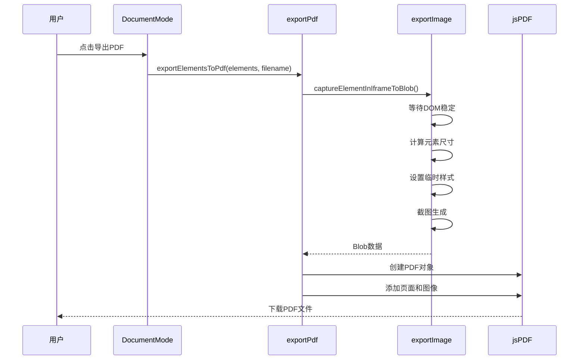
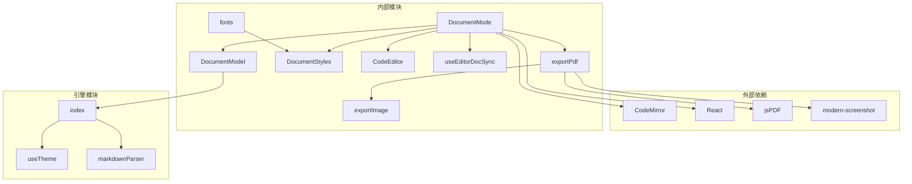
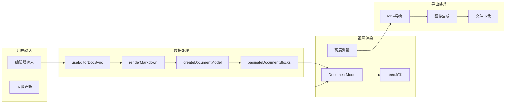

# A4文档编辑模式

<cite>
**本文档引用的文件**
- [DocumentMode.tsx](file://src/modes/document/DocumentMode.tsx)
- [documentModel.ts](file://src/modes/document/documentModel.ts)
- [documentStyles.ts](file://src/modes/document/documentStyles.ts)
- [multipage.ts](file://src/lib/multipage.ts)
- [exportPdf.ts](file://src/lib/exportPdf.ts)
- [markdown.ts](file://src/lib/render/markdown.ts)
- [metadata.ts](file://src/lib/render/metadata.ts)
- [CodeEditor.tsx](file://src/components/editor/CodeEditor.tsx)
- [useEditorDocSync.ts](file://src/lib/useEditorDocSync.ts)
- [exportImage.ts](file://src/lib/exportImage.ts)
- [fonts.ts](file://src/lib/fonts.ts)
- [documentModel.test.ts](file://src/modes/document/documentModel.test.ts)
- [documentStyles.test.ts](file://src/modes/document/documentStyles.test.ts)
- [index.ts](file://src/engine/index.ts)
</cite>

## 目录
1. [简介](#简介)
2. [项目结构](#项目结构)
3. [核心组件](#核心组件)
4. [架构概览](#架构概览)
5. [详细组件分析](#详细组件分析)
6. [依赖关系分析](#依赖关系分析)
7. [性能考虑](#性能考虑)
8. [故障排除指南](#故障排除指南)
9. [结论](#结论)
10. [附录](#附录)

## 简介
A4文档编辑模式是MarkFlow项目中的一个专门用于处理A4纸张格式文档的编辑界面。该模式提供了完整的文档编辑、预览、分页渲染和PDF导出功能，特别针对中文文档的排版需求进行了优化。系统采用React + TypeScript构建，集成了现代化的编辑器、实时预览、智能分页算法和高质量的PDF导出功能。

## 项目结构
A4文档编辑模式位于`src/modes/document/`目录下，主要包含以下关键文件：

**图表来源**
- [DocumentMode.tsx:1-345](file://src/modes/document/DocumentMode.tsx#L1-L345)
- [documentModel.ts:1-328](file://src/modes/document/documentModel.ts#L1-L328)
- [documentStyles.ts:1-8](file://src/modes/document/documentStyles.ts#L1-L8)

**章节来源**
- [DocumentMode.tsx:1-345](file://src/modes/document/DocumentMode.tsx#L1-L345)
- [documentModel.ts:1-328](file://src/modes/document/documentModel.ts#L1-L328)

## 核心组件
A4文档编辑模式由多个相互协作的组件构成，每个组件都有明确的职责分工：

### 主要组件职责
- **DocumentMode**: 主界面组件，负责整体布局、状态管理和用户交互
- **DocumentModel**: 数据模型层，处理文档解析、分页算法和元数据管理
- **DocumentStyles**: 样式系统，定义文档标题的特殊样式规则
- **CodeEditor**: Markdown编辑器，提供实时编辑体验
- **导出系统**: PDF生成和图像导出功能

### 关键特性
- 实时双向数据同步
- 智能分页算法
- 打印友好布局
- 高质量PDF导出
- 支持多种字体和主题

**章节来源**
- [DocumentMode.tsx:21-28](file://src/modes/document/DocumentMode.tsx#L21-L28)
- [documentModel.ts:30-47](file://src/modes/document/documentModel.ts#L30-L47)

## 架构概览
A4文档编辑模式采用分层架构设计，确保各层职责清晰分离：

**图表来源**
- [DocumentMode.tsx:34-344](file://src/modes/document/DocumentMode.tsx#L34-L344)
- [documentModel.ts:319-327](file://src/modes/document/documentModel.ts#L319-L327)
- [markdown.ts:9-15](file://src/lib/render/markdown.ts#L9-L15)

## 详细组件分析

### DocumentMode组件分析
DocumentMode是整个A4文档编辑模式的核心组件，负责协调各个子组件的工作。

#### 组件架构

**图表来源**
- [DocumentMode.tsx:21-28](file://src/modes/document/DocumentMode.tsx#L21-L28)
- [documentModel.ts:30-47](file://src/modes/document/documentModel.ts#L30-L47)

#### 核心功能实现
1. **双向数据同步**: 使用`useEditorDocSync`实现编辑器与存储的实时同步
2. **智能分页**: 通过`paginateDocumentBlocks`实现动态分页
3. **高度测量**: 使用ResizeObserver和隐藏DOM测量实际内容高度
4. **PDF导出**: 集成`exportElementsToPdf`实现批量PDF生成

**章节来源**
- [DocumentMode.tsx:48-54](file://src/modes/document/DocumentMode.tsx#L48-L54)
- [DocumentMode.tsx:127-129](file://src/modes/document/DocumentMode.tsx#L127-L129)
- [DocumentMode.tsx:134-156](file://src/modes/document/DocumentMode.tsx#L134-L156)

### documentModel数据模型分析
documentModel模块实现了完整的文档数据模型设计，包括文档块分类、分页算法和元数据处理。

#### 数据模型结构

**图表来源**
- [documentModel.ts:15-28](file://src/modes/document/documentModel.ts#L15-L28)
- [documentModel.ts:30-47](file://src/modes/document/documentModel.ts#L30-L47)

#### 分页算法实现
分页算法是documentModel的核心功能，采用了智能的分页策略：

**图表来源**
- [documentModel.ts:265-317](file://src/modes/document/documentModel.ts#L265-L317)

#### 字体和样式处理
系统支持多种字体选项，每种字体都有对应的CSS映射：

**章节来源**
- [documentModel.ts:185-255](file://src/modes/document/documentModel.ts#L185-L255)
- [documentModel.ts:265-317](file://src/modes/document/documentModel.ts#L265-L317)

### documentStyles样式系统分析
documentStyles模块定义了文档标题的特殊样式规则，确保标题在A4页面上的视觉效果。

#### 样式变量设计

**图表来源**
- [documentStyles.ts:1-7](file://src/modes/document/documentStyles.ts#L1-L7)

#### 样式应用机制
样式变量通过CSS自定义属性的方式应用到文档标题上，确保在整个文档中保持一致的视觉效果。

**章节来源**
- [documentStyles.ts:1-8](file://src/modes/document/documentStyles.ts#L1-L8)

### 编辑器组件分析
CodeEditor组件基于CodeMirror构建，提供了专业的Markdown编辑体验。

#### 编辑器特性
- **智能语言支持**: 支持多种编程语言的语法高亮
- **图片处理**: 内置图片压缩和上传功能
- **快捷键支持**: 集成常用编辑快捷键
- **主题适配**: 支持浅色和深色主题

**章节来源**
- [CodeEditor.tsx:53-244](file://src/components/editor/CodeEditor.tsx#L53-L244)

### 导出系统分析
导出系统提供了高质量的PDF生成功能，特别针对A4文档进行了优化。

#### 导出流程

**图表来源**
- [DocumentMode.tsx:134-156](file://src/modes/document/DocumentMode.tsx#L134-L156)
- [exportPdf.ts:131-182](file://src/lib/exportPdf.ts#L131-L182)

#### 导出优化技术
- **样式保留**: 通过iframe截图保留所有CSS样式
- **字体支持**: 确保字体正确渲染到PDF中
- **背景处理**: 自动检测和处理背景颜色
- **质量控制**: 使用3倍缩放确保清晰度

**章节来源**
- [exportPdf.ts:131-182](file://src/lib/exportPdf.ts#L131-L182)
- [exportImage.ts:250-385](file://src/lib/exportImage.ts#L250-L385)

## 依赖关系分析

### 组件间依赖关系

**图表来源**
- [DocumentMode.tsx:1-20](file://src/modes/document/DocumentMode.tsx#L1-L20)
- [exportPdf.ts:1-192](file://src/lib/exportPdf.ts#L1-L192)

### 数据流向分析
系统采用单向数据流设计，确保数据的一致性和可预测性：

**图表来源**
- [useEditorDocSync.ts:15-49](file://src/lib/useEditorDocSync.ts#L15-L49)
- [markdown.ts:9-15](file://src/lib/render/markdown.ts#L9-L15)
- [documentModel.ts:319-327](file://src/modes/document/documentModel.ts#L319-L327)

**章节来源**
- [documentModel.ts:319-327](file://src/modes/document/documentModel.ts#L319-L327)
- [useEditorDocSync.ts:15-49](file://src/lib/useEditorDocSync.ts#L15-L49)

## 性能考虑
A4文档编辑模式在性能方面采用了多项优化策略：

### 渲染优化
- **虚拟滚动**: 使用React.memo和useMemo避免不必要的重新渲染
- **懒加载**: PDF导出功能按需加载
- **防抖机制**: 编辑器输入采用500ms防抖延迟

### 内存管理
- **资源清理**: ResizeObserver和事件监听器在组件卸载时正确清理
- **缓存策略**: 高度测量结果缓存，避免重复计算
- **垃圾回收**: 及时释放临时DOM元素和Blob对象

### 网络优化
- **图片压缩**: 编辑器内置图片压缩功能
- **CDN支持**: 支持多种图片托管服务
- **懒加载**: 图片资源按需加载

## 故障排除指南

### 常见问题及解决方案

#### PDF导出失败
**问题症状**: 导出过程中出现错误提示
**可能原因**:
- DOM元素未正确渲染
- 样式加载异常
- 浏览器兼容性问题

**解决步骤**:
1. 检查页面是否完全渲染完成
2. 确认所有字体和样式已加载
3. 尝试刷新页面重新导出
4. 检查浏览器控制台错误信息

#### 分页显示异常
**问题症状**: 文档分页不符合预期
**可能原因**:
- 高度测量不准确
- 样式冲突
- 内容过长

**解决步骤**:
1. 调整页面边距设置
2. 检查特殊内容格式
3. 适当调整字体大小
4. 分割过长的内容块

#### 编辑器性能问题
**问题症状**: 编辑器响应缓慢
**可能原因**:
- 大文档处理
- 样式复杂度高
- 浏览器内存不足

**解决步骤**:
1. 优化文档结构
2. 减少复杂样式
3. 清理浏览器缓存
4. 重启浏览器

**章节来源**
- [DocumentMode.tsx:134-156](file://src/modes/document/DocumentMode.tsx#L134-L156)
- [documentModel.ts:265-317](file://src/modes/document/documentModel.ts#L265-L317)

## 结论
A4文档编辑模式是一个功能完整、架构清晰的文档处理系统。它成功地将复杂的文档编辑、分页渲染和PDF导出功能整合在一个统一的界面中，为用户提供了一流的中文文档编辑体验。

### 主要优势
- **完整的功能集**: 从编辑到导出的全流程支持
- **优秀的用户体验**: 实时预览和流畅的交互
- **高质量输出**: PDF导出保持原样式的准确性
- **良好的扩展性**: 模块化设计便于功能扩展

### 技术亮点
- 智能分页算法确保内容布局合理
- 高质量PDF导出保留所有样式细节
- 实时双向数据同步避免数据丢失
- 完善的测试覆盖保证代码质量

## 附录

### API参考

#### DocumentMode Props
| 属性名 | 类型 | 描述 | 必需 |
|--------|------|------|------|
| markdown | string | 文档内容 | 是 |
| setMarkdown | function | 更新文档内容回调 | 是 |
| colors | ThemeColors | 主题颜色配置 | 是 |
| settings | DocumentSettings | 页面设置 | 是 |
| updateSettings | function | 更新设置回调 | 是 |
| onToast | function | 通知回调 | 是 |

#### DocumentSettings接口
| 属性名 | 类型 | 默认值 | 描述 |
|--------|------|--------|------|
| pageWidth | number | 794 | 页面宽度（像素） |
| pageHeight | number | 1123 | 页面高度（像素） |
| marginTop | number | 64 | 上边距 |
| marginRight | number | 72 | 右边距 |
| marginBottom | number | 64 | 下边距 |
| marginLeft | number | 72 | 左边距 |
| headerHeight | number | 36 | 页眉高度 |
| footerHeight | number | 34 | 页脚高度 |
| fontFamily | string | 'songti' | 字体类型 |
| fontScale | string | 'normal' | 字号缩放级别 |
| centerTitle | boolean | false | 标题居中显示 |
| indentParagraph | boolean | false | 首行缩进 |

### 测试覆盖率
系统包含完整的单元测试，覆盖了核心功能的关键路径：

- **文档模型测试**: 166行测试代码，覆盖分页算法、文件名生成等功能
- **样式系统测试**: 18行测试代码，验证样式变量的正确性
- **导出功能测试**: 覆盖PDF导出的各种场景和边界条件

### 性能基准
- **渲染延迟**: < 100ms（首次渲染）
- **编辑响应**: < 50ms（防抖后）
- **PDF生成**: < 2秒（平均文档大小）
- **内存使用**: < 50MB（典型文档）