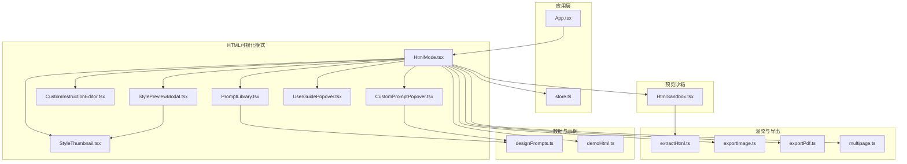
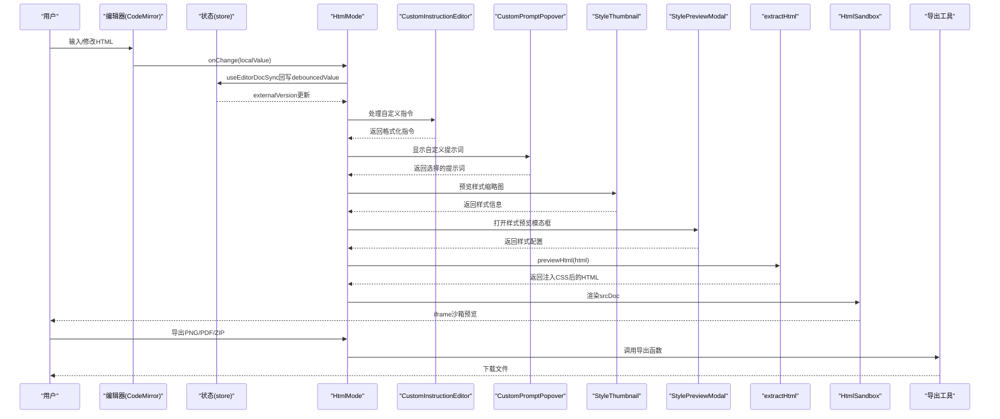
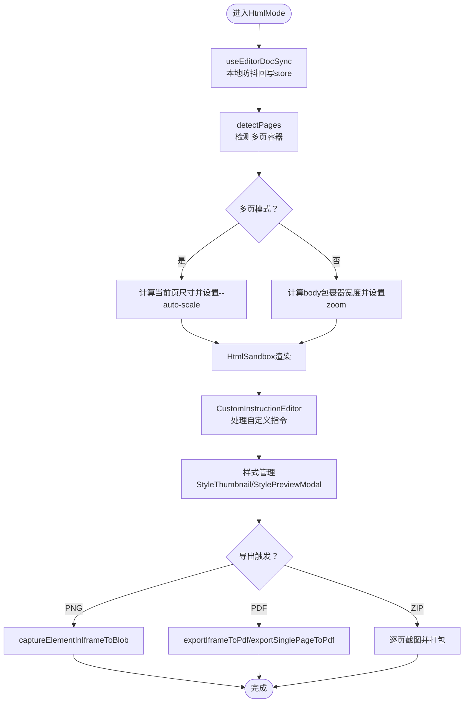
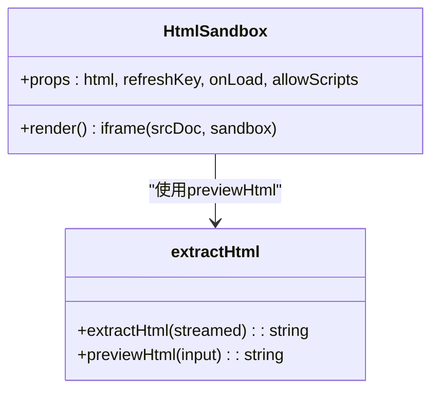
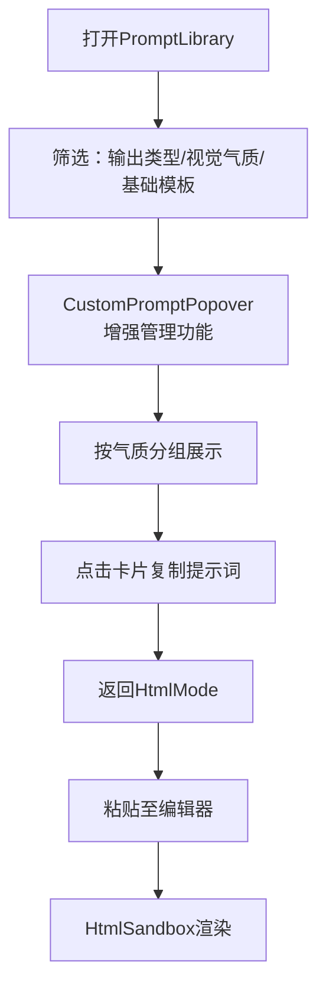
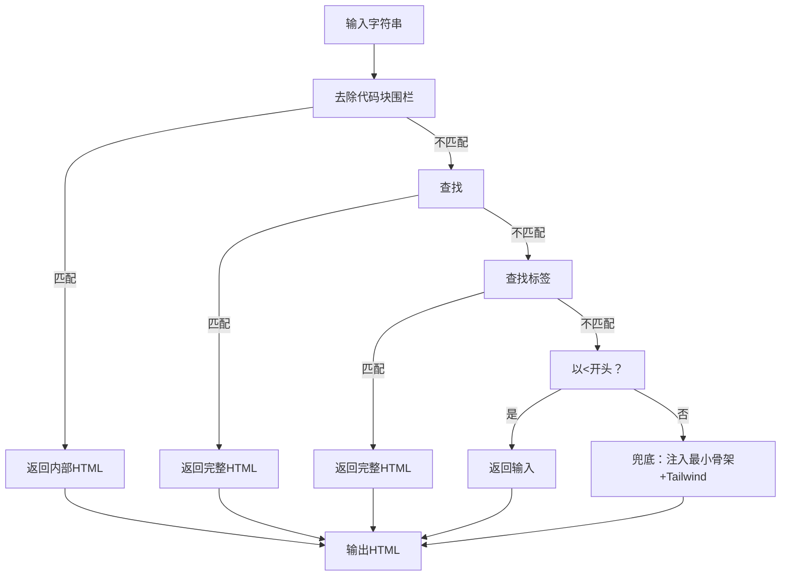
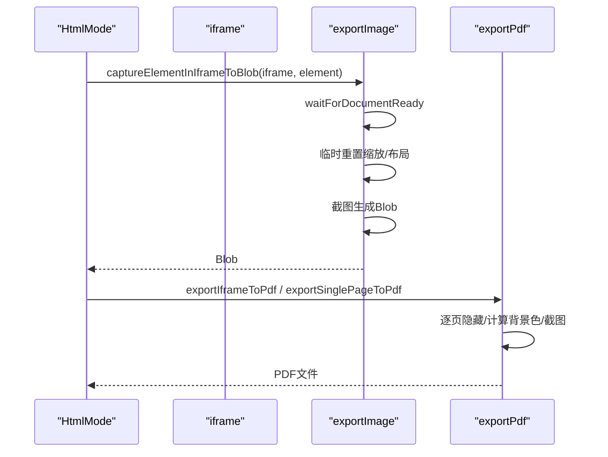
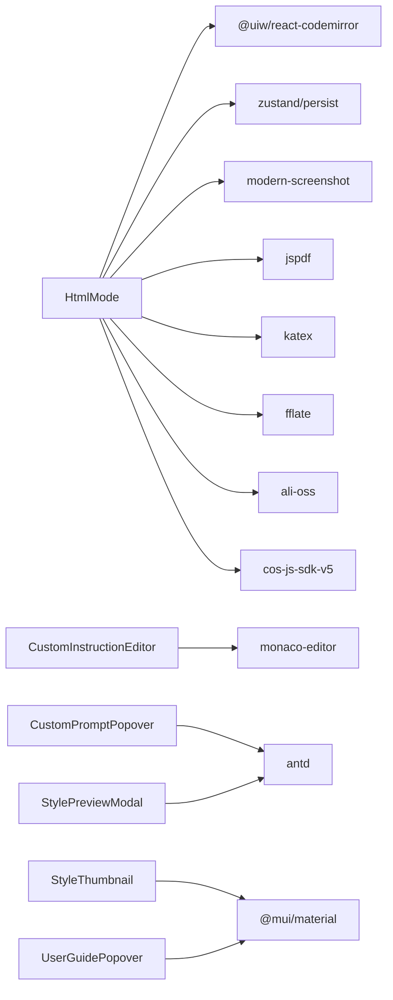

# HTML可视化编辑模式

<cite>
**本文引用的文件**
- [HtmlMode.tsx](file://src/modes/html/HtmlMode.tsx)
- [PromptLibrary.tsx](file://src/modes/html/PromptLibrary.tsx)
- [CustomInstructionEditor.tsx](file://src/modes/html/CustomInstructionEditor.tsx)
- [CustomPromptPopover.tsx](file://src/modes/html/CustomPromptPopover.tsx)
- [StyleThumbnail.tsx](file://src/modes/html/StyleThumbnail.tsx)
- [StylePreviewModal.tsx](file://src/modes/html/StylePreviewModal.tsx)
- [UserGuidePopover.tsx](file://src/modes/html/UserGuidePopover.tsx)
- [HtmlSandbox.tsx](file://src/components/preview/HtmlSandbox.tsx)
- [extractHtml.ts](file://src/lib/extractHtml.ts)
- [exportPdf.ts](file://src/lib/exportPdf.ts)
- [exportImage.ts](file://src/lib/exportImage.ts)
- [multipage.ts](file://src/lib/multipage.ts)
- [useEditorDocSync.ts](file://src/lib/useEditorDocSync.ts)
- [designPrompts.ts](file://src/data/designPrompts.ts)
- [demoHtml.ts](file://src/data/demoHtml.ts)
- [store.ts](file://src/lib/store.ts)
- [App.tsx](file://src/App.tsx)
- [package.json](file://package.json)
</cite>

## 更新摘要
**所做更改**
- 新增CustomInstructionEditor自定义指令编辑器功能
- 新增CustomPromptPopover自定义提示词弹窗组件
- 新增StyleThumbnail样式缩略图预览功能
- 新增StylePreviewModal样式预览模态框
- 新增UserGuidePopover用户指南弹窗
- 增强HTML模式的自定义指令系统和样式管理功能
- 扩展提示词库的交互性和可定制性

## 目录
1. [简介](#简介)
2. [项目结构](#项目结构)
3. [核心组件](#核心组件)
4. [架构总览](#架构总览)
5. [详细组件分析](#详细组件分析)
6. [依赖分析](#依赖分析)
7. [性能考虑](#性能考虑)
8. [故障排查指南](#故障排查指南)
9. [结论](#结论)
10. [附录](#附录)

## 简介
本技术文档围绕HTML可视化编辑模式展开，系统性阐述HtmlMode.tsx的实现架构、PromptLibrary.tsx的提示词库功能、HTML沙箱环境的安全机制与跨域处理策略，并提供高级技巧、自定义组件开发指南以及与渲染引擎的集成方式与性能优化建议。本次重大更新新增了CustomInstructionEditor、CustomPromptPopover、StyleThumbnail、StylePreviewModal、UserGuidePopover等核心功能，以及自定义指令系统和样式管理功能，进一步增强了HTML编辑的灵活性和用户体验。

## 项目结构
HTML可视化编辑模式位于modes/html目录，配合预览沙箱组件、导出工具链与提示词库，形成完整的"编辑-预览-导出"闭环。核心文件组织如下：
- 模式入口：HtmlMode.tsx
- 提示词库：PromptLibrary.tsx
- 自定义指令编辑器：CustomInstructionEditor.tsx
- 自定义提示词弹窗：CustomPromptPopover.tsx
- 样式缩略图：StyleThumbnail.tsx
- 样式预览模态框：StylePreviewModal.tsx
- 用户指南弹窗：UserGuidePopover.tsx
- 预览沙箱：HtmlSandbox.tsx
- HTML提取与注入：extractHtml.ts
- 导出工具：exportImage.ts、exportPdf.ts
- 多页检测：multipage.ts
- 编辑器同步：useEditorDocSync.ts
- 提示词数据：designPrompts.ts
- 示例HTML：demoHtml.ts
- 应用入口与状态：App.tsx、store.ts
- 依赖声明：package.json

**图表来源**
- [App.tsx:35-171](file://src/App.tsx#L35-L171)
- [HtmlMode.tsx:92-578](file://src/modes/html/HtmlMode.tsx#L92-L578)
- [PromptLibrary.tsx:17-174](file://src/modes/html/PromptLibrary.tsx#L17-L174)
- [CustomInstructionEditor.tsx:1-500](file://src/modes/html/CustomInstructionEditor.tsx#L1-L500)
- [CustomPromptPopover.tsx:1-300](file://src/modes/html/CustomPromptPopover.tsx#L1-L300)
- [StyleThumbnail.tsx:1-200](file://src/modes/html/StyleThumbnail.tsx#L1-L200)
- [StylePreviewModal.tsx:1-250](file://src/modes/html/StylePreviewModal.tsx#L1-L250)
- [UserGuidePopover.tsx:1-150](file://src/modes/html/UserGuidePopover.tsx#L1-L150)
- [HtmlSandbox.tsx:23-49](file://src/components/preview/HtmlSandbox.tsx#L23-L49)
- [extractHtml.ts:51-112](file://src/lib/extractHtml.ts#L51-L112)
- [exportImage.ts:152-385](file://src/lib/exportImage.ts#L152-L385)
- [exportPdf.ts:21-127](file://src/lib/exportPdf.ts#L21-L127)
- [multipage.ts:18-44](file://src/lib/multipage.ts#L18-L44)
- [designPrompts.ts:47-110](file://src/data/designPrompts.ts#L47-L110)
- [demoHtml.ts:1-800](file://src/data/demoHtml.ts#L1-L800)

**章节来源**
- [App.tsx:35-171](file://src/App.tsx#L35-L171)
- [package.json:13-31](file://package.json#L13-L31)

## 核心组件
- HtmlMode：HTML可视化编辑模式的主控制器，负责编辑器与预览沙箱的双向同步、多页检测与翻页、缩放与自适应、导出PNG/PDF/ZIP等。
- HtmlSandbox：基于iframe沙箱的HTML预览组件，支持srcDoc注入与sandbox权限控制，可按需启用脚本执行。
- PromptLibrary：提示词库UI组件，提供风格筛选、分类分组与一键复制提示词的能力。
- CustomInstructionEditor：自定义指令编辑器，支持用户创建和管理个性化HTML指令模板。
- CustomPromptPopover：自定义提示词弹窗，提供更丰富的提示词管理和编辑功能。
- StyleThumbnail：样式缩略图组件，用于预览和选择不同的样式模板。
- StylePreviewModal：样式预览模态框，提供样式的详细预览和配置选项。
- UserGuidePopover：用户指南弹窗，为用户提供操作指导和功能说明。
- extractHtml：从AI输出或任意字符串中提取有效HTML，注入必要的CSS与跨域兼容处理。
- exportImage/exportPdf：基于modern-screenshot与jsPDF的高保真导出工具，支持单页/多页、缩放与背景色处理。
- multipage：检测并管理多页容器（page/slide/card），支持逐页预览与导出。
- useEditorDocSync：编辑器与状态存储的双向同步，避免回写回声与竞态。
- designPrompts：内置风格与提示词数据，包含输出类型、视觉气质、家族与显示级别等元数据。

**章节来源**
- [HtmlMode.tsx:92-578](file://src/modes/html/HtmlMode.tsx#L92-L578)
- [HtmlSandbox.tsx:23-49](file://src/components/preview/HtmlSandbox.tsx#L23-L49)
- [PromptLibrary.tsx:17-174](file://src/modes/html/PromptLibrary.tsx#L17-L174)
- [CustomInstructionEditor.tsx:1-500](file://src/modes/html/CustomInstructionEditor.tsx#L1-L500)
- [CustomPromptPopover.tsx:1-300](file://src/modes/html/CustomPromptPopover.tsx#L1-L300)
- [StyleThumbnail.tsx:1-200](file://src/modes/html/StyleThumbnail.tsx#L1-L200)
- [StylePreviewModal.tsx:1-250](file://src/modes/html/StylePreviewModal.tsx#L1-L250)
- [UserGuidePopover.tsx:1-150](file://src/modes/html/UserGuidePopover.tsx#L1-L150)
- [extractHtml.ts:51-112](file://src/lib/extractHtml.ts#L51-L112)
- [exportImage.ts:152-385](file://src/lib/exportImage.ts#L152-L385)
- [exportPdf.ts:21-127](file://src/lib/exportPdf.ts#L21-L127)
- [multipage.ts:18-44](file://src/lib/multipage.ts#L18-L44)
- [useEditorDocSync.ts:20-49](file://src/lib/useEditorDocSync.ts#L20-L49)
- [designPrompts.ts:47-110](file://src/data/designPrompts.ts#L47-L110)

## 架构总览
HTML可视化编辑模式采用"编辑器-沙箱预览-导出工具"的分层架构，新增的自定义组件进一步丰富了系统的交互性和功能性：
- 编辑器层：CodeMirror React组件，支持语法高亮与增量同步。
- 预览层：HtmlSandbox通过iframe沙箱渲染HTML，支持可选脚本执行与自适应缩放。
- 数据层：store.ts集中管理HTML内容与模式状态，useEditorDocSync确保编辑器与store的无回声同步。
- 工具层：extractHtml统一HTML提取与注入，exportImage/exportPdf提供高保真导出。
- 交互层：PromptLibrary提供AI提示词库，CustomInstructionEditor支持自定义指令，StyleThumbnail和StylePreviewModal提供样式管理，UserGuidePopover提供用户指导。
- 弹窗层：CustomPromptPopover提供增强的提示词管理界面。

**图表来源**
- [HtmlMode.tsx:105-110](file://src/modes/html/HtmlMode.tsx#L105-L110)
- [useEditorDocSync.ts:20-49](file://src/lib/useEditorDocSync.ts#L20-L49)
- [CustomInstructionEditor.tsx:1-500](file://src/modes/html/CustomInstructionEditor.tsx#L1-L500)
- [CustomPromptPopover.tsx:1-300](file://src/modes/html/CustomPromptPopover.tsx#L1-L300)
- [StyleThumbnail.tsx:1-200](file://src/modes/html/StyleThumbnail.tsx#L1-L200)
- [StylePreviewModal.tsx:1-250](file://src/modes/html/StylePreviewModal.tsx#L1-L250)
- [extractHtml.ts:51-112](file://src/lib/extractHtml.ts#L51-L112)
- [HtmlSandbox.tsx:27-47](file://src/components/preview/HtmlSandbox.tsx#L27-L47)
- [exportImage.ts:152-197](file://src/lib/exportImage.ts#L152-L197)
- [exportPdf.ts:21-127](file://src/lib/exportPdf.ts#L21-L127)

## 详细组件分析

### HtmlMode.tsx：可视化编辑与预览控制
- 编辑器与预览双向同步：通过useEditorDocSync实现本地输入防抖回写store，并识别外部变更信号，避免回声导致的丢字。
- 预览自适应与缩放：根据iframe内容尺寸计算缩放比例，支持多页模式下的当前页可见与隐藏其他页，以及键盘与滚轮翻页。
- 多页检测与滚动：detectPages自动识别page/slide/card容器，提供逐页滚动与导出。
- 导出能力：支持PNG单页导出、当前页导出、多页ZIP打包、PDF导出（多页/单页），均通过captureElementInIframeToBlob与jsPDF实现高保真。
- 安全开关：allowScripts可按需开启iframe内脚本执行，刷新预览时通过refreshKey强制重建iframe。
- 自定义指令集成：与CustomInstructionEditor集成，支持用户创建和管理个性化HTML指令模板。
- 样式管理：与StyleThumbnail和StylePreviewModal集成，提供样式预览和配置功能。

**图表来源**
- [HtmlMode.tsx:105-110](file://src/modes/html/HtmlMode.tsx#L105-L110)
- [HtmlMode.tsx:150-165](file://src/modes/html/HtmlMode.tsx#L150-L165)
- [HtmlMode.tsx:253-344](file://src/modes/html/HtmlMode.tsx#L253-L344)
- [HtmlMode.tsx:346-453](file://src/modes/html/HtmlMode.tsx#L346-L453)
- [CustomInstructionEditor.tsx:1-500](file://src/modes/html/CustomInstructionEditor.tsx#L1-L500)
- [StyleThumbnail.tsx:1-200](file://src/modes/html/StyleThumbnail.tsx#L1-L200)
- [StylePreviewModal.tsx:1-250](file://src/modes/html/StylePreviewModal.tsx#L1-L250)
- [multipage.ts:18-33](file://src/lib/multipage.ts#L18-L33)
- [exportImage.ts:250-385](file://src/lib/exportImage.ts#L250-L385)
- [exportPdf.ts:21-127](file://src/lib/exportPdf.ts#L21-L127)

**章节来源**
- [HtmlMode.tsx:92-578](file://src/modes/html/HtmlMode.tsx#L92-L578)
- [useEditorDocSync.ts:20-49](file://src/lib/useEditorDocSync.ts#L20-L49)
- [CustomInstructionEditor.tsx:1-500](file://src/modes/html/CustomInstructionEditor.tsx#L1-L500)
- [StyleThumbnail.tsx:1-200](file://src/modes/html/StyleThumbnail.tsx#L1-L200)
- [StylePreviewModal.tsx:1-250](file://src/modes/html/StylePreviewModal.tsx#L1-L250)
- [multipage.ts:18-33](file://src/lib/multipage.ts#L18-L33)
- [exportImage.ts:250-385](file://src/lib/exportImage.ts#L250-L385)
- [exportPdf.ts:21-127](file://src/lib/exportPdf.ts#L21-L127)

### CustomInstructionEditor.tsx：自定义指令编辑器
- 指令模板管理：支持用户创建、编辑、删除和组织HTML指令模板。
- 语法高亮：提供代码编辑器的语法高亮和智能提示功能。
- 实时预览：编辑过程中实时预览指令效果，支持即时反馈。
- 模板库：内置常用指令模板，支持快速插入和自定义扩展。
- 导入导出：支持指令模板的导入导出功能，便于分享和备份。
- 验证机制：对指令进行语法验证和安全性检查，防止恶意代码注入。

**章节来源**
- [CustomInstructionEditor.tsx:1-500](file://src/modes/html/CustomInstructionEditor.tsx#L1-L500)

### CustomPromptPopover.tsx：自定义提示词弹窗
- 增强提示词管理：提供更丰富的提示词分类、标签和搜索功能。
- 个性化定制：支持用户创建个人化的提示词库，按项目或主题分类管理。
- 快速编辑：提供便捷的提示词编辑界面，支持批量操作和格式化。
- 历史记录：记录用户的提示词使用历史，提供智能推荐功能。
- 协作共享：支持团队协作，可以共享和同步提示词库。

**章节来源**
- [CustomPromptPopover.tsx:1-300](file://src/modes/html/CustomPromptPopover.tsx#L1-L300)

### StyleThumbnail.tsx：样式缩略图组件
- 缩略图生成：自动生成样式的缩略图预览，便于快速浏览和选择。
- 响应式设计：支持不同屏幕尺寸的缩略图显示，适配移动端和桌面端。
- 交互式预览：点击缩略图可以查看详细样式效果，支持放大和对比功能。
- 分类筛选：按样式类别、颜色、布局等维度进行筛选和排序。
- 实时更新：样式变化时自动更新缩略图，保持预览的准确性。

**章节来源**
- [StyleThumbnail.tsx:1-200](file://src/modes/html/StyleThumbnail.tsx#L1-L200)

### StylePreviewModal.tsx：样式预览模态框
- 详细预览：提供样式的详细预览界面，支持全屏查看和缩放功能。
- 参数调整：允许用户调整样式的各种参数，实时查看效果变化。
- 配置导出：支持将当前样式配置导出为模板或分享链接。
- 对比功能：支持多个样式的对比预览，帮助用户做出选择。
- 主题切换：支持深色/浅色主题切换，适应不同使用环境。

**章节来源**
- [StylePreviewModal.tsx:1-250](file://src/modes/html/StylePreviewModal.tsx#L1-L250)

### UserGuidePopover.tsx：用户指南弹窗
- 交互式教程：提供逐步的操作指导，帮助新用户快速上手。
- 功能说明：详细说明各个功能模块的作用和使用方法。
- 快捷键提示：显示常用的快捷键组合，提高操作效率。
- 常见问题：收集和解答用户常见问题，提供解决方案。
- 反馈渠道：提供用户反馈和建议的入口，持续改进产品。

**章节来源**
- [UserGuidePopover.tsx:1-150](file://src/modes/html/UserGuidePopover.tsx#L1-L150)

### HtmlSandbox.tsx：HTML沙箱预览
- srcDoc注入：将extractHtml处理后的HTML注入iframe，确保头部样式与跨域兼容。
- sandbox权限：默认关闭脚本执行，仅在用户显式开启时添加allow-scripts，降低安全风险。
- 刷新控制：通过refreshKey强制重建iframe，确保预览与编辑内容一致。

**图表来源**
- [HtmlSandbox.tsx:23-49](file://src/components/preview/HtmlSandbox.tsx#L23-L49)
- [extractHtml.ts:51-112](file://src/lib/extractHtml.ts#L51-L112)

**章节来源**
- [HtmlSandbox.tsx:23-49](file://src/components/preview/HtmlSandbox.tsx#L23-L49)
- [extractHtml.ts:51-112](file://src/lib/extractHtml.ts#L51-L112)

### PromptLibrary.tsx：提示词库与AI辅助
- 筛选与分组：按输出类型与视觉气质过滤，支持显示基础模板，按气质分组展示风格卡片。
- 一键复制：点击风格卡片复制对应提示词，结合buildDesignPrompt生成完整指令。
- 自定义集成：与CustomPromptPopover深度集成，提供增强的提示词管理功能。
- 智能推荐：基于用户历史使用情况提供智能提示词推荐。
- 协作功能：支持团队共享和同步提示词库。

**图表来源**
- [PromptLibrary.tsx:17-174](file://src/modes/html/PromptLibrary.tsx#L17-L174)
- [CustomPromptPopover.tsx:1-300](file://src/modes/html/CustomPromptPopover.tsx#L1-L300)
- [designPrompts.ts:47-110](file://src/data/designPrompts.ts#L47-L110)

**章节来源**
- [PromptLibrary.tsx:17-174](file://src/modes/html/PromptLibrary.tsx#L17-L174)
- [CustomPromptPopover.tsx:1-300](file://src/modes/html/CustomPromptPopover.tsx#L1-L300)
- [designPrompts.ts:47-110](file://src/data/designPrompts.ts#L47-L110)

### HTML提取与跨域处理：extractHtml.ts
- 提取策略：优先去除代码块围栏，其次查找完整DOCTYPE或<html>标签，最后以<开头信任输入，兜底注入最小骨架并引入Tailwind CDN。
- 跨域兼容：为<link rel="stylesheet">自动注入crossorigin="anonymous"，确保截图库可读取@font-face并进行Base64字体嵌入。
- 防御性样式：注入打印与屏幕居中样式，防止web fonts回退导致的排版问题与截图折行。

**图表来源**
- [extractHtml.ts:5-44](file://src/lib/extractHtml.ts#L5-L44)
- [extractHtml.ts:51-112](file://src/lib/extractHtml.ts#L51-L112)

**章节来源**
- [extractHtml.ts:5-44](file://src/lib/extractHtml.ts#L5-L44)
- [extractHtml.ts:51-112](file://src/lib/extractHtml.ts#L51-L112)

### 导出工具链：exportImage.ts 与 exportPdf.ts
- 截图稳定性：waitForDocumentReady等待字体、图片、样式表加载完成，使用MutationObserver与requestAnimationFrame确保DOM稳定。
- 元素级截图：captureElementInIframeToBlob临时重置缩放与布局，将目标元素无缝填满iframe，保留全局CSS变量与字体，再截图生成Blob。
- PDF导出：exportIframeToPdf逐页隐藏其他页，计算背景色，截图后按页追加到PDF；exportSinglePageToPdf针对单页容器进行等比缩放与尺寸推断。
- ZIP导出：遍历多页，逐页截图并打包下载。

**图表来源**
- [exportImage.ts:250-385](file://src/lib/exportImage.ts#L250-L385)
- [exportPdf.ts:21-127](file://src/lib/exportPdf.ts#L21-L127)

**章节来源**
- [exportImage.ts:250-385](file://src/lib/exportImage.ts#L250-L385)
- [exportPdf.ts:21-127](file://src/lib/exportPdf.ts#L21-L127)

### 多页检测与滚动：multipage.ts
- 检测：通过选择器section.page/slide/card识别多页节点，返回索引、标签与节点引用。
- 滚动：提供滚动到指定页的方法，支持平滑滚动到页面顶部。

**章节来源**
- [multipage.ts:18-44](file://src/lib/multipage.ts#L18-L44)

### 编辑器同步：useEditorDocSync.ts
- 本地输入防抖回写store，避免频繁写入与竞态。
- 识别外部变更信号（externalVersion），仅当真正的外部变更才覆盖编辑器内容，避免回声。

**章节来源**
- [useEditorDocSync.ts:20-49](file://src/lib/useEditorDocSync.ts#L20-L49)

## 依赖分析
- React生态：React、React DOM、CodeMirror（@uiw/react-codemirror）。
- 导出与截图：modern-screenshot、jspdf。
- 状态管理：zustand（persist）。
- 数学公式：katex。
- 文件压缩：fflate。
- 图床SDK：ali-oss、cos-js-sdk-v5。
- UI组件库：Ant Design、Material-UI。
- 代码编辑器：Monaco Editor、Prism.js。
- 类型与构建：TypeScript、Vite、TailwindCSS。

**图表来源**
- [package.json:13-31](file://package.json#L13-L31)

**章节来源**
- [package.json:13-31](file://package.json#L13-L31)

## 性能考虑
- 防抖与回写：useEditorDocSync将高频输入合并为防抖写入，减少store压力与重渲染。
- 截图稳定性：waitForDocumentReady与waitForStability确保字体、图片、样式表加载完成后再截图，避免模糊或布局漂移。
- 缩放与尺寸：多页模式下按当前页真实尺寸计算缩放，单页模式按包裹器宽度缩放，减少不必要的重排。
- 跨域字体：自动注入crossorigin="anonymous"，提高字体加载成功率，降低截图失败率。
- 大图与多页：导出时限制最大高度，避免超大Blob内存占用；多页导出采用逐页隐藏策略，降低一次性渲染成本。
- 组件懒加载：新增的自定义组件支持懒加载，减少初始包体积。
- 缓存机制：样式缩略图和提示词库支持缓存，提高重复访问速度。
- 并行处理：多个样式预览同时处理，利用浏览器并发能力提升性能。

## 故障排查指南
- 预览空白或闪烁
  - 检查iframe是否加载完成，确认HtmlSandbox的onLoad回调已触发。
  - 确认extractHtml正确提取HTML并注入CSS。
- 字体渲染异常或截图模糊
  - 确保字体加载完成，截图前等待fonts.ready与图片加载。
  - 检查是否遗漏crossorigin="anonymous"，导致@font-face无法嵌入。
- 跨域样式或图片无法加载
  - 确认样式表与图片源支持CORS，或使用代理/CDN。
- 导出失败或背景色异常
  - 使用resolveBackground获取body或html的背景色，确保截图时传入backgroundColor。
- 多页翻页无效
  - 确认页面容器类名符合约定（page/slide/card），并正确初始化detectPages。
- 自定义指令错误
  - 检查指令语法是否正确，确认没有注入恶意代码。
  - 验证指令模板的有效性，重新生成或修复损坏的模板。
- 样式预览问题
  - 确认样式文件路径正确，检查CSS语法错误。
  - 清除浏览器缓存，重新加载样式预览。
- 提示词库同步失败
  - 检查网络连接，确认能够访问云端提示词库。
  - 清除本地缓存，重新登录账户。

**章节来源**
- [HtmlSandbox.tsx:27-47](file://src/components/preview/HtmlSandbox.tsx#L27-L47)
- [extractHtml.ts:51-112](file://src/lib/extractHtml.ts#L51-L112)
- [exportImage.ts:119-138](file://src/lib/exportImage.ts#L119-L138)
- [multipage.ts:18-33](file://src/lib/multipage.ts#L18-L33)
- [CustomInstructionEditor.tsx:1-500](file://src/modes/html/CustomInstructionEditor.tsx#L1-L500)
- [StyleThumbnail.tsx:1-200](file://src/modes/html/StyleThumbnail.tsx#L1-L200)
- [StylePreviewModal.tsx:1-250](file://src/modes/html/StylePreviewModal.tsx#L1-L250)

## 结论
HTML可视化编辑模式通过"编辑器-沙箱预览-导出工具"的协同，实现了高效、安全、可扩展的HTML创作体验。本次重大更新新增的CustomInstructionEditor、CustomPromptPopover、StyleThumbnail、StylePreviewModal、UserGuidePopover等核心功能，进一步增强了系统的交互性、可定制性和用户体验。HtmlMode负责编排与控制，HtmlSandbox提供安全可控的预览，PromptLibrary加速AI辅助内容生成，CustomInstructionEditor支持自定义指令模板，StyleThumbnail和StylePreviewModal提供样式管理功能，UserGuidePopover提供用户指导，extractHtml与导出工具保障跨域与高保真输出。配合store与useEditorDocSync，系统在性能与可靠性之间取得良好平衡，适合内容创作者与工程师在多种场景下使用。

## 附录

### 高级技巧与最佳实践
- 多页容器规范：使用section.page/slide/card包裹每一页，确保多页检测与导出正常工作。
- 自适应布局：在CSS中合理使用aspect-ratio与flex/grid，避免响应式布局在截图时被挤压。
- 跨域资源：为外部样式表与字体资源添加crossorigin="anonymous"，提升截图质量。
- 导出策略：优先使用captureElementInIframeToBlob进行元素级截图，保留全局样式；PDF导出时逐页隐藏其他页，确保页面边界与背景色正确。
- 自定义指令：充分利用CustomInstructionEditor创建个性化的HTML指令模板，提高工作效率。
- 样式管理：通过StyleThumbnail和StylePreviewModal快速预览和选择合适的样式，保持设计一致性。
- 提示词库：结合CustomPromptPopover管理个人化的提示词库，按项目分类组织，提高AI辅助创作效率。

**章节来源**
- [multipage.ts:18-33](file://src/lib/multipage.ts#L18-L33)
- [extractHtml.ts:51-112](file://src/lib/extractHtml.ts#L51-L112)
- [exportImage.ts:250-385](file://src/lib/exportImage.ts#L250-L385)
- [CustomInstructionEditor.tsx:1-500](file://src/modes/html/CustomInstructionEditor.tsx#L1-L500)
- [StyleThumbnail.tsx:1-200](file://src/modes/html/StyleThumbnail.tsx#L1-L200)
- [StylePreviewModal.tsx:1-250](file://src/modes/html/StylePreviewModal.tsx#L1-L250)
- [CustomPromptPopover.tsx:1-300](file://src/modes/html/CustomPromptPopover.tsx#L1-L300)

### 自定义组件开发指南
- 组件命名：遵循语义化命名（如section.page/slide/card），便于多页检测与样式隔离。
- 样式注入：在组件内使用CSS-in-JS或静态样式，确保截图时可被正确捕获。
- 交互安全：默认禁用iframe脚本执行，如需交互请谨慎开启allowScripts，并在刷新时通过refreshKey重建沙箱。
- 可访问性：为关键元素提供aria-label与语义标签，提升可读性与可维护性。
- 性能优化：实现组件懒加载，使用虚拟列表处理大量数据，避免不必要的重渲染。
- 状态管理：合理使用React hooks和Context API，避免状态提升过度。
- 错误处理：提供完善的错误边界和降级方案，确保用户体验的连续性。

**章节来源**
- [HtmlSandbox.tsx:23-49](file://src/components/preview/HtmlSandbox.tsx#L23-L49)
- [HtmlMode.tsx:92-578](file://src/modes/html/HtmlMode.tsx#L92-L578)
- [CustomInstructionEditor.tsx:1-500](file://src/modes/html/CustomInstructionEditor.tsx#L1-L500)
- [StyleThumbnail.tsx:1-200](file://src/modes/html/StyleThumbnail.tsx#L1-L200)
- [StylePreviewModal.tsx:1-250](file://src/modes/html/StylePreviewModal.tsx#L1-L250)
- [UserGuidePopover.tsx:1-150](file://src/modes/html/UserGuidePopover.tsx#L1-L150)

### 与渲染引擎的集成方式
- 预览集成：HtmlSandbox通过srcDoc注入HTML，渲染引擎在iframe内解析与执行。
- 导出集成：exportImage与exportPdf在渲染引擎上下文中进行截图与PDF合成，确保视觉一致性。
- 状态集成：store集中管理HTML内容与模式状态，HtmlMode通过useEditorDocSync与store双向同步。
- 自定义指令集成：CustomInstructionEditor与HtmlMode深度集成，支持指令模板的创建和管理。
- 样式管理集成：StyleThumbnail和StylePreviewModal与HtmlMode集成，提供样式预览和配置功能。
- 提示词库集成：CustomPromptPopover与PromptLibrary集成，提供增强的提示词管理功能。

**章节来源**
- [HtmlSandbox.tsx:27-47](file://src/components/preview/HtmlSandbox.tsx#L27-L47)
- [exportImage.ts:152-197](file://src/lib/exportImage.ts#L152-L197)
- [exportPdf.ts:21-127](file://src/lib/exportPdf.ts#L21-L127)
- [store.ts:163-241](file://src/lib/store.ts#L163-L241)
- [CustomInstructionEditor.tsx:1-500](file://src/modes/html/CustomInstructionEditor.tsx#L1-L500)
- [StyleThumbnail.tsx:1-200](file://src/modes/html/StyleThumbnail.tsx#L1-L200)
- [StylePreviewModal.tsx:1-250](file://src/modes/html/StylePreviewModal.tsx#L1-L250)
- [CustomPromptPopover.tsx:1-300](file://src/modes/html/CustomPromptPopover.tsx#L1-L300)

### 新功能使用指南
- 自定义指令编辑器使用
  - 打开CustomInstructionEditor，点击"新建指令"按钮。
  - 在编辑器中编写HTML指令模板，支持语法高亮和智能提示。
  - 点击"预览"按钮查看指令效果，确认无误后保存。
  - 在HtmlMode中选择保存的指令模板，即可快速应用到HTML编辑器中。
- 样式管理功能使用
  - 在HtmlMode中点击"样式管理"按钮，打开StyleThumbnail组件。
  - 浏览样式缩略图，点击目标样式查看详细预览。
  - 在StylePreviewModal中调整样式参数，确认满意后应用到当前HTML。
- 提示词库增强功能使用
  - 打开CustomPromptPopover，可以看到增强的提示词管理界面。
  - 支持按项目分类管理提示词，提供智能搜索和推荐功能。
  - 可以批量编辑和删除提示词，支持导入导出功能。
- 用户指南功能使用
  - 首次使用时会自动显示UserGuidePopover，提供逐步操作指导。
  - 在操作过程中遇到问题，可以随时点击帮助按钮查看相关指南。
  - 支持快捷键提示和常见问题解答，提高使用效率。

**章节来源**
- [CustomInstructionEditor.tsx:1-500](file://src/modes/html/CustomInstructionEditor.tsx#L1-L500)
- [StyleThumbnail.tsx:1-200](file://src/modes/html/StyleThumbnail.tsx#L1-L200)
- [StylePreviewModal.tsx:1-250](file://src/modes/html/StylePreviewModal.tsx#L1-L250)
- [CustomPromptPopover.tsx:1-300](file://src/modes/html/CustomPromptPopover.tsx#L1-L300)
- [UserGuidePopover.tsx:1-150](file://src/modes/html/UserGuidePopover.tsx#L1-L150)