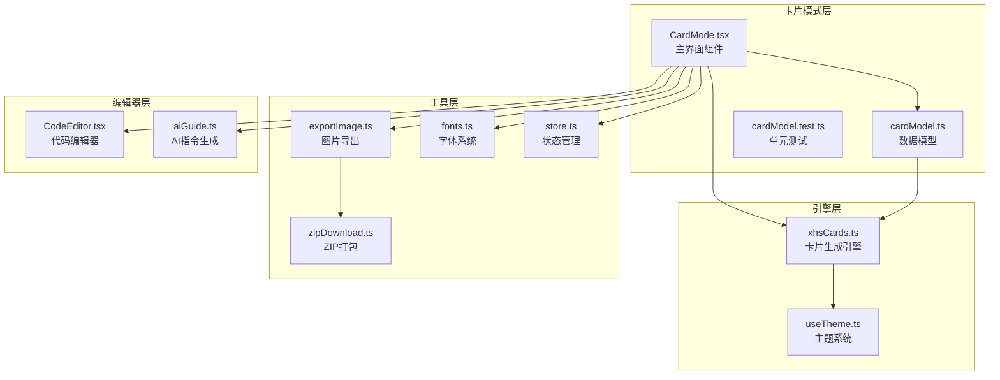
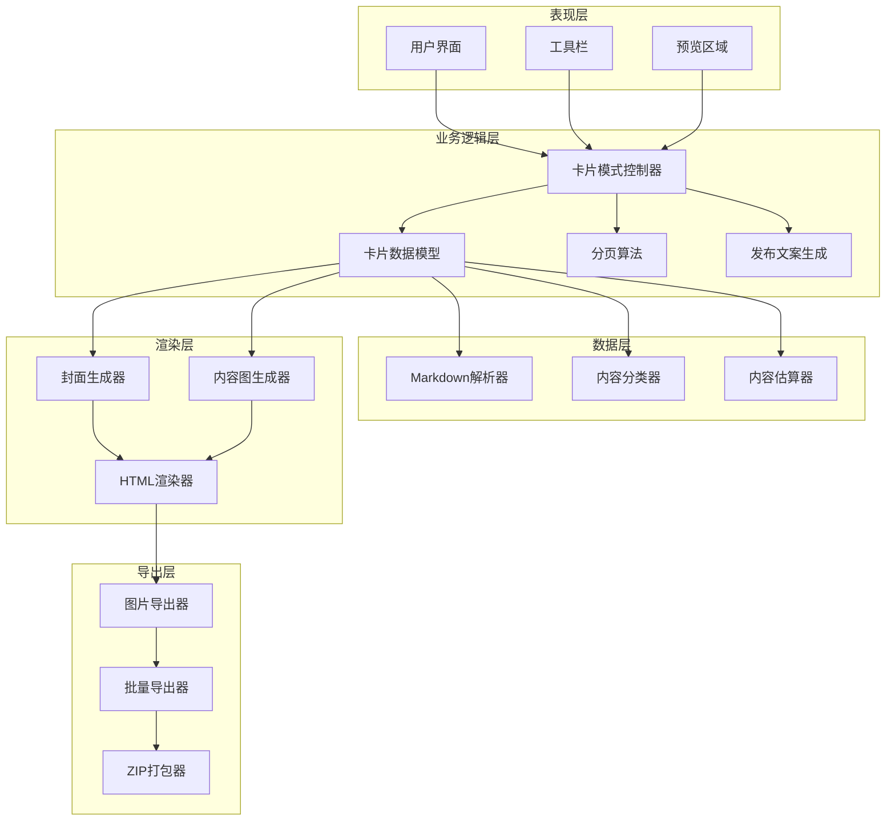
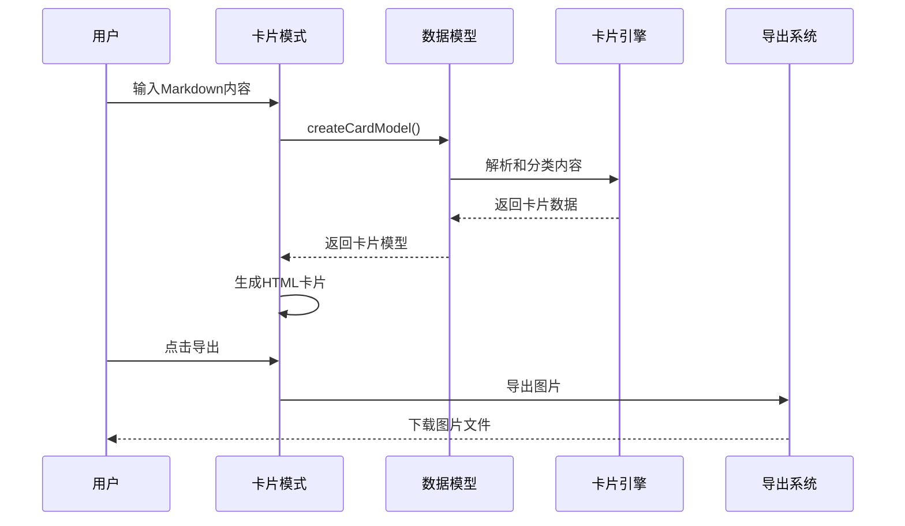
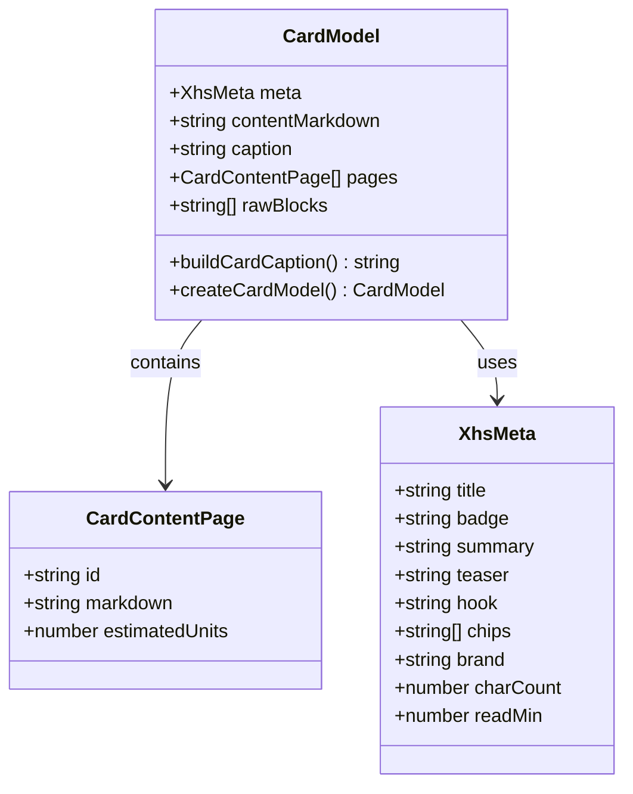
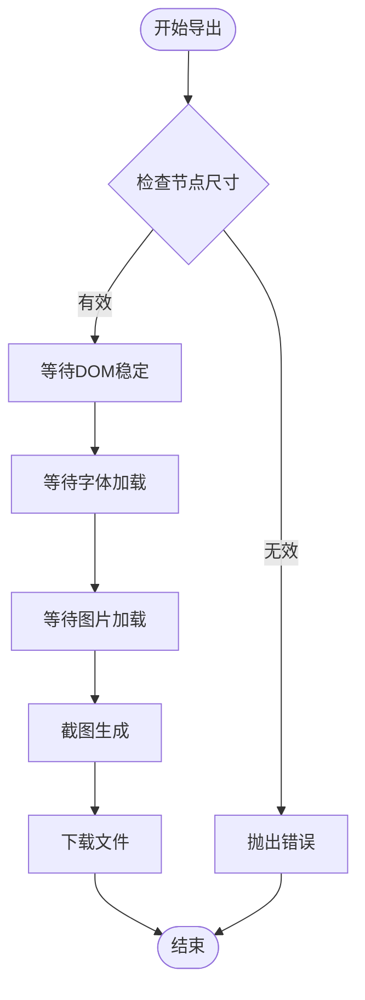
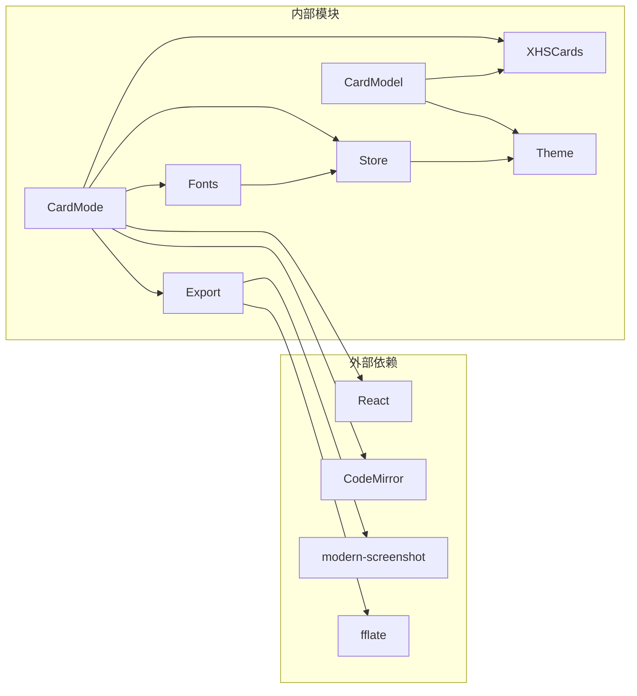

# 小红书卡片编辑模式

<cite>
**本文档引用的文件**
- [CardMode.tsx](file://src/modes/card/CardMode.tsx)
- [cardModel.ts](file://src/modes/card/cardModel.ts)
- [cardModel.test.ts](file://src/modes/card/cardModel.test.ts)
- [xhsCards.ts](file://src/engine/utils/xhsCards.ts)
- [exportImage.ts](file://src/lib/exportImage.ts)
- [zipDownload.ts](file://src/lib/export/zipDownload.ts)
- [fonts.ts](file://src/lib/fonts.ts)
- [aiGuide.ts](file://src/lib/aiGuide.ts)
- [store.ts](file://src/lib/store.ts)
- [useTheme.ts](file://src/engine/composables/useTheme.ts)
- [CodeEditor.tsx](file://src/components/editor/CodeEditor.tsx)
- [designPrompts.ts](file://src/data/designPrompts.ts)
</cite>

## 目录
1. [简介](#简介)
2. [项目结构](#项目结构)
3. [核心组件](#核心组件)
4. [架构概览](#架构概览)
5. [详细组件分析](#详细组件分析)
6. [依赖分析](#依赖分析)
7. [性能考虑](#性能考虑)
8. [故障排除指南](#故障排除指南)
9. [结论](#结论)
10. [附录](#附录)

## 简介
小红书卡片编辑模式是一个专为社交媒体平台设计的卡片生成系统，专注于小红书平台的视觉规范和用户体验。该模式通过智能的卡片数据结构、精确的布局算法和丰富的设计优化，为用户提供了一套完整的卡片创作解决方案。

系统的核心特色包括：
- **平台特定优化**：针对小红书平台的视觉规范进行深度定制
- **智能分页算法**：基于内容复杂度和视觉密度的动态分页
- **批量导出功能**：支持单张下载、批量下载和ZIP打包
- **模板系统**：提供封面图和内容图的标准化模板
- **设计要素优化**：比例控制、字体大小、色彩搭配的专业设计

## 项目结构
小红书卡片编辑模式位于项目的 `src/modes/card` 目录下，采用模块化设计，各组件职责清晰：

**图表来源**
- [CardMode.tsx:1-364](file://src/modes/card/CardMode.tsx#L1-L364)
- [cardModel.ts:1-187](file://src/modes/card/cardModel.ts#L1-L187)
- [xhsCards.ts:1-293](file://src/engine/utils/xhsCards.ts#L1-L293)

**章节来源**
- [CardMode.tsx:1-364](file://src/modes/card/CardMode.tsx#L1-L364)
- [cardModel.ts:1-187](file://src/modes/card/cardModel.ts#L1-L187)

## 核心组件
小红书卡片编辑模式由多个精心设计的组件构成，每个组件都有明确的职责和功能：

### 主界面组件 (CardMode)
主界面组件负责协调整个卡片编辑流程，提供用户友好的交互界面。它集成了代码编辑器、预览区域、导出功能和配置选项。

### 数据模型 (CardModel)
数据模型处理Markdown内容的解析、分类和分页逻辑，确保生成的卡片符合小红书平台的视觉规范。

### 卡片生成引擎 (XHSCards)
卡片生成引擎负责将解析后的数据转换为最终的HTML卡片，包括封面图和内容图的生成。

### 导出系统
导出系统提供了灵活的图片导出功能，支持单张下载、批量下载和ZIP打包等多种方式。

**章节来源**
- [CardMode.tsx:44-364](file://src/modes/card/CardMode.tsx#L44-L364)
- [cardModel.ts:11-187](file://src/modes/card/cardModel.ts#L11-L187)
- [xhsCards.ts:14-293](file://src/engine/utils/xhsCards.ts#L14-L293)

## 架构概览
小红书卡片编辑模式采用分层架构设计，确保了良好的可维护性和扩展性：

**图表来源**
- [CardMode.tsx:80-144](file://src/modes/card/CardMode.tsx#L80-L144)
- [cardModel.ts:163-187](file://src/modes/card/cardModel.ts#L163-L187)
- [xhsCards.ts:219-291](file://src/engine/utils/xhsCards.ts#L219-L291)

## 详细组件分析

### 卡片模式控制器 (CardMode)
卡片模式控制器是整个系统的中枢，负责协调各个组件的工作流程。

#### 核心功能特性
- **实时预览**：通过 `useMemo` 优化计算，确保预览的实时性和流畅性
- **智能分页**：根据内容复杂度动态调整分页策略
- **批量导出**：支持单张、批量和ZIP打包三种导出方式
- **主题集成**：与全局主题系统无缝集成

#### 关键实现细节

**图表来源**
- [CardMode.tsx:80-144](file://src/modes/card/CardMode.tsx#L80-L144)
- [cardModel.ts:163-187](file://src/modes/card/cardModel.ts#L163-L187)

**章节来源**
- [CardMode.tsx:44-364](file://src/modes/card/CardMode.tsx#L44-L364)

### 卡片数据模型 (CardModel)
卡片数据模型是系统的核心数据结构，负责处理和管理卡片相关的所有数据。

#### 数据结构设计

**图表来源**
- [cardModel.ts:5-187](file://src/modes/card/cardModel.ts#L5-L187)

#### 分页算法实现
分页算法是卡片数据模型的核心功能，它根据内容的复杂度和视觉密度来决定如何分割内容到不同的页面中。

**章节来源**
- [cardModel.ts:112-151](file://src/modes/card/cardModel.ts#L112-L151)

### 卡片生成引擎 (XHSCards)
卡片生成引擎负责将解析后的数据转换为最终的HTML卡片，确保生成的卡片符合小红书平台的设计规范。

#### 设计令牌系统
引擎使用一套完整的设计令牌系统来确保视觉一致性：

| 设计令牌 | 值 | 用途 |
|---------|-----|------|
| `XHS.bg` | `#F7F2E8` | 暖米底，纸感背景 |
| `XHS.card` | `#FFFDF8` | 卡片上更亮的米白 |
| `XHS.ink` | `#1F1A17` | 暖黑，标题颜色 |
| `XHS.inkSoft` | `#5C5346` | 暖灰，正文颜色 |
| `XHS.inkFaint` | `#A89A86` | 更浅，元信息颜色 |
| `XHS.dash` | `#D9C9AC` | 虚线边框色 |

#### 卡片模板系统
引擎提供了两种主要的卡片模板：

1. **封面图模板** (`buildCover`)
   - 大标题展示
   - 摘要渐隐效果
   - 话题标签系统
   - 页脚信息展示

2. **内容图模板** (`buildContentCard`)
   - 标准内容布局
   - 品牌水印
   - 页码指示器

**章节来源**
- [xhsCards.ts:14-293](file://src/engine/utils/xhsCards.ts#L14-L293)

### 导出系统
导出系统提供了灵活的图片导出功能，支持多种导出格式和批量处理。

#### 导出流程设计

**图表来源**
- [exportImage.ts:199-217](file://src/lib/exportImage.ts#L199-L217)

#### 批量导出功能
系统支持三种导出模式：
- **单张导出**：逐张下载，适合精修和调试
- **批量导出**：一次性导出所有卡片
- **ZIP打包**：将所有图片打包为ZIP文件下载

**章节来源**
- [exportImage.ts:152-197](file://src/lib/exportImage.ts#L152-L197)
- [zipDownload.ts:11-35](file://src/lib/export/zipDownload.ts#L11-L35)

## 依赖分析
小红书卡片编辑模式的依赖关系清晰明确，遵循了单一职责原则和依赖倒置原则。

**图表来源**
- [CardMode.tsx:1-23](file://src/modes/card/CardMode.tsx#L1-L23)
- [exportImage.ts:7](file://src/lib/exportImage.ts#L7)
- [zipDownload.ts:13](file://src/lib/export/zipDownload.ts#L13)

### 核心依赖关系
- **CardMode** 依赖于 **CardModel** 和 **XHSCards** 来处理卡片数据和生成HTML
- **CardModel** 依赖于 **XHSCards** 的内容解析和分类功能
- **导出系统** 依赖于 **modern-screenshot** 库来处理图片截图
- **ZIP打包** 依赖于 **fflate** 库来创建ZIP文件

**章节来源**
- [CardMode.tsx:10-17](file://src/modes/card/CardMode.tsx#L10-L17)
- [cardModel.ts:1](file://src/modes/card/cardModel.ts#L1)

## 性能考虑
小红书卡片编辑模式在设计时充分考虑了性能优化，采用了多种策略来确保系统的高效运行。

### 内存管理优化
- **useMemo缓存**：对昂贵的计算结果进行缓存，避免重复计算
- **useCallback优化**：对回调函数进行优化，减少不必要的重新渲染
- **ref引用**：使用ref来存储DOM引用，避免状态更新触发的重渲染

### 渲染性能优化
- **虚拟滚动**：对于大量卡片的场景，考虑使用虚拟滚动技术
- **懒加载**：图片和字体资源采用懒加载策略
- **CSS变量**：使用CSS变量来减少样式计算的开销

### 导出性能优化
- **并发处理**：批量导出时采用并发处理策略
- **内存管理**：及时释放Blob对象的内存占用
- **进度反馈**：提供导出进度的实时反馈

## 故障排除指南
在使用小红书卡片编辑模式时，可能会遇到各种问题。以下是常见问题的诊断和解决方法：

### 导出失败问题
**症状**：点击导出按钮后没有任何反应或出现错误提示

**可能原因**：
1. DOM元素尚未渲染完成
2. 图片资源加载失败
3. 字体资源加载超时
4. 浏览器兼容性问题

**解决方法**：
1. 确保所有内容都已完全渲染后再尝试导出
2. 检查网络连接和图片资源的可用性
3. 尝试刷新页面后重试
4. 在支持更好的浏览器中使用

### 卡片内容错位问题
**症状**：生成的卡片内容位置不正确或布局异常

**可能原因**：
1. 内容分页算法计算错误
2. CSS样式冲突
3. 字体加载问题
4. 屏幕分辨率差异

**解决方法**：
1. 检查Markdown内容的格式是否正确
2. 确认使用的字体在目标环境中可用
3. 调整内容的长度和复杂度
4. 在不同设备上测试效果

### 性能问题
**症状**：编辑器响应缓慢或预览卡顿

**可能原因**：
1. 内容过于复杂
2. 浏览器性能不足
3. 内存泄漏
4. 依赖库版本过旧

**解决方法**：
1. 简化Markdown内容结构
2. 关闭不必要的浏览器标签页
3. 清理浏览器缓存
4. 更新到最新版本的浏览器

**章节来源**
- [exportImage.ts:27-59](file://src/lib/exportImage.ts#L27-L59)
- [CardMode.tsx:146-214](file://src/modes/card/CardMode.tsx#L146-L214)

## 结论
小红书卡片编辑模式是一个设计精良、功能完善的卡片生成系统。它通过专业的设计理念和技术实现，为用户提供了高效的卡片创作体验。

### 主要优势
1. **平台特定优化**：深度适配小红书平台的设计规范
2. **智能算法**：基于内容复杂度的动态分页算法
3. **灵活导出**：支持多种导出方式满足不同需求
4. **性能优化**：采用多种策略确保系统的高效运行
5. **易于扩展**：模块化设计便于功能扩展和维护

### 技术亮点
- **精确的比例控制**：3:4、9:16、1:1三种比例的精确控制
- **专业的色彩系统**：基于暖色调的和谐色彩搭配
- **智能的字体管理**：支持多种字体的选择和应用
- **完善的测试体系**：单元测试确保代码质量

该系统为社交媒体内容创作者提供了一个强大而易用的工具，能够帮助他们快速生成高质量的小红书卡片内容。

## 附录

### 最佳实践指南
1. **内容组织**：每页只承载一个核心信息点
2. **视觉层次**：合理使用标题、列表和引用块
3. **图片处理**：使用合适的图片尺寸和格式
4. **色彩搭配**：遵循小红书平台的色彩规范
5. **字体选择**：选择易读性强的字体

### 创意指导
1. **封面设计**：使用简洁有力的标题和吸引人的摘要
2. **内容布局**：采用清晰的视觉层次和适当的留白
3. **交互元素**：合理使用标签和高亮来引导用户注意力
4. **品牌一致性**：保持品牌色彩和风格的一致性

### 测试策略
1. **单元测试**：对核心算法进行充分的单元测试
2. **集成测试**：测试组件间的交互和数据流
3. **性能测试**：监控系统的性能指标
4. **兼容性测试**：在不同浏览器和设备上测试