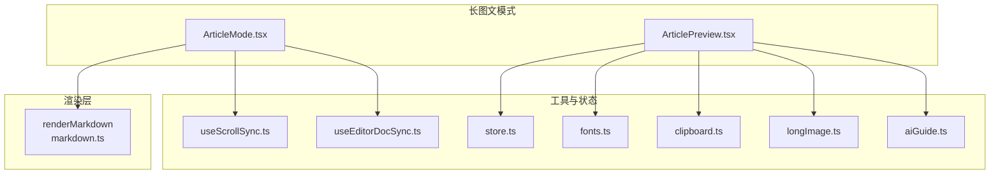
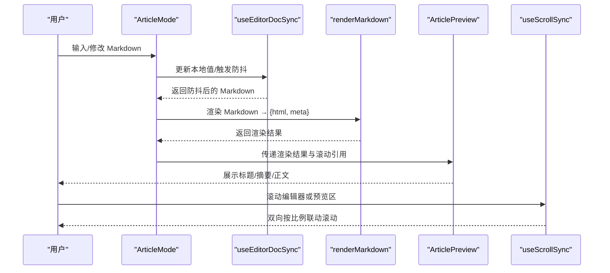
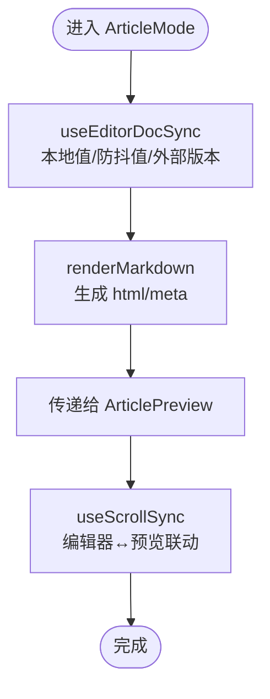
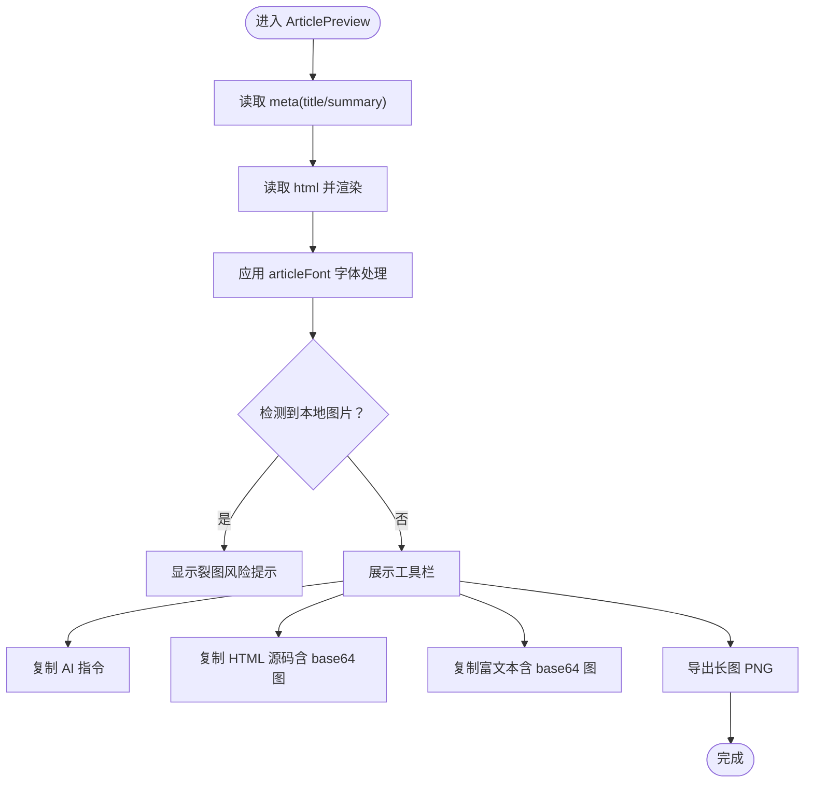
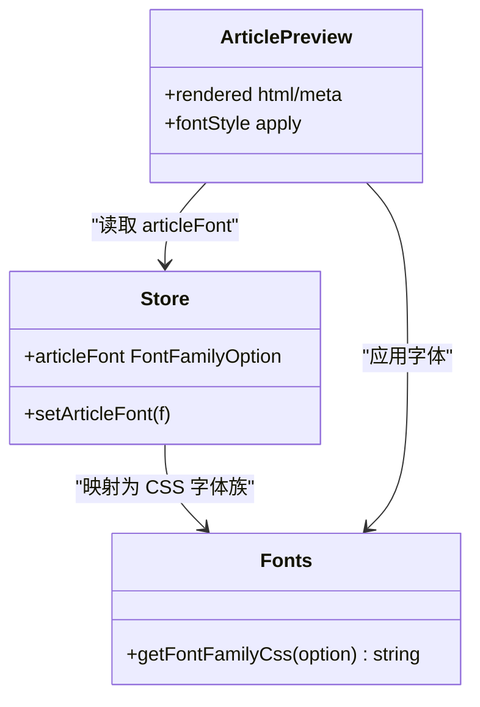
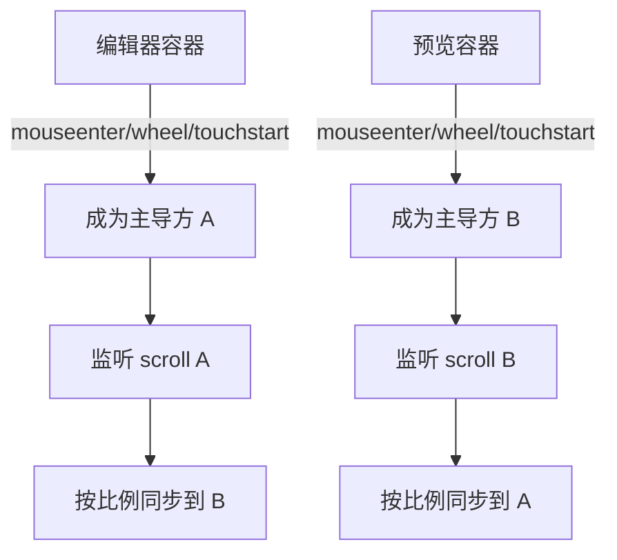
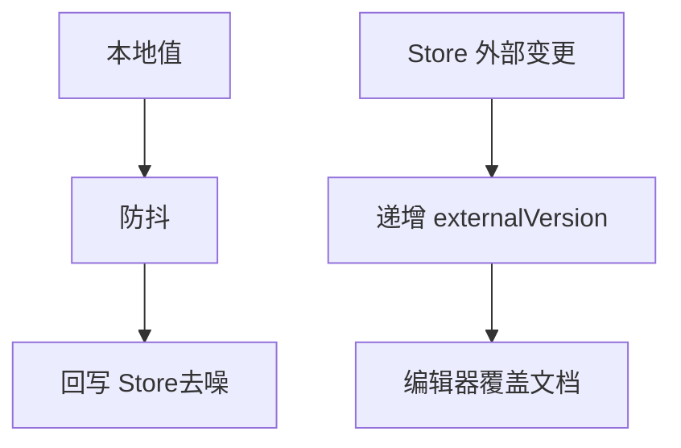
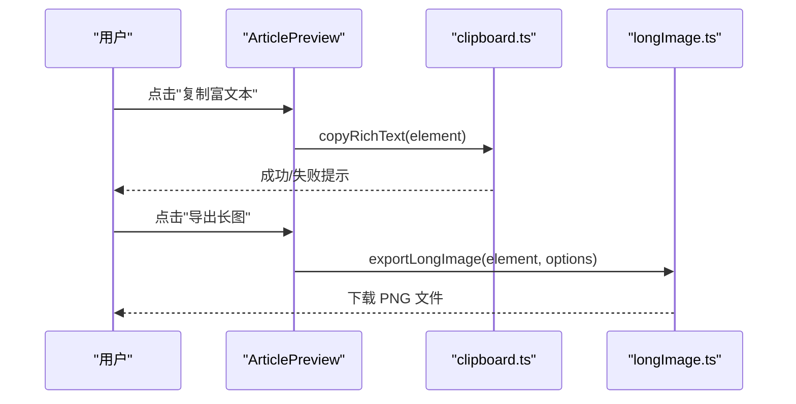
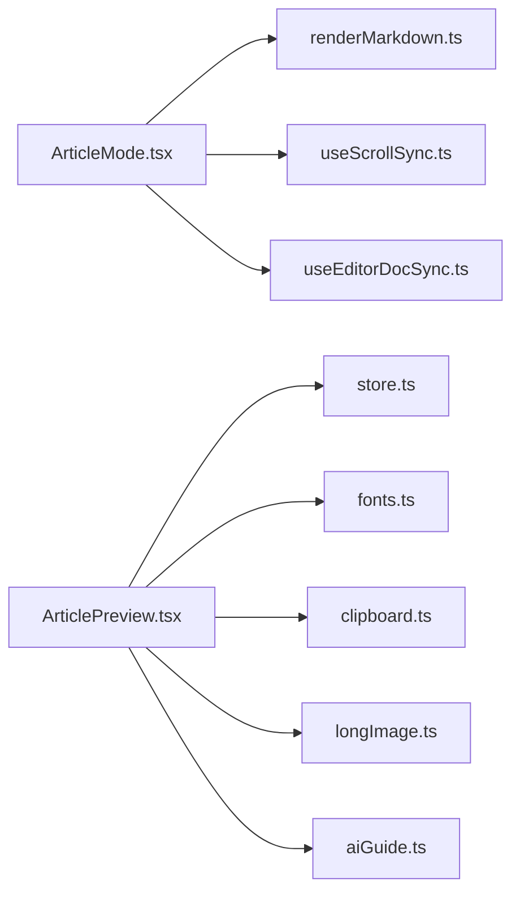

# 长图文编辑模式

<cite>
**本文引用的文件**
- [ArticleMode.tsx](file://src/modes/article/ArticleMode.tsx)
- [ArticlePreview.tsx](file://src/modes/article/ArticlePreview.tsx)
- [fonts.ts](file://src/lib/fonts.ts)
- [FontSelect.tsx](file://src/components/ui/FontSelect.tsx)
- [store.ts](file://src/lib/store.ts)
- [markdown.ts](file://src/lib/render/markdown.ts)
- [useScrollSync.ts](file://src/lib/useScrollSync.ts)
- [useEditorDocSync.ts](file://src/lib/useEditorDocSync.ts)
- [clipboard.ts](file://src/lib/clipboard.ts)
- [longImage.ts](file://src/lib/export/longImage.ts)
- [aiGuide.ts](file://src/lib/aiGuide.ts)
</cite>

## 更新摘要
**所做更改**
- 更新了字体系统章节，反映从动态字体选择到固定黑体系统字体栈的重构
- 新增了字体兼容性说明，特别强调微信公众号编辑器的兼容性考虑
- 更新了样式系统描述，说明固定字体栈的优势和跨平台一致性

## 目录
1. [简介](#简介)
2. [项目结构](#项目结构)
3. [核心组件](#核心组件)
4. [架构总览](#架构总览)
5. [详细组件分析](#详细组件分析)
6. [依赖关系分析](#依赖关系分析)
7. [性能考量](#性能考量)
8. [故障排查指南](#故障排查指南)
9. [结论](#结论)
10. [附录](#附录)

## 简介
长图文编辑模式旨在为公众号、知识长图与图文平台提供沉浸式长文创作体验。其通过"编辑器 + 实时预览"的双栏布局，结合滚动联动、防抖同步、富文本复制与长图导出能力，显著提升长文阅读与发布效率。该模式在渲染层面复用统一的 Markdown 解析内核，预览区具备标题/摘要元信息展示、字体处理、本地图片风险提示与多种复制/导出能力。

## 项目结构
长图文模式位于 src/modes/article 目录，包含两个核心文件：
- ArticleMode.tsx：长图文编辑器的容器与协调者，负责双向同步、滚动联动与渲染触发。
- ArticlePreview.tsx：长图文预览区，负责渲染结果展示、工具栏交互、复制与导出。

**图示来源**
- [ArticleMode.tsx:1-55](file://src/modes/article/ArticleMode.tsx#L1-L55)
- [ArticlePreview.tsx:1-163](file://src/modes/article/ArticlePreview.tsx#L1-L163)
- [markdown.ts:1-16](file://src/lib/render/markdown.ts#L1-L16)
- [useScrollSync.ts:1-68](file://src/lib/useScrollSync.ts#L1-L68)
- [useEditorDocSync.ts:1-50](file://src/lib/useEditorDocSync.ts#L1-L50)
- [store.ts:1-242](file://src/lib/store.ts#L1-L242)
- [fonts.ts:1-16](file://src/lib/fonts.ts#L1-L16)
- [clipboard.ts:1-131](file://src/lib/clipboard.ts#L1-L131)
- [longImage.ts:1-29](file://src/lib/export/longImage.ts#L1-L29)
- [aiGuide.ts:1-274](file://src/lib/aiGuide.ts#L1-L274)

**章节来源**
- [ArticleMode.tsx:1-55](file://src/modes/article/ArticleMode.tsx#L1-L55)
- [ArticlePreview.tsx:1-163](file://src/modes/article/ArticlePreview.tsx#L1-L163)

## 核心组件
- ArticleMode：双栏布局容器，负责：
  - 文档双向同步（本地输入防抖回写 + 外部变更信号）
  - 渲染触发（基于防抖 Markdown）
  - 滚动联动（编辑器与预览区按比例联动）
- ArticlePreview：预览容器，负责：
  - 标题/摘要元信息展示与复制
  - 渲染结果展示（含字体处理）
  - 本地图片风险提示
  - 复制富文本、HTML 源码、AI 指令
  - 导出长图（PNG）

**章节来源**
- [ArticleMode.tsx:16-54](file://src/modes/article/ArticleMode.tsx#L16-L54)
- [ArticlePreview.tsx:20-162](file://src/modes/article/ArticlePreview.tsx#L20-L162)

## 架构总览
长图文模式的运行流程如下：

**图示来源**
- [ArticleMode.tsx:16-54](file://src/modes/article/ArticleMode.tsx#L16-L54)
- [useEditorDocSync.ts:20-49](file://src/lib/useEditorDocSync.ts#L20-L49)
- [markdown.ts:9-15](file://src/lib/render/markdown.ts#L9-L15)
- [ArticlePreview.tsx:20-162](file://src/modes/article/ArticlePreview.tsx#L20-L162)
- [useScrollSync.ts:7-67](file://src/lib/useScrollSync.ts#L7-L67)

## 详细组件分析

### ArticleMode.tsx：编辑器容器与协调者
- 文档同步
  - 本地输入即时响应，防抖后回写 Store，避免频繁写入与回声干扰。
  - 外部变更通过版本号递增通知编辑器覆盖文档，确保一致性。
- 渲染与预览
  - 基于防抖 Markdown 调用渲染函数，得到 HTML 与元信息。
  - 将渲染结果传递给 ArticlePreview。
- 滚动联动
  - 通过滚动引用建立编辑器与预览区的联动，采用"主导方"策略避免相互拉扯。

**图示来源**
- [ArticleMode.tsx:16-54](file://src/modes/article/ArticleMode.tsx#L16-L54)
- [useEditorDocSync.ts:20-49](file://src/lib/useEditorDocSync.ts#L20-L49)
- [markdown.ts:9-15](file://src/lib/render/markdown.ts#L9-L15)
- [useScrollSync.ts:7-67](file://src/lib/useScrollSync.ts#L7-L67)

**章节来源**
- [ArticleMode.tsx:16-54](file://src/modes/article/ArticleMode.tsx#L16-L54)
- [useEditorDocSync.ts:15-49](file://src/lib/useEditorDocSync.ts#L15-L49)
- [useScrollSync.ts:3-67](file://src/lib/useScrollSync.ts#L3-L67)

### ArticlePreview.tsx：长图文预览与工具集
- 元信息展示与复制
  - 展示标题与摘要，并提供一键复制按钮。
- 渲染与字体处理
  - 从渲染结果提取 HTML，应用统一字体处理（固定黑体系统字体栈）。
  - 使用 store 中的 articleFont 状态控制字体族。
- 本地图片风险提示
  - 检测到本地图片（blob:/img://）且图床为本地时，提示"裂图"风险。
- 工具栏功能
  - 复制 AI 指令：将长图文排版指令复制到剪贴板，便于发给 AI。
  - 复制 HTML 源码：将图片编译为 base64 后复制，保留内联样式。
  - 复制富文本：将图片编译为 base64 后复制，可直接粘贴到公众号等编辑器。
  - 导出长图：将预览内容导出为 PNG（长图）。

**图示来源**
- [ArticlePreview.tsx:20-162](file://src/modes/article/ArticlePreview.tsx#L20-L162)
- [store.ts:63-64](file://src/lib/store.ts#L63-L64)
- [fonts.ts:3-15](file://src/lib/fonts.ts#L3-L15)
- [clipboard.ts:32-100](file://src/lib/clipboard.ts#L32-L100)
- [longImage.ts:16-28](file://src/lib/export/longImage.ts#L16-L28)

**章节来源**
- [ArticlePreview.tsx:20-162](file://src/modes/article/ArticlePreview.tsx#L20-L162)
- [store.ts:63-64](file://src/lib/store.ts#L63-L64)
- [fonts.ts:3-15](file://src/lib/fonts.ts#L3-L15)
- [clipboard.ts:32-100](file://src/lib/clipboard.ts#L32-L100)
- [longImage.ts:16-28](file://src/lib/export/longImage.ts#L16-L28)

### 字体系统与样式
**更新** 字体处理系统已重构为固定黑体系统字体栈，确保跨平台一致性

- 字体选项
  - 支持宋体、仿宋、黑体、霞鹜文楷四种字体族，通过 store.articleFont 控制。
  - **重要变更**：长图文模式现使用固定黑体系统字体栈，优先使用系统黑体，确保在微信公众号编辑器等平台的一致性表现。
- 样式应用
  - 预览区容器内联样式包含字号、行高、颜色、字体族、换行策略与背景色。
  - 固定字体栈确保在不同操作系统和浏览器环境下字体显示的稳定性。

**图示来源**
- [fonts.ts:1-16](file://src/lib/fonts.ts#L1-L16)
- [store.ts:63-64](file://src/lib/store.ts#L63-L64)
- [ArticlePreview.tsx:146-156](file://src/modes/article/ArticlePreview.tsx#L146-L156)

**章节来源**
- [fonts.ts:1-16](file://src/lib/fonts.ts#L1-L16)
- [store.ts:63-64](file://src/lib/store.ts#L63-L64)
- [ArticlePreview.tsx:146-156](file://src/modes/article/ArticlePreview.tsx#L146-L156)

### 滚动联动机制
- 主导方策略
  - 鼠标进入/滚轮/触摸时确定主导方，仅主导方滚动驱动另一方。
  - 使用 requestAnimationFrame 降低滚动计算频率，避免卡顿。
- 事件绑定与解绑
  - 组件卸载时清理事件监听与动画帧，防止内存泄漏。

**图示来源**
- [useScrollSync.ts:7-67](file://src/lib/useScrollSync.ts#L7-L67)

**章节来源**
- [useScrollSync.ts:3-67](file://src/lib/useScrollSync.ts#L3-L67)

### 文档双向同步与回写
- 本地值与防抖值
  - 本地值即时更新，防抖值用于渲染与回写，减少 Store 写入频率。
- 回写去噪
  - 通过记录最近一次写入值，避免回声导致的重复写入与丢字。
- 外部变更
  - 外部变更通过版本号递增通知编辑器覆盖文档，保证一致性。

**图示来源**
- [useEditorDocSync.ts:20-49](file://src/lib/useEditorDocSync.ts#L20-L49)

**章节来源**
- [useEditorDocSync.ts:15-49](file://src/lib/useEditorDocSync.ts#L15-L49)

### 复制与导出能力
- 复制富文本
  - 自动将本地图片（blob:/img://）编译为 base64，生成 HTML+纯文本的 ClipboardItem。
- 复制 HTML 源码
  - 将图片编译为 base64 后复制 HTML 字符串。
- 导出长图
  - 将预览内容转为 Blob 并下载 PNG 文件，支持缩放与背景色配置。

**图示来源**
- [ArticlePreview.tsx:50-66](file://src/modes/article/ArticlePreview.tsx#L50-L66)
- [clipboard.ts:64-100](file://src/lib/clipboard.ts#L64-L100)
- [longImage.ts:16-28](file://src/lib/export/longImage.ts#L16-L28)

**章节来源**
- [ArticlePreview.tsx:29-66](file://src/modes/article/ArticlePreview.tsx#L29-L66)
- [clipboard.ts:32-100](file://src/lib/clipboard.ts#L32-L100)
- [longImage.ts:16-28](file://src/lib/export/longImage.ts#L16-L28)

## 依赖关系分析
- 组件耦合
  - ArticleMode 依赖渲染、滚动同步与文档同步；ArticlePreview 依赖字体、剪贴板与导出工具。
- 外部依赖
  - 渲染依赖引擎解析器与元信息提取器。
  - 存储依赖 Zustand 与持久化中间件。
- 潜在循环依赖
  - 模式组件与工具模块之间为单向依赖，无循环导入迹象。

**图示来源**
- [ArticleMode.tsx:1-7](file://src/modes/article/ArticleMode.tsx#L1-L7)
- [ArticlePreview.tsx:1-9](file://src/modes/article/ArticlePreview.tsx#L1-L9)
- [markdown.ts:1-2](file://src/lib/render/markdown.ts#L1-L2)
- [store.ts:1-2](file://src/lib/store.ts#L1-L2)
- [fonts.ts:1](file://src/lib/fonts.ts#L1)
- [clipboard.ts:1](file://src/lib/clipboard.ts#L1)
- [longImage.ts:1](file://src/lib/export/longImage.ts#L1)
- [aiGuide.ts:1](file://src/lib/aiGuide.ts#L1)

**章节来源**
- [ArticleMode.tsx:1-7](file://src/modes/article/ArticleMode.tsx#L1-L7)
- [ArticlePreview.tsx:1-9](file://src/modes/article/ArticlePreview.tsx#L1-L9)

## 性能考量
- 渲染节流
  - 使用防抖策略减少渲染与回写频率，降低主线程压力。
- 滚动优化
  - 使用 requestAnimationFrame 与"主导方"策略，避免相互滚动引发的抖动与性能损耗。
- 图片处理
  - 复制富文本/HTML 时将本地图片编译为 base64，避免网络请求带来的延迟与失败。
- 字体加载
  - **更新**：使用固定黑体系统字体栈，优先使用系统字体资源，减少额外字体加载开销，提升跨平台兼容性。

## 故障排查指南
- 预览区滚动不同步
  - 检查滚动引用是否正确传递至 useScrollSync。
  - 确认主导方事件绑定是否生效（mouseenter/wheel/touchstart）。
- 复制富文本失败
  - 浏览器可能不支持 ClipboardItem API，系统会降级为 execCommand 方案。
  - 若仍失败，检查页面是否处于安全上下文（HTTPS）。
- 导出长图失败
  - 确认元素可见且内容完整。
  - 检查浏览器兼容性与权限设置。
- 本地图片在公众号"裂图"
  - 使用图床服务或手动上传，避免使用本地 blob/img:// 占位符。
- **新增** 字体显示异常
  - **更新**：确认目标设备是否安装了相应的系统字体，长图文模式使用固定黑体系统字体栈，优先使用系统黑体。

**章节来源**
- [useScrollSync.ts:43-66](file://src/lib/useScrollSync.ts#L43-L66)
- [clipboard.ts:77-99](file://src/lib/clipboard.ts#L77-L99)
- [ArticlePreview.tsx:99-106](file://src/modes/article/ArticlePreview.tsx#L99-L106)

## 结论
长图文编辑模式通过"编辑器 + 预览"的双栏设计、滚动联动与文档同步，实现了高效稳定的长文创作体验。其渲染内核统一、工具链完备（复制富文本、HTML 源码、AI 指令、长图导出），并针对本地图片风险与字体配置提供了实用的优化措施。**重要更新**：字体处理系统重构为固定黑体系统字体栈，显著提升了跨平台一致性，特别是微信公众号编辑器的兼容性。相比文档/卡片/HTML 模式，长图文模式更专注于社交平台与长图场景的阅读与发布需求。

## 附录

### 使用示例与最佳实践
- 内容组织
  - 使用 YAML frontmatter 提供标题与摘要，便于独立复制与平台展示。
  - 正文采用短段落、小标题与列表，配合步骤、时间线等组件提升可读性。
- 样式调整
  - **更新**：长图文模式使用固定黑体系统字体栈，无需手动选择字体，确保在微信公众号等平台的一致显示效果。
  - 避免在正文中写死颜色、字号与字体，统一使用主题色与系统字体。
- 性能优化
  - 减少一次性超长内容的输入，利用组件化结构提升渲染效率。
  - 复制富文本前确保图片已编译为 base64，避免粘贴后图片缺失。
- 与其他模式的区别
  - 文档模式：强调正式性与打印友好，禁用社交组件与强制分页。
  - 卡片模式：面向小红书等平台的分页图文卡片，强调封面与内容页的节奏。
  - HTML 模式：直接编辑 HTML，适合已有模板或高级定制场景。
  - 长图文模式：专注长文阅读体验与社交平台发布，提供复制/导出/字体等专用能力，**特别优化了跨平台字体兼容性**。

### 字体系统技术细节
**更新** 长图文模式的字体处理系统已重构为固定黑体系统字体栈

- 固定字体栈配置
  - 优先使用 -apple-system（macOS 系统默认黑体）
  - 其次使用 BlinkMacSystemFont（Chrome/macOS）
  - 支持 PingFang SC（iOS/macOS 苹方）
  - 支持 Microsoft YaHei（Windows 微软雅黑）
  - 支持 Helvetica Neue、Helvetica、Arial（通用无衬线字体）
- 兼容性优势
  - 确保在微信公众号编辑器中的稳定显示
  - 跨操作系统字体一致性
  - 减少字体加载时间和潜在的字体回退问题
- 迁移影响
  - 从动态字体选择迁移到固定字体栈
  - 用户界面中的字体选择控件仍然存在，但长图文模式将忽略用户选择，使用固定字体栈
  - 保持与其他模式的字体选择接口一致，便于维护

**章节来源**
- [fonts.ts:11-14](file://src/lib/fonts.ts#L11-L14)
- [FontSelect.tsx:4-9](file://src/components/ui/FontSelect.tsx#L4-L9)