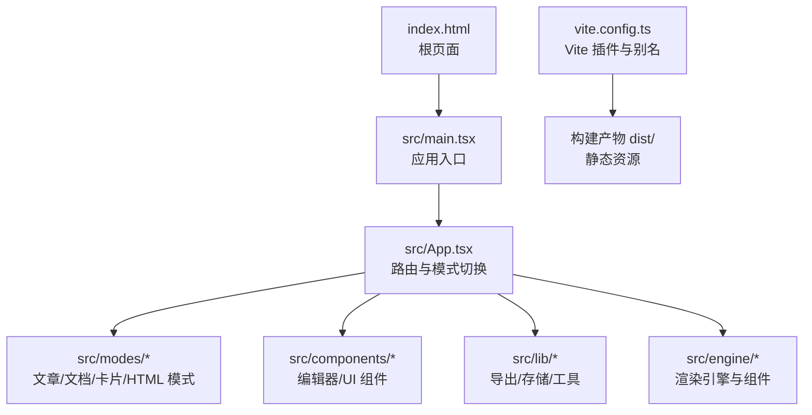
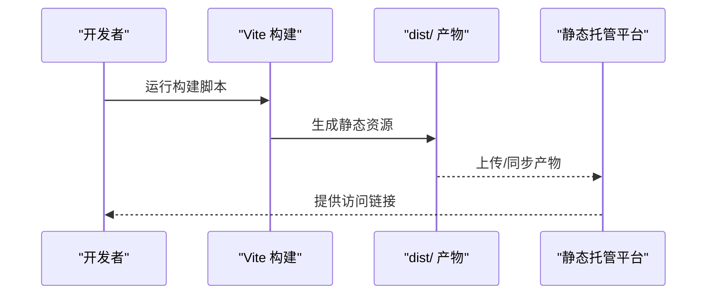
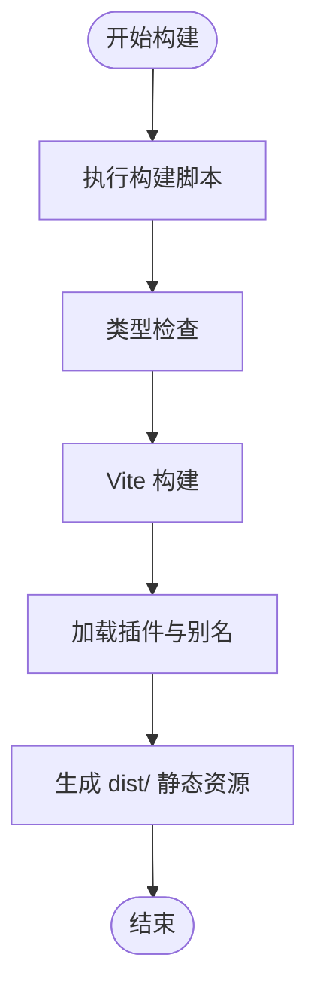
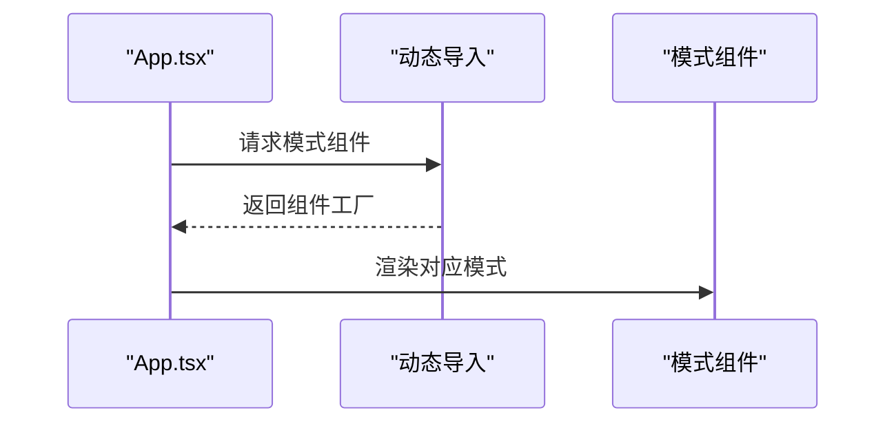
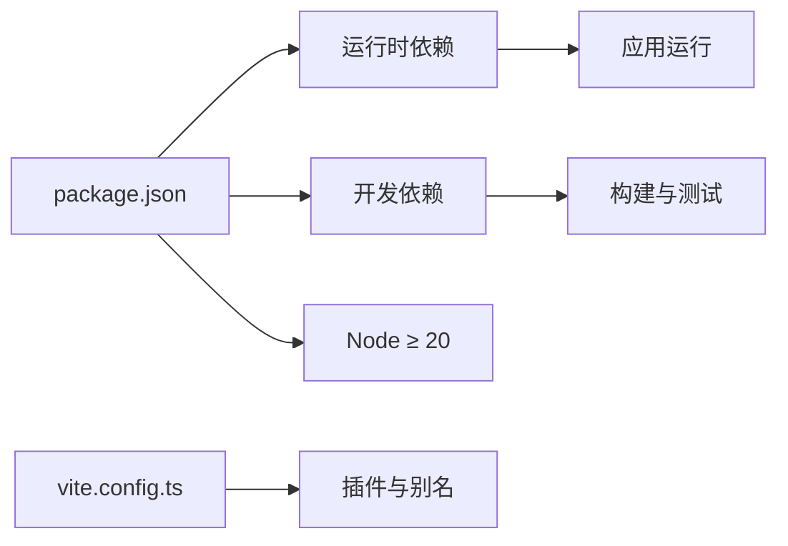

# 部署指南

<cite>
**本文引用的文件**
- [README.md](file://README.md)
- [package.json](file://package.json)
- [vite.config.ts](file://vite.config.ts)
- [index.html](file://index.html)
- [tsconfig.json](file://tsconfig.json)
- [vitest.config.ts](file://vitest.config.ts)
- [src/App.tsx](file://src/App.tsx)
- [src/main.tsx](file://src/main.tsx)
- [docs/技术架构设计.md](file://docs/技术架构设计.md)
</cite>

## 目录
1. [简介](#简介)
2. [项目结构](#项目结构)
3. [核心组件](#核心组件)
4. [架构总览](#架构总览)
5. [详细组件分析](#详细组件分析)
6. [依赖关系分析](#依赖关系分析)
7. [性能考量](#性能考量)
8. [故障排除指南](#故障排除指南)
9. [结论](#结论)
10. [附录](#附录)

## 简介
本指南面向生产环境部署 MarkFlow，目标是帮助你在不同平台上完成构建、优化与上线，涵盖以下要点：
- 生产构建流程与 Vite 配置优化
- 静态资源处理与缓存策略
- 平台选择与配置（Vercel、Netlify、GitHub Pages）
- CI/CD 流水线配置思路（测试、构建、部署）
- Docker 容器化部署方案
- 域名、HTTPS、CDN 加速设置
- 性能监控与缓存策略
- 部署后故障排除与回滚策略

## 项目结构
MarkFlow 是一个纯前端应用，基于 React 18 + TypeScript + Vite，采用模块化目录组织，核心入口为 index.html 与 src/main.tsx，构建产物输出到 dist/。

**图表来源**
- [index.html:1-15](file://index.html#L1-L15)
- [src/main.tsx:1-12](file://src/main.tsx#L1-L12)
- [src/App.tsx:1-172](file://src/App.tsx#L1-L172)
- [vite.config.ts:1-17](file://vite.config.ts#L1-L17)

**章节来源**
- [README.md:81-101](file://README.md#L81-L101)
- [index.html:1-15](file://index.html#L1-L15)
- [src/main.tsx:1-12](file://src/main.tsx#L1-L12)
- [vite.config.ts:1-17](file://vite.config.ts#L1-L17)

## 核心组件
- 应用入口与挂载：index.html 引入根节点与入口脚本，main.tsx 创建根实例并渲染 App。
- 应用主体：App.tsx 负责模式切换（文章/文档/卡片/HTML）与懒加载模式组件。
- 构建配置：vite.config.ts 配置 React 插件、Tailwind CSS 插件与路径别名，提升开发与构建效率。
- 类型与路径：tsconfig.json 使用 bundler 模式与路径映射，确保类型检查与别名解析一致。
- 测试配置：vitest.config.ts 保持与源码路径别名一致，便于单元测试。

**章节来源**
- [src/main.tsx:1-12](file://src/main.tsx#L1-L12)
- [src/App.tsx:1-172](file://src/App.tsx#L1-L172)
- [vite.config.ts:1-17](file://vite.config.ts#L1-L17)
- [tsconfig.json:1-28](file://tsconfig.json#L1-L28)
- [vitest.config.ts:1-16](file://vitest.config.ts#L1-L16)

## 架构总览
应用采用纯前端架构，构建产物为静态资源，可直接部署到任意静态站点托管平台。核心流程如下：

**图表来源**
- [README.md:70-75](file://README.md#L70-L75)
- [package.json:6-12](file://package.json#L6-L12)

## 详细组件分析

### 构建与优化配置
- 构建脚本：通过 package.json 的 scripts 定义开发、构建、预览与类型检查任务。
- Vite 配置：启用 React 与 Tailwind 插件，配置路径别名，减少模块解析成本。
- TypeScript：bundler 模式与路径映射，确保类型检查与运行时别名一致。
- 测试：vitest 配置与源码别名对齐，便于快速定位测试范围。

**图表来源**
- [package.json:6-12](file://package.json#L6-L12)
- [vite.config.ts:1-17](file://vite.config.ts#L1-L17)
- [tsconfig.json:1-28](file://tsconfig.json#L1-L28)
- [vitest.config.ts:1-16](file://vitest.config.ts#L1-L16)

**章节来源**
- [package.json:6-12](file://package.json#L6-L12)
- [vite.config.ts:1-17](file://vite.config.ts#L1-L17)
- [tsconfig.json:1-28](file://tsconfig.json#L1-L28)
- [vitest.config.ts:1-16](file://vitest.config.ts#L1-L16)

### 模式与懒加载
App.tsx 通过 React.lazy 动态导入各模式组件，配合 Suspense 提供加载占位，降低首屏体积与初次渲染压力。

**图表来源**
- [src/App.tsx:13-16](file://src/App.tsx#L13-L16)

**章节来源**
- [src/App.tsx:13-16](file://src/App.tsx#L13-L16)

### 静态资源与入口
- index.html 作为根页面，引入 CDN 字体与应用入口脚本。
- 构建后资源位于 dist/，静态托管平台通常以该目录为根。

**章节来源**
- [index.html:1-15](file://index.html#L1-L15)
- [README.md:70-75](file://README.md#L70-L75)

## 依赖关系分析
- 运行时依赖：React、React DOM、CodeMirror、KaTeX、Zustand、jsPDF、modern-screenshot 等。
- 开发依赖：Vite、React 插件、Tailwind、TypeScript、Vitest。
- Node 版本：要求 Node ≥ 20，建议 v24。

**图表来源**
- [package.json:13-42](file://package.json#L13-L42)
- [vite.config.ts:1-17](file://vite.config.ts#L1-L17)

**章节来源**
- [package.json:13-42](file://package.json#L13-L42)
- [README.md:46-54](file://README.md#L46-L54)

## 性能考量
- 代码分割与懒加载：通过 React.lazy 与动态导入，减少首屏 JS 体积。
- 构建优化：Vite 默认启用压缩与资源哈希命名，建议开启产物压缩与缓存控制。
- 字体与第三方资源：使用 CDN 引入字体，减少本地体积与首屏阻塞。
- 缓存策略：静态资源建议强缓存（如一年），HTML 采用协商缓存；版本变更通过文件名指纹实现失效。
- 性能监控：建议接入前端性能监控（如 Web Vitals），持续观测首屏时间与交互延迟。

[本节为通用指导，无需特定文件引用]

## 故障排除指南
- 构建失败（esbuild 权限）：根据 README 提示重建 esbuild。
- 类型检查错误：运行类型检查脚本定位问题。
- 测试失败：确保 vitest 别名与源码一致，修正测试范围。
- 预览异常：确认 dist 目录存在且托管路径正确。

**章节来源**
- [README.md:77-78](file://README.md#L77-L78)
- [vitest.config.ts:1-16](file://vitest.config.ts#L1-L16)

## 结论
MarkFlow 采用纯前端架构，构建产物为静态资源，可在多种静态托管平台快速上线。通过合理的构建配置、缓存策略与监控体系，可获得稳定的用户体验与高效的运维效率。

[本节为总结性内容，无需特定文件引用]

## 附录

### 生产环境构建流程
- 安装依赖与环境要求：满足 Node ≥ 20 与 pnpm ≥ 10。
- 运行构建脚本：生成 dist/ 静态资源。
- 本地预览：验证构建产物可用性。
- 上传至托管平台：将 dist/ 内容部署到目标平台。

**章节来源**
- [README.md:46-75](file://README.md#L46-L75)
- [package.json:6-12](file://package.json#L6-L12)

### 平台选择与配置

- Vercel
  - 推荐：支持静态站点、自动 HTTPS、边缘网络加速。
  - 配置要点：设置构建目录为 dist，保留 SPA 路由回退（如需）。
  - 域名与 HTTPS：在平台控制台绑定域名并启用自动证书。
  - CDN：Vercel 边缘网络自动加速。

- Netlify
  - 推荐：简单易用、自动 HTTPS、拖拽部署。
  - 配置要点：设置发布目录为 dist，配置函数/重定向（如需）。
  - 域名与 HTTPS：绑定域名并启用自动证书。
  - CDN：Netlify 全球 CDN。

- GitHub Pages
  - 推荐：开源友好、与仓库集成度高。
  - 配置要点：将 dist/ 推送到 gh-pages 分支或使用 Actions 自动部署。
  - 域名与 HTTPS：可绑定自定义域名并启用 GitHub Pages 自动证书。
  - CDN：GitHub Pages 使用 CDN。

[本节为通用平台配置说明，无需特定文件引用]

### CI/CD 流水线配置思路
- 触发条件：推送主分支或发布标签。
- 步骤建议：
  - 安装依赖（pnpm）
  - 类型检查
  - 单元测试
  - 生产构建
  - 产物上传（Artifacts 或静态托管）
  - 部署到目标平台（Vercel/Netlify/GitHub Pages）
- 缓存策略：缓存 pnpm store 与构建缓存，缩短流水线时间。
- 安全与密钥：敏感配置放入平台机密变量。

[本节为通用流水线设计，无需特定文件引用]

### Docker 容器化部署方案
- 镜像构建
  - 基础镜像：选择轻量级 Nginx 或 Caddy。
  - 构建阶段：在容器内执行安装依赖、类型检查、构建。
  - 运行阶段：将 dist/ 静态文件部署到 Nginx/Caddy 根目录。
- 运行配置
  - 端口：80（或 443 + 反向代理）
  - 健康检查：返回 200 的静态页面或 API。
  - 日志：stdout/stderr 输出到容器日志系统。
- 缓存与持久化：静态资源由容器内 Nginx 提供，无需持久卷。

[本节为通用容器化方案，无需特定文件引用]

### 域名、HTTPS 与 CDN 加速
- 域名：在托管平台绑定自定义域名。
- HTTPS：启用平台自动证书或上传自有证书。
- CDN：利用平台自带 CDN（Vercel/Netlify/GitHub Pages）或额外 CDN（如 Cloudflare）。

[本节为通用配置说明，无需特定文件引用]

### 缓存策略与性能监控
- 缓存策略：静态资源强缓存（如一年），HTML 协商缓存；版本变更通过文件名指纹。
- 性能监控：接入 Web Vitals 或平台自带性能监控，持续观测首屏与交互指标。

[本节为通用指导，无需特定文件引用]

### 部署后故障排除与回滚
- 常见问题：构建产物缺失、路由 404、字体加载失败。
- 回滚策略：保留上一个稳定版本的构建产物，回滚到上一个成功部署的版本。
- 监控告警：设置健康检查与错误率阈值告警，及时发现异常。

[本节为通用运维指导，无需特定文件引用]