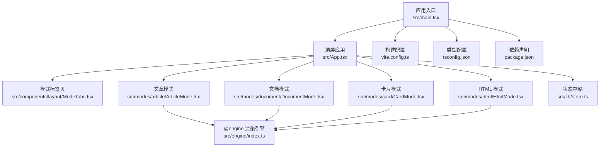
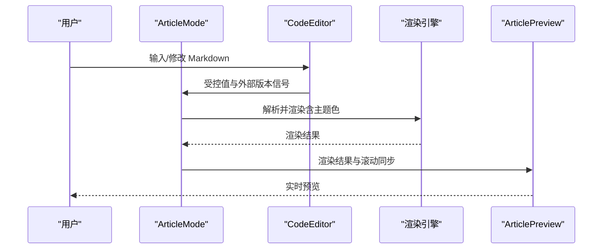
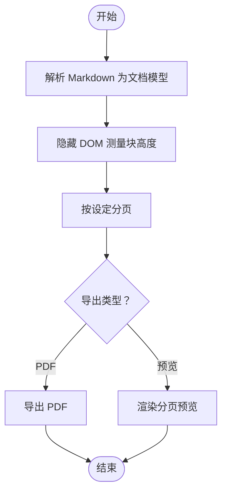
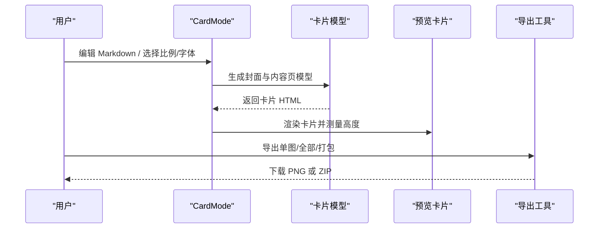
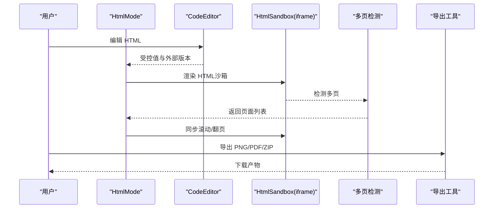
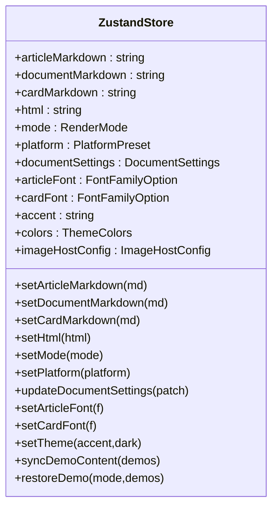
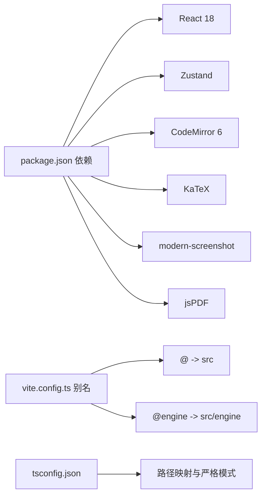

# 项目概述

<cite>
**本文引用的文件**
- [package.json](file://package.json)
- [vite.config.ts](file://vite.config.ts)
- [tsconfig.json](file://tsconfig.json)
- [src/main.tsx](file://src/main.tsx)
- [src/App.tsx](file://src/App.tsx)
- [src/components/layout/ModeTabs.tsx](file://src/components/layout/ModeTabs.tsx)
- [src/modes/article/ArticleMode.tsx](file://src/modes/article/ArticleMode.tsx)
- [src/modes/document/DocumentMode.tsx](file://src/modes/document/DocumentMode.tsx)
- [src/modes/card/CardMode.tsx](file://src/modes/card/CardMode.tsx)
- [src/modes/html/HtmlMode.tsx](file://src/modes/html/HtmlMode.tsx)
- [src/engine/index.ts](file://src/engine/index.ts)
- [src/lib/store.ts](file://src/lib/store.ts)
- [docs/技术架构设计.md](file://docs/技术架构设计.md)
- [docs/技术路线图.md](file://docs/技术路线图.md)
</cite>

## 目录
1. [引言](#引言)
2. [项目结构](#项目结构)
3. [核心组件](#核心组件)
4. [架构总览](#架构总览)
5. [详细组件分析](#详细组件分析)
6. [依赖关系分析](#依赖关系分析)
7. [性能考量](#性能考量)
8. [故障排查指南](#故障排查指南)
9. [结论](#结论)
10. [附录](#附录)

## 引言
MarkFlow 是一个“纯前端、零后端”的多场景内容渲染与导出工作台，旨在用同一份 Markdown/HTML 内容，一键生成面向不同受众与平台的成品形态：长图文、A4 正式文档、社交分页图文卡片、以及自由画布风格的 HTML 页面。项目通过 React 18 + TypeScript + Vite 的现代技术栈，结合轻量状态管理与可插拔的渲染引擎，提供流畅的编辑体验与高质量的导出能力。

## 项目结构
项目采用按“场景/模式”分层的目录组织方式，核心模块包括：
- 应用入口与顶层路由：App 负责模式切换与状态注入
- 场景模式：article、document、card、html 四大模式各自独立实现
- 渲染引擎：与框架无关的纯 TS 引擎，负责解析与渲染
- 状态管理：Zustand + localStorage 的轻量持久化
- 构建与工具：Vite + TailwindCSS + CodeMirror + KaTeX 等

**图表来源**
- [src/main.tsx:1-12](file://src/main.tsx#L1-L12)
- [src/App.tsx:1-172](file://src/App.tsx#L1-L172)
- [src/components/layout/ModeTabs.tsx:1-42](file://src/components/layout/ModeTabs.tsx#L1-L42)
- [src/modes/article/ArticleMode.tsx:1-55](file://src/modes/article/ArticleMode.tsx#L1-L55)
- [src/modes/document/DocumentMode.tsx:1-345](file://src/modes/document/DocumentMode.tsx#L1-L345)
- [src/modes/card/CardMode.tsx:1-364](file://src/modes/card/CardMode.tsx#L1-L364)
- [src/modes/html/HtmlMode.tsx:1-579](file://src/modes/html/HtmlMode.tsx#L1-L579)
- [src/engine/index.ts:1-16](file://src/engine/index.ts#L1-L16)
- [src/lib/store.ts:1-242](file://src/lib/store.ts#L1-L242)
- [vite.config.ts:1-17](file://vite.config.ts#L1-L17)
- [tsconfig.json:1-28](file://tsconfig.json#L1-L28)
- [package.json:1-52](file://package.json#L1-L52)

**章节来源**
- [src/main.tsx:1-12](file://src/main.tsx#L1-L12)
- [src/App.tsx:34-171](file://src/App.tsx#L34-L171)
- [vite.config.ts:1-17](file://vite.config.ts#L1-L17)
- [tsconfig.json:1-28](file://tsconfig.json#L1-L28)
- [package.json:1-52](file://package.json#L1-L52)

## 核心组件
- 应用壳层：顶层 App 负责模式切换、示例内容同步、主题与平台设置、以及各模式的懒加载渲染。
- 模式标签：ModeTabs 提供四种模式的切换入口，直观标识当前工作场景。
- 渲染引擎：@engine 提供解析、内联格式、数学公式、代码块、组件映射与主题色彩体系。
- 状态中心：Zustand store 统一管理 Markdown/HTML 输入、模式、平台、字体、主题、图床配置与持久化。
- 构建与工具：Vite 提供开发与构建，TailwindCSS 提供原子化样式，CodeMirror 6 提供高性能编辑器，KaTeX 支持数学公式渲染。

**章节来源**
- [src/App.tsx:34-171](file://src/App.tsx#L34-L171)
- [src/components/layout/ModeTabs.tsx:8-13](file://src/components/layout/ModeTabs.tsx#L8-L13)
- [src/engine/index.ts:1-16](file://src/engine/index.ts#L1-L16)
- [src/lib/store.ts:54-92](file://src/lib/store.ts#L54-L92)
- [vite.config.ts:1-17](file://vite.config.ts#L1-L17)
- [package.json:13-31](file://package.json#L13-L31)

## 架构总览
系统围绕“输入与 AI 指令层、共享渲染内核层、场景适配层、配置与模板层、导出与复制层”五层组织，形成高内聚、低耦合的多场景渲染工作台。

```mermaid
graph TB
subgraph "输入与 AI 指令层"
E1["编辑器组件<br/>CodeEditor.tsx"]
E2["设置与图床<br/>SettingsModal.tsx"]
end
subgraph "共享渲染内核层"
R1["@engine 渲染引擎<br/>markdownParser.ts / inlineFormat.ts / math.ts / codeBlock.ts"]
end
subgraph "场景适配层"
S1["长图文模式<br/>ArticleMode.tsx"]
S2["A4 文档模式<br/>DocumentMode.tsx"]
S3["社交卡片模式<br/>CardMode.tsx"]
S4["自由画布模式<br/>HtmlMode.tsx"]
end
subgraph "配置与模板层"
C1["Zustand Store<br/>store.ts"]
end
subgraph "导出与复制层"
O1["图片导出<br/>exportImage.ts"]
O2["PDF 导出<br/>exportPdf.ts"]
O3["ZIP 打包<br/>export/zipDownload.ts"]
end
E1 --> R1
E2 --> C1
R1 --> S1
R1 --> S2
R1 --> S3
R1 --> S4
C1 --> S1
C1 --> S2
C1 --> S3
C1 --> S4
S1 --> O1
S2 --> O2
S3 --> O1
S3 --> O3
S4 --> O1
S4 --> O2
S4 --> O3
```

**图表来源**
- [src/modes/article/ArticleMode.tsx:1-55](file://src/modes/article/ArticleMode.tsx#L1-L55)
- [src/modes/document/DocumentMode.tsx:1-345](file://src/modes/document/DocumentMode.tsx#L1-L345)
- [src/modes/card/CardMode.tsx:1-364](file://src/modes/card/CardMode.tsx#L1-L364)
- [src/modes/html/HtmlMode.tsx:1-579](file://src/modes/html/HtmlMode.tsx#L1-L579)
- [src/engine/index.ts:1-16](file://src/engine/index.ts#L1-L16)
- [src/lib/store.ts:1-242](file://src/lib/store.ts#L1-L242)

**章节来源**
- [docs/技术架构设计.md:1-39](file://docs/技术架构设计.md#L1-L39)

## 详细组件分析

### 长图文模式（文章）
- 功能定位：面向公众号、知乎等长文平台的排版与渲染，支持标题/摘要提取、滚动联动、富文本/HTML 复制、长图导出。
- 关键流程：编辑器与预览区双向同步，使用渲染引擎解析 Markdown 并注入主题色，实时预览。
- 适用场景：需要强调阅读体验与排版一致性的长文内容创作。

**图表来源**
- [src/modes/article/ArticleMode.tsx:16-54](file://src/modes/article/ArticleMode.tsx#L16-L54)
- [src/engine/index.ts:1-16](file://src/engine/index.ts#L1-L16)

**章节来源**
- [src/modes/article/ArticleMode.tsx:1-55](file://src/modes/article/ArticleMode.tsx#L1-L55)

### A4 文档模式（正式文档）
- 功能定位：固定 A4 比例与页眉页脚，基于隐藏 DOM 实测高度的精确自动分页，支持字体、字号、标题居中/首行缩进等排版选项，导出 PDF。
- 关键流程：解析 Markdown 为文档模型，测量块高度，按设定分页，最终导出 PDF。
- 适用场景：报告、论文、手册等正式文档的快速排版与导出。

**图表来源**
- [src/modes/document/DocumentMode.tsx:56-129](file://src/modes/document/DocumentMode.tsx#L56-L129)

**章节来源**
- [src/modes/document/DocumentMode.tsx:1-345](file://src/modes/document/DocumentMode.tsx#L1-L345)

### 社交卡片模式（小红书卡片）
- 功能定位：3:4 / 9:16 等比例画布，封面图 + 多页内容图，统一留白与品牌信息，支持导出 PNG、批量导出与 ZIP 打包，复制发布文案与 AI 指令。
- 关键流程：根据 Markdown 与平台参数生成卡片模型，测量高度，渲染封面与内容页，导出单图/批量/压缩包。
- 适用场景：社交媒体图文内容的快速生成与批量导出。

**图表来源**
- [src/modes/card/CardMode.tsx:80-144](file://src/modes/card/CardMode.tsx#L80-L144)
- [src/modes/card/CardMode.tsx:146-214](file://src/modes/card/CardMode.tsx#L146-L214)

**章节来源**
- [src/modes/card/CardMode.tsx:1-364](file://src/modes/card/CardMode.tsx#L1-L364)

### 自由画布模式（HTML 可视化）
- 功能定位：HTML 编辑与 iframe 沙箱预览，支持多页识别与翻页、自适应缩放、高保真截图与 PDF 导出、Prompt 指令库复制。
- 关键流程：编辑器与 iframe 同步滚动，检测多页并提供键盘/滚轮翻页，按需导出 PNG/PDF/ZIP。
- 适用场景：AI 生成的复杂布局、报告、海报、幻灯片等自由画布场景。

**图表来源**
- [src/modes/html/HtmlMode.tsx:104-165](file://src/modes/html/HtmlMode.tsx#L104-L165)
- [src/modes/html/HtmlMode.tsx:346-453](file://src/modes/html/HtmlMode.tsx#L346-L453)

**章节来源**
- [src/modes/html/HtmlMode.tsx:1-579](file://src/modes/html/HtmlMode.tsx#L1-L579)

### 应用壳层与状态管理
- 应用壳层：App 负责模式懒加载、示例内容同步、主题切换、图床设置弹窗与 Toast 反馈。
- 状态管理：Zustand store 统一管理 Markdown/HTML、模式、平台、字体、主题、图床配置与持久化，支持版本驱动的示例同步与“脏标记”保护用户内容。

**图表来源**
- [src/lib/store.ts:54-92](file://src/lib/store.ts#L54-L92)

**章节来源**
- [src/App.tsx:34-171](file://src/App.tsx#L34-L171)
- [src/lib/store.ts:1-242](file://src/lib/store.ts#L1-L242)

## 依赖关系分析
- 技术栈：React 18、TypeScript、Vite、TailwindCSS、CodeMirror 6、KaTeX、Zustand、modern-screenshot、jsPDF。
- 构建别名：@ 指向 src，@engine 指向 src/engine，便于跨层引用。
- 类型与模块解析：bundler 分辨、路径映射、严格类型检查，确保开发体验与运行时稳定性。

**图表来源**
- [package.json:13-31](file://package.json#L13-L31)
- [vite.config.ts:9-15](file://vite.config.ts#L9-L15)
- [tsconfig.json:19-24](file://tsconfig.json#L19-L24)

**章节来源**
- [package.json:13-31](file://package.json#L13-L31)
- [vite.config.ts:1-17](file://vite.config.ts#L1-L17)
- [tsconfig.json:1-28](file://tsconfig.json#L1-L28)

## 性能考量
- 模式懒加载：四大模式均采用动态导入，减少首屏体积与加载时间。
- 编辑器与预览同步：使用受控值与外部版本信号，配合防抖与滚动同步，降低重绘压力。
- 隐藏 DOM 测量：仅在必要时进行高度测量与分页计算，避免主线程阻塞。
- 导出链路统一：统一使用截图 + PDF 渲染，保证视觉一致性与质量。
- 构建优化：按需加载 CodeMirror 语言包，裁剪常用集合，控制首包体积。

**章节来源**
- [src/App.tsx:13-16](file://src/App.tsx#L13-L16)
- [src/modes/document/DocumentMode.tsx:66-125](file://src/modes/document/DocumentMode.tsx#L66-L125)
- [docs/技术路线图.md:12-20](file://docs/技术路线图.md#L12-L20)

## 故障排查指南
- 预览未就绪或导出失败：检查 iframe 是否加载完成，确认沙箱环境与跨域限制。
- 滚动不同步：确认编辑器与预览容器的 ready 状态与 ref 设置。
- 字体或公式渲染异常：检查 KaTeX 与字体资源加载情况，确认主题色与 CSS 变量生效。
- 导出 PNG/PDF/ZIP 失败：确认截图工具与 PDF 渲染流程调用顺序，捕获并上报错误信息。
- 示例内容未更新：确认 demoVersion 与 dirty 标记逻辑，避免覆盖用户已编辑内容。

**章节来源**
- [src/modes/html/HtmlMode.tsx:115-165](file://src/modes/html/HtmlMode.tsx#L115-L165)
- [src/modes/html/HtmlMode.tsx:346-453](file://src/modes/html/HtmlMode.tsx#L346-L453)
- [src/lib/store.ts:194-214](file://src/lib/store.ts#L194-L214)

## 结论
MarkFlow 以“同一内容、多种形态”的理念，通过 React 18 + TypeScript + Vite 的现代技术栈与可插拔渲染引擎，实现了长图文、A4 文档、社交卡片与自由画布四大场景的高效创作与导出。项目坚持纯前端、零后端，持续优化导出链路与体积控制，为内容创作者提供即开即用的一站式工作台。

## 附录

### 快速开始指南
- 安装与启动
  - 使用包管理器安装依赖后，运行开发服务器，即可在浏览器中访问应用。
  - 构建命令用于类型检查与打包，预览命令用于本地验证构建产物。
- 基本使用
  - 通过顶部模式标签切换至目标场景（A4 文档、长图文、分页图文、自由画布）。
  - 在对应编辑器中输入 Markdown 或 HTML，实时预览渲染效果。
  - 使用工具栏导出 PNG/PDF/ZIP，或复制富文本/HTML。
  - 通过图床设置配置图片上传，或使用内置示例内容快速上手。

**章节来源**
- [package.json:6-11](file://package.json#L6-L11)
- [src/App.tsx:89-111](file://src/App.tsx#L89-L111)

### 项目背景、历程与未来规划
- 背景：面向多平台内容创作需求，统一内容来源，提升生产效率与成品一致性。
- 发展历程：完成四大模式闭环，统一导出链路，优化体积与交互体验。
- 未来规划：增强 A4 文档配置、扩展 HTML 指令场景、探索 PWA 支持等。

**章节来源**
- [docs/技术路线图.md:1-37](file://docs/技术路线图.md#L1-L37)